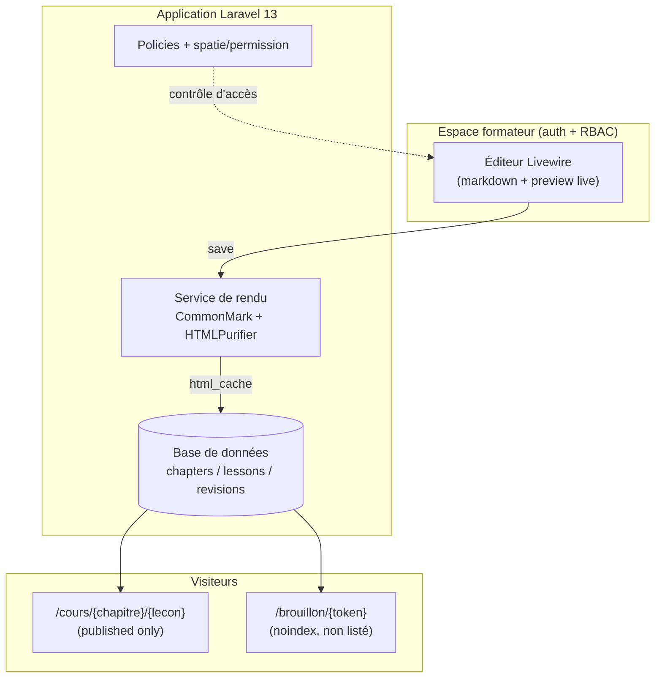
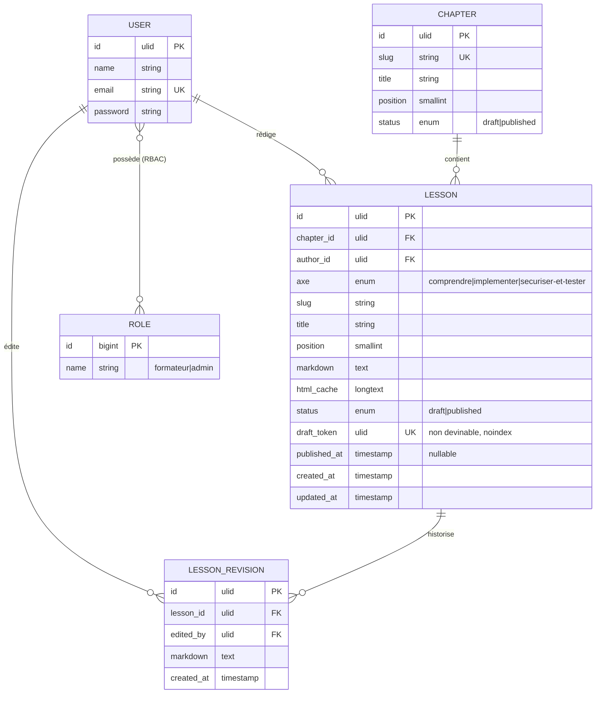
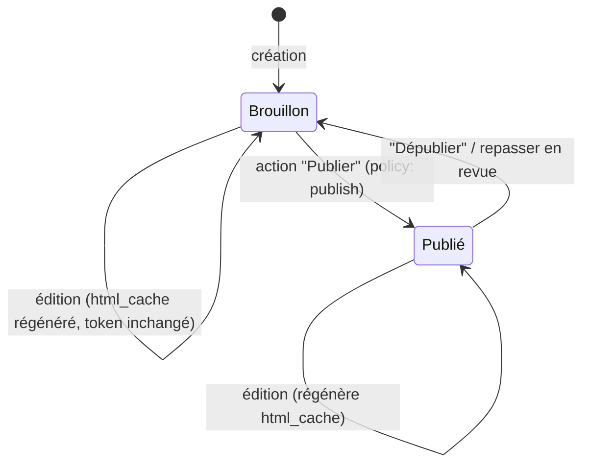

 
# OmnyLearn CMS — Blueprint de démarrage
 
> Ce document est un **plan d'architecture de départ**, pas du code généré. Il fixe le périmètre minimal, le modèle de données, le cycle brouillon → publication, la sécurité et les premières commandes. Objectif : savoir **où commencer** sans se peindre dans un coin.
 
---
 
## 1. Décisions verrouillées (rappel)
 
| Décision | Choix retenu |
|---|---|
| Architecture | Application **dynamique TALL** (Laravel + Livewire + Tailwind v4 + Flux) |
| Auteurs | **Toi seul aujourd'hui**, ouverture future à des formateurs externes → **RBAC + Policies dès le départ** |
| Lien brouillon | **URL stable non devinable** (token ULID, `noindex`, hors sitemap) ; le contenu se met à jour, l'URL reste partageable |
 
Conséquence directe : même en solo, on conçoit la sécurité (assainissement HTML, rôles, policies) **dès la première ligne**, parce que l'ouverture à des tiers est planifiée. Rétro-ajouter de la sécurité coûte toujours plus cher que la prévoir.
 
---
 
## 2. Stack et versions (vérifiées en juin 2026)
 
| Composant | Version cible | Statut vérifié |
|---|---|---|
| PHP | 8.4 | Laravel 13 exige 8.3 min, supporte 8.4 |
| Laravel | 13.x | Sorti le 17 mars 2026, zéro breaking change depuis L12 |
| Livewire | 4.x | Stable, supporté par Flux (v3.7.4 ou v4.0) |
| Flux UI | 2.15+ | Requiert Laravel 10+, Livewire 3.5+/4, **Tailwind v4+** |
| Tailwind CSS | 4.x | Requis par Flux ; config CSS-first (`@import "tailwindcss"`, `@theme`) |
| Base de données | SQLite (dev) → PostgreSQL/MariaDB (prod) | — |
| Rendu markdown | `league/commonmark` | Standard, maintenu |
| Assainissement HTML | `ezyang/htmlpurifier` (ou liste blanche CommonMark) | Anti-XSS stocké |
| RBAC | `spatie/laravel-permission` | Standard, maintenu |
 
Note de prudence : si tu démarres aujourd'hui, ce stack est cohérent et disponible. Garde un fichier de versions épinglées (`composer.lock`, `.nvmrc`) pour un build reproductible.
 
---
 
## 3. Périmètre du MVP (tranche verticale, pas horizontale)
 
Ne construis pas tout le CMS d'un coup. Vise **une tranche verticale fonctionnelle** : une seule leçon qu'on peut éditer, prévisualiser en brouillon, puis publier. Tout le reste (multi-chapitres, médias, recherche) vient après.
 
MVP =
 
1. Authentification formateur (un compte, rôle `formateur`).
2. CRUD minimal d'une `lesson` (markdown brut).
3. Rendu serveur markdown → HTML **assaini**, mis en cache au save.
4. Page brouillon `/brouillon/{token}` (rendu quel que soit le statut, `noindex`).
5. Page publique `/cours/{chapitre}/{lecon}` (published uniquement, 404 sinon).
6. Bouton « Publier » qui fait passer `draft → published`.
Si cette boucle tourne, le reste n'est que de l'extension.
 
---
 
## 4. Architecture cible (vue d'ensemble)
 

 
Principe clé : **le markdown est rendu une fois au save** (pas à chaque affichage), stocké dans `html_cache`. L'affichage public sert du HTML déjà assaini et mis en cache — performant et sûr.
 
---
 
## 5. Modèle de données — MCD (Merise / notation entité-association)
 

 
Choix justifiés :
 
- **`draft_token` (ULID, unique)** : c'est le lien de partage non devinable. ULID = trié dans le temps, 128 bits, non séquentiel devinable comme un `id` auto-incrémenté. Génération : `Str::ulid()`.
- **`html_cache`** : évite de re-rendre/assainir à chaque requête. Régénéré uniquement au save.
- **`axe`** : reprend exactement ta structure OmnyLearn (`comprendre` / `implementer` / `securiser-et-tester`).
- **`LESSON_REVISION`** : historique d'édition. Indispensable dès qu'il y aura plusieurs auteurs (audit, rollback). Léger à mettre en place tôt, pénible à rétro-ajouter.
- **RBAC via `spatie/laravel-permission`** : ne réinvente pas les rôles à la main.
---
 
## 6. Cycle brouillon → publication (machine d'état)
 

 
Règles :
 
- En **Brouillon** : visible uniquement via `/brouillon/{token}`. La page publique renvoie **404**.
- En **Publié** : visible sur l'URL publique. Le lien brouillon reste valide (utile pour prévisualiser une future modif).
- Le **token ne change pas** à chaque édition (décision verrouillée). Prévoir plus tard un bouton « Régénérer le lien de partage » qui réécrit `draft_token` à la demande.
- Au save : régénérer `html_cache`, créer une `LESSON_REVISION`.
---
 
## 7. RBAC et Policies (dès le départ)
 
Même en solo, pose les fondations :
 
- Rôles : `admin` (tout), `formateur` (gère ses propres leçons).
- `LessonPolicy` :
  - `update` : auteur de la leçon **ou** admin.
  - `publish` : admin (ou formateur selon ta règle — à décider).
  - `view` (brouillon) : possession du token suffit pour la preview partageable ; l'espace d'**édition** exige l'auth + le rôle.
Décision à prendre maintenant : la page `/brouillon/{token}` est-elle **publique avec token** (partageable à un relecteur non connecté) ou **réservée aux connectés** ? Recommandation : publique-avec-token + `noindex`, car ton besoin initial est « partager une preview sans qu'on tombe dessus par accident ». Si la confidentialité doit être plus forte plus tard, ajoute une auth devant le token.
 
---
 
## 8. Sécurité du rendu markdown — le risque n°1
 
C'est le point dur. Ton markdown OmnyLearn **contient du HTML brut** (`<small>`, tableaux, blocs). Rendre du HTML écrit par un humain = risque de **XSS stocké** dès qu'un auteur n'est pas pleinement de confiance (ce qui est ton scénario futur).
 
| Élément | Attendu |
|---|---|
| Risque | Injection de `<script>` / attributs `onerror` via le markdown d'un formateur → exécution dans le navigateur des apprenants (vol de session, défacement). |
| Préconditions | Rendu HTML non assaini + auteur semi-confiance + balises/attributs autorisés. |
| Impact | Compromission de comptes apprenants/formateurs, atteinte à l'image, potentielle rebond vers l'admin. |
| Détection | Revue de contenu, CSP en `report-only` (remontée des violations), tests automatisés de payloads connus. |
| Correction | Pipeline `CommonMark` → **HTMLPurifier** (liste blanche de balises/attributs) avant stockage dans `html_cache`. |
| Prévention | CSP stricte, `html_cache` assaini au save, workflow de validation avant publication, rôles limités. |
 
Pipeline recommandé au save : `markdown → CommonMarkConverter (html_input: strip ou escape pour le HTML non maîtrisé) → HTMLPurifier (whitelist) → html_cache`. Mermaid et la coloration syntaxique se gèrent **côté client** sur du HTML déjà assaini, pas en injectant du HTML arbitraire.
 
Autres durcissements : en-têtes de sécurité (tu en as déjà dans `netlify.toml` — à reporter côté app via middleware), CSP, rate limiting sur l'auth, validation stricte des entrées, CSRF (géré par Livewire).
 
---
 
## 9. Démarrage pas-à-pas
 
```bash
# 1. Créer le projet (vérifier que l'installeur cible bien Laravel 13)
composer create-project laravel/laravel omnylearn-cms
cd omnylearn-cms
 
# 2. Stack TALL + dépendances clés
composer require livewire/livewire
composer require livewire/flux            # Flux (free) ; Flux Pro = licence
composer require spatie/laravel-permission
composer require league/commonmark
composer require ezyang/htmlpurifier
 
# 3. Front : Tailwind v4 (config CSS-first, PAS de tailwind.config.js v3)
npm install
npm install tailwindcss @tailwindcss/vite
# app.css : @import "tailwindcss";  +  @import "../../vendor/livewire/flux/dist/flux.css";
 
# 4. Base de données (SQLite pour démarrer)
touch database/database.sqlite
# .env : DB_CONNECTION=sqlite
 
# 5. Migrations : chapters, lessons, lesson_revisions + spatie
php artisan vendor:publish --provider="Spatie\Permission\PermissionServiceProvider"
php artisan make:model Chapter -m
php artisan make:model Lesson -m
php artisan make:model LessonRevision -m
php artisan make:policy LessonPolicy --model=Lesson
 
# 6. Premier composant éditeur
php artisan make:livewire Lessons/Editor
 
# 7. Lancer
php artisan migrate --seed
composer run dev   # (ou php artisan serve + npm run dev)
```
 
Ordre de construction conseillé (tranche verticale) :
 
1. Migrations + modèles + relations.
2. Service `MarkdownRenderer` (CommonMark + HTMLPurifier) + test unitaire avec un payload XSS.
3. Composant Livewire `Editor` (textarea markdown + preview).
4. Routes : `/brouillon/{token}` et `/cours/{chapitre}/{lecon}`.
5. Policy + rôles (seed `admin`, `formateur`).
6. Bouton « Publier ».
---
 
## 10. Risques et limites à garder en tête
 
- **XSS stocké** (cf. §8) : le risque structurel n°1 dès l'ouverture à des tiers. Ne pas le repousser.
- **Hébergement** : une app dynamique exige un serveur PHP (VPS, Laravel Forge/Cloud). Ce n'est plus du statique Netlify gratuit. Prévoir le coût et l'exploitation (sauvegardes BDD, mises à jour).
- **Migration du contenu existant** : tes 195 leçons OmnyLearn + le corpus omnydocs devront être importés (script d'ingestion markdown → table `lessons`). À scripter, pas à recopier à la main.
- **Sur-ingénierie** : ne construis pas un CMS générique. Reste sur ton besoin (cours, axes, brouillon/publication). YAGNI.
- **Versions de pointe** : Laravel 13 / Livewire 4 sont récents. Surveille les correctifs et évite de dépendre de packages tiers non encore compatibles Livewire 4.
---
 
## 11. Prochaines itérations (après le MVP)
 
- Import automatisé du contenu markdown existant (OmnyLearn + omnydocs).
- Gestion multi-chapitres, réordonnancement, navigation par axe.
- Médias (images) avec stockage et contrôle d'accès.
- Workflow de relecture (brouillon → en revue → publié) si plusieurs auteurs.
- Recherche plein texte, suivi de progression apprenant, certificats (tu en as déjà la trace dans `cours-html/certificat.html`).
---
 
## 12. Réponse synthétique à ta question
 
- **Le système que tu décris est réalisable**, et l'app TALL dynamique est le bon véhicule : elle répond exactement au besoin (brouillon par leçon, URL non devinable, publication contrôlée) **et** sert ton objectif d'apprendre/enseigner la TALL.
- **Où commencer** : la tranche verticale du §3 (une leçon éditable → preview brouillon → publication), construite dans l'ordre du §9.
- **Ne traite pas ça comme un simple générateur statique** : ce que tu veux (validation, rôles, preview maîtrisée) est par nature applicatif.
*Fin du blueprint.*
 
Your previous message wasn't sent. You can try again.
