# Architecture Unix

<div
  class="omny-meta"
  data-level="🟢 Débutant & 🟡 Intermédiaire"
  data-version="1.4"
  data-time="50-55 minutes">
</div>

!!! quote "Analogie"
    _Une ville bien organisée : le noyau central (kernel) est comme l'hôtel de ville qui gère les ressources vitales — eau, électricité, routes. Les services municipaux — shell, utilitaires — permettent aux citoyens d'interagir avec la ville, et chaque citoyen (processus) vit dans sa propre maison avec ses propres ressources, ne pouvant accéder aux autres qu'avec permission. L'architecture Unix fonctionne exactement ainsi : un système hiérarchique et modulaire où chaque composant a un rôle précis et communique avec les autres via des interfaces standardisées._

Les systèmes **Unix** et leurs descendants — Linux, macOS, BSD — dominent l'infrastructure mondiale : ils alimentent 96,3 % des serveurs web, tous les smartphones Android, les supercalculateurs, les systèmes embarqués et constituent la fondation de l'Internet moderne. Comprendre l'architecture Unix revient à comprendre comment fonctionne le monde numérique.

L'architecture Unix repose sur des **principes fondamentaux** établis dans les années 1970 qui ont résisté à l'épreuve du temps : simplicité, modularité, réutilisabilité et la philosophie que tout est fichier. Ces principes ont créé un écosystème où des milliers de programmes peuvent collaborer harmonieusement.

!!! info "Pourquoi c'est important"
    Comprendre Unix permet de maîtriser Linux, administrer des serveurs, développer efficacement, automatiser des tâches et comprendre les systèmes modernes comme Docker, Kubernetes, Android et macOS qui héritent tous directement de cette architecture.

!!! tip "L'année 1970 et l'Epoch Unix"
    Le 1er janvier 1970 à 00:00:00 UTC marque l'**Epoch Unix**, point de départ du temps dans les systèmes Unix/Linux. Tous les timestamps sont calculés en secondes écoulées depuis cette date. Le timestamp `1700000000` représente par exemple le 14 novembre 2023 à 22:13:20 UTC. Cette convention universelle permet de synchroniser les horloges système, gérer les fichiers, planifier des tâches cron et garantir la cohérence temporelle entre tous les systèmes Unix du monde entier.

Unix est organisé comme un gâteau à plusieurs étages : le matériel tout en bas, le kernel au milieu, les utilitaires au-dessus, et les applications tout en haut. Chaque couche utilise les services de la couche inférieure sans se préoccuper de ses détails internes. Cette architecture en couches rappelle directement le modèle OSI et le modèle TCP/IP.

<br />

---

## Histoire et évolution

### Les origines (1969-1973)

Unix naît en **1969** aux **Bell Labs** (AT&T) grâce à **Ken Thompson** et **Dennis Ritchie** comme réaction contre la complexité du système Multics — _Multiplexed Information and Computing Service_, système d'exploitation des années 1960 pionnier des concepts modernes comme la hiérarchie de fichiers, la sécurité par anneaux et le temps-partagé, qui a fortement influencé la création d'Unix.

Les principes fondateurs sont au nombre de quatre : la simplicité (faire une chose et la faire bien), la portabilité (écrire en langage C, inventé pour Unix), la modularité (petits programmes composables) et l'ouverture (code source accessible).

### Timeline historique

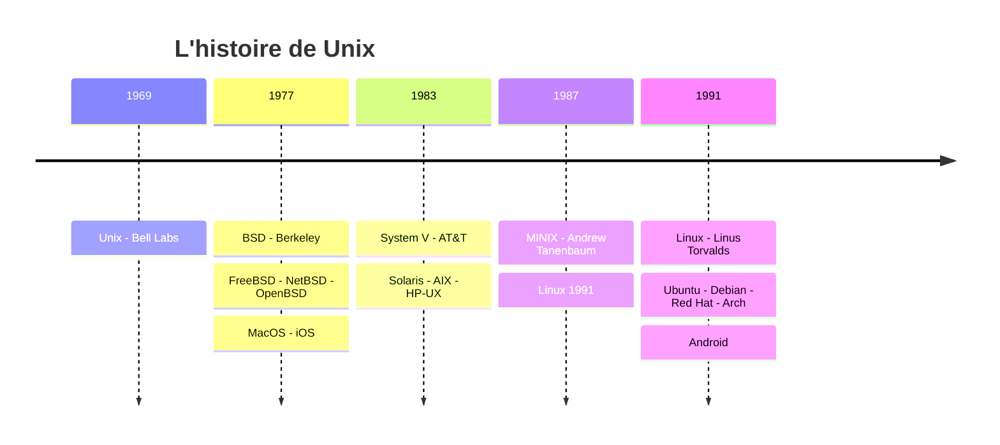
```mermaid
timeline
  title L'histoire de Unix
  1969  : Unix - Bell Labs
  1977  : BSD - Berkeley
        : FreeBSD - NetBSD - OpenBSD
        : MacOS - iOS
  1983  : System V - AT&T
        : Solaris - AIX - HP-UX
  1987  : MINIX - Andrew Tanenbaum
        : Linux 1991
  1991  : Linux - Linus Torvalds
        : Ubuntu - Debian - Red Hat - Arch
        : Android
```

### L'arbre généalogique Unix

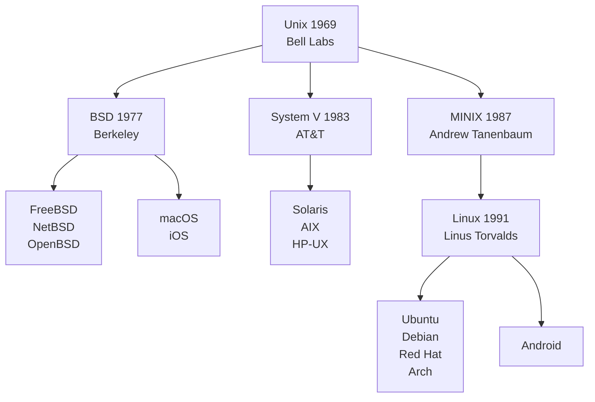
```mermaid
flowchart TB
    A["Unix 1969<br />Bell Labs"]
    B["BSD 1977<br />Berkeley"]
    C["System V 1983<br />AT&T"]
    D["FreeBSD<br />NetBSD<br />OpenBSD"]
    E["macOS<br />iOS"]
    F["Solaris\nAIX<br />HP-UX"]
    G["MINIX 1987<br />Andrew Tanenbaum"]
    H["Linux 1991<br />Linus Torvalds"]
    I["Ubuntu<br />Debian<br />Red Hat<br />Arch"]
    J["Android"]

    A --> B
    A --> C
    B --> D
    B --> E
    C --> F
    A --> G
    G --> H
    H --> I
    H --> J
```

Linux et BSD représentent les réimplémentations libres d'Unix, tandis que macOS descend directement de BSD. L'influence d'Unix sur les systèmes modernes est totale.

### Unix aujourd'hui

Les systèmes Unix certifiés officiellement (Unix 03) sont macOS, Solaris, AIX (IBM) et HP-UX. Les systèmes Unix-like — compatibles mais non certifiés — comprennent l'ensemble des distributions Linux, FreeBSD, OpenBSD, NetBSD et Android.

<br />

---

## La philosophie Unix

### Principe 1 — Tout est fichier

!!! note "L'image ci-dessous représente le principe fondamental 'tout est fichier' d'Unix. C'est l'abstraction centrale qui permet d'accéder à des ressources aussi différentes qu'un disque dur, une socket réseau ou un pipe avec les mêmes opérations système."

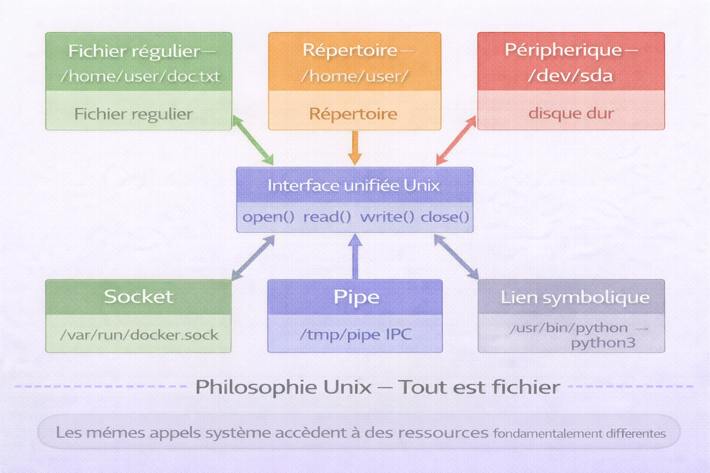

<p><em>Unix expose tous les objets du système — fichiers réguliers, répertoires, périphériques, sockets réseau, pipes et liens symboliques — via une interface unifiée. Les mêmes appels système open(), read(), write() et close() s'appliquent à tous. Un disque dur (/dev/sda), un générateur aléatoire (/dev/random), une socket Docker (/var/run/docker.sock) et un fichier texte ordinaire s'utilisent avec les mêmes primitives. C'est cette abstraction qui rend possible la composition de programmes Unix.</em></p>

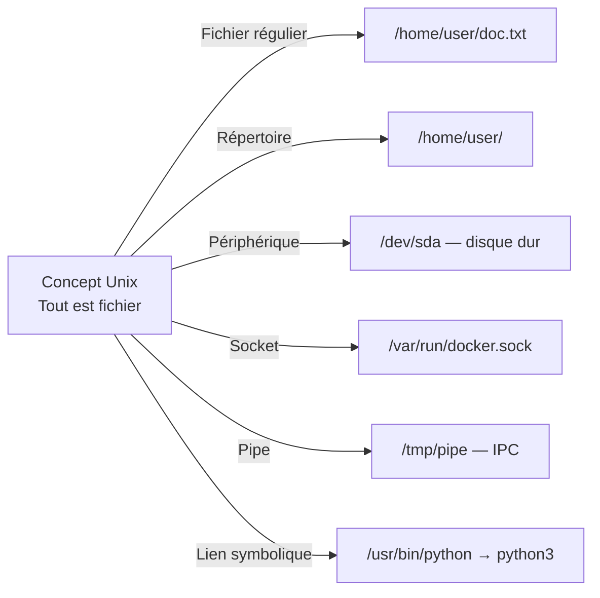
```mermaid
flowchart LR
    A["Concept Unix<br />Tout est fichier"]

    A -->|Fichier régulier| B["/home/user/doc.txt"]
    A -->|Répertoire| C["/home/user/"]
    A -->|Périphérique| D["/dev/sda — disque dur"]
    A -->|Socket| E["/var/run/docker.sock"]
    A -->|Pipe| F["/tmp/pipe — IPC"]
    A -->|Lien symbolique| G["/usr/bin/python → python3"]
```

```bash title="Bash — accès unifié à des ressources différentes"
# Lire un fichier texte ordinaire
cat /home/user/doc.txt

# Lire les informations CPU (fichier virtuel dans /proc)
cat /proc/cpuinfo

# Écrire dans un périphérique série
echo "Hello" > /dev/ttyUSB0

# Lire depuis un périphérique réseau
cat /dev/tcp/example.com/80
```

**Implication :** tous ces accès utilisent les mêmes appels système — `open()`, `read()`, `write()`, `close()`.

### Principe 2 — Programmes spécialisés et composables

Chaque programme Unix fait une seule chose bien et peut se combiner avec d'autres via des pipes.

```bash title="Bash — composition de programmes par pipeline"
# Compter les processus Firefox en cours
# ps génère → grep filtre → wc compte
ps aux | grep firefox | wc -l
```

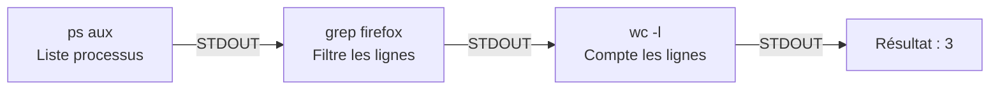
```mermaid
flowchart LR
    A["ps aux\nListe processus"]
    B["grep firefox\nFiltre les lignes"]
    C["wc -l\nCompte les lignes"]
    D["Résultat : 3"]

    A -->|STDOUT| B
    B -->|STDOUT| C
    C -->|STDOUT| D
```

### Principe 3 — Interface textuelle

Les données circulent sous forme de flux de texte, ce qui garantit l'interopérabilité maximale entre les programmes. Le texte est humain lisible, facilement transformable, indépendant du langage de programmation et composable trivialement.

### Principe 4 — Configuration en fichiers texte

```bash title="Bash — arborescence de configuration /etc"
/etc/
├── passwd             # Utilisateurs
├── group              # Groupes
├── hosts              # Résolution DNS locale
├── fstab              # Montage des disques
├── ssh/               # Configuration SSH
│   └── sshd_config
└── nginx/             # Configuration Nginx
    └── nginx.conf
```

!!! danger "Sécurité des fichiers de configuration"
    Les fichiers de configuration contiennent souvent des informations sensibles — mots de passe, clés API, chemins critiques. Les fichiers sensibles doivent avoir les permissions `600` (rw-------), les répertoires de configuration `700` (rwx------). Seul le propriétaire légitime doit pouvoir lire et modifier ces fichiers.

```bash title="Bash — audit rapide des fichiers de configuration trop permissifs"
find /etc -type f -perm /go+w 2>/dev/null
```

<br />

---

## Architecture en couches

!!! note "L'image ci-dessous représente l'architecture en quatre couches d'Unix. Comprendre cette hiérarchie explique comment une application utilisateur finit par exécuter des instructions sur le processeur sans jamais interagir directement avec le matériel."

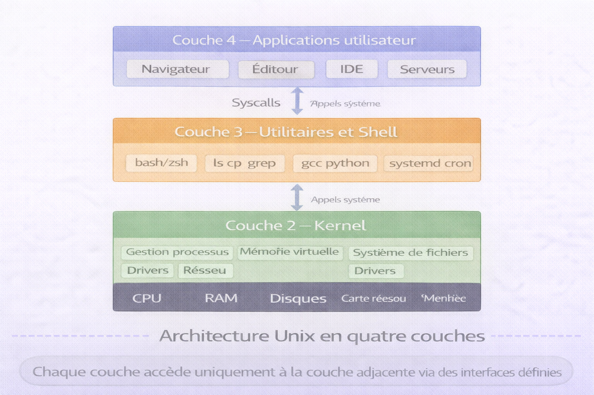

<p><em>Unix s'organise en quatre couches strictement hiérarchiques. Le matériel (CPU, RAM, disques, carte réseau) constitue la base physique. Le kernel gère toutes les ressources — processus, mémoire, système de fichiers, drivers — et expose des appels système aux couches supérieures. Les utilitaires et le shell fournissent l'interface d'interaction. Les applications utilisateur — navigateurs, éditeurs, IDEs — s'appuient sur les couches inférieures sans jamais accéder directement au matériel. Chaque couche communique uniquement avec la couche adjacente via des interfaces définies.</em></p>

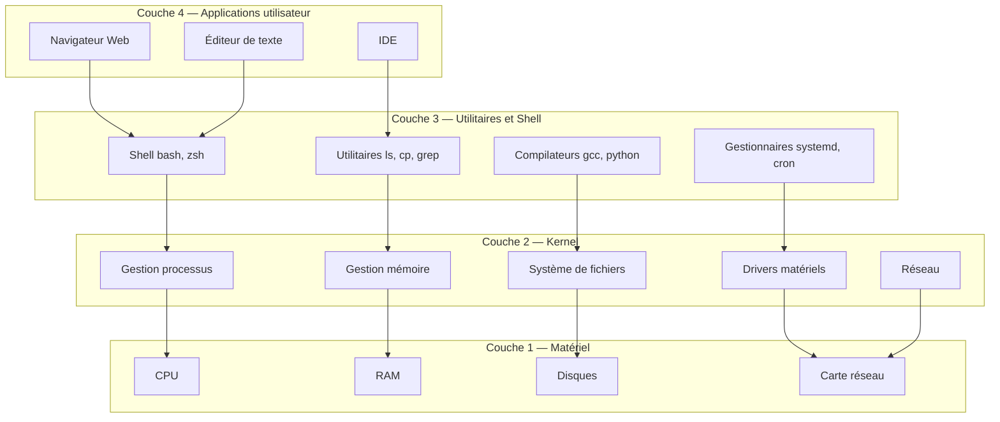
```mermaid
flowchart TB
    subgraph "Couche 4 — Applications utilisateur"
        A1["Navigateur Web"]
        A2["Éditeur de texte"]
        A3["IDE"]
    end

    subgraph "Couche 3 — Utilitaires et Shell"
        B1["Shell bash, zsh"]
        B2["Utilitaires ls, cp, grep"]
        B3["Compilateurs gcc, python"]
        B4["Gestionnaires systemd, cron"]
    end

    subgraph "Couche 2 — Kernel"
        C1["Gestion processus"]
        C2["Gestion mémoire"]
        C3["Système de fichiers"]
        C4["Drivers matériels"]
        C5["Réseau"]
    end

    subgraph "Couche 1 — Matériel"
        D1["CPU"]
        D2["RAM"]
        D3["Disques"]
        D4["Carte réseau"]
    end

    A1 --> B1
    A2 --> B1
    A3 --> B2
    B1 --> C1
    B2 --> C2
    B3 --> C3
    B4 --> C4
    C1 --> D1
    C2 --> D2
    C3 --> D3
    C4 --> D4
    C5 --> D4
```

### Couche 1 — Matériel

Composants physiques : processeur, mémoire, disques, périphériques. Le matériel exécute les instructions et stocke les données. Aucune application utilisateur n'y accède directement — tout passe par le kernel.

### Couche 2 — Kernel

Le cœur du système d'exploitation qui gère toutes les ressources et expose des appels système aux programmes.

#### Gestion des processus

!!! note "Le fork — création de processus"
    Le **fork** est l'opération système fondamentale pour créer un nouveau processus sous Unix. Lorsqu'un processus appelle `fork()`, le kernel crée une copie complète du processus parent — code, données, descripteurs de fichiers. Le processus enfant reçoit un nouveau PID et s'exécute indépendamment. C'est ainsi que tous les processus naissent sous Unix : par duplication successive depuis le processus init (PID 1).

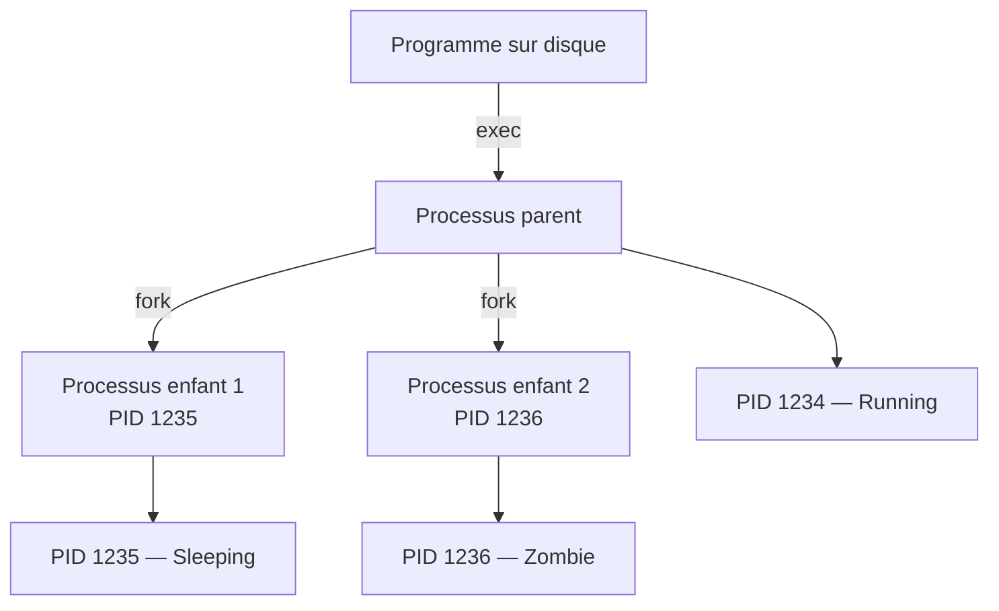
```mermaid
flowchart TD
    A["Programme sur disque"]
    B["Processus parent"]
    C["Processus enfant 1\nPID 1235"]
    D["Processus enfant 2\nPID 1236"]
    E["PID 1234 — Running"]
    F["PID 1235 — Sleeping"]
    G["PID 1236 — Zombie"]

    A -->|exec| B
    B -->|fork| C
    B -->|fork| D
    B --> E
    C --> F
    D --> G
```

Le kernel assure la création et destruction des processus via `fork`, `exec` et `exit`, l'ordonnancement CPU, la communication inter-processus (IPC) et la gestion des signaux.

#### Gestion de la mémoire

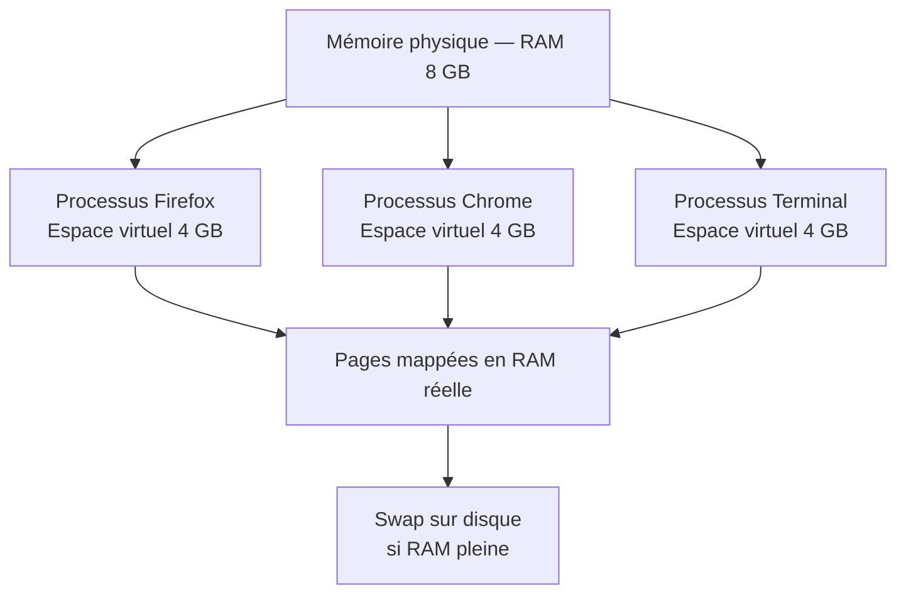
```mermaid
flowchart TB
    A["Mémoire physique — RAM 8 GB"]

    A --> B["Processus Firefox\nEspace virtuel 4 GB"]
    A --> C["Processus Chrome\nEspace virtuel 4 GB"]
    A --> D["Processus Terminal\nEspace virtuel 4 GB"]

    B --> E["Pages mappées en RAM réelle"]
    C --> E
    D --> E
    E --> F["Swap sur disque\nsi RAM pleine"]
```

La mémoire virtuelle donne à chaque processus l'illusion d'un espace adressable indépendant. La pagination et le swap permettent de dépasser la RAM physique. L'isolation mémoire garantit qu'un processus ne peut pas lire ou écrire la mémoire d'un autre.

#### Système de fichiers — Hiérarchie FHS

```bash title="Bash — arborescence FHS (Filesystem Hierarchy Standard)"
/                    # Racine — point de départ de tout le système
│
├── bin/             # Binaires essentiels pour tous les utilisateurs
│   ├── ls           # Lister fichiers
│   ├── cat          # Afficher contenu
│   ├── cp           # Copier
│   ├── mv           # Déplacer
│   └── bash         # Shell
│
├── boot/            # Fichiers de démarrage du système
│   ├── vmlinuz      # Noyau Linux compressé
│   ├── initrd.img   # Disque RAM initial
│   └── grub/        # Configuration bootloader
│
├── dev/             # Fichiers de périphériques
│   ├── sda          # Premier disque dur
│   ├── sda1         # Première partition
│   ├── null         # Périphérique trou noir
│   ├── random       # Générateur aléatoire
│   └── tty          # Terminaux
│
├── etc/             # Configuration système — Editable Text Configuration
│   ├── passwd       # Base de données utilisateurs
│   ├── shadow       # Mots de passe chiffrés
│   ├── group        # Groupes d'utilisateurs
│   ├── fstab        # Table de montage des disques
│   ├── hostname     # Nom de la machine
│   ├── hosts        # Résolution DNS locale
│   ├── ssh/         # Configuration SSH
│   ├── nginx/       # Configuration Nginx
│   └── systemd/     # Configuration systemd
│
├── home/            # Répertoires personnels des utilisateurs
│   ├── alice/
│   │   ├── Documents/
│   │   ├── Downloads/
│   │   ├── .bashrc  # Configuration bash personnelle
│   │   └── .ssh/    # Clés SSH personnelles
│   └── bob/
│
├── lib/             # Bibliothèques partagées essentielles
├── lib64/           # Bibliothèques 64 bits
│
├── media/           # Points de montage pour médias amovibles
├── mnt/             # Points de montage temporaires manuels
│
├── opt/             # Logiciels optionnels tiers
│
├── proc/            # Système de fichiers virtuel — processus et kernel
│   ├── cpuinfo      # Informations CPU
│   ├── meminfo      # Informations mémoire
│   ├── 1234/        # Dossier du processus PID 1234
│   │   ├── cmdline  # Ligne de commande du processus
│   │   ├── environ  # Variables d'environnement
│   │   └── status   # État du processus
│   └── sys/         # Paramètres kernel modifiables
│
├── root/            # Répertoire personnel du superutilisateur
│
├── run/             # Données runtime variables (tmpfs en RAM)
│
├── sbin/            # Binaires système — superutilisateur
│   ├── init         # Premier processus (PID 1)
│   ├── shutdown     # Arrêt système
│   ├── reboot       # Redémarrage
│   └── fdisk        # Partitionnement disques
│
├── srv/             # Données des services
│   ├── www/         # Sites web
│   └── git/         # Dépôts Git
│
├── sys/             # Système de fichiers virtuel — kernel et devices
│
├── tmp/             # Fichiers temporaires — vidé au redémarrage
│
├── usr/             # Hiérarchie utilisateur secondaire
│   ├── bin/         # Binaires non essentiels
│   │   ├── python3
│   │   ├── gcc
│   │   └── git
│   ├── sbin/        # Binaires système non essentiels
│   ├── lib/         # Bibliothèques pour /usr/bin
│   ├── local/       # Logiciels installés localement
│   │   ├── bin/
│   │   ├── lib/
│   │   └── share/
│   ├── share/       # Données partagées indépendantes de l'architecture
│   │   ├── doc/
│   │   ├── man/
│   │   └── fonts/
│   └── include/     # Fichiers d'en-tête C/C++
│
└── var/             # Données variables
    ├── log/         # Fichiers de logs
    │   ├── syslog
    │   ├── auth.log
    │   └── nginx/
    ├── cache/       # Cache d'applications
    │   └── apt/
    ├── spool/       # Files d'attente mail, impression
    ├── lib/         # Données d'état variables
    │   ├── mysql/
    │   └── docker/
    └── www/         # Données de sites web
```

!!! info "Répertoires essentiels vs non-essentiels"
    Les répertoires essentiels — `/bin`, `/sbin`, `/lib` — sont nécessaires au démarrage et au mode de réparation. Les répertoires non-essentiels — `/usr/bin`, `/usr/sbin`, `/usr/lib` — peuvent être sur une partition séparée et ne sont pas requis pour le boot.

!!! info "Systèmes de fichiers virtuels"
    `/proc` est une interface vers le kernel — lisible et modifiable pour configurer les paramètres système. `/sys` est une interface vers les périphériques — hotplug, power management. `/dev` contient les nœuds de périphériques bloc et caractère. Ces trois répertoires ne stockent aucune donnée sur disque — tout est généré en mémoire à la volée.

| FS | Type | Caractéristiques | Usage |
|---|---|---|---|
| ext4 | Journalisé | Standard, fiable, performant | Linux général |
| XFS | Journalisé | Gros fichiers, hautes performances | Serveurs, médias |
| Btrfs | COW | Snapshots, compression, RAID | Workstations, NAS |
| ZFS | COW | Intégrité données, RAID, compression | Serveurs enterprise |
| F2FS | Flash | Optimisé SSD/flash | Android, embedded |
| tmpfs | RAM | Ultra-rapide, volatile | /tmp, /run |

#### Drivers matériels

Le kernel communique avec le matériel via des drivers (pilotes) chargés comme modules noyau.

```bash title="Bash — architecture modulaire — matériel vers kernel"
# Kernel Core
#     ↓
# Couche d'abstraction matérielle (HAL)
#     ↓
# Drivers spécifiques (modules .ko)
#     ↓
# GPU | Réseau | USB | Son | Disque
```

```bash title="Bash — gestion des modules kernel"
# Lister les modules chargés
lsmod

# Informations sur un module
modinfo e1000e

# Charger un module
modprobe e1000e

# Décharger un module
modprobe -r e1000e

# Modules au démarrage
# /etc/modules
# /etc/modprobe.d/
```

!!! warning "Réservé aux administrateurs système"
    La gestion des modules kernel est une opération critique réservée aux administrateurs système, réseau et professionnels de la cybersécurité. Un module mal configuré peut rendre le système instable ou non bootable.

### Couche 3 — Utilitaires système et Shell

Le shell est l'interface entre l'utilisateur et le kernel.

| Shell | Caractéristiques | Usage | Fichier config |
|---|---|---|---|
| bash | Standard, portable, scripting | Scripts, serveurs | ~/.bashrc |
| zsh | Moderne, plugins, themes | Interactif, dev | ~/.zshrc |
| fish | User-friendly, suggestions | Débutants | ~/.config/fish/ |
| sh | Minimaliste, POSIX | Scripts portables | — |
| dash | Rapide, minimal | Scripts système | — |

!!! info "Apprentissage terminal"
    Les commandes présentées ci-dessous sont détaillées dans le cours dédié à l'utilisation d'un terminal.

=== ":lucide-terminal: Manipulation de fichiers"

    ```bash title="Bash — commandes de manipulation de fichiers"
    ls          # Lister
    cd          # Changer répertoire
    pwd         # Afficher répertoire courant
    cp          # Copier
    mv          # Déplacer/renommer
    rm          # Supprimer
    mkdir       # Créer répertoire
    touch       # Créer fichier vide / modifier timestamp
    ln          # Créer liens
    find        # Rechercher fichiers
    ```

=== ":lucide-terminal: Traitement de texte"

    ```bash title="Bash — commandes de traitement de texte"
    cat         # Afficher contenu
    less        # Paginer contenu
    head        # Premières lignes
    tail        # Dernières lignes
    grep        # Rechercher patterns
    sed         # Édition de flux
    awk         # Traitement de colonnes
    cut         # Extraire colonnes
    sort        # Trier
    uniq        # Dédupliquer
    wc          # Compter lignes/mots/caractères
    tr          # Transformer caractères
    ```

=== ":lucide-terminal: Processus"

    ```bash title="Bash — commandes de gestion des processus"
    ps          # Lister processus
    top         # Moniteur interactif
    htop        # Moniteur amélioré
    kill        # Envoyer signaux
    killall     # Tuer par nom
    pkill       # Tuer par pattern
    pgrep       # Chercher processus
    jobs        # Tâches en arrière-plan
    bg          # Mettre en background
    fg          # Ramener en foreground
    nohup       # Détacher du terminal
    ```

=== ":lucide-terminal: Système"

    ```bash title="Bash — commandes d'inspection système"
    uname       # Info système
    df          # Espace disque
    du          # Usage disque
    free        # Mémoire disponible
    uptime      # Temps de fonctionnement
    dmesg       # Messages kernel
    journalctl  # Logs systemd
    systemctl   # Gestion services
    ```

=== ":lucide-terminal: Réseau"

    ```bash title="Bash — commandes réseau"
    ping        # Tester connectivité
    curl        # Requêtes HTTP
    wget        # Télécharger fichiers
    ssh         # Connexion distante
    scp         # Copie sécurisée
    rsync       # Synchronisation
    ss          # Sockets réseau (moderne)
    ip          # Configuration réseau (moderne)
    ```

### Couche 4 — Applications utilisateur

Applications de haut niveau qui s'appuient sur les services des couches inférieures. Environnements de bureau : GNOME, KDE Plasma, XFCE. Serveurs : Apache, Nginx, PostgreSQL, Redis. Conteneurs : Docker, Podman, LXC.

<br />

---

## Système de permissions

!!! note "L'image ci-dessous représente le modèle de permissions Unix — propriétaire, groupe, autres — avec la correspondance entre notation symbolique et notation octale. C'est la référence visuelle à mémoriser avant toute opération sur les fichiers système."

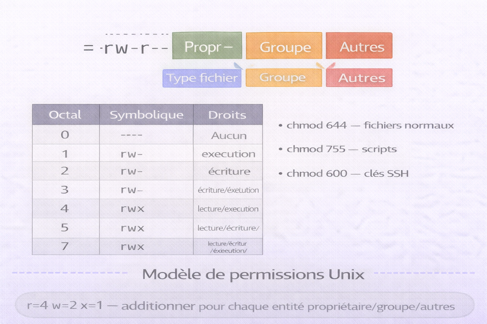

<p><em>Chaque fichier Unix possède trois ensembles de permissions — propriétaire (user), groupe (group) et autres (others) — et trois types de droits — lecture (r=4), écriture (w=2) et exécution (x=1). La notation octale additionne les valeurs : 7 = rwx (4+2+1), 6 = rw- (4+2+0), 5 = r-x (4+0+1), 4 = r-- (4+0+0). Un chmod 644 donne rw- r-- r-- : le propriétaire lit et écrit, le groupe et les autres lisent uniquement.</em></p>

### Structure des permissions

```bash title="Bash — lire les permissions d'un fichier"
$ ls -l fichier.txt
-rw-r--r-- 1 alice developers 1024 Nov 15 10:30 fichier.txt
│└┬┘└┬┘└┬┘
│ │  │  └─── Autres    : r-- (lecture seule)
│ │  └────── Groupe     : r-- (lecture seule)
│ └───────── Propriétaire : rw- (lecture + écriture)
└─────────── Type de fichier : - (fichier régulier)
```

| Symbole | Description |
|:---:|---|
| `-` | Fichier régulier |
| `d` | Répertoire |
| `l` | Lien symbolique |
| `c` | Périphérique caractère |
| `b` | Périphérique bloc |
| `p` | Pipe nommé (FIFO) |
| `s` | Socket |

### Permissions en octal

```bash title="Bash — calcul et application des permissions en octal"
# r = 4 (lecture)
# w = 2 (écriture)
# x = 1 (exécution)

chmod 755 fichier.sh
# 7 = 4+2+1 = rwx (propriétaire) — tous les droits
# 5 = 4+0+1 = r-x (groupe)       — lecture et exécution
# 5 = 4+0+1 = r-x (autres)       — lecture et exécution
```

!!! danger "Crucial pour la sécurité"
    Des permissions trop laxistes (`777`) exposent les fichiers critiques à des modifications malveillantes. Ce tableau est la référence à connaître pour éviter les failles de configuration.

| Octal | Binaire | Symbolique | Usage typique |
|:---:|:---:|:---:|---|
| `0` | 000 | --- | Aucun droit |
| `1` | 001 | --x | Répertoires traversables |
| `2` | 010 | -w- | Très rare |
| `4` | 100 | r-- | Fichiers protégés |
| `5` | 101 | r-x | Scripts, binaires publics |
| `6` | 110 | rw- | Fichiers utilisateur |
| `7` | 111 | rwx | Propriétaire, scripts exécutables |

```bash title="Bash — permissions courantes en production"
chmod 644 fichier.txt       # -rw-r--r-- fichiers normaux
chmod 755 script.sh         # -rwxr-xr-x scripts exécutables
chmod 700 ~/.ssh/           # drwx------ répertoire privé
chmod 600 ~/.ssh/id_rsa     # -rw------- clé SSH privée
chmod 777 /tmp/shared/      # drwxrwxrwx DANGEREUX — à éviter
```

### Permissions spéciales

#### Setuid (SUID) — bit 4000

Permet d'exécuter un fichier avec les **permissions du propriétaire** plutôt que celles de l'utilisateur courant.

```bash title="Bash — SUID — exécution avec droits du propriétaire"
-rwsr-xr-x 1 root root 47032 /usr/bin/passwd
# Le s indique que le SUID est activé

# L'utilisateur alice exécute passwd avec les droits root
# pour modifier /etc/shadow — accessible uniquement par root

chmod u+s fichier    # Ajouter SUID
chmod 4755 fichier   # SUID + rwxr-xr-x
```

Cas d'usage légitimes : `passwd` pour modifier son mot de passe, `sudo` pour exécuter des commandes avec privilèges, `ping` pour envoyer des paquets ICMP.

!!! danger "Sécurité SUID"
    Les binaires SUID sont des cibles privilégiées pour l'élévation de privilèges. Auditer régulièrement le système.

```bash title="Bash — lister tous les binaires SUID du système"
find / -perm -4000 -type f 2>/dev/null
```

#### Setgid (SGID) — bit 2000

Sur les fichiers : exécution avec les droits du groupe. Sur les répertoires : les nouveaux fichiers héritent du groupe du répertoire.

```bash title="Bash — SGID — répertoire partagé entre développeurs"
drwxrws--- 2 alice developers 4096 /shared/project/
# Le s indique que le SGID est activé

mkdir /shared/dev
chgrp developers /shared/dev
chmod 2775 /shared/dev
# Tous les fichiers créés appartiendront au groupe "developers"
```

#### Sticky bit — bit 1000

Sur les répertoires : seul le propriétaire peut supprimer ses propres fichiers.

```bash title="Bash — sticky bit — répertoire /tmp multi-utilisateurs"
drwxrwxrwt 10 root root 4096 /tmp/
# Le t indique que le sticky bit est activé

chmod +t repertoire    # Ajouter sticky bit
chmod 1777 repertoire  # Sticky + rwxrwxrwx
```

!!! info "Importance en cybersécurité"
    Le sticky bit empêche qu'un utilisateur malveillant ne supprime les fichiers d'autres utilisateurs dans `/tmp` — une attaque classique de déni de service ou de manipulation de fichiers temporaires utilisés par des processus privilégiés.

<br />

---

## Processus et IPC

### Cycle de vie d'un processus

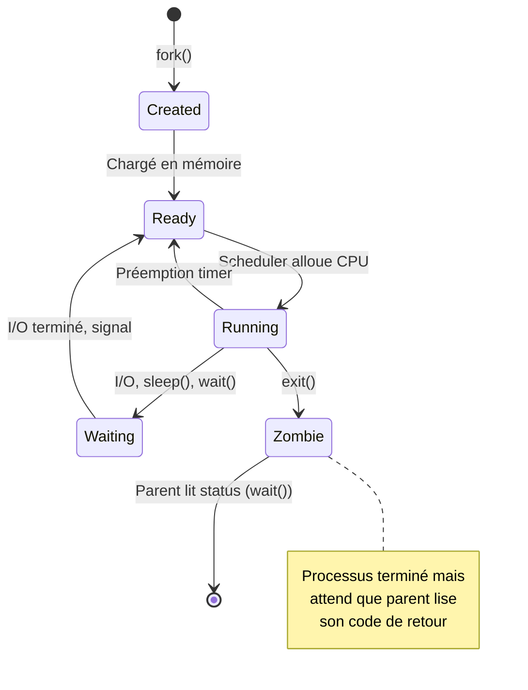
```mermaid
stateDiagram-v2
    [*] --> Created: fork()
    Created --> Ready: Chargé en mémoire
    Ready --> Running: Scheduler alloue CPU
    Running --> Ready: Préemption timer
    Running --> Waiting: I/O, sleep(), wait()
    Waiting --> Ready: I/O terminé, signal
    Running --> Zombie: exit()
    Zombie --> [*]: Parent lit status (wait())

    note right of Zombie
        Processus terminé mais
        attend que parent lise
        son code de retour
    end note
```

| État | Symbole ps | Description |
|---|:---:|---|
| Running | R | En cours d'exécution sur CPU |
| Sleeping | S | Attente interruptible — peut recevoir signaux |
| Uninterruptible | D | Attente non interruptible — I/O critique |
| Stopped | T | Arrêté — SIGSTOP, Ctrl+Z |
| Zombie | Z | Terminé, attend lecture du parent |

!!! example "États de processus avec Docker"
    Démarrer un conteneur avec `docker run` fait passer le processus par Created → Ready → Running. `docker pause` place le processus en état Stopped. `docker stop` envoie SIGTERM puis le processus passe brièvement en Zombie avant terminaison complète.

### Hiérarchie des processus

```bash title="Bash — arbre des processus depuis PID 1"
# systemd (PID 1)
# ├── systemd-journald (PID 123)
# ├── sshd (PID 234)
# │   ├── sshd (PID 1234) --- Session Alice
# │   │   └── bash (PID 1235)
# │   │       └── vim (PID 1236)
# │   └── sshd (PID 1240) --- Session Bob
# ├── nginx (PID 456)
# │   ├── nginx worker (PID 457)
# │   └── nginx worker (PID 458)
# └── firefox (PID 2000)
#     ├── firefox-tab (PID 2001)
#     └── firefox-gpu (PID 2003)

pstree -p      # Arbre avec PIDs
ps auxf        # Format forêt
```

### Communication inter-processus (IPC)

!!! note "L'image ci-dessous présente les quatre mécanismes IPC d'Unix — pipes, signaux, sockets et mémoire partagée. Comprendre leurs différences permet de choisir le bon mécanisme selon le contexte : communication locale, distante, synchrone ou asynchrone."

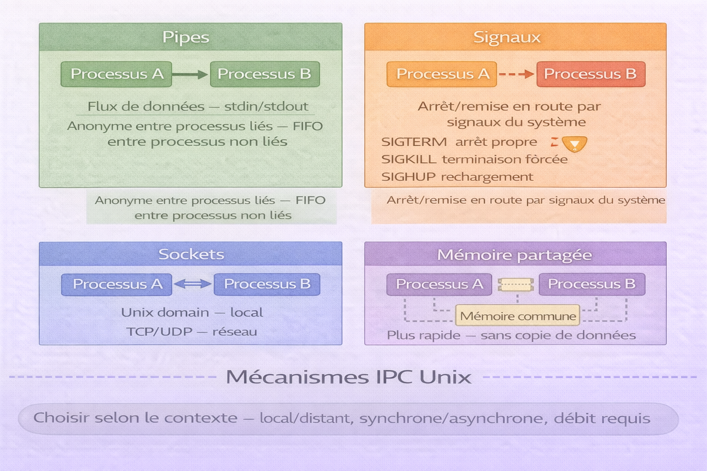

<p><em>Unix propose quatre mécanismes de communication inter-processus. Les pipes transmettent un flux de données unidirectionnel entre processus liés (pipe anonyme) ou non liés (FIFO). Les signaux sont des messages asynchrones courts — SIGTERM pour un arrêt propre, SIGKILL pour une terminaison forcée. Les sockets permettent une communication bidirectionnelle locale (Unix domain sockets) ou réseau (TCP/UDP). La mémoire partagée est la méthode la plus rapide — plusieurs processus accèdent directement à la même zone mémoire sans copie.</em></p>

#### Pipes

```bash title="Bash — pipe anonyme entre processus liés"
# Communication unidirectionnelle dans un pipeline
ls -la | grep ".txt" | wc -l
```

```bash title="Bash — pipe nommé (FIFO) entre processus non liés"
mkfifo mypipe

# Terminal 1 — producteur
echo "Hello World" > mypipe

# Terminal 2 — consommateur
cat < mypipe
```

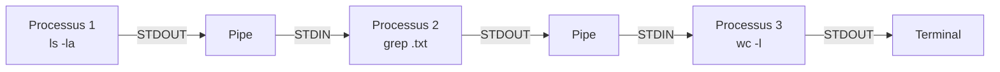
```mermaid
flowchart LR
    A["Processus 1\nls -la"]
    B["Pipe"]
    C["Processus 2\ngrep .txt"]
    D["Pipe"]
    E["Processus 3\nwc -l"]
    F["Terminal"]

    A -->|STDOUT| B
    B -->|STDIN| C
    C -->|STDOUT| D
    D -->|STDIN| E
    E -->|STDOUT| F
```

#### Signaux

| Signal | Numéro | Capturable | Action défaut | Usage |
|---|:---:|:---:|---|---|
| SIGHUP | 1 | Oui | Terminer | Réinitialisation démon |
| SIGINT | 2 | Oui | Terminer | Interruption Ctrl+C |
| SIGKILL | 9 | Non | Terminer | Force kill immédiat |
| SIGSEGV | 11 | Oui | Core dump | Violation mémoire |
| SIGTERM | 15 | Oui | Terminer | Arrêt propre — défaut kill |
| SIGSTOP | 19 | Non | Suspendre | Pause forcée |
| SIGCONT | 18 | Oui | Reprendre | Reprend après STOP |

```bash title="Bash — envoyer des signaux à des processus"
kill -15 1234                   # SIGTERM — arrêt propre — recommandé
kill -9 1234                    # SIGKILL — force kill — dernier recours
kill -1 1234                    # SIGHUP — recharger configuration
killall firefox                 # Tue tous les processus firefox
pkill -u alice                  # Tue tous les processus de alice
pkill -9 -f "python script.py"  # Force kill par ligne de commande

# Ignorer des signaux dans un script shell
trap '' SIGINT    # Ignore Ctrl+C
trap '' SIGTERM   # Ignore kill normal
```

#### Sockets

```bash title="Bash — sockets Unix domain (communication locale)"
/var/run/docker.sock          # Docker daemon
/tmp/mysql.sock               # MySQL
/run/systemd/private          # systemd
/run/dbus/system_bus_socket   # D-Bus
```

```bash title="Bash — sockets réseau (communication distante)"
# Format : PROTOCOLE IP:PORT
# TCP 192.168.1.10:8080
# UDP 0.0.0.0:53
# TCP6 [::1]:22
```

#### Mémoire partagée et files de messages

```bash title="Bash — inspecter les ressources IPC System V"
# Voir les segments mémoire partagée
ipcs -m

# Voir les files de messages
ipcs -q
```

<br />

---

## Utilisateurs et groupes

### Types d'utilisateurs

```bash title="Bash — plages d'UID par type d'utilisateur"
# Superutilisateur — root
# UID: 0 — GID: 0 — tous les droits système

# Utilisateurs système — démons et services
# UID: 1-999
# Exemples : www-data (Apache), mysql, sshd, systemd-network

# Utilisateurs normaux — humains interactifs
# UID: 1000+
```

### Fichiers de configuration

=== "/etc/passwd"

    ```bash title="Bash — format du fichier /etc/passwd (permissions 644)"
    alice:x:1000:1000:Alice Dupont:/home/alice:/bin/bash
    # │   │  │    │    │             │            └── Shell par défaut
    # │   │  │    │    │             └─────────────── Répertoire home
    # │   │  │    │    └───────────────────────────── Nom complet GECOS
    # │   │  │    └────────────────────────────────── GID groupe principal
    # │   │  └─────────────────────────────────────── UID
    # │   └────────────────────────────────────────── x = mot de passe dans /etc/shadow
    # └────────────────────────────────────────────── Nom d'utilisateur
    ```

=== "/etc/shadow"

    ```bash title="Bash — format du fichier /etc/shadow (permissions 640, root:shadow)"
    alice:$6$rounds=5000$salt$hash...:19000:0:99999:7:30:19100:
    # │                               │     │   │   │ │  └── Date expiration compte
    # │                               │     │   │   │ └───── Jours inactivité avant désactivation
    # │                               │     │   │   └─────── Jours avant avertissement expiration
    # │                               │     │   └─────────── Jours max avant changement obligatoire
    # │                               │     └─────────────── Jours min avant changement autorisé
    # │                               └───────────────────── Jours depuis Epoch Unix
    # └───────────────────────────────────────────────────── Hash SHA-512 du mot de passe
    ```

    !!! danger "Attaque par combinaison /etc/passwd + /etc/shadow"
        Un attaquant qui obtient les deux fichiers peut les combiner pour créer un fichier exploitable par John the Ripper ou Hashcat. Le format combiné expose directement les hashs avec leurs sels, accélérant considérablement les attaques par dictionnaire ou force brute. Protéger `/etc/shadow` avec permissions 640 et accès root uniquement.

    ```bash title="Bash — format du hash dans /etc/shadow"
    # $id$salt$hash
    # └── $6$ = SHA-512 (recommandé)
    # └── $5$ = SHA-256
    # └── $1$ = MD5 (obsolète — faille critique)
    ```

    !!! danger "MD5 = faille de sécurité critique"
        Des hashs MD5 (`$1$`) dans `/etc/shadow` constituent une faille critique — MD5 est cassable en quelques minutes avec du matériel moderne. Migrer immédiatement vers SHA-512 (`$6$`) en régénérant les mots de passe.

=== "/etc/group"

    ```bash title="Bash — format du fichier /etc/group"
    developers:x:1001:alice,bob,charlie
    # │         │  │    └────────────── Membres secondaires du groupe
    # │         │  └─────────────────── GID
    # │         └────────────────────── x = pas de mot de passe groupe (obsolète)
    # └──────────────────────────────── Nom du groupe
    ```

=== "/etc/gshadow"

    ```bash title="Bash — format du fichier /etc/gshadow"
    developers:!::alice,bob,charlie
    # │         │ │ └─────────────── Membres
    # │         │ └───────────────── Administrateurs du groupe
    # │         └─────────────────── ! = pas de mot de passe
    # └───────────────────────────── Nom du groupe
    ```

### Commandes de gestion des utilisateurs

```bash title="Bash — gérer les utilisateurs et les groupes"
# Utilisateurs
useradd alice              # Créer un utilisateur
usermod -aG sudo alice     # Ajouter au groupe sudo
userdel alice              # Supprimer un utilisateur
passwd alice               # Changer le mot de passe
id alice                   # Informations d'un utilisateur
whoami                     # Utilisateur courant
w                          # Qui est connecté

# Groupes
groupadd developers        # Créer un groupe
groupdel developers        # Supprimer un groupe
groups alice               # Groupes d'un utilisateur
newgrp developers          # Changer le groupe primaire de la session

# Changement d'identité
su - alice                 # Devenir alice avec son environnement
sudo -u alice command      # Exécuter une commande en tant que alice
sudo -i                    # Shell root interactif
```

<br />

---

## Démarrage du système

!!! note "L'image ci-dessous représente la séquence de démarrage complète d'un système Linux moderne — de la mise sous tension jusqu'à la session utilisateur. Comprendre ce pipeline est indispensable pour diagnostiquer les échecs de boot et sécuriser le démarrage."

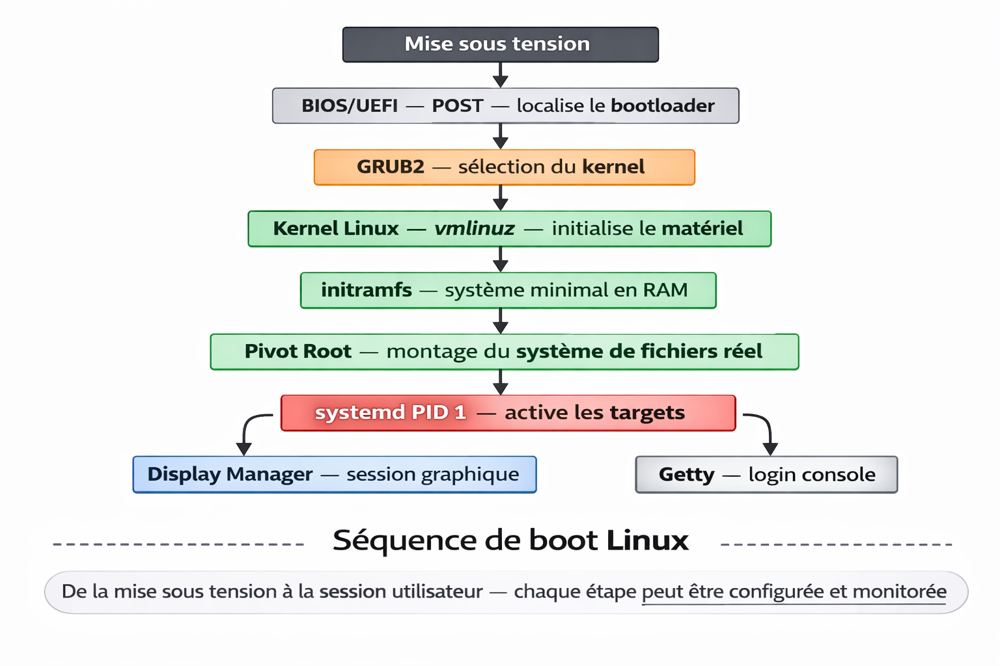

<p><em>Le démarrage Linux suit une séquence stricte. Le BIOS ou UEFI effectue le POST et localise le bootloader. GRUB2 charge le kernel Linux compressé (vmlinuz) et l'initramfs en mémoire. Le kernel décompressé initialise le matériel, monte l'initramfs, exécute son script /init qui monte le système de fichiers réel et effectue le pivot root. systemd (PID 1) prend le relais, active les targets dans l'ordre, démarre les services et lance le display manager (mode graphique) ou getty (mode console). Chaque étape peut être configurée et monitorée.</em></p>

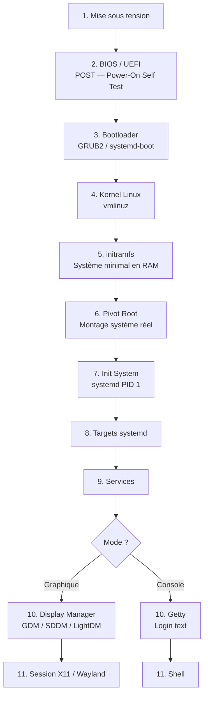
```mermaid
flowchart TB
    A["1. Mise sous tension"]
    B["2. BIOS / UEFI\nPOST — Power-On Self Test"]
    C["3. Bootloader\nGRUB2 / systemd-boot"]
    D["4. Kernel Linux\nvmlinuz"]
    E["5. initramfs\nSystème minimal en RAM"]
    F["6. Pivot Root\nMontage système réel"]
    G["7. Init System\nsystemd PID 1"]
    H["8. Targets systemd"]
    I["9. Services"]
    J{"Mode ?"}
    K["10. Display Manager\nGDM / SDDM / LightDM"]
    L["10. Getty\nLogin text"]
    M["11. Session X11 / Wayland"]
    N["11. Shell"]

    A --> B --> C --> D --> E --> F --> G --> H --> I --> J
    J -->|Graphique| K --> M
    J -->|Console| L --> N
```

### BIOS et UEFI

Le BIOS legacy lit le MBR (Master Boot Record, 512 bytes) au début du disque et charge GRUB. L'UEFI moderne utilise une partition EFI (FAT32) montée sur `/boot/efi` avec des fichiers `.efi` directement exécutables. Secure Boot vérifie les signatures cryptographiques de chaque composant du démarrage.

### Bootloader GRUB2

```bash title="Bash — configuration et régénération de GRUB2"
# Fichiers de configuration
# /boot/grub/grub.cfg        — config générée (ne pas éditer directement)
# /etc/default/grub          — paramètres GRUB modifiables
# /etc/grub.d/               — scripts générateurs

# Régénérer la configuration GRUB
sudo update-grub                              # Debian, Ubuntu
sudo grub2-mkconfig -o /boot/grub2/grub.cfg  # Red Hat, Fedora

# Paramètres kernel courants dans la ligne de boot
# quiet    — messages réduits
# splash   — écran de démarrage
# ro       — montage root en lecture seule initialement
# init=/bin/bash  — shell de secours (mode rescue)
```

### Kernel Linux

Le kernel décompressé (vmlinuz → vmlinux) initialise le matériel (CPU, mémoire, devices), monte l'initramfs en mémoire puis exécute `/init` dans l'initramfs.

### initramfs

L'initramfs est un système minimal contenant les drivers essentiels (stockage, réseau), les scripts de démarrage et les utilitaires critiques (fsck, lvm, cryptsetup). Son rôle est de monter le système de fichiers root — qui peut être chiffré, sur LVM ou RAID — avant de passer la main au système réel.

```bash title="Bash — inspecter et régénérer l'initramfs"
# Voir le contenu de l'initramfs
lsinitrd /boot/initramfs-$(uname -r).img    # Red Hat
lsinitramfs /boot/initrd.img-$(uname -r)   # Debian

# Régénérer l'initramfs
mkinitramfs -o /boot/initrd.img   # Debian, Ubuntu
dracut --force                    # Red Hat, Fedora
```

### systemd — Init PID 1

systemd remplace les anciens SysVinit et Upstart. Il organise le démarrage via des units et des targets.

```bash title="Bash — types d'units systemd"
# service : démons — nginx.service
# target  : groupes d'unités — multi-user.target
# mount   : points de montage
# socket  : activation par socket
# timer   : planification — remplace cron
```

```bash title="Bash — targets systemd principaux"
# poweroff.target    — arrêt
# rescue.target      — mode rescue (single-user)
# multi-user.target  — mode console multi-utilisateurs
# graphical.target   — mode graphique
# reboot.target      — redémarrage
```

```bash title="Bash — commandes systemd — gestion des services et du système"
# Gestion des services
systemctl start nginx             # Démarrer
systemctl stop nginx              # Arrêter
systemctl restart nginx           # Redémarrer
systemctl reload nginx            # Recharger la configuration
systemctl enable nginx            # Activer au boot
systemctl disable nginx           # Désactiver au boot
systemctl status nginx            # État détaillé

# Système
systemctl reboot                  # Redémarrer
systemctl poweroff                # Éteindre
systemctl suspend                 # Suspendre

# Analyse du boot
systemctl list-units              # Toutes les units actives
systemctl --failed                # Units en échec
systemd-analyze                   # Temps de boot total
systemd-analyze blame             # Services les plus lents
systemd-analyze critical-chain    # Chaîne critique de boot

# Logs
journalctl                        # Tous les logs
journalctl -u nginx               # Logs d'un service spécifique
journalctl -f                     # Suivre les logs en temps réel
journalctl -b                     # Logs du boot actuel
journalctl --since "1 hour ago"   # Logs depuis une heure
```

<br />

---

## Conclusion

!!! quote "Ce qu'il faut retenir"
    La maîtrise du concept de architecture unix est un pilier de l'informatique fondamentale. Au-delà de la syntaxe technique, c'est cette compréhension théorique qui différencie un simple technicien d'un véritable ingénieur capable de concevoir des systèmes robustes et maintenables.

!!! quote "Conclusion"
    _L'architecture Unix représente plus de 50 ans d'évolution vers la simplicité, la modularité et l'élégance. Ses principes fondamentaux — tout est fichier, programmes composables, interface textuelle — ont créé un écosystème où des milliers d'outils collaborent harmonieusement. Comprendre l'architecture Unix va bien au-delà de la mémorisation de répertoires ou de commandes : c'est saisir une philosophie de conception qui valorise la clarté, la réutilisabilité et l'ouverture. Ces principes transcendent Unix et influencent profondément l'architecture moderne — microservices, conteneurs, APIs REST et organisation du code. La hiérarchie des fichiers n'est pas arbitraire — chaque répertoire a une raison d'être précise. Le modèle de permissions protège le système tout en permettant la collaboration. Les processus communiquent via des abstractions élégantes. Maîtriser Unix, c'est acquérir une vision systémique de l'informatique où chaque problème complexe se résout par la composition de solutions simples._

<br />