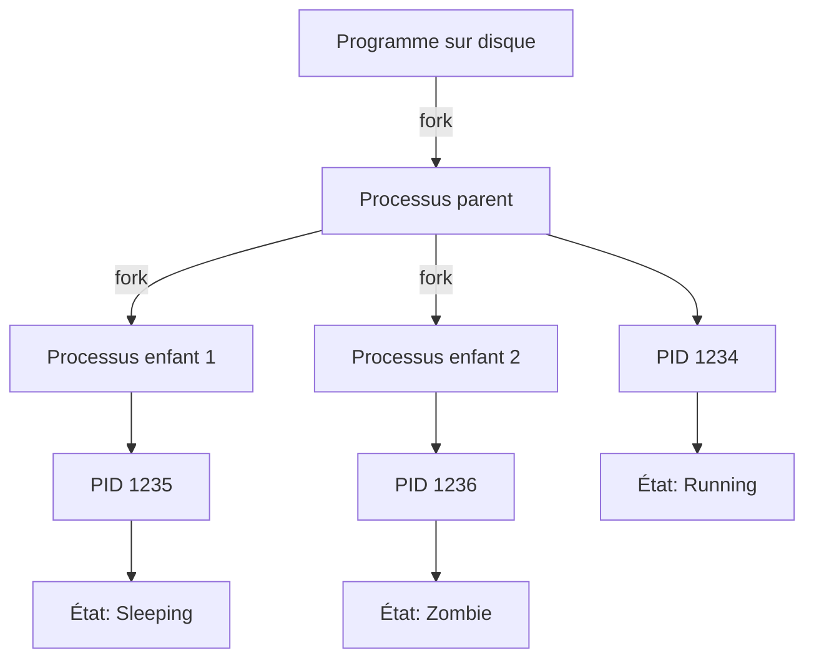

# Architecture Unix

## Introduction

**Niveau :** Débutant & Intermédiaire

!!! quote "Analogie pédagogique"
    _Imaginez une **ville bien organisée** : le noyau central (kernel) est comme l'hôtel de ville qui gère les ressources vitales (eau, électricité, routes), les services municipaux (shell, utilitaires) permettent aux citoyens d'interagir avec la ville, et chaque citoyen (processus) vit dans sa propre maison avec ses propres ressources, ne pouvant accéder aux autres qu'avec permission. **L'architecture Unix fonctionne exactement ainsi** : un système hiérarchique et modulaire où chaque composant a un rôle précis et communique avec les autres via des interfaces standardisées._

> Les systèmes **Unix** et leurs descendants (Linux, macOS, BSD) dominent **l'infrastructure mondiale** : ils alimentent 96.3% des serveurs web, tous les smartphones Android, les supercalculateurs, les systèmes embarqués, et constituent la fondation de l'Internet moderne. Comprendre l'architecture Unix revient à comprendre **comment fonctionne le monde numérique**.

L'architecture Unix repose sur des **principes fondamentaux** établis dans les années 1970 qui ont résisté à l'épreuve du temps : **simplicité**, **modularité**, **réutilisabilité**, et la philosophie que **tout est fichier**. Ces principes ont créé un écosystème où des milliers de programmes peuvent collaborer harmonieusement.

!!! info "Pourquoi c'est important ?"
    Comprendre Unix permet de **maîtriser Linux**, **administrer des serveurs**, **développer efficacement**, **automatiser des tâches**, et **comprendre les systèmes modernes** comme Docker, Kubernetes, Android et macOS qui héritent tous directement de cette architecture.

## Pour les vrais débutants

Si les termes **système d'exploitation**, **processus**, ou **fichier** vous semblent vagues, ce chapitre vous aidera à construire ces concepts. Aucune connaissance préalable n'est requise, mais une curiosité pour comprendre **comment les ordinateurs fonctionnent en profondeur** sera votre meilleur atout.

!!! tip "Pensez en couches superposées !"
    Unix est comme un **gâteau à plusieurs étages** : le matériel tout en bas, le kernel au milieu, les utilitaires au-dessus, et les applications tout en haut. Chaque couche utilise les services de la couche inférieure sans se préoccuper de ses détails internes.

## Histoire et évolution

### Les origines (1969-1973)

Unix naît en **1969** aux **Bell Labs** (AT&T) grâce à **Ken Thompson** et **Dennis Ritchie** comme réaction contre la complexité du système Multics.

**Principes fondateurs :**
- **Simplicité** : Faire une chose et la faire bien
- **Portabilité** : Écrire en langage C (inventé pour Unix)
- **Modularité** : Petits programmes composables
- **Ouverture** : Code source accessible

### L'arbre généalogique Unix

```mermaid
graph TD
    A["Unix 1969<br/>Bell Labs"] --> B[BSD 1977<br/>Berkeley"]
    A --> C["System V 1983<br/>AT&T"]
    
    B --> D["FreeBSD<br/>NetBSD<br/>OpenBSD"]
    B --> E["macOS<br/>iOS"]
    
    C --> F["Solaris<br/>AIX<br/>HP-UX"]
    
    A --> G["MINIX 1987<br/>Andrew Tanenbaum"]
    G --> H["Linux 1991<br/>Linus Torvalds"]
    
    H --> I["Ubuntu<br/>Debian<br/>Red Hat<br/>Arch"]
    H --> J[Android]
    
    style A fill:#e3f3e3
    style H fill:#f3e3e3
    style E fill:#e3e3f3
    style J fill:#f3f3d3
```

_Ce diagramme montre l'**influence massive** d'Unix sur les systèmes modernes. Linux et BSD représentent les réimplémentations libres, tandis que macOS descend directement de BSD._

### Unix aujourd'hui

**Systèmes Unix "purs" (certification officielle) :**
- macOS (certifié Unix 03)
- Solaris
- AIX (IBM)
- HP-UX

**Systèmes "Unix-like" (compatibles mais non certifiés) :**
- Linux (toutes distributions)
- FreeBSD/OpenBSD/NetBSD
- Android

## La philosophie Unix

La philosophie Unix tient en **quelques principes simples** qui guident toute décision de conception.

### Principe 1 : Tout est fichier
```mermaid
graph LR
    A[Concept Unix] --> B[Fichier régulier]
    A --> C[Répertoire]
    A --> D[Périphérique]
    A --> E[Socket]
    A --> F[Pipe]
    A --> G[Lien symbolique]
    
    B --> H[/home/user/doc.txt]
    C --> I[/home/user/]
    D --> J[/dev/sda<br/>disque dur]
    E --> K[/var/run/socket<br/>communication]
    F --> L[/tmp/pipe<br/>IPC]
    G --> M[/usr/bin/python<br/>→ python3.11]
```

**Implication :** Tous ces concepts s'accèdent avec les mêmes opérations : `open()`, `read()`, `write()`, `close()`.

**Exemple concret :**
```bash
# Lire un fichier texte
cat /home/user/doc.txt

# Lire les informations du processeur (fichier virtuel)
cat /proc/cpuinfo

# Écrire dans un périphérique
echo "Hello" > /dev/ttyUSB0

# Lire depuis un périphérique réseau
cat /dev/tcp/example.com/80
```

### Principe 2 : Programmes spécialisés et composables

Chaque programme Unix fait **une seule chose bien** et peut se **combiner avec d'autres**.

**Exemple de composition :**
```bash
# Compter les processus Firefox en cours
ps aux | grep firefox | wc -l

# Pipeline : ps génère → grep filtre → wc compte
```


### Principe 3 : Interface textuelle

Les données circulent sous forme de **flux de texte**, permettant l'interopérabilité maximale.

**Avantages :**
- ✅ Humain lisible
- ✅ Facilement transformable
- ✅ Indépendant du langage
- ✅ Composition triviale

### Principe 4 : Configuration en fichiers texte

**Toute la configuration** Unix se fait via des fichiers texte éditables.
```
/etc/
├── passwd          # Utilisateurs
├── group           # Groupes
├── hosts           # Résolution DNS locale
├── fstab           # Montage des disques
├── ssh/            # Configuration SSH
│   └── sshd_config
└── nginx/          # Configuration Nginx
    └── nginx.conf
```

## Architecture en couches

L'architecture Unix s'organise en **quatre couches principales**.


### Couche 1 : Matériel (Hardware)

Composants physiques : processeur, mémoire, disques, périphériques.

**Rôle :** Exécuter les instructions et stocker les données.

### Couche 2 : Kernel (Noyau)

Le **cœur du système d'exploitation** qui gère toutes les ressources.

**Responsabilités majeures :**

#### Gestion des processus


**Fonctions :**
- Création/destruction de processus (`fork`, `exec`, `exit`)
- Ordonnancement (CPU scheduling)
- Communication inter-processus (IPC)
- Signaux (SIGTERM, SIGKILL, etc.)

#### Gestion de la mémoire


**Fonctions :**
- Mémoire virtuelle (chaque processus voit sa propre mémoire)
- Pagination et swap
- Protection mémoire (isolation des processus)
- Allocation dynamique

#### Système de fichiers

**Hiérarchie Unix standardisée (FHS - Filesystem Hierarchy Standard) :**
```
/                    # Racine - Point de départ de tout le système
│
├── bin/             # Binaires essentiels pour tous les utilisateurs
│   ├── ls           # Lister fichiers
│   ├── cat          # Afficher contenu
│   ├── cp           # Copier
│   ├── mv           # Déplacer
│   └── bash         # Shell
│
├── boot/            # Fichiers de démarrage du système
│   ├── vmlinuz      # Noyau Linux compressé
│   ├── initrd.img   # Disque RAM initial
│   └── grub/        # Configuration bootloader
│
├── dev/             # Fichiers de périphériques (devices)
│   ├── sda          # Premier disque dur
│   ├── sda1         # Première partition
│   ├── null         # Périphérique "trou noir"
│   ├── random       # Générateur aléatoire
│   └── tty          # Terminaux
│
├── etc/             # Configuration système (Editable Text Configuration)
│   ├── passwd       # Base de données utilisateurs
│   ├── shadow       # Mots de passe chiffrés
│   ├── group        # Groupes d'utilisateurs
│   ├── fstab        # Table de montage des disques
│   ├── hostname     # Nom de la machine
│   ├── hosts        # Résolution DNS locale
│   ├── ssh/         # Configuration SSH
│   ├── nginx/       # Configuration Nginx
│   └── systemd/     # Configuration systemd
│
├── home/            # Répertoires personnels des utilisateurs
│   ├── alice/       # Répertoire de alice
│   │   ├── Documents/
│   │   ├── Downloads/
│   │   ├── .bashrc  # Configuration bash personnelle
│   │   └── .ssh/    # Clés SSH personnelles
│   └── bob/         # Répertoire de bob
│
├── lib/             # Bibliothèques partagées essentielles
│   ├── modules/     # Modules kernel
│   └── systemd/     # Bibliothèques systemd
│
├── lib64/           # Bibliothèques 64-bit (sur systèmes 64-bit)
│
├── media/           # Points de montage pour médias amovibles
│   ├── cdrom/       # CD-ROM
│   └── usb/         # Clés USB
│
├── mnt/             # Points de montage temporaires manuels
│   └── backup/      # Disque de sauvegarde monté manuellement
│
├── opt/             # Logiciels optionnels tiers
│   ├── google/      # Google Chrome
│   └── teamviewer/  # TeamViewer
│
├── proc/            # Système de fichiers virtuel (processus et kernel)
│   ├── cpuinfo      # Informations CPU
│   ├── meminfo      # Informations mémoire
│   ├── 1234/        # Dossier du processus PID 1234
│   │   ├── cmdline  # Ligne de commande du processus
│   │   ├── environ  # Variables d'environnement
│   │   └── status   # État du processus
│   └── sys/         # Paramètres kernel modifiables
│
├── root/            # Répertoire personnel du superutilisateur
│   └── .bash_history
│
├── run/             # Données runtime variables (tmpfs en RAM)
│   ├── user/        # Données runtime par utilisateur
│   └── lock/        # Fichiers de verrouillage
│
├── sbin/            # Binaires système (super-utilisateur)
│   ├── init         # Premier processus (PID 1)
│   ├── shutdown     # Arrêt système
│   ├── reboot       # Redémarrage
│   └── fdisk        # Partitionnement disques
│
├── srv/             # Données des services
│   ├── www/         # Sites web
│   ├── ftp/         # Serveur FTP
│   └── git/         # Dépôts Git
│
├── sys/             # Système de fichiers virtuel (kernel et devices)
│   ├── block/       # Périphériques bloc
│   ├── class/       # Classes de périphériques
│   └── devices/     # Arbre des périphériques
│
├── tmp/             # Fichiers temporaires (vidé au redémarrage)
│   └── session-*    # Sessions temporaires
│
├── usr/             # Hiérarchie utilisateur secondaire (Unix System Resources)
│   ├── bin/         # Binaires non essentiels
│   │   ├── python3
│   │   ├── gcc
│   │   └── git
│   ├── sbin/        # Binaires système non essentiels
│   ├── lib/         # Bibliothèques pour /usr/bin
│   ├── local/       # Logiciels installés localement
│   │   ├── bin/     # Binaires locaux
│   │   ├── lib/     # Bibliothèques locales
│   │   └── share/   # Données locales
│   ├── share/       # Données partagées indépendantes de l'architecture
│   │   ├── doc/     # Documentation
│   │   ├── man/     # Pages de manuel
│   │   ├── icons/   # Icônes
│   │   └── fonts/   # Polices
│   ├── src/         # Code source (optionnel)
│   └── include/     # Fichiers d'en-tête C/C++
│
└── var/             # Données variables (logs, cache, données d'application)
    ├── log/         # Fichiers de logs
    │   ├── syslog   # Log système
    │   ├── auth.log # Log d'authentification
    │   └── nginx/   # Logs Nginx
    ├── cache/       # Cache d'applications
    │   └── apt/     # Cache APT
    ├── tmp/         # Temporaires persistants entre redémarrages
    ├── spool/       # Files d'attente (mail, impression)
    │   ├── mail/    # File d'attente mail
    │   └── cron/    # Tâches cron
    ├── lib/         # Données d'état variables
    │   ├── mysql/   # Bases de données MySQL
    │   └── docker/  # Données Docker
    └── www/         # Données de sites web
        └── html/    # Site web par défaut
```

**Explications détaillées par répertoire :**

!!! note "Répertoires essentiels vs non-essentiels"
    - **Essentiels** (`/bin`, `/sbin`, `/lib`) : Nécessaires au démarrage et réparation
    - **Non-essentiels** (`/usr/bin`, `/usr/sbin`, `/usr/lib`) : Peuvent être sur partition séparée

!!! info "Différence /bin vs /usr/bin"
    - `/bin` : Commandes **critiques** pour boot et mode rescue (`ls`, `cat`, `cp`, `bash`)
    - `/usr/bin` : Commandes **normales** pour utilisation quotidienne (`gcc`, `python`, `git`)

!!! tip "Systèmes de fichiers virtuels"
    - `/proc` : Interface vers le **kernel** (lecture/écriture pour configurer)
    - `/sys` : Interface vers les **périphériques** (hotplug, power management)
    - `/dev` : Nœuds de **périphériques** (bloc et caractère)

**Systèmes de fichiers supportés :**

| FS | Type | Caractéristiques | Usage |
|----|------|------------------|-------|
| **ext4** | Journalisé | Standard, fiable, performant | Linux général |
| **XFS** | Journalisé | Gros fichiers, hautes performances | Serveurs, médias |
| **Btrfs** | COW | Snapshots, compression, RAID | Workstations, NAS |
| **ZFS** | COW | Intégrité données, RAID, compression | Serveurs enterprise |
| **F2FS** | Flash | Optimisé SSD/flash | Android, embedded |
| **tmpfs** | RAM | Ultra-rapide, volatile | /tmp, /run |
| **NTFS** | Propriétaire | Compatibilité Windows | Dual-boot |
| **FAT32** | Simple | Compatible universel | USB, SD cards |

#### Drivers matériels

Le kernel communique avec le matériel via des **drivers** (pilotes).

**Architecture modulaire :**
```
Kernel Core
    ↓
Couche d'abstraction matérielle (HAL)
    ↓
Drivers spécifiques (modules .ko)
    ↓ ↓ ↓ ↓ ↓
GPU | Réseau | USB | Son | Disque
```

**Gestion des modules :**
```bash
# Lister modules chargés
lsmod

# Informations sur un module
modinfo e1000e

# Charger un module
modprobe e1000e

# Décharger un module
modprobe -r e1000e

# Modules au démarrage
/etc/modules
/etc/modprobe.d/
```

### Couche 3 : Utilitaires système et Shell

Le **shell** est l'interface entre l'utilisateur et le kernel.

#### Shells courants

| Shell | Caractéristiques | Usage | Fichier config |
|-------|------------------|-------|----------------|
| **bash** | Standard, portable, scripting | Scripts, serveurs | ~/.bashrc |
| **zsh** | Moderne, plugins, themes | Interactif, dev | ~/.zshrc |
| **fish** | User-friendly, suggestions | Débutants | ~/.config/fish/ |
| **sh** | Minimaliste, POSIX | Scripts portables | - |
| **dash** | Rapide, minimal | Scripts système | - |

#### Utilitaires essentiels

**Manipulation de fichiers :**
```bash
ls      # Lister
cd      # Changer répertoire
pwd     # Afficher répertoire courant
cp      # Copier
mv      # Déplacer/renommer
rm      # Supprimer
mkdir   # Créer répertoire
rmdir   # Supprimer répertoire vide
touch   # Créer fichier vide / modifier timestamp
ln      # Créer liens
find    # Rechercher fichiers
```

**Traitement de texte :**
```bash
cat     # Afficher contenu
less    # Paginer contenu
head    # Premières lignes
tail    # Dernières lignes
grep    # Rechercher patterns
sed     # Édition de flux
awk     # Traitement de colonnes
cut     # Extraire colonnes
sort    # Trier
uniq    # Dédupliquer
wc      # Compter lignes/mots/caractères
tr      # Transformer caractères
```

**Processus :**
```bash
ps      # Lister processus
top     # Moniteur interactif
htop    # Moniteur amélioré
kill    # Envoyer signaux
killall # Tuer par nom
pkill   # Tuer par pattern
pgrep   # Chercher processus
jobs    # Tâches en arrière-plan
bg      # Mettre en background
fg      # Ramener en foreground
nohup   # Détacher du terminal
```

**Système :**
```bash
uname   # Info système
df      # Espace disque
du      # Usage disque
free    # Mémoire disponible
uptime  # Temps de fonctionnement
dmesg   # Messages kernel
journalctl # Logs systemd
systemctl  # Gestion services
```

**Réseau :**
```bash
ping    # Tester connectivité
curl    # Requêtes HTTP
wget    # Télécharger fichiers
ssh     # Connexion distante
scp     # Copie sécurisée
rsync   # Synchronisation
netstat # Statistiques réseau
ss      # Sockets réseau (moderne)
ip      # Configuration réseau (moderne)
```

### Couche 4 : Applications utilisateur

Applications de haut niveau qui utilisent les services des couches inférieures.

**Catégories :**
- **Environnements de bureau** : GNOME, KDE Plasma, XFCE, i3
- **Navigateurs** : Firefox, Chromium
- **IDEs** : VSCode, IntelliJ, Vim/Neovim
- **Serveurs** : Apache, Nginx, PostgreSQL, Redis
- **Conteneurs** : Docker, Podman, LXC

## Système de permissions

Unix implémente un **modèle de permissions rigoureux** basé sur utilisateurs, groupes et autres.

### Structure des permissions

Chaque fichier possède :
- **Propriétaire** (user)
- **Groupe** (group)
- **Autres** (others)

Avec trois types de permissions :
- **r** (read) : Lecture
- **w** (write) : Écriture
- **x** (execute) : Exécution

**Représentation :**
```bash
$ ls -l fichier.txt
-rw-r--r-- 1 alice developers 1024 Nov 15 10:30 fichier.txt
│└┬┘└┬┘└┬┘  │   │       │       │      │          └─ Nom
│ │  │  └───┼───┼───────┼───────┼──────┼───────────── Autres (r--)
│ │  └──────┼───┼───────┼───────┼──────┼───────────── Groupe (r--)
│ └─────────┼───┼───────┼───────┼──────┼───────────── Propriétaire (rw-)
└───────────┼───┼───────┼───────┼──────┴───────────── Type fichier (-)
            │   └───────┴───────┴────────────────────  1 lien, alice, developers
            └────────────────────────────────────────  Taille (1024 bytes)
```

**Types de fichiers :**
```
- : Fichier régulier
d : Répertoire
l : Lien symbolique
c : Périphérique caractère
b : Périphérique bloc
p : Pipe nommé (FIFO)
s : Socket
```

### Permissions en octal
```bash
r = 4 (lecture)
w = 2 (écriture)
x = 1 (exécution)

chmod 755 fichier.sh
# 7 = 4+2+1 = rwx (propriétaire)
# 5 = 4+0+1 = r-x (groupe)
# 5 = 4+0+1 = r-x (autres)
```

**Tableau de conversion :**

| Octal | Binaire | Symbolique | Description | Usage typique |
|-------|---------|------------|-------------|---------------|
| 0 | 000 | --- | Aucun droit | Rarement utilisé |
| 1 | 001 | --x | Exécution seule | Répertoires traversables |
| 2 | 010 | -w- | Écriture seule | Très rare |
| 3 | 011 | -wx | Écriture + Exécution | Drop folders |
| 4 | 100 | r-- | Lecture seule | Fichiers protégés |
| 5 | 101 | r-x | Lecture + Exécution | Scripts, binaires publics |
| 6 | 110 | rw- | Lecture + Écriture | Fichiers utilisateur |
| 7 | 111 | rwx | Tous droits | Propriétaire, scripts |

**Exemples courants :**
```bash
chmod 644 fichier.txt    # -rw-r--r-- (fichiers normaux)
chmod 755 script.sh      # -rwxr-xr-x (scripts exécutables)
chmod 700 ~/.ssh/        # drwx------ (répertoire privé)
chmod 600 ~/.ssh/id_rsa  # -rw------- (clé SSH privée)
chmod 777 /tmp/shared/   # drwxrwxrwx (répertoire partagé)
```

### Permissions spéciales

#### Setuid (SUID) - bit 4000

Permet d'exécuter un fichier avec les **permissions du propriétaire**.
```bash
-rwsr-xr-x 1 root root 47032 /usr/bin/passwd
     └─ s indique SUID activé

# L'utilisateur alice exécute passwd avec les droits root
# pour modifier /etc/shadow (accessible uniquement par root)

chmod u+s fichier    # Ajouter SUID
chmod 4755 fichier   # SUID + rwxr-xr-x
```

**Cas d'usage légitime :**
- `passwd` : Modifier son mot de passe
- `sudo` : Exécuter commandes avec privilèges
- `ping` : Envoyer paquets ICMP (nécessite privilèges réseau)

!!! danger "Sécurité SUID"
    Les binaires SUID sont des **cibles privilégiées** pour l'élévation de privilèges. Auditez régulièrement :
```bash
    find / -perm -4000 -type f 2>/dev/null
```

#### Setgid (SGID) - bit 2000

**Pour fichiers :** Exécution avec droits du **groupe**.

**Pour répertoires :** Nouveaux fichiers héritent du **groupe du répertoire**.
```bash
drwxrws--- 2 alice developers 4096 /shared/project/
      └─ s indique SGID activé

chmod g+s repertoire  # Ajouter SGID
chmod 2755 repertoire # SGID + rwxr-xr-x
```

**Exemple pratique :**
```bash
# Répertoire partagé entre développeurs
mkdir /shared/dev
chgrp developers /shared/dev
chmod 2775 /shared/dev

# Tous les fichiers créés appartiendront au groupe "developers"
# même si créés par différents utilisateurs
```

#### Sticky bit - bit 1000

Sur **répertoires** : Seul le propriétaire peut **supprimer ses propres fichiers**.
```bash
drwxrwxrwt 10 root root 4096 /tmp/
         └─ t indique sticky bit activé

chmod +t repertoire   # Ajouter sticky bit
chmod 1777 repertoire # Sticky + rwxrwxrwx
```

**Cas d'usage :**
- `/tmp` : Répertoire temporaire multi-utilisateurs
- Répertoires de partage où plusieurs utilisateurs écrivent

## Processus et IPC

### Cycle de vie d'un processus


### États des processus

| État | Symbole ps | Description |
|------|-----------|-------------|
| **Running** | R | En cours d'exécution sur CPU |
| **Sleeping** | S | Attente interruptible (peut recevoir signaux) |
| **Uninterruptible** | D | Attente non interruptible (I/O critique) |
| **Stopped** | T | Arrêté (SIGSTOP, Ctrl+Z) |
| **Zombie** | Z | Terminé, attend lecture du parent |

### Hiérarchie des processus

Tous les processus descendent du processus **init** (PID 1).
```bash
systemd (PID 1)
├── systemd-journald (PID 123)
├── systemd-udevd (PID 124)
├── sshd (PID 234)
│   ├── sshd (PID 1234) --- Session Alice
│   │   └── bash (PID 1235)
│   │       └── vim (PID 1236)
│   └── sshd (PID 1240) --- Session Bob
├── nginx (PID 456)
│   ├── nginx worker (PID 457)
│   ├── nginx worker (PID 458)
│   └── nginx worker (PID 459)
└── firefox (PID 2000)
    ├── firefox-tab (PID 2001)
    ├── firefox-tab (PID 2002)
    └── firefox-gpu (PID 2003)
```

**Visualiser l'arbre :**
```bash
pstree -p          # Arbre avec PIDs
ps auxf            # Format forêt
systemd-cgls       # Hiérarchie systemd (cgroups)
```

### Communication inter-processus (IPC)

#### Pipes (tubes)

Communication unidirectionnelle.

**Pipe anonyme :**
```bash
# Communication entre processus liés (parent-enfant)
ls -la | grep ".txt" | wc -l
```

**Pipe nommé (FIFO) :**
```bash
# Communication entre processus non liés
mkfifo mypipe

# Terminal 1 (producteur)
echo "Hello World" > mypipe

# Terminal 2 (consommateur)
cat < mypipe
```

#### Signaux

Messages asynchrones envoyés aux processus.

| Signal | Numéro | Capturable | Action défaut | Usage |
|--------|--------|------------|---------------|-------|
| **SIGHUP** | 1 | ✅ | Terminer | Réinitialisation (démon) |
| **SIGINT** | 2 | ✅ | Terminer | Interruption (Ctrl+C) |
| **SIGQUIT** | 3 | ✅ | Core dump | Quit avec dump (Ctrl+\\) |
| **SIGKILL** | 9 | ❌ | Terminer | Force kill immédiat |
| **SIGSEGV** | 11 | ✅ | Core dump | Violation mémoire |
| **SIGTERM** | 15 | ✅ | Terminer | Arrêt propre (défaut kill) |
| **SIGSTOP** | 19 | ❌ | Suspendre | Pause forcée |
| **SIGCONT** | 18 | ✅ | Reprendre | Reprend après STOP |
| **SIGCHLD** | 17 | ✅ | Ignorer | Fils terminé |
```bash
# Envoyer des signaux
kill -15 1234        # SIGTERM (arrêt propre) - recommandé
kill -9 1234         # SIGKILL (force kill) - dernier recours
kill -1 1234         # SIGHUP (recharger config)
killall firefox      # Tue tous les processus firefox
pkill -u alice       # Tue tous processus de alice
pkill -9 -f "python script.py"  # Force kill par ligne de commande

# Ignorer les signaux dans le shell
trap '' SIGINT       # Ignore Ctrl+C
trap '' SIGTERM      # Ignore kill normal
```

#### Sockets

Communication bidirectionnelle locale ou réseau.

**Unix Domain Sockets (local) :**
```bash
# Sockets système courants
/var/run/docker.sock       # Docker daemon
/tmp/mysql.sock            # MySQL
/run/systemd/private       # systemd
/run/dbus/system_bus_socket  # D-Bus
```

**Network Sockets (distant) :**
```bash
# Format : PROTOCOLE IP:PORT
TCP 192.168.1.10:8080
UDP 0.0.0.0:53
TCP6 [::1]:22
```

#### Shared Memory (Mémoire partagée)

Zone mémoire accessible par plusieurs processus - ultra-rapide.
```bash
# Voir les segments mémoire partagés
ipcs -m

# Créer segment mémoire partagée (en C)
shmget() / shmat() / shmdt()
```

#### Message Queues (Files de messages)
```bash
# Voir les files de messages
ipcs -q
```

## Utilisateurs et groupes

### Types d'utilisateurs
```bash
# Superutilisateur (root)
UID: 0
GID: 0
Tous les droits système

# Utilisateurs système (démons, services)
UID: 1-999
Exemples: www-data (Apache), mysql, sshd, systemd-network

# Utilisateurs normaux
UID: 1000+
Utilisateurs humains interactifs
```

### Fichiers de configuration

**/etc/passwd** : Base de données utilisateurs
```
alice:x:1000:1000:Alice Dupont:/home/alice:/bin/bash
│     │  │    │    │             │            └─ Shell par défaut
│     │  │    │    │             └──────────────── Répertoire home
│     │  │    │    └────────────────────────────── Nom complet (GECOS)
│     │  │    └─────────────────────────────────── GID (groupe principal)
│     │  └──────────────────────────────────────── UID
│     └─────────────────────────────────────────── x = mot de passe dans /etc/shadow
└───────────────────────────────────────────────── Nom d'utilisateur
```

**/etc/shadow** : Mots de passe chiffrés (permissions 640, root:shadow)
```
alice:$6$rounds=5000$salt$hash...:19000:0:99999:7:30:19100:
│                                 │     │   │   │ │  └───── Date expiration compte
│                                 │     │   │   │ └──────── Jours inactivité avant désactivation
│                                 │     │   │   └────────── Jours avant avertissement expiration
│                                 │     │   └────────────── Jours max avant changement obligatoire
│                                 │     └────────────────── Jours min avant changement autorisé
│                                 └──────────────────────── Jours depuis epoch (01/01/1970)
└─────────────────────────────────────────────────────────── Hash SHA-512 du mot de passe
```

**Format du hash :**
```
$id$salt$hash
 │   │    └─ Hash résultant
 │   └────── Salt aléatoire
 └────────── ID algorithme (6=SHA-512, 5=SHA-256, 1=MD5)
```

**/etc/group** : Base de données groupes
```
developers:x:1001:alice,bob,charlie
│          │  │    └─────────────── Membres secondaires du groupe
│          │  └──────────────────── GID
│          └─────────────────────── x = pas de mot de passe groupe (obsolète)
└────────────────────────────────── Nom du groupe
```

**/etc/gshadow** : Mots de passe groupes (rarement utilisé)
```
developers:!::alice,bob,charlie
│          │ │ └───────────────── Membres
│          │ └─────────────────── Administrateurs du groupe
│          └───────────────────── ! = pas de mot de passe
└──────────────────────────────── Nom du groupe
```

### Commandes de gestion
```bash
# Utilisateurs
useradd alice              # Créer utilisateur
usermod -aG sudo alice     # Ajouter au groupe sudo
userdel alice              # Supprimer utilisateur
passwd alice               # Changer mot de passe
id alice                   # Infos utilisateur
whoami                     # Utilisateur courant
w                          # Qui est connecté

# Groupes
groupadd developers        # Créer groupe
groupdel developers        # Supprimer groupe
groups alice               # Groupes de alice
newgrp developers          # Changer groupe primaire (session)

# Changement d'identité
su - alice                 # Devenir alice (avec environnement)
sudo -u alice command      # Exécuter commande en tant que alice
sudo -i                    # Shell root interactif
```

## Démarrage du système (Boot Process)


### Étapes détaillées

#### 1. BIOS/UEFI

**BIOS (Legacy) :**
- Lit MBR (Master Boot Record) - 512 bytes au début du disque
- Charge bootloader (GRUB)

**UEFI (Moderne) :**
- Partition EFI (FAT32) montée sur `/boot/efi`
- Fichiers `.efi` directement exécutables
- Secure Boot (signatures cryptographiques)

#### 2. Bootloader (GRUB2)
```bash
# Configuration GRUB
/boot/grub/grub.cfg              # Config générée (ne pas éditer)
/etc/default/grub                # Paramètres GRUB
/etc/grub.d/                     # Scripts générateurs

# Régénérer config GRUB
sudo update-grub                 # Debian/Ubuntu
sudo grub2-mkconfig -o /boot/grub2/grub.cfg  # Red Hat/Fedora

# Paramètres kernel communs
quiet                            # Messages réduits
splash                           # Écran de démarrage
ro                              # Mount root en lecture seule initialement
init=/bin/bash                  # Shell de secours (mode rescue)
```

#### 3. Kernel Linux

Le kernel décompressé (`vmlinuz` → `vmlinux`) :
1. Initialise matériel (CPU, mémoire, devices)
2. Monte initramfs en mémoire
3. Exécute `/init` dans initramfs

#### 4. initramfs (Initial RAM Filesystem)

Système minimal contenant :
- Drivers essentiels (stockage, réseau)
- Scripts de démarrage
- Utilitaires (fsck, lvm, cryptsetup)
```bash
# Voir contenu initramfs
lsinitrd /boot/initramfs-$(uname -r).img   # Red Hat
lsinitramfs /boot/initrd.img-$(uname -r)   # Debian

# Régénérer initramfs
mkinitramfs -o /boot/initrd.img            # Debian/Ubuntu
dracut --force                             # Red Hat/Fedora
```

**Rôle :**
- Monter système de fichiers root (peut être chiffré, LVM, RAID)
- Charger modules kernel nécessaires
- Pivot vers système réel

#### 5. systemd (Init PID 1)

systemd remplace les anciens SysVinit et Upstart.

**Concepts clés :**

**Units (unités) :**
- **service** : Démons (nginx.service)
- **target** : Groupes d'unités (multi-user.target)
- **mount** : Points de montage
- **socket** : Activation par socket
- **timer** : Planification (remplace cron)

**Targets principaux :**
```bash
poweroff.target      # Arrêt
rescue.target        # Mode rescue (single-user)
multi-user.target    # Mode console multi-utilisateurs
graphical.target     # Mode graphique
reboot.target        # Redémarrage
```

**Commandes systemd :**
```bash
# Gestion services
systemctl start nginx          # Démarrer
systemctl stop nginx           # Arrêter
systemctl restart nginx        # Redémarrer
systemctl reload nginx         # Recharger config
systemctl enable nginx         # Activer au boot
systemctl disable nginx        # Désactiver au boot
systemctl status nginx         # État détaillé
systemctl is-active nginx      # Actif ?
systemctl is-enabled nginx     # Activé au boot ?

# Système
systemctl reboot               # Redémarrer
systemctl poweroff             # Éteindre
systemctl suspend              # Suspendre
systemctl hibernate            # Hiberner

# Analyse
systemctl list-units           # Toutes les unités
systemctl list-unit-files      # Fichiers d'unités
systemctl --failed             # Unités échouées
systemd-analyze                # Temps de boot
systemd-analyze blame          # Services les plus lents
systemd-analyze critical-chain # Chaîne critique de boot

# Logs
journalctl                     # Tous les logs
journalctl -u nginx            # Logs nginx
journalctl -f                  # Suivre logs (tail -f)
journalctl -b                  # Logs du boot actuel
journalctl --since "1 hour ago"
```

## Le mot de la fin

!!! quote
    L'architecture Unix représente **plus de 50 ans d'évolution** vers la simplicité, la modularité et l'élégance. Ses principes fondamentaux - **tout est fichier**, **programmes composables**, **interface textuelle** - ont créé un écosystème où des milliers d'outils collaborent harmonieusement.
    
    Comprendre l'architecture Unix va bien au-delà de la mémorisation de répertoires ou de commandes. C'est **saisir une philosophie** de conception qui valorise la clarté, la réutilisabilité et l'ouverture. Ces principes transcendent Unix et influencent profondément l'architecture moderne : microservices, containers, APIs REST, et même l'organisation du code.
    
    La **hiérarchie des fichiers** n'est pas arbitraire - chaque répertoire a une raison d'être précise. Le **modèle de permissions** protège le système tout en permettant la collaboration. Les **processus** communiquent via des abstractions élégantes. Tout s'emboîte dans un design cohérent et logique.
    
    Maîtriser Unix, c'est acquérir une **vision systémique** de l'informatique où chaque élément s'intègre naturellement dans un tout cohérent. Cette compréhension profonde transforme les problèmes complexes en compositions élégantes de solutions simples - l'essence même de la philosophie Unix.

---

!!! abstract "Métadonnées"
    **Version** : 1.0  
    **Dernière mise à jour** : Novembre 2025  
    **Durée de lecture** : 50-55 minutes  
    **Niveau** : Débutant & Intermédiaire