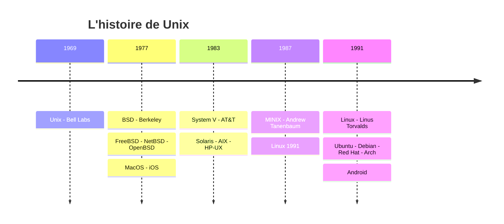
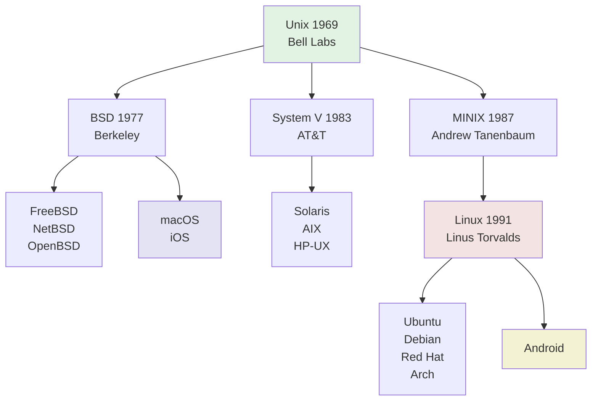
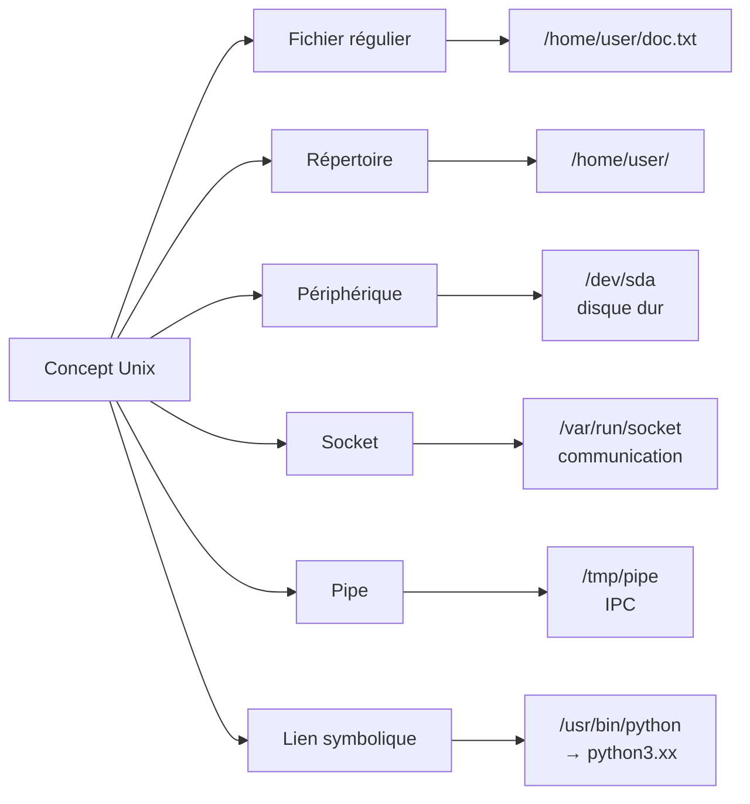
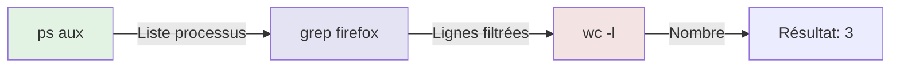
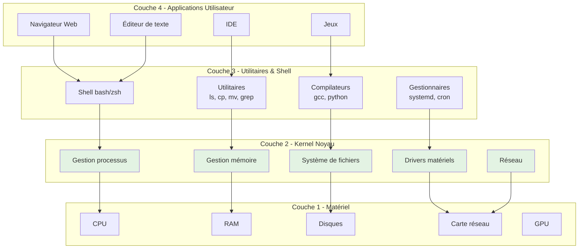
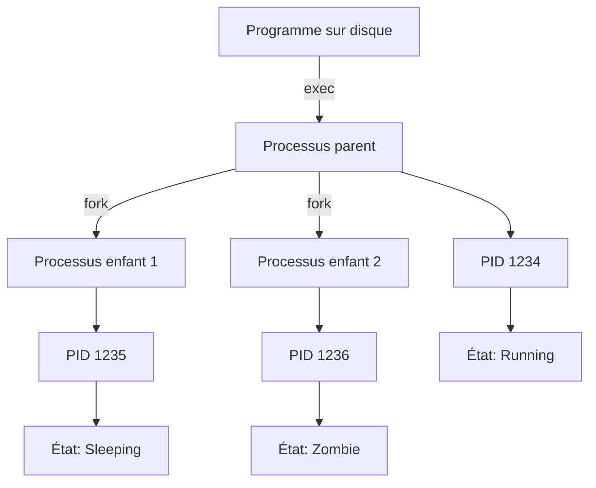
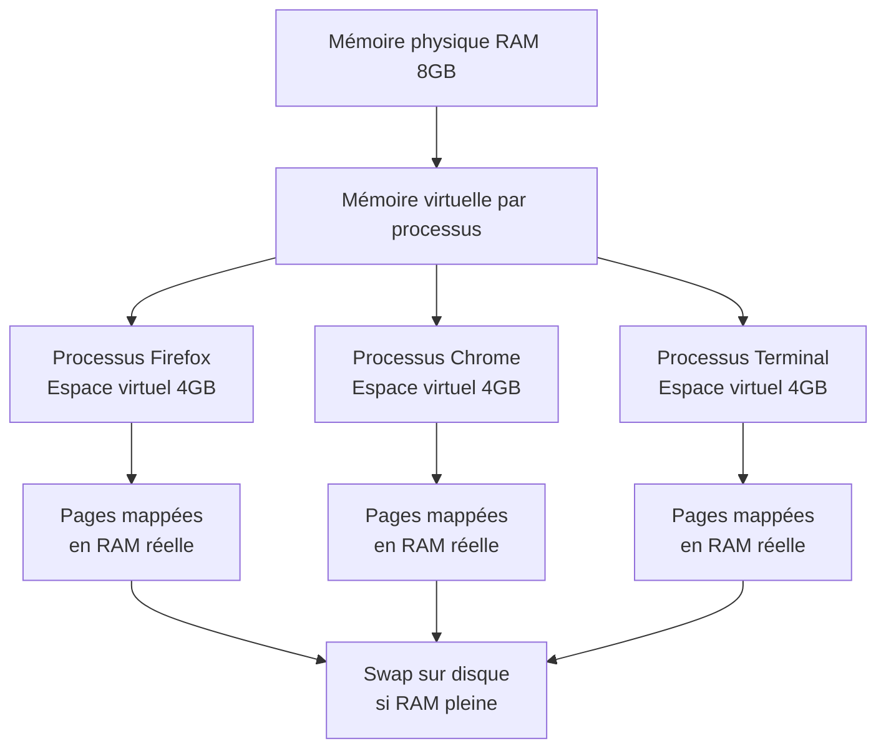
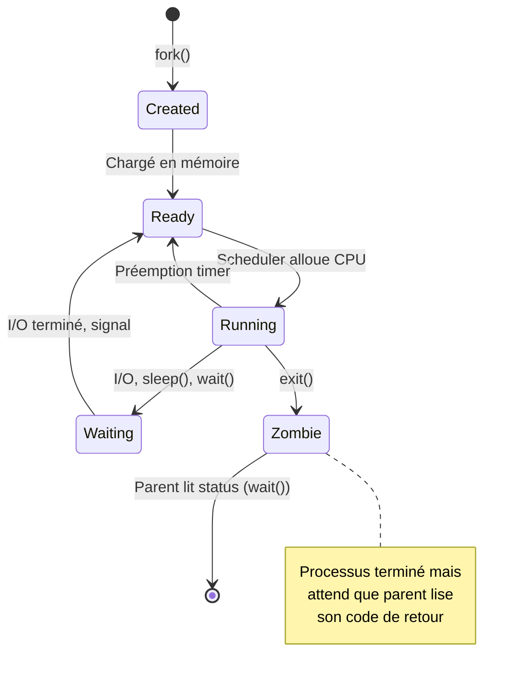
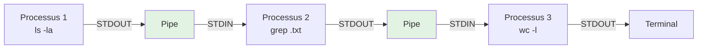
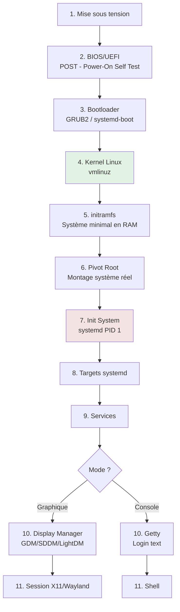

# Architecture Unix

## Introduction

<div
  class="omny-meta"
  data-level="🟢 Débutant & 🟡 Intermédiaire"
  data-version="1.4"
  data-time="50-55 minutes">
</div>

!!! quote "Analogie pédagogique"
    _Imaginez une **ville bien organisée** : le noyau central (kernel) est comme l'hôtel de ville qui gère les ressources vitales (eau, électricité, routes), les services municipaux (shell, utilitaires) permettent aux citoyens d'interagir avec la ville, et chaque citoyen (processus) vit dans sa propre maison avec ses propres ressources, ne pouvant accéder aux autres qu'avec permission. **L'architecture Unix fonctionne exactement ainsi** : un système hiérarchique et modulaire où chaque composant a un rôle précis et communique avec les autres via des interfaces standardisées._

> Les systèmes **Unix** et leurs descendants (Linux, macOS, BSD) dominent **l'infrastructure mondiale** : ils alimentent **96.3% des serveurs web**, **tous les smartphones Android**, **les supercalculateurs**, **les systèmes embarqués**, et constituent la fondation de l'Internet moderne. Comprendre l'architecture Unix revient à comprendre **comment fonctionne le monde numérique**.

L'architecture Unix repose sur des **principes fondamentaux** établis dans les années 1970 qui ont résisté à l'épreuve du temps : **simplicité**, **modularité**, **réutilisabilité**, et la philosophie que **tout est fichier**. Ces principes ont créé un écosystème où des milliers de programmes peuvent collaborer harmonieusement.

!!! info "Pourquoi c'est important ?"
    Comprendre Unix permet de **maîtriser Linux**, **administrer des serveurs**, **développer efficacement**, **automatiser des tâches**, et **comprendre les systèmes modernes** comme Docker, Kubernetes, Android et macOS qui héritent tous directement de cette architecture.

!!! tip "L'année 1970 et l'Epoch Unix"
    Le **1er janvier 1970 à 00:00:00 UTC** marque l'**Epoch Unix**, point de départ du temps dans les systèmes Unix/Linux. Tous les timestamps sont calculés en **secondes écoulées depuis cette date**. Par exemple, le timestamp `1700000000` représente le 14 novembre 2023 à 22:13:20 UTC. Cette convention universelle permet de synchroniser les horloges système, gérer les fichiers, planifier des tâches cron, et garantir la cohérence temporelle entre tous les systèmes Unix du monde entier.

## Pour repartir des bases (vrais débutants)

Si les termes **système d'exploitation**, **processus**, ou **fichier** vous semblent vagues, ce chapitre vous aidera à construire ces concepts. Aucune connaissance préalable n'est requise, mais une curiosité pour comprendre **comment les ordinateurs fonctionnent en profondeur** sera votre meilleur atout.

!!! tip "Pensez en couches superposées !"
    Unix est comme un **gâteau à plusieurs étages** : le matériel tout en bas, le kernel au milieu, les utilitaires au-dessus, et les applications tout en haut. Chaque couche utilise les services de la couche inférieure sans se préoccuper de ses détails internes.
    
    Cette architecture en couches rappelle le **Modèle OSI** et le **Modèle TCP/IP** que nous étudions dans les cours réseau.

## Histoire et évolution

### › Les origines (1969-1973)

Unix naît en **1969** aux **Bell Labs** (AT&T) grâce à **Ken Thompson** et **Dennis Ritchie** comme réaction contre la complexité du système Multics[^1].

**Principes fondateurs :**

- [x] **Simplicité** : Faire une chose et la faire bien
- [x] **Portabilité** : Écrire en langage C (inventé pour Unix)
- [x] **Modularité** : Petits programmes composables
- [x] **Ouverture** : Code source accessible

### › Timeline historique


```mermaid
timeline
  title L'histoire de Unix
  1969  : Unix - Bell Labs
  1977  : BSD - Berkeley
        : FreeBSD - NetBSD - OpenBSD
        : MacOS - iOS
  1983  : System V - AT&T
        : Solaris - AIX - HP-UX
  1987  : MINIX - Andrew Tanenbaum
        : Linux 1991
  1991  : Linux - Linus Torvalds
        : Ubuntu - Debian - Red Hat - Arch
        : Android
```

### › L'arbre généalogique Unix

Afin de mieux comprendre la timeline précédente, nous la transformons en arbre généalogique pour mieux assimiler le concept.


```mermaid
graph TD
    A["Unix 1969<br/>Bell Labs"] --> B["BSD 1977<br/>Berkeley"]
    A --> C["System V 1983<br/>AT&T"]
    
    B --> D["FreeBSD<br/>NetBSD<br/>OpenBSD"]
    B --> E["macOS<br/>iOS"]
    
    C --> F["Solaris<br/>AIX<br/>HP-UX"]
    
    A --> G["MINIX 1987<br/>Andrew Tanenbaum"]
    G --> H["Linux 1991<br/>Linus Torvalds"]
    
    H --> I["Ubuntu<br/>Debian<br/>Red Hat<br/>Arch"]
    H --> J[Android]
    
    style A fill:#e3f3e3
    style H fill:#f3e3e3
    style E fill:#e3e3f3
    style J fill:#f3f3d3
```

_Ce diagramme montre l'**influence massive** d'Unix sur les systèmes modernes. Linux et BSD représentent les réimplémentations libres, tandis que macOS descend directement de BSD._

### › Unix aujourd'hui

**Systèmes Unix "purs" (certification officielle) :**

- macOS (certifié Unix 03)
- Solaris
- AIX (IBM)
- HP-UX

**Systèmes "Unix-like" (compatibles mais non certifiés) :**

- Linux (toutes distributions)
- FreeBSD/OpenBSD/NetBSD
- Android

## La philosophie Unix

La philosophie Unix tient en **quelques principes simples** qui guident toute décision de conception.

### › Principe 1 : Tout est fichier


```mermaid
graph LR
    A[Concept Unix] --> B[Fichier régulier]
    A --> C[Répertoire]
    A --> D[Périphérique]
    A --> E[Socket]
    A --> F[Pipe]
    A --> G[Lien symbolique]
    
    B --> H["/home/user/doc.txt"]
    C --> I["/home/user/"]
    D --> J["/dev/sda<br/>disque dur"]
    E --> K["/var/run/socket<br/>communication"]
    F --> L["/tmp/pipe<br/>IPC"]
    G --> M["/usr/bin/python<br/>→ python3.xx"]
```

**Implication :** Tous ces concepts s'accèdent avec les mêmes opérations : `open()`, `read()`, `write()`, `close()`.

**Exemple concret**

=== ":lucide-terminal: Bash"

    ```bash
    # Lire un fichier texte
    cat /home/user/doc.txt

    # Lire les informations du processeur (fichier virtuel)
    cat /proc/cpuinfo

    # Écrire dans un périphérique
    echo "Hello" > /dev/ttyUSB0

    # Lire depuis un périphérique réseau
    cat /dev/tcp/example.com/80
    ```

### › Principe 2 : Programmes spécialisés et composables

Chaque programme Unix fait **une seule chose bien** et peut se **combiner avec d'autres**.

**Exemple de composition :**

=== ":lucide-terminal: Bash"

    ```bash
    # Compter les processus Firefox en cours
    ps aux | grep firefox | wc -l

    # Pipeline : ps génère → grep filtre → wc compte
    ```


```mermaid
graph LR
    A[ps aux] -->|Liste processus| B[grep firefox]
    B -->|Lignes filtrées| C[wc -l]
    C -->|Nombre| D[Résultat: 3]
    
    style A fill:#e3f3e3
    style B fill:#e3e3f3
    style C fill:#f3e3e3
```

### › Principe 3 : Interface textuelle

Les données circulent sous forme de **flux de texte**, permettant l'interopérabilité maximale.

**Avantages :**

- [x] Humain lisible
- [x] Facilement transformable
- [x] Indépendant du langage
- [x] Composition triviale

### › Principe 4 : Configuration en fichiers texte

**Toute la configuration** Unix se fait via des fichiers texte éditables.

```
📂 /etc/
├── 📄 passwd             # Utilisateurs
├── 📄 group              # Groupes
├── 📄 hosts              # Résolution DNS locale
├── 📄 fstab              # Montage des disques
├── 📂 ssh/               # Configuration SSH
│   └── 📄 sshd_config
└── 📂 nginx/             # Configuration Nginx
    └── 📄 nginx.conf
```

!!! danger "Sécurité des fichiers de configuration"
    Les fichiers de configuration contiennent souvent **des informations sensibles** (mots de passe, clés API, chemins critiques). Une mauvaise gestion des **permissions** peut exposer votre système à des attaques. Vérifiez systématiquement que :
    
    - Les fichiers sensibles ont les permissions `600` (rw-------)
    - Les répertoires de configuration ont les permissions `700` (rwx------)
    - Seul le propriétaire légitime peut lire/modifier ces fichiers
    
!!! example "Exemple d'audit rapide"
    
    ```bash
    # Trouver les fichiers de config trop permissifs
    find /etc -type f -perm /go+w 2>/dev/null
    ```

## Architecture en couches

L'architecture Unix s'organise en **quatre couches principales**.


```mermaid
graph TB
    subgraph "Couche 4 - Applications Utilisateur"
        A1[Navigateur Web]
        A2[Éditeur de texte]
        A3[IDE]
        A4[Jeux]
    end
    
    subgraph "Couche 3 - Utilitaires & Shell"
        B1[Shell bash/zsh]
        B2[Utilitaires<br/>ls, cp, mv, grep]
        B3[Compilateurs<br/>gcc, python]
        B4[Gestionnaires<br/>systemd, cron]
    end
    
    subgraph "Couche 2 - Kernel Noyau"
        C1[Gestion processus]
        C2[Gestion mémoire]
        C3[Système de fichiers]
        C4[Drivers matériels]
        C5[Réseau]
    end
    
    subgraph "Couche 1 - Matériel"
        D1[CPU]
        D2[RAM]
        D3[Disques]
        D4[Carte réseau]
        D5[GPU]
    end
    
    A1 --> B1
    A2 --> B1
    A3 --> B2
    A4 --> B3
    
    B1 --> C1
    B2 --> C2
    B3 --> C3
    B4 --> C4
    
    C1 --> D1
    C2 --> D2
    C3 --> D3
    C4 --> D4
    C5 --> D4
    
    style C1 fill:#e3f3e3
    style C2 fill:#e3f3e3
    style C3 fill:#e3f3e3
    style C4 fill:#e3f3e3
    style C5 fill:#e3f3e3
```

### › Couche 1 : Matériel (Hardware)

Composants physiques : **processeur**, **mémoire**, **disques**, **périphériques**.

**Rôle :** Exécuter les instructions et stocker les données.

### › Couche 2 : Kernel (Noyau)

Le **cœur du système d'exploitation** qui gère toutes les ressources.

**Responsabilités majeures :**

#### Gestion des processus

!!! note "Qu'est-ce qu'un fork ?"
    Le **fork** est l'opération système fondamentale pour créer un nouveau processus sous Unix. Lorsqu'un processus appelle `fork()`, le kernel crée une **copie complète** du processus parent (code, données, descripteurs de fichiers). Le processus enfant reçoit un **nouveau PID** et s'exécute indépendamment. C'est ainsi que tous les processus naissent sous Unix : par duplication successive depuis le processus init (PID 1).


```mermaid
graph TD
    A[Programme sur disque] -->|exec| B[Processus parent]
    B -->|fork| C[Processus enfant 1]
    B -->|fork| D[Processus enfant 2]
    
    B --> E[PID 1234]
    C --> F[PID 1235]
    D --> G[PID 1236]
    
    E --> H[État: Running]
    F --> I[État: Sleeping]
    G --> J[État: Zombie]
```

**Fonctions :**

- Création/destruction de processus (`fork`, `exec`, `exit`)
- Ordonnancement (CPU scheduling)
- Communication inter-processus (IPC)
- Signaux (SIGTERM, SIGKILL, etc.)

#### Gestion de la mémoire


```mermaid
graph TB
    A[Mémoire physique RAM 8GB] --> B[Mémoire virtuelle par processus]
    
    B --> C[Processus Firefox<br/>Espace virtuel 4GB]
    B --> D[Processus Chrome<br/>Espace virtuel 4GB]
    B --> E[Processus Terminal<br/>Espace virtuel 4GB]
    
    C --> F[Pages mappées<br/>en RAM réelle]
    D --> G[Pages mappées<br/>en RAM réelle]
    E --> H[Pages mappées<br/>en RAM réelle]
    
    F --> I[Swap sur disque<br/>si RAM pleine]
    G --> I
    H --> I
```

**Fonctions :**

- Mémoire virtuelle (chaque processus voit sa propre mémoire)
- Pagination et swap
- Protection mémoire (isolation des processus)
- Allocation dynamique

#### Système de fichiers

**Hiérarchie Unix standardisée (FHS - Filesystem Hierarchy Standard) :**

```
📂 /                    # Racine - Point de départ de tout le système
│
├── 📂 bin/             # Binaires essentiels pour tous les utilisateurs
│   ├── 📃 ls           # Lister fichiers
│   ├── 📃 cat          # Afficher contenu
│   ├── 📃 cp           # Copier
│   ├── 📃 mv           # Déplacer
│   └── 📃 bash         # Shell
│
├── 📂 boot/            # Fichiers de démarrage du système
│   ├── 📃 vmlinuz      # Noyau Linux compressé
│   ├── 📃 initrd.img   # Disque RAM initial
│   └── 📂 grub/        # Configuration bootloader
│
├── 📂 dev/             # Fichiers de périphériques (devices)
│   ├── 📃 sda          # Premier disque dur
│   ├── 📃 sda1         # Première partition
│   ├── 📃 null         # Périphérique "trou noir"
│   ├── 📃 random       # Générateur aléatoire
│   └── 📃 tty          # Terminaux
│
├── 📂 etc/             # Configuration système (Editable Text Configuration)
│   ├── 📃 passwd       # Base de données utilisateurs
│   ├── 📃 shadow       # Mots de passe chiffrés
│   ├── 📃 group        # Groupes d'utilisateurs
│   ├── 📃 fstab        # Table de montage des disques
│   ├── 📃 hostname     # Nom de la machine
│   ├── 📃 hosts        # Résolution DNS locale
│   ├── 📂 ssh/         # Configuration SSH
│   ├── 📂 nginx/       # Configuration Nginx
│   └── 📂 systemd/     # Configuration systemd
│
├── 📂 home/            # Répertoires personnels des utilisateurs
│   ├── 📂 alice/       # Répertoire de alice
│   │   ├── 📂 Documents/
│   │   ├── 📂 Downloads/
│   │   ├── 📃 .bashrc  # Configuration bash personnelle
│   │   └── 📂 .ssh/    # Clés SSH personnelles
│   └── 📂 bob/         # Répertoire de bob
│
├── 📂 lib/             # Bibliothèques partagées essentielles
│   ├── 📂 modules/     # Modules kernel
│   └── 📂 systemd/     # Bibliothèques systemd
│
├── 📂 lib64/           # Bibliothèques 64-bit (sur systèmes 64-bit)
│
├── 📂 media/           # Points de montage pour médias amovibles
│   ├── 📂 cdrom/       # CD-ROM
│   └── 📂 usb/         # Clés USB
│
├── 📂 mnt/             # Points de montage temporaires manuels
│   └── 📂 backup/      # Disque de sauvegarde monté manuellement
│
├── 📂 opt/             # Logiciels optionnels tiers
│   ├── 📂 google/      # Google Chrome
│   └── 📂 teamviewer/  # TeamViewer
│
├── 📂 proc/            # Système de fichiers virtuel (processus et kernel)
│   ├── 📃 cpuinfo      # Informations CPU
│   ├── 📃 meminfo      # Informations mémoire
│   ├── 📂 1234/        # Dossier du processus PID 1234
│   │   ├── 📃 cmdline  # Ligne de commande du processus
│   │   ├── 📃 environ  # Variables d'environnement
│   │   └── 📃 status   # État du processus
│   └── 📂 sys/         # Paramètres kernel modifiables
│
├── 📂 root/            # Répertoire personnel du superutilisateur
│   └── 📃 .bash_history
│
├── 📂 run/             # Données runtime variables (tmpfs en RAM)
│   ├── 📂 user/        # Données runtime par utilisateur
│   └── 📂 lock/        # Fichiers de verrouillage
│
├── 📂 sbin/            # Binaires système (super-utilisateur)
│   ├── 📃 init         # Premier processus (PID 1)
│   ├── 📃 shutdown     # Arrêt système
│   ├── 📃 reboot       # Redémarrage
│   └── 📃 fdisk        # Partitionnement disques
│
├── 📂 srv/             # Données des services
│   ├── 📂 www/         # Sites web
│   ├── 📂 ftp/         # Serveur FTP
│   └── 📂 git/         # Dépôts Git
│
├── 📂 sys/             # Système de fichiers virtuel (kernel et devices)
│   ├── 📂 block/       # Périphériques bloc
│   ├── 📂 class/       # Classes de périphériques
│   └── 📂 devices/     # Arbre des périphériques
│
├── 📂 tmp/             # Fichiers temporaires (vidé au redémarrage)
│   └── 📃 session-*    # Sessions temporaires
│
├── 📂 usr/             # Hiérarchie utilisateur secondaire (Unix System Resources)
│   ├── 📂 bin/         # Binaires non essentiels
│   │   ├── 📃 python3
│   │   ├── 📃 gcc
│   │   └── 📃 git
│   ├── 📂 sbin/        # Binaires système non essentiels
│   ├── 📂 lib/         # Bibliothèques pour /usr/bin
│   ├── 📂 local/       # Logiciels installés localement
│   │   ├── 📂 bin/     # Binaires locaux
│   │   ├── 📂 lib/     # Bibliothèques locales
│   │   └── 📂 share/   # Données locales
│   ├── 📂 share/       # Données partagées indépendantes de l'architecture
│   │   ├── 📂 doc/     # Documentation
│   │   ├── 📂 man/     # Pages de manuel
│   │   ├── 📂 icons/   # Icônes
│   │   └── 📂 fonts/   # Polices
│   ├── 📂 src/         # Code source (optionnel)
│   └── 📂 include/     # Fichiers d'en-tête C/C++
│
└── 📂 var/             # Données variables (logs, cache, données d'application)
    ├── 📂 log/         # Fichiers de logs
    │   ├── 📃 syslog   # Log système
    │   ├── 📃 auth.log # Log d'authentification
    │   └── 📂 nginx/   # Logs Nginx
    ├── 📂 cache/       # Cache d'applications
    │   └── 📂 apt/     # Cache APT
    ├── 📂 tmp/         # Temporaires persistants entre redémarrages
    ├── 📂 spool/       # Files d'attente (mail, impression)
    │   ├── 📂 mail/    # File d'attente mail
    │   └── 📂 cron/    # Tâches cron
    ├── 📂 lib/         # Données d'état variables
    │   ├── 📂 mysql/   # Bases de données MySQL
    │   └── 📂 docker/  # Données Docker
    └── 📂 www/         # Données de sites web
        └── 📂 html/    # Site web par défaut
```

**Explications détaillées par répertoire :**

!!! note "Répertoires essentiels vs non-essentiels"
    - **Essentiels** (`/bin`, `/sbin`, `/lib`) : Nécessaires au démarrage et réparation
    - **Non-essentiels** (`/usr/bin`, `/usr/sbin`, `/usr/lib`) : Peuvent être sur partition séparée

!!! info "Différence /bin vs /usr/bin"
    - `/bin` : Commandes **critiques** pour boot et mode rescue (`ls`, `cat`, `cp`, `bash`)
    - `/usr/bin` : Commandes **normales** pour utilisation quotidienne (`gcc`, `python`, `git`)

!!! tip "Systèmes de fichiers virtuels"
    - `/proc` : Interface vers le **kernel** (lecture/écriture pour configurer)
    - `/sys` : Interface vers les **périphériques** (hotplug, power management)
    - `/dev` : Nœuds de **périphériques** (bloc et caractère)

**Systèmes de fichiers supportés :**

| FS | Type | Caractéristiques | Usage |
|----|------|------------------|-------|
| **ext4** | Journalisé | Standard, fiable, performant | Linux général |
| **XFS** | Journalisé | Gros fichiers, hautes performances | Serveurs, médias |
| **Btrfs** | COW | Snapshots, compression, RAID | Workstations, NAS |
| **ZFS** | COW | Intégrité données, RAID, compression | Serveurs enterprise |
| **F2FS** | Flash | Optimisé SSD/flash | Android, embedded |
| **tmpfs** | RAM | Ultra-rapide, volatile | /tmp, /run |
| **NTFS** | Propriétaire | Compatibilité Windows | Dual-boot |
| **FAT32** | Simple | Compatible universel | USB, SD cards |

#### Drivers matériels

Le kernel communique avec le matériel via des **drivers** (pilotes).

**Architecture modulaire :**
```
Kernel Core
    ↓
Couche d'abstraction matérielle (HAL)
    ↓
Drivers spécifiques (modules .ko)
    ↓ ↓ ↓ ↓ ↓
GPU | Réseau | USB | Son | Disque
```

**Gestion des modules :**

=== ":lucide-terminal: Bash"

    ```bash
    # Lister modules chargés
    lsmod

    # Informations sur un module
    modinfo e1000e

    # Charger un module
    modprobe e1000e

    # Décharger un module
    modprobe -r e1000e

    # Modules au démarrage
    /etc/modules
    /etc/modprobe.d/
    ```

!!! warning "Réservé aux administrateurs systèmes"
    La gestion des modules kernel est une opération **critique** réservée aux administrateurs systèmes, réseaux et professionnels de la cybersécurité. Un module mal configuré peut rendre le système **instable** ou **non bootable**.

### › Couche 3 : Utilitaires système et Shell

Le **shell** est l'interface entre l'utilisateur et le kernel.

#### Shells courants

| Shell | Caractéristiques | Usage | Fichier config |
|-------|------------------|-------|----------------|
| **bash** | Standard, portable, scripting | Scripts, serveurs | ~/.bashrc |
| **zsh** | Moderne, plugins, themes | Interactif, dev | ~/.zshrc |
| **fish** | User-friendly, suggestions | Débutants | ~/.config/fish/ |
| **sh** | Minimaliste, POSIX | Scripts portables | - |
| **dash** | Rapide, minimal | Scripts système | - |

#### Utilitaires (Commandes) essentiels

!!! info "Apprentissage terminal"
    Toutes les commandes présentées ci-dessous avec l'utilisation du shell "bash" sont détaillées dans notre **cours sur l'utilisation d'un terminal**.

=== ":lucide-terminal: Manipulation de fichiers"

    ```bash
    ls          # Lister
    cd          # Changer répertoire
    pwd         # Afficher répertoire courant
    cp          # Copier
    mv          # Déplacer/renommer
    rm          # Supprimer
    mkdir       # Créer répertoire
    rmdir       # Supprimer répertoire vide
    touch       # Créer fichier vide / modifier timestamp
    ln          # Créer liens
    find        # Rechercher fichiers
    ```

=== ":lucide-terminal: Traitement de texte"

    ```bash
    cat         # Afficher contenu
    less        # Paginer contenu
    head        # Premières lignes
    tail        # Dernières lignes
    grep        # Rechercher patterns
    sed         # Édition de flux
    awk         # Traitement de colonnes
    cut         # Extraire colonnes
    sort        # Trier
    uniq        # Dédupliquer
    wc          # Compter lignes/mots/caractères
    tr          # Transformer caractères
    ```

=== ":lucide-terminal: Processus"

    ```bash
    ps          # Lister processus
    top         # Moniteur interactif
    htop        # Moniteur amélioré
    kill        # Envoyer signaux
    killall     # Tuer par nom
    pkill       # Tuer par pattern
    pgrep       # Chercher processus
    jobs        # Tâches en arrière-plan
    bg          # Mettre en background
    fg          # Ramener en foreground
    nohup       # Détacher du terminal
    ```

=== ":lucide-terminal: Système"

    ```bash
    uname       # Info système
    df          # Espace disque
    du          # Usage disque
    free        # Mémoire disponible
    uptime      # Temps de fonctionnement
    dmesg       # Messages kernel
    journalctl  # Logs systemd
    systemctl   # Gestion services
    ```

=== ":lucide-terminal: Réseau"

    ```bash
    ping        # Tester connectivité
    curl        # Requêtes HTTP
    wget        # Télécharger fichiers
    ssh         # Connexion distante
    scp         # Copie sécurisée
    rsync       # Synchronisation
    netstat     # Statistiques réseau
    ss          # Sockets réseau (moderne)
    ip          # Configuration réseau (moderne)
    ```

### › Couche 4 : Applications utilisateur

Applications de haut niveau qui utilisent les services des couches inférieures.

**Catégories :**

- **Environnements de bureau** : GNOME, KDE Plasma, XFCE, i3
- **Navigateurs** : Firefox, Chromium
- **IDEs** : VSCode, IntelliJ, Vim/Neovim
- **Serveurs** : Apache, Nginx, PostgreSQL, Redis
- **Conteneurs** : Docker, Podman, LXC

## Système de permissions

Unix implémente un **modèle de permissions rigoureux** basé sur utilisateurs, groupes et autres.

### › Structure des permissions

Chaque fichier possède :

- **Propriétaire** (user)
- **Groupe** (group)
- **Autres** (others)

Avec trois types de permissions :

- **r** (read) : Lecture
- **w** (write) : Écriture
- **x** (execute) : Exécution

**Représentation :**

```bash
$ ls -l fichier.txt
-rw-r--r-- 1 alice developers 1024 Nov 15 10:30 fichier.txt
│└┬┘└┬┘└┬┘ └────┬───────────┘ └─┬┘                └──   Nom du fichier
│ │  │  └───────┼───────────────┼────────────────────   Autres (r--)
│ │  └──────────┼───────────────┼────────────────────   Groupe (r--)
│ └─────────────┼───────────────┼────────────────────   Propriétaire (rw-)
└───────────────┼───────────────┼────────────────────   Type fichier (-)
                └───────────────┼────────────────────   1 lien, alice, developers
                                └────────────────────   Taille (1024 bytes)
```

**Types de fichiers :**

| Symbole | Description |
|:-------:|-------------|
| `-` | Fichier régulier |
| `d` | Répertoire |
| `l` | Lien symbolique |
| `c` | Périphérique caractère |
| `b` | Périphérique bloc |
| `p` | Pipe nommé (FIFO) |
| `s` | Socket |

### › Permissions en octal

=== ":lucide-terminal: Bash"

    ```bash
    r = 4 (lecture)
    w = 2 (écriture)
    x = 1 (exécution)

    # Commande pour changer les droits d'accès à un fichier
    chmod 755 fichier.sh
    # 7 = 4+2+1 = rwx (propriétaire) // full droits
    # 5 = 4+0+1 = r-x (groupe)       // Accès en lecture et exécution
    # 5 = 4+0+1 = r-x (autres)       // Accès en lecture et exécution
    ```

**Tableau de conversion :**

!!! danger "Crucial pour la sécurité"
    Le tableau ci-dessous est **essentiel** à comprendre pour éviter de futures failles de sécurité. Des permissions trop laxistes (`777`) exposent vos fichiers critiques à des modifications malveillantes.

| Octal | Binaire | Symbolique | Description | Usage typique |
|:-----:|:-------:|:----------:|-------------|---------------|
| `0` | **000** | **---** | Aucun droit | Rarement utilisé |
| `1` | **001** | **--x** | Exécution seule | Répertoires traversables |
| `2` | **010** | **-w-** | Écriture seule | Très rare |
| `3` | **011** | **-wx** | Écriture + Exécution | Drop folders |
| `4` | **100** | **r--** | Lecture seule | Fichiers protégés |
| `5` | **101** | **r-x** | Lecture + Exécution | Scripts, binaires publics |
| `6` | **110** | **rw-** | Lecture + Écriture | Fichiers utilisateur |
| `7` | **111** | **rwx** | Tous droits | Propriétaire, scripts |

!!! example "Exemples courants"

    ```bash
    chmod 644 fichier.txt       # -rw-r--r-- (fichiers normaux)
    chmod 755 script.sh         # -rwxr-xr-x (scripts exécutables)
    chmod 700 ~/.ssh/           # drwx------ (répertoire privé)
    chmod 600 ~/.ssh/id_rsa     # -rw------- (clé SSH privée)
    chmod 777 /tmp/shared/      # drwxrwxrwx (répertoire partagé - DANGEREUX)
    ```

### › Permissions spéciales

#### Setuid (SUID) - bit 4000

Permet d'exécuter un fichier avec les **permissions du propriétaire**.

=== ":lucide-terminal: Bash"

    ```bash
    -rwsr-xr-x 1 root root 47032 /usr/bin/passwd
        └─ s indique SUID activé

    # L'utilisateur alice exécute passwd avec les droits root
    # pour modifier /etc/shadow (accessible uniquement par root)

    chmod u+s fichier    # Ajouter SUID
    chmod 4755 fichier   # SUID + rwxr-xr-x
    ```

**Cas d'usage légitime :**

- `passwd` : Modifier son mot de passe
- `sudo` : Exécuter commandes avec privilèges
- `ping` : Envoyer paquets ICMP (nécessite privilèges réseau)

!!! danger "Sécurité SUID"
    Les binaires SUID sont des **cibles privilégiées** pour l'élévation de privilèges. Auditez régulièrement avec :

    ```bash
    # Lister tous les binaires SUID sur le système
    find / -perm -4000 -type f 2>/dev/null
    ```

#### Setgid (SGID) - bit 2000

**Pour fichiers :** Exécution avec droits du **groupe**.

**Pour répertoires :** Nouveaux fichiers héritent du **groupe du répertoire**.

=== ":lucide-terminal: Bash"

    ```bash
    drwxrws--- 2 alice developers 4096 /shared/project/
          └─ s indique SGID activé

    chmod g+s repertoire    # Ajouter SGID
    chmod 2755 repertoire   # SGID + rwxr-xr-x
    ```

!!! example "Exemple pratique"

    ```bash
    # Répertoire partagé entre développeurs
    mkdir /shared/dev
    chgrp developers /shared/dev
    chmod 2775 /shared/dev

    # Tous les fichiers créés appartiendront au groupe "developers"
    # même si créés par différents utilisateurs
    ```

#### Sticky bit - bit 1000

Sur **répertoires** : Seul le propriétaire peut **supprimer ses propres fichiers**.

=== ":lucide-terminal: Bash"

    ```bash
    drwxrwxrwt 10 root root 4096 /tmp/
            └─ t indique sticky bit activé

    chmod +t repertoire   # Ajouter sticky bit
    chmod 1777 repertoire # Sticky + rwxrwxrwx
    ```

**Cas d'usage :**

- `/tmp` : Répertoire temporaire multi-utilisateurs
- Répertoires de partage où plusieurs utilisateurs écrivent

!!! info "Importance en cybersécurité"
    Le **sticky bit** empêche qu'un utilisateur malveillant ne supprime les fichiers d'autres utilisateurs dans `/tmp`, une attaque classique de déni de service ou de manipulation de fichiers temporaires utilisés par des processus privilégiés.

## Processus et IPC

### › Cycle de vie d'un processus


```mermaid
stateDiagram-v2
    [*] --> Created: fork()
    Created --> Ready: Chargé en mémoire
    Ready --> Running: Scheduler alloue CPU
    Running --> Ready: Préemption timer
    Running --> Waiting: I/O, sleep(), wait()
    Waiting --> Ready: I/O terminé, signal
    Running --> Zombie: exit()
    Zombie --> [*]: Parent lit status (wait())
    
    note right of Zombie
        Processus terminé mais
        attend que parent lise
        son code de retour
    end note
```

### › États des processus

| État | Symbole ps | Description |
|------|-----------|-------------|
| **Running** | R | En cours d'exécution sur CPU |
| **Sleeping** | S | Attente interruptible (peut recevoir signaux) |
| **Uninterruptible** | D | Attente non interruptible (I/O critique) |
| **Stopped** | T | Arrêté (SIGSTOP, Ctrl+Z) |
| **Zombie** | Z | Terminé, attend lecture du parent |

!!! example "États de processus avec Docker"
    Lorsque vous démarrez un conteneur Docker avec `docker run`, le processus principal passe par les états **Created → Ready → Running**. Si vous faites `docker pause`, le processus entre en état **Stopped**. Avec `docker stop`, le processus reçoit SIGTERM puis passe en **Zombie** brièvement avant terminaison complète. Observez avec `docker stats` ou `ps aux | grep docker`.

### › Hiérarchie des processus

Tous les processus descendent du processus **init** (PID 1).

=== ":lucide-terminal: Bash"

    ```bash
    systemd (PID 1)
    ├── systemd-journald (PID 123)
    ├── systemd-udevd (PID 124)
    ├── sshd (PID 234)
    │   ├── sshd (PID 1234) --- Session Alice
    │   │   └── bash (PID 1235)
    │   │       └── vim (PID 1236)
    │   └── sshd (PID 1240) --- Session Bob
    ├── nginx (PID 456)
    │   ├── nginx worker (PID 457)
    │   ├── nginx worker (PID 458)
    │   └── nginx worker (PID 459)
    └── firefox (PID 2000)
        ├── firefox-tab (PID 2001)
        ├── firefox-tab (PID 2002)
        └── firefox-gpu (PID 2003)
    ```

**Visualiser l'arbre :**

=== ":lucide-terminal: Bash"

    ```bash
    pstree -p          # Arbre avec PIDs
    ps auxf            # Format forêt
    systemd-cgls       # Hiérarchie systemd (cgroups)
    ```

### › Communication inter-processus (IPC)

#### Pipes (tubes)

Communication unidirectionnelle.

**Pipe anonyme :**

=== ":lucide-terminal: Bash"

    ```bash
    # Communication entre processus liés (parent-enfant)
    ls -la | grep ".txt" | wc -l
    ```

**Pipe nommé (FIFO) :**

=== ":lucide-terminal: Bash"

    ```bash
    # Communication entre processus non liés
    mkfifo mypipe

    # Terminal 1 (producteur)
    echo "Hello World" > mypipe

    # Terminal 2 (consommateur)
    cat < mypipe
    ```

**Schéma de fonctionnement des pipes :**


```mermaid
graph LR
    A[Processus 1<br/>ls -la] -->|STDOUT| B[Pipe]
    B -->|STDIN| C[Processus 2<br/>grep .txt]
    C -->|STDOUT| D[Pipe]
    D -->|STDIN| E[Processus 3<br/>wc -l]
    E -->|STDOUT| F[Terminal]
    
    style B fill:#e3f3e3
    style D fill:#e3f3e3
```

#### Signaux

Messages asynchrones envoyés aux processus.

| Signal | Numéro | Capturable | Action défaut | Usage |
|--------|:------:|:----------:|---------------|-------|
| **SIGHUP** | 1 | ✅ | Terminer | Réinitialisation (démon) |
| **SIGINT** | 2 | ✅ | Terminer | Interruption (Ctrl+C) |
| **SIGQUIT** | 3 | ✅ | Core dump | Quit avec dump (Ctrl+\\) |
| **SIGKILL** | 9 | ❌ | Terminer | Force kill immédiat |
| **SIGSEGV** | 11 | ✅ | Core dump | Violation mémoire |
| **SIGTERM** | 15 | ✅ | Terminer | Arrêt propre (défaut kill) |
| **SIGSTOP** | 19 | ❌ | Suspendre | Pause forcée |
| **SIGCONT** | 18 | ✅ | Reprendre | Reprend après STOP |
| **SIGCHLD** | 17 | ✅ | Ignorer | Fils terminé |

=== ":lucide-terminal: Bash"

    ```bash
    # Envoyer des signaux
    kill -15 1234                   # SIGTERM (arrêt propre) - recommandé
    kill -9 1234                    # SIGKILL (force kill) - dernier recours
    kill -1 1234                    # SIGHUP (recharger config)
    killall firefox                 # Tue tous les processus firefox
    pkill -u alice                  # Tue tous processus de alice
    pkill -9 -f "python script.py"  # Force kill par ligne de commande

    # Ignorer les signaux dans le shell
    trap '' SIGINT       # Ignore Ctrl+C
    trap '' SIGTERM      # Ignore kill normal
    ```

#### Sockets

Communication bidirectionnelle locale ou réseau.

**Unix Domain Sockets (local) :**

=== ":lucide-terminal: Bash"

    ```bash
    # Sockets système courants
    /var/run/docker.sock          # Docker daemon
    /tmp/mysql.sock               # MySQL
    /run/systemd/private          # systemd
    /run/dbus/system_bus_socket   # D-Bus
    ```

**Network Sockets (distant) :**

=== ":lucide-terminal: Bash"

    ```bash
    # Format : PROTOCOLE IP:PORT
    TCP 192.168.1.10:8080
    UDP 0.0.0.0:53
    TCP6 [::1]:22
    ```

#### Shared Memory (Mémoire partagée)

Zone mémoire accessible par plusieurs processus - ultra-rapide.

=== ":lucide-terminal: Bash"

    ```bash
    # Voir les segments mémoire partagés
    ipcs -m

    # Créer segment mémoire partagée (en C)
    shmget() / shmat() / shmdt()
    ```

#### Message Queues (Files de messages)

=== ":lucide-terminal: Bash"

    ```bash
    # Voir les files de messages
    ipcs -q
    ```

## Utilisateurs et groupes

### › Types d'utilisateurs

=== "Types d'UID"

    ```bash
    # Superutilisateur (root)
    UID: 0
    GID: 0
    Tous les droits système

    # Utilisateurs système (démons, services)
    UID: 1-999
    Exemples: www-data (Apache), mysql, sshd, systemd-network

    # Utilisateurs normaux
    UID: 1000+
    Utilisateurs humains interactifs
    ```

### › Fichiers de configuration

=== "/etc/passwd"

    **/etc/passwd** : Base de données utilisateurs (permissions 644)
    ```
    alice:x:1000:1000:Alice Dupont:/home/alice:/bin/bash
    │     │  │    │    │             │            └───  Shell par défaut
    │     │  │    │    │             └────────────────  Répertoire home
    │     │  │    │    └──────────────────────────────  Nom complet (GECOS)
    │     │  │    └───────────────────────────────────  GID (groupe principal)
    │     │  └────────────────────────────────────────  UID
    │     └───────────────────────────────────────────  x = mot de passe dans /etc/shadow
    └─────────────────────────────────────────────────  Nom d'utilisateur
    ```

=== "/etc/shadow"

    **/etc/shadow** : Mots de passe chiffrés (permissions 640, root:shadow)
    ```
    alice:$6$rounds=5000$salt$hash...:19000:0:99999:7:30:19100:
    │                                 │     │   │   │ │  └──────  Date expiration compte
    │                                 │     │   │   │ └─────────  Jours inactivité avant désactivation
    │                                 │     │   │   └───────────  Jours avant avertissement expiration
    │                                 │     │   └───────────────  Jours max avant changement obligatoire
    │                                 │     └───────────────────  Jours min avant changement autorisé
    │                                 └─────────────────────────  Jours depuis epoch (01/01/1970)
    └───────────────────────────────────────────────────────────  Hash SHA-512 du mot de passe
    ```

!!! danger "Attaque par concaténation /etc/passwd + /etc/shadow"
    Un attaquant qui obtient **les deux fichiers** peut les combiner pour créer un fichier exploitable par des outils de cracking comme **John the Ripper** ou **Hashcat**. Le format combiné expose directement les hashs avec leurs sels, accélérant considérablement les attaques par dictionnaire ou force brute. **Protégez /etc/shadow** avec permissions 640 et accès root uniquement.

**Format du hash :**

```
$id$salt$hash
 │   │    └─ Hash résultant
 │   └────── Salt aléatoire
 └────────── ID algorithme (6=SHA-512, 5=SHA-256, 1=MD5)
```

!!! danger "MD5 = Faille de sécurité critique"
    Si vous trouvez des hashs MD5 (`$1$`) dans `/etc/shadow`, **c'est une faille critique** ! MD5 est cassable en quelques minutes avec du matériel moderne. Migrez immédiatement vers **SHA-512** (`$6$`) avec `authconfig` ou en régénérant les mots de passe.

=== "/etc/group"

    **/etc/group** : Base de données groupes
    ```
    developers:x:1001:alice,bob,charlie
    │          │  │    └─────────────── Membres secondaires du groupe
    │          │  └──────────────────── GID
    │          └─────────────────────── x = pas de mot de passe groupe (obsolète)
    └────────────────────────────────── Nom du groupe
    ```

=== "/etc/gshadow"

    **/etc/gshadow** : Mots de passe groupes (rarement utilisé)
    ```
    developers:!::alice,bob,charlie
    │          │ │ └───────────────── Membres
    │          │ └─────────────────── Administrateurs du groupe
    │          └───────────────────── ! = pas de mot de passe
    └──────────────────────────────── Nom du groupe
    ```

### › Commandes de gestion des utilisateurs

=== ":lucide-terminal: Bash"

    ```bash
    # Utilisateurs
    useradd alice              # Créer utilisateur
    usermod -aG sudo alice     # Ajouter au groupe sudo
    userdel alice              # Supprimer utilisateur
    passwd alice               # Changer mot de passe
    id alice                   # Infos utilisateur
    whoami                     # Utilisateur courant
    w                          # Qui est connecté

    # Groupes
    groupadd developers        # Créer groupe
    groupdel developers        # Supprimer groupe
    groups alice               # Groupes de alice
    newgrp developers          # Changer groupe primaire (session)

    # Changement d'identité
    su - alice                 # Devenir alice (avec environnement)
    sudo -u alice command      # Exécuter commande en tant que alice
    sudo -i                    # Shell root interactif
    ```

## Démarrage du système (Boot Process)


```mermaid
graph TB
    A[1. Mise sous tension] --> B[2. BIOS/UEFI<br/>POST - Power-On Self Test]
    B --> C[3. Bootloader<br/>GRUB2 / systemd-boot]
    C --> D[4. Kernel Linux<br/>vmlinuz]
    D --> E[5. initramfs<br/>Système minimal en RAM]
    E --> F[6. Pivot Root<br/>Montage système réel]
    F --> G[7. Init System<br/>systemd PID 1]
    G --> H[8. Targets systemd]
    H --> I[9. Services]
    I --> J{Mode ?}
    J -->|Graphique| K[10. Display Manager<br/>GDM/SDDM/LightDM]
    J -->|Console| L[10. Getty<br/>Login text]
    K --> M[11. Session X11/Wayland]
    L --> N[11. Shell]
    
    style D fill:#e3f3e3
    style G fill:#f3e3e3
```

### › Étapes détaillées

#### 1. BIOS/UEFI

**BIOS (Legacy) :**

- Lit MBR (Master Boot Record) - 512 bytes au début du disque
- Charge bootloader (GRUB)

**UEFI (Moderne) :**

- Partition EFI (FAT32) montée sur `/boot/efi`
- Fichiers `.efi` directement exécutables
- Secure Boot (signatures cryptographiques)

#### 2. Bootloader (GRUB2)

=== ":lucide-terminal: Bash"

    ```bash
    # Configuration GRUB
    /boot/grub/grub.cfg               # Config générée (ne pas éditer)
    /etc/default/grub                 # Paramètres GRUB
    /etc/grub.d/                      # Scripts générateurs

    # Régénérer config GRUB
    sudo update-grub                              # Debian/Ubuntu
    sudo grub2-mkconfig -o /boot/grub2/grub.cfg   # Red Hat/Fedora

    # Paramètres kernel communs
    quiet                             # Messages réduits
    splash                            # Écran de démarrage
    ro                                # Mount root en lecture seule initialement
    init=/bin/bash                    # Shell de secours (mode rescue)
    ```

#### 3. Kernel Linux

Le kernel décompressé (`vmlinuz` → `vmlinux`) :

1. Initialise matériel (CPU, mémoire, devices)
2. Monte initramfs en mémoire
3. Exécute `/init` dans initramfs

#### 4. initramfs (Initial RAM Filesystem)

Système minimal contenant :

- Drivers essentiels (stockage, réseau)
- Scripts de démarrage
- Utilitaires (fsck, lvm, cryptsetup)

=== ":lucide-terminal: Bash"

    ```bash
    # Voir contenu initramfs
    lsinitrd /boot/initramfs-$(uname -r).img   # Red Hat
    lsinitramfs /boot/initrd.img-$(uname -r)   # Debian

    # Régénérer initramfs
    mkinitramfs -o /boot/initrd.img            # Debian/Ubuntu
    dracut --force                             # Red Hat/Fedora
    ```

**Rôle :**

- Monter système de fichiers root (peut être chiffré, LVM, RAID)
- Charger modules kernel nécessaires
- Pivot vers système réel

#### 5. systemd (Init PID 1)

systemd remplace les anciens SysVinit et Upstart.

**Concepts clés :**

**Units (unités) :**

- **service** : Démons (nginx.service)
- **target** : Groupes d'unités (multi-user.target)
- **mount** : Points de montage
- **socket** : Activation par socket
- **timer** : Planification (remplace cron)

**Targets principaux :**

=== ":lucide-terminal: Bash"

    ```bash
    poweroff.target      # Arrêt
    rescue.target        # Mode rescue (single-user)
    multi-user.target    # Mode console multi-utilisateurs
    graphical.target     # Mode graphique
    reboot.target        # Redémarrage
    ```

**Commandes systemd :**

=== ":lucide-terminal: Bash"

    ```bash
    # Gestion services
    systemctl start nginx             # Démarrer
    systemctl stop nginx              # Arrêter
    systemctl restart nginx           # Redémarrer
    systemctl reload nginx            # Recharger config
    systemctl enable nginx            # Activer au boot
    systemctl disable nginx           # Désactiver au boot
    systemctl status nginx            # État détaillé
    systemctl is-active nginx         # Actif ?
    systemctl is-enabled nginx        # Activé au boot ?

    # Système
    systemctl reboot                  # Redémarrer
    systemctl poweroff                # Éteindre
    systemctl suspend                 # Suspendre
    systemctl hibernate               # Hiberner

    # Analyse
    systemctl list-units              # Toutes les unités
    systemctl list-unit-files         # Fichiers d'unités
    systemctl --failed                # Unités échouées
    systemd-analyze                   # Temps de boot
    systemd-analyze blame             # Services les plus lents
    systemd-analyze critical-chain    # Chaîne critique de boot

    # Logs
    journalctl                        # Tous les logs
    journalctl -u nginx               # Logs nginx
    journalctl -f                     # Suivre logs (tail -f)
    journalctl -b                     # Logs du boot actuel
    journalctl --since "1 hour ago"
    ```

## Le mot de la fin

!!! quote
    L'architecture Unix représente **plus de 50 ans d'évolution** vers la simplicité, la modularité et l'élégance. Ses principes fondamentaux - **tout est fichier**, **programmes composables**, **interface textuelle** - ont créé un écosystème où des milliers d'outils collaborent harmonieusement.
    
    Comprendre l'architecture Unix va bien au-delà de la mémorisation de répertoires ou de commandes. C'est **saisir une philosophie** de conception qui valorise la clarté, la réutilisabilité et l'ouverture. Ces principes transcendent Unix et influencent profondément l'architecture moderne : microservices, containers, APIs REST, et même l'organisation du code.
    
    La **hiérarchie des fichiers** n'est pas arbitraire - chaque répertoire a une raison d'être précise. Le **modèle de permissions** protège le système tout en permettant la collaboration. Les **processus** communiquent via des abstractions élégantes. Tout s'emboîte dans un design cohérent et logique.
    
    Maîtriser Unix, c'est acquérir une **vision systémique** de l'informatique où chaque élément s'intègre naturellement dans un tout cohérent. Cette compréhension profonde transforme les problèmes complexes en compositions élégantes de solutions simples - l'essence même de la philosophie Unix.

---

[^1]: **Multics** (ou _Multiplexed Information and Computing Service_) est un ancien système d'exploitation conçu dans les années 60, pionnier des concepts modernes comme **la hiérarchie de fichiers**, **la sécurité par anneaux** et **le temps-partagé**, et qui a fortement influencé la création d'Unix.