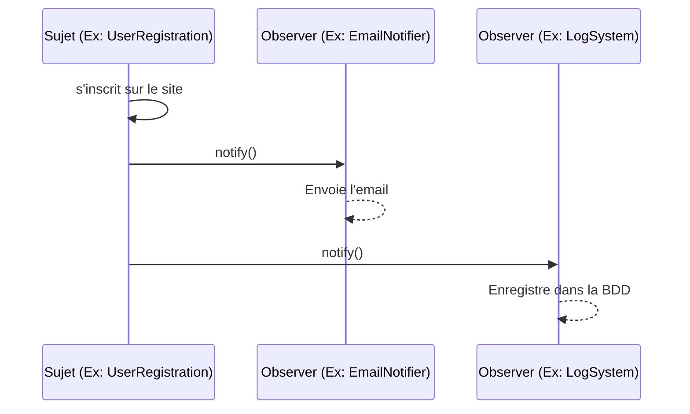
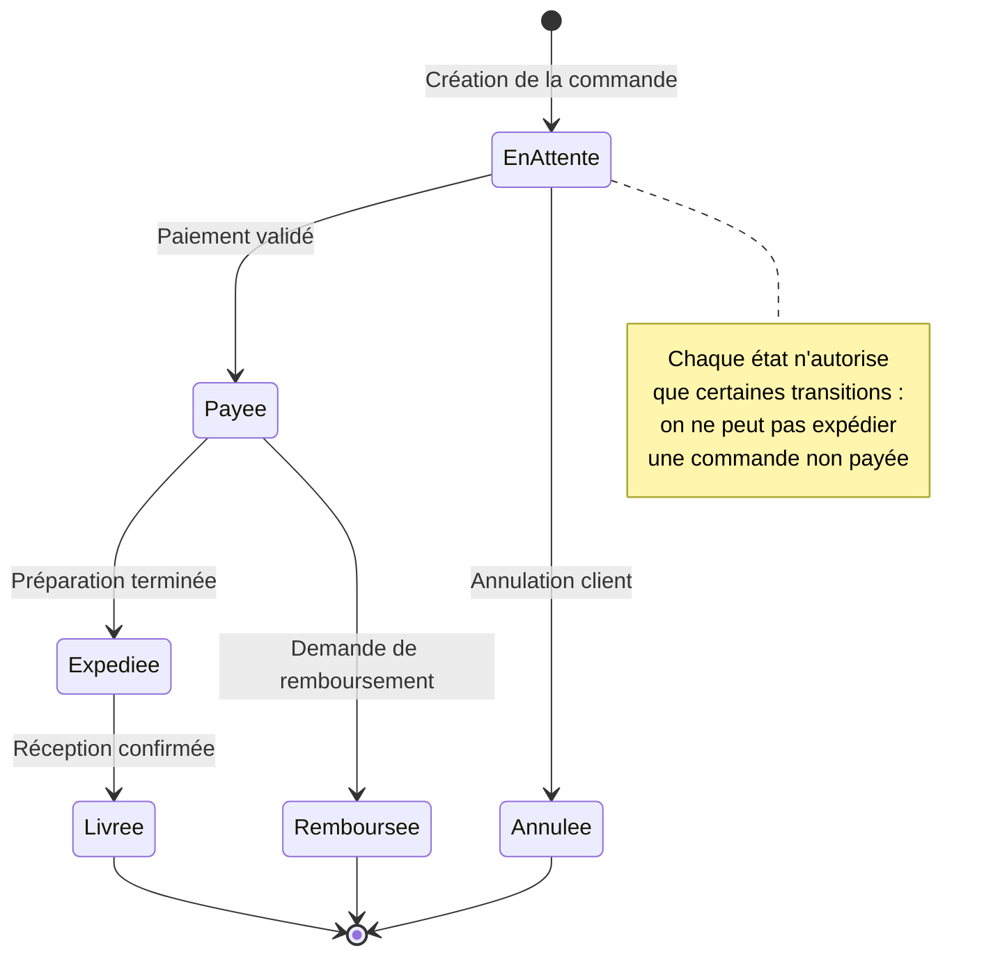

# Les Design Patterns (Patrons de Conception)

<div
  class="omny-meta"
  data-level="🟡 Intermédiaire & 🔴 Avancé"
  data-version="1.1"
  data-time="45 - 60 minutes">
</div>


!!! quote "Analogie pédagogique"
    _Les design patterns sont les plans d'architecte de la programmation. Face à un problème récurrent (comment construire un pont ?), plutôt que de tout réinventer, vous utilisez un patron de conception éprouvé par des milliers de développeurs avant vous._

!!! quote "Ne réinventez pas la roue"
    _Un **Design Pattern** n'est pas un morceau de code prêt à être copié-collé. C'est un concept, un modèle de solution abstrait applicable à un problème de conception logicielle récurrent. Formalisés en 1994 par le **Gang of Four (GoF)**, ces modèles forment un vocabulaire commun indispensable entre développeurs pour concevoir des architectures robustes, évolutives et maintenables._

---

## Introduction

Le terme « patron de conception » a été emprunté à l'architecte **Christopher Alexander**, qui décrivait dans les années 1970 des « patterns » d'urbanisme — des solutions récurrentes à des problèmes d'aménagement. En 1994, quatre auteurs — Gamma, Helm, Johnson et Vlissides, le fameux **Gang of Four (GoF)** — ont transposé cette idée au logiciel dans un ouvrage devenu une référence absolue : *Design Patterns: Elements of Reusable Object-Oriented Software*. Ils y cataloguent **23 patrons**, organisés en trois familles.

Il faut saisir un point essentiel dès le départ : un design pattern décrit une *intention* et une *structure de collaboration entre classes*, pas une implémentation figée. Le même pattern s'écrit différemment en PHP, en Java ou en JavaScript ; ce qui demeure, c'est le problème qu'il résout et la façon dont les objets s'organisent pour le résoudre. Apprendre les patterns, c'est donc enrichir son **vocabulaire de conception** autant que sa boîte à outils.

## Pourquoi utiliser les Design Patterns ?

Les développeurs ont tendance à rencontrer les mêmes problèmes architecturaux à maintes reprises (comment gérer la création d'objets complexes, comment notifier plusieurs éléments d'un changement d'état, comment changer d'algorithme dynamiquement). 

Utiliser un pattern offre trois avantages majeurs :

1. **Éprouvé** : La solution a été testée et affinée par des milliers d'experts. Elle évite les pièges architecturaux invisibles à première vue.
2. **Réutilisable** : Plutôt que de coder une solution "maison" difficile à maintenir, vous utilisez une structure documentée.
3. **Communication** : Dire "J'utilise un *Factory*" est instantanément compris par un autre développeur, évitant de longues explications sur le fonctionnement de votre code.

!!! info "Patterns et principes SOLID"
    Les design patterns et les principes SOLID sont complémentaires. SOLID énonce des **principes** (« dépendez d'abstractions ») ; les patterns fournissent des **structures concrètes** qui réalisent ces principes. Le pattern *Strategy* est une application directe de l'Open/Closed Principle ; la *Factory* sert le Dependency Inversion Principle. Maîtriser les deux ensemble, c'est relier la théorie à la pratique.

## Les 3 Grandes Familles de Patterns

Les 23 patterns originaux du *Gang of Four* sont classés en trois catégories selon leur objectif.

<div class="grid cards" markdown>

-   :lucide-hammer:{ .lg .middle } **1. Patterns de Création**

    ---
    Ils s'occupent de **l'instanciation des objets**. Ils permettent de créer des objets de manière flexible, sans exposer la logique de création (constructeur) au client.
    
    *Exemples : Singleton, Factory, Builder.*

-   :lucide-blocks:{ .lg .middle } **2. Patterns Structurels**

    ---
    Ils concernent l'**organisation des classes et des objets** pour former des structures plus vastes, tout en gardant une interface simple et efficace.
    
    *Exemples : Adapter, Decorator, Facade.*

-   :lucide-workflow:{ .lg .middle } **3. Patterns Comportementaux**

    ---
    Ils régissent la **communication et l'affectation des responsabilités** entre les objets. Ils décrivent comment les objets interagissent.
    
    *Exemples : Strategy, Observer, Iterator.*

</div>

Le tableau ci-dessous donne une vue d'ensemble des 23 patterns du GoF, regroupés par famille. Vous n'en utiliserez qu'une poignée au quotidien, mais en reconnaître les noms vous permet de comprendre les discussions d'architecture et la documentation des frameworks.

| Famille | Patterns | Intention commune |
|---|---|---|
| **Création** (5) | Singleton, Factory Method, Abstract Factory, Builder, Prototype | Contrôler et flexibiliser l'instanciation |
| **Structurel** (7) | Adapter, Bridge, Composite, Decorator, Facade, Flyweight, Proxy | Composer objets et classes en structures plus larges |
| **Comportemental** (11) | Strategy, Observer, Iterator, Command, State, Template Method, Chain of Responsibility, Mediator, Memento, Visitor, Interpreter | Organiser la collaboration et la responsabilité entre objets |

---

## 5 Patterns Incontournables

Bien qu'il en existe beaucoup, certains patterns sont devenus les fondations du développement web moderne.

### 1. Le Singleton (Création)

**Le Problème** : Vous avez besoin d'un objet qui ne doit exister qu'en **un seul exemplaire** dans toute l'application (ex: une connexion à la base de données, un gestionnaire de configuration).

**La Solution** : Le Singleton empêche la classe d'être instanciée de l'extérieur. La classe possède une méthode statique qui crée l'instance si elle n'existe pas, ou retourne l'instance existante.

L'implémentation ci-dessous montre le mécanisme central : un constructeur `private` qui interdit le `new` externe, et une méthode statique `getInstance()` qui garantit l'unicité de l'instance.

```php
class Database 
{
    private static $instance = null;

    // Le constructeur est privé pour empêcher l'instanciation via "new"
    private function __construct() {}

    public static function getInstance() 
    {
        // On ne crée l'objet qu'au premier appel (lazy initialization)
        if (self::$instance == null) {
            self::$instance = new Database();
        }
        return self::$instance; // Tous les appels suivants reçoivent la MÊME instance
    }
}

// Utilisation
$db1 = Database::getInstance();
$db2 = Database::getInstance();
// $db1 et $db2 font exactement référence au même objet en mémoire.
```

!!! warning "Anti-Pattern ?"
    Le Singleton est souvent critiqué et considéré comme un *anti-pattern* par certains car il introduit un état global (Global State) rendant les tests unitaires très difficiles. Les frameworks modernes préfèrent l'**Injection de Dépendances** (Dependency Injection).

!!! tip "Le Singleton « propre » : le conteneur de services"
    Laravel illustre parfaitement la critique ci-dessus. Plutôt que d'écrire des Singletons à la main, on enregistre un service comme singleton **dans le conteneur** : `$this->app->singleton(Database::class)`. L'unicité est garantie, mais la dépendance reste injectée et donc *remplaçable* par un mock en test. On obtient le bénéfice du Singleton sans son principal défaut.

---

### 2. La Factory (Création)

**Le Problème** : Vous devez créer un objet, mais la classe exacte de l'objet à créer dépend de certaines conditions (ex: Créer un ennemi `Orc` ou `Goblin` selon le niveau).

**La Solution** : Déléguer la création à une classe "Usine" (Factory). Le code client demande un objet à l'usine sans se soucier des complexités de son instanciation.

Dans l'exemple suivant, le code appelant ignore totalement *comment* l'ennemi est construit : il délègue cette décision à la fabrique. Ajouter un nouveau type d'ennemi ne touche que la `Factory`, jamais le code client.

```php
class EnemyFactory 
{
    public static function createEnemy(int $level): Enemy 
    {
        // La logique de décision est centralisée ici, pas chez l'appelant
        if ($level < 5) {
            return new Goblin(hp: 50, speed: 10);
        } else {
            return new Orc(hp: 200, weapon: 'Axe');
        }
    }
}

// Utilisation propre : le client demande un ennemi, sans savoir lequel ni comment
$enemy = EnemyFactory::createEnemy($playerLevel);
```

---

### 3. L'Observer (Comportemental)

**Le Problème** : Plusieurs objets doivent être mis à jour lorsqu'un autre objet change d'état (ex: Quand un utilisateur s'inscrit, il faut envoyer un email de bienvenue, notifier l'admin et créer un log).

**La Solution** : Créer un système de publication/souscription. Le Sujet (Subject) maintient une liste d'Observateurs (Observers). Quand son état change, il les notifie tous.

Le diagramme de séquence ci-dessous illustre le flux de notification : le sujet n'appelle pas directement chaque action, il diffuse un signal `notify()` que chaque observateur traite à sa façon.



C'est la base de la programmation réactive (RxJS, Events en Laravel).

!!! example "Observer dans Laravel : Events et Listeners"
    Le système d'**Events** de Laravel *est* le pattern Observer industrialisé. Vous déclenchez un événement (`UserRegistered::dispatch($user)` — le sujet), et plusieurs *Listeners* (les observateurs) réagissent indépendamment : envoyer l'email, créer le log, notifier l'admin. Ajouter une réaction ne modifie pas le code d'inscription : on enregistre simplement un nouveau Listener. Couplage faible, extension sans modification.

---

### 4. Strategy (Comportemental)

**Le Problème** : Vous avez une classe qui effectue une action de plusieurs façons différentes (ex: un paiement par Carte, PayPal ou Crypto) via une suite interminable de `if/else`.

**La Solution** : Extraire chaque algorithme (stratégie) dans sa propre classe. Le contexte utilise une interface commune pour exécuter la stratégie choisie dynamiquement.

L'exemple ci-dessous montre comment chaque méthode de paiement devient une classe interchangeable derrière une interface commune. Le panier (`Cart`) ne connaît que le contrat `PaymentStrategy` : on peut ajouter un nouveau moyen de paiement sans jamais le modifier.

```php
// L'interface commune : le contrat que toute stratégie doit respecter
interface PaymentStrategy {
    public function pay(int $amount);
}

class PayPalStrategy implements PaymentStrategy {
    public function pay(int $amount) { /* Logique PayPal */ }
}

class CryptoStrategy implements PaymentStrategy {
    public function pay(int $amount) { /* Logique Crypto */ }
}

// Le contexte : il ignore l'algorithme concret, il exécute le contrat
class Cart {
    public function checkout(int $amount, PaymentStrategy $method) {
        $method->pay($amount); // La stratégie est choisie à l'exécution
    }
}

// Utilisation dynamique : on injecte la stratégie voulue
$cart = new Cart();
$cart->checkout(100, new CryptoStrategy()); // Changement facile
```

---

### 5. State (Comportemental) — illustré par un diagramme d'état

Le pattern **State** mérite une place ici car il est à la fois très utile et naturellement représentable par un **diagramme d'état**. Son problème : un objet doit changer de comportement selon son état interne, et l'on veut éviter les `if/switch` géants disséminés partout.

**Le Problème** : Une commande e-commerce se comporte différemment selon qu'elle est *en attente*, *payée*, *expédiée* ou *livrée*. On ne peut pas expédier une commande non payée, ni annuler une commande déjà livrée.

**La Solution** : Représenter chaque état comme un objet qui encapsule les transitions autorisées. L'objet `Commande` délègue son comportement à son objet d'état courant. Le diagramme ci-dessous modélise les transitions légales — c'est littéralement la spécification du pattern State.



L'implémentation associe une classe par état ; chaque classe sait quelles transitions elle permet. Le code client appelle simplement `$commande->expedier()` : c'est l'état courant qui accepte ou refuse l'opération.

```php
// Le contrat commun à tous les états
interface EtatCommande {
    public function payer(Commande $c): void;
    public function expedier(Commande $c): void;
}

class EnAttente implements EtatCommande {
    public function payer(Commande $c): void {
        $c->setEtat(new Payee()); // Transition autorisée
    }
    public function expedier(Commande $c): void {
        throw new LogicException("Impossible d'expédier : commande non payée.");
    }
}

class Payee implements EtatCommande {
    public function payer(Commande $c): void {
        throw new LogicException("Commande déjà payée.");
    }
    public function expedier(Commande $c): void {
        $c->setEtat(new Expediee()); // Transition autorisée
    }
}
```

!!! info "State vs Strategy : même structure, intention opposée"
    State et Strategy partagent la même structure (une interface, plusieurs implémentations, un contexte qui délègue). La différence est l'**intention**. Avec *Strategy*, c'est le client qui choisit délibérément l'algorithme (le moyen de paiement). Avec *State*, c'est l'objet qui change *lui-même* d'état au fil de son cycle de vie, le client ne pilotant pas directement les transitions. Reconnaître cette nuance est typiquement ce qui distingue un développeur expérimenté.

## Et le MVC dans tout ça ?

Le **MVC (Modèle-Vue-Contrôleur)** n'est pas un design pattern du Gang of Four. C'est un **Pattern d'Architecture** (plus global). Il s'appuie lui-même sur plusieurs patterns de conception classiques :

- La **Vue** utilise souvent l'*Observer* pour réagir aux changements du Modèle.
- Le **Contrôleur** agit souvent comme une *Strategy* pour la Vue.

!!! warning "Patterns architecturaux vs patterns de conception"
    Ne confondez pas les échelles. Les **patterns de conception** (GoF) opèrent au niveau de quelques classes. Les **patterns d'architecture** (MVC, MVVM, Hexagonal, Microservices) structurent l'application entière. Laravel est fondamentalement MVC, mais il mobilise en interne des dizaines de patterns GoF : Factory pour les modèles, Strategy pour les drivers de cache, Observer pour les events, Decorator pour les middlewares.

## Conclusion

!!! quote "Ce qu'il faut retenir"
    La maîtrise du concept de design patterns est un pilier de l'informatique fondamentale. Au-delà de la syntaxe technique, c'est cette compréhension théorique qui différencie un simple technicien d'un véritable ingénieur capable de concevoir des systèmes robustes et maintenables.

L'apprentissage des Design Patterns est la ligne de démarcation entre un développeur "junior" et un développeur "senior" ou architecte. Il ne faut pas chercher à forcer leur utilisation (cela conduit à la sur-ingénierie), mais plutôt les reconnaître naturellement lorsque le problème qu'ils résolvent se présente.

!!! quote "Conclusion"
    _Les design patterns ne sont pas un catalogue à appliquer mécaniquement, mais un répertoire de solutions à reconnaître. Le danger du débutant qui les découvre est le « pattern fever » : voir des Singletons et des Factories partout, et sur-complexifier un code qui n'en demandait pas tant. La bonne démarche est inverse : écrire d'abord le code le plus simple qui résout le problème, puis, quand une douleur récurrente apparaît — duplication, cascade de conditions, couplage fort — identifier le pattern qui la soigne. Ce vocabulaire partagé est ce qui permet à une équipe de raisonner ensemble sur une architecture, de documenter une intention en un mot, et de faire évoluer un système sans le réécrire. Connaître les patterns, c'est utile ; savoir quand ne pas les employer, c'est de la maturité._
