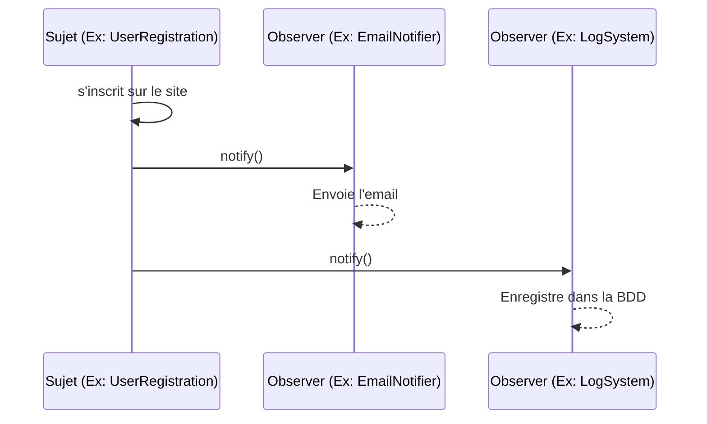

# Les Design Patterns (Patrons de Conception)

<div
  class="omny-meta"
  data-level="🟡 Intermédiaire"
  data-version="1.0"
  data-time="30 - 45 minutes">
</div>


!!! quote "Analogie pédagogique"
    _Les design patterns sont les plans d'architecte de la programmation. Face à un problème récurrent (comment construire un pont ?), plutôt que de tout réinventer, vous utilisez un patron de conception éprouvé par des milliers de développeurs avant vous._

!!! quote "Ne réinventez pas la roue"
    _Un **Design Pattern** n'est pas un morceau de code prêt à être copié-collé. C'est un concept, un modèle de solution abstrait applicable à un problème de conception logicielle récurrent. Formalisés en 1994 par le **Gang of Four (GoF)**, ces modèles forment un vocabulaire commun indispensable entre développeurs pour concevoir des architectures robustes, évolutives et maintenables._

## Pourquoi utiliser les Design Patterns ?

Les développeurs ont tendance à rencontrer les mêmes problèmes architecturaux à maintes reprises (comment gérer la création d'objets complexes, comment notifier plusieurs éléments d'un changement d'état, comment changer d'algorithme dynamiquement). 

Utiliser un pattern offre trois avantages majeurs :
1. **Éprouvé** : La solution a été testée et affinée par des milliers d'experts. Elle évite les pièges architecturaux invisibles à première vue.
2. **Réutilisable** : Plutôt que de coder une solution "maison" difficile à maintenir, vous utilisez une structure documentée.
3. **Communication** : Dire "J'utilise un *Factory*" est instantanément compris par un autre développeur, évitant de longues explications sur le fonctionnement de votre code.

## Les 3 Grandes Familles de Patterns

Les 23 patterns originaux du *Gang of Four* sont classés en trois catégories selon leur objectif.

<div class="grid cards" markdown>

-   :lucide-hammer:{ .lg .middle } **1. Patterns de Création**

    ---
    Ils s'occupent de **l'instanciation des objets**. Ils permettent de créer des objets de manière flexible, sans exposer la logique de création (constructeur) au client.
    
    *Exemples : Singleton, Factory, Builder.*

-   :lucide-blocks:{ .lg .middle } **2. Patterns Structurels**

    ---
    Ils concernent l>**organisation des classes et des objets** pour former des structures plus vastes, tout en gardant une interface simple et efficace.
    
    *Exemples : Adapter, Decorator, Facade.*

-   :lucide-workflow:{ .lg .middle } **3. Patterns Comportementaux**

    ---
    Ils régissent la **communication et l'affectation des responsabilités** entre les objets. Ils décrivent comment les objets interagissent.
    
    *Exemples : Strategy, Observer, Iterator.*

</div>

---

## 4 Patterns Incontournables

Bien qu'il en existe beaucoup, certains patterns sont devenus les fondations du développement web moderne.

### 1. Le Singleton (Création)

**Le Problème** : Vous avez besoin d'un objet qui ne doit exister qu'en **un seul exemplaire** dans toute l'application (ex: une connexion à la base de données, un gestionnaire de configuration).

**La Solution** : Le Singleton empêche la classe d'être instanciée de l'extérieur. La classe possède une méthode statique qui crée l'instance si elle n'existe pas, ou retourne l'instance existante.

```php
class Database 
{
    private static $instance = null;

    // Le constructeur est privé pour empêcher l'instanciation via "new"
    private function __construct() {}

    public static function getInstance() 
    {
        if (self::$instance == null) {
            self::$instance = new Database();
        }
        return self::$instance;
    }
}

// Utilisation
$db1 = Database::getInstance();
$db2 = Database::getInstance();
// $db1 et $db2 font exactement référence au même objet en mémoire.
```

!!! warning "Anti-Pattern ?"
    Le Singleton est souvent critiqué et considéré comme un *anti-pattern* par certains car il introduit un état global (Global State) rendant les tests unitaires très difficiles. Les frameworks modernes préfèrent l'**Injection de Dépendances** (Dependency Injection).

---

### 2. La Factory (Création)

**Le Problème** : Vous devez créer un objet, mais la classe exacte de l'objet à créer dépend de certaines conditions (ex: Créer un ennemi `Orc` ou `Goblin` selon le niveau).

**La Solution** : Déléguer la création à une classe "Usine" (Factory). Le code client demande un objet à l'usine sans se soucier des complexités de son instanciation.

```php
class EnemyFactory 
{
    public static function createEnemy(int $level): Enemy 
    {
        if ($level < 5) {
            return new Goblin(hp: 50, speed: 10);
        } else {
            return new Orc(hp: 200, weapon: 'Axe');
        }
    }
}

// Utilisation propre
$enemy = EnemyFactory::createEnemy($playerLevel);
```

---

### 3. L'Observer (Comportemental)

**Le Problème** : Plusieurs objets doivent être mis à jour lorsqu'un autre objet change d'état (ex: Quand un utilisateur s'inscrit, il faut envoyer un email de bienvenue, notifier l'admin et créer un log).

**La Solution** : Créer un système de publication/souscription. Le Sujet (Subject) maintient une liste d'Observateurs (Observers). Quand son état change, il les notifie tous.



C'est la base de la programmation réactive (RxJS, Events en Laravel).

---

### 4. Strategy (Comportemental)

**Le Problème** : Vous avez une classe qui effectue une action de plusieurs façons différentes (ex: un paiement par Carte, PayPal ou Crypto) via une suite interminable de `if/else`.

**La Solution** : Extraire chaque algorithme (stratégie) dans sa propre classe. Le contexte utilise une interface commune pour exécuter la stratégie choisie dynamiquement.

```php
// L'interface commune
interface PaymentStrategy {
    public function pay(int $amount);
}

class PayPalStrategy implements PaymentStrategy {
    public function pay(int $amount) { /* Logique PayPal */ }
}

class CryptoStrategy implements PaymentStrategy {
    public function pay(int $amount) { /* Logique Crypto */ }
}

// Le contexte
class Cart {
    public function checkout(int $amount, PaymentStrategy $method) {
        $method->pay($amount);
    }
}

// Utilisation dynamique
$cart = new Cart();
$cart->checkout(100, new CryptoStrategy()); // Changement facile
```

## Et le MVC dans tout ça ?

Le **MVC (Modèle-Vue-Contrôleur)** n'est pas un design pattern du Gang of Four. C'est un **Pattern d'Architecture** (plus global). Il s'appuie lui-même sur plusieurs patterns de conception classiques :
- La **Vue** utilise souvent l'*Observer* pour réagir aux changements du Modèle.
- Le **Contrôleur** agit souvent comme une *Strategy* pour la Vue.

## Conclusion

!!! quote "Ce qu'il faut retenir"
    La maîtrise du concept de design patterns est un pilier de l'informatique fondamentale. Au-delà de la syntaxe technique, c'est cette compréhension théorique qui différencie un simple technicien d'un véritable ingénieur capable de concevoir des systèmes robustes et maintenables.

L'apprentissage des Design Patterns est la ligne de démarcation entre un développeur "junior" et un développeur "senior" ou architecte. Il ne faut pas chercher à forcer leur utilisation (cela conduit à la sur-ingénierie), mais plutôt les reconnaître naturellement lorsque le problème qu'ils résolvent se présente.