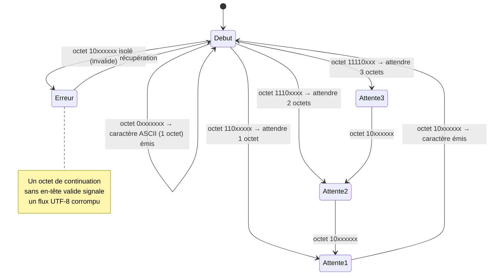

# Encodage de Caractères : ASCII & UTF-8

<div
  class="omny-meta"
  data-level="🟢 Débutant & 🟡 Intermédiaire"
  data-version="1.1"
  data-time="35 - 50 minutes">
</div>


!!! quote "Analogie pédagogique"
    _L'encodage est comme un dictionnaire de traduction entre l'humain et la machine. L'humain lit un 'A', l'ordinateur ne comprend que des '0' et des '1'. L'encodage (comme UTF-8) est la règle stricte qui dit 'cette série de chiffres signifie un A'._

!!! quote "Le langage des machines"
    _Au niveau matériel, un ordinateur ne comprend ni le français, ni le japonais, ni même la lettre "A". Il ne comprend que des variations de tension électrique, représentées logiquement par des **0 et des 1** (Bits). L'encodage est simplement le dictionnaire de traduction qui permet à l'ordinateur de convertir ces suites de zéros et de uns en caractères lisibles par un humain, et vice-versa._

---

## Introduction : trois notions à ne jamais confondre

Avant tout, il faut distinguer trois mots que l'on emploie souvent comme synonymes alors qu'ils désignent des choses différentes. Cette confusion est la source de la plupart des bugs d'affichage.

| Notion | Définition | Exemple |
|---|---|---|
| **Jeu de caractères** (*charset*) | L'inventaire abstrait des symboles disponibles | Unicode, ASCII |
| **Point de code** (*code point*) | Le numéro unique assigné à chaque symbole dans le jeu | `A` = U+0041, `€` = U+20AC |
| **Encodage** | La règle qui transforme un point de code en octets concrets | UTF-8, UTF-16, ISO-8859-1 |

Autrement dit : Unicode *décide* que le symbole « € » porte le numéro U+20AC ; UTF-8 *décide* comment écrire ce numéro sous forme d'octets sur le disque ou le réseau. Le jeu de caractères répond à « quels symboles existent ? », l'encodage à « comment les stocker ? ». Gardez cette séparation en tête : toute la leçon en découle.

!!! info "Pourquoi c'est important"
    L'encodage est invisible quand tout va bien, et omniprésent quand tout va mal. Le moindre « é » qui s'affiche « é », un import CSV qui corrompt les accents, un mot de passe rejeté à tort : derrière chacun de ces incidents se cache une incompréhension de l'encodage. C'est un fondamental que tout développeur — surtout dans un environnement multilingue ou en sécurité applicative — doit posséder.

## La genèse : ASCII (American Standard Code for Information Interchange)

Créé dans les années 1960, **l'ASCII** est le grand-père de l'encodage informatique.

À cette époque, la mémoire coûtait extrêmement cher. Il a donc été décidé que chaque caractère tiendrait sur seulement **7 bits** (soit un demi-octet, étendu à 8 bits plus tard).
Avec 7 bits, on peut représenter $2^7$ caractères, soit **128 caractères possibles**.

**Que contient la table ASCII ?**
- L'alphabet latin non accentué (A-Z, a-z).
- Les chiffres (0-9).
- La ponctuation basique (?, !, $, @).
- Des caractères de contrôle invisibles (Retour à la ligne, Fin de fichier).

Le tableau ci-dessous donne quelques repères concrets de la table ASCII. Connaître ces quelques valeurs aide à lire un *dump* hexadécimal ou à comprendre une comparaison de caractères dans du code bas niveau.

| Caractère | Décimal | Hexadécimal | Remarque |
|:---:|:---:|:---:|---|
| `NUL` | 0 | 0x00 | Caractère nul (fin de chaîne en C) |
| `\n` (LF) | 10 | 0x0A | Saut de ligne Unix |
| `\r` (CR) | 13 | 0x0D | Retour chariot (Windows : CR+LF) |
| espace | 32 | 0x20 | Premier caractère imprimable |
| `0` | 48 | 0x30 | Les chiffres commencent à 48 |
| `A` | 65 | 0x41 | Majuscules à partir de 65 |
| `a` | 97 | 0x61 | Minuscules = majuscules + 32 |

!!! tip "L'astuce du +32"
    L'écart de 32 entre `A` (65) et `a` (97) n'est pas un hasard : c'est exactement un bit (le 6ᵉ). Passer de majuscule à minuscule revient à allumer ce bit. C'est pourquoi, historiquement, certaines fonctions de conversion de casse se faisaient par une simple opération binaire. Comprendre l'ASCII, c'est comprendre ces optimisations.

!!! warning "La limite de l'ASCII"
    Puisque la table ASCII ne contient que 128 "places", elle n'a pas la place pour le "é", le "ç", l'alphabet cyrillique, ou le japonais. Ce format était suffisant pour les pays anglophones, mais totalement inutilisable pour le reste du monde.

## Le chaos de la régionalisation (ISO-8859-x)

Pour contourner la limite de l'ASCII, l'industrie est passée sur 8 bits (256 caractères). Les 128 premiers restaient identiques à l'ASCII, et les 128 restants dépendaient **de votre région**.
- En Europe de l'Ouest, on utilisait la table `ISO-8859-1` (Latin-1) qui ajoutait le "é", "è", "ç".
- En Russie, on utilisait la table `Windows-1251`.

**Le problème :** Si un Français envoyait un fichier texte (encodé en Latin-1) à un Russe, l'ordinateur russe lisait le fichier avec sa propre table. Le "é" français se transformait en un symbole cyrillique incompréhensible (le fameux phénomène du *Mojibake*).

!!! example "Le mojibake, ce bug que vous avez déjà vu"
    Le mot japonais *mojibake* (文字化け) signifie littéralement « transformation de caractères ». Vous l'avez forcément rencontré : un fichier où « café » devient « café », ou « €100 » devient « €100 ». Le mécanisme est toujours le même : le texte a été **écrit** avec un encodage (souvent UTF-8) et **lu** avec un autre (souvent Latin-1 ou Windows-1252). Les octets sont intacts ; c'est leur interprétation qui diverge. Le remède n'est jamais de « réparer » les caractères un par un, mais de relire le fichier avec le bon encodage.

## L'unification : Unicode

Face à ce chaos, le consortium **Unicode** est né dans les années 90 avec une mission titanesque : créer un dictionnaire universel contenant **absolument tous les symboles de l'humanité** (langues mortes, idéogrammes, et même les émojis 🚀).

Unicode n'est pas un encodage, c'est un **Standard**. Il assigne simplement un numéro unique à chaque symbole.
Exemple : Le symbole de l'Euro (€) est le caractère numéro `U+20AC`.

## La révolution : UTF-8

Avoir une grande table Unicode c'est bien, mais comment la stocker en bits ? 
Si on décide que chaque caractère prend 4 octets (32 bits) pour être sûr d'avoir de la place pour tout, un simple texte anglais prendrait 4 fois plus de mémoire que nécessaire !

C'est là qu'intervient **l'UTF-8** (Unicode Transformation Format - 8 bit). C'est un encodage **à taille variable**.

<div class="grid cards" markdown>

-   :lucide-type:{ .lg .middle } **Caractères standards (A-Z)**

    ---
    Ils ne prennent **1 seul octet**. Cerise sur le gâteau, leur code binaire est exactement le même qu'en ASCII. Un fichier purement ASCII est donc un fichier UTF-8 valide. (Rétrocompatibilité totale).

-   :lucide-languages:{ .lg .middle } **Caractères accentués (é, ç)**

    ---
    L'UTF-8 comprend qu'il a besoin de plus de place et utilise **2 octets**.

-   :lucide-smile:{ .lg .middle } **Idéogrammes et Émojis (漢字, 🚀)**

    ---
    L'UTF-8 s'étend automatiquement pour utiliser **3 ou 4 octets**.

</div>

### Comment UTF-8 sait combien d'octets lire ?

La vraie élégance d'UTF-8 tient dans son mécanisme d'**auto-description**. Le premier octet d'un caractère annonce, par ses bits de tête, combien d'octets composent le caractère. Les octets de continuation commencent tous par `10`, ce qui les rend impossibles à confondre avec un début de caractère. Le tableau ci-dessous formalise cette règle.

| Plage Unicode | Octets | Motif binaire (x = bits de données) |
|---|:---:|---|
| U+0000 → U+007F | 1 | `0xxxxxxx` |
| U+0080 → U+07FF | 2 | `110xxxxx 10xxxxxx` |
| U+0800 → U+FFFF | 3 | `1110xxxx 10xxxxxx 10xxxxxx` |
| U+10000 → U+10FFFF | 4 | `11110xxx 10xxxxxx 10xxxxxx 10xxxxxx` |

Le diagramme d'état ci-dessous modélise précisément le **décodeur UTF-8** comme un automate. À la lecture de chaque octet, la machine décide combien d'octets de continuation elle doit encore consommer avant de produire un caractère complet et de revenir à l'état initial. C'est ce petit automate qui tourne des milliards de fois par seconde dans tous vos programmes.



!!! success "La norme du Web"
    Aujourd'hui, **UTF-8 est utilisé sur plus de 98% du Web**. Dans tous vos projets HTML, vous devez toujours avoir la balise `<meta charset="UTF-8">` pour éviter les erreurs d'affichage.

### Le piège du BOM

Un détail technique qui cause des bugs réels : le **BOM** (*Byte Order Mark*). C'est une séquence d'octets invisible (`EF BB BF` en UTF-8) que certains éditeurs — notamment sous Windows — placent au tout début d'un fichier pour signaler son encodage. En UTF-8, ce marqueur est inutile et souvent nuisible.

```bash
# Détecter un BOM en début de fichier (les 3 octets EF BB BF)
head -c 3 fichier.php | xxd
# Sortie problématique : 00000000: efbb bf...  → BOM présent

# Le supprimer proprement avec sed
sed -i '1s/^\xEF\xBB\xBF//' fichier.php
```

!!! danger "Le BOM dans un fichier PHP : le bug classique"
    Un fichier PHP qui commence par un BOM envoie ces trois octets invisibles au navigateur *avant* la balise `<?php`. Résultat : l'erreur redoutée « *headers already sent* », car toute la mécanique des cookies et des redirections (`header()`) exige qu'aucun octet n'ait été émis auparavant. La règle est simple : **enregistrez toujours vos fichiers de code en UTF-8 sans BOM**. Configurez votre éditeur en conséquence.

## Les formats annexes (Transport de données)

En développement, vous croiserez le mot "encodage" dans deux autres contextes spécifiques au transport de données.

### L'encodage Base64

Certains protocoles (comme les vieux serveurs d'emails) n'acceptent QUE du texte basique (ASCII) et paniquent s'ils reçoivent un fichier binaire (une image, un PDF).
Le **Base64** résout ce problème. Il prend votre fichier binaire, et le convertit en une longue chaîne de caractères alphanumériques simples (`A-Z`, `a-z`, `0-9`, `+`, `/`).

*Exemple pratique : Envoyer une image en JSON via une API REST (l'image devient une immense chaîne `data:image/png;base64,iVBORw0KGgo...`).*

L'exemple ci-dessous montre l'encodage et le décodage en PHP. Notez le point essentiel : Base64 **augmente la taille** des données d'environ 33 %, car il représente 3 octets binaires par 4 caractères ASCII.

```php
<?php
// Encoder des données binaires en Base64 (texte transportable partout)
$binaire = file_get_contents('logo.png');
$base64  = base64_encode($binaire);
// Le résultat est ~33% plus volumineux que l'original : à utiliser avec parcimonie

// Décoder pour retrouver les octets d'origine
$original = base64_decode($base64);
```

!!! warning "Base64 n'est PAS de la sécurité"
    C'est l'erreur de débutant la plus répandue. Voir une chaîne illisible comme `cGFzc3dvcmQxMjM=` donne l'illusion d'un secret protégé. Il n'en est rien : `base64_decode('cGFzc3dvcmQxMjM=')` retourne `password123` en une instruction, sans clé, sans secret. Base64 est un format de **transport**, jamais de **protection**. Ne stockez jamais un mot de passe ou un jeton « encodé en Base64 » en croyant l'avoir sécurisé.

### L'URL Encoding (Pourcent-encodage)

Dans une URL, certains caractères ont une signification spéciale : `?` sépare l'URL des paramètres, `&` sépare les paramètres, l'espace n'est pas autorisé.
Si vous passez une donnée contenant ces caractères dans une URL, il faut l'encoder.

L'espace devient `%20`. 
Le "é" devient `%C3%A9`.

*C'est pourquoi une URL contenant des espaces ressemble souvent à : `https://site.com/mon%20super%20fichier.pdf`.*

!!! info "Pourquoi « é » devient %C3%A9 et non un seul %"
    Le pourcent-encodage travaille **octet par octet**. Or, en UTF-8, « é » s'écrit sur deux octets : `0xC3` et `0xA9` (voir le tableau UTF-8 plus haut). Chaque octet est donc préfixé par `%`, d'où `%C3%A9`. Cet exemple montre concrètement que les couches s'empilent : Unicode attribue le numéro, UTF-8 le transforme en octets, le pourcent-encodage rend ces octets transportables dans une URL.

## Différence entre Encodage, Hachage et Chiffrement

Ces trois termes sont souvent confondus par les développeurs juniors :

1. **L'Encodage (UTF-8, Base64)** : Change le format des données pour la machine. **Aucune sécurité**. N'importe qui peut le décoder (car l'algorithme est public et ne nécessite pas de clé).
2. **Le Hachage (SHA-256, Bcrypt)** : Fonction à sens unique. On l'utilise pour les **Mots de passe**. Impossible à décoder (on vérifie juste si les hachages correspondent).
3. **Le Chiffrement / Cryptage (AES, RSA)** : Sécurise les données. Réversible **uniquement** si on possède la clé secrète.

Le tableau ci-dessous synthétise ces trois opérations selon les critères qui les distinguent vraiment : la réversibilité et le rôle de la clé. C'est la grille à mobiliser dès qu'on parle de « protéger » une donnée.

| Critère | Encodage | Hachage | Chiffrement |
|---|---|---|---|
| Objectif | Transport / format | Empreinte / intégrité | Confidentialité |
| Réversible ? | Oui, par tous | Non (sens unique) | Oui, avec la clé |
| Nécessite une clé ? | Non | Non (mais un *sel*) | Oui |
| Exemple | UTF-8, Base64, URL | SHA-256, bcrypt, Argon2 | AES, RSA |
| Usage type | Image en JSON | Stockage de mots de passe | Données bancaires en transit |

!!! danger "Ne jamais « chiffrer » un mot de passe"
    Une règle de sécurité fondamentale en découle. Un mot de passe ne doit être ni encodé, ni chiffré : il doit être **haché** avec un algorithme lent et salé (bcrypt ou Argon2, tous deux fournis par `password_hash()` en PHP). Le chiffrement est réversible : si la clé fuit, tous les mots de passe sont exposés. Le hachage est à sens unique : même en cas de fuite de la base, l'attaquant n'obtient que des empreintes, coûteuses à inverser. Confondre ces trois opérations, c'est ouvrir une faille critique.

## Conclusion

!!! quote "Ce qu'il faut retenir"
    La maîtrise du concept de encodage est un pilier de l'informatique fondamentale. Au-delà de la syntaxe technique, c'est cette compréhension théorique qui différencie un simple technicien d'un véritable ingénieur capable de concevoir des systèmes robustes et maintenables.

!!! quote "Conclusion"
    _L'encodage est la couche invisible sur laquelle repose tout texte numérique, et son histoire est celle d'une marche vers l'universalité : de l'ASCII anglophone au chaos régional des tables ISO, jusqu'à l'unification par Unicode et son encodage de prédilection, UTF-8. Retenez la hiérarchie des notions — un jeu de caractères attribue des numéros, un encodage les transforme en octets — car elle explique à elle seule la quasi-totalité des bugs de « caractères bizarres ». Retenez aussi la frontière, vitale en sécurité, entre encoder, hacher et chiffrer : trois verbes, trois intentions, et confondre les deux premiers avec le troisième suffit à compromettre une application. En pratique, la discipline tient en une phrase : tout en UTF-8 sans BOM, de l'éditeur à la base de données en passant par les en-têtes HTTP. Cohérence de bout en bout, et le mojibake disparaît._
