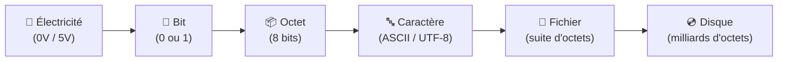
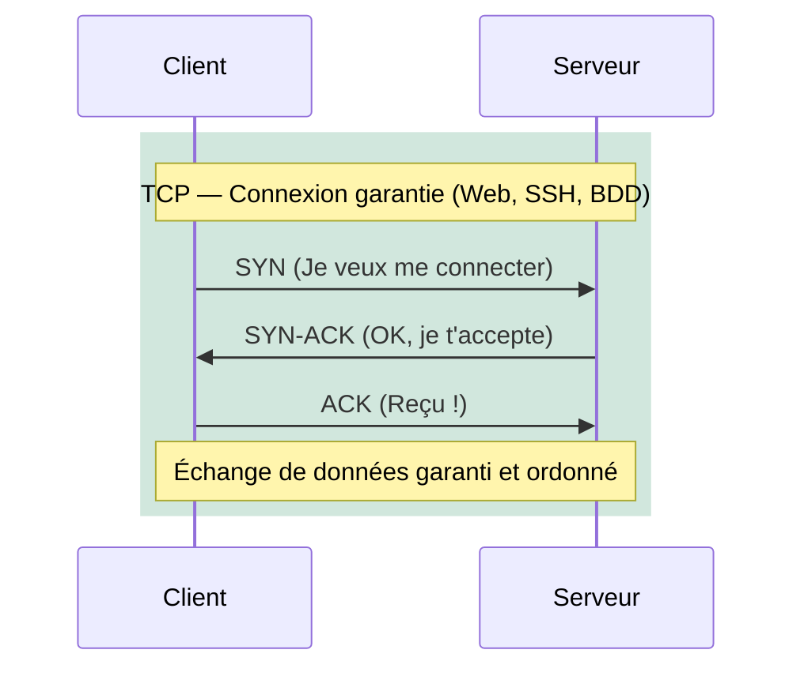
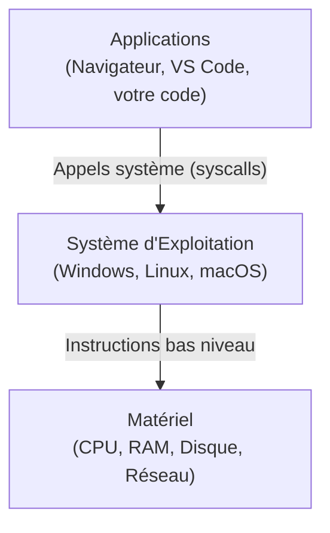

# Concepts Fondamentaux — Avant de Coder

## Introduction

!!! quote "Analogie pédagogique — Les Fondations de la Maison"
    On ne construit pas un gratte-ciel sur du sable. En informatique, la tentation est grande de commencer directement par le code, les frameworks et les outils — c'est le "sable". **Les fondations**, ce sont les concepts qui ne changent jamais : comment fonctionne un ordinateur, comment les données circulent sur un réseau, comment un système d'exploitation gère les ressources.

    Un développeur qui ne comprend pas pourquoi `127.0.0.1` est l'adresse de sa propre machine, ou ce qu'est un port réseau, sera bloqué au premier problème de déploiement. Ces concepts ne prennent que quelques heures à comprendre — et ils servent à vie.

 

---

## Le Binaire et la Représentation des Données

Tout en informatique est, au niveau le plus bas, des **bits** (0 ou 1). Un **octet (byte)** = 8 bits. Tout le reste est une convention humaine construite par-dessus.

| Unité | Équivalent |
|---|---|
| 1 bit | 0 ou 1 |
| 1 octet (byte) | 8 bits |
| 1 Ko (kilooctet) | 1 024 octets |
| 1 Mo (mégaoctet) | 1 024 Ko |
| 1 Go (gigaoctet) | 1 024 Mo |
| 1 To (téraoctet) | 1 024 Go |

 

---

## Le Réseau — La Boîte aux Lettres Universelle

### L'adresse IP

Une **adresse IP** est l'identifiant unique d'une machine sur un réseau. En IPv4 : 4 nombres de 0 à 255 séparés par des points (`192.168.1.10`).

| Adresse | Signification |
|---|---|
| `127.0.0.1` | Votre propre machine (loopback) |
| `192.168.x.x` | Réseau local privé (chez vous ou au bureau) |
| `10.x.x.x` | Réseau privé d'entreprise |
| `8.8.8.8` | Serveur DNS public de Google |

### Les Ports

Un **port** est un canal de communication sur une même machine. L'adresse IP identifie la machine, le port identifie le service.

| Port | Protocole / Service |
|---|---|
| `22` | SSH (accès distant sécurisé) |
| `80` | HTTP (web non sécurisé) |
| `443` | HTTPS (web sécurisé TLS) |
| `3306` | MySQL (base de données) |
| `5432` | PostgreSQL |
| `6379` | Redis |
| `8080` | HTTP alternatif (développement) |

!!! info "Retenir les ports critiques"
    En développement, vous utiliserez quasi quotidiennement : **22** (SSH serveur), **80/443** (Nginx/Apache), **3306** (MySQL), **8000** (serveur de développement Laravel), **5173** (Vite/Vue.js). Les connaître évite de chercher à chaque fois.

### TCP vs UDP

- **TCP** : Garantit la livraison dans l'ordre. Utilisé pour le Web, SSH, les bases de données. Plus lent.
- **UDP** : Pas de garantie. Utilisé pour le streaming vidéo, les jeux en ligne, DNS. Plus rapide.

 

---

## Le Système d'Exploitation

Un **OS** (Operating System) est l'intermédiaire entre le matériel (CPU, RAM, disques) et les applications. Il gère :

- **Les processus** : Chaque programme en cours d'exécution
- **La mémoire** : Allocation et isolation de la RAM entre processus
- **Le système de fichiers** : Organisation des données sur disque
- **Les périphériques** : Clavier, réseau, GPU via les drivers

 

---

## Conclusion

!!! quote "Ce qu'il faut retenir"
    Ces concepts ne sont pas des prérequis académiques — ce sont des outils de débogage. Quand votre application refuse de se connecter à la base de données, vous saurez vérifier si le port 3306 est ouvert. Quand votre serveur est lent, vous saurez différencier un problème de CPU (processus) d'un problème d'I/O (disque). Ces fondations transforment les erreurs mystérieuses en problèmes diagnosticables.

> [Découvrez les outils essentiels du développeur →](../outils/)