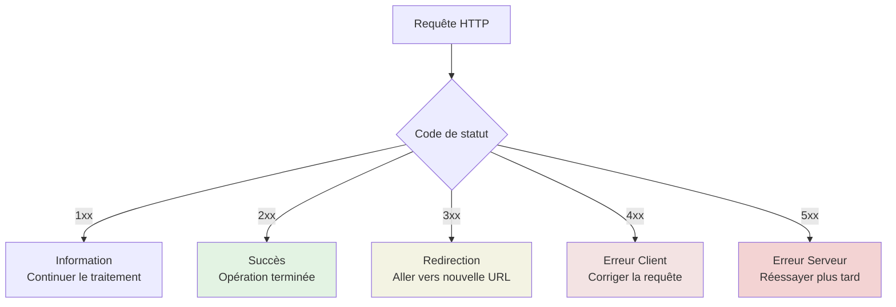
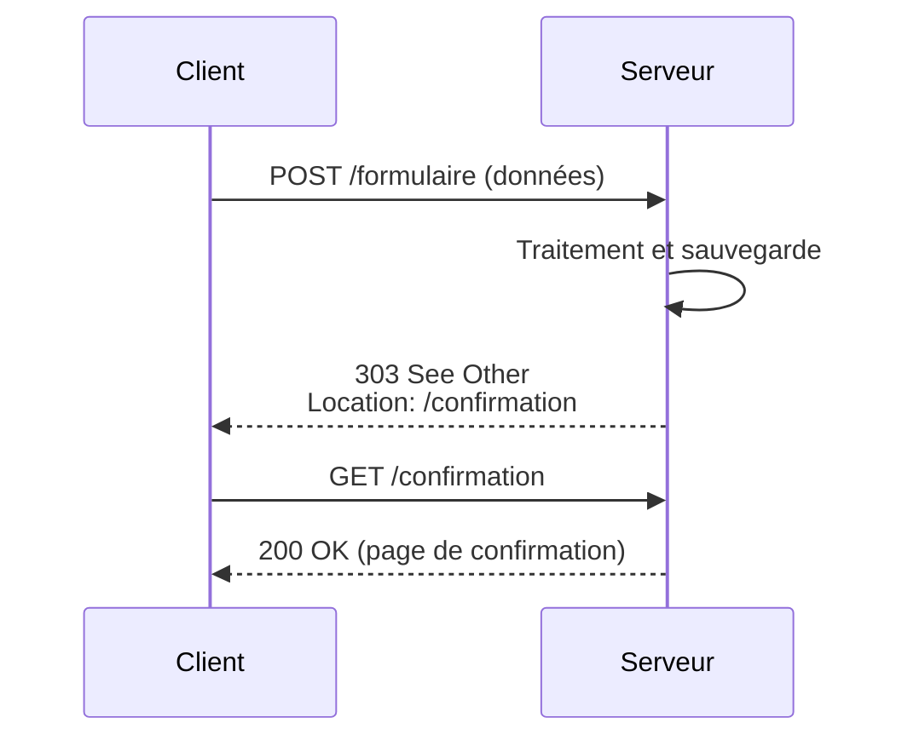
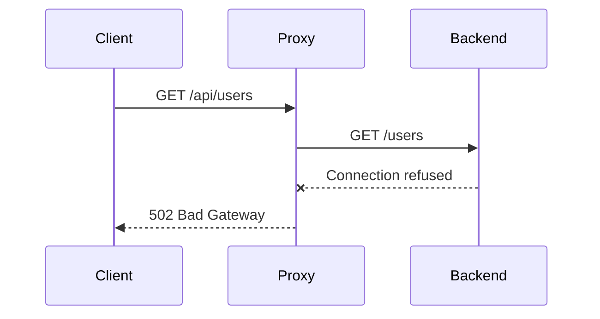
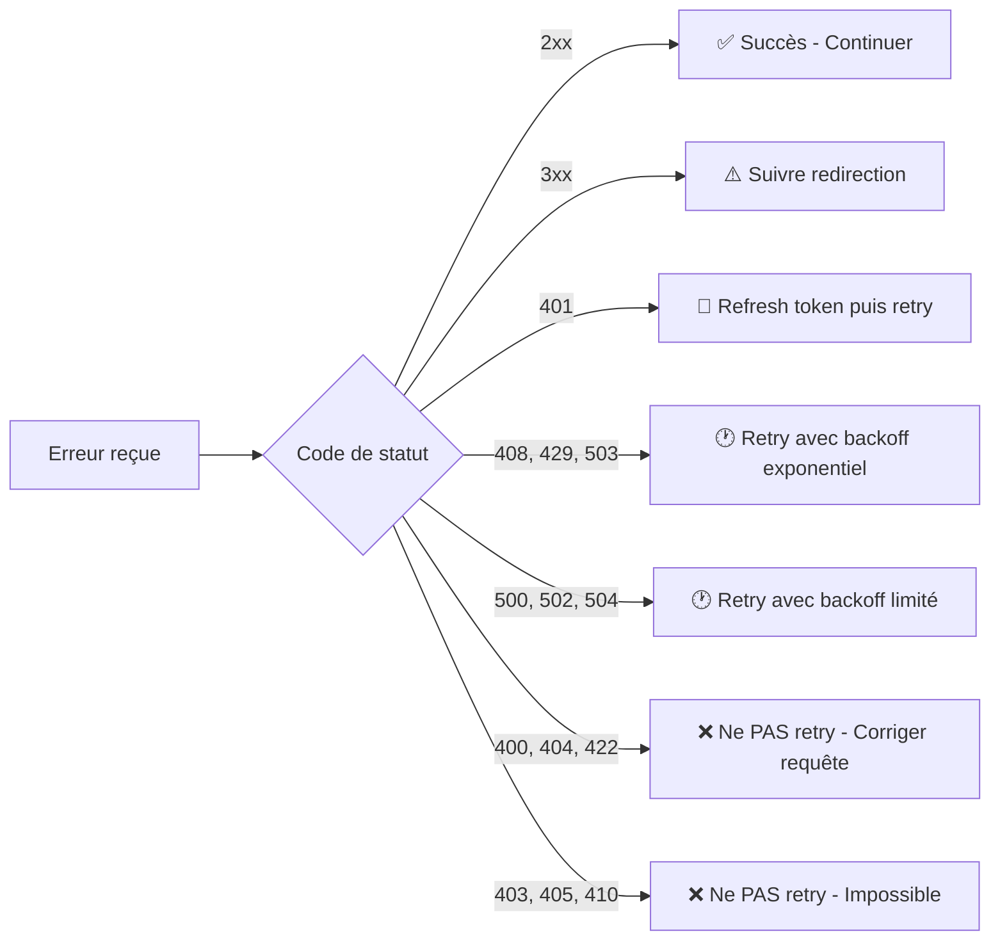

# Liste des Codes d'Erreur HTTP

## Introduction

**Niveau :** Débutant & Intermédiaire

!!! quote "Analogie pédagogique"
    _Imaginez un service postal qui vous envoie différents types de notifications : **"Colis livré"** (succès), **"Adresse introuvable"** (erreur client), **"Centre de tri en panne"** (erreur serveur), ou **"Colis redirigé vers une nouvelle adresse"** (redirection). **Les codes de statut HTTP fonctionnent exactement ainsi** : ils constituent un langage standardisé permettant au serveur de communiquer précisément ce qui s'est passé avec votre requête._

> Chaque requête HTTP reçoit une **réponse** qui commence par un **code de statut** - un nombre à trois chiffres qui indique si l'opération a réussi, échoué, ou nécessite une action supplémentaire. Ces codes constituent le **vocabulaire universel** que tous les serveurs web et toutes les applications comprennent.

Comprendre les codes de statut HTTP devient essentiel dès que vous développez des APIs, consommez des services web, diagnostiquez des problèmes de connectivité ou implémentez une gestion d'erreurs robuste. **Chaque code transmet une information précise** sur ce qui s'est passé et **comment réagir**.

!!! info "Pourquoi c'est important ?"
    Les codes de statut permettent le **débogage rapide**, la **gestion d'erreurs appropriée**, l'**implémentation de retry logic**, et la **communication claire** entre systèmes. Une mauvaise interprétation ou utilisation des codes peut créer des bugs subtils, des performances dégradées, ou des expériences utilisateur désastreuses.

## Pour les vrais débutants

Ce chapitre suppose que vous comprenez les bases du protocole HTTP. Vous devez savoir qu'un **client** envoie des **requêtes** à un **serveur** qui répond avec des **codes de statut** et des **données**. Si vous n'avez pas encore lu le chapitre sur les [méthodes HTTP](http-methodes.md), consultez-le d'abord.

!!! tip "Les codes racontent une histoire !"
    Chaque code de statut raconte ce qui s'est passé avec votre requête. Apprenez à les "lire" comme des messages : **2xx = "Tout va bien"**, **3xx = "Regardez ailleurs"**, **4xx = "Vous avez fait une erreur"**, **5xx = "J'ai fait une erreur"**.

## Les cinq catégories

Les codes de statut HTTP sont organisés en **cinq catégories** identifiées par leur premier chiffre.

| Catégorie | Plage | Signification générale | Responsabilité |
|-----------|-------|------------------------|----------------|
| **1xx** | 100-199 | Information | Neutre - Traitement en cours |
| **2xx** | 200-299 | Succès | ✅ Requête réussie |
| **3xx** | 300-399 | Redirection | ⚠️ Action supplémentaire nécessaire |
| **4xx** | 400-499 | Erreur client | ❌ Problème dans la requête |
| **5xx** | 500-599 | Erreur serveur | ❌ Problème côté serveur |



_Ce diagramme illustre la **décision que le client doit prendre** selon la catégorie du code de statut reçu._

## Codes informationnels (1xx)

Les codes **1xx** indiquent que la requête a été reçue et que le processus continue. Ces codes sont **rarement utilisés** dans les applications web modernes.

### 100 Continue

Indique que le client peut continuer avec le reste de la requête.

**Cas d'usage :** Upload de gros fichiers où le client demande d'abord si le serveur est prêt.

**En-têtes associés :**
```http
Expect: 100-continue
```

### 101 Switching Protocols

Le serveur accepte de changer de protocole selon la demande du client.

**Cas d'usage :** Upgrade d'une connexion HTTP vers WebSocket.

**Exemple de négociation WebSocket :**
```http
GET /chat HTTP/1.1
Host: example.com
Upgrade: websocket
Connection: Upgrade

HTTP/1.1 101 Switching Protocols
Upgrade: websocket
Connection: Upgrade
```

### 102 Processing (WebDAV)

Le serveur a reçu la requête mais n'a pas encore de réponse disponible.

**Cas d'usage :** Opérations longues sur serveurs WebDAV.

!!! note "Usage limité"
    Les codes **1xx** sont principalement utilisés dans des **protocoles spécifiques** ou des **optimisations de performance**. La plupart des développeurs ne les rencontreront jamais dans leur utilisation quotidienne.

## Codes de succès (2xx)

Les codes **2xx** indiquent que la requête a été **reçue, comprise et acceptée** avec succès.

### 200 OK

La requête a **réussi**. C'est le code de succès standard.

**Utilisation :**
- Réponse à GET avec contenu
- Réponse à POST sans création de ressource
- Réponse à PUT/PATCH avec contenu
- Toute opération réussie avec données à retourner

**Exemple de réponse :**
```json
HTTP/1.1 200 OK
Content-Type: application/json

{
  "id": 123,
  "nom": "Alice Dupont",
  "email": "alice@example.com",
  "role": "admin"
}
```

### 201 Created

Une **nouvelle ressource a été créée** avec succès.

**Utilisation :**
- Réponse à POST qui crée une ressource
- Réponse à PUT qui crée une ressource (usage moins courant)

**Bonnes pratiques :**
- Inclure l'en-tête `Location` avec l'URI de la nouvelle ressource
- Retourner la ressource créée dans le corps

**Exemple de réponse :**
```json
HTTP/1.1 201 Created
Location: https://api.example.com/utilisateurs/456
Content-Type: application/json

{
  "id": 456,
  "nom": "Bob Martin",
  "email": "bob@example.com",
  "date_creation": "2025-11-15T10:30:00Z"
}
```

### 202 Accepted

La requête a été **acceptée pour traitement**, mais le traitement **n'est pas terminé**.

**Utilisation :**
- Opérations asynchrones longues
- Jobs en arrière-plan
- Traitement batch

**Exemple de réponse :**
```json
HTTP/1.1 202 Accepted
Content-Type: application/json

{
  "job_id": "abc-123-def",
  "status": "pending",
  "status_url": "https://api.example.com/jobs/abc-123-def",
  "estimated_completion": "2025-11-15T11:00:00Z"
}
```

### 204 No Content

La requête a **réussi** mais il n'y a **aucun contenu à retourner**.

**Utilisation :**
- Réponse à DELETE réussi
- Réponse à PUT/PATCH sans besoin de retourner la ressource mise à jour
- Actions réussies sans données de retour

**Exemple de réponse :**
```http
HTTP/1.1 204 No Content
```

!!! tip "Économie de bande passante"
    **204 No Content** est idéal pour les opérations fréquentes où le client n'a pas besoin de confirmation détaillée, économisant ainsi de la bande passante.

### 206 Partial Content

Le serveur retourne **une partie du contenu** demandé.

**Utilisation :**
- Téléchargements avec reprise (resume)
- Streaming de médias
- Chargement progressif de gros fichiers

**En-têtes associés :**
```http
HTTP/1.1 206 Partial Content
Content-Range: bytes 0-1023/5000
Content-Length: 1024
Content-Type: video/mp4
```

## Codes de redirection (3xx)

Les codes **3xx** indiquent que le client doit effectuer **une action supplémentaire** pour compléter la requête, généralement suivre une redirection.

### 301 Moved Permanently

La ressource a été **déplacée définitivement** vers une nouvelle URI.

**Utilisation :**
- Migration de domaine
- Restructuration d'URL permanente
- SEO : transfert de ranking

**Impact :**
- Les navigateurs et moteurs de recherche **mettent en cache** cette redirection
- Les futures requêtes iront **directement** à la nouvelle URL

**Exemple de réponse :**
```http
HTTP/1.1 301 Moved Permanently
Location: https://www.example.com/nouvelle-page
```

!!! warning "Permanent = Forever"
    N'utilisez **301** que si vous êtes **absolument certain** que le déplacement est permanent. Une fois en cache, difficile de revenir en arrière.

### 302 Found

La ressource est **temporairement** à une autre URI.

**Utilisation :**
- Redirections temporaires
- A/B testing
- Maintenance

**Impact :**
- **Non mis en cache** par défaut
- Les futures requêtes continuent vers l'URL originale

**Exemple de réponse :**
```http
HTTP/1.1 302 Found
Location: https://www.example.com/page-temporaire
```

### 303 See Other

La réponse à la requête peut être trouvée à une autre URI via **GET**.

**Utilisation :**
- Après un POST réussi, rediriger vers une page de confirmation
- Pattern POST-Redirect-GET (PRG)

**Exemple de flux :**


### 304 Not Modified

La ressource **n'a pas été modifiée** depuis la dernière requête.

**Utilisation :**
- Validation de cache
- Économie de bande passante

**En-têtes associés :**
```http
# Requête du client
GET /resource HTTP/1.1
If-Modified-Since: Wed, 15 Nov 2025 10:00:00 GMT
If-None-Match: "abc123def"

# Réponse du serveur
HTTP/1.1 304 Not Modified
ETag: "abc123def"
```

!!! success "Optimisation majeure"
    **304** permet d'économiser **énormément de bande passante** en évitant de retransmettre des ressources inchangées. C'est crucial pour les performances web.

### 307 Temporary Redirect

Similaire à **302**, mais **garantit** que la méthode HTTP ne changera pas lors de la redirection.

**Différence 302 vs 307 :**
- **302** : Peut transformer POST en GET (comportement historique)
- **307** : Conserve strictement POST comme POST

### 308 Permanent Redirect

Similaire à **301**, mais **garantit** que la méthode HTTP ne changera pas lors de la redirection.

## Codes d'erreur client (4xx)

Les codes **4xx** indiquent que le **client a fait une erreur** dans sa requête. Le serveur ne peut pas traiter la requête dans son état actuel.

### 400 Bad Request

La requête contient **une syntaxe invalide** ou **des données malformées**.

**Causes courantes :**
- JSON malformé
- Paramètres manquants
- Types de données incorrects
- Valeurs hors limites

**Exemple de réponse :**
```json
HTTP/1.1 400 Bad Request
Content-Type: application/json

{
  "error": "validation_error",
  "message": "La requête contient des erreurs de validation",
  "details": [
    {
      "field": "email",
      "issue": "Format d'email invalide"
    },
    {
      "field": "age",
      "issue": "Doit être un nombre positif"
    }
  ]
}
```

### 401 Unauthorized

L'**authentification est requise** et a échoué ou n'a pas été fournie.

**Nom trompeur :** Devrait s'appeler "Unauthenticated" (non authentifié).

**Utilisation :**
- Token manquant
- Token expiré
- Credentials invalides

**En-têtes associés :**
```http
HTTP/1.1 401 Unauthorized
WWW-Authenticate: Bearer realm="example"
Content-Type: application/json

{
  "error": "authentication_required",
  "message": "Token d'authentification manquant ou invalide"
}
```

### 403 Forbidden

Le client est **authentifié** mais **n'a pas les permissions** nécessaires.

**Différence 401 vs 403 :**
- **401** : "Qui êtes-vous ?" → Problème d'authentification
- **403** : "Je sais qui vous êtes, mais vous n'avez pas le droit" → Problème d'autorisation

**Exemple de réponse :**
```json
HTTP/1.1 403 Forbidden
Content-Type: application/json

{
  "error": "insufficient_permissions",
  "message": "Vous n'avez pas les droits pour accéder à cette ressource",
  "required_role": "admin",
  "current_role": "user"
}
```

### 404 Not Found

La ressource demandée **n'existe pas**.

**Utilisation :**
- URL incorrecte
- Ressource supprimée
- ID inexistant

**Exemple de réponse :**
```json
HTTP/1.1 404 Not Found
Content-Type: application/json

{
  "error": "resource_not_found",
  "message": "L'utilisateur avec l'ID 999 n'existe pas",
  "resource_type": "utilisateur",
  "resource_id": 999
}
```

!!! tip "404 vs Soft Delete"
    Pour les ressources "soft deleted" (marquées comme supprimées mais présentes en base), vous pouvez choisir entre :
    - **404** : Cache le fait que la ressource a existé
    - **410 Gone** : Indique que la ressource existait mais a été supprimée

### 405 Method Not Allowed

La **méthode HTTP utilisée n'est pas supportée** pour cette ressource.

**Utilisation :**
- GET sur une ressource qui n'accepte que POST
- DELETE sur une ressource en lecture seule

**En-têtes requis :**
```http
HTTP/1.1 405 Method Not Allowed
Allow: GET, POST
Content-Type: application/json

{
  "error": "method_not_allowed",
  "message": "La méthode PUT n'est pas autorisée pour cette ressource",
  "allowed_methods": ["GET", "POST"]
}
```

### 406 Not Acceptable

Le serveur ne peut pas produire une réponse **dans le format demandé** par le client.

**Utilisation :**
- Client demande XML mais serveur ne supporte que JSON
- Négociation de contenu échouée

**En-têtes associés :**
```http
# Requête
Accept: application/xml

# Réponse
HTTP/1.1 406 Not Acceptable
Content-Type: application/json

{
  "error": "not_acceptable",
  "message": "Format XML non supporté",
  "supported_formats": ["application/json"]
}
```

### 408 Request Timeout

Le serveur a **expiré en attendant la requête**.

**Utilisation :**
- Client trop lent à envoyer les données
- Connexion instable

### 409 Conflict

La requête **entre en conflit** avec l'état actuel de la ressource.

**Utilisation :**
- Tentative de création d'un doublon (email déjà utilisé)
- Conflit de version (concurrent update)
- Violation de contrainte d'intégrité

**Exemple de réponse :**
```json
HTTP/1.1 409 Conflict
Content-Type: application/json

{
  "error": "conflict",
  "message": "Un utilisateur avec cet email existe déjà",
  "conflicting_field": "email",
  "conflicting_value": "alice@example.com"
}
```

### 410 Gone

La ressource a existé mais a été **définitivement supprimée**.

**Différence 404 vs 410 :**
- **404** : "Peut-être que ça n'a jamais existé"
- **410** : "Ça existait, mais c'est définitivement parti"

**Utilisation :**
- APIs versionnées obsolètes
- Contenu expiré volontairement

### 413 Payload Too Large

Le corps de la requête est **trop volumineux**.

**Utilisation :**
- Upload de fichier dépassant la limite
- JSON trop gros

**Exemple de réponse :**
```json
HTTP/1.1 413 Payload Too Large
Content-Type: application/json

{
  "error": "payload_too_large",
  "message": "Le fichier dépasse la taille maximale autorisée",
  "max_size": "10MB",
  "received_size": "25MB"
}
```

### 415 Unsupported Media Type

Le **format du contenu** n'est pas supporté.

**Utilisation :**
- Envoi de XML quand seul JSON est accepté
- Content-Type incorrect

**Exemple de réponse :**
```json
HTTP/1.1 415 Unsupported Media Type
Content-Type: application/json

{
  "error": "unsupported_media_type",
  "message": "Le type de contenu 'application/xml' n'est pas supporté",
  "supported_types": ["application/json", "application/x-www-form-urlencoded"]
}
```

### 422 Unprocessable Entity

La requête est **syntaxiquement correcte** mais **sémantiquement invalide**.

**Différence 400 vs 422 :**
- **400** : Erreur de syntaxe (JSON malformé, paramètre manquant)
- **422** : Syntaxe OK mais données invalides (email déjà pris, âge négatif)

**Exemple de réponse :**
```json
HTTP/1.1 422 Unprocessable Entity
Content-Type: application/json

{
  "error": "validation_error",
  "message": "Les données fournies ne respectent pas les règles métier",
  "validation_errors": [
    {
      "field": "date_naissance",
      "value": "2030-01-01",
      "message": "La date de naissance ne peut pas être dans le futur"
    },
    {
      "field": "telephone",
      "value": "12345",
      "message": "Le numéro de téléphone doit contenir 10 chiffres"
    }
  ]
}
```

### 429 Too Many Requests

Le client a envoyé **trop de requêtes** dans un temps donné (rate limiting).

**Utilisation :**
- Protection contre le spam
- Protection DDoS
- Limitation d'API

**En-têtes associés :**
```http
HTTP/1.1 429 Too Many Requests
Retry-After: 3600
X-RateLimit-Limit: 100
X-RateLimit-Remaining: 0
X-RateLimit-Reset: 1637000000
Content-Type: application/json

{
  "error": "rate_limit_exceeded",
  "message": "Limite de 100 requêtes par heure dépassée",
  "retry_after_seconds": 3600,
  "limit": 100,
  "reset_at": "2025-11-15T12:00:00Z"
}
```

## Codes d'erreur serveur (5xx)

Les codes **5xx** indiquent que le **serveur a rencontré une erreur** ou est incapable de traiter la requête.

### 500 Internal Server Error

Le serveur a rencontré une **erreur interne inattendue**.

**Causes courantes :**
- Exception non gérée
- Bug dans le code
- Ressource critique indisponible

**Exemple de réponse :**
```json
HTTP/1.1 500 Internal Server Error
Content-Type: application/json

{
  "error": "internal_server_error",
  "message": "Une erreur inattendue s'est produite",
  "request_id": "abc-123-def",
  "timestamp": "2025-11-15T10:30:00Z"
}
```

!!! danger "Ne jamais exposer les détails techniques"
    En production, **ne retournez JAMAIS** de stack traces ou messages d'erreur détaillés au client. Loggez-les côté serveur avec un **request_id** pour le débogage.

### 501 Not Implemented

Le serveur **ne supporte pas** la fonctionnalité requise.

**Utilisation :**
- Méthode HTTP non implémentée
- Fonctionnalité en développement

### 502 Bad Gateway

Le serveur agissant comme **gateway/proxy** a reçu une **réponse invalide** du serveur amont.

**Causes courantes :**
- Service backend down
- Timeout vers service amont
- Réponse corrompue

**Architecture typique :**


### 503 Service Unavailable

Le serveur est **temporairement incapable** de traiter la requête.

**Causes courantes :**
- Maintenance planifiée
- Surcharge temporaire
- Service en redémarrage

**En-têtes associés :**
```http
HTTP/1.1 503 Service Unavailable
Retry-After: 120
Content-Type: application/json

{
  "error": "service_unavailable",
  "message": "Service en maintenance",
  "retry_after_seconds": 120,
  "estimated_recovery": "2025-11-15T11:00:00Z"
}
```

!!! tip "Retry-After est crucial"
    Incluez toujours l'en-tête **Retry-After** avec **503** pour indiquer au client quand réessayer.

### 504 Gateway Timeout

Le serveur agissant comme **gateway/proxy** n'a **pas reçu de réponse à temps** du serveur amont.

**Différence 502 vs 504 :**
- **502** : Réponse invalide reçue
- **504** : Aucune réponse reçue (timeout)

## Bonnes pratiques de gestion d'erreurs

### Structure de réponse d'erreur standardisée

Adoptez un **format cohérent** pour toutes vos réponses d'erreur.

**Format recommandé (RFC 7807 - Problem Details) :**
```json
{
  "type": "https://api.example.com/errors/validation-error",
  "title": "Erreur de validation",
  "status": 422,
  "detail": "Les données soumises ne respectent pas le format attendu",
  "instance": "/utilisateurs/123",
  "timestamp": "2025-11-15T10:30:00Z",
  "request_id": "abc-123-def",
  "errors": [
    {
      "field": "email",
      "code": "invalid_format",
      "message": "Format d'email invalide"
    }
  ]
}
```

### Codes de statut selon l'opération

| Opération | Succès | Erreur client typique | Erreur serveur typique |
|-----------|--------|----------------------|------------------------|
| **GET** | 200, 304 | 404, 403, 401 | 500, 503 |
| **POST** | 201, 200 | 400, 422, 409, 401 | 500, 503 |
| **PUT** | 200, 204 | 400, 404, 409, 401 | 500, 503 |
| **PATCH** | 200, 204 | 400, 404, 422, 401 | 500, 503 |
| **DELETE** | 204, 200 | 404, 403, 401 | 500, 503 |

### Stratégies de retry

Selon le code de statut, adoptez des **stratégies de retry** différentes.


**Tableau de décision retry :**

| Code | Retry ? | Stratégie |
|------|---------|-----------|
| **408** | ✅ Oui | Exponentiel jusqu'à 3 tentatives |
| **429** | ✅ Oui | Attendre `Retry-After` |
| **500** | ✅ Oui | Exponentiel limité (max 3×) |
| **502** | ✅ Oui | Exponentiel limité (max 3×) |
| **503** | ✅ Oui | Attendre `Retry-After` |
| **504** | ✅ Oui | Exponentiel limité (max 2×) |
| **400-499** | ❌ Non | Erreur client - corriger la requête |

### Logging et monitoring

**Loggez différemment** selon la catégorie d'erreur.

| Catégorie | Niveau de log | Action |
|-----------|---------------|--------|
| **2xx** | INFO | Log basique pour analytics |
| **3xx** | INFO | Log pour traçabilité |
| **4xx** | WARNING | Log + alertes si taux élevé |
| **5xx** | ERROR | Log détaillé + alerte immédiate |

## Tableau récapitulatif complet

### Codes les plus courants

| Code | Nom | Quand l'utiliser | Peut retry ? |
|------|-----|------------------|--------------|
| **200** | OK | GET/PUT/PATCH réussis avec contenu | - |
| **201** | Created | POST crée une ressource | - |
| **204** | No Content | DELETE/PUT/PATCH réussis sans contenu | - |
| **301** | Moved Permanently | Ressource déplacée définitivement | Non |
| **302** | Found | Redirection temporaire | Non |
| **304** | Not Modified | Cache valide | - |
| **400** | Bad Request | Requête malformée | Non |
| **401** | Unauthorized | Authentification requise | Oui (après refresh) |
| **403** | Forbidden | Pas les permissions | Non |
| **404** | Not Found | Ressource inexistante | Non |
| **409** | Conflict | Conflit (doublon) | Non |
| **422** | Unprocessable Entity | Validation métier échouée | Non |
| **429** | Too Many Requests | Rate limit dépassé | Oui (avec délai) |
| **500** | Internal Server Error | Erreur serveur | Oui (limité) |
| **502** | Bad Gateway | Proxy reçoit erreur | Oui (limité) |
| **503** | Service Unavailable | Service indisponible | Oui (avec délai) |
| **504** | Gateway Timeout | Timeout vers backend | Oui (limité) |

## Le mot de la fin

!!! quote
    Les codes de statut HTTP constituent le **langage universel** de communication entre systèmes. Leur utilisation correcte transforme des APIs opaques en interfaces prévisibles et debuggables. Leur mauvaise utilisation crée des expériences utilisateur frustrantes et des bugs difficiles à diagnostiquer.
    
    Choisir le bon code de statut n'est pas un détail cosmétique - c'est une **décision architecturale** qui impacte la robustesse, la maintenabilité et l'expérience développeur de votre API. Un code **400** au lieu de **422** peut casser la logique de retry d'un client. Un code **500** au lieu de **503** peut déclencher des alertes inutiles.
    
    Maîtrisez ces codes, utilisez-les avec précision, et vos APIs deviendront des modèles de clarté et de fiabilité.

---

!!! abstract "Métadonnées"
    **Version** : 1.0  
    **Dernière mise à jour** : Novembre 2025  
    **Durée de lecture** : 35-40 minutes  
    **Niveau** : Débutant & Intermédiaire