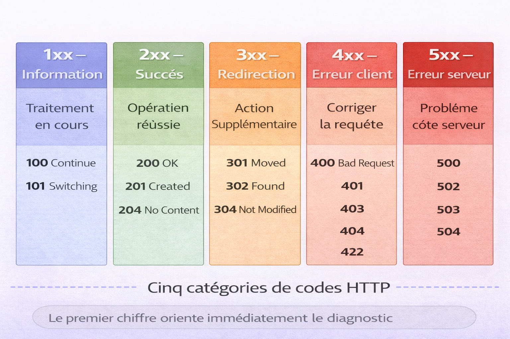
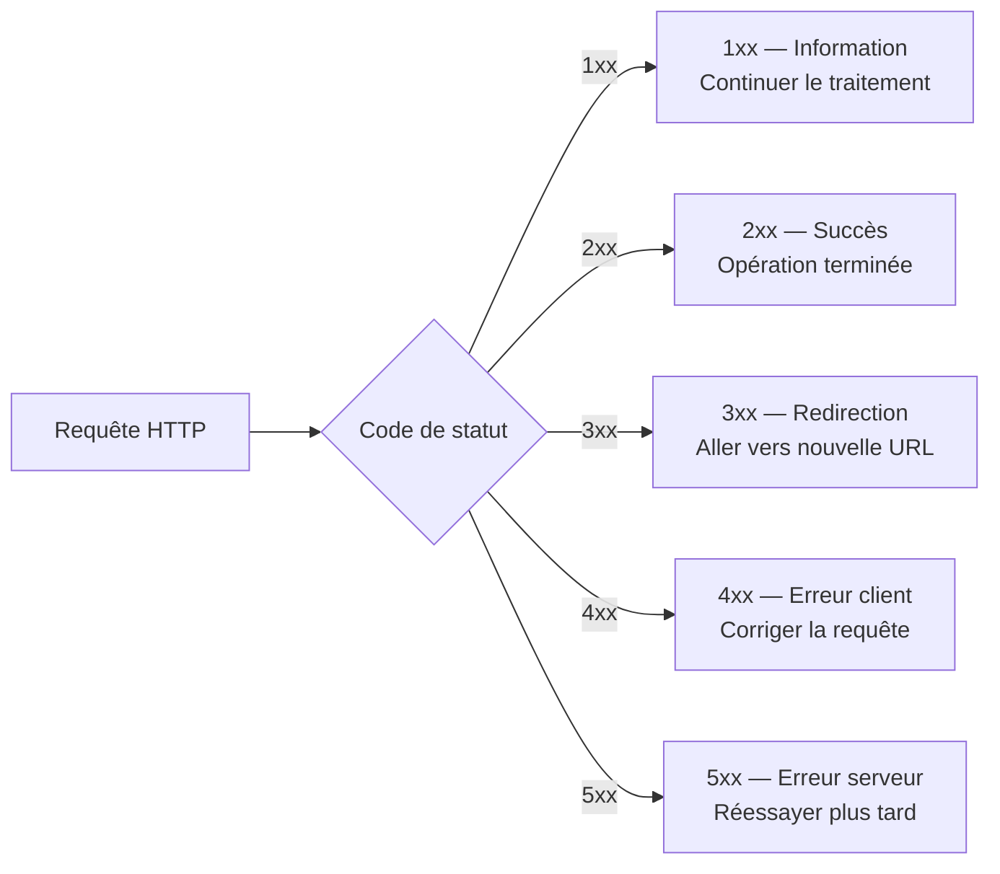
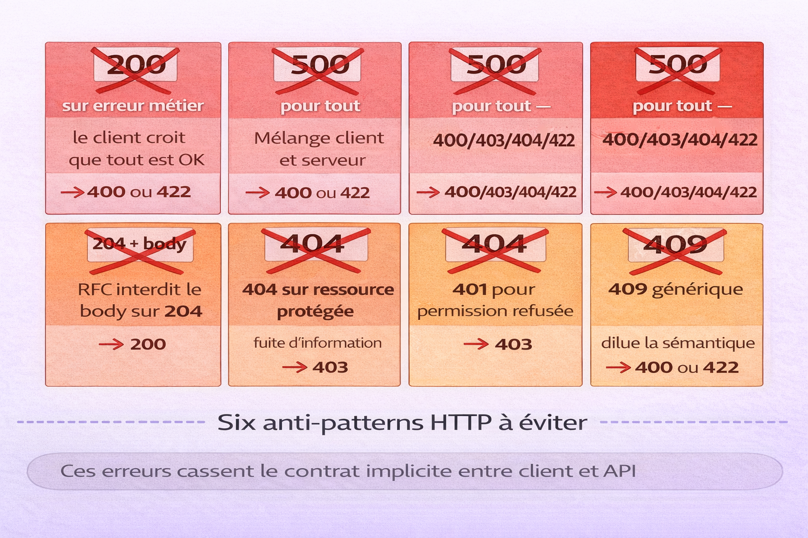
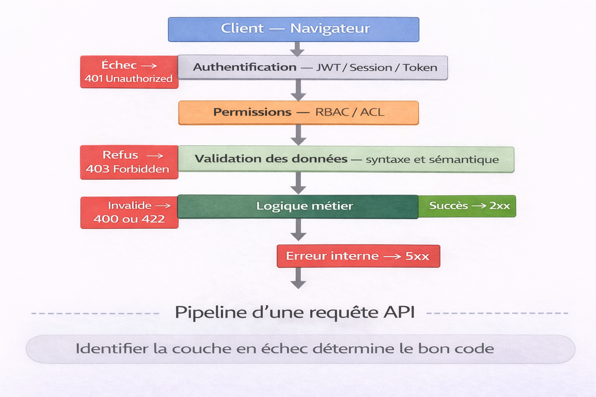
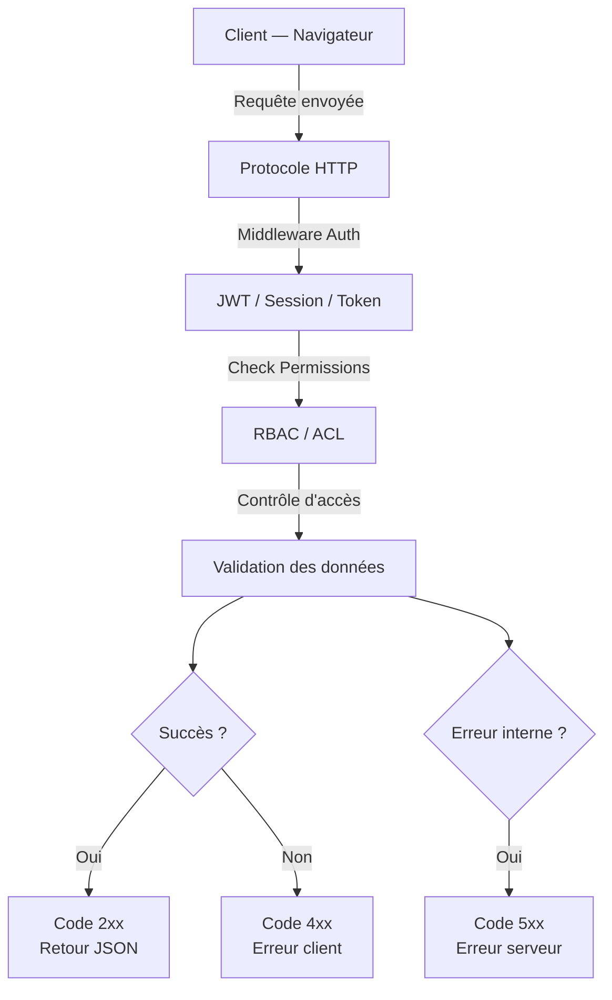
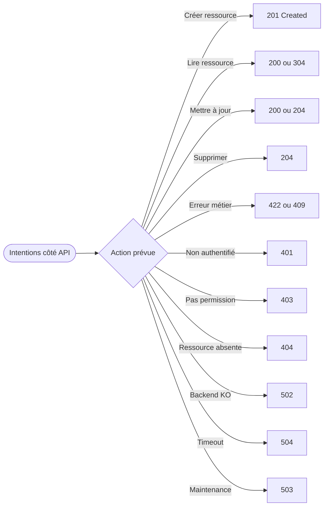
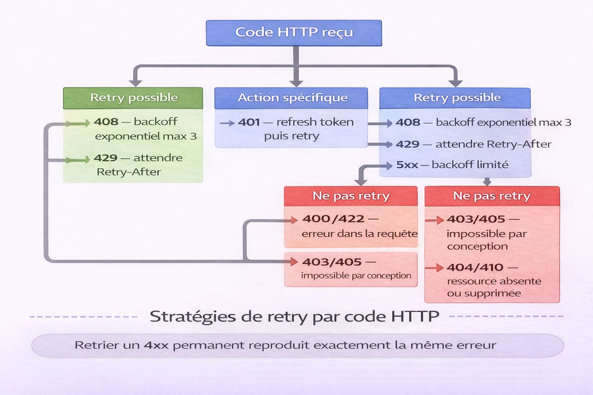
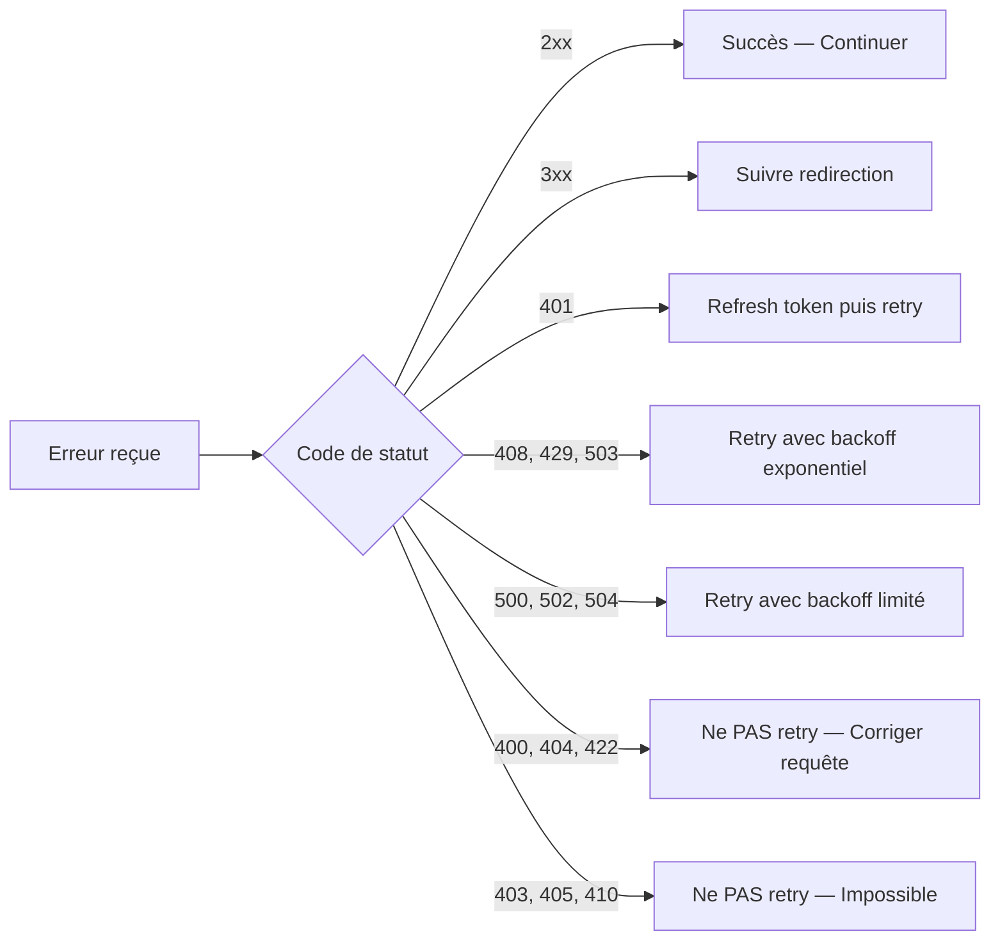

# Liste des Codes d'Erreur HTTP

<div
  class="omny-meta"
  data-level="🟢 Débutant & 🟡 Intermédiaire"
  data-version="1.4"
  data-time="35-40 minutes">
</div>

!!! quote "Analogie"
    _Un service postal qui envoie différents types de notifications : "Colis livré" (succès), "Adresse introuvable" (erreur client), "Centre de tri en panne" (erreur serveur), ou "Colis redirigé vers une nouvelle adresse" (redirection). Les codes de statut HTTP fonctionnent exactement ainsi : ils constituent un langage standardisé permettant au serveur de communiquer précisément ce qui s'est passé avec la requête._

Chaque requête HTTP reçoit une réponse qui commence par un **code de statut** — un nombre à trois chiffres qui indique si l'opération a réussi, échoué ou nécessite une action supplémentaire. Ces codes constituent le vocabulaire universel que tous les serveurs web et toutes les applications comprennent.

Comprendre les codes de statut HTTP devient indispensable dès que l'on développe des APIs, consomme des services web, diagnostique des problèmes de connectivité ou implémente une gestion d'erreurs robuste. Chaque code transmet une information précise sur ce qui s'est passé et comment réagir.

!!! info "Pourquoi c'est important"
    Les codes de statut permettent le débogage rapide, la gestion d'erreurs appropriée, l'implémentation de retry logic et la communication claire entre systèmes. Une mauvaise interprétation ou utilisation des codes peut créer des bugs subtils, des performances dégradées ou des expériences utilisateur désastreuses.

Ce document suppose une première exposition au protocole HTTP — un client envoie une requête à un serveur, le serveur répond avec un code de statut et éventuellement des données (JSON, HTML, etc.). Si ce n'est pas encore le cas, consulter d'abord le chapitre sur les [méthodes HTTP](../reseaux/http-methodes.md).

!!! tip "Les codes racontent une histoire"
    Un code 2xx signifie une réussite. Un code 3xx demande une action supplémentaire. Un code 4xx nécessite une correction de la demande côté client. Un code 5xx n'est pas la faute du client mais celle du serveur.

<br />

---

## Les cinq catégories

!!! note "L'image ci-dessous présente la cartographie des cinq catégories de codes HTTP. Une référence visuelle à mémoriser une seule fois pour orienter immédiatement tout diagnostic."



<p><em>Les codes HTTP sont organisés par leur premier chiffre en cinq familles distinctes. Les codes 1xx signalent un traitement en cours. Les codes 2xx confirment le succès de l'opération. Les codes 3xx indiquent une redirection — le client doit agir. Les codes 4xx signalent une erreur dans la requête — c'est le client qui doit corriger. Les codes 5xx signalent une défaillance côté serveur — le client n'y est pour rien.</em></p>

| Catégorie | Plage | Signification | Responsabilité |
|:---:|---|---|---|
| 1xx | 100-199 | Information | Neutre — traitement en cours |
| 2xx | 200-299 | Succès | Requête réussie |
| 3xx | 300-399 | Redirection | Action supplémentaire nécessaire |
| 4xx | 400-499 | Erreur client | Problème dans la requête |
| 5xx | 500-599 | Erreur serveur | Problème côté serveur |


```mermaid
flowchart LR
    A["Requête HTTP"]
    B{"Code de statut"}
    C["1xx — Information<br />Continuer le traitement"]
    D["2xx — Succès<br />Opération terminée"]
    E["3xx — Redirection<br />Aller vers nouvelle URL"]
    F["4xx — Erreur client<br />Corriger la requête"]
    G["5xx — Erreur serveur<br />Réessayer plus tard"]

    A --> B
    B -->|1xx| C
    B -->|2xx| D
    B -->|3xx| E
    B -->|4xx| F
    B -->|5xx| G
```

<br />

---

## Codes informationnels (1xx)

Les codes 1xx indiquent que la requête a été reçue et que le processus continue. Ces codes sont rarement utilisés dans les applications web modernes.

=== "100"

    ### 100 Continue

    Indique que le client peut continuer avec le reste de la requête.

    Cas d'usage : upload de gros fichiers où le client demande d'abord si le serveur est prêt.

    ```http title="HTTP — en-tête associé"
    Expect: 100-continue
    ```

=== "101"

    ### 101 Switching Protocols

    Le serveur accepte de changer de protocole selon la demande du client.

    Cas d'usage : upgrade d'une connexion HTTP vers WebSocket.

    ```http title="HTTP — négociation WebSocket"
    GET /chat HTTP/1.1
    Host: example.com
    Upgrade: websocket
    Connection: Upgrade

    HTTP/1.1 101 Switching Protocols
    Upgrade: websocket
    Connection: Upgrade
    ```

=== "102"

    ### 102 Processing (WebDAV)

    Le serveur a reçu la requête mais n'a pas encore de réponse disponible.

    Cas d'usage : opérations longues sur serveurs WebDAV.

    !!! note "Usage limité"
        Les codes 1xx sont principalement utilisés dans des protocoles spécifiques ou des optimisations de performance. La plupart des développeurs ne les rencontreront jamais dans leur usage quotidien.

<br />

---

## Codes de succès (2xx)

Les codes 2xx indiquent que la requête a été **reçue, comprise et acceptée** avec succès.

=== "200"

    ### 200 OK

    La requête a réussi. Code de succès standard.

    Utilisation : réponse à GET avec contenu, réponse à POST sans création de ressource, réponse à PUT/PATCH avec contenu, toute opération réussie avec données à retourner.

    ```json title="HTTP — exemple de réponse 200 OK"
    HTTP/1.1 200 OK
    Content-Type: application/json

    {
      "id": 123,
      "nom": "Alice Dupont",
      "email": "alice@example.com",
      "role": "admin"
    }
    ```

=== "201"

    ### 201 Created

    Une nouvelle ressource a été créée avec succès.

    Utilisation : réponse à POST qui crée une ressource, réponse à PUT qui crée une ressource (usage moins courant). Inclure l'en-tête `Location` avec l'URI de la nouvelle ressource et retourner la ressource créée dans le corps.

    ```json title="HTTP — exemple de réponse 201 Created"
    HTTP/1.1 201 Created
    Location: https://api.example.com/utilisateurs/456
    Content-Type: application/json

    {
      "id": 456,
      "nom": "Bob Martin",
      "email": "bob@example.com",
      "date_creation": "2025-11-15T10:30:00Z"
    }
    ```

=== "202"

    ### 202 Accepted

    La requête a été acceptée pour traitement, mais le traitement n'est pas terminé.

    Utilisation : opérations asynchrones longues, jobs en arrière-plan, traitement batch.

    ```json title="HTTP — exemple de réponse 202 Accepted"
    HTTP/1.1 202 Accepted
    Content-Type: application/json

    {
      "job_id": "abc-123-def",
      "status": "pending",
      "status_url": "https://api.example.com/jobs/abc-123-def",
      "estimated_completion": "2025-11-15T11:00:00Z"
    }
    ```

=== "204"

    ### 204 No Content

    La requête a réussi mais il n'y a aucun contenu à retourner.

    Utilisation : réponse à DELETE réussi, réponse à PUT/PATCH sans besoin de retourner la ressource mise à jour, actions réussies sans données de retour.

    ```http title="HTTP — réponse 204 No Content"
    HTTP/1.1 204 No Content
    ```

    !!! tip "Économie de bande passante"
        204 No Content est idéal pour les opérations fréquentes où le client n'a pas besoin de confirmation détaillée.

=== "206"

    ### 206 Partial Content

    Le serveur retourne une partie du contenu demandé.

    Utilisation : téléchargements avec reprise (resume), streaming de médias, chargement progressif de gros fichiers.

    ```http title="HTTP — en-têtes associés au 206 Partial Content"
    HTTP/1.1 206 Partial Content
    Content-Range: bytes 0-1023/5000
    Content-Length: 1024
    Content-Type: video/mp4
    ```

<br />

---

## Codes de redirection (3xx)

Les codes 3xx indiquent que le client doit effectuer **une action supplémentaire** pour compléter la requête, généralement suivre une redirection.

=== "301"

    ### 301 Moved Permanently

    La ressource a été déplacée définitivement vers une nouvelle URI.

    Utilisation : migration de domaine, restructuration d'URL permanente, transfert de ranking SEO. Les navigateurs et moteurs de recherche mettent en cache cette redirection — les futures requêtes iront directement à la nouvelle URL.

    ```http title="HTTP — réponse 301 Moved Permanently"
    HTTP/1.1 301 Moved Permanently
    Location: https://www.example.com/nouvelle-page
    ```

    !!! warning "Permanent signifie définitif"
        N'utiliser 301 que si le déplacement est absolument certain et permanent. Une fois en cache, difficile de revenir en arrière.

=== "302"

    ### 302 Found

    La ressource est temporairement à une autre URI.

    Utilisation : redirections temporaires, A/B testing, maintenance. Non mis en cache par défaut — les futures requêtes continuent vers l'URL originale.

    ```http title="HTTP — réponse 302 Found"
    HTTP/1.1 302 Found
    Location: https://www.example.com/page-temporaire
    ```

=== "303"

    ### 303 See Other

    La réponse à la requête peut être trouvée à une autre URI via GET.

    Utilisation : après un POST réussi, rediriger vers une page de confirmation — pattern POST-Redirect-GET (PRG).

    ```mermaid
    sequenceDiagram
        participant Client
        participant Serveur

        Client->>Serveur: POST /formulaire (données)
        Serveur->>Serveur: Traitement et sauvegarde
        Serveur-->>Client: 303 See Other / Location: /confirmation
        Client->>Serveur: GET /confirmation
        Serveur-->>Client: 200 OK (page de confirmation)
    ```

    Ce diagramme de séquence représente l'échange chronologique entre un client et un serveur lors d'un scénario POST → redirection → GET. Le pattern POST-Redirect-GET évite la soumission dupliquée du formulaire lors d'un rechargement de page.

=== "304"

    ### 304 Not Modified

    La ressource n'a pas été modifiée depuis la dernière requête.

    Utilisation : validation de cache, économie de bande passante.

    ```http title="HTTP — échange de validation de cache"
    # Requête du client
    GET /resource HTTP/1.1
    If-Modified-Since: Wed, 15 Nov 2025 10:00:00 GMT
    If-None-Match: "abc123def"

    # Réponse du serveur
    HTTP/1.1 304 Not Modified
    ETag: "abc123def"
    ```

    !!! success "Optimisation majeure"
        304 permet d'économiser énormément de bande passante en évitant de retransmettre des ressources inchangées. Crucial pour les performances web.

=== "307"

    ### 307 Temporary Redirect

    Similaire à 302, mais garantit que la méthode HTTP ne changera pas lors de la redirection.

    !!! info "Différence 302 vs 307"
        302 peut transformer POST en GET (comportement historique). 307 conserve strictement POST comme POST.

=== "308"

    ### 308 Permanent Redirect

    Similaire à 301, mais garantit que la méthode HTTP ne changera pas lors de la redirection.

<br />

---

## Codes d'erreur client (4xx)

Les codes 4xx indiquent que le **client a fait une erreur** dans sa requête. Le serveur ne peut pas traiter la requête dans son état actuel.

=== "400"

    ### 400 Bad Request

    La requête contient une syntaxe invalide ou des données malformées.

    Causes courantes : JSON malformé, paramètres manquants, types de données incorrects, valeurs hors limites.

    ```json title="HTTP — exemple de réponse 400 Bad Request"
    HTTP/1.1 400 Bad Request
    Content-Type: application/json

    {
      "error": "validation_error",
      "message": "La requête contient des erreurs de validation",
      "details": [
        {
          "field": "email",
          "issue": "Format d'email invalide"
        },
        {
          "field": "age",
          "issue": "Doit être un nombre positif"
        }
      ]
    }
    ```

=== "401"

    ### 401 Unauthorized

    L'authentification est requise et a échoué ou n'a pas été fournie.

    Le nom est trompeur — ce code devrait s'appeler "Unauthenticated" (non authentifié). Utilisation : token manquant, token expiré, credentials invalides.

    ```http title="HTTP — réponse 401 avec en-tête WWW-Authenticate"
    HTTP/1.1 401 Unauthorized
    WWW-Authenticate: Bearer realm="example"
    Content-Type: application/json

    {
      "error": "authentication_required",
      "message": "Token d'authentification manquant ou invalide"
    }
    ```

=== "403"

    ### 403 Forbidden

    Le client est authentifié mais n'a pas les permissions nécessaires.

    !!! info "Différence 401 vs 403"
        401 : "Qui êtes-vous ?" — problème d'authentification. 403 : "Je sais qui vous êtes, mais vous n'avez pas le droit" — problème d'autorisation.

    ```json title="HTTP — exemple de réponse 403 Forbidden"
    HTTP/1.1 403 Forbidden
    Content-Type: application/json

    {
      "error": "insufficient_permissions",
      "message": "Vous n'avez pas les droits pour accéder à cette ressource",
      "required_role": "admin",
      "current_role": "user"
    }
    ```

=== "404"

    ### 404 Not Found

    La ressource demandée n'existe pas.

    Utilisation : URL incorrecte, ressource supprimée, ID inexistant.

    ```json title="HTTP — exemple de réponse 404 Not Found"
    HTTP/1.1 404 Not Found
    Content-Type: application/json

    {
      "error": "resource_not_found",
      "message": "L'utilisateur avec l'ID 999 n'existe pas",
      "resource_type": "utilisateur",
      "resource_id": 999
    }
    ```

    !!! tip "404 vs 410 pour les ressources supprimées"
        Pour les ressources soft-deleted (marquées supprimées mais présentes en base), 404 cache le fait que la ressource a existé. 410 Gone indique explicitement que la ressource existait mais a été définitivement supprimée.

=== "405"

    ### 405 Method Not Allowed

    La méthode HTTP utilisée n'est pas supportée pour cette ressource.

    Utilisation : GET sur une ressource qui n'accepte que POST, DELETE sur une ressource en lecture seule.

    ```http title="HTTP — réponse 405 avec en-tête Allow"
    HTTP/1.1 405 Method Not Allowed
    Allow: GET, POST
    Content-Type: application/json

    {
      "error": "method_not_allowed",
      "message": "La méthode PUT n'est pas autorisée pour cette ressource",
      "allowed_methods": ["GET", "POST"]
    }
    ```

=== "406"

    ### 406 Not Acceptable

    Le serveur ne peut pas produire une réponse dans le format demandé par le client.

    Utilisation : client demande XML mais serveur ne supporte que JSON, négociation de contenu échouée.

    ```http title="HTTP — échange de négociation de contenu échouée"
    # Requête
    Accept: application/xml

    # Réponse
    HTTP/1.1 406 Not Acceptable
    Content-Type: application/json

    {
      "error": "not_acceptable",
      "message": "Format XML non supporté",
      "supported_formats": ["application/json"]
    }
    ```

=== "408"

    ### 408 Request Timeout

    Le serveur a expiré en attendant la requête.

    Utilisation : client trop lent à envoyer les données, connexion instable.

=== "409"

    ### 409 Conflict

    La requête entre en conflit avec l'état actuel de la ressource.

    Utilisation : tentative de création d'un doublon (email déjà utilisé), conflit de version (concurrent update), violation de contrainte d'intégrité.

    ```json title="HTTP — exemple de réponse 409 Conflict"
    HTTP/1.1 409 Conflict
    Content-Type: application/json

    {
      "error": "conflict",
      "message": "Un utilisateur avec cet email existe déjà",
      "conflicting_field": "email",
      "conflicting_value": "alice@example.com"
    }
    ```

=== "410"

    ### 410 Gone

    La ressource a existé mais a été définitivement supprimée.

    !!! info "Différence 404 vs 410"
        404 : "Peut-être que ça n'a jamais existé." 410 : "Ça existait, mais c'est définitivement parti."

    Utilisation : APIs versionnées obsolètes, contenu expiré volontairement.

=== "413"

    ### 413 Payload Too Large

    Le corps de la requête est trop volumineux.

    Utilisation : upload de fichier dépassant la limite, JSON trop gros.

    ```json title="HTTP — exemple de réponse 413 Payload Too Large"
    HTTP/1.1 413 Payload Too Large
    Content-Type: application/json

    {
      "error": "payload_too_large",
      "message": "Le fichier dépasse la taille maximale autorisée",
      "max_size": "10MB",
      "received_size": "25MB"
    }
    ```

=== "415"

    ### 415 Unsupported Media Type

    Le format du contenu n'est pas supporté.

    Utilisation : envoi de XML quand seul JSON est accepté, Content-Type incorrect.

    ```json title="HTTP — exemple de réponse 415 Unsupported Media Type"
    HTTP/1.1 415 Unsupported Media Type
    Content-Type: application/json

    {
      "error": "unsupported_media_type",
      "message": "Le type de contenu 'application/xml' n'est pas supporté",
      "supported_types": ["application/json", "application/x-www-form-urlencoded"]
    }
    ```

=== "422"

    ### 422 Unprocessable Entity

    La requête est syntaxiquement correcte mais sémantiquement invalide.

    !!! info "Différence 400 vs 422"
        400 : erreur de syntaxe (JSON malformé, paramètre manquant). 422 : syntaxe correcte mais données invalides selon les règles métier (email déjà pris, âge négatif, date dans le futur).

    ```json title="HTTP — exemple de réponse 422 Unprocessable Entity"
    HTTP/1.1 422 Unprocessable Entity
    Content-Type: application/json

    {
      "error": "validation_error",
      "message": "Les données fournies ne respectent pas les règles métier",
      "validation_errors": [
        {
          "field": "date_naissance",
          "value": "2030-01-01",
          "message": "La date de naissance ne peut pas être dans le futur"
        },
        {
          "field": "telephone",
          "value": "12345",
          "message": "Le numéro de téléphone doit contenir 10 chiffres"
        }
      ]
    }
    ```

=== "429"

    ### 429 Too Many Requests

    Le client a envoyé trop de requêtes dans un temps donné — rate limiting.

    Utilisation : protection contre le spam, protection DDoS, limitation d'API.

    ```http title="HTTP — réponse 429 avec en-têtes de rate limiting"
    HTTP/1.1 429 Too Many Requests
    Retry-After: 3600
    X-RateLimit-Limit: 100
    X-RateLimit-Remaining: 0
    X-RateLimit-Reset: 1637000000
    Content-Type: application/json

    {
      "error": "rate_limit_exceeded",
      "message": "Limite de 100 requêtes par heure dépassée",
      "retry_after_seconds": 3600,
      "limit": 100,
      "reset_at": "2025-11-15T12:00:00Z"
    }
    ```

<br />

---

## Codes d'erreur serveur (5xx)

Les codes 5xx indiquent que le **serveur a rencontré une erreur** ou est incapable de traiter la requête.

=== "500"

    ### 500 Internal Server Error

    Le serveur a rencontré une erreur interne inattendue.

    Causes courantes : exception non gérée, bug dans le code, ressource critique indisponible.

    ```json title="HTTP — exemple de réponse 500 Internal Server Error"
    HTTP/1.1 500 Internal Server Error
    Content-Type: application/json

    {
      "error": "internal_server_error",
      "message": "Une erreur inattendue s'est produite",
      "request_id": "abc-123-def",
      "timestamp": "2025-11-15T10:30:00Z"
    }
    ```

    !!! danger "Ne jamais exposer les détails techniques"
        En production, ne jamais retourner de stack traces ou messages d'erreur détaillés au client. Les loguer côté serveur avec un `request_id` pour le débogage.

=== "501"

    ### 501 Not Implemented

    Le serveur ne supporte pas la fonctionnalité requise.

    Utilisation : méthode HTTP non implémentée, fonctionnalité en développement.

=== "502"

    ### 502 Bad Gateway

    Le serveur agissant comme gateway ou proxy a reçu une réponse invalide du serveur amont.

    Causes courantes : service backend down, timeout vers service amont, réponse corrompue.

    ```mermaid
    sequenceDiagram
        participant Client
        participant Proxy
        participant Backend

        Client->>Proxy: GET /api/users
        Proxy->>Backend: GET /users
        Backend--xProxy: Connection refused
        Proxy-->>Client: 502 Bad Gateway
    ```

=== "503"

    ### 503 Service Unavailable

    Le serveur est temporairement incapable de traiter la requête.

    Causes courantes : maintenance planifiée, surcharge temporaire, service en redémarrage.

    ```http title="HTTP — réponse 503 avec Retry-After"
    HTTP/1.1 503 Service Unavailable
    Retry-After: 120
    Content-Type: application/json

    {
      "error": "service_unavailable",
      "message": "Service en maintenance",
      "retry_after_seconds": 120,
      "estimated_recovery": "2025-11-15T11:00:00Z"
    }
    ```

    !!! tip "Retry-After est indispensable"
        Inclure toujours l'en-tête Retry-After avec 503 pour indiquer au client quand réessayer.

=== "504"

    ### 504 Gateway Timeout

    Le serveur agissant comme gateway ou proxy n'a pas reçu de réponse à temps du serveur amont.

    !!! info "Différence 502 vs 504"
        502 : réponse invalide reçue. 504 : aucune réponse reçue — timeout.

<br />

---

## Codes souvent mal utilisés

!!! note "L'image ci-dessous recense les six erreurs d'utilisation les plus fréquentes. Ce sont des anti-patterns qui cassent le contrat implicite entre le client et l'API — les connaître évite de les reproduire."



<p><em>Ces anti-patterns sont récurrents même chez des développeurs expérimentés. Retourner 200 sur une erreur métier empêche le client d'afficher un message d'erreur et bloque toute logique de récupération. Abuser de 500 mélange erreurs client et serveur et fausse les métriques de disponibilité. Utiliser 404 pour une ressource protégée fuit de l'information sur son existence. Confondre 401 et 403 crée des flux d'authentification incorrects. À l'échelle d'un SI complet, ces mauvais usages transforment chaque incident en enquête forensique.</em></p>

| Mauvais usage | Pourquoi c'est incorrect | Code correct |
|---|---|---|
| 200 sur erreur métier | Le client croit que tout est OK — il n'affiche pas d'erreur, ne corrige pas la requête et ne logge pas l'anomalie | 400 ou 422 |
| 500 pour tout | Mélange erreurs client et serveur — impossible d'analyser les causes ou de suivre les SLO/SLA | 400/403/404/409/422 |
| 204 avec body | Les clients conformes à la RFC ignorent le corps — comportement non déterministe et difficile à déboguer | 200 |
| 404 pour ressource protégée | Fuite d'information — laisse deviner qu'une ressource existe mais est simplement inaccessible | 403 |
| 401 pour permission refusée | Confond authentification et autorisation — le client tente de se ré-authentifier au lieu de traiter un refus d'accès | 403 |
| 409 comme erreur générique | Dilue la sémantique du conflit d'état — rend impossible une gestion précise côté client | 400 ou 422 |

!!! warning "Un code HTTP n'est pas un détail cosmétique"
    Un code de statut alimente les logs, les tableaux de bord, les alertes, les stratégies de retry et les comportements côté client. Utiliser 200 pour une erreur métier empêche l'UI d'afficher un message clair. Abuser de 500 masque les erreurs de validation et déclenche des alertes inutiles. Détourner 404 ou 401/403 crée des failles de sécurité par fuite d'information ou par mauvais flux d'authentification. À l'échelle d'un SI complet, c'est ce qui fait la différence entre une plateforme observable et un système opaque où chaque incident devient une enquête forensique.

<br />

---

## Cycle de vie d'une requête API

!!! note "L'image ci-dessous représente le pipeline complet d'une requête API — de l'authentification jusqu'à la réponse finale. Comprendre où la requête échoue dans cette chaîne détermine directement quel code retourner."



<p><em>Une requête API traverse plusieurs couches avant d'aboutir à une réponse. L'authentification vérifie l'identité (JWT, session, token) — un échec donne 401. Le contrôle des permissions vérifie les droits (RBAC, ACL) — un refus donne 403. La validation des données vérifie la syntaxe et la sémantique — une erreur donne 400 ou 422. La logique métier traite la requête — un succès donne 2xx, une erreur interne donne 5xx. Identifier la couche en échec est la première étape du choix du bon code.</em></p>


```mermaid
flowchart TD
    A["Client — Navigateur"]
    B["Protocole HTTP"]
    C["JWT / Session / Token"]
    D["RBAC / ACL"]
    E["Validation des données"]
    F{"Succès ?"}
    G["Code 2xx<br />Retour JSON"]
    H["Code 4xx<br />Erreur client"]
    I{"Erreur interne ?"}
    J["Code 5xx<br />Erreur serveur"]

    A -->|Requête envoyée| B
    B -->|Middleware Auth| C
    C -->|Check Permissions| D
    D -->|Contrôle d'accès| E
    E --> F
    F -->|Oui| G
    F -->|Non| H
    E --> I
    I -->|Oui| J
```

<br />

---

## Sélection du bon code HTTP


```mermaid
flowchart LR
    Start(["Intentions côté API"])
    A{"Action prévue"}

    Start --> A
    A -->|Créer ressource| B["201 Created"]
    A -->|Lire ressource| C["200 ou 304"]
    A -->|Mettre à jour| D["200 ou 204"]
    A -->|Supprimer| E["204"]
    A -->|Erreur métier| F["422 ou 409"]
    A -->|Non authentifié| G["401"]
    A -->|Pas permission| H["403"]
    A -->|Ressource absente| I["404"]
    A -->|Backend KO| J["502"]
    A -->|Timeout| K["504"]
    A -->|Maintenance| L["503"]
```

<br />

---

## Bonnes pratiques de gestion d'erreurs

### Structure de réponse d'erreur standardisée

!!! tip "Format recommandé — RFC 7807 Problem Details"

    ```json title="JSON — format de réponse d'erreur RFC 7807"
    {
      "type": "https://api.example.com/errors/validation-error",
      "title": "Erreur de validation",
      "status": 422,
      "detail": "Les données soumises ne respectent pas le format attendu",
      "instance": "/utilisateurs/123",
      "timestamp": "2025-11-15T10:30:00Z",
      "request_id": "abc-123-def",
      "errors": [
        {
          "field": "email",
          "code": "invalid_format",
          "message": "Format d'email invalide"
        }
      ]
    }
    ```

!!! danger "204 No Content — interdiction formelle de body"
    Le code 204 interdit formellement tout corps de réponse selon la RFC. Si un contenu doit être retourné, utiliser 200 OK à la place.

### Codes de statut selon l'opération

| Opération | Succès | Erreur client typique | Erreur serveur typique |
|---|---|---|---|
| GET | 200, 304 | 404, 403, 401 | 500, 503 |
| POST | 201, 200 | 400, 422, 409, 401 | 500, 503 |
| PUT | 200, 204 | 400, 404, 409, 401 | 500, 503 |
| PATCH | 200, 204 | 400, 404, 422, 401 | 500, 503 |
| DELETE | 204, 200 | 404, 403, 401 | 500, 503 |

### Stratégies de retry

!!! note "L'image ci-dessous représente l'arbre de décision retry/no-retry par code HTTP. En production, une mauvaise stratégie de retry peut amplifier une surcharge serveur ou masquer une erreur client non corrigée."



<p><em>La décision de retry dépend directement du code reçu. Les codes 5xx et certains 4xx (408, 429) peuvent bénéficier d'un retry car l'erreur est temporaire ou liée à la charge. Les codes 4xx permanents (400, 403, 404, 422) ne doivent jamais être retryés — l'erreur vient de la requête elle-même et un retry reproduira exactement le même résultat. Le backoff exponentiel évite d'aggraver une surcharge serveur.</em></p>


```mermaid
flowchart LR
    A["Erreur reçue"]
    B{"Code de statut"}

    A --> B
    B -->|2xx| C["Succès — Continuer"]
    B -->|3xx| D["Suivre redirection"]
    B -->|401| E["Refresh token puis retry"]
    B -->|"408, 429, 503"| F["Retry avec backoff exponentiel"]
    B -->|"500, 502, 504"| G["Retry avec backoff limité"]
    B -->|"400, 404, 422"| H["Ne PAS retry — Corriger requête"]
    B -->|"403, 405, 410"| I["Ne PAS retry — Impossible"]
```

| Code | Retry | Stratégie |
|:---:|:---:|---|
| 408 | Oui | Exponentiel jusqu'à 3 tentatives |
| 429 | Oui | Attendre `Retry-After` |
| 500 | Oui | Exponentiel limité — max 3 tentatives |
| 502 | Oui | Exponentiel limité — max 3 tentatives |
| 503 | Oui | Attendre `Retry-After` |
| 504 | Oui | Exponentiel limité — max 2 tentatives |
| 400-499 | Non | Erreur client — corriger la requête |

### Logging et monitoring

| Catégorie | Niveau de log | Action |
|:---:|:---:|---|
| 2xx | INFO | Log basique pour analytics |
| 3xx | INFO | Log pour traçabilité |
| 4xx | WARNING | Log + alertes si taux élevé |
| 5xx | ERROR | Log détaillé + alerte immédiate |

<br />

---

## Tableau récapitulatif

| Code | Nom | Quand l'utiliser | Retry |
|:---:|---|---|:---:|
| 200 | OK | GET/PUT/PATCH réussis avec contenu | — |
| 201 | Created | POST crée une ressource | — |
| 204 | No Content | DELETE/PUT/PATCH réussis sans contenu | — |
| 301 | Moved Permanently | Ressource déplacée définitivement | Non |
| 302 | Found | Redirection temporaire | Non |
| 304 | Not Modified | Cache valide | — |
| 400 | Bad Request | Requête malformée | Non |
| 401 | Unauthorized | Authentification requise | Oui — après refresh |
| 403 | Forbidden | Pas les permissions | Non |
| 404 | Not Found | Ressource inexistante | Non |
| 409 | Conflict | Conflit d'état — doublon | Non |
| 422 | Unprocessable Entity | Validation métier échouée | Non |
| 429 | Too Many Requests | Rate limit dépassé | Oui — avec délai |
| 500 | Internal Server Error | Erreur serveur | Oui — limité |
| 502 | Bad Gateway | Proxy reçoit erreur | Oui — limité |
| 503 | Service Unavailable | Service indisponible | Oui — avec délai |
| 504 | Gateway Timeout | Timeout vers backend | Oui — limité |

<br />

---

## Conclusion

!!! quote "Conclusion"
    _Les codes de statut HTTP constituent le langage universel de communication entre systèmes. Leur utilisation correcte transforme des APIs opaques en interfaces prévisibles et déboguables. Leur mauvaise utilisation crée des expériences utilisateur frustrantes et des bugs difficiles à diagnostiquer. Choisir le bon code de statut n'est pas un détail cosmétique — c'est une décision architecturale qui impacte la robustesse, la maintenabilité et l'expérience développeur de l'API. Un code 400 au lieu de 422 peut casser la logique de retry d'un client. Un code 500 au lieu de 503 peut déclencher des alertes inutiles. Maîtriser ces codes, les utiliser avec précision, c'est faire de ses APIs des modèles de clarté et de fiabilité._

<br />