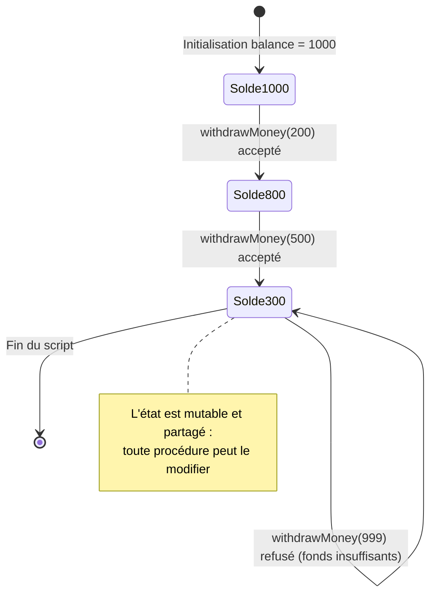
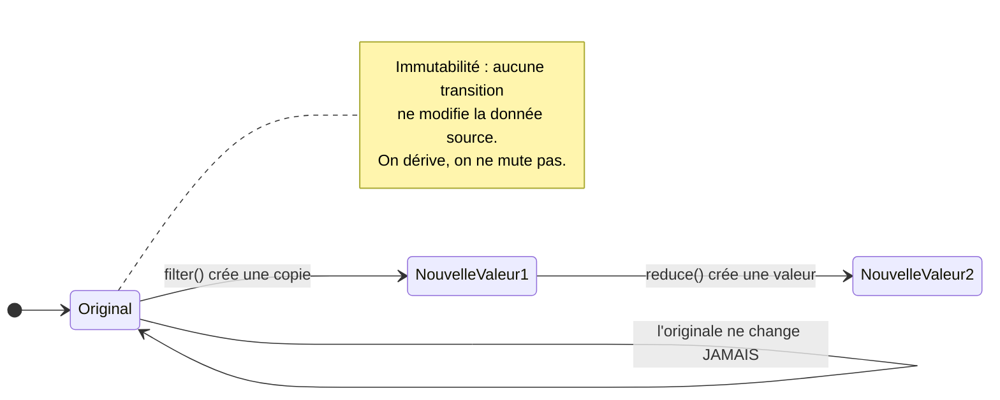
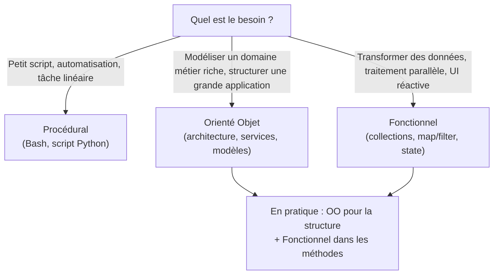

# Paradigmes de Programmation

<div
  class="omny-meta"
  data-level="🟢 Débutant & 🟡 Intermédiaire"
  data-version="1.1"
  data-time="35 - 50 minutes">
</div>


!!! quote "Analogie pédagogique"
    _Un paradigme de programmation est comme un style culinaire. Vous pouvez préparer des œufs à la poêle (procédural), utiliser une machine qui prépare le petit-déjeuner idéal (orienté objet) ou déclarer que vous voulez des œufs sans dire comment les faire (déclaratif)._

!!! quote "Des philosophies de conception"
    _Un paradigme de programmation n'est pas un langage en soi, mais un **style**, une façon de penser et de structurer son code pour résoudre un problème. Tout comme un architecte peut choisir de construire en béton brut ou en ossature bois, un développeur choisit un paradigme (ou les combine) selon la nature du projet. Les langages modernes (PHP, JavaScript, Python, Swift) sont pour la plupart "multi-paradigmes", permettant de piocher le meilleur de chaque monde._

---

## Introduction

Un **paradigme** est un cadre mental : il définit *quels concepts* existent dans votre code et *comment* on les assemble pour résoudre un problème. Le procédural raisonne en termes d'instructions et d'état partagé ; l'orienté objet en termes d'objets qui encapsulent données et comportements ; le fonctionnel en termes de transformations de valeurs immuables. Aucun n'est universellement « meilleur » : chacun excelle sur une classe de problèmes et révèle ses limites sur une autre.

Une distinction structurante traverse tous les paradigmes : **impératif** contre **déclaratif**. Le code impératif décrit *comment* obtenir un résultat, étape par étape (« parcours le tableau, teste chaque élément, accumule »). Le code déclaratif décrit *quoi* obtenir, en déléguant le « comment » au langage ou à la bibliothèque (« donne-moi les éléments positifs »). Le procédural est impératif ; le fonctionnel tend vers le déclaratif ; l'orienté objet peut être les deux. Gardez cette boussole : elle explique pourquoi un même problème se code si différemment d'un paradigme à l'autre.

Le tableau ci-dessous situe les trois grands paradigmes que cette leçon développe. Il sert de repère avant d'entrer dans le détail.

| Paradigme | Unité de base | Style | Force principale | Faiblesse principale |
|---|---|---|---|---|
| Procédural | La procédure (fonction) + état global | Impératif | Simplicité, lisibilité directe | Devient ingérable à grande échelle |
| Orienté Objet | L'objet (état + comportement) | Impératif / déclaratif | Modélisation du domaine, réutilisabilité | Verbeux, couplage si mal conçu |
| Fonctionnel | La fonction pure + données immuables | Déclaratif | Concurrence, testabilité, prédictibilité | Courbe d'apprentissage, indirection |

## 1. La Programmation Impérative et Procédurale

C'est le paradigme historique, la façon la plus "naturelle" d'expliquer une tâche à un ordinateur.

**La Philosophie :** "Fais ceci, puis fais cela". Le code est une suite d'instructions linéaires qui modifient l'état global du programme.
La variante *Procédurale* introduit simplement les fonctions (procédures) pour regrouper le code redondant, mais la logique reste une longue recette de cuisine.

### L'approche en pratique
Vous définissez des variables, et des fonctions viennent lire ou modifier ces variables. Les données (le "Quoi") et les comportements (le "Comment") sont séparés.

L'exemple suivant illustre le point central — et le danger — du procédural : l'**état global mutable**. La variable `$balance` vit en dehors de la fonction ; la procédure la modifie via `global`. C'est simple à lire, mais n'importe quelle partie du programme peut altérer cet état, ce qui rend les bugs difficiles à localiser.

```php
// État global (Données) — visible et modifiable par tout le programme
$balance = 1000;

// Procédure (Comportement) — agit par effet de bord sur l'état global
function withdrawMoney(int $amount) {
    global $balance;              // On importe l'état global : couplage caché
    if ($balance >= $amount) {
        $balance -= $amount;      // Mutation de l'état partagé
        return true;
    }
    return false;
}

// Exécution linéaire — une instruction après l'autre
withdrawMoney(200);
```

Le diagramme d'état ci-dessous modélise la conséquence directe de ce style : la donnée `balance` est une **machine à états mutable**. Chaque retrait fait transiter le solde d'une valeur à une autre, et rien n'empêche structurellement un montant invalide d'être tenté. Comprendre la donnée comme un état qui se transforme est exactement la grille de lecture du paradigme impératif.



### Le Cas d'usage
Parfait pour les petits scripts système (bash), les micro-contrôleurs (C), ou les algorithmes mathématiques purs. Cependant, sur des projets massifs (des milliers de lignes), l'approche procédurale devient vite un "code spaghetti" impossible à maintenir.

!!! warning "Le danger de l'état global"
    L'usage de `global` (ou de variables partagées entre fonctions) est la principale source de bugs du procédural à grande échelle. Quand dix fonctions peuvent modifier la même variable, retrouver *qui* l'a corrompue devient un cauchemar. C'est précisément ce problème que la POO résout par l'**encapsulation**, et le fonctionnel par l'**immutabilité**.

---

## 2. La Programmation Orientée Objet (POO)

Apparue pour résoudre les problèmes de complexité de la programmation procédurale, la POO est aujourd'hui le standard absolu du monde professionnel (Java, C#, PHP moderne).

**La Philosophie :** Modéliser le programme comme une collection d'**Objets** qui interagissent. 

Un objet est une capsule qui regroupe intimement :
- **Son état** (ses propriétés/attributs).
- **Ses comportements** (ses méthodes).

### Les 4 Piliers de la POO

1. **L'Encapsulation** : L'objet protège ses données internes (`private`) et expose une interface publique stricte pour interagir avec lui. Vous ne pouvez pas modifier directement son solde bancaire, vous devez utiliser la méthode `withdrawMoney()`.
2. **L'Héritage** : Une classe `Guerrier` peut hériter des propriétés de la classe mère `Personnage` et y ajouter ses propres spécificités.
3. **Le Polymorphisme** : Des objets différents peuvent partager la même méthode (ex: `calculerSalaire()`), mais chaque objet l'exécutera à sa manière (un Vendeur n'est pas calculé comme un Manager).
4. **L'Abstraction** : Se concentrer sur *ce que* fait l'objet (l'Interface) et cacher les détails complexes de *comment* il le fait.

Le tableau ci-dessous résume ces quatre piliers et le problème concret que chacun résout. Ce sont les fondations sur lesquelles reposent aussi les principes SOLID.

| Pilier | Mot-clé technique | Problème résolu |
|---|---|---|
| Encapsulation | `private`, `protected`, accesseurs | Protéger l'état d'une modification incohérente |
| Héritage | `extends` | Réutiliser et spécialiser un comportement |
| Polymorphisme | `interface`, surcharge | Traiter uniformément des objets différents |
| Abstraction | `abstract`, `interface` | Cacher la complexité derrière un contrat simple |

L'exemple ci-dessous reprend le compte bancaire, mais cette fois l'état (`balance`) est **encapsulé** : déclaré `private`, il n'est plus accessible de l'extérieur. La seule façon de le modifier passe par la méthode `withdraw()`, qui fait respecter la règle métier (« on ne retire pas plus que le solde »). L'objet protège son propre invariant — c'est la différence fondamentale avec le procédural.

```php
// La Classe (le Moule)
class BankAccount {
    // Encapsulation de l'état : inaccessible directement depuis l'extérieur
    private int $balance;

    public function __construct(int $initialBalance) {
        $this->balance = $initialBalance;
    }

    // Le Comportement (Méthode) : seul point d'entrée pour modifier le solde
    public function withdraw(int $amount): bool {
        if ($this->balance >= $amount) {   // La règle métier est garantie par l'objet
            $this->balance -= $amount;
            return true;
        }
        return false;
    }
}

// L'Objet (l'Instance)
$account = new BankAccount(1000);
$account->withdraw(200);
// $account->balance = 0;  // IMPOSSIBLE : propriété privée → erreur. L'invariant est protégé.
```

Le polymorphisme mérite un exemple dédié, car c'est lui qui rend la POO si puissante pour l'extension. Dans l'extrait suivant, une même boucle traite des objets de types différents sans connaître leur classe concrète : chacun répond à `calculerSalaire()` à sa façon.

```php
interface Employe {
    public function calculerSalaire(): float;
}

class Manager implements Employe {
    public function calculerSalaire(): float { return 5000.0; }          // Salaire fixe
}

class Vendeur implements Employe {
    public function calculerSalaire(): float { return 2000.0 + $this->commissions(); } // Fixe + variable
    private function commissions(): float { /* ... */ return 0.0; }
}

// Polymorphisme : la boucle ignore le type concret, elle ne connaît que le contrat
function masseSalariale(array $employes): float {
    $total = 0.0;
    foreach ($employes as $e) {
        $total += $e->calculerSalaire(); // Chaque objet exécute SA version
    }
    return $total;
}
```

!!! info "POO et SOLID"
    Les quatre piliers de la POO sont la **boîte à outils** ; les principes SOLID sont le **mode d'emploi**. On peut parfaitement écrire du mauvais code orienté objet (classes obèses, héritage abusif). SOLID indique comment mobiliser l'encapsulation, le polymorphisme et l'abstraction pour produire une architecture réellement maintenable.

---

## 3. La Programmation Fonctionnelle (PF)

Longtemps réservée au monde académique (Lisp, Haskell), la programmation fonctionnelle a envahi le développement web ces dernières années (React, JavaScript moderne).

**La Philosophie :** La PF est basée sur l'évaluation de fonctions mathématiques. Le concept central est l'**Immutabilité** : les données ne changent jamais.

### Les principes fondamentaux

1. **Fonctions Pures** : Une fonction pure, si on lui donne les mêmes entrées, retournera toujours la même sortie, **sans effet de bord** (side-effect). Elle ne lit ni ne modifie aucune variable extérieure (ni base de données, ni fichier global).
2. **L'Immutabilité** : Au lieu de modifier un tableau en place pour y ajouter un élément, on crée un *nouveau* tableau qui contient l'ancien élément + le nouveau.
3. **Fonctions de Première Classe (First-Class)** : Les fonctions sont traitées comme des variables. On peut passer une fonction en paramètre d'une autre fonction (ex: les Callbacks, `map`, `filter`, `reduce`).

La notion de **fonction pure** est si centrale qu'elle mérite d'être définie par opposition. Le tableau suivant contraste une fonction pure et une fonction impure : c'est l'absence d'effet de bord qui rend le code fonctionnel prévisible et testable.

| Critère | Fonction pure | Fonction impure |
|---|---|---|
| Même entrée → même sortie | Toujours | Pas garanti |
| Lit une variable externe | Non | Souvent |
| Modifie un état (DB, fichier, global) | Non | Oui |
| Testable en isolation | Trivialement | Difficilement |
| Exemple | `(a, b) => a + b` | `() => Date.now()`, `console.log()` |

L'exemple ci-dessous illustre les trois principes en action. Les données d'origine ne sont jamais touchées ; `filter` et `reduce` produisent de *nouvelles* valeurs ; et la composition de fonctions pures donne un résultat entièrement prévisible.

```javascript
// Les données d'origine (Ne seront jamais modifiées — immutabilité)
const transactions = [100, -50, 200, -10];

// Fonction Pure : Retourne un NOUVEAU tableau sans toucher l'original
const extractDeposits = (arr) => arr.filter(amount => amount > 0);

// Fonction Pure de calcul : aucune dépendance externe
const sum = (arr) => arr.reduce((total, amount) => total + amount, 0);

// Exécution par composition de fonctions pures
const totalDeposits = sum(extractDeposits(transactions)); // Retourne 300
// transactions est toujours [100, -50, 200, -10] : rien n'a muté
```

Le diagramme d'état ci-dessous met en lumière le contraste décisif avec le procédural. Là où l'état mutable transitait *en place* d'une valeur à l'autre, l'approche fonctionnelle ne mute rien : chaque transformation crée une **nouvelle valeur**, l'originale demeurant intacte et accessible. C'est cette propriété qui élimine des classes entières de bugs de concurrence.



### Le Cas d'usage
L'approche fonctionnelle excelle dans la **concurrence** (multi-threading). Puisque les données sont immuables, il n'y a aucun risque que deux fils d'exécution modifient la même variable en même temps. Elle est aussi très appréciée pour la gestion d'interface utilisateur réactive (State management).

!!! tip "Le fonctionnel au cœur de Laravel et React"
    Vous faites déjà du fonctionnel sans le savoir. Les **Collections** Laravel (`->map()`, `->filter()`, `->reduce()`, `->pluck()`) sont une API fonctionnelle : elles retournent de nouvelles collections sans muter l'originale. Côté front, **React** repose sur l'immutabilité de l'état (`setState` remplace, ne modifie pas) et sur des composants conçus comme des fonctions pures de leurs *props*. Maîtriser le fonctionnel, c'est mieux maîtriser ces deux outils.

!!! danger "L'effet de bord : nécessaire mais à isoler"
    Un programme 100 % pur serait inutile : écrire en base, appeler une API ou afficher à l'écran *sont* des effets de bord, et c'est le but du logiciel. La stratégie fonctionnelle n'est pas de les supprimer, mais de les **repousser aux frontières** du système (entrées/sorties) et de garder le cœur métier pur. Un cœur pur se teste sans base de données ni réseau ; c'est un gain de fiabilité considérable.

---

## Comment choisir ? La réalité multi-paradigme

Dans la pratique professionnelle, la question n'est pas « quel paradigme adopter ? » mais « quel paradigme pour quelle partie du code ? ». Le diagramme ci-dessous propose un arbre de décision pragmatique, à pondérer toujours par les contraintes du projet et de l'équipe.



## Conclusion

!!! quote "Ce qu'il faut retenir"
    La maîtrise du concept de paradigmes est un pilier de l'informatique fondamentale. Au-delà de la syntaxe technique, c'est cette compréhension théorique qui différencie un simple technicien d'un véritable ingénieur capable de concevoir des systèmes robustes et maintenables.

Aujourd'hui, vous n'avez plus à choisir un camp. Dans une application Laravel ou Swift moderne :

- Vous utilisez l'**Orienté Objet** pour structurer l'architecture globale (Modèles, Contrôleurs, Services).
- Vous utilisez des principes **Fonctionnels** à l'intérieur de vos méthodes (collections, map, filter) pour traiter la donnée proprement et sans effet de bord.

!!! quote "Conclusion"
    _Un paradigme n'est pas une religion mais un outil, et un ingénieur expérimenté en possède plusieurs dans sa caisse. Le procédural reste imbattable pour un script de dix lignes ; l'orienté objet structure les grands domaines métier ; le fonctionnel discipline le traitement des données et sécurise la concurrence. La vraie compétence n'est pas de défendre un style contre les autres, mais de reconnaître, pour chaque portion de code, lequel exprime le problème le plus clairement. C'est cette souplesse — penser en objets ici, en transformations là — qui caractérise le développeur mûr, capable de lire et d'écrire dans les langages multi-paradigmes qui dominent aujourd'hui l'industrie._
