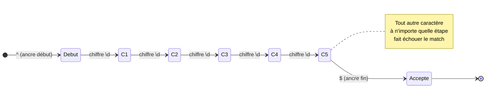

# Les Expressions Régulières (RegEx)

<div
  class="omny-meta"
  data-level="🟡 Intermédiaire"
  data-version="1.1"
  data-time="40 - 55 minutes">
</div>


!!! quote "Analogie pédagogique"
    _Les expressions régulières (Regex) sont comme un tamis ultra-précis pour chercheur d'or. Au lieu de chercher un mot exact, vous décrivez sa forme ('je veux un mot de 5 lettres qui commence par a et finit par un chiffre') pour filtrer des milliers de lignes de texte en une seconde._

!!! quote "Un langage dans le langage"
    _Les **Expressions Régulières** (souvent abrégées RegEx ou RegExp) sont une séquence de caractères formant un motif de recherche. Initialement perçues comme une suite incompréhensible de symboles cryptiques, elles constituent en réalité l'un des outils les plus puissants d'un développeur pour analyser, valider ou extraire de la donnée textuelle complexe en une seule ligne de code._

---

## Introduction : une regex est un automate

Avant la syntaxe, une idée fondatrice. Une expression régulière n'est pas une « formule magique » : c'est la description compacte d'un **automate fini** (*finite state machine*) — une machine qui lit le texte caractère par caractère et passe d'un état à l'autre selon ce qu'elle rencontre. Comprendre cela démystifie tout le reste : chaque symbole d'une regex ajoute simplement une transition possible dans cette machine.

Le diagramme d'état ci-dessous représente l'automate correspondant au motif `/^\d{5}$/` (valider un code postal de cinq chiffres). Le moteur démarre, exige cinq transitions « chiffre » consécutives, puis n'accepte la chaîne que s'il atteint la fin. Un seul caractère non numérique, ou un sixième chiffre, et la machine échoue. C'est *exactement* ce que fait votre langage quand il évalue cette regex.



!!! info "Pourquoi c'est important"
    Les regex sont **universelles** et **transversales**. La même logique de motif fonctionne dans PHP, JavaScript, Python, Go, dans la recherche de votre IDE, dans `grep` sur un serveur, dans les règles d'un pare-feu applicatif (WAF) ou d'un système de détection d'intrusion. C'est une compétence qui ne se périme pas et qui sert aussi bien au développeur qu'à l'analyste en cybersécurité (recherche d'IOC dans des logs, par exemple).

## À quoi ça sert concrètement ?

Imaginons que vous demandiez à un utilisateur de saisir son numéro de téléphone. Il pourrait l'écrire de dizaines de façons : `0612345678`, `06 12 34 56 78`, `+33 6 12 34 56 78`, `06.12.34.56.78`.

Comment vérifier en PHP ou JavaScript que la chaîne est bien un numéro valide ?
- **Méthode classique (Procédurale)** : Vous feriez des dizaines de `if`, vous retireriez les espaces, vérifieriez la longueur, vérifieriez que chaque caractère est bien un chiffre... C'est lourd et source de bugs.
- **Méthode RegEx** : Vous définissez un "Motif" (Pattern) et vous demandez au moteur : *"Est-ce que cette chaîne correspond à mon motif ?"*

Au-delà de la validation, les regex servent à trois grandes familles de tâches, que le tableau ci-dessous distingue car elles n'utilisent pas les mêmes fonctions selon le langage.

| Tâche | Question posée | Fonction PHP | Fonction JS |
|---|---|---|---|
| **Valider** | « La chaîne correspond-elle entièrement au motif ? » | `preg_match()` | `RegExp.test()` |
| **Extraire** | « Quelles parties correspondent ? » | `preg_match_all()` | `String.matchAll()` |
| **Remplacer** | « Substituer chaque correspondance par… » | `preg_replace()` | `String.replace()` |

## La Syntaxe Fondamentale

Une expression régulière est généralement encadrée par des délimiteurs, le plus souvent des slashes `/`.

Exemple : `/^[0-9]{10}$/` (Vérifie qu'il y a exactement 10 chiffres).

Voici les blocs de construction pour lire cette "magie noire".

### 1. Les Caractères Littéraux et les Méta-caractères
Si vous cherchez le mot "chat", la regex est simplement `/chat/`. 
Mais certains caractères ont un pouvoir spécial (Méta-caractères) : `. ^ $ * + ? ( ) [ ] { } \ |`

Si vous voulez chercher un vrai point `.`, vous devez "l'échapper" avec un antislash : `\.`.

### 2. Les Classes de Caractères (Les Ensembles)
Les crochets `[]` permettent de définir un ensemble de caractères autorisés à une position donnée.

- `/[aeiouy]/` : Trouve **UNE** voyelle (a, e, i, o, u, ou y).
- `/[a-z]/` : Trouve n'importe quelle lettre minuscule de a à z.
- `/[0-9]/` : Trouve n'importe quel chiffre.
- `/[^0-9]/` : Le `^` à l'intérieur de crochets signifie la **négation**. Trouve tout ce qui n'est PAS un chiffre.

### 3. Les Raccourcis
Parce qu'écrire `[0-9]` ou `[a-zA-Z0-9_]` est long, des raccourcis (classes prédéfinies) existent :

- `\d` : Un chiffre (équivalent à `[0-9]`). (*d pour digit*)
- `\D` : Tout sauf un chiffre.
- `\w` : Un caractère alphanumérique ou un underscore (`[a-zA-Z0-9_]`). (*w pour word character*)
- `\s` : Un espace (espace, tabulation, saut de ligne). (*s pour space*)
- `.` (le point) : N'importe quel caractère (sauf les sauts de ligne).

Le tableau ci-dessous synthétise ces raccourcis et leur négation (la version majuscule signifie toujours « le contraire »). Le mémoriser fait gagner un temps considérable à la lecture comme à l'écriture.

| Raccourci | Signifie | Équivalent | Négation |
|:---:|---|---|:---:|
| `\d` | Un chiffre | `[0-9]` | `\D` |
| `\w` | Un caractère de mot | `[a-zA-Z0-9_]` | `\W` |
| `\s` | Un espace blanc | `[ \t\n\r]` | `\S` |
| `.` | N'importe quel caractère | (sauf `\n`) | — |
| `\b` | Frontière de mot | (position) | `\B` |

### 4. Les Quantificateurs (Combien de fois ?)
Ils s'appliquent au caractère (ou au groupe) qui les précède immédiatement.

- `*` : 0 fois ou plus (Optionnel ou infini).
- `+` : 1 fois ou plus (Obligatoire au moins une fois).
- `?` : 0 ou 1 fois (Optionnel).
- `{n}` : Exactement `n` fois. (Ex: `\d{4}` = exactement 4 chiffres).
- `{min,max}` : Entre `min` et `max` fois. (Ex: `\w{3,10}` = un mot de 3 à 10 lettres).

Le tableau ci-dessous récapitule les quantificateurs avec un exemple concret pour chacun. Notez la colonne « gourmand » : par défaut, un quantificateur capture le *plus* possible — une subtilité que nous détaillerons plus bas.

| Quantif. | Répétitions | Exemple | Correspond à |
|:---:|---|---|---|
| `*` | 0 ou plus | `ab*` | `a`, `ab`, `abbbb` |
| `+` | 1 ou plus | `ab+` | `ab`, `abbbb` (pas `a`) |
| `?` | 0 ou 1 | `colou?r` | `color`, `colour` |
| `{n}` | exactement n | `\d{4}` | `2026` |
| `{n,}` | n ou plus | `\d{2,}` | `12`, `12345` |
| `{n,m}` | entre n et m | `\w{3,10}` | un mot de 3 à 10 caractères |

### 5. Les Ancres (Positionnement)
Elles ne matchent pas un caractère, mais une **position** dans la chaîne.

- `^` : Début de la chaîne.
- `$` : Fin de la chaîne.

!!! danger "L'importance des ancres pour la validation"
    Si vous vérifiez un code postal avec `/ \d{5} /`, la chaîne `Mon code est 75000 et bla bla` sera validée car le moteur trouve "75000" à l'intérieur.
    Si vous utilisez `/^\d{5}$/`, la chaîne devra **commencer et se terminer** par 5 chiffres. La chaîne précédente sera donc rejetée. C'est capital pour la sécurité.

---

## Cas Pratiques Fréquents

### L'Adresse Email Simple
`/^[\w\.-]+@[\w\.-]+\.[a-zA-Z]{2,}$/`

**Traduction :**
1. `^` : Depuis le début.
2. `[\w\.-]+` : Un ou plusieurs caractères alphanumériques, points ou tirets.
3. `@` : Un "@" littéral.
4. `[\w\.-]+` : Un ou plusieurs caractères alphanumériques, points ou tirets (le nom de domaine).
5. `\.` : Un vrai point (échappé).
6. `[a-zA-Z]{2,}` : Une extension (com, fr, org) composée de lettres uniquement, d'une longueur de 2 minimum.
7. `$` : Jusqu'à la fin.

L'extrait PHP ci-dessous met cette regex en œuvre avec `preg_match`. Observez la valeur de retour : `1` si la chaîne correspond, `0` sinon, et `false` en cas d'erreur de compilation du motif — une distinction à respecter en code défensif.

```php
<?php
// Validation d'une adresse email avec une regex simple
$pattern = '/^[\w\.-]+@[\w\.-]+\.[a-zA-Z]{2,}$/';
$email   = 'alain.guillon@example.com';

// preg_match retourne 1 (match), 0 (pas de match) ou false (erreur)
if (preg_match($pattern, $email) === 1) {
    echo "Email valide";
} else {
    echo "Email invalide";
}
```

!!! warning "Ne validez pas un email « parfaitement » avec une regex"
    La RFC 5322 décrit une grammaire d'email d'une complexité telle qu'aucune regex raisonnable ne la couvre exactement. En production, la regex simple ci-dessus suffit pour un filtrage de surface, mais la **seule validation fiable** d'un email est l'envoi d'un message de confirmation. En PHP, préférez d'ailleurs `filter_var($email, FILTER_VALIDATE_EMAIL)` à une regex maison : c'est plus robuste et maintenu par le langage.

### Le Numéro de Téléphone Français
`/^(?:(?:\+|00)33|0)\s*[1-9](?:[\s.-]*\d{2}){4}$/`

**Traduction :** Accepte `+33 6 12 34 56 78`, `0033612345678`, ou `06.12.34.56.78`. (Il utilise des groupes non-capturants `(?:)` pour gérer les différentes syntaxes du préfixe international).

## Les Groupes de Capture `()`

Les parenthèses ont un double rôle :
1. Elles appliquent un quantificateur à un ensemble entier. Ex: `/(bla)+/` matche "blablabla".
2. Elles **capturent** la valeur trouvée pour pouvoir l'extraire et l'utiliser dans votre code.

**Exemple d'extraction (JavaScript) :**
Imaginons une date formatée en `AAAA-MM-JJ`.
```javascript
const regex = /^(\d{4})-(\d{2})-(\d{2})$/;
const match = "2026-12-25".match(regex);

console.log(match[1]); // "2026" (Groupe 1)
console.log(match[2]); // "12"   (Groupe 2)
console.log(match[3]); // "25"   (Groupe 3)
```

Pour du code maintenable, on préfère les **groupes nommés**, qui rendent l'intention explicite et survivent à un réordonnancement du motif. La syntaxe est `(?<nom>...)`. L'exemple ci-dessous reprend la date avec des noms parlants.

```javascript
// Groupes nommés : on accède par sens, pas par position
const regex = /^(?<annee>\d{4})-(?<mois>\d{2})-(?<jour>\d{2})$/;
const { groups } = "2026-12-25".match(regex);

console.log(groups.annee); // "2026"
console.log(groups.mois);  // "12"
console.log(groups.jour);  // "25"
```

!!! tip "Groupe capturant vs non-capturant"
    Toute parenthèse `(...)` capture par défaut, ce qui consomme de la mémoire et décale la numérotation des groupes. Quand vous groupez uniquement pour appliquer un quantificateur — sans vouloir extraire la valeur — utilisez le groupe **non-capturant** `(?:...)`. C'est plus performant et cela garde une numérotation propre, comme dans la regex de téléphone ci-dessus.

## Les Flags (Drapeaux)

Les flags modifient le comportement global du moteur RegEx. Ils se placent après le slash final : `/pattern/flags`.

- `i` (Insensitive) : Ignore la casse (A = a).
- `g` (Global) : Ne s'arrête pas après la première occurrence trouvée, mais cherche dans tout le texte.
- `m` (Multiline) : Les ancres `^` et `$` correspondent au début et à la fin de chaque *ligne*, plutôt que de la chaîne globale.

Le tableau ci-dessous complète cette liste avec les flags les plus utiles en pratique, notamment `u` (Unicode) souvent indispensable pour traiter correctement les caractères accentués et les émojis.

| Flag | Nom | Effet |
|:---:|---|---|
| `i` | Insensitive | Ignore la casse (`A` = `a`) |
| `g` | Global | Toutes les occurrences, pas seulement la première |
| `m` | Multiline | `^` et `$` s'appliquent à chaque ligne |
| `s` | Dotall | Le `.` matche aussi les sauts de ligne |
| `u` | Unicode | Interprète correctement l'UTF-8 (accents, émojis) |
| `x` | Extended | Autorise espaces et commentaires dans le motif (lisibilité) |

!!! info "En PHP, le flag est dans le délimiteur"
    En JavaScript, les flags suivent le motif (`/abc/gi`). En PHP, ils se placent **après le délimiteur fermant** de la chaîne : `'/abc/i'`. Le flag `u` y est particulièrement important : sans lui, `preg_match('/./', 'é')` peut compter deux octets au lieu d'un caractère, faussant tout traitement de texte accentué.

## Sécurité : le piège du ReDoS

Une regex mal conçue n'est pas seulement inexacte : elle peut devenir une **faille de déni de service**. Cette section, alignée sur une démarche DevSecOps, doit être comprise par tout développeur qui accepte des regex ou applique des motifs à des entrées utilisateur.

Le **ReDoS** (*Regular expression Denial of Service*) exploite le phénomène de **backtracking catastrophique**. Certains motifs, face à une chaîne soigneusement construite, forcent le moteur à explorer un nombre exponentiel de combinaisons avant d'échouer. Le CPU sature, le thread se bloque, le service tombe.

```javascript
// Motif VULNÉRABLE : quantificateurs imbriqués sur un même caractère
const dangereux = /^(a+)+$/;

// Sur cette entrée, le moteur explore un nombre exponentiel de chemins
// avant de conclure à l'échec : le processus se fige plusieurs secondes
dangereux.test("aaaaaaaaaaaaaaaaaaaaaaaa!");
```

Le tableau ci-dessous résume le risque selon la grille d'analyse défensive : ce qui peut être compromis, à quelles conditions, et comment s'en prémunir.

| Élément | Description |
|---|---|
| **Risque** | Saturation CPU, blocage du thread, indisponibilité du service |
| **Préconditions** | Un motif à quantificateurs imbriqués (`(a+)+`, `(.*)*`) appliqué à une entrée non maîtrisée |
| **Impact** | Déni de service applicatif ; un seul attaquant peut figer un worker |
| **Détection** | Temps de réponse anormaux ; profilage CPU ; tests de charge sur les motifs |
| **Correction / Prévention** | Éviter l'imbrication de quantificateurs ; ancrer le motif ; limiter la taille des entrées ; préférer une validation non-regex quand c'est possible |

!!! danger "Ne faites jamais confiance à une regex fournie par l'utilisateur"
    Si votre application permet à un utilisateur de saisir un motif de recherche regex (filtre, règle personnalisée), vous lui donnez potentiellement les moyens de déclencher un ReDoS sur votre serveur. Imposez une limite de temps d'exécution (`pcre.backtrack_limit` en PHP), bornez la longueur de l'entrée, et envisagez un moteur à temps linéaire (comme RE2) pour les motifs non fiables.

## Conclusion

!!! quote "Ce qu'il faut retenir"
    La maîtrise du concept de regex est un pilier de l'informatique fondamentale. Au-delà de la syntaxe technique, c'est cette compréhension théorique qui différencie un simple technicien d'un véritable ingénieur capable de concevoir des systèmes robustes et maintenables.

Les Expressions Régulières sont universelles : la même RegEx de validation d'email fonctionnera en PHP, en JavaScript, en Python, et même dans l'outil de recherche de votre IDE. C'est une compétence transversale qui a une durée de vie infinie dans votre carrière de développeur.

!!! quote "Conclusion"
    _Une regex est un automate fini déguisé en suite de symboles : qui tient cette idée en tête lit n'importe quel motif sans s'y perdre. La compétence se construit par couches — d'abord les classes et quantificateurs, puis les groupes et les ancres, enfin les flags et les subtilités du backtracking. Mais la maturité ne consiste pas à écrire la regex la plus astucieuse possible : elle consiste à savoir quand une regex est le bon outil, et quand un simple `filter_var` ou une fonction de chaîne fera mieux, plus lisiblement et sans risque de ReDoS. Une regex juste, ancrée et testée vaut mieux qu'une regex brillante et imprévisible. Documentez toujours vos motifs complexes : celui qui les relira dans six mois, c'est vous._
