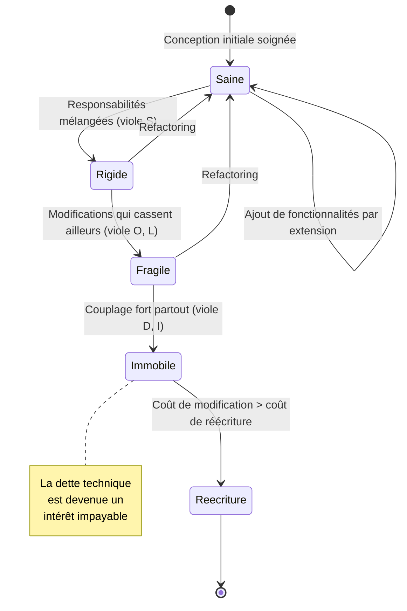
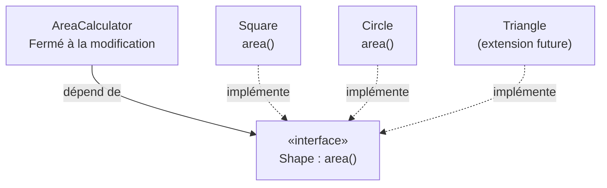
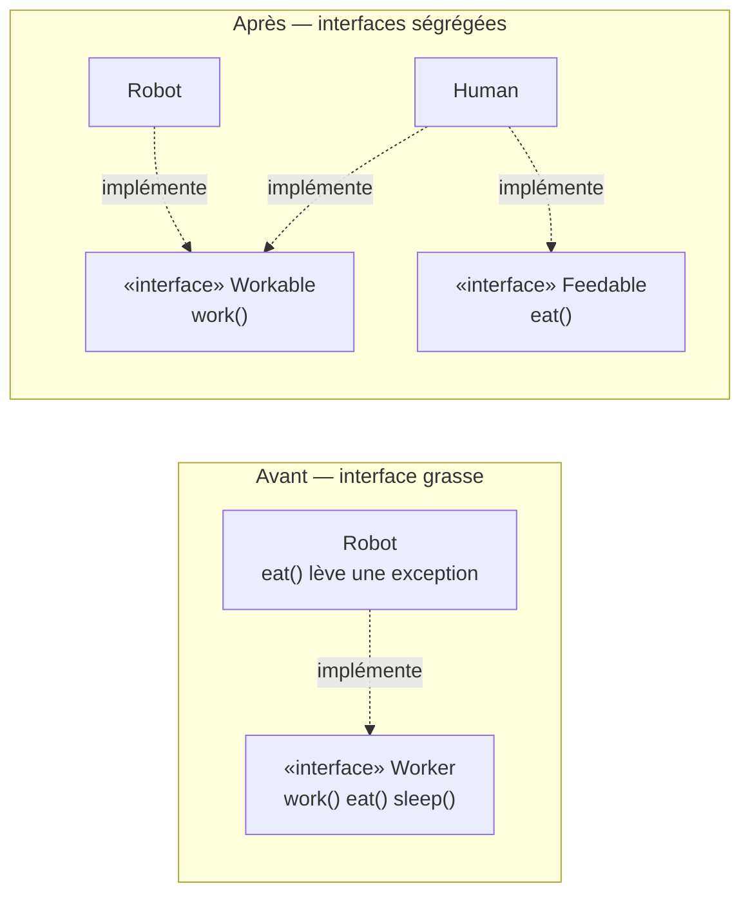
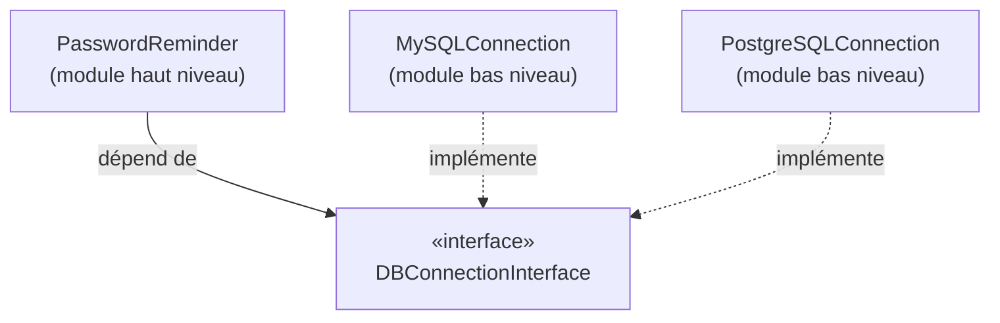

# Les Principes S.O.L.I.D.

<div
  class="omny-meta"
  data-level="🔴 Avancé"
  data-version="1.1"
  data-time="55 - 75 minutes">
</div>


!!! quote "Analogie pédagogique"
    _Les principes SOLID sont les règles de sécurité d'un chantier d'ingénierie. Ils garantissent que si vous ajoutez un étage à votre bâtiment (votre application) dans deux ans, les fondations ne s'effondreront pas sous le nouveau poids._

!!! quote "Éviter la dette technique"
    _Les principes SOLID ont été popularisés par Robert C. Martin ("Uncle Bob") dans les années 2000. Ils représentent les 5 commandements de la Programmation Orientée Objet (POO). Si vous ignorez ces principes, votre application fonctionnera, mais au fur et à mesure qu'elle grandira, le code deviendra rigide, fragile et impossible à modifier sans casser autre chose. SOLID est la clé pour créer une architecture **maintenable**, **testable** et **évolutive**._

---

## Introduction

SOLID est un **acronyme mnémotechnique** regroupant cinq principes de conception orientée objet. Pris isolément, chacun répond à une question précise : où placer une responsabilité, comment ajouter une fonctionnalité sans casser l'existant, comment hériter sans surprise, comment découper une interface, et comment inverser une dépendance. Pris ensemble, ils forment une boussole qui oriente l'architecture vers un objectif unique : **réduire le coût du changement**.

Il faut comprendre dès le départ ce que SOLID n'est pas. Ce n'est ni un framework, ni une bibliothèque, ni une syntaxe ; c'est un ensemble d'**heuristiques** — des règles empiriques validées par des décennies de pratique. On ne « compile » pas SOLID : on l'applique par jugement, en arbitrant constamment entre la pureté théorique et la simplicité concrète. Appliqués sans discernement, ces principes mènent à la **sur-ingénierie** (over-engineering) ; ignorés, ils mènent au **code spaghetti**. L'objectif de cette leçon est de vous donner les critères pour trancher.

Avant d'entrer dans le détail, le tableau ci-dessous offre une vue d'ensemble. Gardez-le à portée de main : chaque ligne sera développée dans une section dédiée.

| Lettre | Principe | Question à laquelle il répond | Outil POO mobilisé |
|:---:|---|---|---|
| **S** | Single Responsibility | « Pourquoi cette classe changerait-elle ? » | Cohésion, séparation des préoccupations |
| **O** | Open/Closed | « Comment ajouter sans modifier ? » | Polymorphisme, interfaces |
| **L** | Liskov Substitution | « Ce sous-type est-il un vrai substitut ? » | Héritage, contrats |
| **I** | Interface Segregation | « Ce client a-t-il besoin de toute l'interface ? » | Interfaces fines |
| **D** | Dependency Inversion | « De quoi mon module dépend-il vraiment ? » | Abstraction, injection de dépendances |

### Le coût du changement, illustré par un diagramme d'état

Le diagramme ci-dessous modélise le **cycle de vie de la santé d'une base de code**. Une base saine respecte SOLID ; à mesure que des violations s'accumulent, elle dérive vers la rigidité puis la fragilité. Le refactoring est la seule transition qui ramène le code vers un état sain ; sans lui, l'état terminal est la réécriture complète — coûteuse et risquée.



!!! info "Pourquoi c'est important"
    Une étude récurrente du génie logiciel établit que la majorité du coût d'un logiciel se situe non pas dans son écriture initiale, mais dans sa **maintenance** — corrections, évolutions, adaptations. SOLID agit précisément sur ce poste de dépense : il rend le code modifiable sans effet de bord. C'est la différence entre une fonctionnalité livrée en une heure et la même livrée en une semaine de débogage.

---

## 1. [S]ingle Responsibility Principle (SRP)
*Principe de Responsabilité Unique*

> **"Une classe ne doit avoir qu'une seule raison de changer."**

Chaque classe (ou module) doit avoir une seule et unique responsabilité dans le logiciel. Si une classe fait trop de choses, la modification d'une de ses fonctionnalités risque de corrompre les autres.

La formulation la plus précise est celle des **acteurs** : une classe ne doit répondre qu'à un seul acteur — un seul groupe de personnes ou de raisons susceptibles de demander un changement. Une classe `User` qui calcule des taxes (acteur : la comptabilité), génère un PDF (acteur : le service communication) et gère la persistance (acteur : l'équipe base de données) répond à trois acteurs. Trois sources de changement convergent sur le même fichier : c'est la définition même d'un point de fragilité.

Le code suivant illustre l'anti-pattern. Observez comment trois préoccupations sans rapport cohabitent dans une seule classe.

**L'Anti-Pattern (Mauvais) :**
```php
class User {
    // Acteur « comptabilité » : règles de TVA, taux, exonérations
    public function calculateTaxes() { /* ... */ }

    // Acteur « communication » : mise en page, charte graphique du rapport
    public function generatePdfReport() { /* ... */ }

    // Acteur « infrastructure » : schéma SQL, connexion, transactions
    public function saveToDatabase() { /* ... */ }
}
```
*Ici, la classe gère la logique métier (Taxes), l'affichage (PDF) et la persistance (BDD). Si le format du PDF change, on doit modifier la classe User. C'est une erreur.*

La solution consiste à **éclater** la classe selon ses axes de changement. Chaque classe résultante a désormais une seule raison d'évoluer, et les tests de l'une n'impactent plus les autres.

**La Solution (Bon) :**
```php
class User {
    // Ne gère que l'état et l'identité de l'utilisateur
    // Une seule raison de changer : la définition métier d'un utilisateur
}

class TaxCalculator {
    // Une seule raison de changer : les règles fiscales
    public function calculateFor(User $user): float { /* ... */ }
}

class UserReportGenerator {
    // Une seule raison de changer : la présentation du rapport
    public function generatePdf(User $user): string { /* ... */ }
}
```

!!! tip "Comment détecter une violation du SRP"
    Trois symptômes trahissent une responsabilité multiple. **Le test de la phrase** : si décrire la classe exige un « et » (« elle calcule les taxes *et* génère le PDF »), elle en fait trop. **Le test du commit** : si des changements de natures différentes touchent sans cesse le même fichier, il faut le scinder. **Le test des imports** : une classe qui importe à la fois une bibliothèque PDF, un driver SQL et un moteur de calcul mélange clairement les couches.

!!! warning "Le piège inverse : la sur-fragmentation"
    Le SRP ne signifie pas « une méthode par classe ». Découper à l'extrême produit une myriade de classes anémiques difficiles à suivre. La bonne granularité est l'**axe de changement**, pas le nombre de lignes. Une classe peut légitimement avoir dix méthodes si toutes servent la même responsabilité.

---

## 2. [O]pen/Closed Principle (OCP)
*Principe Ouvert/Fermé*

> **"Les entités logicielles doivent être ouvertes à l'extension, mais fermées à la modification."**

Vous devriez pouvoir ajouter de nouvelles fonctionnalités à votre application *sans* avoir à modifier le code source existant (car modifier le code existant implique de devoir le retester entièrement).

La tension du principe tient dans son apparente contradiction : comment ajouter un comportement sans toucher au code ? La réponse est le **polymorphisme**. On identifie le point de variation (ici, le calcul d'aire selon la forme), on l'extrait derrière une abstraction (une interface), et chaque nouvelle variante devient une nouvelle classe — une *extension* — sans qu'aucune ligne du code consommateur ne change.

L'anti-pattern ci-dessous concentre toute la logique dans une cascade de `if/elseif`. Chaque nouvelle forme oblige à rouvrir, modifier et retester la classe.

**L'Anti-Pattern (Mauvais) :**
```php
class AreaCalculator {
    public function calculateArea(array $shapes) {
        $area = 0;
        foreach ($shapes as $shape) {
            // Chaque type est traité explicitement : la classe « connaît » toutes les formes
            if ($shape instanceof Square) {
                $area += $shape->width * $shape->width;
            } elseif ($shape instanceof Circle) {
                $area += pi() * $shape->radius * $shape->radius;
            }
            // Si on ajoute un Triangle, on DOIT modifier cette classe !
        }
        return $area;
    }
}
```

Le diagramme ci-dessous montre l'inversion opérée par la solution : au lieu que le calculateur dépende de chaque forme concrète, toutes les formes dépendent d'un contrat commun. Le calculateur ne dialogue plus qu'avec l'abstraction.



**La Solution (Bon) :**
Utiliser le polymorphisme et les interfaces.
```php
interface Shape {
    // Le contrat : toute forme sait calculer son aire
    public function area(): float;
}

class Square implements Shape {
    public function area(): float { return $this->width * $this->width; }
}

class Circle implements Shape {
    public function area(): float { return pi() * $this->radius * $this->radius; }
}

class AreaCalculator {
    public function calculateArea(array $shapes) {
        $area = 0;
        foreach ($shapes as $shape) {
            // Le calculateur ne connaît que le contrat Shape, jamais les types concrets
            $area += $shape->area(); // Le calculateur ne changera JAMAIS, même avec 100 nouvelles formes.
        }
        return $area;
    }
}
```

!!! example "OCP en pratique dans Laravel"
    Le système de **notifications** de Laravel applique l'OCP de bout en bout. Le cœur du framework ne connaît que l'interface `ShouldQueue` et les canaux (`mail`, `database`, `slack`). Pour ajouter un canal SMS, vous écrivez une nouvelle classe de canal : aucun fichier du framework n'est modifié. De même, les `Rule` de validation personnalisées étendent le validateur sans le rouvrir.

!!! warning "OCP n'est pas « tout abstraire d'avance »"
    Anticiper chaque point de variation imaginable produit une architecture sur-abstraite, illisible et coûteuse. La règle pragmatique est la **règle de trois** : la première implémentation est concrète, la deuxième est tolérée par duplication, et c'est la troisième occurrence qui justifie d'introduire l'abstraction. On stabilise une abstraction *après* avoir observé la variation, pas avant.

---

## 3. [L]iskov Substitution Principle (LSP)
*Principe de Substitution de Liskov*

> **"Les objets d'un programme doivent pouvoir être remplacés par des instances de leurs sous-types sans altérer la cohérence du programme."**

Si la classe B hérite de la classe A, alors vous devriez pouvoir passer B partout où A est attendu, sans casser l'application. L'enfant ne doit pas modifier le contrat imposé par le parent (ex: retourner un string là où le parent retournait un integer, ou lever une exception non prévue).

Énoncé en 1987 par **Barbara Liskov**, ce principe formalise une intuition : l'héritage doit modéliser une relation « *est un substitut de* », et non simplement « *ressemble à* ». Un sous-type doit honorer le contrat du type parent : ne pas durcir les préconditions (exiger plus que le parent), ne pas affaiblir les postconditions (garantir moins que le parent), et ne pas introduire d'effet de bord inattendu. Le contre-exemple canonique — le carré et le rectangle — montre que deux objets mathématiquement liés peuvent violer le LSP en programmation.

**L'Anti-Pattern (Le carré n'est pas un rectangle) :**
```php
class Rectangle {
    public function setWidth($w) { $this->width = $w; }
    public function setHeight($h) { $this->height = $h; }
}

class Square extends Rectangle {
    // Un carré DOIT avoir des côtés égaux, on modifie donc le comportement
    // Effet de bord : modifier la largeur change aussi la hauteur — contrat violé
    public function setWidth($w) { $this->width = $w; $this->height = $w; }
    public function setHeight($h) { $this->width = $h; $this->height = $h; }
}

// Fonction attendue :
function testRectangle(Rectangle $r) {
    $r->setWidth(5);
    $r->setHeight(4);
    // On s'attend à une aire de 20. Si on passe un Square, l'aire sera 16 !
    // Le principe de Liskov est violé.
}
```
*Leçon : L'héritage ne doit être utilisé que pour des comportements strictement compatibles. Si les règles changent, n'utilisez pas l'héritage.*

Le tableau suivant récapitule les trois règles de substituabilité que tout sous-type doit respecter pour rester conforme au LSP.

| Règle | Le sous-type doit… | Violation typique |
|---|---|---|
| Préconditions | …ne pas exiger *plus* que le parent | Refuser une valeur que le parent acceptait |
| Postconditions | …ne pas garantir *moins* que le parent | Retourner `null` là où le parent retournait un objet |
| Invariants | …préserver les garanties du parent | Changer un attribut « en douce » (cas du carré) |
| Exceptions | …ne pas lever d'exception non prévue par le contrat | `throw` dans une méthode censée toujours réussir |

!!! danger "Le symptôme révélateur : le test de type"
    Un signe quasi certain de violation du LSP est la présence, dans le code client, de tests `instanceof` ou de `if (get_class($obj) === ...)` pour traiter certains sous-types différemment. Si vous devez vérifier le type concret pour savoir comment réagir, c'est que la substitution n'est pas transparente — le contrat est cassé. Préférez alors la **composition** à l'héritage.

---

## 4. [I]nterface Segregation Principle (ISP)
*Principe de Ségrégation des Interfaces*

> **"Un client ne devrait jamais être forcé d'implémenter une interface qu'il n'utilise pas."**

Il vaut mieux avoir plusieurs petites interfaces spécifiques qu'une seule grosse interface "fourre-tout".

Une interface trop large — parfois appelée « interface grasse » (*fat interface*) — impose à ses implémenteurs des méthodes qui ne les concernent pas. Le résultat est un code défensif : des méthodes vides, des `throw new Exception("non supporté")`, ou des `return null` qui mentent au reste du système. L'ISP propose de découper les contrats au plus près des besoins réels de chaque client.

**L'Anti-Pattern (Mauvais) :**
```php
interface Worker {
    public function work();
    public function eat();
    public function sleep();
}

class Robot implements Worker {
    public function work() { /* ... */ }
    // Le robot est forcé d'implémenter des méthodes qui n'ont aucun sens pour lui
    public function eat() { throw new Exception("Un robot ne mange pas !"); }
    public function sleep() { throw new Exception("Un robot ne dort pas !"); }
}
```

Le diagramme ci-dessous oppose les deux conceptions : à gauche, une interface monolithique qui contraint le `Robot` à mentir ; à droite, des interfaces fines que chaque acteur implémente à la carte.



**La Solution (Bon) :**
```php
interface Workable {
    public function work();
}

interface Feedable {
    public function eat();
}

class Human implements Workable, Feedable {
    // Un humain travaille ET se nourrit : il implémente les deux contrats
}

class Robot implements Workable {
    // Un robot ne fait que travailler : il n'implémente que ce dont il a besoin
}
```

!!! info "ISP et SRP : deux faces d'une même médaille"
    L'ISP est au **client de l'interface** ce que le SRP est à la **classe**. Le SRP demande qu'une classe n'ait qu'une raison de changer ; l'ISP demande qu'un client ne dépende que des méthodes qu'il utilise réellement, afin qu'un changement dans une méthode inutilisée ne le force pas à recompiler ou à se reconfigurer. Les deux principes convergent vers la même vertu : la **cohésion**.

---

## 5. [D]ependency Inversion Principle (DIP)
*Principe d'Inversion des Dépendances*

> **"Les modules de haut niveau ne doivent pas dépendre des modules de bas niveau. Tous deux doivent dépendre d'abstractions (interfaces)."**

C'est sans doute le principe le plus vital pour les frameworks modernes (comme l'Injection de Dépendances dans Laravel). Votre logique métier principale ne doit pas dépendre directement d'un driver MySQL ou d'une API de paiement Stripe.

Il faut distinguer deux notions souvent confondues. L'**inversion de dépendance** (DIP) est le principe : faire pointer les dépendances vers des abstractions. L'**injection de dépendances** (DI) est une *technique* parmi d'autres pour réaliser ce principe : fournir la dépendance de l'extérieur (par le constructeur, le plus souvent) plutôt que de la créer soi-même avec `new`. Le **conteneur de services** de Laravel est l'outil qui automatise cette injection.

L'anti-pattern ci-dessous montre un module de haut niveau (`PasswordReminder`, logique métier) soudé à un module de bas niveau (`MySQLConnection`, détail technique). Le métier dépend du détail : c'est l'inverse de ce qu'on veut.

**L'Anti-Pattern (Fortement couplé) :**
```php
class MySQLConnection {
    public function connect() { return "Database Connection"; }
}

class PasswordReminder {
    private $dbConnection;

    // La logique métier exige une implémentation concrète : couplage fort
    public function __construct(MySQLConnection $dbConnection) {
        $this->dbConnection = $dbConnection;
    }
}
```
*Si vous décidez de passer de MySQL à PostgreSQL, vous devez réécrire la classe PasswordReminder.*

Le diagramme ci-dessous illustre l'« inversion » au sens propre : la flèche de dépendance qui allait du métier vers le détail est retournée. Désormais, métier *et* détail pointent tous deux vers l'abstraction.



**La Solution (Inversion de Contrôle) :**
```php
interface DBConnectionInterface {
    public function connect();
}

class MySQLConnection implements DBConnectionInterface {
    public function connect() { /* ... */ }
}

class PostgreSQLConnection implements DBConnectionInterface {
    public function connect() { /* ... */ }
}

class PasswordReminder {
    private $dbConnection;

    // Le module haut niveau dépend de l'Interface, pas de l'implémentation
    public function __construct(DBConnectionInterface $dbConnection) {
        $this->dbConnection = $dbConnection;
    }
}
```
*Désormais, `PasswordReminder` se fiche de la base de données utilisée, tant qu'elle respecte le contrat de l'interface. C'est l'essence même du développement flexible.*

L'extrait suivant montre comment le conteneur de Laravel matérialise ce principe : on associe une interface à une implémentation en un seul endroit (le `ServiceProvider`), et toute l'application reçoit automatiquement la bonne classe par injection.

```php
// app/Providers/AppServiceProvider.php

public function register(): void
{
    // On lie le contrat à son implémentation concrète, une seule fois
    // Changer de base de données = changer cette seule ligne
    $this->app->bind(
        DBConnectionInterface::class,
        MySQLConnection::class
    );
}
```

!!! tip "Le bénéfice décisif : la testabilité"
    Le DIP est ce qui rend les tests unitaires possibles. Parce que `PasswordReminder` dépend d'une *interface*, vous pouvez lui injecter un **mock** (une fausse connexion contrôlée) dans vos tests, sans toucher une vraie base de données. Sans inversion, tester la logique métier impose de démarrer une base réelle — lent, fragile et non reproductible.

---

## Synthèse : reconnaître les violations

Maîtriser SOLID, ce n'est pas réciter cinq définitions, c'est **diagnostiquer** un code existant. Le tableau ci-dessous relie chaque principe au symptôme observable qui trahit sa violation, et à la parade à appliquer. C'est la grille de lecture à mobiliser en revue de code.

| Principe | Symptôme observable | Parade |
|---|---|---|
| **SRP** | Une classe modifiée à chaque évolution, pour des raisons sans rapport | Extraire chaque responsabilité dans sa classe |
| **OCP** | Une cascade de `if/elseif` ou `switch` sur un type qui grandit | Introduire une interface et du polymorphisme |
| **LSP** | Des `instanceof` dans le code client ; un sous-type qui lève des exceptions inattendues | Préférer la composition ; revoir la hiérarchie |
| **ISP** | Des méthodes vides ou `throw "non supporté"` dans une implémentation | Découper l'interface en contrats fins |
| **DIP** | Des `new MaClasseConcrete()` au cœur de la logique métier | Injecter une abstraction via le constructeur |

!!! danger "SOLID au service de la sécurité"
    Une architecture SOLID réduit aussi la **surface d'attaque**. Le DIP isole les dépendances externes (paiement, stockage, API tierces) derrière des contrats : on peut y centraliser la validation, le filtrage et la journalisation. Le SRP cantonne le traitement des données sensibles dans des classes dédiées, plus faciles à auditer. À l'inverse, une classe « fourre-tout » qui mélange logique métier, entrées utilisateur et accès base de données est le terrain idéal des injections et des fuites de données.

## Conclusion
!!! quote "Ce qu'il faut retenir"
    La maîtrise du concept de solid est un pilier de l'informatique fondamentale. Au-delà de la syntaxe technique, c'est cette compréhension théorique qui différencie un simple technicien d'un véritable ingénieur capable de concevoir des systèmes robustes et maintenables.

Appliquer les 5 principes SOLID simultanément au début de votre carrière est très complexe et peut mener à de la "sur-ingénierie". Commencez par maîtriser le principe de **Responsabilité Unique (S)** et d'**Inversion des Dépendances (D)** : ce sont ceux qui auront le plus d'impact immédiat sur la qualité de vos projets.

!!! quote "Conclusion"
    _SOLID n'est pas une fin en soi : c'est un moyen au service d'un objectif unique — rendre le changement bon marché. Un code qui respecte ces principes se lit comme une succession de petites pièces autonomes, chacune avec une responsabilité claire, communiquant par des contrats explicites. Ce code se teste sans peine, se modifie sans crainte et s'étend sans rouvrir l'existant. Mais SOLID se pratique avec discernement : la sur-application produit une abstraction stérile, l'application aveugle produit du dogmatisme. La maturité d'un ingénieur se mesure précisément à sa capacité à savoir quand introduire une abstraction — et quand s'en abstenir. Maîtriser SOLID, c'est acquérir le jugement architectural qui transforme un programme qui « marche » en un système qui dure._
