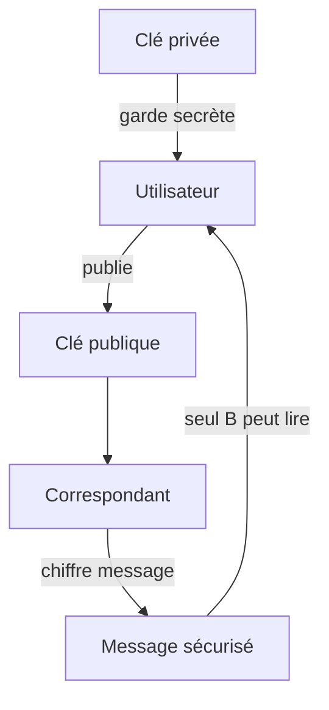
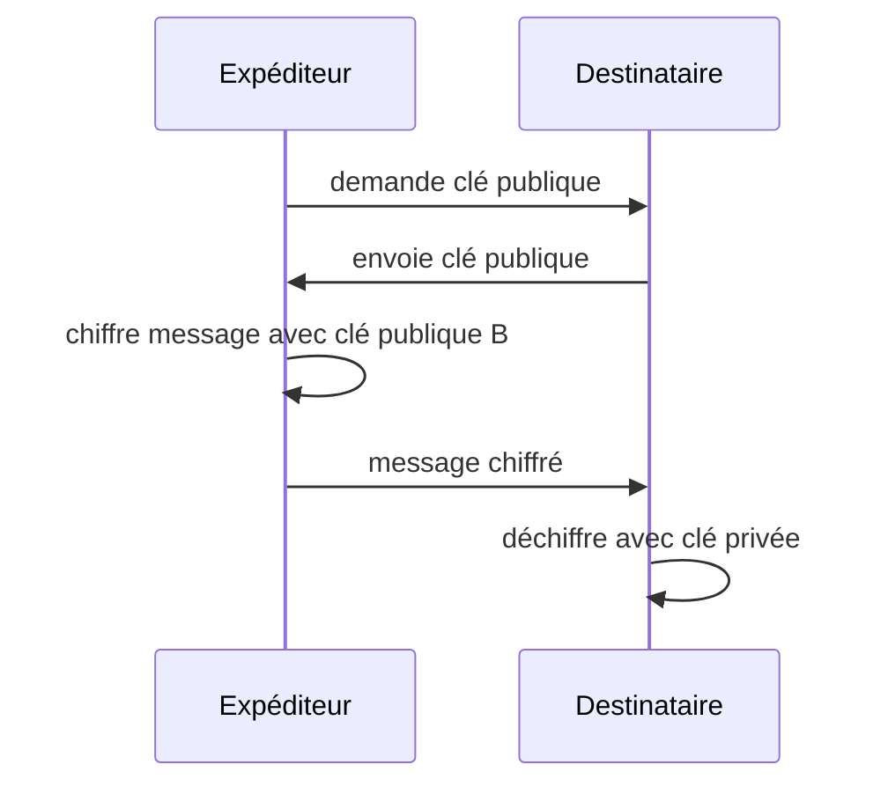

# GPG — GNU Privacy Guard

<div
  class="omny-meta"
  data-level="🟢 Débutant à 🔴 Avancé"
  data-version="1.0"
  data-time="45-60 minutes">
</div>

## Introduction

!!! quote "Analogie pédagogique"
    _Imaginez envoyer une lettre dans un coffre verrouillé. Tout le monde peut voir le coffre, mais seul le destinataire possède la clé pour l’ouvrir. Et s’il reçoit une lettre signée avec votre sceau personnel, il sait qu’elle vient bien de vous. GPG fait exactement cela — mais pour les données numériques._

**GPG (GNU Privacy Guard)** est l’implémentation libre du standard **OpenPGP**.  
Il permet de :

- chiffrer des fichiers
- signer des données
- vérifier l’identité d’un expéditeur
- garantir l’intégrité d’un contenu

C’est un outil central en cybersécurité, utilisé notamment pour :

- signatures de packages logiciels
- vérification d’ISO Linux
- échanges sécurisés
- authentification technique
- supply-chain security

---

## Objectifs pédagogiques

À la fin de ce guide, vous serez capable de :

- comprendre le fonctionnement du chiffrement asymétrique
- générer et gérer une paire de clés
- chiffrer et déchiffrer des fichiers
- signer et vérifier des données
- publier une clé publique
- diagnostiquer des erreurs GPG

---

## Architecture de fonctionnement


---

## Principe cryptographique utilisé

GPG repose sur la **cryptographie asymétrique**, utilisant une paire de clés :

| Clé          | Rôle                          | Partage |
| ------------ | ----------------------------- | ------- |
| Clé publique | chiffrer / vérifier signature | oui     |
| Clé privée   | déchiffrer / signer           | jamais  |



---

## Installation

### Linux

```bash
sudo apt install gnupg
sudo dnf install gnupg
sudo pacman -S gnupg
sudo apk add gnupg
```

### Vérification

```bash
gpg --version
```

---

## Générer une paire de clés

```bash
gpg --full-generate-key
```

Étapes :

1. choisir type de clé (RSA recommandé)
2. taille (4096 conseillé)
3. durée validité
4. nom / email
5. passphrase

Lister les clés :

```bash
gpg --list-keys
```

Lister les clés privées :

```bash
gpg --list-secret-keys
```

---

## Exporter sa clé publique

```bash
gpg --armor --export email@domain.com
```

---

## Importer une clé publique

```bash
gpg --import cle.pub
```

---

## Chiffrer un fichier

```bash
gpg -e -r destinataire@email fichier.txt
```

Sortie :

```
fichier.txt.gpg
```

---

## Déchiffrer

```bash
gpg -d fichier.txt.gpg
```

---

## Signer un fichier

Signature simple :

```bash
gpg --sign fichier.txt
```

Signature détachée :

```bash
gpg --detach-sign fichier.txt
```

---

## Vérifier une signature

```bash
gpg --verify fichier.txt.sig fichier.txt
```

---

## Cycle complet d’un échange sécurisé



---

## Concepts avancés importants

### Trust model

GPG n’utilise pas une autorité centrale comme TLS.
Il repose sur un modèle appelé :

> **Web of Trust**

Cela signifie que la confiance est distribuée entre utilisateurs.

---

### Fingerprint

Identifiant unique d’une clé :

```bash
gpg --fingerprint
```

Toujours vérifier un fingerprint avant de faire confiance à une clé.

---

### Révocation de clé

Créer un certificat de révocation :

```bash
gpg --gen-revoke email@domain.com
```

À conserver hors ligne.

---

## Structure interne du stockage GPG

Répertoire :

```
~/.gnupg/
```

Contient :

| Fichier           | Rôle              |
| ----------------- | ----------------- |
| pubring.kbx       | clés publiques    |
| private-keys-v1.d | clés privées      |
| trustdb.gpg       | base de confiance |

Ne jamais exposer ce dossier.

---

## Erreurs fréquentes

!!! warning "Pièges classiques"
- publier sa clé privée
- oublier la passphrase
- faire confiance à une clé non vérifiée
- confondre signature et chiffrement
- ne pas sauvegarder la clé

---

## Cas réels d’utilisation

| Cas                 | Usage                 |
| ------------------- | --------------------- |
| Signer un ISO Linux | garantir authenticité |
| Publier un package  | vérifier intégrité    |
| Envoyer secrets     | confidentialité       |
| Audit sécurité      | preuve d’identité     |

---

## Bonnes pratiques professionnelles

* sauvegarder la clé privée hors ligne
* utiliser une passphrase forte
* utiliser expiration de clé
* faire rotation régulière
* vérifier fingerprint vocalement
* séparer clés perso / pro

---

## Positionnement compétence

Maîtriser GPG signifie que vous comprenez :

* chiffrement asymétrique réel
* signatures numériques
* distribution de confiance
* identité cryptographique

C’est un niveau attendu pour :

* DevSecOps
* ingénieur sécurité
* administrateur système
* pentester

---

## Tableau récapitulatif commandes essentielles

| Action       | Commande                  |
| ------------ | ------------------------- |
| Générer clé  | `gpg --full-generate-key` |
| Lister clés  | `gpg --list-keys`         |
| Exporter clé | `gpg --export`            |
| Importer clé | `gpg --import`            |
| Chiffrer     | `gpg -e -r`               |
| Déchiffrer   | `gpg -d`                  |
| Signer       | `gpg --sign`              |
| Vérifier     | `gpg --verify`            |

---

## Le mot de la fin

!!! quote
    Comprendre GPG, c’est comprendre la cryptographie appliquée. Ce n’est pas seulement un outil, c’est un modèle mental de sécurité. Une fois maîtrisé, vous voyez immédiatement quand un système de confiance est solide… ou fragile.

<br />