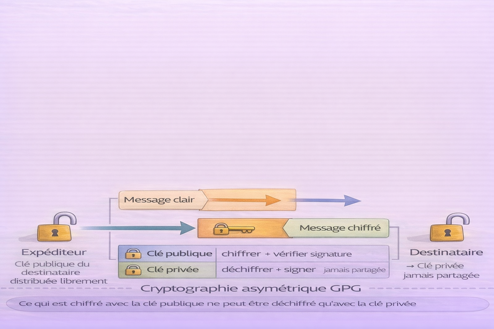
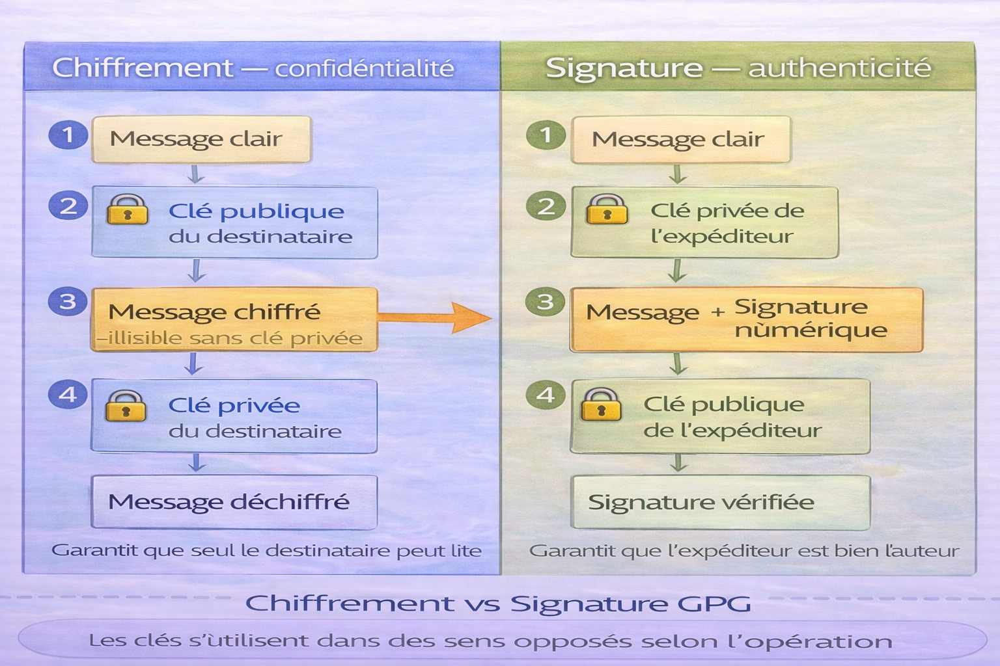
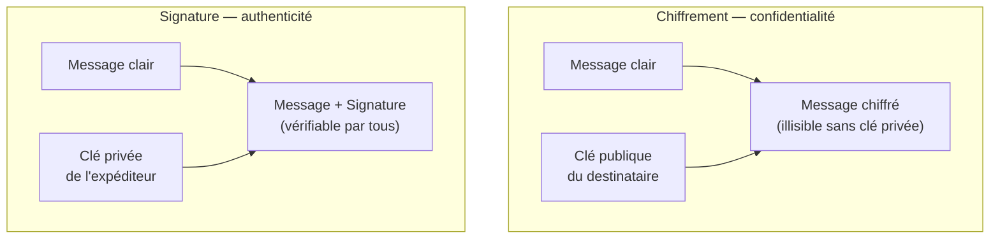
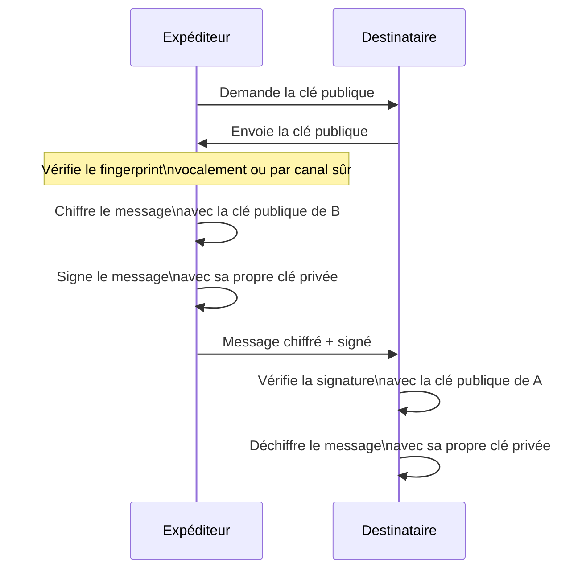
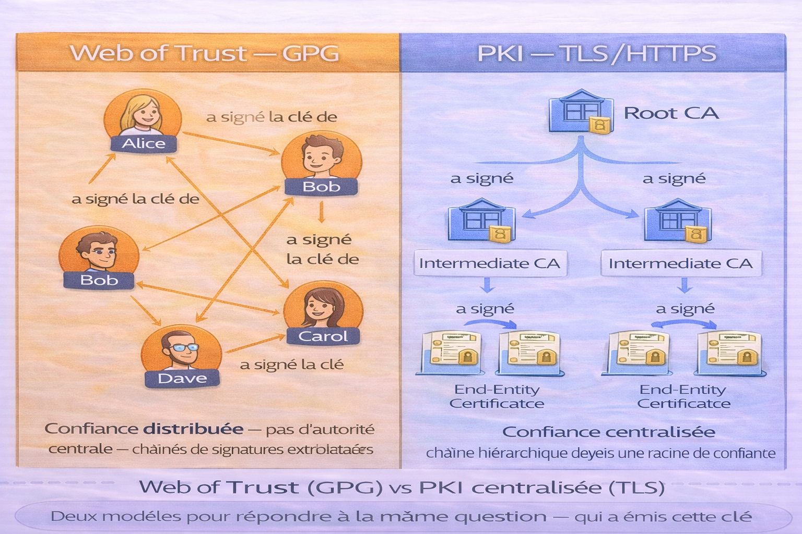

# GPG — GNU Privacy Guard

<div
  class="omny-meta"
  data-level="🟢 Débutant à 🔴 Avancé"
  data-version="1.0"
  data-time="45-60 minutes">
</div>

!!! quote "Analogie"
    _Envoyer une lettre dans un coffre verrouillé. Tout le monde peut voir le coffre, mais seul le destinataire possède la clé pour l'ouvrir. Et s'il reçoit une lettre signée avec votre sceau personnel, il sait qu'elle vient bien de vous. GPG fait exactement cela — mais pour les données numériques._

**GPG (GNU Privacy Guard)** est l'implémentation libre du standard **OpenPGP** (RFC 4880). Il permet de chiffrer des fichiers, signer des données, vérifier l'identité d'un expéditeur et garantir l'intégrité d'un contenu — sans dépendre d'une autorité centrale.

C'est un outil fondamental en cybersécurité : signatures de packages logiciels, vérification d'ISO Linux, échanges sécurisés, authentification technique et supply-chain security. À la fin de ce document, vous serez capable de générer et gérer une paire de clés, chiffrer et déchiffrer des fichiers, signer et vérifier des données, et comprendre le modèle de confiance distribué sur lequel GPG repose.

!!! info "Pourquoi c'est important"
    GPG est le standard de facto pour garantir l'authenticité et la confidentialité hors infrastructure PKI. Les dépôts Linux (APT, DNF, Pacman) utilisent GPG pour signer leurs packages. Git permet de signer les commits et les tags GPG. Comprendre GPG, c'est comprendre la cryptographie asymétrique appliquée à des cas réels.

<br />

---

## Principe cryptographique

!!! note "L'image ci-dessous présente le fonctionnement de la cryptographie asymétrique — le socle sur lequel GPG repose entièrement. La distinction entre clé publique et clé privée est la notion centrale à maîtriser avant toute manipulation."



<p><em>GPG repose sur une paire de clés mathématiquement liées. La clé publique peut être distribuée librement — n'importe qui peut l'utiliser pour chiffrer un message à votre attention ou vérifier votre signature. La clé privée ne quitte jamais votre possession — elle est la seule capable de déchiffrer un message chiffré avec votre clé publique, ou de produire une signature que votre clé publique peut valider. Ce qui est chiffré avec l'une ne peut être déchiffré qu'avec l'autre.</em></p>

| Clé | Rôle | À partager |
|---|---|:---:|
| Clé publique | Chiffrer un message / vérifier une signature | Oui — librement |
| Clé privée | Déchiffrer un message / produire une signature | Jamais |


```mermaid
flowchart LR
    A["Message clair"]
    B["Chiffrement\navec clé publique du destinataire"]
    C["Message chiffré"]
    D["Déchiffrement\navec clé privée du destinataire"]
    E["Message lisible"]

    A --> B --> C --> D --> E
```

<br />

---

## Chiffrement vs signature

!!! note "L'image ci-dessous distingue les deux usages fondamentaux de GPG — chiffrer pour la confidentialité, signer pour l'authenticité. Ces deux opérations utilisent les clés dans des sens opposés."



<p><em>Le chiffrement garantit la confidentialité — seul le destinataire peut lire le message. On chiffre avec la clé publique du destinataire. Le déchiffrement se fait avec sa clé privée. La signature garantit l'authenticité et l'intégrité — le destinataire sait que le message vient bien de vous et n'a pas été modifié. On signe avec sa propre clé privée. La vérification se fait avec la clé publique de l'expéditeur. Les deux opérations peuvent être combinées : chiffrer et signer simultanément.</em></p>


```mermaid
flowchart TD
    subgraph "Chiffrement — confidentialité"
        A1["Message clair"]
        B1["Clé publique\ndu destinataire"]
        C1["Message chiffré\n(illisible sans clé privée)"]
        A1 --> C1
        B1 --> C1
    end

    subgraph "Signature — authenticité"
        A2["Message clair"]
        B2["Clé privée\nde l'expéditeur"]
        C2["Message + Signature\n(vérifiable par tous)"]
        A2 --> C2
        B2 --> C2
    end
```

<br />

---

## Installation

```bash title="Bash — installation GPG selon la distribution"
# Debian / Ubuntu
sudo apt install gnupg

# RHEL / Fedora
sudo dnf install gnupg

# Arch Linux
sudo pacman -S gnupg

# Alpine Linux
sudo apk add gnupg
```

```bash title="Bash — vérification de l'installation"
gpg --version
```

<br />

---

## Générer une paire de clés

La génération produit une paire de clés liée — une clé publique distribuable et une clé privée protégée par une passphrase.

```bash title="Bash — génération interactive d'une paire de clés"
gpg --full-generate-key
```

GPG demande successivement : le type de clé (RSA recommandé), la taille (4096 bits conseillée), la durée de validité, le nom et l'email associés, et une passphrase de protection de la clé privée.

```bash title="Bash — lister les clés du trousseau"
# Lister les clés publiques
gpg --list-keys

# Lister les clés privées
gpg --list-secret-keys

# Afficher le fingerprint de toutes les clés
gpg --fingerprint
```

!!! warning "Passphrase et sauvegarde"
    La passphrase protège la clé privée au repos. Si elle est perdue, la clé privée est inutilisable — il n'y a aucun mécanisme de récupération. Exporter et sauvegarder la clé privée hors ligne immédiatement après la génération.

<br />

---

## Gestion des clés

### Exporter une clé publique

```bash title="Bash — export de la clé publique en format ASCII"
# Export en format ASCII armor — partage par email ou serveur de clés
gpg --armor --export email@domain.com

# Export dans un fichier
gpg --armor --export email@domain.com > ma-cle-publique.asc
```

### Importer une clé publique

```bash title="Bash — import d'une clé publique reçue"
# Importer depuis un fichier
gpg --import cle.pub

# Importer depuis un serveur de clés
gpg --keyserver keys.openpgp.org --recv-keys FINGERPRINT
```

### Exporter la clé privée (sauvegarde)

```bash title="Bash — sauvegarde de la clé privée — à conserver hors ligne"
# Export chiffré de la clé privée — protégé par la passphrase
gpg --armor --export-secret-keys email@domain.com > cle-privee-backup.asc
```

!!! danger "Clé privée"
    Ne jamais transmettre la clé privée. Ne jamais la publier sur un serveur de clés. Ne jamais la stocker dans un dépôt Git. L'accès à la clé privée équivaut à l'usurpation d'identité cryptographique complète.

<br />

---

## Chiffrer et déchiffrer

### Chiffrer un fichier

```bash title="Bash — chiffrement d'un fichier pour un destinataire"
# Chiffrer pour un destinataire — produit fichier.txt.gpg
gpg -e -r destinataire@email.com fichier.txt

# Chiffrer en ASCII armor — utile pour les emails
gpg --armor -e -r destinataire@email.com fichier.txt

# Chiffrer pour plusieurs destinataires
gpg -e -r alice@email.com -r bob@email.com fichier.txt
```

### Déchiffrer un fichier

```bash title="Bash — déchiffrement d'un fichier reçu"
# Déchiffrement — GPG détecte automatiquement la clé privée à utiliser
gpg -d fichier.txt.gpg

# Déchiffrement vers un fichier de sortie explicite
gpg -o fichier-dechiffre.txt -d fichier.txt.gpg
```

<br />

---

## Signer et vérifier

### Signer un fichier

```bash title="Bash — trois modes de signature GPG"
# Signature embarquée — produit un fichier .gpg contenant message + signature
gpg --sign fichier.txt

# Signature détachée — produit fichier.txt.sig séparé du message original
# Recommandé pour les packages et ISOs — le fichier original reste intact
gpg --detach-sign fichier.txt

# Signature en clair — message lisible avec signature en ASCII
gpg --clearsign fichier.txt
```

### Vérifier une signature

```bash title="Bash — vérification de signature"
# Vérifier une signature détachée
gpg --verify fichier.txt.sig fichier.txt

# Vérifier et extraire le contenu d'un fichier signé
gpg --verify fichier.txt.gpg
```

<br />

---

## Cycle complet d'un échange sécurisé


```mermaid
sequenceDiagram
    participant A as Expéditeur
    participant B as Destinataire

    A->>B: Demande la clé publique
    B->>A: Envoie la clé publique
    Note over A: Vérifie le fingerprint\nvocalement ou par canal sûr
    A->>A: Chiffre le message\navec la clé publique de B
    A->>A: Signe le message\navec sa propre clé privée
    A->>B: Message chiffré + signé
    B->>B: Vérifie la signature\navec la clé publique de A
    B->>B: Déchiffre le message\navec sa propre clé privée
```

La vérification du fingerprint avant l'échange est l'étape que la majorité des utilisateurs sautent — c'est précisément là qu'une attaque de type Man-in-the-Middle substitue une clé publique piégée.

<br />

---

## Concepts avancés

### Fingerprint

Le fingerprint est l'empreinte cryptographique unique d'une clé — une chaîne hexadécimale de 40 caractères. C'est l'identifiant à vérifier avant de faire confiance à une clé importée.

```bash title="Bash — afficher le fingerprint d'une clé"
gpg --fingerprint email@domain.com
```

Toujours vérifier un fingerprint par un canal indépendant — téléphone, rencontre physique, ou page HTTPS de l'organisation.

### Web of Trust

!!! note "L'image ci-dessous compare le modèle de confiance distribué de GPG (Web of Trust) et le modèle centralisé PKI utilisé par TLS. Les deux modèles répondent à la même question — comment vérifier qu'une clé publique appartient bien à la personne revendiquée — mais avec des architectures opposées."



<p><em>Dans le Web of Trust, il n'y a pas d'autorité centrale. La confiance se propage par chaînes de signatures entre utilisateurs — Alice fait confiance à Bob qui fait confiance à Carol, donc Alice peut accorder une confiance partielle à Carol. C'est un modèle décentralisé adapté aux échanges entre individus ou communautés techniques. PKI centralise la confiance sur des autorités de certification (CA) hiérarchiques — c'est le modèle utilisé par HTTPS et les certificats X.509 traités dans les chapitres OpenSSL et PKI.</em></p>

GPG ne repose pas sur une autorité centrale contrairement à TLS. La confiance est distribuée entre utilisateurs via des signatures mutuelles de clés. Signer la clé de quelqu'un signifie : "j'ai vérifié que cette clé appartient bien à cette personne".

```bash title="Bash — signer la clé d'un tiers pour le Web of Trust"
# Signer la clé d'un correspondant après vérification du fingerprint
gpg --sign-key email@correspondant.com

# Attribuer un niveau de confiance à un propriétaire de clé
gpg --edit-key email@correspondant.com trust
```

### Révocation de clé

La révocation informe le réseau qu'une clé ne doit plus être utilisée — clé compromise, perdue, ou expirée.

```bash title="Bash — générer et appliquer un certificat de révocation"
# Générer le certificat de révocation immédiatement après la création de la clé
gpg --gen-revoke email@domain.com > revocation.asc

# Appliquer une révocation
gpg --import revocation.asc

# Publier la révocation sur un serveur de clés
gpg --keyserver keys.openpgp.org --send-keys FINGERPRINT
```

Le certificat de révocation doit être généré à la création de la clé et conservé hors ligne. Si la clé privée est compromise sans certificat de révocation disponible, il n'existe aucun moyen d'informer les correspondants.

<br />

---

## Structure du trousseau GPG

```plaintext title="Plaintext — structure du répertoire GPG"
~/.gnupg/
├── pubring.kbx          # Trousseau des clés publiques
├── private-keys-v1.d/   # Clés privées (une par fichier, chiffrée)
├── trustdb.gpg          # Base de données de confiance
├── gpg.conf             # Configuration GPG
└── gpg-agent.conf       # Configuration de l'agent GPG
```

Le répertoire `~/.gnupg/` ne doit jamais être exposé, sauvegardé dans un dépôt Git, ou transmis. Les permissions doivent être restrictives : `700` sur le répertoire, `600` sur les fichiers.

```bash title="Bash — vérification et correction des permissions GPG"
# Vérifier les permissions
ls -la ~/.gnupg/

# Corriger les permissions si nécessaire
chmod 700 ~/.gnupg
chmod 600 ~/.gnupg/*
```

<br />

---

## Erreurs fréquentes

!!! warning "Pièges classiques"
    Publier sa clé privée au lieu de la clé publique est l'erreur la plus grave — elle compromet définitivement l'identité cryptographique et impose de révoquer et régénérer une nouvelle paire. Oublier la passphrase rend la clé privée inutilisable sans recours. Faire confiance à une clé importée sans vérifier son fingerprint expose à une substitution de clé. Confondre signature et chiffrement conduit à envoyer un message signé mais lisible par tous. Ne pas générer de certificat de révocation à la création empêche toute révocation future en cas de compromission.

<br />

---

## Cas d'usage réels

| Cas | Usage GPG |
|---|---|
| Signer un ISO Linux | Garantir l'authenticité d'une image de distribution |
| Publier un package | Permettre aux gestionnaires de paquets de vérifier l'intégrité |
| Signer des commits Git | `git config --global commit.gpgsign true` |
| Échange de secrets | Chiffrer un fichier de credentials avant transmission |
| Audit de sécurité | Preuve d'identité sur un document ou un rapport |

<br />

---

## Référentiel des commandes

| Action | Commande |
|---|---|
| Générer une paire de clés | `gpg --full-generate-key` |
| Lister les clés publiques | `gpg --list-keys` |
| Lister les clés privées | `gpg --list-secret-keys` |
| Afficher le fingerprint | `gpg --fingerprint` |
| Exporter la clé publique | `gpg --armor --export email@domain.com` |
| Importer une clé | `gpg --import cle.pub` |
| Chiffrer un fichier | `gpg -e -r destinataire@email.com fichier.txt` |
| Déchiffrer un fichier | `gpg -d fichier.txt.gpg` |
| Signer (embarqué) | `gpg --sign fichier.txt` |
| Signer (détaché) | `gpg --detach-sign fichier.txt` |
| Vérifier une signature | `gpg --verify fichier.txt.sig fichier.txt` |
| Générer révocation | `gpg --gen-revoke email@domain.com` |

<br />

---

## Bonnes pratiques

Sauvegarder la clé privée hors ligne sur un support chiffré immédiatement après la génération. Utiliser une passphrase longue et unique — pas un mot du dictionnaire. Configurer une date d'expiration sur les clés — cela force la rotation et limite l'impact d'une compromission silencieuse. Générer le certificat de révocation dès la création de la clé et le stocker séparément. Vérifier les fingerprints vocalement ou par canal sûr avant tout échange. Séparer les clés personnelles et professionnelles. Ne jamais utiliser la même paire de clés pour des contextes de confiance différents.

<br />

---

## Conclusion

!!! quote "Conclusion"
    _GPG n'est pas seulement un outil — c'est un modèle mental de sécurité. Comprendre comment la cryptographie asymétrique sépare ce qui est public de ce qui est privé, comment la signature prouve l'authenticité sans révéler le secret, et comment la confiance peut se distribuer sans autorité centrale — c'est comprendre les fondations sur lesquelles reposent HTTPS, les dépôts de packages, les signatures de commits et l'ensemble de l'infrastructure de confiance numérique moderne. Une fois ce modèle assimilé, il devient immédiatement visible quand un système de confiance est solide ou structurellement fragile._

<br />