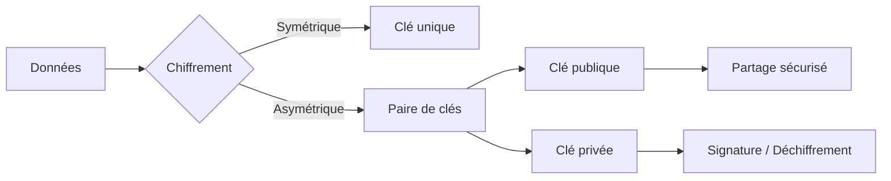
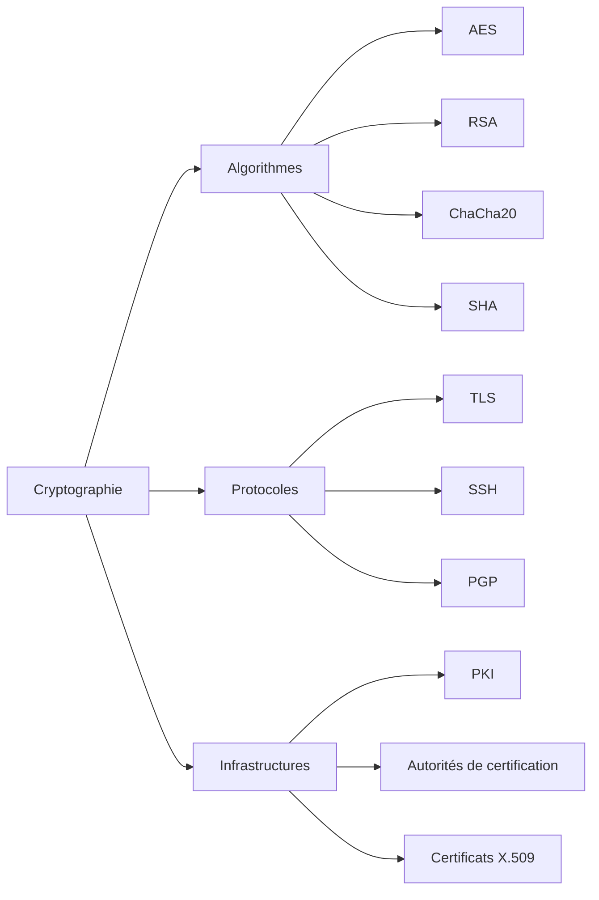
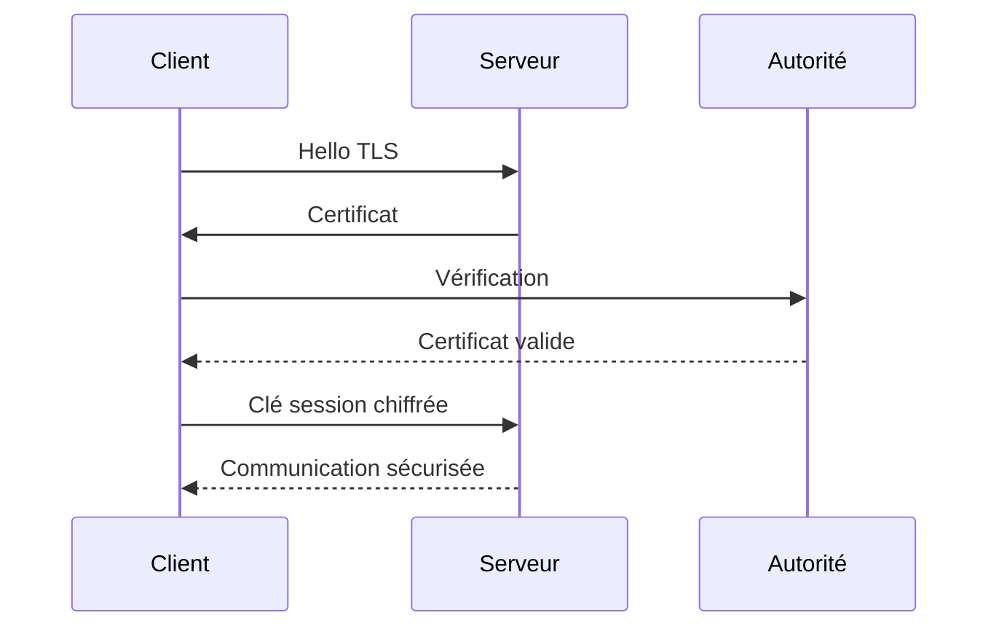

# Cryptographie & PKI

## Introduction

!!! quote "Analogie pédagogique"
    _La cryptographie est au numérique ce que les serrures, coffres-forts et signatures notariales sont au monde physique. Elle protège les messages, vérifie l'identité des interlocuteurs et garantit qu'aucune modification n’a été faite en route._

La **cryptographie moderne** constitue la base de toute sécurité informatique : HTTPS, VPN, authentification, signatures numériques, blockchain, stockage sécurisé, e-mails chiffrés…  
Sans elle, Internet tel que nous le connaissons serait inutilisable.

Ce chapitre sert de **porte d’entrée structurée** pour comprendre :

- comment fonctionne le chiffrement
- comment les identités numériques sont vérifiées
- comment les certificats sont délivrés
- comment les systèmes font confiance aux autorités

---

## Objectif du parcours

À la fin de cette section, vous saurez :

- différencier chiffrement symétrique et asymétrique  
- comprendre le rôle d’une PKI  
- expliquer comment HTTPS fonctionne réellement  
- manipuler OpenSSL et GPG  
- diagnostiquer un problème TLS ou certificat  

---

## Architecture conceptuelle de la cryptographie

---

## Les trois piliers fondamentaux

Toute la sécurité cryptographique repose sur trois objectifs :

| Pilier          | Rôle                  | Exemple        |
| --------------- | --------------------- | -------------- |
| Confidentialité | Empêcher la lecture   | HTTPS          |
| Intégrité       | Empêcher modification | Hash SHA-256   |
| Authenticité    | Vérifier l’identité   | Certificat TLS |

Ces trois propriétés forment la base de tous les protocoles sécurisés.

---

## Les briques technologiques principales

---

## Navigation des guides

* :lucide-key:{ .lg .middle } **OpenSSL**

    ---

    Outil universel de cryptographie : génération de clés, certificats, CSR, debug TLS, inspection HTTPS.

    [:lucide-book-open-check: Ouvrir le guide](./openssl.md)

* :lucide-mail:{ .lg .middle } **GPG — chiffrement & signatures**

    ---

    Chiffrement asymétrique pour fichiers, e-mails, signatures, vérification d’intégrité logicielle.

    [:lucide-book-open-check: Ouvrir le guide](./gpg.md)

* :lucide-shield-check:{ .lg .middle } **PKI — Infrastructure de confiance**

    ---

    Autorités de certification, chaînes de confiance, révocation, hiérarchies, architecture enterprise.

    [:lucide-book-open-check: Ouvrir le guide](./pki.md)

---

## Modèle réel : comment HTTPS fonctionne

Ce mécanisme combine :

* chiffrement asymétrique (authentification)
* chiffrement symétrique (performance)
* PKI (confiance globale)

---

## Ordre recommandé d’apprentissage

Pour éviter toute confusion conceptuelle, suivez cet ordre :

1. OpenSSL → comprendre les primitives cryptographiques
2. GPG → comprendre chiffrement asymétrique concret
3. PKI → comprendre la confiance globale

---

## Erreurs fréquentes des débutants

!!! warning "Pièges classiques"
- Confondre chiffrement et encodage
- Penser que HTTPS = chiffrement seulement
- Croire que la clé publique doit être secrète
- Penser qu’un certificat auto-signé est “moins sécurisé”
- Croire qu’un hash chiffre des données

---

## Positionnement professionnel

Maîtriser cette section permet de :

* débugger TLS en production
* comprendre un audit sécurité
* configurer un serveur sécurisé
* valider une chaîne de confiance
* expliquer clairement la sécurité à un client ou un RSSI

---

## Le mot de la fin

!!! quote
    La cryptographie n’est pas une option technique. C’est la **fondation invisible** de toute sécurité numérique. Ceux qui la comprennent contrôlent la sécurité. Ceux qui ne la comprennent pas la subissent.

 