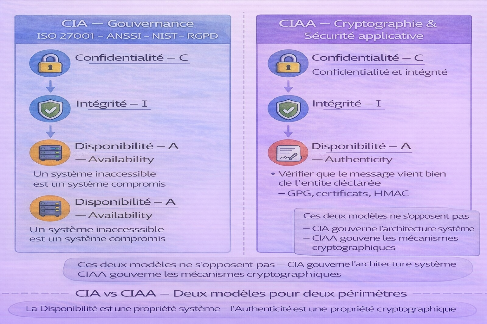
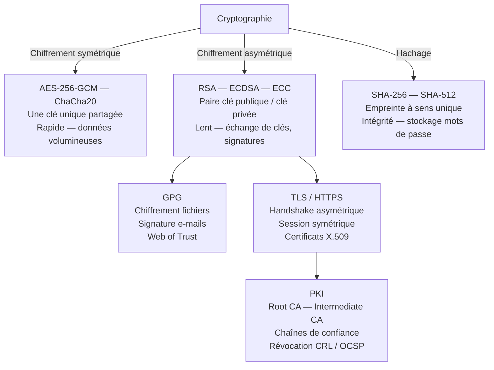
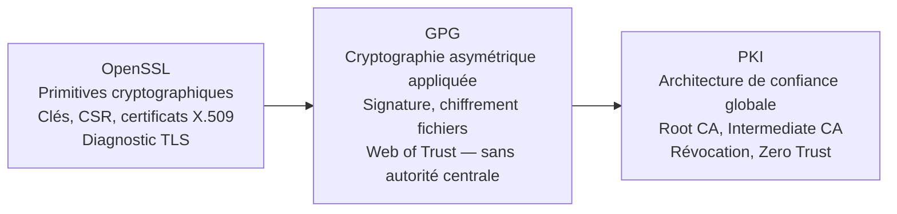

# Cryptographie & PKI

!!! quote "Analogie"
    _La cryptographie est au numérique ce que les serrures, coffres-forts et signatures notariales sont au monde physique. Elle protège les messages, vérifie l'identité des interlocuteurs et garantit qu'aucune modification n'a été apportée en transit._

La **cryptographie moderne** est le socle de toute sécurité informatique. HTTPS, VPN, authentification, signatures numériques, stockage sécurisé, e-mails chiffrés — aucun de ces mécanismes n'existe sans elle. Ce chapitre couvre trois outils et architectures complémentaires qui constituent la base opérationnelle de tout professionnel de la sécurité.

Cette section couvre trois périmètres distincts et progressifs : les primitives cryptographiques avec OpenSSL, le modèle de confiance décentralisé avec GPG, et l'architecture de confiance globale avec les PKI.

 

---

## Les trois piliers cryptographiques

Toute sécurité cryptographique repose sur trois propriétés fondamentales. Un système qui ne garantit pas les trois est considéré comme insuffisant.

| Propriété | Rôle | Mécanisme |
|:---:|---|---|
| Confidentialité <small>Confidentiality</small> | Empêcher la lecture par un tiers non autorisé | Chiffrement symétrique (AES) ou asymétrique (RSA, ECC) |
| Intégrité <small>Integrity</small> | Garantir qu'aucune modification n'a été apportée | Hachage (SHA-256, SHA-512), HMAC |
| Authenticité <small>Authenticity</small> | Vérifier l'identité de l'émetteur ou du serveur | Signature numérique, certificat X.509, GPG |

!!! quote "Note"
    Sans entrer dans les détails, en cybersécurité et plus particulièrement en gouvernance, ces trois piliers sont connus sous le triptique **CIA** — **C**onfidentiality, **I**ntegrity, **A**vailability — soit en français **Confidentialité, Intégrité, Disponibilité**. Vous le retrouverez dans les référentiels ISO 27001, ANSSI, NIST et RGPD. La **Disponibilité** (Availability) remplace ici l'Authenticité — cette dernière est généralement traitée comme une propriété dérivée de l'Intégrité dans les modèles de gouvernance, ou ajoutée comme quatrième pilier (modèle CIAA) dans les contextes applicatifs.

<em>Le modèle CIA (gouvernance) pose la Disponibilité comme pilier fondamental — un système inaccessible est un système compromis, quelle que soit la solidité de sa cryptographie. Le modèle CIAA (sécurité applicative et cryptographie) ajoute l'Authenticité comme quatrième pilier — la capacité à vérifier qu'un message provient bien de l'entité déclarée. Ces deux modèles ne s'opposent pas : CIA s'applique à l'architecture système, CIAA s'applique aux mécanismes cryptographiques.</em>

 

---

## Architecture conceptuelle

```mermaid
flowchart TB
    Crypto["Cryptographie"]

    Crypto -->|Chiffrement symétrique| Sym["AES-256-GCM — ChaCha20<br />Une clé unique partagée<br />Rapide — données volumineuses"]
    Crypto -->|Chiffrement asymétrique| Asym["RSA — ECDSA — ECC<br />Paire clé publique / clé privée<br />Lent — échange de clés, signatures"]
    Crypto -->|Hachage| Hash["SHA-256 — SHA-512<br />Empreinte à sens unique<br />Intégrité — stockage mots de passe"]

    Asym --> GPG["GPG<br />Chiffrement fichiers<br />Signature e-mails<br />Web of Trust"]
    Asym --> TLS["TLS / HTTPS<br />Handshake asymétrique<br />Session symétrique<br />Certificats X.509"]
    TLS --> PKI["PKI<br />Root CA — Intermediate CA<br />Chaînes de confiance<br />Révocation CRL / OCSP"]
```

 

---

## Ordre d'apprentissage recommandé

La progression ci-dessous respecte les dépendances conceptuelles — chaque étape s'appuie sur la précédente.

```mermaid
flowchart LR
    O["OpenSSL<br />Primitives cryptographiques<br />Clés, CSR, certificats X.509<br />Diagnostic TLS"]
    G["GPG<br />Cryptographie asymétrique appliquée<br />Signature, chiffrement fichiers<br />Web of Trust — sans autorité centrale"]
    P["PKI<br />Architecture de confiance globale<br />Root CA, Intermediate CA<br />Révocation, Zero Trust"]

    O --> G --> P
```

OpenSSL est le point d'entrée — il rend visibles les objets cryptographiques (clés, CSR, certificats) et permet de diagnostiquer TLS directement en CLI. GPG applique la cryptographie asymétrique sans infrastructure centralisée — un modèle de confiance alternatif aux PKI. La PKI est l'architecture qui gouverne HTTPS, les VPN, la signature logicielle et l'authentification d'entreprise à l'échelle.

 

---

## Guides disponibles

-   :lucide-key:{ .lg .middle } **OpenSSL — Cryptographie appliquée**

    ---

    **Niveau** : 🟡 Intermédiaire

    Génération de clés RSA et ECC, création de CSR, certificats X.509, inspection de connexions TLS, conversion de formats PEM/DER/PKCS. L'outil de référence pour comprendre et diagnostiquer la cryptographie en pratique.

    [:octicons-arrow-right-24: Ouvrir le guide](./openssl.md)

-   :lucide-mail-check:{ .lg .middle } **GPG — Chiffrement & Signatures**

    ---

    **Niveau** : 🟡 Intermédiaire

    Cryptographie asymétrique pour fichiers et e-mails, signature numérique, vérification d'intégrité, Web of Trust. Le modèle de confiance distribué sans autorité centrale.

    [:octicons-arrow-right-24: Ouvrir le guide](./gpg.md)

-   :lucide-shield-check:{ .lg .middle } **PKI — Infrastructure de confiance**

    ---

    **Niveau** : 🔴 Expert

    Autorités de certification, chaînes de confiance, Root CA hors ligne, Intermediate CA, révocation CRL/OCSP, implémentation PKI interne avec OpenSSL, architecture Zero Trust.

    [:octicons-arrow-right-24: Ouvrir le guide](./pki.md)

 

---

## Erreurs fréquentes

!!! warning "Confusions classiques à éviter"
    Confondre chiffrement et encodage (Base64 n'est pas du chiffrement — c'est une représentation). Croire que HTTPS garantit uniquement la confidentialité — il garantit aussi l'authenticité du serveur et l'intégrité des données. Penser que la clé publique doit rester secrète — c'est précisément l'inverse, elle se distribue librement. Assimiler un certificat auto-signé à un certificat "moins sécurisé" — la sécurité cryptographique est identique, c'est la chaîne de confiance qui diffère. Confondre hachage et chiffrement — un hash ne peut pas être inversé, il n'y a pas de clé de déchiffrement.

 

---

## Conclusion

!!! quote "Conclusion"
    _La cryptographie n'est pas une option technique — c'est la fondation invisible de toute sécurité numérique. Comprendre comment les clés sont générées, comment les certificats sont émis et vérifiés, et comment la confiance est propagée dans une PKI, c'est comprendre pourquoi HTTPS fonctionne, pourquoi un certificat expiré coupe un service, et comment un attaquant peut exploiter une PKI mal conçue. Ces trois guides constituent la base opérationnelle minimale pour tout professionnel de la cybersécurité._

 