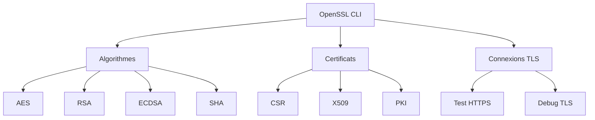
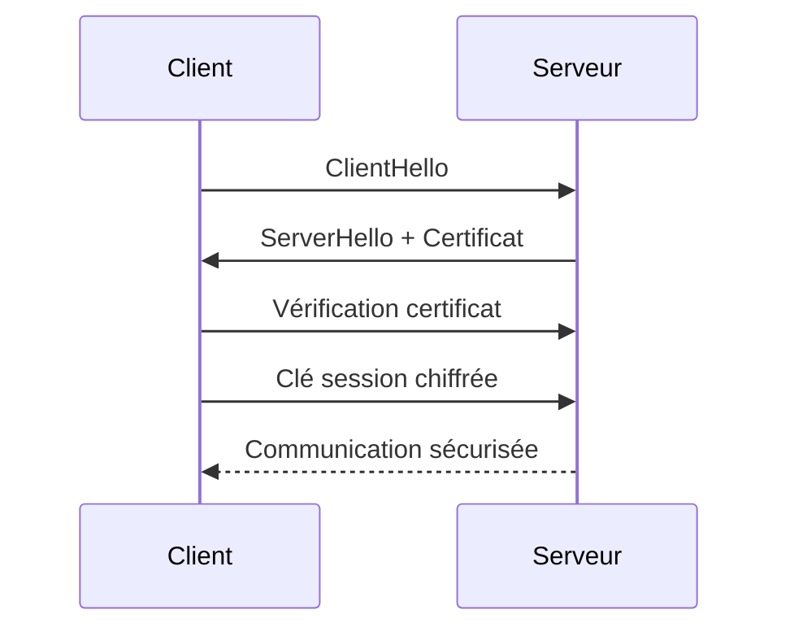
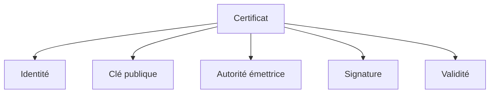

# OpenSSL

<div
  class="omny-meta"
  data-level="🟢 Débutant à 🔴 Avancé"
  data-version="1.0"
  data-time="60-90 minutes">
</div>

## Introduction à la Boîte à outils cryptographique

!!! quote "Analogie pédagogique"
    _Si la cryptographie est une science, OpenSSL est le laboratoire. C’est l’outil avec lequel on fabrique des clés, on forge des certificats, on teste des connexions sécurisées et on analyse les échanges chiffrés._

**OpenSSL** est une bibliothèque + un outil CLI permettant de manipuler directement les primitives cryptographiques utilisées partout :

- HTTPS  
- VPN  
- SSH  
- signatures logicielles  
- certificats X.509  
- PKI internes  

C’est l’outil universel des administrateurs systèmes, ingénieurs sécurité, DevOps et pentesters.

---

## Objectifs pédagogiques

À la fin de ce guide vous serez capable de :

- générer clés privées et publiques
- créer des certificats
- produire des CSR
- inspecter un certificat
- tester une connexion TLS
- comprendre un handshake
- diagnostiquer un problème SSL

---

## Architecture logique d’OpenSSL



---

## Installation

### Linux

```bash
sudo apt install openssl
sudo dnf install openssl
sudo pacman -S openssl
sudo apk add openssl
```

Vérifier :

```bash
openssl version
```

---

## Concepts fondamentaux à comprendre

Avant d’utiliser OpenSSL, il faut comprendre 4 objets :

| Objet        | Rôle                  |
| ------------ | --------------------- |
| Clé privée   | identité secrète      |
| Clé publique | identité partageable  |
| CSR          | demande de certificat |
| Certificat   | identité validée      |

---

## Générer une clé privée

```bash
openssl genpkey -algorithm RSA -out private.key -pkeyopt rsa_keygen_bits:4096
```

---

## Extraire la clé publique

```bash
openssl rsa -pubout -in private.key -out public.key
```

---

## Générer une CSR (Certificate Signing Request)

```bash
openssl req -new -key private.key -out request.csr
```

Une CSR contient :

* nom domaine
* organisation
* clé publique
* signature

---

## Générer un certificat auto-signé

```bash
openssl req -x509 -key private.key -in request.csr -out cert.pem -days 365
```

---

## Inspecter un certificat

```bash
openssl x509 -in cert.pem -text -noout
```

---

## Vérifier une connexion TLS distante

```bash
openssl s_client -connect google.com:443
```

Affiche :

* certificat serveur
* protocole TLS
* cipher utilisé
* chaîne de confiance

---

## Visualiser un handshake TLS



---

## Lire un certificat distant sans navigateur

```bash
openssl s_client -connect site.com:443 | openssl x509 -text
```

---

## Convertir formats de certificats

PEM → DER

```bash
openssl x509 -outform der -in cert.pem -out cert.der
```

DER → PEM

```bash
openssl x509 -inform der -in cert.der -out cert.pem
```

---

## Générer une clé + certificat en une seule commande

```bash
openssl req -x509 -newkey rsa:4096 -keyout key.pem -out cert.pem -days 365
```

---

## Hash avec OpenSSL

```bash
openssl dgst -sha256 fichier.txt
```

---

## Générer un mot de passe aléatoire sécurisé

```bash
openssl rand -base64 32
```

---

## Structure d’un certificat X.509



---

## Cas réels d’utilisation

| Situation      | Usage OpenSSL       |
| -------------- | ------------------- |
| Debug HTTPS    | inspecter handshake |
| Audit sécurité | vérifier chaines    |
| DevOps         | générer certificats |
| Pentest        | analyser TLS        |
| Infra interne  | créer PKI           |

---

## Erreurs fréquentes

!!! warning "Pièges classiques"
- confondre certificat et clé
- stocker une clé privée en clair
- oublier permissions fichier
- utiliser RSA 1024 (trop faible)
- ignorer expiration certificat

---

## Bonnes pratiques professionnelles

* permissions clé privée → `chmod 600`
* rotation annuelle
* taille clé ≥ 2048 (4096 recommandé)
* préférer ECC en production moderne
* stocker clés sensibles hors serveur

---

## Comparatif algorithmes courants

| Algo     | Type        | Usage              |
| -------- | ----------- | ------------------ |
| RSA      | asymétrique | certificats        |
| ECDSA    | asymétrique | TLS moderne        |
| AES      | symétrique  | chiffrement rapide |
| ChaCha20 | symétrique  | mobile / VPN       |
| SHA256   | hash        | intégrité          |

---

## Positionnement compétence

Maîtriser OpenSSL signifie que vous comprenez réellement :

* fonctionnement TLS
* chaîne de confiance
* certificats
* signatures numériques
* primitives cryptographiques

C’est un niveau attendu pour :

* ingénieur sécurité
* admin système senior
* DevSecOps
* architecte infra

---

## Commandes essentielles résumé

| Action      | Commande             |
| ----------- | -------------------- |
| Version     | `openssl version`    |
| Générer clé | `openssl genpkey`    |
| CSR         | `openssl req -new`   |
| Certificat  | `openssl req -x509`  |
| Inspecter   | `openssl x509 -text` |
| Tester TLS  | `openssl s_client`   |
| Hash        | `openssl dgst`       |

---

## Le mot de la fin

!!! quote
    OpenSSL n’est pas seulement un outil. C’est la loupe qui permet de voir la sécurité réelle d’un système. Celui qui sait lire OpenSSL sait diagnostiquer un problème TLS en quelques secondes là où d’autres tâtonnent pendant des heures.

<br />
