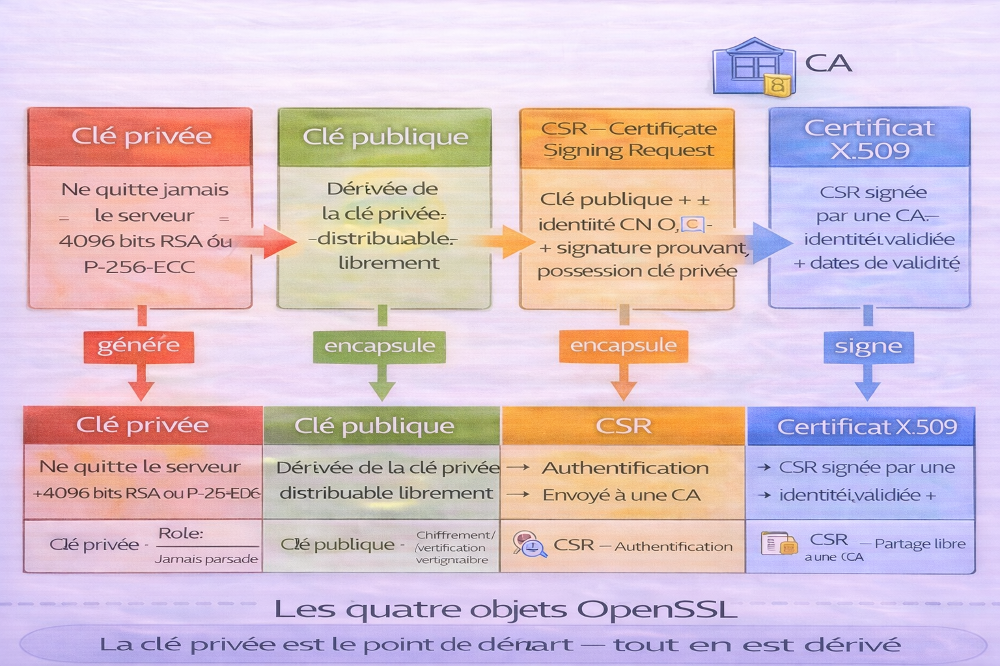
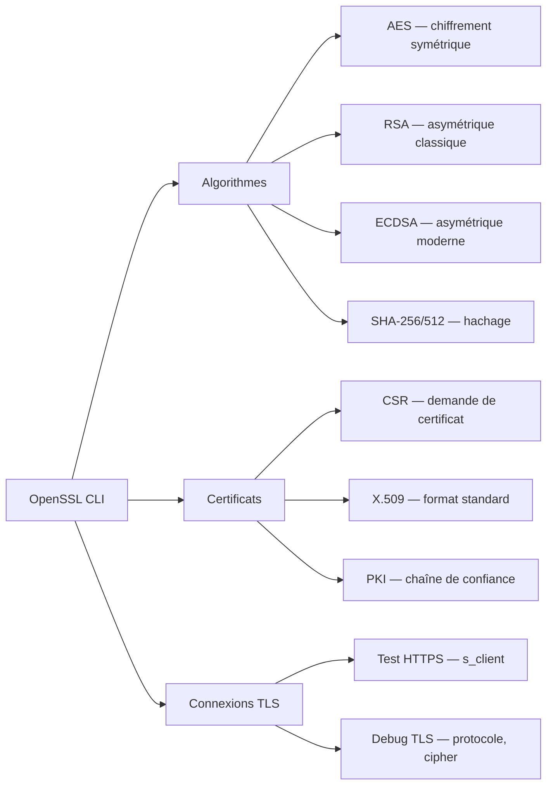
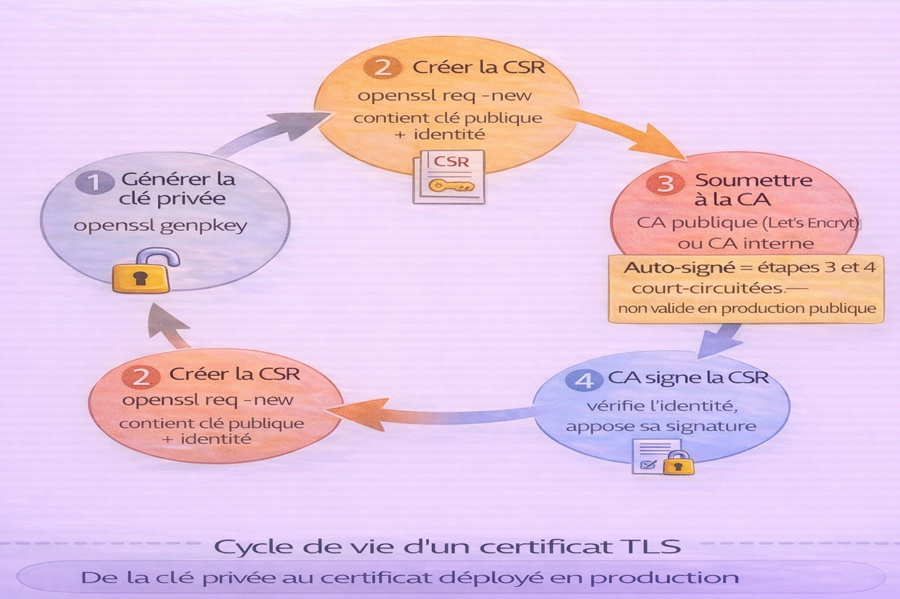
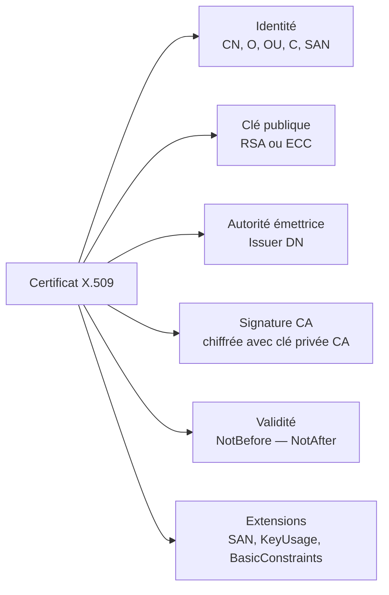
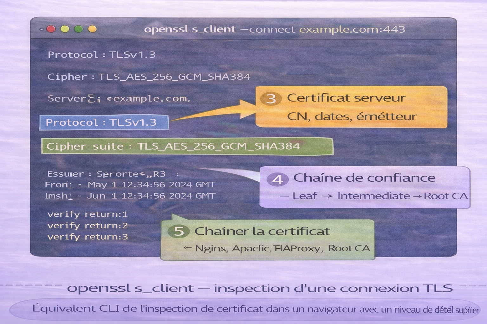
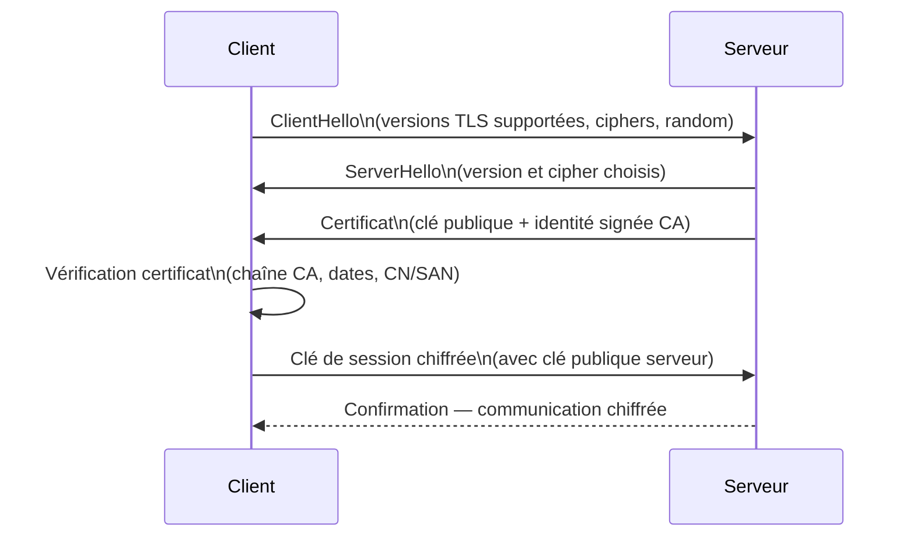

# OpenSSL

<div
  class="omny-meta"
  data-level="🟢 Débutant à 🔴 Avancé"
  data-version="1.0"
  data-time="60-90 minutes">
</div>

!!! quote "Analogie"
    _Si la cryptographie est une science, OpenSSL est le laboratoire. C'est l'outil avec lequel on fabrique des clés, on forge des certificats, on teste des connexions sécurisées et on analyse les échanges chiffrés._

!!! abstract "Résumé"
    Ce guide vous rendra opérationnel sur OpenSSL. Vous apprendrez à générer des paires de clés (RSA/ECC), forger des CSR, émettre ou inspecter des certificats X.509, et utiliser `s_client` pour diagnostiquer instantanément toute connexion TLS en ligne de commande.

**OpenSSL** est à la fois une bibliothèque cryptographique et un outil CLI permettant de manipuler directement les primitives cryptographiques utilisées par HTTPS, les VPN, SSH, les signatures logicielles, les certificats X.509 et les PKI internes. C'est l'outil de référence des administrateurs systèmes, ingénieurs sécurité, DevSecOps et pentesters.

À la fin de ce document, vous serez capable de générer des clés privées et publiques, créer des CSR et des certificats, inspecter un certificat X.509, tester et diagnostiquer une connexion TLS, et convertir entre les formats de certificats courants.

!!! info "Pourquoi c'est important"
    OpenSSL est présent sur la quasi-totalité des systèmes Linux. Savoir lire la sortie de `openssl s_client` permet de diagnostiquer un problème TLS en quelques secondes — version de protocole, cipher négocié, validité du certificat, chaîne de confiance. C'est une compétence directement opérationnelle en audit, en débogage d'infrastructure et en pentesting.

<br />

---

## Les quatre objets fondamentaux

!!! note "L'image ci-dessous présente les quatre objets manipulés par OpenSSL. Comprendre leur rôle respectif et leur relation est le prérequis avant toute manipulation."



<p><em>La clé privée est le point de départ — elle ne doit jamais quitter le serveur. La clé publique en est dérivée et peut être distribuée librement. La CSR (Certificate Signing Request) encapsule la clé publique avec des informations d'identité et est transmise à une autorité de certification. Le certificat est la CSR signée par l'autorité — il atteste que la clé publique appartient bien à l'entité déclarée. C'est ce certificat qui est présenté lors d'un handshake TLS.</em></p>

| Objet | Rôle | À distribuer |
|---|---|:---:|
| Clé privée | Identité secrète — signe et déchiffre | Jamais |
| Clé publique | Identité partageable — chiffre et vérifie | Oui |
| CSR | Demande de certificat transmise à une CA | À la CA uniquement |
| Certificat | Identité validée et signée par une CA | Oui |

<br />

---

## Architecture d'OpenSSL


```mermaid
flowchart LR
    A["OpenSSL CLI"]

    A --> B["Algorithmes"]
    A --> C["Certificats"]
    A --> D["Connexions TLS"]

    B --> B1["AES — chiffrement symétrique"]
    B --> B2["RSA — asymétrique classique"]
    B --> B3["ECDSA — asymétrique moderne"]
    B --> B4["SHA-256/512 — hachage"]

    C --> C1["CSR — demande de certificat"]
    C --> C2["X.509 — format standard"]
    C --> C3["PKI — chaîne de confiance"]

    D --> D1["Test HTTPS — s_client"]
    D --> D2["Debug TLS — protocole, cipher"]
```

<br />

---

## Installation

```bash title="Bash — installation OpenSSL selon la distribution"
# Debian / Ubuntu
sudo apt install openssl

# RHEL / Fedora
sudo dnf install openssl

# Arch Linux
sudo pacman -S openssl

# Alpine Linux
sudo apk add openssl
```

```bash title="Bash — vérification de la version installée"
openssl version
openssl version -a  # Détails complets — date de build, options de compilation
```

<br />

---

## Clés privées et publiques

### Générer une clé privée RSA

```bash title="Bash — génération d'une clé privée RSA 4096 bits"
# Clé RSA 4096 bits — format PKCS#8
openssl genpkey -algorithm RSA -out private.key -pkeyopt rsa_keygen_bits:4096

# Vérifier le contenu de la clé générée
openssl pkey -in private.key -text -noout
```

### Générer une clé privée ECC

```bash title="Bash — génération d'une clé privée ECC — recommandé en production"
# Courbe P-256 — équivalent sécurité RSA 3072 bits, en-tête beaucoup plus petit
openssl genpkey -algorithm EC -pkeyopt ec_paramgen_curve:P-256 -out private-ecc.key

# Courbe P-384 — niveau de sécurité supérieur
openssl genpkey -algorithm EC -pkeyopt ec_paramgen_curve:P-384 -out private-ecc384.key
```

### Extraire la clé publique

```bash title="Bash — extraction de la clé publique depuis la clé privée"
openssl pkey -pubout -in private.key -out public.key

# Afficher la clé publique
openssl pkey -pubin -in public.key -text -noout
```

### Protéger la clé privée par passphrase

```bash title="Bash — chiffrement de la clé privée avec AES-256"
# Chiffrer une clé existante
openssl pkey -in private.key -aes256 -out private-protected.key

# Retirer la protection (nécessite la passphrase)
openssl pkey -in private-protected.key -out private-unprotected.key
```

!!! danger "Permissions impératives sur la clé privée"
    La clé privée doit être lisible uniquement par son propriétaire. Des permissions trop larges exposent toute l'infrastructure TLS.

    ```bash title="Bash — correction des permissions sur la clé privée"
    chmod 600 private.key
    ls -la private.key  # Doit afficher -rw------- 
    ```

<br />

---

## CSR — Certificate Signing Request

### Générer une CSR

!!! note "L'image ci-dessous illustre le cycle complet — de la clé privée jusqu'au certificat déployé en production, en passant par la CSR soumise à une autorité de certification."



<p><em>La CSR encapsule la clé publique et les informations d'identité (CN, O, OU, C, SAN). Elle est signée par la clé privée pour prouver que le demandeur possède bien la clé privée correspondante. La CA vérifie l'identité, signe la CSR avec sa propre clé privée et retourne le certificat. En production, la CSR est soumise à une CA publique (Let's Encrypt, DigiCert, etc.) ou à une CA interne pour les environnements d'entreprise.</em></p>

```bash title="Bash — génération d'une CSR interactive"
# CSR interactive — OpenSSL demande CN, O, OU, C, email
openssl req -new -key private.key -out request.csr

# Afficher le contenu de la CSR
openssl req -in request.csr -text -noout
```

```bash title="Bash — génération d'une CSR non-interactive avec Subject"
# CSR non-interactive — utile pour les scripts et pipelines CI/CD
openssl req -new \
  -key private.key \
  -out request.csr \
  -subj "/C=FR/ST=IDF/L=Paris/O=OmnyVia/CN=example.com"
```

```bash title="Bash — CSR avec Subject Alternative Names (SAN) — obligatoire en production"
# Fichier de configuration pour inclure les SAN
cat > san.conf << 'EOF'
[req]
distinguished_name = req_distinguished_name
req_extensions     = v3_req
prompt             = no

[req_distinguished_name]
C  = FR
ST = IDF
L  = Paris
O  = OmnyVia
CN = example.com

[v3_req]
subjectAltName = @alt_names

[alt_names]
DNS.1 = example.com
DNS.2 = www.example.com
DNS.3 = api.example.com
EOF

openssl req -new -key private.key -out request-san.csr -config san.conf
```

Une CSR contient le nom de domaine (CN), l'organisation, la clé publique et une signature prouvant la possession de la clé privée associée.

<br />

---

## Certificats

### Certificat auto-signé

```bash title="Bash — certificat auto-signé — développement et tests uniquement"
# Depuis une CSR existante
openssl req -x509 -key private.key -in request.csr -out cert.pem -days 365

# En une seule commande — génère clé + CSR + certificat
openssl req -x509 \
  -newkey rsa:4096 \
  -keyout key.pem \
  -out cert.pem \
  -days 365 \
  -subj "/C=FR/O=OmnyVia/CN=localhost"
```

!!! warning "Certificat auto-signé"
    Un certificat auto-signé n'est pas validé par une CA de confiance — les navigateurs affichent un avertissement et les clients TLS rejettent la connexion par défaut. Acceptable uniquement pour le développement local, les environnements de test et les PKI internes où le certificat racine est importé manuellement dans les trust stores.

### Inspecter un certificat

```bash title="Bash — inspection complète d'un certificat X.509"
# Afficher toutes les informations du certificat
openssl x509 -in cert.pem -text -noout

# Afficher uniquement les dates de validité
openssl x509 -in cert.pem -dates -noout

# Afficher le sujet et l'émetteur
openssl x509 -in cert.pem -subject -issuer -noout

# Afficher le fingerprint SHA-256
openssl x509 -in cert.pem -fingerprint -sha256 -noout

# Vérifier la correspondance clé privée ↔ certificat
openssl x509 -noout -modulus -in cert.pem | openssl md5
openssl rsa  -noout -modulus -in private.key | openssl md5
# Les deux empreintes MD5 doivent être identiques
```

### Structure d'un certificat X.509


```mermaid
flowchart LR
    A["Certificat X.509"]

    A --> B["Identité<br />CN, O, OU, C, SAN"]
    A --> C["Clé publique<br />RSA ou ECC"]
    A --> D["Autorité émettrice<br />Issuer DN"]
    A --> E["Signature CA<br />chiffrée avec clé privée CA"]
    A --> F["Validité<br />NotBefore — NotAfter"]
    A --> G["Extensions<br />SAN, KeyUsage, BasicConstraints"]
```

<br />

---

## TLS — Test et inspection

!!! note "L'image ci-dessous présente ce que la commande `openssl s_client` révèle lors d'une connexion TLS — version de protocole, cipher négocié, certificat serveur et chaîne de confiance. C'est la commande de diagnostic TLS la plus directe disponible en CLI."



<p><em>openssl s_client établit une connexion TLS réelle et affiche la totalité du handshake — version TLS négociée, cipher suite sélectionnée, certificat du serveur avec ses dates de validité, et la chaîne de certification complète depuis le certificat serveur jusqu'à la CA racine. C'est l'équivalent CLI de l'inspection d'un certificat dans un navigateur, avec un niveau de détail bien supérieur.</em></p>

### Tester une connexion TLS

```bash title="Bash — inspection d'une connexion TLS distante avec s_client"
# Connexion TLS basique — affiche certificat, protocole et cipher
openssl s_client -connect example.com:443

# Mode non-interactif — ferme la connexion immédiatement après le handshake
openssl s_client -connect example.com:443 < /dev/null

# Forcer TLS 1.2
openssl s_client -connect example.com:443 -tls1_2

# Forcer TLS 1.3
openssl s_client -connect example.com:443 -tls1_3

# Afficher uniquement les informations du certificat
openssl s_client -connect example.com:443 < /dev/null 2>/dev/null | openssl x509 -text -noout

# Vérifier la date d'expiration d'un certificat distant
openssl s_client -connect example.com:443 < /dev/null 2>/dev/null \
  | openssl x509 -dates -noout
```

```bash title="Bash — inspection de services non-HTTP avec STARTTLS"
# SMTP avec STARTTLS
openssl s_client -connect smtp.example.com:587 -starttls smtp

# IMAP avec STARTTLS
openssl s_client -connect imap.example.com:143 -starttls imap

# LDAP avec STARTTLS
openssl s_client -connect ldap.example.com:389 -starttls ldap
```

### Handshake TLS


```mermaid
sequenceDiagram
    participant Client
    participant Serveur

    Client->>Serveur: ClientHello\n(versions TLS supportées, ciphers, random)
    Serveur->>Client: ServerHello\n(version et cipher choisis)
    Serveur->>Client: Certificat\n(clé publique + identité signée CA)
    Client->>Client: Vérification certificat\n(chaîne CA, dates, CN/SAN)
    Client->>Serveur: Clé de session chiffrée\n(avec clé publique serveur)
    Serveur-->>Client: Confirmation — communication chiffrée
```

Le handshake TLS est couvert en détail dans le chapitre [Modèle TCP/IP](../reseaux/modele-tcpip.md) et [Liste des Protocoles](../reseaux/protocoles-liste.md).

<br />

---

## Conversion de formats

Les certificats et clés existent sous plusieurs formats selon les environnements.

```bash title="Bash — conversions entre formats PEM, DER et PKCS"
# PEM → DER (binaire — utilisé par Java, Android, Windows)
openssl x509 -outform der -in cert.pem -out cert.der

# DER → PEM (ASCII — utilisé par Linux, Nginx, Apache)
openssl x509 -inform der -in cert.der -out cert.pem

# Créer un bundle PKCS#12 — contient clé privée + certificat + chaîne
# Utilisé par les applications Java, Windows, macOS Keychain
openssl pkcs12 -export \
  -inkey private.key \
  -in cert.pem \
  -certfile chain.pem \
  -out bundle.p12

# Extraire depuis un PKCS#12
openssl pkcs12 -in bundle.p12 -nocerts -out private-extracted.key
openssl pkcs12 -in bundle.p12 -nokeys  -out cert-extracted.pem
```

| Format | Extension courante | Usage |
|---|---|---|
| PEM | `.pem`, `.crt`, `.key` | Linux, Nginx, Apache, OpenSSH |
| DER | `.der`, `.cer` | Java, Android, iOS |
| PKCS#12 | `.p12`, `.pfx` | Windows, Java, macOS Keychain |
| PKCS#7 | `.p7b` | Windows, interopérabilité CA |

<br />

---

## Utilitaires cryptographiques

```bash title="Bash — hachage de fichiers avec OpenSSL"
# Empreinte SHA-256 d'un fichier
openssl dgst -sha256 fichier.txt

# Empreinte SHA-512
openssl dgst -sha512 fichier.txt

# HMAC-SHA256 avec clé secrète
openssl dgst -sha256 -hmac "cle-secrete" fichier.txt
```

```bash title="Bash — génération de données aléatoires cryptographiquement sûres"
# 32 octets en Base64 — idéal pour secrets, tokens, clés AES
openssl rand -base64 32

# 32 octets en hexadécimal
openssl rand -hex 32

# Mot de passe de 20 caractères
openssl rand -base64 20 | tr -d '=' | head -c 20
```

```bash title="Bash — chiffrement symétrique AES direct"
# Chiffrer un fichier avec AES-256-CBC
openssl enc -aes-256-cbc -salt -in fichier.txt -out fichier.enc -pbkdf2

# Déchiffrer
openssl enc -d -aes-256-cbc -in fichier.enc -out fichier.txt -pbkdf2
```

<br />

---

## Comparatif des algorithmes

| Algorithme | Type | Longueur de clé | Usage recommandé |
|---|---|---|---|
| RSA | Asymétrique | 2048 min — 4096 recommandé | Certificats, compatibilité large |
| ECDSA P-256 | Asymétrique | 256 bits | TLS moderne, performances |
| ECDSA P-384 | Asymétrique | 384 bits | Haute sécurité, gouvernement |
| AES-256-GCM | Symétrique | 256 bits | Chiffrement rapide authentifié |
| ChaCha20-Poly1305 | Symétrique | 256 bits | Mobile, VPN, TLS 1.3 |
| SHA-256 | Hachage | 256 bits | Intégrité, signatures |
| SHA-512 | Hachage | 512 bits | Sécurité renforcée |

RSA 1024 bits est considéré comme cassé depuis 2010 — ne jamais l'utiliser. ECC offre un niveau de sécurité équivalent à RSA avec des clés deux à trois fois plus courtes — préférer ECDSA P-256 pour les nouveaux déploiements.

<br />

---

## Erreurs fréquentes

!!! warning "Pièges classiques"
    Confondre certificat et clé privée lors de la configuration d'un serveur provoque une erreur de démarrage immédiate — la commande de vérification de correspondance par empreinte MD5 ci-dessus permet de l'éviter. Stocker une clé privée sans protection (sans passphrase et avec des permissions `644`) expose toute l'infrastructure à qui accède au serveur. Utiliser RSA 1024 bits est cryptographiquement insuffisant depuis 2010. Ignorer l'expiration d'un certificat est la cause la plus fréquente d'incident TLS en production — mettre en place une supervision des dates d'expiration. Omettre les SAN dans un certificat produit des erreurs de validation dans tous les clients TLS modernes — le CN seul n'est plus suffisant depuis RFC 2818.

<br />

---

## Bonnes pratiques

Les permissions `600` sur toute clé privée sont non-négociables. Utiliser une taille de clé RSA de 4096 bits minimum ou préférer ECC en production pour les nouvelles infrastructures. Planifier la rotation annuelle des certificats et automatiser le renouvellement avec des outils comme Certbot ou Vault. Conserver les clés privées hors des serveurs d'application dans un vault (HashiCorp Vault, AWS KMS, Azure Key Vault). Vérifier systématiquement la correspondance clé privée / certificat avant tout déploiement. Surveiller les dates d'expiration en production — un certificat expiré coupe le service.

<br />

---

## Référentiel des commandes

| Action | Commande |
|---|---|
| Version | `openssl version` |
| Générer clé RSA | `openssl genpkey -algorithm RSA -pkeyopt rsa_keygen_bits:4096` |
| Générer clé ECC | `openssl genpkey -algorithm EC -pkeyopt ec_paramgen_curve:P-256` |
| Extraire clé publique | `openssl pkey -pubout -in private.key` |
| Générer CSR | `openssl req -new -key private.key -out request.csr` |
| Certificat auto-signé | `openssl req -x509 -newkey rsa:4096 -keyout key.pem -out cert.pem -days 365` |
| Inspecter certificat | `openssl x509 -in cert.pem -text -noout` |
| Dates d'expiration | `openssl x509 -in cert.pem -dates -noout` |
| Tester TLS | `openssl s_client -connect example.com:443 < /dev/null` |
| Hash SHA-256 | `openssl dgst -sha256 fichier.txt` |
| Aléatoire Base64 | `openssl rand -base64 32` |
| PEM → DER | `openssl x509 -outform der -in cert.pem -out cert.der` |

<br />

---

## Conclusion

!!! quote "Ce qu'il faut retenir"
    La cryptographie et l'outil OPENSSL constituent la base de la confiance numérique. Une erreur de configuration dans ce domaine ne produit pas un simple bug, mais une vulnérabilité critique pouvant compromettre l'intégralité d'un système d'information.

!!! quote "Conclusion"
    _OpenSSL n'est pas seulement un outil — c'est la loupe qui rend visible la sécurité réelle d'un système. Savoir lire la sortie de `openssl s_client` ou inspecter un certificat X.509 directement depuis le terminal permet de diagnostiquer en quelques secondes ce qu'un navigateur cache derrière une icône de cadenas. Comprendre le cycle clé → CSR → certificat, les formats PEM et DER, et la différence entre RSA et ECC, c'est comprendre comment la confiance numérique est construite et déployée — des fondations nécessaires avant d'aborder la PKI dans le chapitre suivant._

<br />