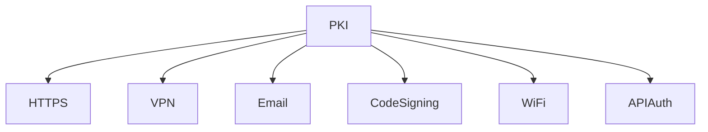
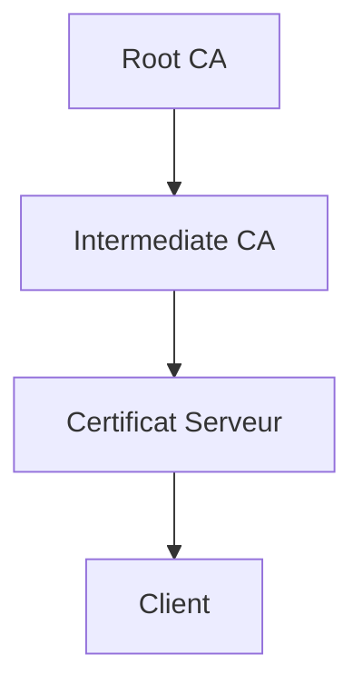
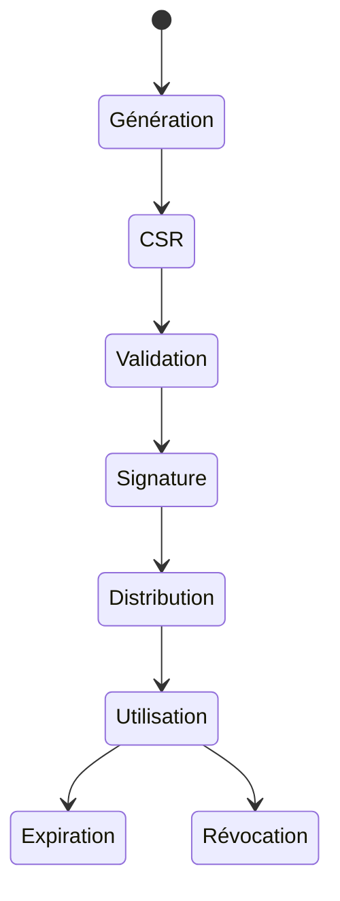
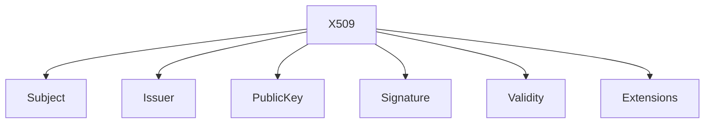
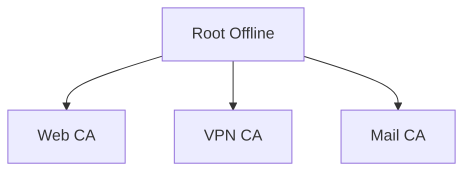
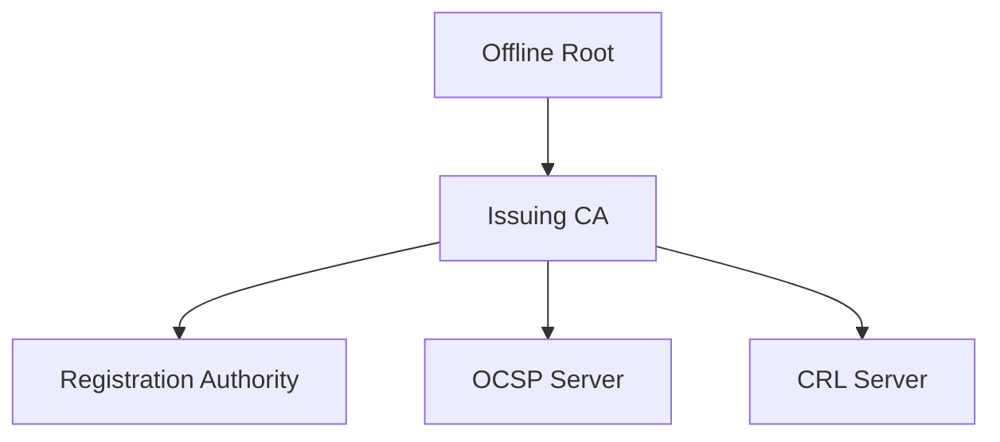

# PKI

<div
  class="omny-meta"
  data-level="🟡 Intermédiaire à 🔴 Expert"
  data-version="1.0"
  data-time="90-120 minutes">
</div>

## Introduction à Public Key Infrastructure

!!! quote "Analogie pédagogique"
    _Imaginez un système mondial de passeports. Chaque citoyen possède une identité, mais seule une autorité reconnue peut confirmer qu’elle est authentique. Une PKI fonctionne exactement ainsi : elle certifie que les identités numériques sont dignes de confiance._

Une **PKI (Infrastructure à Clé Publique)** est l’ensemble :

- des autorités de certification
- des certificats
- des clés cryptographiques
- des politiques de confiance

qui permettent d’établir une **confiance cryptographique vérifiable** entre entités.

!!! danger "Sans PKI"

    - pas de HTTPS fiable
    - pas de signature logicielle
    - pas d’authentification forte
    - pas de chiffrement inter-serveurs sécurisé

---

## Objectif pédagogique

À la fin de ce module vous saurez :

- comprendre une chaîne de confiance
- concevoir une PKI interne
- auditer une architecture PKI
- diagnostiquer un problème certificat
- expliquer un handshake TLS
- différencier CA racine / intermédiaire

---

## Rôle d’une PKI dans l’écosystème sécurité



---

## Les composants d’une PKI

| Composant                 | Rôle                       |
| ------------------------- | -------------------------- |
| Autorité Racine           | source ultime de confiance |
| Autorité Intermédiaire    | délégation d’émission      |
| Autorité d’Enregistrement | vérifie identités          |
| Certificat                | identité numérique         |
| CRL/OCSP                  | révocation                 |
| Clé privée                | secret critique            |

---

## Architecture logique d’une PKI



**Principe :** _La confiance descend hiérarchiquement._

---

## Types de PKI

### 1 — Hiérarchique (modèle standard)

* root unique
* intermédiaires
* certificats finaux

Utilisé par :

* Internet
* entreprises
* cloud

---

### 2 — Maillage (mesh trust)

Chaque entité signe les autres.

Utilisé par :

* petits environnements
* clusters fermés

---

### 3 — Web of Trust (GPG)

Aucune autorité centrale.

---

## Cycle de vie d’un certificat



---

## Chaîne de confiance expliquée

Quand un navigateur reçoit un certificat :

1. vérifie signature
2. vérifie chaîne
3. vérifie validité
4. vérifie révocation
5. vérifie domaine

Si une étape échoue → erreur TLS

---

## Structure d’un certificat



---

## Autorités de certification

### Root CA

* clé ultra-protégée
* rarement utilisée
* souvent offline

### Intermediate CA

* signe certificats
* limite risque
* remplaçable

---

## Pourquoi utiliser des intermédiaires ?

Si une CA intermédiaire est compromise :

→ on la révoque
→ on garde la racine intacte

Sans intermédiaire :

→ toute la PKI est compromise

---

## Exemple réel de hiérarchie entreprise



Avantage :
segmentation du risque.

---

## Révocation de certificats

Deux mécanismes :

| Méthode | Principe                |
| ------- | ----------------------- |
| CRL     | liste noire             |
| OCSP    | vérification temps réel |

---

## Pourquoi la révocation est critique

Cas réels :

* clé privée volée
* certificat compromis
* utilisateur licencié
* machine piratée

Sans révocation :
→ certificat reste valide
→ attaque invisible

---

## PKI publique vs privée

| Type    | Usage                |
| ------- | -------------------- |
| Public  | sites web            |
| Privé   | réseau interne       |
| Hybride | entreprises modernes |

---

## Cas d’usage concrets

| Domaine         | PKI utilisée        |
| --------------- | ------------------- |
| HTTPS           | certificats TLS     |
| Email           | S/MIME              |
| VPN             | authentification    |
| WiFi entreprise | 802.1X              |
| DevOps          | signature artefacts |
| Mobile          | certificats apps    |

---

## Vulnérabilités PKI fréquentes

!!! warning "Erreurs critiques"
- Root CA exposée
- durée de vie trop longue
- absence de révocation
- stockage clé en clair
- validation identité faible

---

## Bonnes pratiques professionnelles

* root CA offline
* intermédiaires séparées
* rotation certificats ≤ 397 jours
* stockage HSM
* journalisation émissions
* audit périodique

---

## Architecture PKI sécurisée (modèle recommandé)



---

## PKI et Zero Trust

Une architecture Zero Trust repose souvent sur une PKI interne :

* authentification mutuelle TLS
* certificats machine
* certificats utilisateur

---

## Positionnement compétence

Maîtriser les PKI signifie comprendre :

* cryptographie appliquée
* modèles de confiance
* identité numérique
* architecture sécurité

C’est une compétence de niveau :

* ingénieur sécurité
* architecte cloud
* expert réseau
* auditeur SSI

---

## Résumé conceptuel

| Concept    | Résumé               |
| ---------- | -------------------- |
| PKI        | système de confiance |
| Certificat | identité numérique   |
| CA         | autorité validatrice |
| CRL        | révocation           |
| Root       | autorité ultime      |

---

## Le mot de la fin

!!! quote
Une PKI n’est pas un outil. C’est une architecture de confiance. Lorsqu’elle est bien conçue, elle rend l’usurpation d’identité pratiquement impossible. Lorsqu’elle est mal conçue, elle donne une illusion de sécurité dangereuse.

Comprendre les PKI, c’est comprendre le socle invisible sur lequel repose la sécurité d’Internet.

---

## Métadonnées

**Version :** 1.0
**Mise à jour :** Février 2026
**Niveau :** Intermédiaire → Expert
**Temps lecture :** ~2h

```

---

### Recommandation d’architecture documentaire (important)

Maintenant que tu as :

- index crypto
- gpg.md
- openssl.md
- pki.md

L’ordre pédagogique optimal dans ta doc serait :

```

crypto/
├── index.md
├── openssl.md
├── gpg.md
└── pki.md

```

Ordre logique d’apprentissage :

1. OpenSSL → primitives
2. GPG → modèle de confiance alternatif
3. PKI → architecture globale

---

### Suggestion experte pour améliorer encore ta section

Ajoute plus tard :

```

crypto/
├── tls-handshake.md
├── x509-format.md
├── hsm.md
├── certificate-pinning.md
└── attack-scenarios.md

```

Ce sont les modules qui transforment une doc crypto en **référence professionnelle**.

---

✔ Si tu veux, je peux maintenant te générer le `index.md` maître de la section cryptographie qui relie pédagogiquement tous ces fichiers avec progression cognitive optimisée (type parcours expert certifiant).
```
