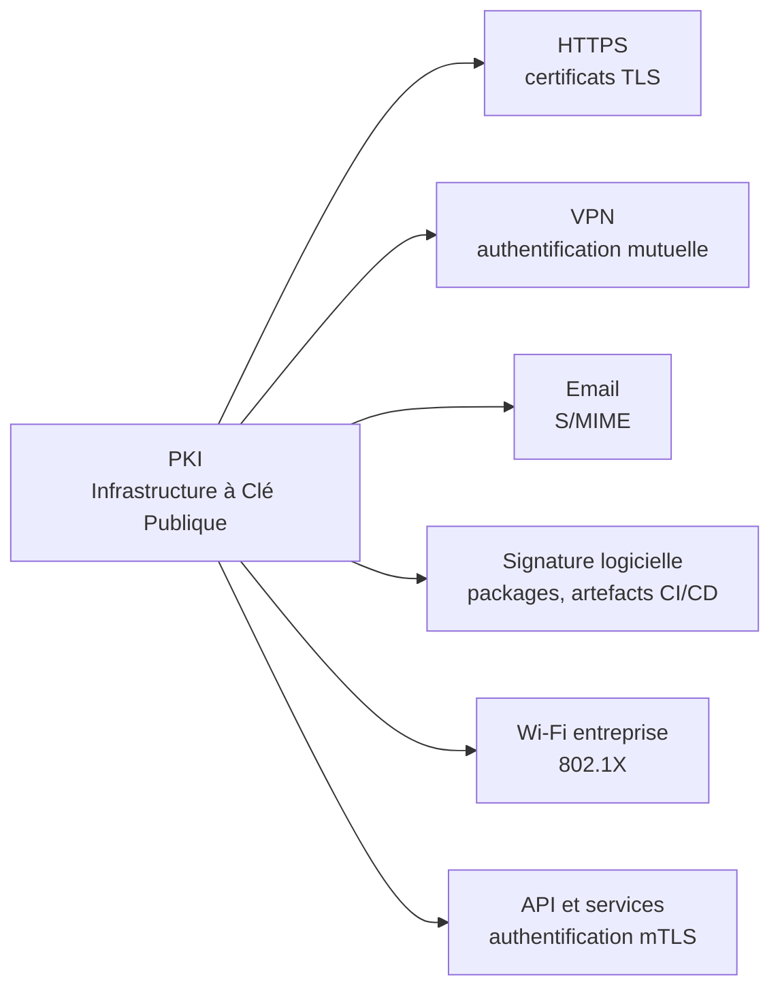
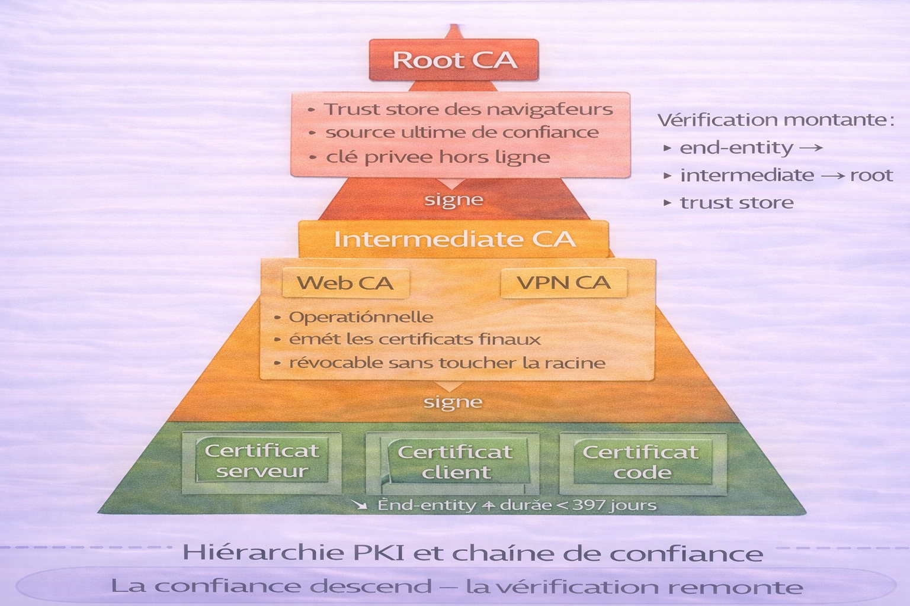
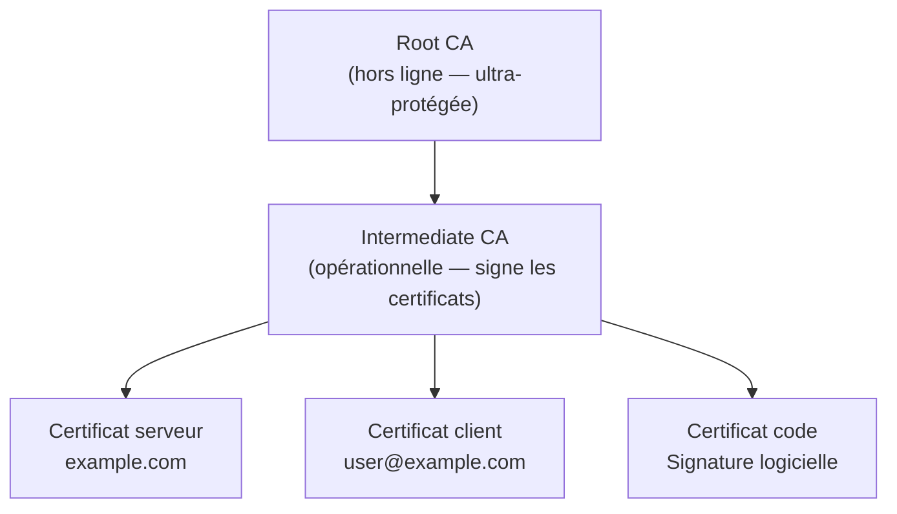
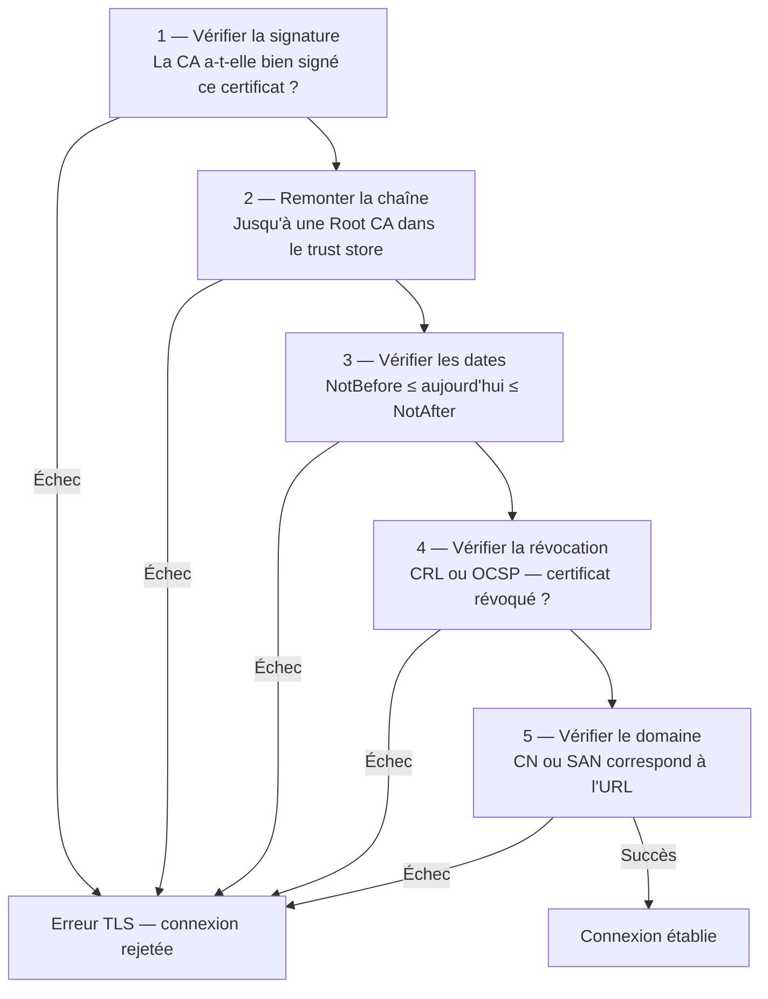
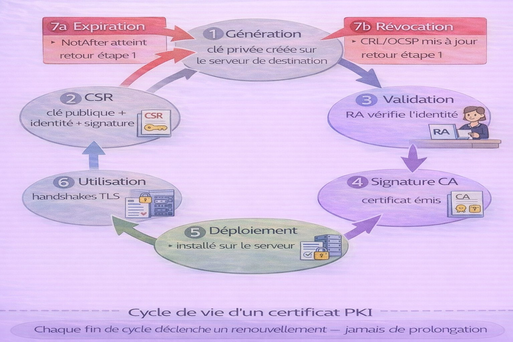
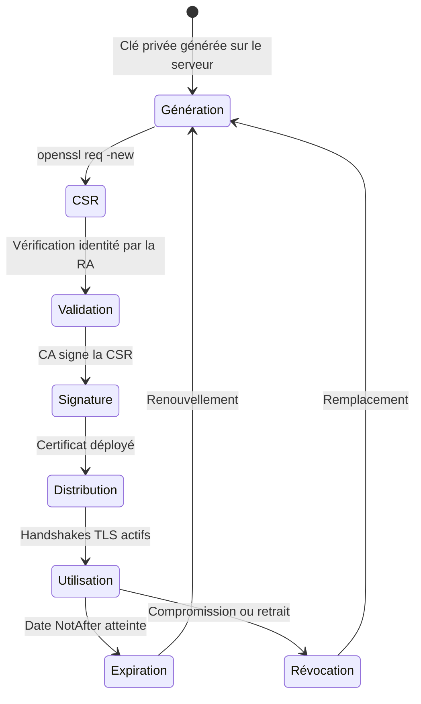
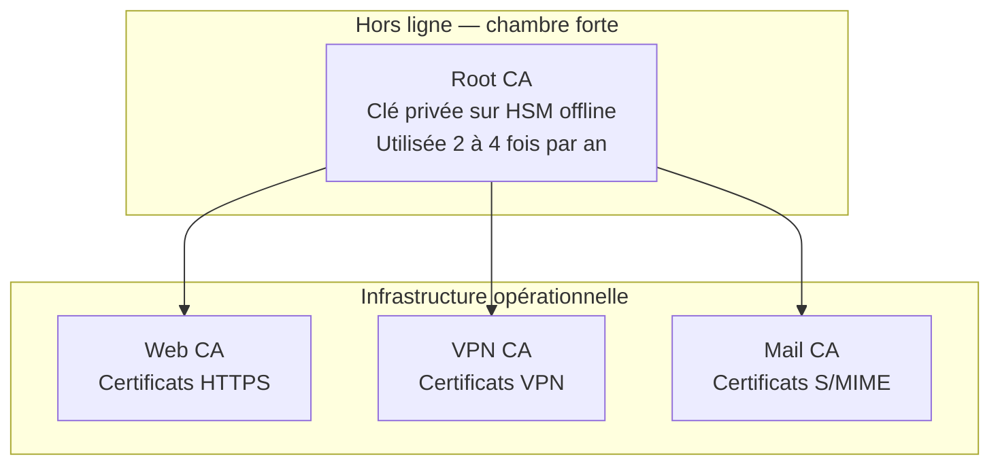
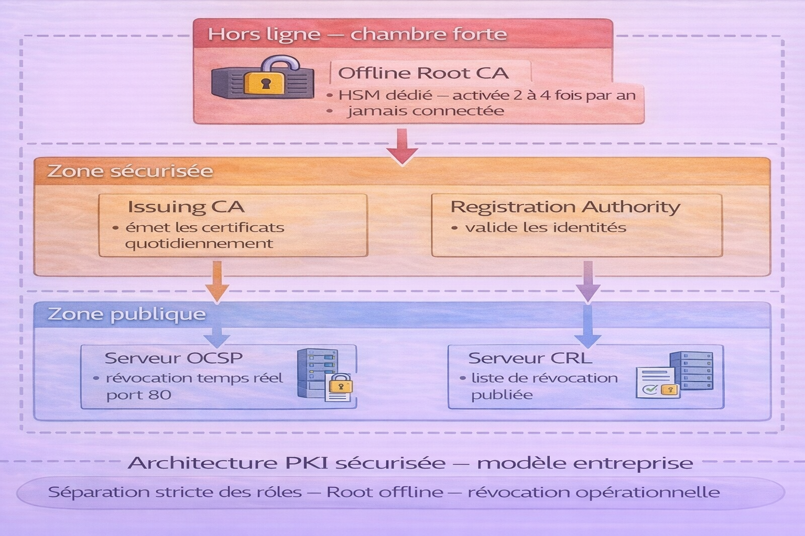
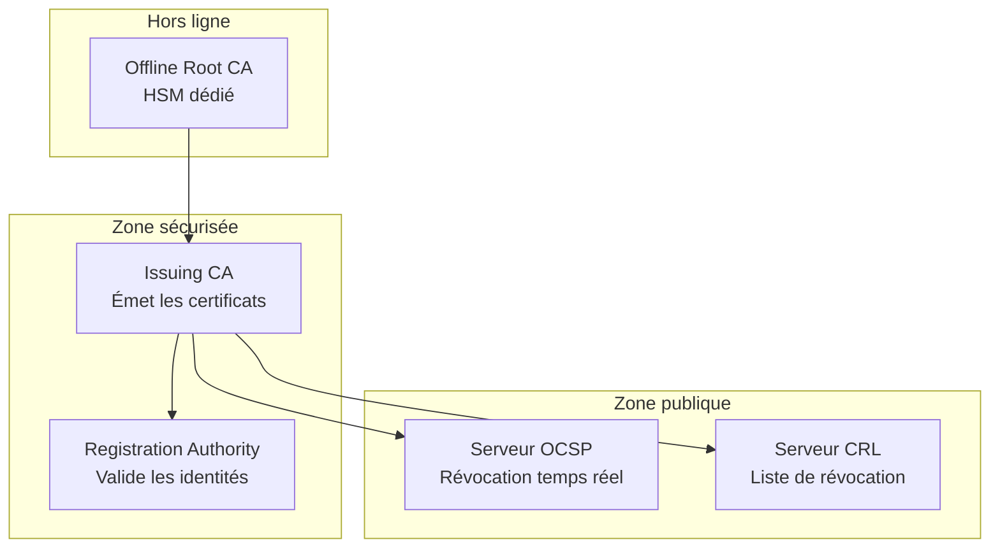

# PKI — Public Key Infrastructure

<div
  class="omny-meta"
  data-level="🟡 Intermédiaire à 🔴 Expert"
  data-version="1.0"
  data-time="90-120 minutes">
</div>

!!! quote "Analogie"
    _Un système mondial de passeports. Chaque citoyen possède une identité, mais seule une autorité reconnue peut confirmer qu'elle est authentique. Une PKI fonctionne exactement ainsi : elle certifie que les identités numériques sont dignes de confiance._

!!! abstract "Résumé"
    Ce chapitre décrypte le fonctionnement des architectures de confiance à l'échelle d'Internet et des réseaux d'entreprise. Vous découvrirez comment fonctionnent les Root CA et les Intermediate CA, comment vérifier une chaîne de confiance, comment gérer les révocations (CRL/OCSP) et quelles sont les vulnérabilités classiques de ces environnements.

Une **PKI (Infrastructure à Clé Publique)** est l'ensemble des autorités de certification, des certificats, des clés cryptographiques et des politiques de confiance qui permettent d'établir une **confiance cryptographique vérifiable** entre entités. C'est le socle invisible sur lequel repose HTTPS, les VPN, la signature logicielle, l'authentification Wi-Fi d'entreprise et les échanges inter-serveurs sécurisés.

Sans PKI, il n'y a pas de HTTPS fiable, pas de signature logicielle vérifiable, pas d'authentification forte et pas de chiffrement inter-serveurs sécurisé. À la fin de ce document, vous serez capable de comprendre une chaîne de confiance, concevoir une PKI interne, différencier CA racine et intermédiaire, diagnostiquer un problème de certificat et auditer une architecture PKI.

!!! info "Prérequis"
    Ce document fait suite aux chapitres [GPG](../crypto/gpg.md) et [OpenSSL](../crypto/openssl.md). La notion de paire de clés, de CSR et de certificat X.509 doit être acquise avant d'aborder l'architecture PKI.

<br />

---

## Rôle d'une PKI dans l'écosystème sécurité


```mermaid
flowchart LR
    PKI["PKI<br />Infrastructure à Clé Publique"]

    PKI --> HTTPS["HTTPS<br />certificats TLS"]
    PKI --> VPN["VPN<br />authentification mutuelle"]
    PKI --> Email["Email<br />S/MIME"]
    PKI --> Code["Signature logicielle<br />packages, artefacts CI/CD"]
    PKI --> WiFi["Wi-Fi entreprise<br />802.1X"]
    PKI --> API["API et services<br />authentification mTLS"]
```

<br />

---

## Les composants d'une PKI

| Composant | Rôle |
|---|---|
| Autorité Racine (Root CA) | Source ultime de confiance — signe les CA intermédiaires |
| Autorité Intermédiaire (Intermediate CA) | Délégation d'émission — signe les certificats finaux |
| Autorité d'Enregistrement (RA) | Vérifie les identités avant émission |
| Certificat | Identité numérique signée cryptographiquement |
| CRL / OCSP | Mécanismes de révocation des certificats |
| Clé privée | Secret critique — jamais transmis, jamais exposé |

<br />

---

## Architecture et chaîne de confiance

!!! note "L'image ci-dessous présente l'architecture hiérarchique d'une PKI — Root CA, Intermediate CA et certificats finaux. C'est le modèle utilisé par Internet, les navigateurs et les entreprises."



<p><em>La confiance descend hiérarchiquement. La Root CA signe les certificats des CA intermédiaires. Les CA intermédiaires signent les certificats finaux (serveurs, clients, code). Un navigateur fait confiance à un certificat serveur parce que sa CA intermédiaire est signée par une Root CA présente dans son trust store. Si un maillon de la chaîne est invalide, expiré ou révoqué, la connexion est rejetée.</em></p>


```mermaid
flowchart TB
    Root["Root CA<br />(hors ligne — ultra-protégée)"]
    Inter["Intermediate CA<br />(opérationnelle — signe les certificats)"]
    S1["Certificat serveur<br />example.com"]
    S2["Certificat client<br />user@example.com"]
    S3["Certificat code<br />Signature logicielle"]

    Root --> Inter
    Inter --> S1
    Inter --> S2
    Inter --> S3
```

### Vérification de la chaîne par un client TLS

Quand un navigateur reçoit un certificat lors d'un handshake TLS, il effectue cinq vérifications dans l'ordre :


```mermaid
flowchart TD
    V1["1 — Vérifier la signature<br />La CA a-t-elle bien signé ce certificat ?"]
    V2["2 — Remonter la chaîne<br />Jusqu'à une Root CA dans le trust store"]
    V3["3 — Vérifier les dates<br />NotBefore ≤ aujourd'hui ≤ NotAfter"]
    V4["4 — Vérifier la révocation<br />CRL ou OCSP — certificat révoqué ?"]
    V5["5 — Vérifier le domaine<br />CN ou SAN correspond à l'URL"]
    ERR["Erreur TLS — connexion rejetée"]
    OK["Connexion établie"]

    V1 --> V2 --> V3 --> V4 --> V5
    V1 -->|Échec| ERR
    V2 -->|Échec| ERR
    V3 -->|Échec| ERR
    V4 -->|Échec| ERR
    V5 -->|Échec| ERR
    V5 -->|Succès| OK
```

<br />

---

## Types de PKI

### PKI hiérarchique — modèle standard

C'est le modèle dominant — une racine unique délègue à des CA intermédiaires qui émettent les certificats finaux. Utilisé par Internet (navigateurs), les entreprises et les clouds publics. La segmentation par CA intermédiaires isole le risque — compromettre une CA intermédiaire ne compromet pas la racine.

### PKI maillée — mesh trust

Chaque entité signe les certificats des autres. Adapté aux petits environnements fermés et aux clusters où toutes les entités se connaissent — Zero Trust interne, Kubernetes mutual TLS.

### Web of Trust — GPG

Aucune autorité centrale. La confiance se propage par chaînes de signatures entre utilisateurs. Traité en détail dans le chapitre [GPG](../crypto/gpg.md).

<br />

---

## Cycle de vie d'un certificat

!!! note "L'image ci-dessous illustre le cycle de vie complet d'un certificat — de la génération de la clé jusqu'à la révocation ou l'expiration. Chaque étape correspond à une action concrète dans OpenSSL ou un outil de gestion PKI."



<p><em>Le cycle commence par la génération de la clé privée sur le serveur de destination — jamais ailleurs. La CSR encapsule la clé publique et les informations d'identité. La RA vérifie l'identité avant de transmettre à la CA pour signature. Le certificat signé est déployé. Pendant toute sa durée de validité, il peut être révoqué si la clé privée est compromise ou si l'entité n'existe plus. À expiration, le cycle recommence.</em></p>


```mermaid
stateDiagram-v2
    [*] --> Génération : Clé privée générée sur le serveur
    Génération --> CSR : openssl req -new
    CSR --> Validation : Vérification identité par la RA
    Validation --> Signature : CA signe la CSR
    Signature --> Distribution : Certificat déployé
    Distribution --> Utilisation : Handshakes TLS actifs
    Utilisation --> Expiration : Date NotAfter atteinte
    Utilisation --> Révocation : Compromission ou retrait
    Expiration --> Génération : Renouvellement
    Révocation --> Génération : Remplacement
```

<br />

---

## Root CA et Intermediate CA

### Pourquoi séparer Root CA et Intermediate CA

La Root CA est la source ultime de confiance. Sa clé privée doit être protégée au niveau maximum — si elle est compromise, toute la PKI est compromise et il n'existe aucun mécanisme de récupération. La Root CA est donc maintenue hors ligne et n'est activée que pour signer de nouvelles CA intermédiaires.

Les CA intermédiaires assurent les opérations courantes — émission de certificats, révocations. Si une CA intermédiaire est compromise, on la révoque et on en crée une nouvelle. La Root CA reste intacte.


```mermaid
flowchart TD
    subgraph "Hors ligne — chambre forte"
        Root["Root CA\nClé privée sur HSM offline\nUtilisée 2 à 4 fois par an"]
    end

    subgraph "Infrastructure opérationnelle"
        WebCA["Web CA\nCertificats HTTPS"]
        VPNCA["VPN CA\nCertificats VPN"]
        MailCA["Mail CA\nCertificats S/MIME"]
    end

    Root --> WebCA
    Root --> VPNCA
    Root --> MailCA
```

La segmentation par CA intermédiaires spécialisées permet d'isoler les périmètres de risque. Un incident sur la VPN CA n'affecte pas les certificats HTTPS.

<br />

---

## Révocation — CRL et OCSP

La révocation informe les clients qu'un certificat ne doit plus être considéré comme valide — clé privée volée, entité compromise, utilisateur parti, machine piratée. Sans révocation, un certificat compromis reste valide jusqu'à son expiration.

| Mécanisme | Principe | Avantages | Inconvénients |
|---|---|---|---|
| CRL | Liste noire publiée périodiquement | Simple, fonctionne hors ligne | Volumineuse, latence de mise à jour |
| OCSP | Vérification en temps réel par requête | Réponse immédiate, légère | Dépendance à la disponibilité du serveur OCSP |
| OCSP Stapling | Le serveur inclut la réponse OCSP dans le handshake | Élimine la dépendance client | Nécessite configuration serveur |

```bash title="Bash — vérifier la révocation d'un certificat avec OpenSSL"
# Extraire l'URL OCSP depuis le certificat
openssl x509 -in cert.pem -noout -ocsp_uri

# Vérifier le statut OCSP
openssl ocsp \
  -issuer intermediate.pem \
  -cert cert.pem \
  -url http://ocsp.example.com \
  -text

# Télécharger et inspecter une CRL
openssl crl -in crl.pem -text -noout
```

<br />

---

## Architecture PKI sécurisée — modèle recommandé

!!! note "L'image ci-dessous présente l'architecture PKI de référence pour un environnement d'entreprise — Root offline, Issuing CA opérationnelle, RA, OCSP et CRL séparés."



<p><em>La Root CA est strictement hors ligne — activée uniquement pour signer de nouvelles CA intermédiaires, quelques fois par an. L'Issuing CA est l'autorité opérationnelle qui émet les certificats au quotidien. La Registration Authority valide les identités avant transmission à l'Issuing CA. Les serveurs OCSP et CRL permettent aux clients de vérifier la révocation en temps réel. Cette séparation des rôles limite la surface d'attaque et isole chaque composant.</em></p>


```mermaid
flowchart TD
    subgraph "Hors ligne"
        Root["Offline Root CA\nHSM dédié"]
    end

    subgraph "Zone sécurisée"
        Issuing["Issuing CA\nÉmet les certificats"]
        RA["Registration Authority\nValide les identités"]
    end

    subgraph "Zone publique"
        OCSP["Serveur OCSP\nRévocation temps réel"]
        CRL["Serveur CRL\nListe de révocation"]
    end

    Root --> Issuing
    Issuing --> RA
    Issuing --> OCSP
    Issuing --> CRL
```

<br />

---

## Implémenter une PKI interne avec OpenSSL

Une PKI interne permet d'émettre des certificats pour les services internes sans dépendre d'une CA publique.

```bash title="Bash — créer une Root CA avec OpenSSL"
# Créer la structure de répertoires
mkdir -p ~/pki/{root,intermediate}/{certs,crl,newcerts,private}
chmod 700 ~/pki/root/private

# Générer la clé privée de la Root CA
openssl genpkey -algorithm EC \
  -pkeyopt ec_paramgen_curve:P-384 \
  -out ~/pki/root/private/root-ca.key
chmod 600 ~/pki/root/private/root-ca.key

# Créer le certificat auto-signé de la Root CA (10 ans)
openssl req -x509 -new \
  -key ~/pki/root/private/root-ca.key \
  -out ~/pki/root/certs/root-ca.pem \
  -days 3650 \
  -subj "/C=FR/O=OmnyVia/CN=OmnyVia Root CA"
```

```bash title="Bash — créer une Intermediate CA"
# Générer la clé privée de l'Intermediate CA
openssl genpkey -algorithm EC \
  -pkeyopt ec_paramgen_curve:P-256 \
  -out ~/pki/intermediate/private/intermediate-ca.key
chmod 600 ~/pki/intermediate/private/intermediate-ca.key

# Créer la CSR de l'Intermediate CA
openssl req -new \
  -key ~/pki/intermediate/private/intermediate-ca.key \
  -out ~/pki/intermediate/intermediate-ca.csr \
  -subj "/C=FR/O=OmnyVia/CN=OmnyVia Intermediate CA"

# Signer la CSR avec la Root CA (5 ans)
openssl x509 -req \
  -in ~/pki/intermediate/intermediate-ca.csr \
  -CA ~/pki/root/certs/root-ca.pem \
  -CAkey ~/pki/root/private/root-ca.key \
  -CAcreateserial \
  -out ~/pki/intermediate/certs/intermediate-ca.pem \
  -days 1825 \
  -extensions v3_ca
```

```bash title="Bash — émettre un certificat serveur depuis l'Intermediate CA"
# Générer la clé privée du serveur
openssl genpkey -algorithm EC \
  -pkeyopt ec_paramgen_curve:P-256 \
  -out server.key

# Créer la CSR du serveur
openssl req -new \
  -key server.key \
  -out server.csr \
  -subj "/C=FR/O=OmnyVia/CN=example.internal"

# Signer avec l'Intermediate CA (1 an)
openssl x509 -req \
  -in server.csr \
  -CA ~/pki/intermediate/certs/intermediate-ca.pem \
  -CAkey ~/pki/intermediate/private/intermediate-ca.key \
  -CAcreateserial \
  -out server.pem \
  -days 365

# Vérifier la chaîne complète
openssl verify \
  -CAfile ~/pki/root/certs/root-ca.pem \
  -untrusted ~/pki/intermediate/certs/intermediate-ca.pem \
  server.pem
```

<br />

---

## Distribuer la Root CA dans les trust stores

Pour qu'un certificat interne soit reconnu sans avertissement, la Root CA doit être importée dans les trust stores des clients.

```bash title="Bash — ajouter une Root CA au trust store Linux"
# Debian / Ubuntu
sudo cp ~/pki/root/certs/root-ca.pem /usr/local/share/ca-certificates/omnyvia-root.crt
sudo update-ca-certificates

# RHEL / Fedora
sudo cp ~/pki/root/certs/root-ca.pem /etc/pki/ca-trust/source/anchors/omnyvia-root.crt
sudo update-ca-trust

# Vérifier que la Root CA est reconnue
openssl verify -CAfile /etc/ssl/certs/ca-certificates.crt server.pem
```

<br />

---

## PKI et Zero Trust

Une architecture Zero Trust repose structurellement sur une PKI interne. Chaque entité — serveur, service, utilisateur, machine — possède un certificat qui prouve son identité. Le mutual TLS (mTLS) exige que le client et le serveur présentent chacun un certificat valide, éliminant toute authentification basée uniquement sur l'adresse réseau.

| Cas d'usage Zero Trust | Mécanisme PKI |
|---|---|
| Authentification service à service | mTLS — certificats machine |
| Accès utilisateur | Certificats client |
| Signature d'artefacts CI/CD | Certificats code signing |
| Rotation automatique | SPIFFE/SPIRE, Vault PKI |

<br />

---

## Vulnérabilités PKI fréquentes

!!! warning "Erreurs critiques"
    Exposer la Root CA en ligne est l'erreur architecturale la plus grave — une compromission rend invalide l'intégralité de la PKI sans possibilité de récupération. Configurer des durées de validité trop longues (plusieurs années sur les certificats finaux) amplifie l'impact d'une compromission silencieuse. L'absence de mécanisme de révocation (CRL ou OCSP) signifie qu'un certificat compromis reste valide jusqu'à expiration. Stocker les clés privées en clair sur un système de fichiers standard expose à une exfiltration par tout attaquant ayant un accès lecture. Une validation d'identité insuffisante lors de l'émission compromet la valeur de l'ensemble de la chaîne.

<br />

---

## Bonnes pratiques

La Root CA doit être strictement hors ligne — activée uniquement pour signer de nouvelles CA intermédiaires. Les CA intermédiaires doivent être segmentées par usage (Web, VPN, Mail, Code Signing). La durée de validité des certificats finaux ne doit pas dépasser 397 jours — c'est la limite imposée par les navigateurs depuis 2020. Les clés privées de CA doivent être stockées sur un HSM (Hardware Security Module). Chaque émission de certificat doit être journalisée et auditée. Un audit périodique de la PKI permet de détecter les dérives de configuration et les certificats orphelins.

<br />

---

## Conclusion

!!! quote "Conclusion"
    _Une PKI n'est pas un outil — c'est une architecture de confiance. Lorsqu'elle est bien conçue, la hiérarchie Root CA hors ligne, CA intermédiaires opérationnelles et révocation active rend l'usurpation d'identité cryptographique pratiquement impossible. Lorsqu'elle est mal conçue — Root CA exposée, durées excessives, absence de révocation — elle donne une illusion de sécurité plus dangereuse que l'absence de sécurité. Maîtriser les PKI, c'est comprendre comment la confiance numérique est construite, déléguée, vérifiée et révoquée à l'échelle d'Internet._

<br />