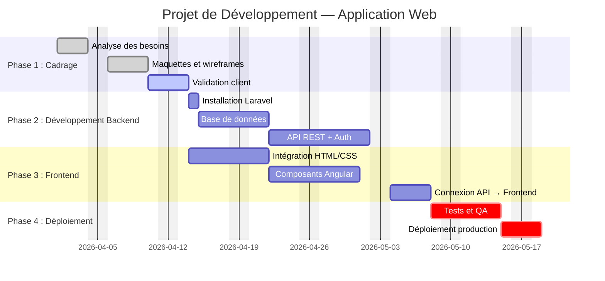
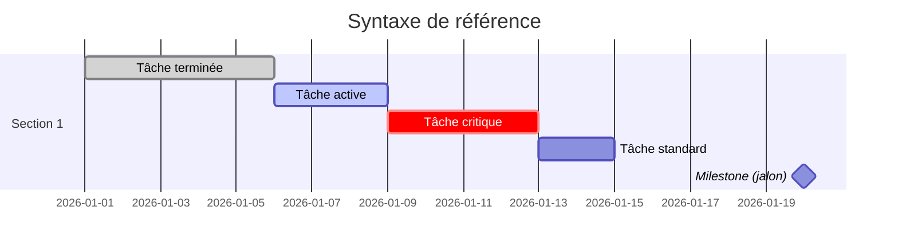

# Diagramme de Gantt — La Carte Temporelle du Projet

## Introduction

!!! quote "Analogie pédagogique — Le Plan de Vol"
    Quand un avion décolle de Paris pour New York, le pilote ne consulte pas sa carte toutes les 5 minutes. Il a planifié le vol au sol : route, durée, altitude, carburant, escales d'urgence. Le **Gantt**, c'est le plan de vol de votre projet : qui fait quoi, quand, pour combien de temps, et quelles tâches bloquent les autres.

    Développé par Henry Gantt en 1910, ce diagramme reste, plus d'un siècle plus tard, l'outil de planification le plus lisible qui existe pour un projet à plusieurs phases et plusieurs acteurs.

Un diagramme de Gantt représente les tâches d'un projet sur un **axe temporel horizontal**. La durée d'une barre = la durée de la tâche. Les dépendances (une tâche qui ne peut commencer qu'après une autre) sont représentées par des flèches ou par l'enchaînement des barres.

 

---

## Créer un Gantt avec Mermaid

_Le chemin critique (:crit) identifie les tâches qui, si elles prennent du retard, **retardent l'ensemble du projet**. C'est la priorité absolue du chef de projet._

 

---

## Syntaxe Mermaid pour les Gantt

| Marqueur | Signification | Couleur |
|---|---|---|
| `:done,` | Tâche terminée | Vert foncé |
| `:active,` | En cours | Bleu |
| `:crit,` | Chemin critique | Rouge |
| `:milestone,` | Jalon (point de contrôle) | Losange |
| _(sans marqueur)_ | Planifiée | Bleu clair |

 

---

## Gantt vs Kanban — Quand Utiliser Quoi ?

| Critère | Gantt | Kanban |
|---|---|---|
| **Idéal pour** | Projets avec dates fixes, jalons contractuels | Flux de travail continu, maintenance |
| **Visibilité** | Temporelle (qui fait quoi quand) | État du travail (ce qui est en cours) |
| **Flexibilité** | Faible (le planning est figé) | Haute (priorités changeantes) |
| **Taille d'équipe** | 5+ personnes, phases distinctes | 1 à 10 personnes |
| **Usage typique** | Projet client, refonte complète | Développement produit continu |

 

---

## Conclusion

!!! quote "Ce qu'il faut retenir"
    Le Gantt n'est pas un outil de contrôle — c'est un outil de **communication**. Il aligne en un seul visuel le client, le chef de projet et l'équipe sur les priorités, les dépendances et les dates clés. Sur les projets complexes avec des dépendances entre équipes (frontend qui attend le backend, QA qui attend le développement), le Gantt est irremplaçable pour identifier les blocages avant qu'ils surviennent.

> [Retour à la Gestion de Projet →](./index.md)
