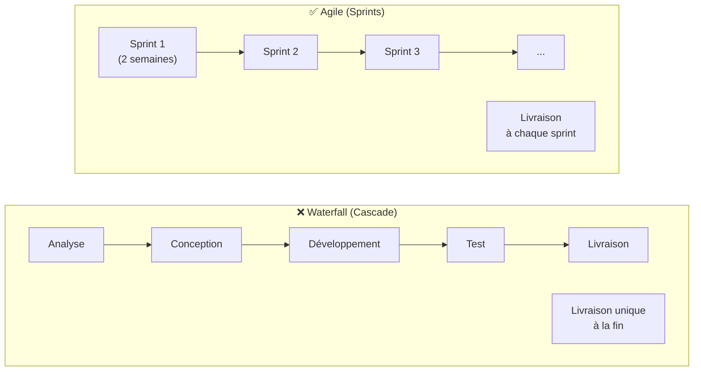
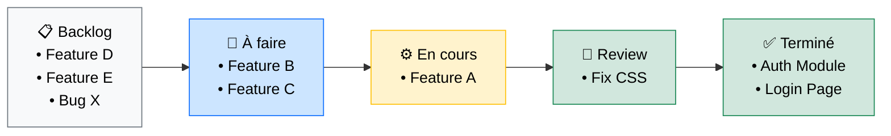

# Gestion de Projet — Organiser le Développement

<div
  class="omny-meta"
  data-level="🟢 Débutant & 🟡 Intermédiaire"
  data-version="2024"
  data-time="~20 minutes">
</div>

## Introduction

!!! quote "Analogie pédagogique — La Randonnée en Montagne"
    Partir en randonnée sans carte, sans objectif de temps, sans prévoir les haltes — c'est courir le risque de se retrouver épuisé à mi-parcours, sans avoir atteint le sommet. La **gestion de projet**, c'est préparer la carte (le backlog), définir les étapes (les sprints), et ajuster l'itinéraire en temps réel (les daily standups).

    En développement logiciel, l'absence de méthode se traduit par des deadlines manquées, des features qui partent dans tous les sens, et des équipes qui ne savent pas ce que fait l'autre moitié. Une méthode agile simple résout 80% de ces problèmes.

<br>

---

## Les Méthodologies Principales

### Agile vs Waterfall (Cascade)



_Le modèle Cascade convient aux projets aux exigences figées (construction civile). Le modèle Agile convient au développement logiciel où les besoins évoluent avec les retours utilisateurs._

### Scrum — Le Cadre Agile Standard

| Rôle | Responsabilité |
|---|---|
| **Product Owner** | Priorise le backlog, représente le client |
| **Scrum Master** | Facilite les cérémonies, lève les obstacles |
| **Dev Team** | Implémente les fonctionnalités |

**Les 4 cérémonies Scrum :**
1. **Sprint Planning** : Choisir les US à développer pendant le sprint
2. **Daily Standup** : 15 min/jour — hier / aujourd'hui / blocages
3. **Sprint Review** : Démo du travail accompli au Product Owner
4. **Retrospective** : Ce qui a bien marché / à améliorer

<br>

---

## Kanban — Visualiser le Flux de Travail

Le Kanban est une alternative plus simple à Scrum. Tout le travail est représenté sous forme de cartes sur un tableau.



**Outils populaires :** GitHub Projects, GitLab Boards, Jira, Trello, Linear

<br>

---

## La Gestion du Backlog (User Stories)

Une **User Story** suit la formule : *"En tant que [rôle], je veux [action] afin de [bénéfice]"*.

```
✅ User Story valide :
"En tant qu'utilisateur non connecté, je veux pouvoir réinitialiser mon mot de passe 
par email afin de récupérer l'accès à mon compte."

❌ User Story invalide (trop vague) :
"Faire le système de mot de passe"
```

Les User Stories sont associées à des **points de story** (estimation relative de complexité) et regroupées en **Epics** (grandes fonctionnalités).

<br>

---

## Conclusion

!!! quote "Ce qu'il faut retenir"
    La méthode de gestion de projet n'est pas une fin en soi — c'est un outil au service de la livraison. Pour un développeur solo, un Kanban simple suffit. Pour une équipe de 5 personnes, Scrum avec des sprints de 2 semaines est un cadre efficace. L'essentiel : **tout le monde sait ce qui est prioritaire, ce qui est en cours, et ce qui est bloqué**. Un tableau visible de toute l'équipe vaut mieux qu'une réunion de 2 heures.

> [Diagramme de Gantt — Planification temporelle →](./gantt.md)
