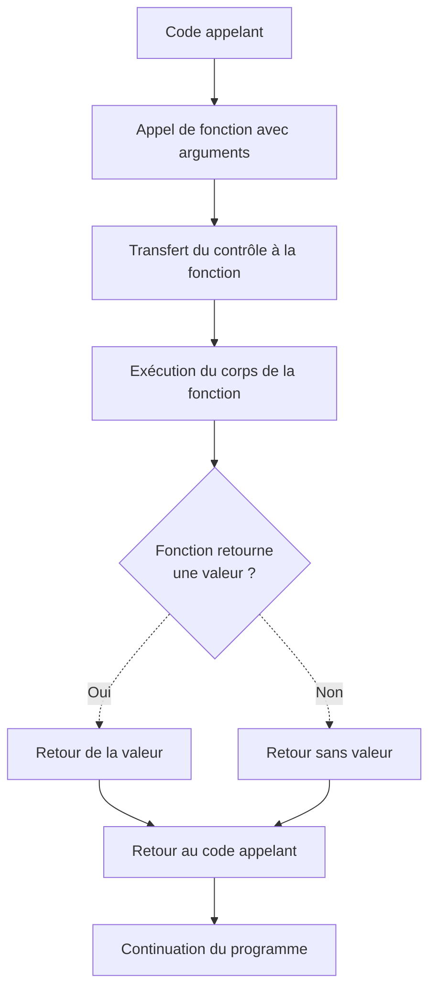

# Fonctions

## Introduction

<div
  class="omny-meta"
  data-level="🟢 Débutant & 🟡 Intermédiaire"
  data-version="1.1"
  data-time="35-40 minutes">
</div>

!!! quote "Analogie pédagogique"
    _Imaginez une recette de cuisine que vous écrivez une seule fois dans votre livre de recettes. Chaque fois que vous voulez préparer ce plat, vous consultez simplement la recette au lieu de réécrire toutes les étapes. **Les fonctions fonctionnent exactement ainsi** : vous définissez une séquence d'instructions une seule fois, puis vous l'appelez autant de fois que nécessaire en lui fournissant différents ingrédients selon vos besoins._

> Notre parcours à travers les fondamentaux de la programmation nous a progressivement équipés des outils essentiels. Nous maîtrisons les **types primitifs** qui constituent nos données, comprenons l'**organisation mémoire** entre Stack et Heap, savons évaluer des **conditions booléennes**, pouvons structurer des **décisions conditionnelles** et répéter des opérations avec les **structures itératives**. 

**Les fonctions** représentent maintenant l'outil d'organisation qui **transforme ces compétences en code modulaire, réutilisable et maintenable**. Une fonction encapsule un bloc d'instructions sous un nom significatif que vous pouvez invoquer depuis n'importe quelle partie de votre programme.

!!! info "Pourquoi c'est important ?"
    Les fonctions permettent la **réutilisation du code**, la **décomposition de problèmes complexes**, la **facilitation du débogage** et la **collaboration efficace** entre développeurs. Sans elles, vous devriez dupliquer le même code à chaque utilisation, multipliant les risques d'erreurs et rendant la maintenance cauchemardesque.

## Pour repartir des bases (vrais débutants)

Si vous n'avez pas encore maîtrisé les **structures conditionnelles** et **itératives**, consolidez d'abord ces fondations. Les fonctions encapsulent fréquemment des conditions et des boucles, et leur compréhension nécessite donc la maîtrise préalable de ces structures de contrôle.

!!! tip "C'est la suite logique !"
    Vous savez maintenant comment structurer des décisions et répéter des opérations. **Les fonctions ajoutent simplement la question** _"**comment organiser et réutiliser efficacement ces structures ?**"_. Lorsque vous identifiez un ensemble d'opérations que vous effectuez fréquemment, vous devriez immédiatement penser à l'encapsuler dans une fonction.

## Anatomie d'une fonction

Une fonction se compose de **quatre éléments fondamentaux** qui définissent son comportement et son interface avec le reste du programme.

Le **nom de la fonction** identifie l'opération qu'elle effectue et permet de l'invoquer depuis d'autres parties du code. Les **paramètres** représentent les données d'entrée que la fonction reçoit lors de son appel. Le **corps de la fonction** contient les instructions qui seront exécutées à chaque invocation. La **valeur de retour** optionnelle permet à la fonction de communiquer un résultat au code appelant.

=== ":fontawesome-brands-python: Python"

    ```python
    def calculer_aire_rectangle(largeur, hauteur):
        """
        Calcule l'aire d'un rectangle.
        
        Paramètres:
            largeur: La largeur du rectangle
            hauteur: La hauteur du rectangle
        
        Retourne:
            L'aire calculée
        """
        aire = largeur * hauteur
        return aire

    # Appel de la fonction
    resultat = calculer_aire_rectangle(5, 10)
    print(f"L'aire est {resultat}")  # 50
    ```

=== ":fontawesome-brands-js: JavaScript"

    ```javascript
    function calculerAireRectangle(largeur, hauteur) {
        /**
         * Calcule l'aire d'un rectangle.
         * 
         * @param {number} largeur - La largeur du rectangle
         * @param {number} hauteur - La hauteur du rectangle
         * @returns {number} L'aire calculée
         */
        const aire = largeur * hauteur;
        return aire;
    }

    // Appel de la fonction
    const resultat = calculerAireRectangle(5, 10);
    console.log(`L'aire est ${resultat}`);  // 50
    ```

=== ":fontawesome-brands-php: PHP"

    ```php
    <?php
    /**
     * Calcule l'aire d'un rectangle.
     * 
     * @param float $largeur La largeur du rectangle
     * @param float $hauteur La hauteur du rectangle
     * @return float L'aire calculée
     */
    function calculer_aire_rectangle($largeur, $hauteur) {
        $aire = $largeur * $hauteur;
        return $aire;
    }

    // Appel de la fonction
    $resultat = calculer_aire_rectangle(5, 10);
    echo "L'aire est $resultat\n";  // 50
    ?>
    ```

=== ":fontawesome-brands-golang: Golang"

    ```go
    package main
    import "fmt"

    // calculerAireRectangle calcule l'aire d'un rectangle.
    // Paramètres: largeur et hauteur du rectangle
    // Retourne: l'aire calculée
    func calculerAireRectangle(largeur, hauteur float64) float64 {
        aire := largeur * hauteur
        return aire
    }

    func main() {
        // Appel de la fonction
        resultat := calculerAireRectangle(5, 10)
        fmt.Printf("L'aire est %.0f\n", resultat)  // 50
    }
    ```

=== ":fontawesome-brands-rust: Rust"

    ```rust
    /// Calcule l'aire d'un rectangle.
    /// 
    /// # Arguments
    /// * `largeur` - La largeur du rectangle
    /// * `hauteur` - La hauteur du rectangle
    /// 
    /// # Retourne
    /// L'aire calculée
    fn calculer_aire_rectangle(largeur: f64, hauteur: f64) -> f64 {
        let aire = largeur * hauteur;
        aire  // Retour implicite en Rust
    }

    fn main() {
        // Appel de la fonction
        let resultat = calculer_aire_rectangle(5.0, 10.0);
        println!("L'aire est {}", resultat);  // 50
    }
    ```

_Ces exemples illustrent les quatre composants essentiels : le **nom descriptif**, les **paramètres**, le **corps** qui effectue le calcul, et la **valeur de retour** qui communique le résultat._

## Définition et appel de fonctions

La création d'une fonction se déroule en **deux phases distinctes** qui séparent la définition de son comportement de son utilisation effective. **La définition établit ce que la fonction fait**, tandis que **l'appel déclenche l'exécution** de ce comportement avec des données spécifiques.

### Fonctionnement de l'appel de fonction



_Ce diagramme illustre le cycle complet d'un appel de fonction où **le contrôle du programme transite temporairement** du code appelant vers la fonction, exécute ses instructions, puis retourne au point d'appel._

### Exemples de définition et d'appel

=== ":fontawesome-brands-python: Python"

    ```python
    def valider_mot_de_passe(mot_de_passe):
        """Vérifie qu'un mot de passe respecte les critères de sécurité."""
        longueur_minimale = 8
        contient_chiffre = any(char.isdigit() for char in mot_de_passe)
        contient_majuscule = any(char.isupper() for char in mot_de_passe)
        
        return len(mot_de_passe) >= longueur_minimale and contient_chiffre and contient_majuscule

    # Utilisation de la fonction
    password = "Secure123"
    est_valide = valider_mot_de_passe(password)

    if est_valide:
        print("Mot de passe accepté")
    else:
        print("Mot de passe trop faible")
    ```

=== ":fontawesome-brands-js: JavaScript"

    ```javascript
    function verifierAcces(utilisateur, ressource) {
        // Logique de vérification des permissions
        const permissions = obtenirPermissions(utilisateur);
        const accesAutorise = permissions.includes(ressource);
        
        return accesAutorise;
    }

    // Utilisation de la fonction
    const user = "Alice";
    const doc = "Document1";
    const acces = verifierAcces(user, doc);

    if (acces) {
        console.log('Accès autorisé');
    } else {
        console.log('Accès refusé');
    }
    ```

=== ":fontawesome-brands-php: PHP"

    ```php
    <?php
    function verifier_stock($stock_disponible, $quantite_demandee) {
        // Vérifie si le stock est suffisant
        return $stock_disponible >= $quantite_demandee;
    }

    // Utilisation de la fonction
    $stock = 50;
    $demande = 30;
    $suffisant = verifier_stock($stock, $demande);

    if ($suffisant) {
        echo "Commande acceptée\n";
    } else {
        echo "Stock insuffisant\n";
    }
    ?>
    ```

=== ":fontawesome-brands-golang: Golang"

    ```go
    package main
    import "fmt"

    func verifierAge(age int) bool {
        // Vérifie si l'utilisateur est majeur
        return age >= 18
    }

    func main() {
        // Utilisation de la fonction
        age := 20
        majeur := verifierAge(age)

        if majeur {
            fmt.Println("Accès autorisé")
        } else {
            fmt.Println("Accès refusé")
        }
    }
    ```

=== ":fontawesome-brands-rust: Rust"

    ```rust
    fn verifier_format_email(email: &str) -> bool {
        // Vérification basique du format email
        email.contains('@') && email.contains('.')
    }

    fn main() {
        // Utilisation de la fonction
        let email = "user@example.com";
        let valide = verifier_format_email(email);

        if valide {
            println!("Email valide");
        } else {
            println!("Email invalide");
        }
    }
    ```

## Paramètres et arguments

!!! quote "Distinction entre paramètres et arguments"
    Vous avez peut-être remarqué que nous utilisons deux termes différents : **paramètres** et **arguments**.  
    Cette distinction n'est pas anodine et reflète deux moments distincts du cycle de vie d'une fonction.
    

Les **paramètres** représentent les variables déclarées dans la définition de la fonction. Les **arguments** constituent les valeurs concrètes fournies lors de l'appel qui remplissent ces paramètres.

### Paramètres optionnels et valeurs par défaut

=== ":fontawesome-brands-python: Python"

    ```python
    def analyser_log(fichier, niveau_minimum="INFO", nombre_lignes=100):
        """Analyse un fichier de log avec des paramètres configurables."""
        print(f"Analyse de {fichier}")
        print(f"Niveau minimum : {niveau_minimum}")
        print(f"Nombre de lignes : {nombre_lignes}")
        # Logique d'analyse

    # Appels avec différents niveaux de personnalisation
    analyser_log("system.log")  # Utilise les valeurs par défaut
    analyser_log("errors.log", "ERROR")  # Personnalise le niveau
    analyser_log("debug.log", "DEBUG", 1000)  # Personnalise tout
    ```

=== ":fontawesome-brands-js: JavaScript"

    ```javascript
    function genererRapport(utilisateur, periode = "mensuel", inclureGraphiques = false) {
        console.log(`Rapport ${periode} pour ${utilisateur}`);
        
        if (inclureGraphiques) {
            console.log("Ajout des graphiques");
        }
        
        return `Rapport_${utilisateur}_${periode}.pdf`;
    }

    // Appels variés
    genererRapport("Alice");  // Valeurs par défaut
    genererRapport("Bob", "annuel");  // Période personnalisée
    genererRapport("Charlie", "trimestriel", true);  // Tout personnalisé
    ```

=== ":fontawesome-brands-php: PHP"

    ```php
    <?php
    function creer_utilisateur($nom, $role = "user", $actif = true) {
        echo "Création utilisateur: $nom\n";
        echo "Rôle: $role\n";
        echo "Actif: " . ($actif ? "Oui" : "Non") . "\n";
    }

    // Appels variés
    creer_utilisateur("Alice");  // Valeurs par défaut
    creer_utilisateur("Bob", "admin");  // Rôle personnalisé
    creer_utilisateur("Charlie", "moderator", false);  // Tout personnalisé
    ?>
    ```

=== ":fontawesome-brands-golang: Golang"

    ```go
    package main
    import "fmt"

    // Go n'a pas de paramètres par défaut natifs
    // On utilise des fonctions variadic ou des structures

    type ConfigLog struct {
        Fichier       string
        NiveauMin     string
        NombreLignes  int
    }

    func analyserLog(config ConfigLog) {
        // Valeurs par défaut si non spécifiées
        if config.NiveauMin == "" {
            config.NiveauMin = "INFO"
        }
        if config.NombreLignes == 0 {
            config.NombreLignes = 100
        }

        fmt.Printf("Analyse de %s\n", config.Fichier)
        fmt.Printf("Niveau: %s, Lignes: %d\n", config.NiveauMin, config.NombreLignes)
    }

    func main() {
        // Appels variés
        analyserLog(ConfigLog{Fichier: "system.log"})
        analyserLog(ConfigLog{Fichier: "errors.log", NiveauMin: "ERROR"})
    }
    ```

=== ":fontawesome-brands-rust: Rust"

    ```rust
    // Rust utilise le pattern Option pour les paramètres optionnels
    fn analyser_log(fichier: &str, niveau_min: Option<&str>, nb_lignes: Option<u32>) {
        let niveau = niveau_min.unwrap_or("INFO");
        let lignes = nb_lignes.unwrap_or(100);
        
        println!("Analyse de {}", fichier);
        println!("Niveau: {}, Lignes: {}", niveau, lignes);
    }

    fn main() {
        // Appels variés
        analyser_log("system.log", None, None);  // Valeurs par défaut
        analyser_log("errors.log", Some("ERROR"), None);  // Niveau personnalisé
        analyser_log("debug.log", Some("DEBUG"), Some(1000));  // Tout personnalisé
    }
    ```

## Passage par valeur et par référence

Le mécanisme de passage des arguments aux fonctions impacte fondamentalement le comportement de vos programmes. Cette distinction revisite les concepts de **Stack** et **Heap** explorés précédemment.

### Passage par valeur

Lorsqu'un argument est **passé par valeur**, la fonction reçoit **une copie de la donnée**. Les modifications effectuées sur ce paramètre **n'affectent pas la variable originale**.

=== ":fontawesome-brands-python: Python"

    ```python
    def incrementer(nombre):
        nombre = nombre + 10
        print(f"Dans la fonction : {nombre}")
        return nombre

    valeur_originale = 5
    resultat = incrementer(valeur_originale)
    print(f"Après l'appel : {valeur_originale}")  # Toujours 5
    print(f"Valeur retournée : {resultat}")  # 15
    ```

=== ":fontawesome-brands-js: JavaScript"

    ```javascript
    function incrementer(nombre) {
        nombre = nombre + 10;
        console.log(`Dans la fonction : ${nombre}`);
        return nombre;
    }

    let valeurOriginale = 5;
    const resultat = incrementer(valeurOriginale);
    console.log(`Après l'appel : ${valeurOriginale}`);  // Toujours 5
    console.log(`Valeur retournée : ${resultat}`);  // 15
    ```

=== ":fontawesome-brands-php: PHP"

    ```php
    <?php
    function incrementer($nombre) {
        $nombre = $nombre + 10;
        echo "Dans la fonction : $nombre\n";
        return $nombre;
    }

    $valeur_originale = 5;
    $resultat = incrementer($valeur_originale);
    echo "Après l'appel : $valeur_originale\n";  // Toujours 5
    echo "Valeur retournée : $resultat\n";  // 15
    ?>
    ```

=== ":fontawesome-brands-golang: Golang"

    ```go
    package main
    import "fmt"

    func incrementer(nombre int) int {
        nombre = nombre + 10
        fmt.Printf("Dans la fonction : %d\n", nombre)
        return nombre
    }

    func main() {
        valeurOriginale := 5
        resultat := incrementer(valeurOriginale)
        fmt.Printf("Après l'appel : %d\n", valeurOriginale)  // Toujours 5
        fmt.Printf("Valeur retournée : %d\n", resultat)  // 15
    }
    ```

=== ":fontawesome-brands-rust: Rust"

    ```rust
    fn incrementer(nombre: i32) -> i32 {
        let resultat = nombre + 10;
        println!("Dans la fonction : {}", resultat);
        resultat
    }

    fn main() {
        let valeur_originale = 5;
        let resultat = incrementer(valeur_originale);
        println!("Après l'appel : {}", valeur_originale);  // Toujours 5
        println!("Valeur retournée : {}", resultat);  // 15
    }
    ```

### Passage par référence

Lorsqu'un argument est **passé par référence**, la fonction reçoit **l'adresse mémoire** de la donnée. Les modifications effectuées **modifient directement la donnée originale**.

=== ":fontawesome-brands-python: Python"

    ```python
    def ajouter_utilisateur(liste_utilisateurs, nouveau_nom):
        liste_utilisateurs.append(nouveau_nom)
        print(f"Dans la fonction : {liste_utilisateurs}")

    utilisateurs = ["Alice", "Bob"]
    ajouter_utilisateur(utilisateurs, "Charlie")
    print(f"Après l'appel : {utilisateurs}")  # ["Alice", "Bob", "Charlie"]
    # La liste originale a été modifiée !
    ```

=== ":fontawesome-brands-js: JavaScript"

    ```javascript
    function ajouterUtilisateur(listeUtilisateurs, nouveauNom) {
        listeUtilisateurs.push(nouveauNom);
        console.log(`Dans la fonction : ${listeUtilisateurs}`);
    }

    const utilisateurs = ["Alice", "Bob"];
    ajouterUtilisateur(utilisateurs, "Charlie");
    console.log(`Après l'appel : ${utilisateurs}`);  // ["Alice", "Bob", "Charlie"]
    // Le tableau original a été modifié !
    ```

=== ":fontawesome-brands-php: PHP"

    ```php
    <?php
    function ajouter_utilisateur(&$liste_utilisateurs, $nouveau_nom) {
        // Le & indique passage par référence explicite
        $liste_utilisateurs[] = $nouveau_nom;
        echo "Dans la fonction : " . implode(", ", $liste_utilisateurs) . "\n";
    }

    $utilisateurs = ["Alice", "Bob"];
    ajouter_utilisateur($utilisateurs, "Charlie");
    echo "Après l'appel : " . implode(", ", $utilisateurs) . "\n";
    // ["Alice", "Bob", "Charlie"] - Le tableau a été modifié !
    ?>
    ```

=== ":fontawesome-brands-golang: Golang"

    ```go
    package main
    import "fmt"

    func ajouterUtilisateur(listeUtilisateurs *[]string, nouveauNom string) {
        // Le * indique un pointeur (référence)
        *listeUtilisateurs = append(*listeUtilisateurs, nouveauNom)
        fmt.Printf("Dans la fonction : %v\n", *listeUtilisateurs)
    }

    func main() {
        utilisateurs := []string{"Alice", "Bob"}
        ajouterUtilisateur(&utilisateurs, "Charlie")  // & passe l'adresse
        fmt.Printf("Après l'appel : %v\n", utilisateurs)
        // ["Alice", "Bob", "Charlie"] - Le slice a été modifié !
    }
    ```

=== ":fontawesome-brands-rust: Rust"

    ```rust
    fn ajouter_utilisateur(liste_utilisateurs: &mut Vec<String>, nouveau_nom: String) {
        // &mut indique une référence mutable
        liste_utilisateurs.push(nouveau_nom);
        println!("Dans la fonction : {:?}", liste_utilisateurs);
    }

    fn main() {
        let mut utilisateurs = vec!["Alice".to_string(), "Bob".to_string()];
        ajouter_utilisateur(&mut utilisateurs, "Charlie".to_string());
        println!("Après l'appel : {:?}", utilisateurs);
        // ["Alice", "Bob", "Charlie"] - Le vecteur a été modifié !
    }
    ```

!!! warning "Effets de bord non intentionnels"
    Le passage par référence peut créer **des effets de bord[^1] non intentionnels**. Pour éviter ce comportement, **créez explicitement une copie** de la donnée à l'intérieur de la fonction avant de la modifier.

## Valeurs de retour

Les valeurs de retour permettent aux fonctions de **communiquer des résultats** au code appelant après avoir complété leur traitement.

### Retours multiples

=== ":fontawesome-brands-python: Python"

    ```python
    def analyser_connexion(ip_address):
        """Analyse une connexion et retourne plusieurs informations."""
        est_autorisee = verifier_liste_blanche(ip_address)
        nombre_tentatives = compter_tentatives(ip_address)
        niveau_risque = evaluer_risque(ip_address, nombre_tentatives)
        
        return est_autorisee, nombre_tentatives, niveau_risque

    # Récupération des valeurs multiples
    autorisee, tentatives, risque = analyser_connexion("192.168.1.100")
    print(f"Autorisée: {autorisee}, Tentatives: {tentatives}, Risque: {risque}")
    ```

=== ":fontawesome-brands-js: JavaScript"

    ```javascript
    function analyserConnexion(ipAddress) {
        const estAutorisee = verifierListeBlanche(ipAddress);
        const nombreTentatives = compterTentatives(ipAddress);
        const niveauRisque = evaluerRisque(ipAddress, nombreTentatives);
        
        // Retour d'un objet
        return { estAutorisee, nombreTentatives, niveauRisque };
    }

    // Déstructuration pour récupérer les valeurs
    const { estAutorisee, nombreTentatives, niveauRisque } = analyserConnexion("192.168.1.100");
    console.log(`Autorisée: ${estAutorisee}, Tentatives: ${nombreTentatives}, Risque: ${niveauRisque}`);
    ```

=== ":fontawesome-brands-php: PHP"

    ```php
    <?php
    function analyser_connexion($ip_address) {
        $est_autorisee = verifier_liste_blanche($ip_address);
        $nombre_tentatives = compter_tentatives($ip_address);
        $niveau_risque = evaluer_risque($ip_address, $nombre_tentatives);
        
        // Retour d'un tableau associatif
        return [
            'autorisee' => $est_autorisee,
            'tentatives' => $nombre_tentatives,
            'risque' => $niveau_risque
        ];
    }

    // Récupération des valeurs
    $resultat = analyser_connexion("192.168.1.100");
    echo "Autorisée: {$resultat['autorisee']}, Tentatives: {$resultat['tentatives']}\n";
    ?>
    ```

=== ":fontawesome-brands-golang: Golang"

    ```go
    package main
    import "fmt"

    func analyserConnexion(ipAddress string) (bool, int, string) {
        estAutorisee := verifierListeBlanche(ipAddress)
        nombreTentatives := compterTentatives(ipAddress)
        niveauRisque := evaluerRisque(ipAddress, nombreTentatives)
        
        return estAutorisee, nombreTentatives, niveauRisque
    }

    func main() {
        // Go supporte nativement les retours multiples
        autorisee, tentatives, risque := analyserConnexion("192.168.1.100")
        fmt.Printf("Autorisée: %v, Tentatives: %d, Risque: %s\n", autorisee, tentatives, risque)
    }
    ```

=== ":fontawesome-brands-rust: Rust"

    ```rust
    struct ResultatAnalyse {
        autorisee: bool,
        tentatives: u32,
        risque: String,
    }

    fn analyser_connexion(ip_address: &str) -> ResultatAnalyse {
        let autorisee = verifier_liste_blanche(ip_address);
        let tentatives = compter_tentatives(ip_address);
        let risque = evaluer_risque(ip_address, tentatives);
        
        ResultatAnalyse { autorisee, tentatives, risque }
    }

    fn main() {
        let resultat = analyser_connexion("192.168.1.100");
        println!("Autorisée: {}, Tentatives: {}, Risque: {}", 
                 resultat.autorisee, resultat.tentatives, resultat.risque);
    }
    ```

## Portée des variables

La **portée** d'une variable détermine dans quelles parties du programme cette variable reste accessible. Comprendre ce concept évite des bugs subtils liés aux variables qui semblent disparaître mystérieusement.

### Variables locales

Les variables déclarées **à l'intérieur d'une fonction** possèdent une **portée locale** limitée à cette fonction.

=== ":fontawesome-brands-python: Python"

    ```python
    def traiter_donnees():
        resultat_temporaire = 42  # Variable locale
        print(f"Dans la fonction : {resultat_temporaire}")
        return resultat_temporaire

    valeur = traiter_donnees()
    # print(resultat_temporaire)  # ERREUR : variable non définie ici
    print(f"Valeur retournée : {valeur}")  # OK
    ```

=== ":fontawesome-brands-js: JavaScript"

    ```javascript
    function traiterDonnees() {
        const resultatTemporaire = 42;  // Variable locale
        console.log(`Dans la fonction : ${resultatTemporaire}`);
        return resultatTemporaire;
    }

    const valeur = traiterDonnees();
    // console.log(resultatTemporaire);  // ERREUR : variable non définie
    console.log(`Valeur retournée : ${valeur}`);  // OK
    ```

=== ":fontawesome-brands-php: PHP"

    ```php
    <?php
    function traiter_donnees() {
        $resultat_temporaire = 42;  // Variable locale
        echo "Dans la fonction : $resultat_temporaire\n";
        return $resultat_temporaire;
    }

    $valeur = traiter_donnees();
    // echo $resultat_temporaire;  // ERREUR : variable non définie
    echo "Valeur retournée : $valeur\n";  // OK
    ?>
    ```

=== ":fontawesome-brands-golang: Golang"

    ```go
    package main
    import "fmt"

    func traiterDonnees() int {
        resultatTemporaire := 42  // Variable locale
        fmt.Printf("Dans la fonction : %d\n", resultatTemporaire)
        return resultatTemporaire
    }

    func main() {
        valeur := traiterDonnees()
        // fmt.Println(resultatTemporaire)  // ERREUR : non définie
        fmt.Printf("Valeur retournée : %d\n", valeur)  // OK
    }
    ```

=== ":fontawesome-brands-rust: Rust"

    ```rust
    fn traiter_donnees() -> i32 {
        let resultat_temporaire = 42;  // Variable locale
        println!("Dans la fonction : {}", resultat_temporaire);
        resultat_temporaire
    }

    fn main() {
        let valeur = traiter_donnees();
        // println!("{}", resultat_temporaire);  // ERREUR : non définie
        println!("Valeur retournée : {}", valeur);  // OK
    }
    ```

!!! warning "Limitez l'usage des variables globales"
    Les variables globales créent **des couplages invisibles** entre différentes parties de votre code. **Privilégiez le passage explicite** de paramètres et de valeurs de retour plutôt que la communication implicite via des variables globales.

!!! note "Implicite vs Explicite"
    Les différents langages de programmation adoptent des philosophies distinctes concernant l'**explicité** des informations dans la définition et l'utilisation des fonctions. Cette distinction impacte directement la lisibilité, la sécurité et la verbosité de votre code.
    
### Typage des paramètres et retours

**Langages à typage implicite (dynamique)** : Python, JavaScript, PHP

- Les types des paramètres ne sont **pas déclarés**
- Le type de retour n'est **pas spécifié**
- La flexibilité augmente, mais les erreurs de type ne sont détectées qu'à l'exécution

=== ":fontawesome-brands-python: Python"

    ```python
    # Types implicites
    def calculer_somme(a, b):  # Pas de types déclarés
        return a + b  # Type de retour non spécifié
    ```

**Langages à typage explicite (statique)** : Go, Rust

- Les types des paramètres **doivent être déclarés**
- Le type de retour **doit être spécifié**
- Les erreurs de type sont détectées à la compilation

=== ":fontawesome-brands-golang: Golang"

    ```go
    // Types explicites obligatoires
    func calculerSomme(a int, b int) int {  // Types déclarés
        return a + b
    }
    ```

=== ":fontawesome-brands-rust: Rust"

    ```rust
    // Types explicites obligatoires
    fn calculer_somme(a: i32, b: i32) -> i32 {  // Types déclarés
        a + b
    }
    ```

### Retour implicite vs explicite

**Rust** se distingue par son retour implicite : la dernière expression d'une fonction (sans point-virgule) constitue automatiquement la valeur de retour.

=== ":fontawesome-brands-rust: Rust"

    ```rust
    // Retour implicite
    fn calculer_carre(x: i32) -> i32 {
        x * x  // Pas de 'return', pas de ';' = retour implicite
    }

    // Équivalent avec retour explicite
    fn calculer_carre_explicite(x: i32) -> i32 {
        return x * x;  // Retour explicite
    }
    ```

Les autres langages nécessitent le mot-clé `return` explicite pour retourner une valeur.

### Passage par référence implicite vs explicite

**Implicite** : Python, JavaScript

- Les objets et collections sont automatiquement passés par référence
- Aucune syntaxe spéciale requise
- Le comportement n'est pas visible dans la signature

=== ":fontawesome-brands-python: Python"

    ```python
    # Passage par référence implicite pour les listes
    def modifier_liste(ma_liste):  # Rien n'indique que c'est par référence
        ma_liste.append("nouveau")
    ```

**Explicite** : PHP, Go, Rust

- Le passage par référence nécessite une syntaxe spécifique
- La signature de la fonction indique clairement le comportement
- Améliore la lisibilité et évite les surprises

=== ":fontawesome-brands-php: PHP"

    ```php
    // & indique explicitement passage par référence
    function modifierListe(&$ma_liste) {  // Le & est explicite
        $ma_liste[] = "nouveau";
    }
    ```

=== ":fontawesome-brands-golang: Golang"

    ```go
    // * indique explicitement un pointeur (référence)
    func modifierSlice(maSlice *[]string) {  // Le * est explicite
        *maSlice = append(*maSlice, "nouveau")
    }
    ```

=== ":fontawesome-brands-rust: Rust"

    ```rust
    // &mut indique explicitement une référence mutable
    fn modifier_vecteur(mon_vec: &mut Vec<String>) {  // Le &mut est explicite
        mon_vec.push(String::from("nouveau"));
    }
    ```

### Avantages et inconvénients

| Approche | Avantages | Inconvénients |
|----------|-----------|---------------|
| **Implicite** | Code plus concis et rapide à écrire | Comportement parfois surprenant, erreurs détectées tardivement |
| **Explicite** | Comportement clair et prévisible, erreurs détectées tôt | Code plus verbeux, courbe d'apprentissage plus raide |

!!! tip "Philosophie générale"
    Python et JavaScript privilégient la **rapidité de développement** avec moins de cérémonie syntaxique. Go et Rust privilégient la **clarté et la sécurité** avec une explicité qui rend le comportement du code immédiatement visible. PHP se situe entre les deux, offrant des options pour les deux approches.


## Bonnes pratiques

La qualité de vos fonctions détermine directement la **maintenabilité** et l'**évolutivité** de vos programmes.

### Principes fondamentaux

**Chaque fonction devrait accomplir une seule tâche bien définie**. **Choisissez des noms** qui décrivent précisément l'action effectuée. **Limitez le nombre de paramètres** à cinq maximum. **Documentez systématiquement** les fonctions complexes.

=== ":fontawesome-brands-python: Python"

    ```python
    def valider_format_email(adresse_email):
        """
        Vérifie qu'une adresse email respecte le format standard.
        
        Paramètres:
            adresse_email (str): L'adresse email à valider
        
        Retourne:
            bool: True si le format est valide, False sinon
        """
        if not adresse_email or "@" not in adresse_email:
            return False
        
        parties = adresse_email.split("@")
        if len(parties) != 2:
            return False
        
        utilisateur, domaine = parties
        return len(utilisateur) > 0 and len(domaine) > 3 and "." in domaine
    ```

=== ":fontawesome-brands-js: JavaScript"

    ```javascript
    /**
     * Vérifie qu'une adresse email respecte le format standard.
     * 
     * @param {string} adresseEmail - L'adresse email à valider
     * @returns {boolean} True si le format est valide
     */
    function validerFormatEmail(adresseEmail) {
        if (!adresseEmail || !adresseEmail.includes('@')) {
            return false;
        }
        
        const parties = adresseEmail.split('@');
        if (parties.length !== 2) {
            return false;
        }
        
        const [utilisateur, domaine] = parties;
        return utilisateur.length > 0 && domaine.length > 3 && domaine.includes('.');
    }
    ```

### Décomposition de problèmes complexes

Face à une tâche complexe, **décomposez-la en sous-fonctions** plus simples qui collaborent pour atteindre l'objectif global.

=== ":fontawesome-brands-python: Python"

    ```python
    def authentifier_utilisateur(nom_utilisateur, mot_de_passe):
        """Authentifie un utilisateur selon plusieurs critères."""
        
        # Décomposition en sous-tâches simples
        if not utilisateur_existe(nom_utilisateur):
            return False, "Utilisateur inconnu"
        
        if not verifier_mot_de_passe(nom_utilisateur, mot_de_passe):
            incrementer_tentatives_echec(nom_utilisateur)
            return False, "Mot de passe incorrect"
        
        if compte_est_bloque(nom_utilisateur):
            return False, "Compte bloqué"
        
        enregistrer_connexion_reussie(nom_utilisateur)
        return True, "Authentification réussie"
    ```

=== ":fontawesome-brands-js: JavaScript"

    ```javascript
    function authentifierUtilisateur(nomUtilisateur, motDePasse) {
        // Décomposition en étapes claires
        if (!utilisateurExiste(nomUtilisateur)) {
            return { succes: false, message: "Utilisateur inconnu" };
        }
        
        if (!verifierMotDePasse(nomUtilisateur, motDePasse)) {
            incrementerTentativesEchec(nomUtilisateur);
            return { succes: false, message: "Mot de passe incorrect" };
        }
        
        if (compteEstBloque(nomUtilisateur)) {
            return { succes: false, message: "Compte bloqué" };
        }
        
        enregistrerConnexionReussie(nomUtilisateur);
        return { succes: true, message: "Authentification réussie" };
    }
    ```

!!! danger "Évitez les fonctions monolithiques"
    Une fonction qui dépasse **cinquante lignes** devrait déclencher une réflexion sur sa décomposition. Les fonctions courtes facilitent considérablement la compréhension et la maintenance.

!!! warning "Gérez systématiquement les erreurs"
    Vérifiez toujours les valeurs d'entrée avant de les utiliser. Une fonction robuste **valide ses paramètres** et retourne des valeurs ou des signaux d'erreur appropriés.

## Le mot de la fin

!!! quote
    Les fonctions constituent les briques fondamentales qui transforment du code procédural linéaire en architectures modulaires maintenables. Au début, vous réfléchirez consciemment à identifier les blocs répétitifs. Avec l'expérience, vous développerez une intuition pour décomposer naturellement les problèmes.
    
    L'important réside dans la compréhension que chaque fonction bien conçue représente une abstraction qui simplifie votre programme. Plus vous maîtriserez l'art de créer des fonctions focalisées et bien nommées, plus vos programmes gagneront en clarté et en évolutivité.

---

[^1]: Un **effet de bord** désigne une modification inattendue ou non souhaitée de l’état d’un programme provoquée par l’exécution d’une fonction, comme altérer une variable globale ou modifier une ressource externe alors qu’on attendait seulement un calcul.
