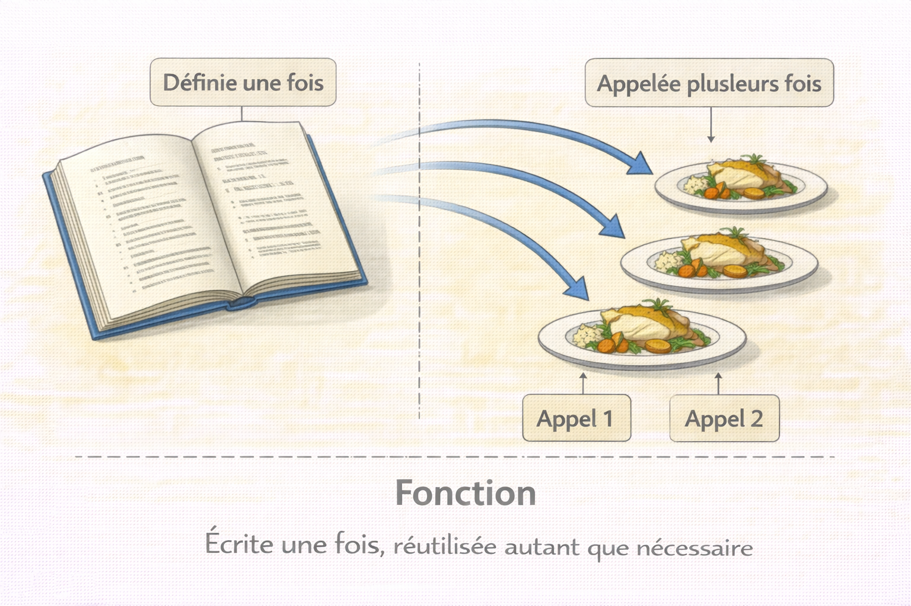
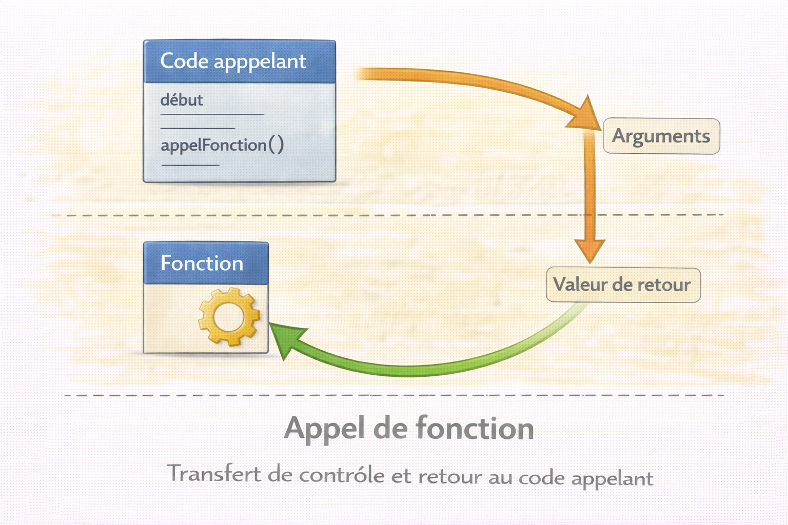
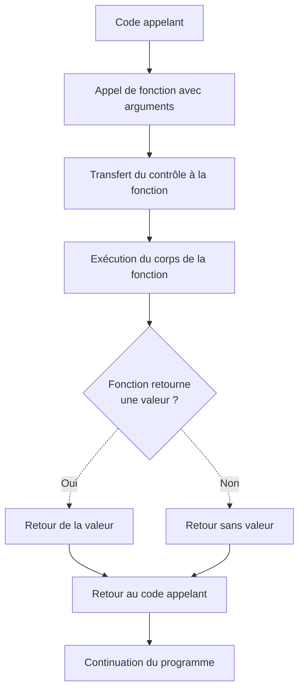
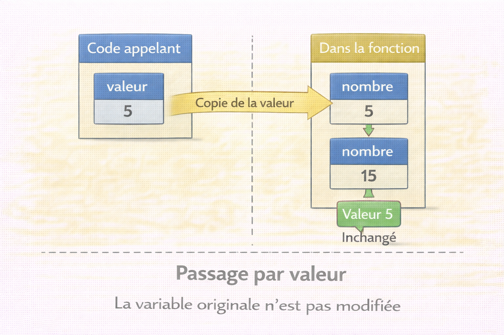
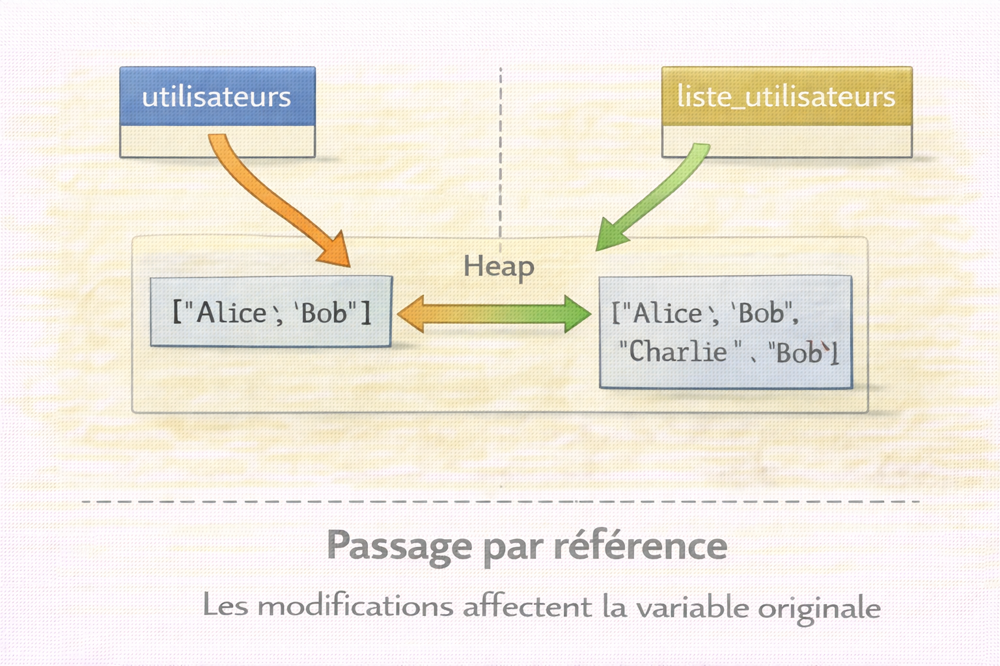
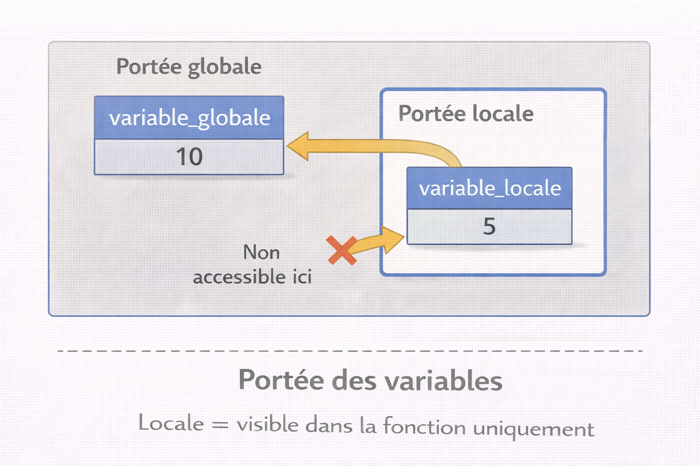

# Fonctions

<div
  class="omny-meta"
  data-level="🟢 Débutant & 🟡 Intermédiaire"
  data-version="1.1"
  data-time="35-40 minutes">
</div>

!!! quote "Analogie"
    _Une recette de cuisine écrite une seule fois dans un livre. Chaque fois qu'on veut préparer ce plat, on consulte simplement la recette au lieu de réécrire toutes les étapes. Les fonctions fonctionnent exactement ainsi : une séquence d'instructions définie une seule fois, appelée autant de fois que nécessaire avec différents ingrédients selon les besoins._

Les types primitifs constituent les briques de base des données, la mémoire les organise entre Stack et Heap, la logique booléenne évalue des conditions, la logique conditionnelle structure les décisions, les structures itératives permettent la répétition. Les fonctions représentent l'outil d'organisation qui **transforme ces compétences en code modulaire, réutilisable et maintenable**. Une fonction encapsule un bloc d'instructions sous un nom significatif, invocable depuis n'importe quelle partie d'un programme.

!!! info "Pourquoi c'est important"
    Les fonctions permettent la **réutilisation du code**, la **décomposition de problèmes complexes**, la **facilitation du débogage** et la **collaboration efficace** entre développeurs. Sans elles, le même code doit être dupliqué à chaque utilisation — multipliant les risques d'erreurs et rendant la maintenance impossible à l'échelle.

!!! note "Cette fiche fait suite aux [Structures Itératives](./structure-iteratives.md). Les fonctions encapsulent fréquemment des conditions et des boucles — leur maîtrise préalable est un prérequis."

<br />

!!! note "L'image ci-dessous ancre l'analogie de la recette avant d'aborder la syntaxe. Visualiser la séparation entre 'définir une fois' et 'utiliser plusieurs fois' est la clé pour comprendre l'intérêt des fonctions."



<p><em>La recette est écrite une seule fois dans le livre. Trois appels, trois plats produits — sans réécrire les étapes. En programmation, la fonction est ce livre : définie une fois, appelée autant de fois que nécessaire, avec des ingrédients (arguments) différents à chaque fois.</em></p>

<br />

---

## Anatomie d'une fonction

Une fonction se compose de quatre éléments fondamentaux qui définissent son comportement et son interface avec le reste du programme.

Le **nom** identifie l'opération effectuée et permet de l'invoquer. Les **paramètres** représentent les données d'entrée reçues lors de l'appel. Le **corps** contient les instructions exécutées à chaque invocation. La **valeur de retour** — optionnelle — communique un résultat au code appelant.

=== ":fontawesome-brands-python: Python"

    ```python title="Python — anatomie d'une fonction"
    def calculer_aire_rectangle(largeur, hauteur):
        """
        Calcule l'aire d'un rectangle.

        Paramètres:
            largeur: La largeur du rectangle
            hauteur: La hauteur du rectangle

        Retourne:
            L'aire calculée
        """
        aire = largeur * hauteur  # Corps — instructions exécutées à chaque appel
        return aire               # Valeur de retour

    # Appel de la fonction
    resultat = calculer_aire_rectangle(5, 10)
    print(f"L'aire est {resultat}")  # 50
    ```

=== ":fontawesome-brands-js: JavaScript"

    ```javascript title="JavaScript — anatomie d'une fonction"
    /**
     * Calcule l'aire d'un rectangle.
     *
     * @param {number} largeur - La largeur du rectangle
     * @param {number} hauteur - La hauteur du rectangle
     * @returns {number} L'aire calculée
     */
    function calculerAireRectangle(largeur, hauteur) {
        const aire = largeur * hauteur;  // Corps
        return aire;                     // Valeur de retour
    }

    // Appel de la fonction
    const resultat = calculerAireRectangle(5, 10);
    console.log(`L'aire est ${resultat}`);  // 50
    ```

=== ":fontawesome-brands-php: PHP"

    ```php title="PHP — anatomie d'une fonction"
    <?php
    /**
     * Calcule l'aire d'un rectangle.
     *
     * @param float $largeur La largeur du rectangle
     * @param float $hauteur La hauteur du rectangle
     * @return float L'aire calculée
     */
    function calculer_aire_rectangle($largeur, $hauteur) {
        $aire = $largeur * $hauteur;  // Corps
        return $aire;                 // Valeur de retour
    }

    // Appel de la fonction
    $resultat = calculer_aire_rectangle(5, 10);
    echo "L'aire est $resultat\n";  // 50
    ?>
    ```

=== ":fontawesome-brands-golang: Go"

    ```go title="Go — anatomie d'une fonction"
    package main

    import "fmt"

    // calculerAireRectangle calcule l'aire d'un rectangle.
    // Paramètres : largeur et hauteur du rectangle (float64)
    // Retourne : l'aire calculée (float64)
    func calculerAireRectangle(largeur, hauteur float64) float64 {
        aire := largeur * hauteur  // Corps
        return aire                // Valeur de retour
    }

    func main() {
        // Appel de la fonction
        resultat := calculerAireRectangle(5, 10)
        fmt.Printf("L'aire est %.0f\n", resultat)  // 50
    }
    ```

    !!! tip "Go — convention `godoc`"
        Le commentaire placé directement au-dessus d'une fonction (`// nomFonction ...`) n'est pas seulement un commentaire : il alimente **`godoc`**, l'outil de documentation officiel Go. En respectant cette convention, la signature et la description de chaque fonction sont automatiquement indexées et consultables via `go doc` ou `pkg.go.dev`. C'est l'équivalent Go de JSDoc ou des docstrings Python.

_Quatre composants essentiels : nom descriptif, paramètres, corps qui effectue le calcul, valeur de retour qui communique le résultat._

<br />

---

## Définition et appel de fonctions

La création d'une fonction se déroule en deux phases distinctes. La **définition** établit ce que la fonction fait. L'**appel** déclenche l'exécution de ce comportement avec des données spécifiques.

<br />

!!! note "L'image ci-dessous matérialise le flux d'exécution lors d'un appel. Comprendre que le contrôle du programme se transfère temporairement à la fonction — puis revient au point d'appel — est ce qui distingue un appel de fonction d'une simple ligne de code."



<p><em>Le code appelant envoie des arguments vers la fonction. La fonction s'exécute, produit un résultat et le renvoie. Le contrôle retourne au code appelant qui continue son exécution avec la valeur reçue. Ce cycle est identique quel que soit le langage.</em></p>

### Schéma du mécanisme d'appel


```mermaid
flowchart TD
  A["Code appelant"] --> B["Appel de fonction avec arguments"]
  B --> C["Transfert du contrôle à la fonction"]
  C --> D["Exécution du corps de la fonction"]
  D --> E{"Fonction retourne<br />une valeur ?"}
  E -.->|"Oui"| F["Retour de la valeur"]
  E -.->|"Non"| G["Retour sans valeur"]
  F --> H["Retour au code appelant"]
  G --> H
  H --> I["Continuation du programme"]
```

_Le contrôle du programme transite temporairement du code appelant vers la fonction, exécute ses instructions, puis retourne au point d'appel avec ou sans valeur._

### Exemples de définition et d'appel

=== ":fontawesome-brands-python: Python"

    ```python title="Python — définition et appel"
    def valider_mot_de_passe(mot_de_passe):
        """Vérifie qu'un mot de passe respecte les critères de sécurité."""
        longueur_minimale  = 8
        contient_chiffre   = any(char.isdigit() for char in mot_de_passe)
        contient_majuscule = any(char.isupper() for char in mot_de_passe)

        return len(mot_de_passe) >= longueur_minimale and contient_chiffre and contient_majuscule

    # Appel avec un argument concret
    password  = "Secure123"
    est_valide = valider_mot_de_passe(password)

    if est_valide:
        print("Mot de passe accepté")
    else:
        print("Mot de passe trop faible")
    ```

=== ":fontawesome-brands-js: JavaScript"

    ```javascript title="JavaScript — définition et appel"
    function verifierAcces(utilisateur, ressource) {
        // Logique de vérification des permissions
        const permissions   = obtenirPermissions(utilisateur);
        const accesAutorise = permissions.includes(ressource);

        return accesAutorise;
    }

    // Appel avec des arguments concrets
    const user  = "Alice";
    const doc   = "Document1";
    const acces = verifierAcces(user, doc);

    if (acces) {
        console.log('Accès autorisé');
    } else {
        console.log('Accès refusé');
    }
    ```

=== ":fontawesome-brands-php: PHP"

    ```php title="PHP — définition et appel"
    <?php
    function verifier_stock($stock_disponible, $quantite_demandee) {
        // Vérifie si le stock est suffisant
        return $stock_disponible >= $quantite_demandee;
    }

    // Appel avec des arguments concrets
    $stock     = 50;
    $demande   = 30;
    $suffisant = verifier_stock($stock, $demande);

    if ($suffisant) {
        echo "Commande acceptée\n";
    } else {
        echo "Stock insuffisant\n";
    }
    ?>
    ```

=== ":fontawesome-brands-golang: Go"

    ```go title="Go — définition et appel"
    package main

    import "fmt"

    func verifierAge(age int) bool {
        // Vérifie si l'utilisateur est majeur
        return age >= 18
    }

    func main() {
        // Appel avec un argument concret
        age    := 20
        majeur := verifierAge(age)

        if majeur {
            fmt.Println("Accès autorisé")
        } else {
            fmt.Println("Accès refusé")
        }
    }
    ```

<br />

---

## Paramètres et arguments

!!! info "Distinction entre paramètres et arguments"
    Les **paramètres** sont les variables déclarées dans la définition de la fonction. Les **arguments** sont les valeurs concrètes fournies lors de l'appel qui remplissent ces paramètres. La distinction reflète deux moments distincts du cycle de vie d'une fonction.

### Paramètres optionnels et valeurs par défaut

=== ":fontawesome-brands-python: Python"

    ```python title="Python — valeurs par défaut"
    def analyser_log(fichier, niveau_minimum="INFO", nombre_lignes=100):
        """Analyse un fichier de log avec des paramètres configurables."""
        print(f"Analyse de {fichier}")
        print(f"Niveau minimum : {niveau_minimum}")
        print(f"Nombre de lignes : {nombre_lignes}")
        # Logique d'analyse

    # Appels avec différents niveaux de personnalisation
    analyser_log("system.log")                    # Valeurs par défaut
    analyser_log("errors.log", "ERROR")           # Niveau personnalisé
    analyser_log("debug.log", "DEBUG", 1000)      # Tout personnalisé
    ```

=== ":fontawesome-brands-js: JavaScript"

    ```javascript title="JavaScript — valeurs par défaut"
    function genererRapport(utilisateur, periode = "mensuel", inclureGraphiques = false) {
        console.log(`Rapport ${periode} pour ${utilisateur}`);

        if (inclureGraphiques) {
            console.log("Ajout des graphiques");
        }

        return `Rapport_${utilisateur}_${periode}.pdf`;
    }

    // Appels variés
    genererRapport("Alice");                           // Valeurs par défaut
    genererRapport("Bob", "annuel");                   // Période personnalisée
    genererRapport("Charlie", "trimestriel", true);    // Tout personnalisé
    ```

=== ":fontawesome-brands-php: PHP"

    ```php title="PHP — valeurs par défaut"
    <?php
    function creer_utilisateur($nom, $role = "user", $actif = true) {
        echo "Création utilisateur: $nom\n";
        echo "Rôle: $role\n";
        echo "Actif: " . ($actif ? "Oui" : "Non") . "\n";
    }

    // Appels variés
    creer_utilisateur("Alice");                      // Valeurs par défaut
    creer_utilisateur("Bob", "admin");               // Rôle personnalisé
    creer_utilisateur("Charlie", "moderator", false); // Tout personnalisé
    ?>
    ```

=== ":fontawesome-brands-golang: Go"

    ```go title="Go — struct pour paramètres optionnels"
    package main

    import "fmt"

    // Go n'a pas de paramètres par défaut natifs — pattern struct recommandé
    type ConfigLog struct {
        Fichier      string
        NiveauMin    string
        NombreLignes int
    }

    func analyserLog(config ConfigLog) {
        // Valeurs par défaut appliquées si non spécifiées
        if config.NiveauMin == "" {
            config.NiveauMin = "INFO"
        }
        if config.NombreLignes == 0 {
            config.NombreLignes = 100
        }

        fmt.Printf("Analyse de %s\n", config.Fichier)
        fmt.Printf("Niveau: %s, Lignes: %d\n", config.NiveauMin, config.NombreLignes)
    }

    func main() {
        // Appels variés
        analyserLog(ConfigLog{Fichier: "system.log"})
        analyserLog(ConfigLog{Fichier: "errors.log", NiveauMin: "ERROR"})
    }
    ```

    !!! tip "Go — pas de paramètres par défaut natifs"
        Go ne dispose pas de valeurs par défaut dans la signature des fonctions. Le pattern struct avec initialisation conditionnelle dans le corps est l'approche idiomatique — plus verbeux, mais comportement toujours explicite.

<br />

---

## Passage par valeur et par référence

Le mécanisme de passage des arguments impacte fondamentalement le comportement des programmes. Cette distinction revisite directement les concepts de Stack et Heap.

### Passage par valeur

Lorsqu'un argument est passé par valeur, la fonction reçoit une copie de la donnée. Les modifications effectuées sur ce paramètre n'affectent pas la variable originale.

<br />

!!! note "L'image ci-dessous rend visible l'indépendance entre la variable originale et sa copie dans la fonction. C'est le même mécanisme que la copie par valeur étudiée dans la fiche Heap/Stack — appliqué ici au contexte des fonctions."



<p><em>La valeur 5 est copiée lors de l'appel. Dans la fonction, la copie devient 15 après modification. La variable originale reste à 5 — les deux sont physiquement indépendantes. Modifier la copie n'affecte jamais l'original.</em></p>

=== ":fontawesome-brands-python: Python"

    ```python title="Python — passage par valeur"
    def incrementer(nombre):
        nombre = nombre + 10                    # Modifie la copie locale
        print(f"Dans la fonction : {nombre}")   # 15
        return nombre

    valeur_originale = 5
    resultat = incrementer(valeur_originale)
    print(f"Après l'appel : {valeur_originale}")  # Toujours 5 — non modifié
    print(f"Valeur retournée : {resultat}")        # 15
    ```

=== ":fontawesome-brands-js: JavaScript"

    ```javascript title="JavaScript — passage par valeur"
    function incrementer(nombre) {
        nombre = nombre + 10;
        console.log(`Dans la fonction : ${nombre}`);  // 15
        return nombre;
    }

    let valeurOriginale = 5;
    const resultat = incrementer(valeurOriginale);
    console.log(`Après l'appel : ${valeurOriginale}`);  // Toujours 5
    console.log(`Valeur retournée : ${resultat}`);       // 15
    ```

=== ":fontawesome-brands-php: PHP"

    ```php title="PHP — passage par valeur"
    <?php
    function incrementer($nombre) {
        $nombre = $nombre + 10;
        echo "Dans la fonction : $nombre\n";  // 15
        return $nombre;
    }

    $valeur_originale = 5;
    $resultat = incrementer($valeur_originale);
    echo "Après l'appel : $valeur_originale\n";  // Toujours 5
    echo "Valeur retournée : $resultat\n";        // 15
    ?>
    ```

=== ":fontawesome-brands-golang: Go"

    ```go title="Go — passage par valeur"
    package main

    import "fmt"

    func incrementer(nombre int) int {
        nombre = nombre + 10
        fmt.Printf("Dans la fonction : %d\n", nombre)  // 15
        return nombre
    }

    func main() {
        valeurOriginale := 5
        resultat := incrementer(valeurOriginale)
        fmt.Printf("Après l'appel : %d\n", valeurOriginale)  // Toujours 5
        fmt.Printf("Valeur retournée : %d\n", resultat)       // 15
    }
    ```

### Passage par référence

Lorsqu'un argument est passé par référence, la fonction reçoit l'adresse mémoire de la donnée. Les modifications effectuées modifient directement la donnée originale.

<br />

!!! note "L'image ci-dessous illustre pourquoi une modification dans la fonction peut affecter le code appelant. C'est le pendant fonctionnel de la copie par adresse étudiée dans la fiche Heap/Stack — la même adresse est partagée entre les deux contextes."



<p><em>Les deux variables — l'originale et le paramètre — pointent vers la même liste en Heap. Ajouter "Charlie" via le paramètre de la fonction modifie la liste accessible depuis les deux côtés. Il n'y a pas deux listes, il y a une seule liste et deux références vers elle.</em></p>

=== ":fontawesome-brands-python: Python"

    ```python title="Python — passage par référence implicite"
    def ajouter_utilisateur(liste_utilisateurs, nouveau_nom):
        liste_utilisateurs.append(nouveau_nom)            # Modifie la liste originale
        print(f"Dans la fonction : {liste_utilisateurs}") # ["Alice", "Bob", "Charlie"]

    utilisateurs = ["Alice", "Bob"]
    ajouter_utilisateur(utilisateurs, "Charlie")
    print(f"Après l'appel : {utilisateurs}")  # ["Alice", "Bob", "Charlie"] — modifié !
    ```

=== ":fontawesome-brands-js: JavaScript"

    ```javascript title="JavaScript — passage par référence implicite"
    function ajouterUtilisateur(listeUtilisateurs, nouveauNom) {
        listeUtilisateurs.push(nouveauNom);
        console.log(`Dans la fonction : ${listeUtilisateurs}`);  // Alice,Bob,Charlie
    }

    const utilisateurs = ["Alice", "Bob"];
    ajouterUtilisateur(utilisateurs, "Charlie");
    console.log(`Après l'appel : ${utilisateurs}`);  // Alice,Bob,Charlie — modifié !
    ```

=== ":fontawesome-brands-php: PHP"

    ```php title="PHP — passage par référence explicite avec &"
    <?php
    function ajouter_utilisateur(&$liste_utilisateurs, $nouveau_nom) {
        // Le & indique explicitement le passage par référence
        $liste_utilisateurs[] = $nouveau_nom;
        echo "Dans la fonction : " . implode(", ", $liste_utilisateurs) . "\n";
    }

    $utilisateurs = ["Alice", "Bob"];
    ajouter_utilisateur($utilisateurs, "Charlie");
    echo "Après l'appel : " . implode(", ", $utilisateurs) . "\n";
    // Alice, Bob, Charlie — modifié !
    ?>
    ```

=== ":fontawesome-brands-golang: Go"

    ```go title="Go — passage par pointeur explicite avec *"
    package main

    import "fmt"

    func ajouterUtilisateur(listeUtilisateurs *[]string, nouveauNom string) {
        // Le * indique un pointeur — modification de la donnée originale
        *listeUtilisateurs = append(*listeUtilisateurs, nouveauNom)
        fmt.Printf("Dans la fonction : %v\n", *listeUtilisateurs)
    }

    func main() {
        utilisateurs := []string{"Alice", "Bob"}
        ajouterUtilisateur(&utilisateurs, "Charlie")  // & passe l'adresse
        fmt.Printf("Après l'appel : %v\n", utilisateurs)
        // [Alice Bob Charlie] — modifié !
    }
    ```

!!! warning "Effets de bord non intentionnels"
    Le passage par référence peut créer des effets de bord[^1] non intentionnels. Pour l'éviter, créer explicitement une copie de la donnée à l'intérieur de la fonction avant de la modifier.

<br />

---

## Valeurs de retour

Les valeurs de retour permettent aux fonctions de communiquer des résultats au code appelant après avoir complété leur traitement.

### Retours multiples

=== ":fontawesome-brands-python: Python"

    ```python title="Python — retours multiples par déstructuration"
    def analyser_connexion(ip_address):
        """Analyse une connexion et retourne plusieurs informations."""
        est_autorisee     = verifier_liste_blanche(ip_address)
        nombre_tentatives = compter_tentatives(ip_address)
        niveau_risque     = evaluer_risque(ip_address, nombre_tentatives)

        return est_autorisee, nombre_tentatives, niveau_risque  # Tuple

    # Déstructuration des valeurs retournées
    autorisee, tentatives, risque = analyser_connexion("192.168.1.100")
    print(f"Autorisée: {autorisee}, Tentatives: {tentatives}, Risque: {risque}")
    ```

=== ":fontawesome-brands-js: JavaScript"

    ```javascript title="JavaScript — retour par objet déstructuré"
    function analyserConnexion(ipAddress) {
        const estAutorisee     = verifierListeBlanche(ipAddress);
        const nombreTentatives = compterTentatives(ipAddress);
        const niveauRisque     = evaluerRisque(ipAddress, nombreTentatives);

        return { estAutorisee, nombreTentatives, niveauRisque };  // Objet
    }

    // Déstructuration de l'objet retourné
    const { estAutorisee, nombreTentatives, niveauRisque } = analyserConnexion("192.168.1.100");
    console.log(`Autorisée: ${estAutorisee}, Tentatives: ${nombreTentatives}`);
    ```

=== ":fontawesome-brands-php: PHP"

    ```php title="PHP — retour par tableau associatif"
    <?php
    function analyser_connexion($ip_address) {
        $est_autorisee     = verifier_liste_blanche($ip_address);
        $nombre_tentatives = compter_tentatives($ip_address);
        $niveau_risque     = evaluer_risque($ip_address, $nombre_tentatives);

        return [
            'autorisee'  => $est_autorisee,
            'tentatives' => $nombre_tentatives,
            'risque'     => $niveau_risque
        ];
    }

    // Accès aux valeurs du tableau retourné
    $resultat = analyser_connexion("192.168.1.100");
    echo "Autorisée: {$resultat['autorisee']}, Tentatives: {$resultat['tentatives']}\n";
    ?>
    ```

=== ":fontawesome-brands-golang: Go"

    ```go title="Go — retours multiples natifs"
    package main

    import "fmt"

    // Go supporte nativement les retours multiples dans la signature
    func analyserConnexion(ipAddress string) (bool, int, string) {
        estAutorisee     := verifierListeBlanche(ipAddress)
        nombreTentatives := compterTentatives(ipAddress)
        niveauRisque     := evaluerRisque(ipAddress, nombreTentatives)

        return estAutorisee, nombreTentatives, niveauRisque
    }

    func main() {
        autorisee, tentatives, risque := analyserConnexion("192.168.1.100")
        fmt.Printf("Autorisée: %v, Tentatives: %d, Risque: %s\n", autorisee, tentatives, risque)
    }
    ```

    !!! tip "Go — retours multiples natifs"
        Go est le seul langage de la série à supporter les retours multiples directement dans la signature de la fonction. C'est une fonctionnalité particulièrement utile pour retourner à la fois une valeur et une erreur — pattern omniprésent en Go.

<br />

---

## Portée des variables

La **portée** d'une variable détermine dans quelles parties du programme elle reste accessible. Ce concept évite des bugs subtils liés à des variables qui semblent disparaître ou changer sans raison apparente.

<br />

!!! note "L'image ci-dessous rend visible la frontière entre portée locale et portée globale. Comprendre que cette frontière est physique — et non une convention — est essentiel pour diagnostiquer les erreurs de type 'variable non définie'."



<p><em>La variable locale existe uniquement à l'intérieur de la fonction — toute tentative d'y accéder depuis l'extérieur produit une erreur. La variable globale, déclarée hors de toute fonction, est visible depuis les deux zones. La frontière entre les deux portées est clairement délimitée.</em></p>

### Variables locales

Les variables déclarées à l'intérieur d'une fonction ont une portée locale limitée à cette fonction. Elles sont créées à l'entrée de la fonction et détruites à sa sortie.

=== ":fontawesome-brands-python: Python"

    ```python title="Python — portée locale"
    def traiter_donnees():
        resultat_temporaire = 42   # Variable locale — visible uniquement ici
        print(f"Dans la fonction : {resultat_temporaire}")
        return resultat_temporaire

    valeur = traiter_donnees()
    # print(resultat_temporaire)   # ERREUR — NameError : variable non définie ici
    print(f"Valeur retournée : {valeur}")  # OK — 42
    ```

=== ":fontawesome-brands-js: JavaScript"

    ```javascript title="JavaScript — portée locale"
    function traiterDonnees() {
        const resultatTemporaire = 42;  // Variable locale
        console.log(`Dans la fonction : ${resultatTemporaire}`);
        return resultatTemporaire;
    }

    const valeur = traiterDonnees();
    // console.log(resultatTemporaire);  // ERREUR — ReferenceError
    console.log(`Valeur retournée : ${valeur}`);  // OK — 42
    ```

=== ":fontawesome-brands-php: PHP"

    ```php title="PHP — portée locale"
    <?php
    function traiter_donnees() {
        $resultat_temporaire = 42;  // Variable locale
        echo "Dans la fonction : $resultat_temporaire\n";
        return $resultat_temporaire;
    }

    $valeur = traiter_donnees();
    // echo $resultat_temporaire;   // Vide en PHP — variable indéfinie hors fonction
    echo "Valeur retournée : $valeur\n";  // OK — 42
    ?>
    ```

=== ":fontawesome-brands-golang: Go"

    ```go title="Go — portée locale"
    package main

    import "fmt"

    func traiterDonnees() int {
        resultatTemporaire := 42   // Variable locale
        fmt.Printf("Dans la fonction : %d\n", resultatTemporaire)
        return resultatTemporaire
    }

    func main() {
        valeur := traiterDonnees()
        // fmt.Println(resultatTemporaire)  // ERREUR — undefined
        fmt.Printf("Valeur retournée : %d\n", valeur)  // OK — 42
    }
    ```

!!! warning "Variables globales — usage à limiter"
    Les variables globales créent des couplages invisibles entre différentes parties du code. Deux fonctions qui partagent une variable globale deviennent dépendantes l'une de l'autre sans que cela soit visible dans leurs signatures. Privilégier le passage explicite de paramètres et de valeurs de retour.

<br />

---

## Implicite vs Explicite selon les langages

Les langages adoptent des philosophies distinctes concernant l'explicité des informations dans la définition et l'utilisation des fonctions.

### Typage des paramètres et retours

**Langages à typage implicite** — Python, JavaScript, PHP : les types ne sont pas déclarés dans la signature. Flexibilité accrue, erreurs de type détectées uniquement à l'exécution.

**Langages à typage explicite** — Go : les types doivent être déclarés. Erreurs détectées à la compilation, comportement prévisible.

=== ":fontawesome-brands-python: Python"

    ```python title="Python — typage implicite de base"
    # Pas de types dans la signature
    def calculer_somme(a, b):   # Types non déclarés
        return a + b            # Type de retour non spécifié
    ```

    !!! tip "Annotations de type Python — le meilleur des deux mondes"
        Python 3.5+ introduit les **annotations de type** : elles restent optionnelles mais permettent de documenter l'intention sans sacrifier la flexibilité. Les outils comme `mypy` ou les IDE les utilisent pour détecter les incohérences avant l'exécution.

    ```python title="Python — annotations de type (Python 3.5+)"
    # Annotations optionnelles — syntaxe : paramètre: type -> type_retour
    def calculer_somme(a: int, b: int) -> int:
        return a + b

    def valider_email(adresse: str) -> bool:
        return "@" in adresse and "." in adresse

    def analyser_log(fichier: str, niveau: str = "INFO") -> list[str]:
        """Les valeurs par défaut se combinent naturellement avec les annotations."""
        ...
    ```

    _Les annotations ne modifient pas le comportement du programme — Python les ignore à l'exécution. Elles servent de **documentation vivante** et sont de plus en plus répandues dans le code Python professionnel._

=== ":fontawesome-brands-js: JavaScript"

    ```javascript title="JavaScript — typage implicite"
    // Pas de types dans la signature (TypeScript les ajoute optionnellement)
    function calculerSomme(a, b) {  // Types non déclarés
        return a + b;
    }
    ```

=== ":fontawesome-brands-php: PHP"

    ```php title="PHP — typage optionnel (PHP 7+)"
    <?php
    // PHP 7+ permet le typage optionnel
    function calculer_somme(int $a, int $b): int {  // Types optionnels
        return $a + $b;
    }
    ?>
    ```

=== ":fontawesome-brands-golang: Go"

    ```go title="Go — typage explicite obligatoire"
    // Types obligatoires dans la signature
    func calculerSomme(a int, b int) int {  // Types déclarés — obligatoire
        return a + b
    }
    ```

### Passage par référence implicite vs explicite

**Implicite** — Python, JavaScript : les objets et collections sont automatiquement passés par référence. Aucune syntaxe spéciale, comportement invisible dans la signature.

**Explicite** — PHP, Go : le passage par référence nécessite une syntaxe spécifique. La signature de la fonction indique clairement le comportement.

| Approche | Avantages | Inconvénients |
|---|---|---|
| **Implicite** | Code concis, développement rapide | Comportement parfois surprenant, erreurs tardives |
| **Explicite** | Comportement clair et prévisible, erreurs à la compilation | Code plus verbeux, courbe d'apprentissage |

!!! tip "Philosophie des langages"
    Python et JavaScript privilégient la rapidité de développement avec moins de cérémonie syntaxique. Go privilégie la clarté et la sécurité avec une explicité qui rend le comportement du code immédiatement visible dans la signature. PHP se situe entre les deux, offrant le typage optionnel depuis PHP 7.

<br />

---

## Bonnes pratiques

### Une seule responsabilité par fonction

```python title="Python — décomposition en sous-fonctions"
def authentifier_utilisateur(nom_utilisateur, mot_de_passe):
    """Authentifie un utilisateur selon plusieurs critères — orchestration de sous-fonctions."""

    # Chaque sous-fonction a une responsabilité unique
    if not utilisateur_existe(nom_utilisateur):
        return False, "Utilisateur inconnu"

    if not verifier_mot_de_passe(nom_utilisateur, mot_de_passe):
        incrementer_tentatives_echec(nom_utilisateur)
        return False, "Mot de passe incorrect"

    if compte_est_bloque(nom_utilisateur):
        return False, "Compte bloqué"

    enregistrer_connexion_reussie(nom_utilisateur)
    return True, "Authentification réussie"
```

### Documentation systématique

=== ":fontawesome-brands-python: Python"

    ```python title="Python — docstring complète"
    def valider_format_email(adresse_email):
        """
        Vérifie qu'une adresse email respecte le format standard.

        Paramètres:
            adresse_email (str): L'adresse email à valider

        Retourne:
            bool: True si le format est valide, False sinon
        """
        if not adresse_email or "@" not in adresse_email:
            return False

        parties = adresse_email.split("@")
        if len(parties) != 2:
            return False

        utilisateur, domaine = parties
        return len(utilisateur) > 0 and len(domaine) > 3 and "." in domaine
    ```

=== ":fontawesome-brands-js: JavaScript"

    ```javascript title="JavaScript — JSDoc"
    /**
     * Vérifie qu'une adresse email respecte le format standard.
     *
     * @param {string} adresseEmail - L'adresse email à valider
     * @returns {boolean} True si le format est valide
     */
    function validerFormatEmail(adresseEmail) {
        if (!adresseEmail || !adresseEmail.includes('@')) {
            return false;
        }

        const parties = adresseEmail.split('@');
        if (parties.length !== 2) {
            return false;
        }

        const [utilisateur, domaine] = parties;
        return utilisateur.length > 0 && domaine.length > 3 && domaine.includes('.');
    }
    ```

Quatre règles à appliquer systématiquement. Une seule responsabilité par fonction — si une fonction fait "et ceci et cela", la diviser. Nommer les fonctions avec un verbe d'action qui décrit précisément ce qu'elles font. Limiter le nombre de paramètres à cinq maximum — au-delà, regrouper dans une structure. Documenter systématiquement les fonctions destinées à être réutilisées.

!!! danger "Fonctions monolithiques"
    Une fonction dépassant cinquante lignes devrait déclencher une réflexion sur sa décomposition. Les fonctions courtes facilitent considérablement la compréhension, les tests et la maintenance.

!!! warning "Validation des entrées"
    Vérifier toujours les valeurs d'entrée avant de les utiliser. Une fonction robuste valide ses paramètres et retourne des valeurs ou des signaux d'erreur appropriés plutôt que de planter silencieusement.

<br />

---

## Conclusion

!!! quote "Ce qu'il faut retenir"
    Ces notions fondamentales sur fonctions sont essentielles pour la suite de votre parcours. Consolidez ces acquis théoriques par la pratique avant de passer aux modules spécialisés (Cybersécurité, Infrastructure ou Développement).

!!! quote "Conclusion"
    _Les fonctions constituent les briques fondamentales qui transforment du code procédural linéaire en architectures modulaires maintenables. Au début, identifier les blocs répétitifs demande un effort conscient. Avec la pratique, décomposer naturellement les problèmes en fonctions ciblées devient un réflexe._

    _Chaque fonction bien conçue est une abstraction qui simplifie le programme. Plus l'art de créer des fonctions focalisées et bien nommées est maîtrisé, plus les programmes gagnent en clarté, en testabilité et en évolutivité._

<br />

[^1]: Un **effet de bord** désigne une modification inattendue ou non souhaitée de l'état d'un programme provoquée par l'exécution d'une fonction, comme altérer une variable globale ou modifier une ressource externe alors qu'on attendait seulement un calcul.