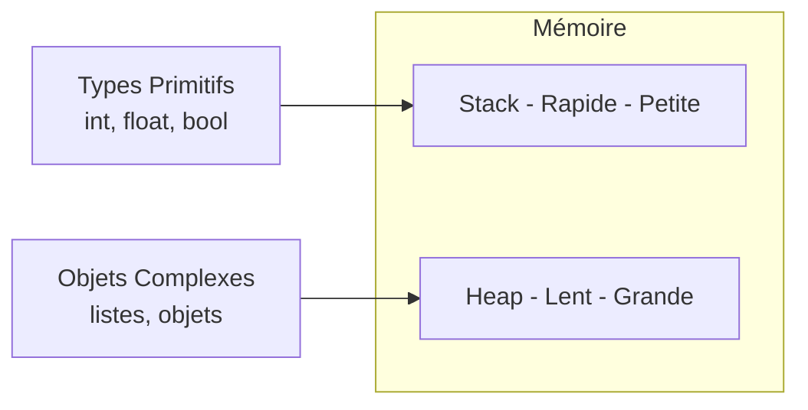
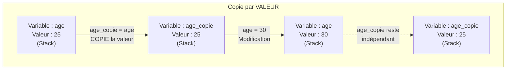
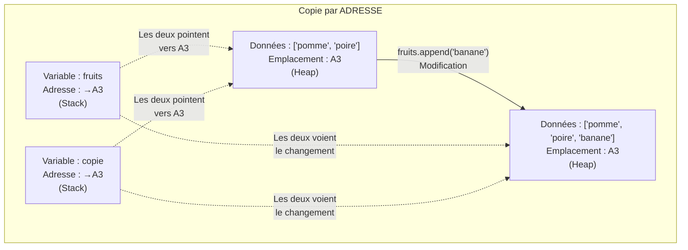

# Heap, Stack et Références

## Introduction

**Niveau :** Débutant & Intermédiaire

!!! quote "Analogie pédagogique"
    _Imaginez que vous rangez vos affaires dans votre maison. Certaines choses, vous les mettez **sur votre bureau** pour y accéder rapidement. D'autres, vous les stockez **dans votre armoire** car elles prennent plus de place. Votre ordinateur fait **exactement la même chose** avec vos données !_

Cette organisation s'appelle la **gestion mémoire**. Comprendre où vont vos données vous aidera à comprendre pourquoi vos programmes sont parfois lents, à éviter les plantages mystérieux, à prévoir ce qui va se passer quand vous modifiez vos données, et à débugger plus facilement.

!!! info "Pourquoi c'est important ?"
    La compréhension de la gestion mémoire impacte la **vitesse** de vos programmes, leur **stabilité**, la **prévisibilité** de vos modifications et votre **confiance** dans le code que vous écrivez.

## Pour les vrais débutants

Si vous n'avez pas encore lu la documentation sur les **types primitifs**, nous vous recommandons de commencer par là. Elle vous donnera les bases nécessaires pour bien comprendre cette section.

!!! tip "Restez zen !"
    Ce sujet peut paraître complexe au début, mais nous allons y aller **pas à pas** avec des analogies simples. L'objectif n'est pas de tout retenir par cœur, mais de **comprendre les concepts** fondamentaux.

## Stack et Heap - Les deux zones mémoire

Votre ordinateur range vos données dans deux zones distinctes, chacune avec ses avantages.

### Stack (Pile) - Votre bureau

La **Stack** est comme votre bureau : un espace limité mais avec un **accès ultra-rapide**. C'est là que l'ordinateur range vos **données simples** et les **adresses** vers vos données complexes.

**Ce qu'on trouve sur la Stack :**

- Variables simples avec leurs valeurs (nombres, texte court, vrai/faux)
- Adresses vers les données complexes (comme un post-it avec une adresse)
- Informations sur les fonctions (qui appelle qui, où revenir après)

### Heap (Tas) - Votre armoire

Le **Heap** est comme votre armoire : beaucoup plus d'espace mais **accès plus lent**. C'est là que l'ordinateur range vos **données volumineuses et complexes**.

**Ce qu'on trouve dans le Heap :**

- Objets complets avec toutes leurs données
- Listes et collections (vos albums photos, vos playlists)
- Structures complexes créées pendant l'exécution



_La **Stack** fonctionne comme une **pile d'assiettes** : vous ajoutez et retirez toujours par le dessus.  
Le **Heap** offre plus de flexibilité pour stocker des structures qui grandissent ou rétrécissent.  
Cette distinction explique pourquoi certaines opérations sont plus rapides que d'autres !_

## Le piège à comprendre absolument

Voici **LE concept** qui fait la différence entre un débutant et un développeur qui maîtrise la gestion mémoire.

### Ce qu'on pense naturellement (faux)

Quand on copie une variable contenant une liste, on pense copier la liste entière.

### Ce qui se passe vraiment

Quand on copie une variable contenant une liste, on copie juste **l'adresse** vers cette liste dans le Heap. Les deux variables pointent maintenant vers la **même liste** !

```python
# Langage : Python
# ----------------------------------------------------------------
# Exemple du piège classique
mes_fruits = ["pomme", "poire"]
copie_fruits = mes_fruits  # On copie l'ADRESSE, pas la liste !

mes_fruits.append("banane")

print(copie_fruits)  # ["pomme", "poire", "banane"] - SURPRISE !
```

!!! danger "ATTENTION"
    Si vous ne comprenez pas ce mécanisme, vous aurez des **bugs mystérieux** où vos données changent "toutes seules" sans que vous compreniez pourquoi !

### Copie par valeur vs Copie par adresse

#### Copie par VALEUR - Types simples

_Le premier diagramme illustre le mécanisme de **copie par valeur** qui s'applique aux types simples comme les **nombres**, les **booléens** ou les **caractères**. Lorsque vous créez une copie d'une **variable contenant un type simple**, l'ordinateur duplique intégralement la valeur dans un nouvel emplacement de la Stack._

!!! info ""
    _**Chaque variable possède alors sa propre copie indépendante de la donnée**. Cette indépendance garantit que toute modification apportée à la variable originale n'affecte en aucun cas la copie, et inversement. Les deux variables évoluent de manière totalement autonome car elles occupent des emplacements mémoire physiquement distincts sur votre bureau numérique._

#### Copie par ADRESSE - Objets/Listes

_Le second diagramme présente le mécanisme de **copie par adresse** qui régit les **structures complexes** telles que les **listes**, les **tableaux** et les **objets**. Contrairement au mécanisme précédent, **la copie d'une variable contenant une structure complexe ne duplique pas les données elles-mêmes**. **Seule l'adresse mémoire pointant vers ces données dans le Heap est copiée**._

!!! info ""
    _**Les deux variables conservent donc des références identiques vers un unique ensemble de données partagées dans l'armoire numérique**. Cette architecture explique pourquoi la modification des données via l'une des variables se répercute immédiatement sur toutes les autres variables partageant la même adresse. **Toutes observent simultanément les changements car elles consultent le même emplacement mémoire dans le Heap**._

## Comportement par langage

### Python - Tout est objet

En Python, techniquement tout est objet, mais le comportement des types simples ressemble à celui de la Stack.

```python
# Langage : Python
# ----------------------------------------------------------------
# Types simples - se comportent comme s'ils étaient sur le bureau
age = 25
age_copie = age
age = 30
print(age_copie)  # 25 - pas changé

# Listes - dans l'armoire avec juste l'adresse sur le bureau
fruits = ["pomme", "poire"]
fruits_copie = fruits  # Copie l'adresse !
fruits.append("banane")
print(fruits_copie)  # ["pomme", "poire", "banane"] - changé aussi !

# Solution : vraie copie
fruits_vraie_copie = fruits.copy()
fruits.append("orange")
print(fruits_vraie_copie)  # ["pomme", "poire", "banane"] - pas d'orange !
```

!!! tip "Astuce Python"
    Python recycle les petits nombres (de -5 à 256) pour économiser la mémoire.  
    Deux variables avec la valeur 42 pointent vers le même objet !

### JavaScript - Primitifs vs Objets

JavaScript fait une distinction claire entre types primitifs (**sur la Stack**) et objets (**dans le Heap**).

```javascript
// Langage : JavaScript
// ----------------------------------------------------------------
// Primitifs - sur le bureau, copie complète
let age = 25;
let ageCopie = age;
age = 30;
console.log(ageCopie);  // 25 - pas changé

// Objets - dans l'armoire, copie d'adresse
let personne = { nom: 'Alice', age: 25 };
let personneCopie = personne;  // Copie l'adresse !
personne.age = 30;
console.log(personneCopie.age);  // 30 - changé aussi !

// Solution : vraie copie avec spread operator
let personneVraieCopie = { ...personne };
personne.age = 35;
console.log(personneVraieCopie.age);  // 30 - pas changé !
```

!!! warning "Piège JavaScript"
    `typeof null` retourne `"object"` mais `null` est un type primitif.  
    C'est un bug historique jamais corrigé !

### PHP - Le pouvoir du &

PHP permet de choisir explicitement entre **copie de valeur** et **copie d'adresse** avec l'opérateur `&`.

```php
# Langage : PHP
# ----------------------------------------------------------------
<?php
// Par défaut : copie de valeur
$nombre = 10;
$copie = $nombre;  // Vraie copie
$nombre = 20;
echo $copie;  // 10 - pas changé

// Avec & : partage d'adresse
$nombre2 = 10;
$reference = &$nombre2;  // Même adresse !
$nombre2 = 20;
echo $reference;  // 20 - changé aussi !

// Tableaux : comportement spécial
$fruits = ["pomme", "poire"];
$copie_fruits = $fruits;  // Copie réelle par défaut
$fruits[] = "banane";
print_r($copie_fruits);  // ["pomme", "poire"] - pas changé !
?>
```

!!! tip "Particularité PHP"
    **PHP copie les tableaux par valeur par défaut**, contrairement à Python et JavaScript qui copient l'adresse.  
    Utilisez `&` pour **créer une référence**.

### Go - Explicite et strict

Go vous force à être explicite sur vos intentions. **Les pointeurs** rendent la gestion mémoire visible.

```go
// Langage : Go
// ----------------------------------------------------------------
package main
import "fmt"

func main() {
    // Valeur simple - copie complète
    age := 25
    ageCopie := age
    age = 30
    fmt.Println(ageCopie)  // 25
    
    // Pointeur - copie d'adresse
    nombre := 42
    pointeur := &nombre  // Adresse explicite avec &
    *pointeur = 100      // Modification via le pointeur
    fmt.Println(nombre)  // 100 - changé !
    
    // Slice - référence automatique
    fruits := []string{"pomme", "poire"}
    copie := fruits
    fruits = append(fruits, "banane")
    fmt.Println(copie)  // ["pomme", "poire"] - capacité peut changer
}
```

!!! tip "Go explicite"
    Go vous oblige à utiliser `&` pour obtenir une adresse et `*` pour accéder à la valeur. **Pas de surprise** !

### Rust - Sécurité maximale

Rust utilise un système d'**ownership**[^1] (propriété) qui garantit qu'une seule variable possède une donnée à la fois.

```rust
// Langage : Rust
// ----------------------------------------------------------------
fn main() {
    // Valeur simple - copie automatique (trait Copy)
    let age = 25;
    let age_copie = age;
    println!("{}", age);  // 25 - OK

    // String - déplacement de propriété !
    let nom = String::from("Alice");
    let nom_copie = nom;
    // println!("{}", nom);  // ERREUR de compilation !
    println!("{}", nom_copie);  // OK
    
    // Solution : clone explicite
    let nom2 = String::from("Bob");
    let nom2_copie = nom2.clone();
    println!("{} et {}", nom2, nom2_copie);  // OK les deux !
    
    // Références - emprunt temporaire
    let fruits = vec!["pomme", "poire"];
    let reference = &fruits;  // Emprunt
    println!("{:?}", reference);  // OK
    println!("{:?}", fruits);  // OK aussi !
}
```

!!! tip "Sécurité Rust"
    Rust **refuse de compiler** si vous risquez d'avoir deux variables qui possèdent les mêmes données.  
    **Zéro surprise en production** !

## Comparaison rapide

| Langage | Types simples | Objets/Listes | Particularité |
| --- | :---: | :---: | --- |
| **Python** | Bureau* | Armoire | Tout est objet |
| **JavaScript** | Bureau | Armoire | Distinction claire |
| **PHP** | Bureau | Bureau/Armoire | Tableaux copiés par défaut |
| **Go** | Bureau | Pointeurs explicites | `&` et `*` obligatoires |
| **Rust** | Bureau | Ownership strict | Sécurité à la compilation |

_* Comportement similaire au bureau même si techniquement ce sont des objets_

## Règles d'or pour éviter les pièges

!!! tip "Trois règles essentielles"
    **Règle 1** : Si vos données changent sans que vous l'ayez voulu, plusieurs variables pointent probablement vers la même adresse. **Solution** : faites une vraie copie !
    
    **Règle 2** : Avant de modifier une liste ou un objet, demandez-vous "_est-ce que d'autres variables utilisent les mêmes données ?_"
    
    **Règle 3** : En cas de doute, utilisez `.copy()` en Python, le spread `{...}` en JavaScript, ou `clone()` en Rust.

## Le nettoyage automatique

Bonne nouvelle : vous n'avez **pas à vous soucier du nettoyage** !

Tous ces langages disposent d'un **Garbage Collector** (ramasse-miettes) qui nettoie automatiquement la mémoire quand vous n'utilisez plus vos données. C'est comme un majordome invisible qui range votre armoire dès que vous n'avez plus besoin de quelque chose.

```python
# Langage : Python
# ----------------------------------------------------------------
def exemple_nettoyage():
    grosse_liste = [i for i in range(100000)]  # Créée dans le Heap
    # Utilisation de la liste...
    # À la fin de la fonction, plus personne n'utilise grosse_liste
    # → Le garbage collector la supprime automatiquement !
```

## Conseils pour débuter

!!! tip "Pour bien démarrer"
    Commencez par maîtriser les types simples avant les structures complexes. Utilisez `.copy()` dès que vous avez un doute. Affichez vos données avant et après chaque modification pour comprendre ce qui se passe. Créez volontairement des bugs pour observer leur comportement.

### Outil de debug simple

```python
# Langage : Python
# ----------------------------------------------------------------
# Voir si deux variables partagent la même adresse
fruits1 = ["pomme"]
fruits2 = ["pomme"]
fruits3 = fruits1

print(id(fruits1))  # Adresse 1
print(id(fruits2))  # Adresse 2 (différente)
print(id(fruits3))  # Adresse 1 (même que fruits1)

# fruits1 et fruits3 partagent les mêmes données !
```

## Le mot de la fin

!!! quote
    La gestion mémoire, c'est comme apprendre à conduire : _au début on y pense tout le temps, puis ça devient un réflexe naturel !_ **L'important n'est pas de tout mémoriser, mais de comprendre la logique**.  
    
    Avec de la pratique, vous développerez intuitivement les bons réflexes.

---

!!! abstract "Métadonnées"
    **Version** : 1.0  
    **Dernière mise à jour** : Novembre 2025  
    **Durée de lecture** : 20-25 minutes  
    **Niveau** : Débutant & Intermédiaire

[^1]: **Ownership** signifie la responsabilité pleine et assumée d’un sujet, d’une action ou d’un résultat, avec l’obligation d’en répondre et d’en assurer la bonne exécution.
