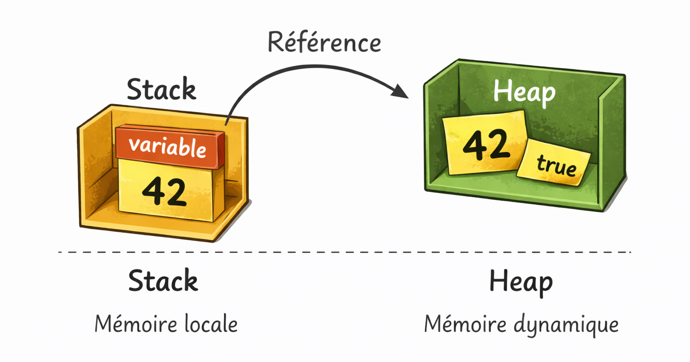
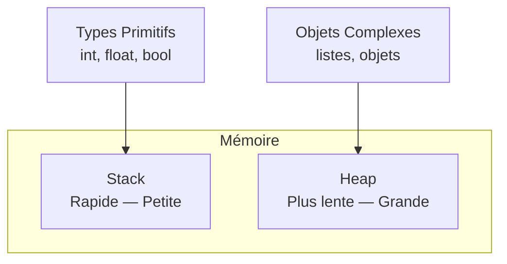
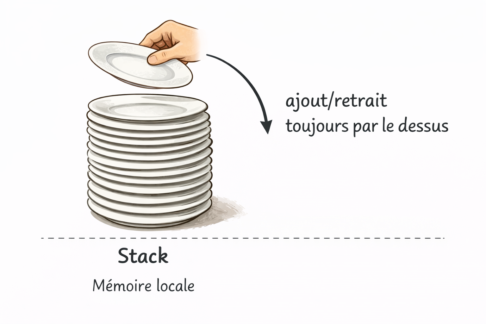
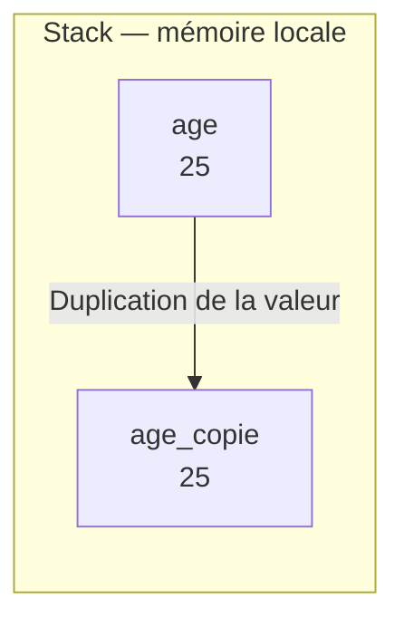
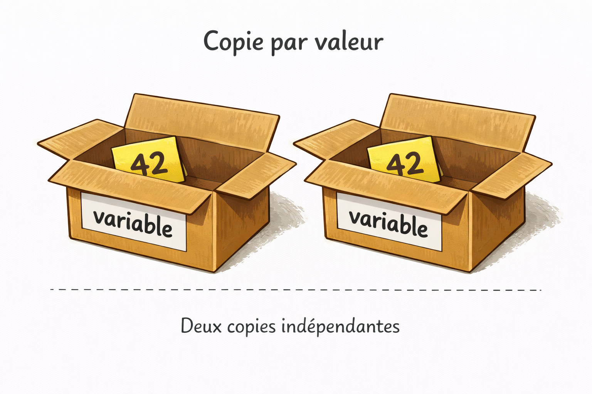
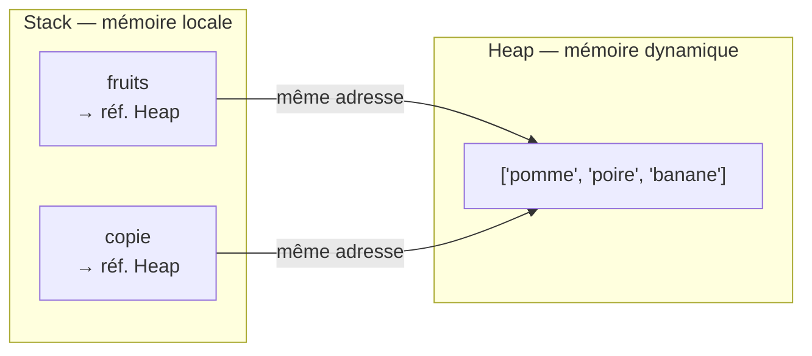
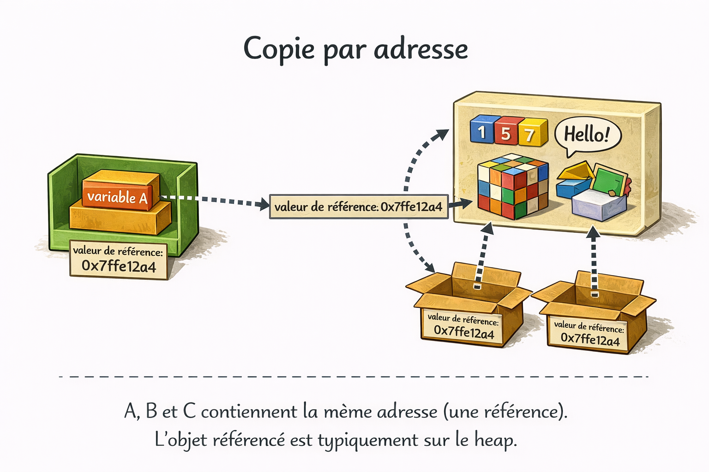
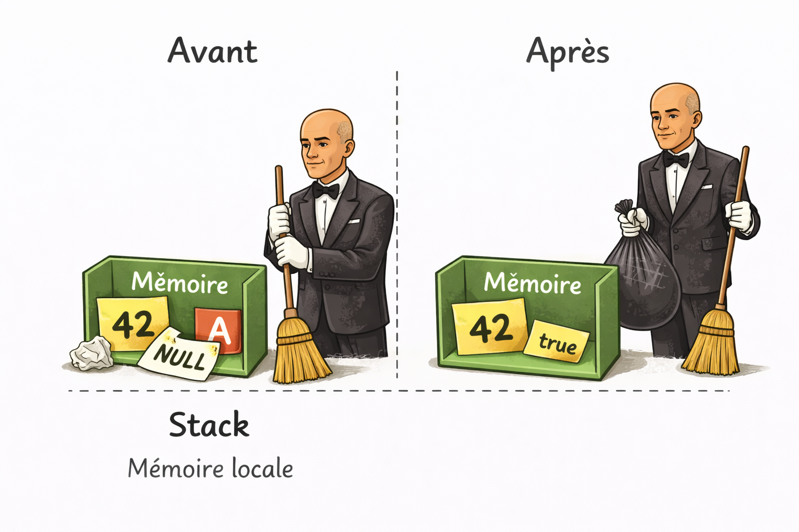

# Heap, Stack et Références

<div
  class="omny-meta"
  data-level="🟢 Débutant & 🟡 Intermédiaire"
  data-version="1.3"
  data-time="20-25 minutes">
</div>

!!! quote "Analogie"
    _Ranger ses affaires dans une maison : certaines choses se posent sur le bureau pour un accès immédiat, d'autres s'entreposent dans l'armoire car elles prennent plus de place. Un ordinateur applique exactement le même principe avec les données._

Cette organisation s'appelle la **gestion mémoire**. Comprendre où vont les données aide à comprendre pourquoi certains programmes sont lents, à éviter des plantages difficiles à diagnostiquer, à prévoir ce qui se passe lors d'une modification, et à déboguer plus efficacement.

!!! info "Pourquoi c'est important"
    La compréhension de la gestion mémoire impacte la **vitesse** des programmes, leur **stabilité**, la **prévisibilité** des modifications et la **confiance** dans le code produit.

!!! note "Cette fiche fait suite aux [Types Primitifs](./types-primitifs.md). **La lire en premier réduit la friction lors de la découverte de ce sujet**."

<br />

---

## Pour repartir des bases

Une **variable** est un espace nommé en mémoire permettant de stocker une valeur. On lui donne un nom — appelé identifiant — pour pouvoir y faire référence dans le code. Ce nom est l'étiquette ; ce qui est stocké dedans est le type primitif.

Un programme manipule en permanence des variables : il en crée, les modifie, les compare et les transmet. Comprendre ce mécanisme de base est le prérequis à tout le reste.

!!! note "Cette image a déjà été présentée dans la fiche [Types Primitifs](./types-primitifs.md) — **elle est reprise ici volontairement pour ancrer le lien entre variable, identifiant et type avant d'aborder la gestion mémoire**."


<p><em>Une variable est une boite portant une étiquette (son identifiant dans le code). Ce qu'on y range est le type primitif : un nombre entier comme 42, un caractère comme A, ou un booléen comme true. La boite ne contient qu'un seul type à la fois — changer la valeur remplace ce qui était stocké dedans.</em></p>

<br />

---

## Stack et Heap — les deux zones mémoire

L'ordinateur range les données dans deux zones distinctes, chacune avec ses caractéristiques propres.

### Stack (Pile) — la mémoire locale

La **Stack** est un espace limité mais avec un accès ultra-rapide.
C'est là que sont rangées les **données simples** et les **adresses** vers les données complexes.

Ce qu'on trouve en Stack :

- Variables simples avec leurs valeurs (nombres, booléens)
- Adresses pointant vers des données complexes stockées en Heap
- Informations d'exécution des fonctions (pile d'appels, valeurs de retour)

### Heap (Tas) — la mémoire dynamique

Le **Heap** offre beaucoup plus d'espace mais un accès plus lent.
C'est là que sont rangées les **données volumineuses et complexes**.

Ce qu'on trouve en Heap :

- Objets complets avec leurs attributs
- Collections (listes, tableaux, dictionnaires)
- Structures créées dynamiquement pendant l'exécution

<br />

!!! note "L'image ci-dessous représente la relation fondamentale entre Stack et Heap. Comprendre cette distinction est la clé de toute la suite de cette fiche."



<p><em>La Stack (mémoire locale) contient la variable et sa valeur directe — ici l'entier 42. Lorsqu'une donnée est trop volumineuse pour la Stack, seule son adresse y est stockée, et la donnée réelle est placée dans le Heap (mémoire dynamique). La flèche "Référence" matérialise ce lien entre les deux zones.</em></p>

<br />

### Schéma explicatif


```mermaid
flowchart TB
  subgraph Mémoire
    Stack["Stack<br />Rapide — Petite"]
    Heap["Heap<br />Plus lente — Grande"]
  end

  Primitifs["Types Primitifs<br />int, float, bool"] --> Stack
  Objets["Objets Complexes<br />listes, objets"] --> Heap
```

<br />

!!! note "La pile d'assiettes ci-dessous illustre concrètement le fonctionnement de la Stack. Retenir ce principe LIFO permet de comprendre pourquoi les appels de fonctions imbriqués se déroulent dans un ordre précis et prévisible."



<p><em>La Stack fonctionne exactement comme une pile d'assiettes : on ne peut ajouter ou retirer que par le dessus. Chaque appel de fonction empile un nouveau niveau — quand la fonction se termine, ce niveau est retiré. C'est le principe LIFO (Last In, First Out — dernier entré, premier sorti).</em></p>

<br />

---

## Le piège à comprendre absolument

C'est le concept qui fait la différence entre subir des bugs inexpliqués et les anticiper.

**Ce qu'on pense** — copier une variable contenant une liste, c'est copier la liste entière.

**Réalité** — copier une variable contenant une liste, c'est copier l'**adresse** vers cette liste en Heap. Les deux variables pointent alors vers la **même liste**.

```python title="Python — piège de la copie par adresse"
# Exemple du piège classique
mes_fruits = ["pomme", "poire"]
copie_fruits = mes_fruits  # On copie l'ADRESSE, pas la liste

mes_fruits.append("banane")

print(copie_fruits)  # ["pomme", "poire", "banane"] — résultat inattendu
```

!!! note "Explication"
    `append` modifie la liste stockée en Heap à l'adresse référencée par `mes_fruits`. Comme `copie_fruits` pointe vers la même adresse, elle reflète automatiquement la modification — aucune copie des données n'a eu lieu, seulement une copie de l'adresse.

!!! danger "Ce mécanisme non compris est à l'origine de bugs où des données changent sans raison apparente."

### Copie par valeur — types simples


```mermaid
flowchart LR
  subgraph STACK["Stack — mémoire locale"]
    age["age\n25"]
    ageCopie["age_copie\n25"]
  end
  age -->|"Duplication de la valeur"| ageCopie
```

<br />

!!! note "L'image ci-dessous illustre pourquoi deux variables issues d'une copie par valeur sont totalement indépendantes. Visualiser deux boites physiquement séparées aide à comprendre qu'une modification de l'une n'a aucun impact sur l'autre."



<p><em>Deux boites distinctes, deux étiquettes "variable", deux fois la valeur 42. Chacune occupe son propre espace mémoire sur la Stack. Modifier le contenu de l'une ne change rien à l'autre — elles sont physiquement séparées et totalement indépendantes.</em></p>

!!! note "Lecture du diagramme"
    Ce mécanisme s'applique aux types simples : nombres, booléens, caractères. Lorsqu'une variable de ce type est copiée, l'ordinateur duplique intégralement la valeur dans un nouvel emplacement Stack. Toute modification de l'une n'affecte pas l'autre.

<br />

### Copie par adresse — objets et listes


```mermaid
flowchart LR
  subgraph STACK["Stack — mémoire locale"]
    var1["fruits\n→ réf. Heap"]
    var2["copie\n→ réf. Heap"]
  end
  subgraph HEAP["Heap — mémoire dynamique"]
    data["['pomme', 'poire', 'banane']"]
  end
  var1 -->|"même adresse"| data
  var2 -->|"même adresse"| data
```

<br />

!!! note "L'image ci-dessous est la plus importante de cette section. Elle rend visible l'adresse mémoire partagée — un concept invisible dans le code source mais fondamental pour comprendre pourquoi des données semblent changer toutes seules."



<p><em>La variable A (Stack, verte) contient une valeur de référence — l'adresse hexadécimale 0x7ffe12a4. Les variables B et C (boites cartonnées) contiennent exactement la même adresse. Toutes trois pointent vers le même objet dans le Heap (zone beige). Modifier cet objet via A, B ou C produit le même résultat : le changement est visible depuis toutes les variables partageant cette adresse.</em></p>

!!! note "Lecture du diagramme"
    Les deux variables en Stack ne contiennent pas les données — elles contiennent une référence vers le même emplacement en Heap. Toute modification des données via l'une des variables se répercute immédiatement sur l'autre.

<br />

---

## Comportement par langage

### :fontawesome-brands-python: Python — tout est objet

En Python, tout est techniquement un objet, mais le comportement des types simples ressemble à celui de la Stack.

```python title="Python — valeur vs adresse"
# Types simples — comportement Stack
age = 25
age_copie = age
age = 30
print(age_copie)  # 25 — non modifié

# Listes — comportement Heap
fruits = ["pomme", "poire"]
fruits_copie = fruits       # Copie l'adresse
fruits.append("banane")
print(fruits_copie)         # ["pomme", "poire", "banane"] — modifié aussi

# Solution : vraie copie
fruits_vraie_copie = fruits.copy()
fruits.append("orange")
print(fruits_vraie_copie)   # ["pomme", "poire", "banane"] — pas d'orange
```

!!! tip "Python — recyclage mémoire"
    Python recycle les objets entiers de -5 à 256. Deux variables contenant la valeur `42` pointent vers le même objet en mémoire — comportement optimisé invisible à l'exécution.

<br />

---

### :fontawesome-brands-js: JavaScript — primitifs vs objets

JavaScript distingue clairement les types primitifs (Stack) des objets (Heap).

```javascript title="JavaScript — valeur vs adresse"
// Primitifs — copie complète
let age = 25;
let ageCopie = age;
age = 30;
console.log(ageCopie);          // 25 — non modifié

// Objets — copie d'adresse
let personne = { nom: 'Alice', age: 25 };
let personneCopie = personne;   // Copie l'adresse
personne.age = 30;
console.log(personneCopie.age); // 30 — modifié aussi

// Solution : vraie copie avec spread operator
let personneVraieCopie = { ...personne };
personne.age = 35;
console.log(personneVraieCopie.age); // 30 — non modifié
```

!!! warning "Bug historique JavaScript"
    `typeof null` retourne `"object"` alors que `null` est un type primitif. Ce bug n'a jamais été corrigé pour maintenir la compatibilité descendante.

<br />

---

### :fontawesome-brands-php: PHP — le pouvoir du `&`

PHP permet de choisir explicitement entre copie de valeur et copie d'adresse via l'opérateur `&`.

```php title="PHP — valeur, adresse et opérateur &"
<?php
// Par défaut : copie de valeur
$nombre = 10;
$copie = $nombre;        // Vraie copie
$nombre = 20;
echo $copie;             // 10 — non modifié

// Avec & : référence partagée
$nombre2 = 10;
$reference = &$nombre2;  // Même adresse
$nombre2 = 20;
echo $reference;         // 20 — modifié aussi

// Tableaux : copie par valeur par défaut (différent de Python/JS)
$fruits = ["pomme", "poire"];
$copie_fruits = $fruits; // Vraie copie
$fruits[] = "banane";
print_r($copie_fruits);  // ["pomme", "poire"] — non modifié
?>
```

!!! tip "Particularité PHP"
    PHP copie les tableaux par valeur par défaut, contrairement à Python et JavaScript. Utiliser `&` pour créer explicitement une référence partagée.

<br />

---

### :fontawesome-brands-golang: Go — explicite et strict

Go rend la gestion mémoire visible via les **pointeurs**. Toute opération sur les adresses est explicite.

```go title="Go — pointeurs et références"
package main

import "fmt"

func main() {
    // Valeur simple — copie complète
    age := 25
    ageCopie := age
    age = 30
    fmt.Println(ageCopie)    // 25 — non modifié

    // Pointeur — adresse explicite avec &
    nombre := 42
    pointeur := &nombre      // Adresse de nombre
    *pointeur = 100          // Modification via le pointeur
    fmt.Println(nombre)      // 100 — modifié

    // Slice — référence automatique
    fruits := []string{"pomme", "poire"}
    copie := fruits
    fruits = append(fruits, "banane")
    fmt.Println(copie)       // ["pomme", "poire"] — comportement selon capacité
}
```

!!! tip "Go — lisibilité des intentions"
    `&` pour obtenir une adresse, `*` pour accéder à la valeur via un pointeur. Le code exprime explicitement ce qui se passe en mémoire — aucune conversion implicite silencieuse.

<br />

---

## Comparaison rapide

| Langage | Types simples | Objets / Listes | Particularité |
|---|:---:|:---:|---|
| :fontawesome-brands-python: **Python** | Stack* | Heap | Tout est objet en interne |
| :fontawesome-brands-js: **JavaScript** | Stack | Heap | Distinction primitive/objet explicite |
| :fontawesome-brands-php: **PHP** | Stack | Stack (tableaux) / Heap | Tableaux copiés par valeur par défaut |
| :fontawesome-brands-golang: **Go** | Stack | Pointeurs explicites | `&` et `*` obligatoires |

_* Comportement équivalent Stack même si techniquement des objets Python_

<br />

---

## Règles d'or pour éviter les pièges

!!! tip "**Règle 1**"
    — _Si des données changent sans modification explicite, plusieurs variables pointent probablement vers la même adresse. Solution : effectuer une vraie copie._
    
!!! tip "**Règle 2**"
    — _Avant de modifier une liste ou un objet, se demander si d'autres variables référencent les mêmes données._

!!! tip "**Règle 3**"
    — _En cas de doute : `.copy()` en Python, spread `{...obj}` en JavaScript, référence explicite `&` en PHP, vérification d'adresse en Go._

<br />

---

## Le nettoyage automatique

Les données inutilisées n'ont pas besoin d'être supprimées manuellement dans ces langages. Un **Garbage Collector**[^1] analyse en arrière-plan quelles données ne sont plus référencées et libère la mémoire correspondante.

```python title="Python — cycle de vie d'une donnée"
def exemple_nettoyage():
    grosse_liste = [i for i in range(100000)]  # Allouée en Heap
    # Utilisation...
    # Fin de fonction : grosse_liste n'est plus référencée
    # Le Garbage Collector libère automatiquement la mémoire
```

<br />

!!! note "L'image ci-dessous illustre ce que fait concrètement le Garbage Collector. Comprendre ce mécanisme évite de croire qu'une variable supprimée libère instantanément la mémoire — le GC intervient à son propre rythme, en arrière-plan."



<p><em>Avant (gauche) : la mémoire contient des données obsolètes — une valeur NULL, un caractère A qui n'est plus référencé, un objet abandonné. Le Garbage Collector (majordome) est prêt à intervenir. Après (droite) : les données inutilisées ont été collectées et évacuées. Seules les données encore actives — 42 et true — restent en mémoire.</em></p>

<br />

---

## Outil de débogage — détecter les références partagées

??? tip "Chaque langage expose un mécanisme pour vérifier si deux variables partagent le même emplacement mémoire. Cette vérification est le premier réflexe à avoir face à un bug de modification inattendue."

=== ":fontawesome-brands-python: Python"

    Python expose la fonction native `id()` qui retourne l'identifiant unique de l'objet en mémoire. Deux variables avec le même `id` partagent le même emplacement Heap.

    ```python title="Python — id() pour identifier les références partagées"
    fruits1 = ["pomme"]
    fruits2 = ["pomme"]  # Contenu identique mais objet distinct
    fruits3 = fruits1    # Copie de l'adresse — même objet

    print(id(fruits1))   # ex: 140234567890
    print(id(fruits2))   # ex: 140234567999 — adresse différente
    print(id(fruits3))   # ex: 140234567890 — identique à fruits1

    # Vérification directe
    print(fruits1 is fruits2)  # False — objets distincts
    print(fruits1 is fruits3)  # True  — même objet en mémoire
    ```

    !!! tip "Opérateur `is`"
        `is` compare les identités mémoire (équivalent de `id(a) == id(b)`). À ne pas confondre avec `==` qui compare les valeurs.

=== ":fontawesome-brands-js: JavaScript"

    JavaScript n'expose pas d'adresse mémoire directe, mais l'opérateur `===` appliqué à deux objets ou tableaux compare leurs références — pas leurs valeurs.

    ```javascript title="JavaScript — === pour détecter les références partagées"
    const fruits1 = ["pomme"];
    const fruits2 = ["pomme"];  // Contenu identique mais objet distinct
    const fruits3 = fruits1;    // Copie de la référence — même objet

    console.log(fruits1 === fruits2); // false — références différentes
    console.log(fruits1 === fruits3); // true  — même référence

    // Pour les objets
    const obj1 = { nom: "Alice" };
    const obj2 = { nom: "Alice" };
    const obj3 = obj1;

    console.log(obj1 === obj2); // false — objets distincts
    console.log(obj1 === obj3); // true  — même référence
    ```

    !!! tip "`===` sur les primitifs vs objets"
        Sur les primitifs, `===` compare les valeurs. Sur les objets et tableaux, il compare les références. Même opérateur, comportement différent selon le type.

=== ":fontawesome-brands-php: PHP"

    PHP expose `spl_object_id()` pour les objets. Pour les tableaux copiés par valeur, la comparaison de références se fait via `&` — le comportement par défaut de PHP diffère de Python et JavaScript.

    ```php title="PHP — spl_object_id() pour détecter les références partagées"
    <?php
    // Objets — spl_object_id() retourne l'identifiant interne
    $obj1 = new stdClass();
    $obj1->nom = "Alice";
    $obj2 = new stdClass();
    $obj2->nom = "Alice";  // Contenu identique mais objet distinct
    $obj3 = $obj1;         // Copie de la référence — même objet

    echo spl_object_id($obj1) . "\n"; // ex: 1
    echo spl_object_id($obj2) . "\n"; // ex: 2 — identifiant différent
    echo spl_object_id($obj3) . "\n"; // ex: 1 — identique à $obj1

    // Tableaux — PHP copie par valeur par défaut
    $arr1 = ["pomme"];
    $arr2 = $arr1;       // Vraie copie — indépendante
    $arr1[] = "banane";

    print_r($arr1);      // ["pomme", "banane"]
    print_r($arr2);      // ["pomme"] — non modifié, deux objets distincts
    ?>
    ```

    !!! tip "Tableaux PHP"
        Pour les tableaux, PHP ne partage pas de référence par défaut. Le débogage de références partagées porte donc principalement sur les objets ou les références créées explicitement avec `&`.

=== ":fontawesome-brands-golang: Go"

    Go expose les adresses mémoire via `fmt.Sprintf("%p", ...)` sur les pointeurs. Pour les slices, l'adresse du premier élément sous-jacent se vérifie avec `&slice[0]`.

    ```go title="Go — %p pour afficher les adresses mémoire"
    package main

    import "fmt"

    func main() {
        // Valeurs simples — chaque variable a sa propre adresse
        a := 42
        b := a   // Copie de la valeur

        fmt.Printf("Adresse a : %p\n", &a) // ex: 0xc000014090
        fmt.Printf("Adresse b : %p\n", &b) // ex: 0xc000014098 — différente

        // Pointeurs — partage explicite d'adresse
        x := 100
        p := &x  // p pointe vers x

        fmt.Printf("Adresse x  : %p\n", &x) // ex: 0xc0000140a0
        fmt.Printf("Valeur p   : %p\n", p)  // ex: 0xc0000140a0 — identique

        // Slices — vérifier si deux slices partagent le même tableau sous-jacent
        s1 := []string{"pomme", "poire"}
        s2 := s1  // Partage le même tableau sous-jacent

        fmt.Printf("Adresse s1[0] : %p\n", &s1[0]) // ex: 0xc000018060
        fmt.Printf("Adresse s2[0] : %p\n", &s2[0]) // ex: 0xc000018060 — identique
    }
    ```

    !!! tip "Slices Go et `append`"
        Deux slices peuvent partager le même tableau sous-jacent jusqu'à ce qu'un `append` dépasse la capacité allouée — Go crée alors un nouveau tableau et les adresses divergent. Ce comportement est une source de bugs fréquente en Go.

<br />

---

## Conclusion

!!! quote "Conclusion"
    _La gestion mémoire, c'est comme apprendre à conduire : au début on y pense consciemment à chaque manoeuvre, puis ça devient un réflexe. L'objectif n'est pas de tout mémoriser, mais de comprendre la logique — le reste vient avec la pratique._

<br />

[^1]: **Garbage Collector** — composant d'exécution qui identifie et libère automatiquement la mémoire des données qui ne sont plus référencées par aucune variable active. Présent en Python, JavaScript et PHP. Go dispose d'un GC concurrent intégré.