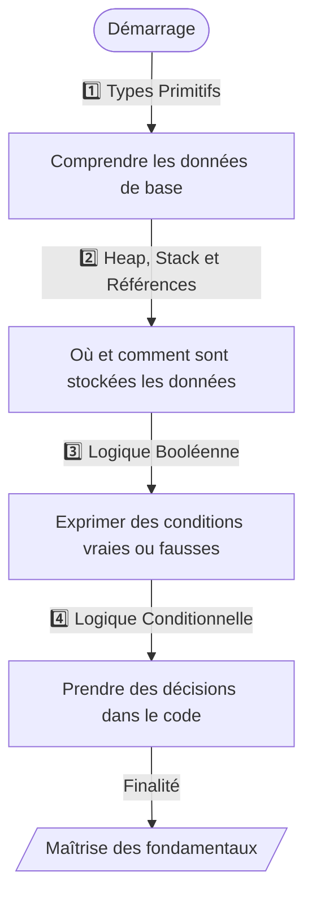
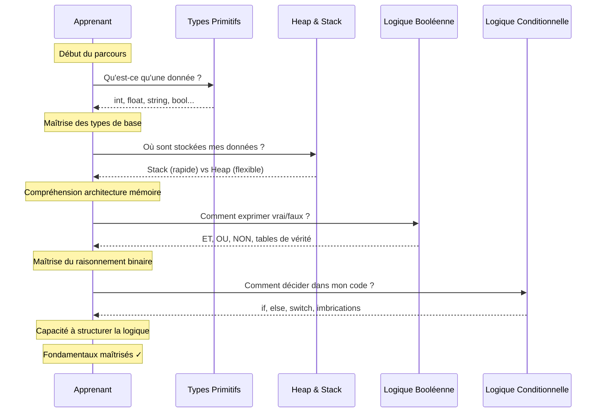

# Fondamentaux techniques

Cette section établit les **bases conceptuelles élémentaires** indispensables à toute compréhension ultérieure des langages de programmation et des systèmes informatiques. Avant d'écrire votre première ligne de code, il convient de maîtriser ces concepts fondamentaux qui constituent le **vocabulaire technique** et les **mécanismes de pensée** structurant l'ensemble de la pratique du développement logiciel.

!!! quote ""
    _Les fondamentaux techniques représentent le **socle intellectuel minimal** sur lequel repose toute activité de programmation, quel que soit le langage choisi ou le domaine d'application visé. Ces concepts transcendent les particularités syntaxiques des langages spécifiques pour former une compréhension **universelle** des mécanismes informatiques fondamentaux._

## Organisation des contenus

Cette section se décompose en quatre chapitres progressifs qui construisent méthodiquement votre compréhension des mécanismes de base de la programmation. Chaque chapitre s'appuie sur les connaissances acquises dans les chapitres précédents, créant ainsi une progression _naturelle et cohérente_.

### Types Primitifs

!!! abstract "Les briques élémentaires de toute donnée"
    Les types primitifs constituent les **unités atomiques**[^1] de manipulation de données dans tout langage de programmation. Ce chapitre explore les différentes catégories de types de base disponibles, depuis les **nombres entiers** et **nombres décimaux** jusqu'aux **chaînes de caractères** et **valeurs booléennes**.
    
    Vous découvrirez comment chaque langage professionnel implémente ces types fondamentaux, leurs **caractéristiques spécifiques**, leurs **limites techniques** et leurs **cas d'usage appropriés**. Cette compréhension vous permettra de choisir le type de données optimal selon votre contexte d'utilisation et d'éviter les erreurs courantes liées aux _conversions implicites_ et aux _débordements arithmétiques_.

### Heap, Stack et Références

!!! abstract "Architecture mémoire et gestion des données"
    Ce chapitre démystifie[^2] l'organisation de la mémoire informatique en explorant les deux zones fondamentales que sont la **Stack** et le **Heap**. Vous comprendrez comment les types primitifs se stockent dans la _mémoire rapide_ de la pile d'exécution tandis que les structures complexes résident dans le **tas** (_Stack_).
    
    Le concept de **référence**, mécanisme permettant d'accéder _indirectement_ aux données, sera explicité[^3] avec ses implications pratiques sur la performance et la manipulation des objets. **Cette connaissance architecturale éclaire de nombreux comportements apparemment mystérieux des programmes** et **prévient des erreurs subtiles liées à la gestion mémoire**.

### Logique Booléenne

!!! abstract "Fondements du raisonnement binaire"
    La logique booléenne forme le **langage mathématique** permettant d'exprimer et de manipuler des valeurs de vérité. Ce chapitre présente les **opérateurs logiques fondamentaux** que sont **ET**, **OU** et **NON**, ainsi que leurs variantes et combinaisons.
    
    Vous découvrirez les **tables de vérité** structurant ces opérations, les **lois algébriques**[^4] régissant leurs simplifications, et leurs applications concrètes dans les conditions de programmation. La maîtrise de la logique booléenne s'avère _indispensable_ pour construire des expressions conditionnelles correctes et optimisées, base de tout contrôle de flux dans les programmes.

### Logique Conditionnelle

!!! abstract "Structures de contrôle et prise de décision"
    Ce chapitre final synthétise les connaissances acquises précédemment pour aborder les **structures conditionnelles** qui permettent aux programmes de prendre des décisions. Vous explorerez les instructions **if**, **else**, **switch** et leurs équivalents selon les langages, en comprenant comment elles évaluent les expressions booléennes pour orienter l'exécution du code.
    
    Les concepts de **branchement**, **d'imbrication conditionnelle** et de **priorité d'évaluation** seront détaillés avec leurs implications sur la _lisibilité_ et la _maintenabilité_ du code. Cette maîtrise vous permettra de structurer logiquement vos programmes et d'implémenter des comportements sophistiqués répondant à différents scénarios d'utilisation.

## Progression pédagogique recommandée

La séquence d'apprentissage proposée suit une logique rigoureuse de construction des compétences par _empilement progressif_ de concepts interdépendants. Cette progression garantit que chaque nouveau concept dispose des fondations conceptuelles nécessaires à sa compréhension.

_Ce diagramme illustre la progression logique à travers les quatre chapitres des fondamentaux techniques. Chaque étape construit sur la précédente, créant une compréhension cohérente et progressive des mécanismes de base de la programmation._

!!! note
    Les **types primitifs** établissent le vocabulaire des données, la **gestion mémoire** explique leur organisation physique, la **logique booléenne** fournit les outils de raisonnement, et la **logique conditionnelle** applique ces concepts pour créer des comportements intelligents.

### Séquence détaillée d'apprentissage

_Ce diagramme de séquence représente le dialogue conceptuel entre vous et chaque chapitre des fondamentaux. Chaque interaction répond à une **question spécifique** et construit progressivement votre compréhension globale. Cette approche séquentielle garantit que vous ne rencontrerez jamais un concept nécessitant des connaissances que vous n'avez pas encore acquises._

## Interdépendances conceptuelles

Les quatre chapitres des fondamentaux techniques forment un **système de connaissances interconnectées** où chaque concept renforce et éclaire les autres.

- [x] Les **types primitifs** définissent les valeurs manipulables, dont les _valeurs booléennes_ qui serviront de fondation à la logique booléenne. La compréhension de la **gestion mémoire** explique pourquoi certaines opérations sur les types primitifs s'exécutent plus rapidement que d'autres et clarifie les comportements de _passage de paramètres_ dans les fonctions.

- [x] La **logique booléenne** fournit les outils mathématiques permettant d'exprimer les conditions qui contrôleront les structures conditionnelles. Sans maîtrise des **opérateurs booléens**, la construction de conditions complexes dans les instructions **if** ou **switch** devient source d'erreurs et de confusion. Inversement, la pratique des **structures conditionnelles** renforce la compréhension intuitive de la logique booléenne en l'appliquant à des contextes concrets de programmation.

- [x] La **gestion mémoire** influence directement le comportement des variables dans les structures conditionnelles, expliquant pourquoi certaines modifications de variables persistent après un bloc conditionnel tandis que d'autres disparaissent. Cette compréhension architecturale prévient de nombreuses erreurs subtiles que rencontrent les développeurs débutants lorsqu'ils tentent de modifier des valeurs dans différents _contextes d'exécution_.

## Durée estimée et approche pédagogique

L'acquisition solide de ces fondamentaux techniques nécessite généralement entre **quatre et six heures** de lecture attentive et d'expérimentation pratique. Cette estimation suppose une approche méthodique où vous prenez le temps d'exécuter les exemples de code fournis, d'expérimenter avec des variations personnelles et de vérifier votre compréhension avant de progresser vers le chapitre suivant.

!!! warning "Attention" 
    Il convient de résister à la tentation de survoler rapidement ces contenus sous prétexte qu'ils paraissent simples en première lecture. Les fondamentaux techniques constituent précisément le domaine où les _lacunes conceptuelles_ génèrent le plus de difficultés ultérieures. Un **investissement temps généreux** à ce stade accélère considérablement votre progression dans les sections plus avancées de la documentation.

!!! tip "Conseil d'apprentissage"
    Accordez-vous la possibilité de revenir régulièrement sur ces fondamentaux au cours de votre progression dans les sections suivantes. La **relecture** de ces concepts élémentaires avec l'expérience accumulée révèle souvent des subtilités qui échappent lors de la première lecture. Cette approche _itérative_ renforce durablement votre maîtrise technique.

## Relation avec les sections suivantes

Les fondamentaux techniques préparent directement votre exploration des **outils de développement** en établissant le vocabulaire technique nécessaire à la compréhension des messages d'erreur, des documentations d'API et des discussions techniques avec d'autres développeurs. 

> Sans cette base conceptuelle, l'apprentissage de **Git**, des **environnements virtuels** ou des **expressions régulières** devient significativement plus ardu car vous manquez des _références mentales_ pour rattacher les nouveaux concepts.

Les **gestionnaires de paquets**, les **protocoles réseau** et les **structures de données** s'appuient tous implicitement sur votre compréhension des types primitifs et de la gestion mémoire. Les formats **JSON**, **YAML** et **XML** manipulent précisément ces types de données élémentaires que vous découvrirez dans le premier chapitre. Les **concepts de programmation avancés** comme les _design patterns_ et les _principes SOLID_ présupposent une maîtrise totale des fondamentaux pour être pleinement assimilés.

Cette section constitue donc véritablement la **fondation** sur laquelle repose l'intégralité de votre parcours d'apprentissage technique. L'investissement consacré à ces quatre chapitres génère un _retour sur investissement considérable_ qui se manifestera tout au long de votre progression vers l'expertise professionnelle.

[^1]: Les **unités atomiques** sont un système de mesure utilisé en physique pour **simplifier les calculs à l’échelle des atomes** : on choisit des unités où certaines constantes fondamentales comme la masse et la charge de l’électron valent 1, ce qui rend les formules plus courtes et plus faciles à manipuler.
[^2]: **Démystifier**, c’est **retirer le caractère mystérieux, sacré ou exagéré** d’une idée, d’une croyance ou d’un phénomène, afin de **le rendre clair, compréhensible et rationnel**.
[^3]: **Explicité** signifie **rendu clair, détaillé ou formulé sans ambiguïté** — c’est le contraire de ce qui est implicite ou sous-entendu.
Autrement dit, une idée **explicitée** est une idée **énoncée clairement et ouvertement**.
[^4]: Les **lois algébriques** sont les **règles qui définissent comment les nombres ou les symboles peuvent être combinés et manipulés** dans les opérations mathématiques.

