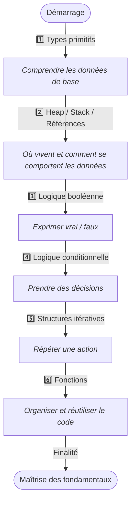

# Fondamentaux techniques

## Vue d’ensemble

Les fondamentaux techniques constituent la **base absolue** de tout apprentissage en programmation.  
Ils regroupent les notions essentielles permettant de comprendre **comment un programme manipule les données**, **gère la mémoire**, **raisonne**, **répète des actions** et **structure le code**.

L’ensemble forme un **écosystème cohérent** composé de **six notions clés** :

* les **types primitifs**,  
* la **gestion mémoire** (Heap, Stack, Références),  
* la **logique booléenne**,  
* la **logique conditionnelle**,  
* les **structures itératives**,  
* les **fonctions** (ou logique fonctionnelle).

Chaque concept dispose d’une **fiche dédiée** pour approfondir progressivement votre compréhension.

!!! info "Comment lire cette section"
    Cette section suit une progression logique et graduelle :
    
    1. **Les données**  
       _Comprendre les valeurs qu’un programme manipule._
    
    2. **La mémoire**  
       _Comprendre où et comment ces valeurs sont stockées._
    
    3. **La logique**  
       _Comprendre comment exprimer vrai/faux et construire des conditions._
    
    4. **Le contrôle du flux**  
       _Comprendre comment répéter et orienter l’exécution._
    
    5. **L’organisation du code**  
       _Comprendre comment structurer, réutiliser et encapsuler les comportements._

## Présentation des notions

- ### :lucide-list:{ .lg .middle } — Types primitifs  
    ---
    Les types primitifs sont les **unités atomiques**[^1] de toute donnée : nombres, textes, booléens.  
    Ils forment le vocabulaire fondamental de tous les langages.

    [:lucide-book-open-check: Voir la fiche Types Primitifs](./types-primitifs)

- ### :lucide-cpu:{ .lg .middle } — Heap, Stack & Références  
    ---
    Cette fiche démystifie[^2] la structure interne de la mémoire et explicite[^3] les comportements subtils liés au stockage des valeurs et aux références.

    [:lucide-book-open-check: Voir la fiche Heap & Stack](./heap-stack-references)

- ### :lucide-shapes:{ .lg .middle } — Logique booléenne  
    ---
    Fondée sur les valeurs vrai/faux et les lois algébriques[^4], elle structure tout raisonnement binaire utilisé dans les programmes.

    [:lucide-book-open-check: Voir la fiche Logique Booléenne](./logique-booleenne)

- ### :lucide-git-branch:{ .lg .middle } — Logique conditionnelle  
    ---
    Elle permet aux programmes de **prendre des décisions** via les structures `if`, `else`, `switch`, et leurs variantes.

    [:lucide-book-open-check: Voir la fiche Logique Conditionnelle](./logique-conditionnelle)

- ### :lucide-repeat:{ .lg .middle } — Structures itératives  
    ---
    Elles permettent de **répéter** une action grâce aux boucles `for`, `while`, `do…while` et à leurs équivalents. Une maîtrise indispensable pour automatiser des séquences de traitement.

    [:lucide-book-open-check: Voir la fiche Structures Itératives](./structures-iteratives)

- ### :lucide-function-square:{ .lg .middle } — Fonctions  
    ---
    Les fonctions structurent la **logique métier**, favorisent la réutilisation du code, contrôlent la portée des variables et définissent les comportements d’un programme.

    [:lucide-book-open-check: Voir la fiche Fonctions](./fonctions)

## Progression pédagogique recommandée

!!! abstract "Compréhension"
    La séquence d'apprentissage proposée suit une logique rigoureuse de construction des compétences par _**empilement progressif**_ de concepts interdépendants. Cette progression **garantit** que chaque nouveau concept dispose des fondations conceptuelles nécessaires à sa compréhension.

_Ce diagramme illustre la progression logique à travers les six chapitres des fondamentaux techniques. Chaque étape construit sur la précédente, créant une compréhension cohérente et progressive des mécanismes de base de la programmation._

Ainsi, Cette progression reflète l’ordre naturel d’apprentissage :  
**données → mémoire → logique → décision → répétition → organisation du code**.*

## Rôle dans l’écosystème global

Ces fondamentaux constituent **la première couche** de votre parcours d’apprentissage technique.
Ils éclairent la compréhension :

* des **structures de données**,
* des **mécanismes internes des langages**,
* des **concepts avancés de programmation**,
* des **outils (Git, ligne de commande, debuggers)**,
* des **frameworks** que vous étudierez par la suite.

> Sans ces notions, les chapitres ultérieurs deviennent plus difficiles.
> Avec elles, tout devient plus lisible, logique et intuitif.

## Conclusion

!!! quote "Point d’entrée vers la programmation"
    Cette section pose la fondation de votre montée en compétence.
    Chaque fiche approfondit un concept essentiel, et leur compréhension combinée constitue le socle sur lequel reposera l’ensemble de vos apprentissages techniques.

[^1]: Les **unités atomiques** sont un système de mesure utilisé en physique pour **simplifier les calculs à l’échelle des atomes** : on choisit des unités où certaines constantes fondamentales valent 1, ce qui rend les formules plus courtes et plus faciles à manipuler.
[^2]: **Démystifier**, signifie retirer **l’aspect mystérieux** ou **confus** d’un concept pour le rendre **compréhensible** et **rationnel**.
[^3]: **Explicité** signifie **rendu clair, détaillé ou formulé sans ambiguïté** — c’est le contraire de ce qui est implicite ou sous-entendu.
Autrement dit, une idée **explicitée** est une idée **énoncée clairement et ouvertement**.
[^4]: Les **lois algébriques** sont les **règles qui définissent** la manière dont **les expressions logiques** peuvent être **simplifiées** ou **combinées**.

