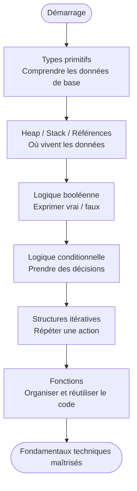

# Fondamentaux techniques

!!! quote "Analogie"
    _Apprendre un langage de programmation sans comprendre les fondamentaux, c'est conduire une voiture sans savoir ce qu'est un moteur : on avance, jusqu'à ce que quelque chose se passe mal._

## Objectif

Les fondamentaux techniques constituent la **base absolue** de tout apprentissage en programmation. Ils regroupent les notions permettant de comprendre comment un programme manipule les données, gère la mémoire, raisonne, répète des actions et organise son code.

Ces six notions forment un ensemble cohérent et interdépendant : **types primitifs**, **gestion mémoire** (Heap, Stack, Références), **logique booléenne**, **logique conditionnelle**, **structures itératives** et **fonctions**. Chacune dispose d'une fiche dédiée.

!!! note "Comment lire cette section"
    Cette section suit une progression logique et graduelle en cinq étapes :

    - **Les données** — comprendre les valeurs qu'un programme manipule
    - **La mémoire** — comprendre où et comment ces valeurs sont stockées
    - **La logique** — comprendre comment exprimer vrai/faux et construire des conditions
    - **Le contrôle du flux** — comprendre comment répéter et orienter l'exécution
    - **L'organisation du code** — comprendre comment structurer, réutiliser et encapsuler les comportements

 

---

## Les six notions

- ### :lucide-list: Types primitifs
    ---
    Les types primitifs sont les **unités atomiques**[^1] de toute donnée : nombres, textes, booléens. Ils forment le vocabulaire fondamental commun à tous les langages.

    [Voir la fiche Types Primitifs](./types-primitifs.md)

- ### :lucide-cpu: Heap, Stack & Références
    ---
    Cette fiche explique la structure interne de la mémoire et les comportements liés au stockage des valeurs et aux références — source de nombreux bugs silencieux.

    [Voir la fiche Heap & Stack](./heap-stack-references.md)

- ### :lucide-shapes: Logique booléenne
    ---
    Fondée sur les valeurs vrai/faux et les lois algébriques[^2], elle structure tout raisonnement binaire utilisé dans les programmes.

    [Voir la fiche Logique Booléenne](./logique-booleenne.md)

- ### :lucide-git-branch: Logique conditionnelle
    ---
    Elle permet aux programmes de prendre des décisions via les structures `if`, `else`, `switch` et leurs variantes selon les langages.

    [Voir la fiche Logique Conditionnelle](./logique-conditionnelle.md)

- ### :lucide-repeat: Structures itératives
    ---
    Elles permettent de répéter une action via les boucles `for`, `while`, `do...while` et leurs équivalents. Indispensable pour automatiser des séquences de traitement.

    [Voir la fiche Structures Itératives](./structure-iteratives.md)

- ### :lucide-function-square: Fonctions
    ---
    Les fonctions structurent la logique métier, favorisent la réutilisation du code, contrôlent la portée des variables et définissent les comportements d'un programme.

    [Voir la fiche Fonctions](./fonctions.md)

 

---

## Progression recommandée

La séquence proposée suit une logique de construction par empilement progressif. Chaque concept repose sur le précédent — sauter une étape crée des lacunes qui se manifestent plus loin dans la progression.

```mermaid
flowchart TB
  Start([Démarrage])

  TP["Types primitifs<br/>Comprendre les données de base"]
  Mem["Heap / Stack / Références<br/>Où vivent les données"]
  Bool["Logique booléenne<br/>Exprimer vrai / faux"]
  Cond["Logique conditionnelle<br/>Prendre des décisions"]
  Iter["Structures itératives<br/>Répéter une action"]
  Func["Fonctions<br/>Organiser et réutiliser le code"]
  End([Fondamentaux techniques maîtrisés])

  Start --> TP --> Mem --> Bool --> Cond --> Iter --> Func --> End
```

<em>La progression suit l'ordre naturel : <strong>données → mémoire → logique → décision → répétition → organisation du code</strong>.</em>

 

---

## Rôle dans la progression globale

Ces fondamentaux constituent la première couche technique de tout le reste. Ils éclairent directement la compréhension des formats de données (**JSON**, **YAML**), des mécanismes internes des langages, des outils (**Git**, **ligne de commande**, **debuggers**) et des frameworks abordés dans les sections suivantes.

!!! note "Sans cette base, les concepts avancés peuvent sembler fonctionner sans qu'on comprenne pourquoi — _ce qui produit des profils fragiles face aux cas limites et aux erreurs inattendues._"

 

---

## Conclusion

!!! note "Notre recommandation"
    Ces six fiches sont courtes mais denses. Mieux vaut les lire dans l'ordre, en s'assurant de comprendre chaque notion avant de passer à la suivante. Ce sont des investissements à rentabilité immédiate dès les premiers exercices pratiques.

**Point d'entrée recommandé : [Types Primitifs](./types-primitifs.md)**

 

[^1]: **Unité atomique** — en informatique, désigne la plus petite unité de donnée non décomposable dans un contexte donné. Un entier, un booléen ou un caractère sont des unités atomiques : ils ne contiennent pas d'autres valeurs.
[^2]: **Lois algébriques** — règles définissant comment les expressions logiques peuvent être simplifiées ou combinées. Exemple : la loi de De Morgan stipule que `NON (A ET B)` équivaut à `(NON A) OU (NON B)`.