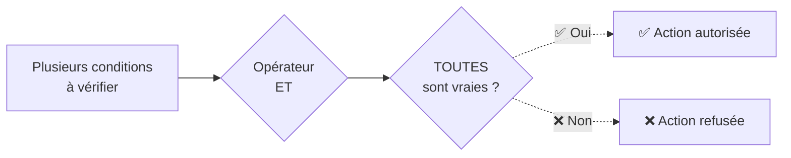
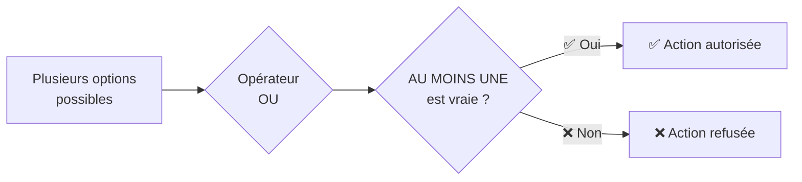
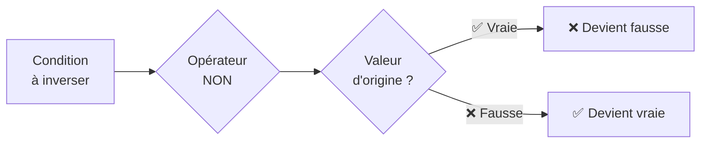

# Logique Booléenne

## Introduction

<div
  class="omny-meta"
  data-level="🟢 Débutant & 🟡 Intermédiaire"
  data-version="1.2"
  data-time="20-25 minutes">
</div>

!!! quote "Analogie pédagogique"
    _Imaginez un interrupteur : il est soit **allumé** soit **éteint**. Pas de position intermédiaire ! En programmation, nous utilisons exactement cette même logique simple : **vrai** ou **faux**, **oui** ou **non**, **autorisé** ou **interdit**._

La logique booléenne est le système qui permet à vos programmes de prendre des décisions. **C'est l'un des concepts les plus simples mais les plus puissants de l'informatique**. Elle repose exclusivement sur deux états possibles : **vrai** et **faux**.  

Cette logique vous permettra de **contrôler l'accès aux applications**, de **vérifier plusieurs conditions en même temps**, de **faire des choix automatiques** dans vos programmes, et de **sécuriser vos applications en combinant plusieurs vérifications**.

!!! info "Pourquoi c'est important ?"
    La logique booléenne est le **fondement des décisions automatiques** dans vos programmes. Elle régit l'**authentification**, les **contrôles d'accès**, les **règles de sécurité** et **toute forme de validation conditionnelle**.

## Pour repartir des bases (vrais débutants)

Si vous n'avez pas encore lu la documentation sur les **types primitifs**, nous vous recommandons de commencer par là. **La logique booléenne** utilise le type `bool` que nous avons déjà découvert dans ce chapitre précédent.

!!! tip "C'est plus simple qu'il n'y paraît !"
    Nous utilisons la logique booléenne tous les jours sans nous en rendre compte. Lorsque vous dites _"**Il me faut mon badge ET mon code pour entrer au bureau**"_, vous exprimez déjà de la logique booléenne !

## Les deux valeurs fondamentales

En logique booléenne, **il n'existe que deux valeurs possibles** qui représentent les états **binaires** fondamentaux de tout système informatique.

| Valeur | Signification | En binaire | Exemples de la vie |
| :---: | --- | :---: | --- |
| `true` / `True` | Vrai, oui, autorisé | **1** | Feu vert, porte ouverte, wifi connecté |
| `false` / `False` | Faux, non, refusé | **0** | Feu rouge, porte fermée, wifi déconnecté |

!!! warning "Important"
    La correspondance avec le binaire (**0** ou **1**) est fondamentale car le résultat de toute condition sera toujours l'un de ces deux états. **C'est la base de la pensée informatique qui permet à vos programmes de fonctionner au niveau matériel**.

## Les trois opérateurs essentiels

Ces trois opérateurs constituent les outils fondamentaux qui permettent de **combiner** et **modifier** vos conditions pour **construire des décisions complexes**. Chaque langage de programmation implémente ces opérateurs avec sa propre syntaxe, **mais la logique sous-jacente reste identique**.

| Opérateur | Python | JavaScript/PHP | Go | Rust | Description |
| :---: | :---: | :---: | :---: | :---: | --- |
| **ET** | `and` | `&&` | `&&` | `&&` | Il faut TOUT pour valider |
| **OU** | `or` | `||` | `||` | `||` | Il en suffit d'UN pour valider |
| **NON** | `not` | `!` | `!` | `!` | L'inverse de la valeur |

## L'opérateur ET (AND)

L'opérateur **ET** exige que **toutes les conditions soient vraies simultanément** pour que le résultat global soit **vrai**. Cette exigence d'unanimité fait de cet opérateur l'outil privilégié pour les vérifications de sécurité où aucune condition ne peut être négligée.

!!! abstract "Analogie"
    Considérez l'ouverture d'un coffre-fort qui nécessite **la bonne clé ET le bon code ET l'empreinte digitale valide**.  
    L'absence d'un seul de ces éléments suffit à bloquer complètement l'accès, indépendamment de la validité des autres critères.

### Table de vérité ET (AND)

| A (_badge_) | B (_code_) | A **ET** B | Résultat pratique |
| :---: | :---: | :---: | --- |
| ❌ Faux | ❌ Faux | ❌ Faux | Pas de badge ET pas de code → Refusé |
| ❌ Faux | ✅ Vrai | ❌ Faux | Pas de badge ET bon code → Refusé |
| ✅ Vrai | ❌ Faux | ❌ Faux | Bon badge ET pas de code → Refusé |
| ✅ Vrai | ✅ Vrai | ✅ Vrai | Bon badge ET bon code → **Autorisé** |

Cette table démontre qu'avec l'opérateur ET, **une seule condition fausse suffit à invalider l'ensemble de l'expression**. Ce comportement garantit qu'aucun accès ne sera accordé tant que toutes les exigences de sécurité ne sont pas satisfaites.

### Visualisation du mécanisme ET


_Ce diagramme illustre le mécanisme strict de l'opérateur ET où toutes les conditions doivent être simultanément satisfaites pour autoriser l'action. Dès qu'une seule condition échoue, l'ensemble de l'expression devient fausse et l'action est refusée. Cette rigueur fait de l'opérateur ET l'outil privilégié pour implémenter des contrôles de sécurité où aucun critère ne peut être négligé._

## L'opérateur OU (OR)

L'opérateur **OU** nécessite qu'**au moins une condition soit vraie** pour que le résultat global soit vrai. Cette flexibilité permet d'offrir plusieurs chemins alternatifs pour atteindre un objectif, améliorant ainsi l'expérience utilisateur tout en maintenant la sécurité.

!!! abstract "Analogie"
    Imaginez l'accès à un bâtiment où vous pouvez entrer par **la porte principale** OU par **l'entrée de service** OU par **le parking**. Une seule porte ouverte suffit à vous permettre d'accéder au bâtiment, les autres pouvant rester fermées sans vous bloquer.

### Table de vérité OU (OR)

| A (_mdp_) | B (_biométrie_) | A **OU** B | Résultat pratique |
| :---: | :---: | :---: | --- |
| ❌ Faux | ❌ Faux | ❌ Faux | Pas de mot de passe ET pas de biométrie → Refusé |
| ❌ Faux | ✅ Vrai | ✅ Vrai | Pas de mot de passe MAIS biométrie OK → **Autorisé** |
| ✅ Vrai | ❌ Faux | ✅ Vrai | Mot de passe OK MAIS pas de biométrie → **Autorisé** |
| ✅ Vrai | ✅ Vrai | ✅ Vrai | Mot de passe ET biométrie OK → **Autorisé** |

Avec l'opérateur **OU**, une seule condition vraie suffit à valider l'ensemble de l'expression. Cette caractéristique s'avère particulièrement utile pour proposer **plusieurs méthodes d'authentification alternatives**, permettant aux utilisateurs de choisir celle qui leur convient le mieux.

### Visualisation du mécanisme OU


_Ce diagramme démontre la flexibilité de l'opérateur OU qui autorise l'action dès qu'une seule condition parmi l'ensemble proposé est satisfaite. Cette permissivité permet d'offrir plusieurs chemins alternatifs pour atteindre un objectif, améliorant ainsi l'expérience utilisateur tout en maintenant les exigences de sécurité. L'utilisateur dispose donc de plusieurs moyens d'authentification sans que l'absence de l'un bloque l'accès si un autre est disponible._

## L'opérateur NON (NOT)

L'opérateur **NOT** (NON) **inverse complètement la valeur booléenne** : **vrai devient faux** et **faux devient vrai**. Cette transformation constitue l'opération la plus simple mais reste fondamentale pour exprimer des conditions négatives de manière explicite.

!!! abstract "Analogie"
    Comparez cet opérateur à un interrupteur inversé qui **éteint la lumière** lorsque vous appuyez dessus **au lieu de l'allumer**. De la même manière, dire **qu'un compte n'est pas bloqué** revient à **affirmer qu'il est accessible**.

### Table de vérité NON (NOT)

| A (_Compte bloqué_) | **NON** A | Résultat pratique |
| :---: | :---: | --- |
| ❌ Faux | ✅ Vrai | Compte PAS bloqué → Autorisé |
| ✅ Vrai | ❌ Faux | Compte bloqué → Refusé |

L'opérateur **NOT** (NON) permet d'exprimer clairement des conditions négatives telles que "**l'utilisateur n'est pas banni**" ou "**la session n'est pas expirée**". Toutefois, un usage excessif de la négation peut nuire à la lisibilité du code, comme nous le verrons dans les bonnes pratiques.

### Visualisation du mécanisme NON


_Ce diagramme représente le mécanisme d'inversion simple mais puissant de l'opérateur NON qui transforme systématiquement chaque valeur en son opposé booléen. Cette transformation permet d'exprimer clairement des conditions négatives dans votre code, bien qu'un usage excessif puisse nuire à la lisibilité comme démontré dans la section sur les bonnes pratiques de nommage._

## Exemples par langage

### Python - Contrôle d'accès

```python
# Langage : Python
# ----------------------------------------------------------------
# Vérification d'accès à un contenu avec restrictions d'âge
age = 17
a_autorisation_parentale = True
film_tout_public = False

# Logique ET : il faut TOUTES les conditions
majeur = age >= 18 and not film_tout_public
print(f"Majeur : {majeur}")  # False

# Logique OU : il suffit d'UNE condition
peut_voir = film_tout_public or (age >= 18) or a_autorisation_parentale
print(f"Peut voir : {peut_voir}")  # True
```

_Cet exemple illustre comment Python utilise les mots-clés `and`, `or` et `not` pour exprimer la logique booléenne de manière lisible. **L'utilisateur mineur peut accéder au contenu grâce à l'autorisation parentale**, démontrant la flexibilité de l'opérateur **OU**._

### JavaScript - Authentification

```javascript
// Langage : JavaScript
// ----------------------------------------------------------------
// Vérification de connexion avec nommage clair
let motDePasseCorrect = true;
let compteActif = true;       // Affirmatif plutôt que compteBloque = false
let tentativesValides = true; // Affirmatif plutôt que tropDeTentatives = false

// Logique ET : toutes les conditions doivent être vraies
let connexionAutorisee = motDePasseCorrect && compteActif && tentativesValides;
console.log(`Connexion autorisée : ${connexionAutorisee}`);  // true

// Alternative avec vérification d'absence de problèmes
let aucunBloquage = true;
let nombreTentativesAcceptable = true;

let accesSecurise = motDePasseCorrect && aucunBloquage && nombreTentativesAcceptable;
console.log(`Accès sécurisé : ${accesSecurise}`);  // true
```

Ce code apporte **une convention de nommage affirmative** qui **élimine les doubles négations source de confusion**. Le code se lit naturellement comme une phrase : "**la connexion est autorisée si le mot de passe est correct ET le compte est actif ET les tentatives sont valides**". Cette approche améliore significativement la lisibilité et réduit les erreurs de logique potentielles.

### PHP - Validation de formulaire

```php
# Langage : PHP
# ----------------------------------------------------------------
<?php
// Validation de formulaire avec vérifications multiples
$nom_rempli = true;
$email_valide = true;
$age_suffisant = false;  // Utilisateur de 16 ans
$accord_parental = true;

// Logique ET : conditions obligatoires
$infos_completes = $nom_rempli && $email_valide;

// Logique OU : soit majeur soit accord parental
$age_acceptable = $age_suffisant || $accord_parental;

// Résultat final combinant les deux vérifications
$peut_valider = $infos_completes && $age_acceptable;
echo $peut_valider ? "Formulaire validé" : "Formulaire refusé";  // Formulaire validé
?>
```

L'exemple **PHP** démontre comment combiner intelligemment les opérateurs **ET** et **OU** pour créer des règles de validation sophistiquées. Le formulaire peut être validé soit par un **utilisateur majeur**, soit par un **mineur disposant d'une autorisation parentale**, illustrant la flexibilité de la logique booléenne.

### Go - Système de sécurité

```go
// Langage : Go
// ----------------------------------------------------------------
package main
import "fmt"

func main() {
    // Variables de contrôle d'accès
    badgeValide := true
    codeCorrect := true
    heuresBureau := false  // 22h, hors horaires normaux
    estAgentSecurite := true
    
    // Accès standard : badge ET code ET horaires
    accesStandard := badgeValide && codeCorrect && heuresBureau
    
    // Accès exceptionnel : agent de sécurité avec badge
    accesExceptionnel := estAgentSecurite && badgeValide
    
    // Décision finale : accès standard OU exceptionnel
    accesAutorise := accesStandard || accesExceptionnel
    fmt.Printf("Accès autorisé : %t\n", accesAutorise)  // true
}
```

Go impose un **typage strict qui renforce la clarté du code**. Cet exemple illustre comment structurer des règles de sécurité complexes en séparant clairement les différentes conditions d'accès. **L'agent de sécurité peut entrer hors des horaires normaux grâce à la condition d'accès exceptionnel**.

!!! note "Comprendre la logique conditionnelle"
    Cette structure illustre parfaitement le fonctionnement de l'opérateur OU dans un contexte de sécurité. Si la variable `estAgentSecurite` était définie sur **false** tout en maintenant `heuresBureau` sur **false**, alors `accesAutorise` retournerait également **false**. Cette situation se produit parce que les deux chemins d'accès échoueraient simultanément : `accesStandard` nécessite que toutes ses conditions soient vraies (notamment `heuresBureau`), et `accesExceptionnel` exige que `estAgentSecurite` soit vrai. L'absence de ces deux conditions entraîne le refus d'accès, démontrant que l'opérateur OU n'autorise l'accès que si au moins un des chemins alternatifs aboutit.

### Rust - Authentification multi-facteurs

```rust
// Langage : Rust
// ----------------------------------------------------------------
fn main() {
    // Facteurs d'authentification disponibles
    let mot_de_passe_ok = true;
    let code_sms_ok = false;
    let empreinte_ok = true;
    let certificat_ok = true;
    
    // Option 1 : Mot de passe + SMS
    let option1 = mot_de_passe_ok && code_sms_ok;
    
    // Option 2 : Mot de passe + Biométrie
    let option2 = mot_de_passe_ok && empreinte_ok;
    
    // Option 3 : Certificat seul (pour administrateurs)
    let option3 = certificat_ok;
    
    // N'importe quelle option valide autorise l'accès
    let acces_autorise = option1 || option2 || option3;
    println!("Accès autorisé : {}", acces_autorise);  // true
}
```

L'exemple Rust démontre l'implémentation d'un système d'**authentification multi-facteurs** offrant plusieurs chemins d'accès alternatifs. Cette architecture **améliore la sécurité** tout en maintenant **la flexibilité pour les utilisateurs qui peuvent choisir leur méthode d'authentification préférée**.

## Ordre de priorité des opérateurs

Comme en mathématiques, les opérateurs booléens suivent un **ordre de priorité strict** qui détermine l'ordre d'évaluation des expressions complexes. **La compréhension de cet ordre évite les erreurs logiques subtiles** dans vos conditions.

| Priorité | Opérateur | Évaluation |
| :---: | --- | --- |
| **1** | `NOT` / `!` | La négation s'applique en premier |
| **2** | `AND` / `&&` | Les conjonctions ensuite |
| **3** | `OR` / `\|\|` | Les disjonctions en dernier |

```python
# Langage : Python
# ----------------------------------------------------------------
# Expression sans parenthèses : A or B and not C
# Se lit automatiquement : A or (B and (not C))

A = False
B = True
C = False

# Évaluation selon l'ordre de priorité
resultat = A or B and not C
print(resultat)  # True

# Version explicite avec parenthèses pour la clarté
resultat_explicite = A or (B and (not C))
print(resultat_explicite)  # True
```

!!! tip "Conseil professionnel"
    **Utilisez systématiquement des parenthèses pour expliciter vos intentions lorsque vous combinez plusieurs opérateurs**. Cette pratique **améliore considérablement la lisibilité de votre code** et **prévient les erreurs de logique difficiles à détecter**.
    
!!! quote "Un code clair vaut toujours mieux qu'un code compact mais ambigu."

## Bonnes pratiques de nommage

Le nommage des variables booléennes constitue **un aspect souvent négligé** mais **crucial de la lisibilité du code**. Une **convention de nommage claire élimine les ambiguïtés** et **facilite la maintenance à long terme**.

### Convention affirmative recommandée

Privilégiez systématiquement des **noms de variables affirmatifs** qui **expriment directement l'état positif** que vous vérifiez. _Cette approche élimine le besoin d'opérateurs de négation superflus qui compliquent la lecture du code._

```python
# Langage : Python
# ----------------------------------------------------------------
# ❌ Nommage négatif créant des doubles négations
compte_bloque = False
if not compte_bloque:  # "pas compte bloqué" - confusion mentale
    print("Accès autorisé")

# ✅ Nommage affirmatif clair et direct
compte_actif = True
if compte_actif:  # "compte actif" - intention claire
    print("Accès autorisé")
```

Cette **distinction peut sembler mineure** mais **celle-ci impacte significativement la compréhension du code lors de relectures ultérieures** ou **par d'autres développeurs**. Le code se lit alors comme une phrase française naturelle plutôt qu'un puzzle logique nécessitant une traduction mentale.

!!! example "Déconstruction de la confusion mentale"
    Analysons précisément pourquoi le nommage négatif pose problème dans la première version du code ci-dessus.
    ```python
        # Langage : Python
        # ----------------------------------------------------------------
        compte_bloque = False  # Premier niveau : "Le compte n'est pas bloqué"
        
        if not compte_bloque:  # Deuxième niveau : "Si PAS (compte bloqué)"
            # Traduction mentale nécessaire : "pas" appliqué à "bloqué qui est faux"
            # Donc : "pas faux" = "vrai" = "le compte est accessible"
            print("Accès autorisé")
    ```
    
    Cette gymnastique cognitive force le lecteur à effectuer deux opérations mentales successives. 
    
    1. **Premièrement**, il doit comprendre que `compte_bloque = False` **signifie que le compte n'est pas bloqué**.
    2. **Deuxièmement**, il doit **inverser cette négation** avec l'opérateur `not`, transformant "**pas bloqué**" en "**accessible**".
   
    Cette double négation **ralentit la lecture du code** et **augmente significativement le risque d'erreur lors des modifications ultérieures**, particulièrement dans des conditions complexes combinant plusieurs variables.
    
    La version affirmative élimine complètement cette charge cognitive en permettant une lecture linéaire directe où `compte_actif = True` suivi de `if compte_actif` se comprend **immédiatement sans aucune traduction mentale intermédiaire**.

## Le mot de la fin

!!! quote
    La logique booléenne représente **le langage fondamental des décisions informatiques**. Au début, vous réfléchirez consciemment à chaque condition et à chaque opérateur. Avec **la pratique**, **cette logique deviendra une seconde nature** et vous structurerez naturellement vos conditions de manière claire et efficace.
    
    L'important réside dans **la compréhension des principes plutôt que dans la mémorisation de règles abstraites**. **Vous utilisez déjà cette logique quotidiennement dans vos raisonnements naturels**. Désormais, vous savez simplement comment l'exprimer formellement à un ordinateur.

---