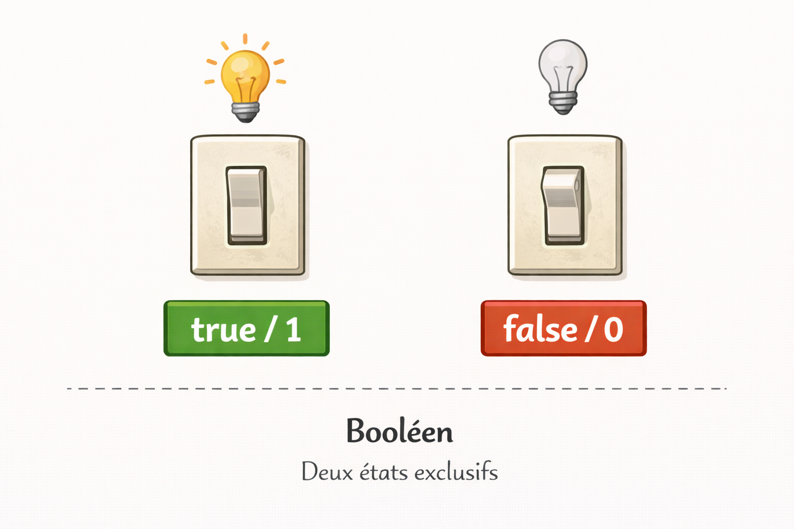
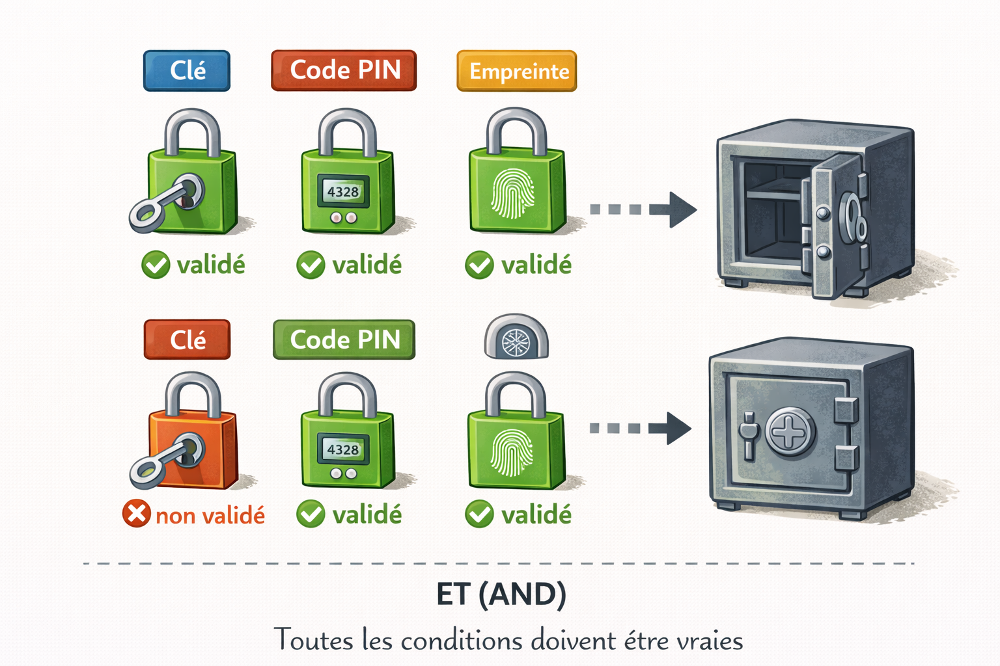
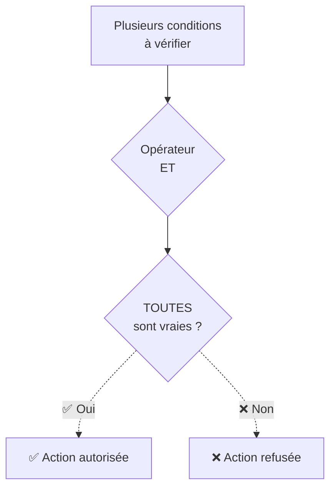
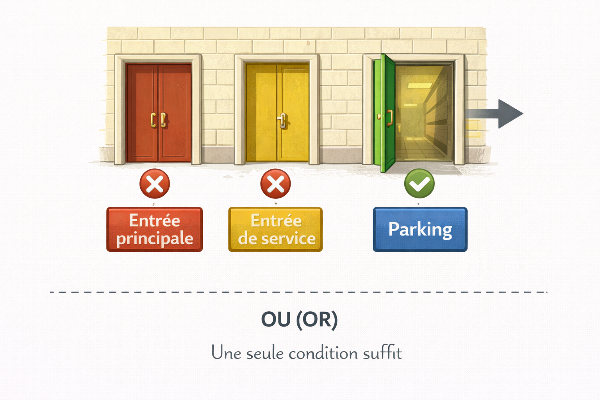
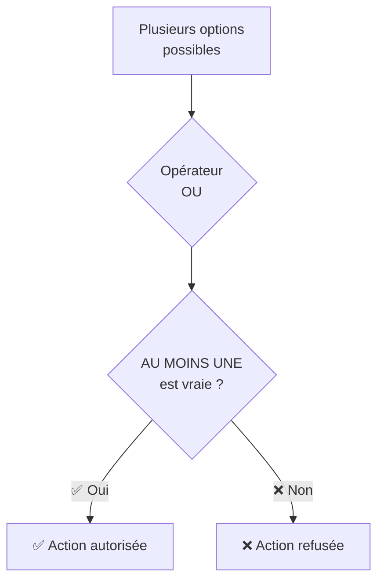
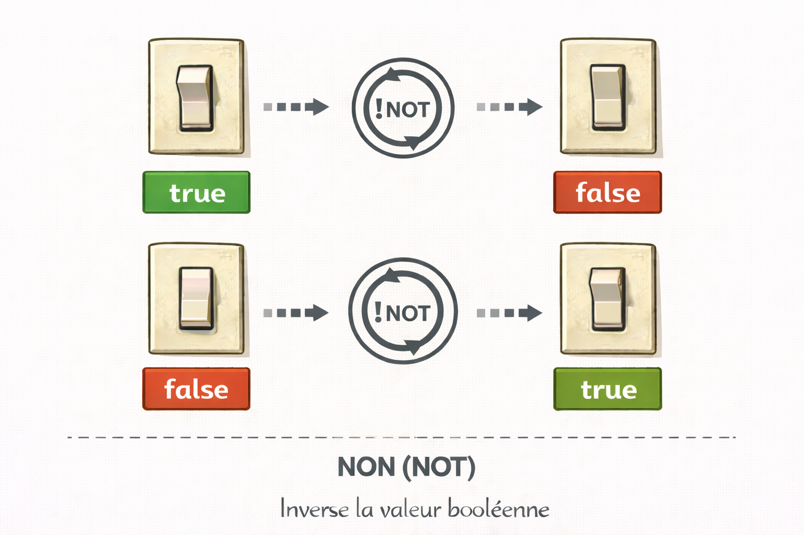
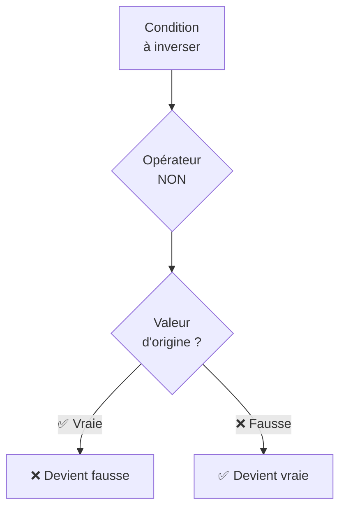
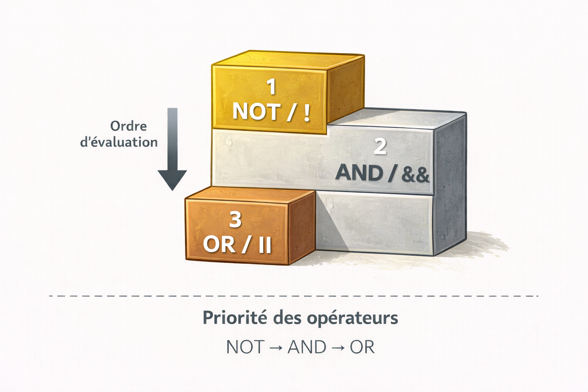

# Logique Booléenne

<div
  class="omny-meta"
  data-level="🟢 Débutant & 🟡 Intermédiaire"
  data-version="1.2"
  data-time="20-25 minutes">
</div>

!!! quote "Analogie"
    _Un interrupteur : il est soit allumé, soit éteint. Pas de position intermédiaire. En programmation, cette même logique s'applique partout : **vrai** ou **faux**, **oui** ou **non**, **autorisé** ou **interdit**._

La logique booléenne est le système qui permet aux programmes de prendre des décisions. C'est l'un des concepts les plus simples et les plus puissants de l'informatique. Elle repose sur deux états exclusifs : **vrai** et **faux**.

Cette logique permet de contrôler l'accès aux applications, de vérifier plusieurs conditions simultanément, de produire des choix automatiques et de sécuriser les systèmes en combinant plusieurs vérifications.

!!! info "Pourquoi c'est important"
    La logique booléenne est le fondement des décisions automatiques dans tout programme. Elle régit l'**authentification**, les **contrôles d'accès**, les **règles de sécurité** et toute forme de **validation conditionnelle**.

!!! note "Cette fiche fait suite aux [Types Primitifs](./types-primitifs.md). Le type `bool` y a été introduit — il est au cœur de tout ce qui suit."

<br />

---

## Les deux valeurs fondamentales

En logique booléenne, il n'existe que deux valeurs possibles, représentant les états binaires fondamentaux de tout système informatique.

| Valeur | Signification | En binaire | Exemples concrets |
|:---:|---|:---:|---|
| `true` / `True` | Vrai, oui, autorisé | **1** | Feu vert, porte ouverte, wifi connecté |
| `false` / `False` | Faux, non, refusé | **0** | Feu rouge, porte fermée, wifi déconnecté |

!!! warning "Point clé"
    La correspondance avec le binaire (**0** ou **1**) est fondamentale — le résultat de toute condition sera toujours l'un de ces deux états. C'est la base de la pensée informatique au niveau matériel.

<br />

!!! note "L'image ci-dessous ancre visuellement ce concept avant d'aborder les opérateurs. Comprendre que tout se réduit à deux états est le point de départ de toute logique conditionnelle."



<p><em>Deux états exclusifs, aucune valeur intermédiaire possible. L'interrupteur allumé correspond à true (1) — l'interrupteur éteint correspond à false (0). Tout résultat d'une condition en programmation aboutit à l'un de ces deux états.</em></p>

<br />

---

## Les trois opérateurs essentiels

Ces trois opérateurs permettent de combiner et modifier des conditions pour construire des décisions complexes. La logique sous-jacente est identique dans tous les langages — seule la syntaxe varie.

| Opérateur | :fontawesome-brands-python: Python | :fontawesome-brands-js: JS | :fontawesome-brands-php: PHP | :fontawesome-brands-golang: Go | Description |
|:---:|:---:|:---:|:---:|:---:|---|
| **ET** | `and` | `&&` | `&&` | `&&` | Toutes les conditions doivent être vraies |
| **OU** | `or` | `\|\|` | `\|\|` | `\|\|` | Une seule condition suffit |
| **NON** | `not` | `!` | `!` | `!` | Inverse la valeur |

<br />

---

## L'opérateur ET (AND)

L'opérateur **ET** exige que toutes les conditions soient vraies simultanément pour que le résultat soit vrai. C'est l'outil privilégié pour les vérifications de sécurité où aucune condition ne peut être négligée.

!!! quote "Analogie"
    _Un coffre-fort qui nécessite la bonne clé ET le bon code ET l'empreinte digitale valide. L'absence d'un seul élément bloque l'accès, quelle que soit la validité des autres._

<br />

!!! note "L'image ci-dessous illustre l'exigence d'unanimité de l'opérateur ET. Visualiser chaque condition comme un cadenas distinct aide à comprendre pourquoi une seule condition fausse suffit à bloquer le résultat entier."



<p><em>Trois cadenas, trois conditions obligatoires. Le coffre ne s'ouvre que si les trois sont validés simultanément. Un seul cadenas rouge bloque l'accès, indépendamment des deux autres. C'est exactement le comportement de l'opérateur ET.</em></p>

### Table de vérité ET (AND)

| A (badge) | B (code) | A **ET** B | Résultat |
|:---:|:---:|:---:|---|
| ❌ Faux | ❌ Faux | ❌ Faux | Pas de badge ET pas de code → Refusé |
| ❌ Faux | ✅ Vrai | ❌ Faux | Pas de badge ET bon code → Refusé |
| ✅ Vrai | ❌ Faux | ❌ Faux | Bon badge ET pas de code → Refusé |
| ✅ Vrai | ✅ Vrai | ✅ Vrai | Bon badge ET bon code → Autorisé |

Une seule condition fausse invalide l'ensemble de l'expression.

### Schéma du mécanisme ET


```mermaid
flowchart TB
  A["Plusieurs conditions<br />à vérifier"] --> B{"Opérateur<br />ET"}
  B --> C{"TOUTES<br />sont vraies ?"}
  C -.->|"✅ Oui"| D["✅ Action autorisée"]
  C -.->|"❌ Non"| E["❌ Action refusée"]
```

<p><em>Dès qu'une seule condition échoue, l'ensemble de l'expression devient fausse et l'action est refusée. Cette rigueur fait de l'opérateur ET l'outil privilégié pour les contrôles de sécurité où aucun critère ne peut être négligé.</em></p>

<br />

---

## L'opérateur OU (OR)

L'opérateur **OU** nécessite qu'au moins une condition soit vraie pour que le résultat soit vrai. Il permet d'offrir plusieurs chemins alternatifs vers un même objectif.

!!! quote "Analogie"
    _Un bâtiment accessible par l'entrée principale OU l'entrée de service OU le parking. Une seule porte ouverte suffit — les autres peuvent rester fermées sans bloquer l'accès._

<br />

!!! note "L'image ci-dessous rend visible la différence fondamentale avec l'opérateur ET : ici, une seule voie ouverte suffit. Cette flexibilité est exactement ce qui permet de proposer plusieurs méthodes d'authentification alternatives."



<p><em>Trois entrées disponibles, une seule ouverte (verte). Cela suffit pour accéder au bâtiment — les deux autres fermées (rouges) ne bloquent pas l'accès. C'est exactement le comportement de l'opérateur OU : une condition vraie suffit.</em></p>

### Table de vérité OU (OR)

| A (mot de passe) | B (biométrie) | A **OU** B | Résultat |
|:---:|:---:|:---:|---|
| ❌ Faux | ❌ Faux | ❌ Faux | Aucune méthode valide → Refusé |
| ❌ Faux | ✅ Vrai | ✅ Vrai | Biométrie OK → Autorisé |
| ✅ Vrai | ❌ Faux | ✅ Vrai | Mot de passe OK → Autorisé |
| ✅ Vrai | ✅ Vrai | ✅ Vrai | Les deux valides → Autorisé |

Une seule condition vraie suffit à valider l'ensemble de l'expression.

### Schéma du mécanisme OU


```mermaid
flowchart TB
  A["Plusieurs options<br />possibles"] --> B{"Opérateur<br />OU"}
  B --> C{"AU MOINS UNE<br />est vraie ?"}
  C -->|"✅ Oui"| D["✅ Action autorisée"]
  C -->|"❌ Non"| E["❌ Action refusée"]
```

<p><em>L'opérateur OU autorise l'action dès qu'une seule condition parmi l'ensemble est satisfaite. Cette permissivité permet d'offrir plusieurs méthodes d'authentification sans qu'une seule soit obligatoire.</em></p>

<br />

---

## L'opérateur NON (NOT)

L'opérateur **NON** inverse complètement la valeur booléenne : vrai devient faux, faux devient vrai.

!!! quote "Analogie"
    _Un interrupteur inversé : appuyer dessus éteint la lumière au lieu de l'allumer. Dire qu'un compte n'est pas bloqué revient à affirmer qu'il est accessible._

<br />

!!! note "L'image ci-dessous matérialise l'inversion. Voir physiquement la transformation vrai → faux et faux → vrai aide à comprendre pourquoi les doubles négations dans le code créent de la confusion mentale."



<p><em>L'opérateur NON applique une transformation systématique : true devient false, false devient true. Comme un miroir logique — chaque valeur est remplacée par son opposé exact. Combiner deux NON successifs restitue la valeur d'origine.</em></p>

### Table de vérité NON (NOT)

| A (compte bloqué) | **NON** A | Résultat |
|:---:|:---:|---|
| ❌ Faux | ✅ Vrai | Compte PAS bloqué → Autorisé |
| ✅ Vrai | ❌ Faux | Compte bloqué → Refusé |

### Schéma du mécanisme NON


```mermaid
flowchart TB
  A["Condition<br />à inverser"] --> B{"Opérateur<br />NON"}
  B --> C{"Valeur<br />d'origine ?"}
  C -->|"✅ Vraie"| D["❌ Devient fausse"]
  C -->|"❌ Fausse"| E["✅ Devient vraie"]
```

<p><em>L'opérateur NON permet d'exprimer des conditions négatives de manière explicite. Un usage excessif de la négation nuit à la lisibilité — les bonnes pratiques de nommage en fin de fiche y répondent.</em></p>

<br />

---

## Exemples par langage

### :fontawesome-brands-python: Python — contrôle d'accès

```python title="Python — opérateurs booléens ET, OU, NON"
# Vérification d'accès à un contenu avec restrictions d'âge
age = 17
a_autorisation_parentale = True
film_tout_public = False

# Logique ET : toutes les conditions requises
majeur = age >= 18 and not film_tout_public
print(f"Majeur : {majeur}")  # False

# Logique OU : une seule condition suffit
peut_voir = film_tout_public or (age >= 18) or a_autorisation_parentale
print(f"Peut voir : {peut_voir}")  # True
```

_L'utilisateur mineur accède au contenu grâce à l'autorisation parentale — démonstration de la flexibilité de l'opérateur OU combiné à ET._

---

### :fontawesome-brands-js: JavaScript — authentification

```javascript title="JavaScript — opérateurs booléens et nommage affirmatif"
// Vérification de connexion avec nommage clair
let motDePasseCorrect   = true;
let compteActif         = true;
let tentativesValides   = true;

// Logique ET : toutes les conditions doivent être vraies
let connexionAutorisee = motDePasseCorrect && compteActif && tentativesValides;
console.log(`Connexion autorisée : ${connexionAutorisee}`);  // true

// Nommage affirmatif — élimine les doubles négations
let aucunBloquage              = true;
let nombreTentativesAcceptable = true;

let accesSecurise = motDePasseCorrect && aucunBloquage && nombreTentativesAcceptable;
console.log(`Accès sécurisé : ${accesSecurise}`);  // true
```

_Convention de nommage affirmative : le code se lit comme une phrase — "la connexion est autorisée si le mot de passe est correct ET le compte est actif ET les tentatives sont valides"._

---

### :fontawesome-brands-php: PHP — validation de formulaire

```php title="PHP — combinaison ET et OU pour la validation"
<?php
// Validation de formulaire avec vérifications multiples
$nom_rempli     = true;
$email_valide   = true;
$age_suffisant  = false;  // Utilisateur de 16 ans
$accord_parental = true;

// Logique ET : conditions obligatoires
$infos_completes = $nom_rempli && $email_valide;

// Logique OU : soit majeur soit accord parental
$age_acceptable = $age_suffisant || $accord_parental;

// Résultat final combinant les deux vérifications
$peut_valider = $infos_completes && $age_acceptable;
echo $peut_valider ? "Formulaire validé" : "Formulaire refusé";  // Formulaire validé
?>
```

_ET et OU combinés : le formulaire est validé pour un mineur disposant d'une autorisation parentale — règle de validation sophistiquée en trois variables._

---

### :fontawesome-brands-golang: Go — système de sécurité

```go title="Go — conditions d'accès standard et exceptionnel"
package main

import "fmt"

func main() {
    // Variables de contrôle d'accès
    badgeValide     := true
    codeCorrect     := true
    heuresBureau    := false  // 22h — hors horaires normaux
    estAgentSecurite := true

    // Accès standard : badge ET code ET horaires
    accesStandard := badgeValide && codeCorrect && heuresBureau

    // Accès exceptionnel : agent de sécurité avec badge
    accesExceptionnel := estAgentSecurite && badgeValide

    // Décision finale : standard OU exceptionnel
    accesAutorise := accesStandard || accesExceptionnel
    fmt.Printf("Accès autorisé : %t\n", accesAutorise)  // true
}
```

!!! note "Lecture du code"
    Si `estAgentSecurite` était false et `heuresBureau` également false, alors `accesAutorise` retournerait false — les deux chemins échoueraient simultanément. L'opérateur OU n'autorise l'accès que si au moins un chemin aboutit.

<br />

---

## Ordre de priorité des opérateurs

Comme en mathématiques, les opérateurs booléens suivent un ordre de priorité strict qui détermine l'ordre d'évaluation des expressions complexes.

| Priorité | Opérateur | Évaluation |
|:---:|---|---|
| **1** | `NOT` / `!` | La négation s'applique en premier |
| **2** | `AND` / `&&` | Les conjonctions ensuite |
| **3** | `OR` / `\|\|` | Les disjonctions en dernier |

<br />

!!! note "L'image ci-dessous rend cet ordre immédiatement mémorisable. Connaître cette hiérarchie évite des erreurs logiques difficiles à détecter dans des expressions complexes."



<p><em>Comme en mathématiques où la multiplication précède l'addition, les opérateurs booléens suivent une hiérarchie fixe : NOT s'évalue en premier, AND ensuite, OR en dernier. Une expression sans parenthèses est toujours interprétée selon cet ordre — d'où l'importance d'expliciter les intentions avec des parenthèses.</em></p>

```python title="Python — priorité des opérateurs et parenthèses"
# Expression sans parenthèses : A or B and not C
# Évaluée automatiquement comme : A or (B and (not C))

A = False
B = True
C = False

# Évaluation selon l'ordre de priorité
resultat = A or B and not C
print(resultat)  # True

# Version explicite — intention claire pour le lecteur
resultat_explicite = A or (B and (not C))
print(resultat_explicite)  # True
```

!!! tip "Règle professionnelle"
    Utiliser systématiquement des parenthèses pour expliciter les intentions lorsque plusieurs opérateurs sont combinés. Un code lisible vaut toujours mieux qu'un code compact mais ambigu.

<br />

---

## Bonnes pratiques de nommage

Le nommage des variables booléennes est souvent négligé mais crucial pour la lisibilité du code.  
Une convention affirmative élimine les ambiguïtés et facilite la maintenance.

### Convention affirmative recommandée

Privilégier des noms de variables affirmatifs qui expriment directement l'état positif vérifié — cette approche élimine les opérateurs de négation superflus qui compliquent la lecture.

```python title="Python — nommage négatif vs affirmatif"
# Nommage négatif — crée des doubles négations
compte_bloque = False
if not compte_bloque:  # "pas compte bloqué" — charge cognitive élevée
    print("Accès autorisé")

# Nommage affirmatif — intention immédiatement lisible
compte_actif = True
if compte_actif:  # "compte actif" — lecture directe
    print("Accès autorisé")
```

!!! example "Déconstruction de la double négation"
    Avec `compte_bloque = False` suivi de `if not compte_bloque`, le lecteur effectue deux opérations mentales successives.

    1. `compte_bloque = False` signifie que le compte n'est pas bloqué.
    2. `not compte_bloque` inverse cette valeur — "pas bloqué" devient "accessible".

    Cette gymnastique cognitive ralentit la lecture et augmente le risque d'erreur lors des modifications. La version affirmative `compte_actif = True` + `if compte_actif` se lit en une seule passe, sans traduction mentale intermédiaire.

<br />

---

## Évaluation en court-circuit

Les opérateurs `and`/`&&` et `or`/`||` n'évaluent pas systématiquement toutes leurs conditions — ils s'arrêtent dès que le résultat est déterminé. Ce comportement, appelé **court-circuit** (_short-circuit evaluation_), a des implications importantes sur les performances et la sécurité du code.

| Opérateur | Court-circuit si… | Explication |
|:---:|---|---|
| `A and B` (`A && B`) | `A` est **faux** | `B` n'est jamais évalué — le résultat est déjà `false` |
| `A or B` (`A \|\| B`) | `A` est **vrai** | `B` n'est jamais évalué — le résultat est déjà `true` |

!!! tip "Pourquoi c'est utile"
    Le court-circuit permet de **protéger des opérations coûteuses ou risquées** en les plaçant en deuxième position. Si la première condition échoue, la seconde n'est jamais exécutée — ce qui évite des erreurs ou des traitements inutiles.

```python title="Python — court-circuit en pratique"
utilisateur = None

# Sans court-circuit, accéder à utilisateur.role planterait avec une AttributeError
# Grâce au court-circuit, la seconde condition n'est jamais évaluée si la première est fausse
if utilisateur is not None and utilisateur.role == "admin":
    print("Accès administrateur accordé")

# Même logique avec or — valeur par défaut si la première est falsy
nom = utilisateur or "Invité"  # Retourne "Invité" si utilisateur est None/falsy
print(f"Bonjour {nom}")
```

!!! warning "Attention aux effets de bord"
    Ne pas placer une opération avec un **effet de bord** (modification d'une variable, appel API, écriture en base…) dans la partie qui peut être court-circuitée — elle ne s'exécuterait pas dans tous les cas, ce qui créerait un comportement imprévisible.

---

## Conclusion

!!! quote "Ce qu'il faut retenir"
    Ces notions fondamentales sur logique booleenne sont essentielles pour la suite de votre parcours. Consolidez ces acquis théoriques par la pratique avant de passer aux modules spécialisés (Cybersécurité, Infrastructure ou Développement).

!!! quote "Conclusion"
    _La logique booléenne représente le langage fondamental des décisions informatiques. Au début, chaque condition et chaque opérateur demandent une réflexion consciente. Avec la pratique, cette logique devient un réflexe — et les conditions se structurent naturellement, clairement, efficacement._

    _Cette logique s'applique déjà quotidiennement dans tout raisonnement naturel. Il s'agit simplement d'apprendre à l'exprimer formellement à un ordinateur._

<br />