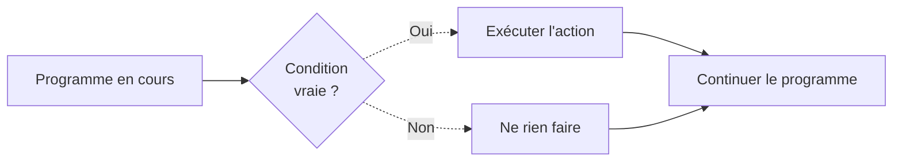
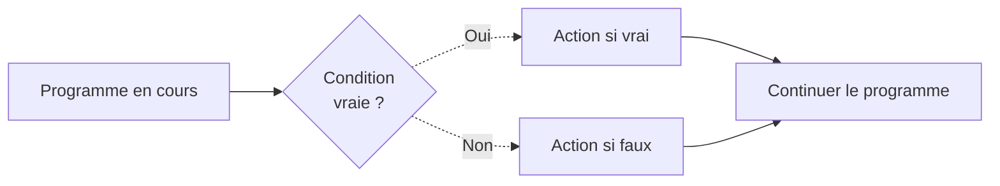
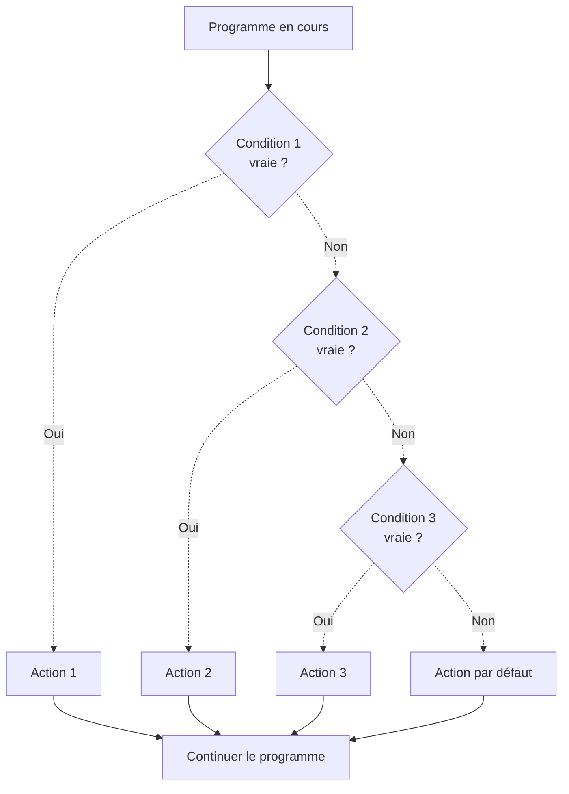

# Logique Conditionnelle

## Introduction

**Niveau :** Débutant & Intermédiaire

!!! quote "Analogie pédagogique"
    _Imaginez un garde de sécurité qui ne se contente pas de regarder votre badge. Il **prend des décisions** : **si** votre badge est valide, il vous laisse passer ; **sinon**, il vous demande une pièce d'identité. **Si** vous êtes VIP, il vous accompagne directement ; **sinon**, il vous donne un badge temporaire._ 
    
    _C'est exactement ce que fait la logique conditionnelle :  
    Elle permet à vos programmes de réagir intelligemment selon les situations._

Nous avons découvert les **types primitifs** qui constituent les briques de base de nos données, nous avons compris comment la mémoire organise ces données entre **Stack et Heap**, puis maîtrisé la **logique booléenne** qui évalue si des conditions sont vraies ou fausses.

**La logique conditionnelle** représente l'étape suivante naturelle : maintenant que nos programmes savent déterminer qu'une condition est vraie ou fausse, **ils peuvent décider quelle action exécuter en conséquence**. Cette capacité décisionnelle transforme nos programmes en systèmes intelligents capables d'adapter leur comportement selon le contexte plutôt que de suivre aveuglément un chemin unique prédéfini.


!!! info "Pourquoi c'est important ?"
    La logique conditionnelle régit la **validation des données**, la **gestion des erreurs**, les **systèmes de sécurité** multi-niveaux et l'**expérience utilisateur** adaptative. Elle transforme des instructions statiques en comportements dynamiques.

## Pour repartir des bases (vrais débutants)

Si vous n'avez pas encore lu la documentation sur **la logique booléenne**, faites-le d'abord. **La logique conditionnelle** s'appuie directement sur les concepts **vrai/faux** et **les opérateurs ET/OU/NON** que nous y avons découverts.

Ces fondations **booléennes** constituent les briques essentielles qui permettent de construire les conditions qui alimentent les structures décisionnelles que nous allons explorer.

!!! tip "C'est la suite logique !"
    Si vous avez compris **la logique booléenne**, **la logique conditionnelle** sera naturelle. C'est simplement ajouter **"que faire"** après avoir déterminé **"vrai ou faux"**. Lorsque vous dites _**"Si j'ai ma carte ET mon code alors j'entre sinon je reste dehors"**_, vous exprimez déjà de la logique conditionnelle.

## Les trois structures fondamentales

En logique conditionnelle, trois structures couvrent tous les cas de décision que vous pouvez rencontrer dans vos programmes.

| Structure | Expression naturelle | Utilité |
| --- | --- | --- |
| **IF** | "Si... alors..." | Une condition, une action |
| **IF/ELSE** | "Si... alors... sinon..." | Une condition, deux actions possibles |
| **IF/ELIF/ELSE** | "Si... sinon si... sinon..." | Plusieurs conditions, plusieurs actions |

!!! warning "Attention à la syntaxe selon les langages"
    La syntaxe du **"sinon si"** varie selon les langages de programmation. 
    
    - [x] **Python** utilise `elif` (un seul mot)
    - [x] **PHP** utilise `elseif` (un seul mot)
    - [x] **JavaScript**, **Go** et **Rust** utilisent `else if` (deux mots séparés)
    
    Cette différence constitue une source d'erreurs fréquentes lors du passage d'un langage à un autre.

!!! note "Cas particulier de Bash"
    Le **shell Bash** adopte une approche distincte en encadrant explicitement ses structures conditionnelles. La condition commence par `if` et se termine par `fi` (**if inversé**), créant ainsi un bloc visuellement délimité. Cette syntaxe reflète **la philosophie des shells Unix** où **les mots-clés de fermeture inversent leurs équivalents d'ouverture**, comme `case`/`esac` ou `do`/`done`.

## Les opérateurs de comparaison

Avant d'explorer les structures conditionnelles en détail, **nous devons comprendre comment formuler les conditions qui les alimentent**. **Les opérateurs de comparaison** permettent d'**évaluer les relations entre les valeurs** et **retournent systématiquement une valeur booléenne vraie ou fausse**. Ces opérateurs constituent le vocabulaire de base qui transforme vos données en décisions.

- **L'opérateur d'égalité** `==` vérifie si deux valeurs sont identiques
- **L'opérateur d'inégalité** `!=` confirme que deux valeurs diffèrent
- **Les opérateurs de relation** `<`, `<=`, `>` et `>=` établissent des comparaisons numériques ou alphabétiques selon le contexte

**Chaque comparaison produit un résultat binaire** qui alimente directement les structures **IF**, **ELSE** et **ELIF** que nous allons découvrir.

| Opérateur | Signification | Exemple | Résultat |
| :---: | :---: | :---: | :---: |
| `==` | Égal à | `5 == 5` | `true` |
| `!=` | Différent de | `5 != 3` | `true` |
| `<` | Inférieur à | `3 < 5` | `true` |
| `<=` | Inférieur ou égal | `5 <= 5` | `true` |
| `>` | Supérieur à | `7 > 3` | `true` |
| `>=` | Supérieur ou égal | `5 >= 5` | `true` |

!!! warning "Particularité JavaScript"
    **JavaScript se distingue par son comportement permissif** qui convertit automatiquement les types lors des comparaisons avec l'opérateur `==`. L'expression `5 == "5"` retourne `true` car JavaScript convertit implicitement la chaîne de caractères `"5"` en nombre. **Pour comparer simultanément la valeur et le type, utilisez l'opérateur de comparaison stricte** `===`.  
    Ainsi `5 === "5"` retourne `false` car **les types diffèrent malgré la valeur identique**.
    
    > Cette distinction devient cruciale lors de la validation de données provenant de formulaires ou d'APIs externes.

## Structure **IF** simple

La structure IF exécute une action uniquement si une condition est vraie. Si la condition est fausse, le programme ne fait rien et continue simplement son exécution normale.

!!! abstract "Analogie"
    Considérez un détecteur de mouvement qui **allume la lumière uniquement si quelqu'un passe**. En l'absence de mouvement, **rien ne se produit et la lumière reste éteinte**. Une seule condition déclenche une seule action possible.

### Fonctionnement de la structure IF


_Ce diagramme illustre le mécanisme décisionnel de la structure IF où **l'action ne s'exécute que si la condition est vraie**. Dans le cas contraire, **le programme ignore complètement le bloc d'instructions** et poursuit son exécution normale. Cette structure convient parfaitement aux situations où vous devez réagir à une circonstance spécifique sans avoir besoin d'alternative._

### Exemples par langage
```python
# Langage : Python
# ----------------------------------------------------------------
# Contrôle d'accès avec une seule vérification
badge_valide = True

if badge_valide:
    print("Accès autorisé")
    # Action : ouvrir la porte
```
```javascript
// Langage : JavaScript
// ----------------------------------------------------------------
// Validation de formulaire basique
let emailRempli = true;

if (emailRempli) {
    console.log('Formulaire prêt à être envoyé');
    // Action : activer le bouton d'envoi
}
```
```php
# Langage : PHP
# ----------------------------------------------------------------
<?php
// Vérification de session utilisateur
$session_active = true;

if ($session_active) {
    echo "Session valide - Chargement des données";
    // Action : charger les préférences utilisateur
}
?>
```

_Ces exemples démontrent que la structure **IF simple** s'utilise lorsqu'une action spécifique doit survenir uniquement dans certaines circonstances **sans nécessiter d'action alternative**._

## Structure **IF/ELSE**

La structure **IF/ELSE garantit qu'une action sera toujours exécutée** en offrant **deux chemins alternatifs** selon l'évaluation de la condition. Contrairement au **IF** simple, cette structure **produit systématiquement un résultat**.

!!! abstract "Analogie"
    Imaginez un distributeur automatique qui vous donne le produit **si vous avez assez de monnaie**, ou **affiche "Monnaie insuffisante"** dans le cas contraire. Une condition détermine laquelle des deux actions s'exécutera, mais une action surviendra toujours dans tous les cas.

### Fonctionnement de la structure IF/ELSE


_Ce diagramme montre que la structure **IF/ELSE** force toujours une décision explicite en garantissant qu'une des deux branches s'exécutera. Cette structure **élimine les situations ambiguës où le programme ne réagirait pas du tout**, assurant ainsi une gestion complète de tous les cas possibles._

### Exemples par langage
```python
# Langage : Python
# ----------------------------------------------------------------
# Authentification utilisateur avec retour explicite
mot_de_passe = "secret123"
saisie = "secret123"

if mot_de_passe == saisie:
    print("Authentification réussie")
    # Action : rediriger vers l'application
else:
    print("Authentification échouée")
    # Action : afficher le formulaire avec erreur
```
```javascript
// Langage : JavaScript
// ----------------------------------------------------------------
// Contrôle d'âge avec deux chemins distincts
let age = 17;

if (age >= 18) {
    console.log('Accès complet autorisé');
    // Action : afficher le contenu adulte
} else {
    console.log('Accès limité au contenu jeunesse');
    // Action : afficher le contenu adapté
}
```
```php
# Langage : PHP
# ----------------------------------------------------------------
<?php
// Vérification de stock avec gestion des deux cas
$stock_disponible = 5;
$quantite_demandee = 8;

if ($stock_disponible >= $quantite_demandee) {
    echo "Commande acceptée - Stock suffisant";
    // Action : traiter la commande
} else {
    echo "Commande refusée - Stock insuffisant";
    // Action : proposer des alternatives
}
?>
```

_La structure **IF/ELSE** s'impose lorsque **votre logique métier nécessite une réponse explicite dans tous les scénarios possibles**, garantissant ainsi que votre programme gère exhaustivement chaque situation._

## Structure IF/ELIF/ELSE

La structure **IF/ELIF/ELSE** permet de **tester plusieurs conditions séquentiellement jusqu'à ce qu'une condition vraie soit rencontrée**. Cette évaluation séquentielle s'arrête dès qu'une condition est satisfaite, _ignorant toutes les conditions suivantes_.

!!! abstract "Analogie"
    Considérez un système de triage médical qui évalue la gravité dans un ordre précis. Si c'est une urgence vitale, direction la salle d'urgence immédiatement. Sinon, si c'est urgent, salle d'attente prioritaire. Sinon, si c'est normal, salle d'attente standard. Sinon, consultation de routine. Chaque patient passe par ce processus séquentiel jusqu'à correspondre à une catégorie.

### Fonctionnement de la structure IF/ELIF/ELSE


_Ce diagramme illustre **l'évaluation en cascade où chaque condition est testée uniquement si toutes les conditions précédentes** ont échoué. Dès qu'une condition est vraie, son action s'exécute et toutes les conditions suivantes sont ignorées. Cette approche séquentielle permet de hiérarchiser les décisions du plus spécifique au plus général._

!!! warning "Principe de l'évaluation séquentielle"
    **Les conditions sont testées dans l'ordre d'apparition dans votre code**. Dès qu'une condition est vraie, son action s'exécute et toutes les conditions suivantes sont ignorées. *L'ordre de vos conditions impacte donc directement le comportement de votre programme*. **Placez toujours les conditions les plus spécifiques avant les conditions les plus générales**.

### Exemples par langage
```python
# Langage : Python
# ----------------------------------------------------------------
# Système de notation avec plusieurs niveaux
note = 15

if note >= 18:
    print(f"Note {note}/20 : Mention très bien")
elif note >= 14:
    print(f"Note {note}/20 : Mention bien")
elif note >= 10:
    print(f"Note {note}/20 : Mention passable")
else:
    print(f"Note {note}/20 : Insuffisant - Rattrapage requis")
```
```javascript
// Langage : JavaScript
// ----------------------------------------------------------------
// Classification d'utilisateurs selon l'activité
let nombreConnexions = 150;

if (nombreConnexions >= 1000) {
    console.log('Utilisateur VIP - Fonctionnalités premium');
} else if (nombreConnexions >= 100) {
    console.log('Utilisateur régulier - Accès standard');
} else if (nombreConnexions >= 10) {
    console.log('Nouvel utilisateur - Guide activé');
} else {
    console.log('Utilisateur débutant - Aide contextuelle');
}
```
```php
# Langage : PHP
# ----------------------------------------------------------------
<?php
// Gestion des niveaux de sécurité avec réponse graduée
$niveau_menace = 7;

if ($niveau_menace >= 9) {
    echo "Alerte critique - Isolement immédiat";
    // Action : couper les connexions réseau
} elseif ($niveau_menace >= 7) {
    echo "Alerte élevée - Surveillance renforcée";
    // Action : activer la surveillance détaillée
} elseif ($niveau_menace >= 4) {
    echo "Alerte modérée - Analyse requise";
    // Action : analyser les journaux système
} else {
    echo "Situation normale - Surveillance standard";
    // Action : maintenir la surveillance normale
}
?>
```
```go
// Langage : Go
// ----------------------------------------------------------------
package main
import "fmt"

func main() {
    // Système de badges selon l'ancienneté
    anciennete := 8 // années
    
    if anciennete >= 10 {
        fmt.Println("Badge doré - Accès maximal")
    } else if anciennete >= 5 {
        fmt.Println("Badge argent - Accès étendu")
    } else if anciennete >= 2 {
        fmt.Println("Badge bronze - Accès standard")
    } else {
        fmt.Println("Badge blanc - Accès limité")
    }
}
```
```rust
// Langage : Rust
// ----------------------------------------------------------------
fn main() {
    // Classification de température avec actions adaptées
    let temperature: i32 = 22;
    
    if temperature >= 30 {
        println!("Canicule - Activer climatisation maximale");
    } else if temperature >= 25 {
        println!("Chaud - Ventilation recommandée");
    } else if temperature >= 18 {
        println!("Agréable - Aucune action requise");
    } else {
        println!("Froid - Activer chauffage");
    }
}
```

_La structure **IF/ELIF/ELSE** excelle dans les situations nécessitant une classification ou une catégorisation selon plusieurs critères hiérarchisés._


## Conditions complexes

Les conditions complexes **combinent plusieurs tests** en utilisant **les opérateurs booléens ET**, **OU** et **NON** que nous avons étudiés dans le chapitre précédent. Cette combinaison permet de créer des logiques décisionnelles sophistiquées reflétant fidèlement vos règles métier.

```python
# Langage : Python
# ----------------------------------------------------------------
# Système d'accès sécurisé avec multiples vérifications
badge_valide = True
code_correct = True
heures_bureau = False  # 22h
est_garde_securite = True

# Accès normal pendant les heures de bureau
if badge_valide and code_correct and heures_bureau:
    print("Accès normal autorisé")

# Accès exceptionnel pour la sécurité
elif badge_valide and est_garde_securite:
    print("Accès sécurité autorisé - Garde de nuit")

# Tentative hors horaires sans autorisation
elif badge_valide and code_correct and not heures_bureau:
    print("Accès refusé - Hors horaires sans autorisation")

else:
    print("Accès totalement refusé")
```

_Cet exemple démontre comment combiner **les opérateurs ET**, **OU** et **NON** pour créer des conditions qui reflètent précisément les règles de sécurité d'un environnement professionnel. Chaque branche représente un scénario distinct avec ses propres exigences._

!!! note
    Les structures conditionnelles que nous avons explorées couvrent la majorité des situations décisionnelles que vous rencontrerez dans vos programmes quotidiens. **Toutefois, certains scénarios bénéficient de syntaxes spécialisées qui améliorent significativement la lisibilité et la maintenabilité du code**.

    Les structures avancées que nous allons découvrir maintenant représentent des outils complémentaires qui excellent dans des contextes spécifiques où les structures traditionnelles deviendraient verbeuses ou répétitives.

## Structures avancées

### Structure **SWITCH/CASE**

La structure **SWITCH/CASE** offre une alternative élégante aux longues chaînes **IF/ELIF/ELSE** lorsque vous testez plusieurs valeurs possibles d'une même variable. Cette approche améliore significativement la lisibilité du code dans les scénarios de classification ou de routage.

```python
# Langage : Python (3.10+)
# ----------------------------------------------------------------
# Gestion des codes HTTP avec match/case
code_http = 404

match code_http:
    case 200:
        print("Succès - Requête traitée correctement")
    case 404:
        print("Erreur - Ressource introuvable")
    case 403:
        print("Erreur - Accès interdit")
    case 500:
        print("Erreur - Problème serveur interne")
    case _:  # Cas par défaut
        print("Code d'erreur non répertorié")
```
!!! note "Comprendre les codes HTTP"
    Les valeurs numériques utilisées dans cet exemple correspondent aux **codes de statut HTTP standardisés** qui régissent les communications web. 
    
    - 200 signale une requête réussie
    - 404 indique une ressource introuvable
    - 403 un accès interdit
    - 500 une erreur serveur.
    
    **Ces codes constituent le langage universel par lequel les serveurs communiquent l'état de leurs réponses aux clients**. Nous approfondirons ces concepts dans **la documentation consacrée aux protocoles réseau**, mais leur utilisation ici démontre comment la structure **SWITCH/CASE** gère élégamment des catégories distinctes de situations.

```javascript
// Langage : JavaScript
// ----------------------------------------------------------------
// Classification des jours de la semaine
let jour = 3;

switch (jour) {
    case 1:
        console.log('Lundi - Début de semaine');
        break;
    case 2:
    case 3:
    case 4:
        console.log('Milieu de semaine - Jour ouvrable');
        break;
    case 5:
        console.log('Vendredi - Fin de semaine');
        break;
    case 6:
    case 7:
        console.log('Weekend - Repos');
        break;
    default:
        console.log('Jour invalide');
}
```

_La structure **SWITCH/CASE** brille particulièrement lors de **la gestion de codes d'état**, de **catégories énumérées**, de **menus de navigation** où d'**une variable unique** détermine le chemin d'exécution._

### Opérateur ternaire

**L'opérateur ternaire** permet d'écrire **une condition simple IF/ELSE sur une seule ligne**, améliorant la concision du code pour les décisions triviales. Cette syntaxe convient parfaitement aux assignations conditionnelles simples.

```python
# Langage : Python
# ----------------------------------------------------------------
# Utilisation d'opérateurs ternaires pour des décisions simples
age = 20
score = 75

# valeur_si_vrai if condition else valeur_si_faux
statut = "Majeur" if age >= 18 else "Mineur"
resultat = "Réussi" if score >= 60 else "Échoué"

print(f"Statut : {statut}, Résultat : {resultat}")
```
```javascript
// Langage : JavaScript
// ----------------------------------------------------------------
// Ternaires pour assignations conditionnelles élégantes
let temperature = 22;
let pluie = false;

// condition ? valeur_si_vrai : valeur_si_faux
let vetement = temperature > 20 ? 'T-shirt' : 'Pull';
let activite = pluie ? 'Cinéma' : 'Parc';

console.log(`Porter : ${vetement}, Activité : ${activite}`);
```

_**L'opérateur ternaire** améliore la lisibilité pour les conditions simples **mais devrait être évité pour les logiques complexes** où la structure **IF/ELSE** traditionnelle demeure plus claire._

!!! danger "Conseil pour les débutants absolus"
    **Si vous découvrez la programmation, concentrez-vous d'abord exclusivement sur les structures IF/ELSE traditionnelles jusqu'à ce qu'elles deviennent une seconde nature**.
    
    **L'opérateur ternaire** représente simplement un raccourci syntaxique pour des cas très simples. **Maîtriser solidement les fondamentaux avant d'adopter les raccourcis garantit une compréhension profonde qui vous servira tout au long de votre carrière**. Vous pourrez revenir à cette syntaxe compacte une fois les structures conditionnelles de base parfaitement assimilées.

## Bonnes pratiques

Une logique conditionnelle bien structurée détermine **la maintenabilité** et **la fiabilité de vos programmes**.  
Ces pratiques éprouvées vous aideront à écrire du code clair et robuste.

### Principes fondamentaux

Commencez par des **structures simples** avant de **progresser vers des conditions complexes**. Testez chaque condition individuellement avant de les combiner pour identifier précisément les sources d'erreur potentielles. **Utilisez des parenthèses pour clarifier explicitement l'ordre d'évaluation dans les expressions complexes combinant plusieurs opérateurs booléens**.

**Nommez vos variables de manière explicite** en privilégiant la clarté sur la concision. Commentez systématiquement les conditions complexes pour expliquer la logique métier sous-jacente plutôt que la syntaxe évidente.

### Structure recommandée
```python
# Langage : Python
# ----------------------------------------------------------------
# Exemple de structure claire et maintenable
age_utilisateur = 25
a_permis_conduire = True
experience_annees = 3

# Variables intermédiaires nommées clairement
est_majeur = age_utilisateur >= 18
experience_suffisante = experience_annees >= 2
peut_conduire = a_permis_conduire and experience_suffisante

# Logique métier explicite
if est_majeur and peut_conduire:
    print("Location de voiture standard autorisée")
elif est_majeur and a_permis_conduire:
    print("Location limitée aux véhicules pour débutants")
else:
    print("Location refusée - Conditions non remplies")
```

_Cette structure utilise des **variables intermédiaires nommées explicitement** pour décomposer **la logique complexe en étapes compréhensibles**. Cette approche **facilite considérablement le débogage** et **la maintenance ultérieure**._

### Erreurs courantes à éviter

Plusieurs pièges récurrents guettent les développeurs débutants lors de l'écriture de conditions. Oublier les instructions `break` dans les structures `switch/case` en **JavaScript** et **PHP** provoque l'exécution de tous les cas suivants jusqu'à la fin du bloc.

!!! danger "Attention, en Go il n'y a pas de break dans les switch/case mais nous y reviendrons ultérieusement."

 Confondre **l'opérateur d'assignation/affectation** `=` avec **l'opérateur de comparaison** `==` génère des bugs subtils difficiles à détecter. **Imbriquer plus de trois niveaux de conditions rend le code illisible et difficile à maintenir**. Omettre le cas par défaut avec `else` laisse certains scénarios non gérés.
 
!!! warning "Tester les conditions dans le mauvais ordre peut empêcher certaines branches de s'exécuter si des conditions plus générales les précèdent."

## Le mot de la fin

!!! quote
    La logique conditionnelle transforme vos programmes en systèmes intelligents capables de s'adapter aux situations. Au début, vous décrirez chaque décision étape par étape en réfléchissant consciemment à chaque branche possible. Avec la pratique, vous développerez une intuition pour les structures optimales qui représentent élégamment vos règles métier.
    
    L'important réside dans la compréhension que chaque condition que vous écrivez représente une décision métier réelle. Plus vous maîtriserez ces structures, plus vos programmes deviendront intelligents et utiles.

---

!!! abstract "Métadonnées"
    **Version** : 1.0  
    **Dernière mise à jour** : Novembre 2025  
    **Durée de lecture** : 35-40 minutes  
    **Niveau** : Débutant & Intermédiaire