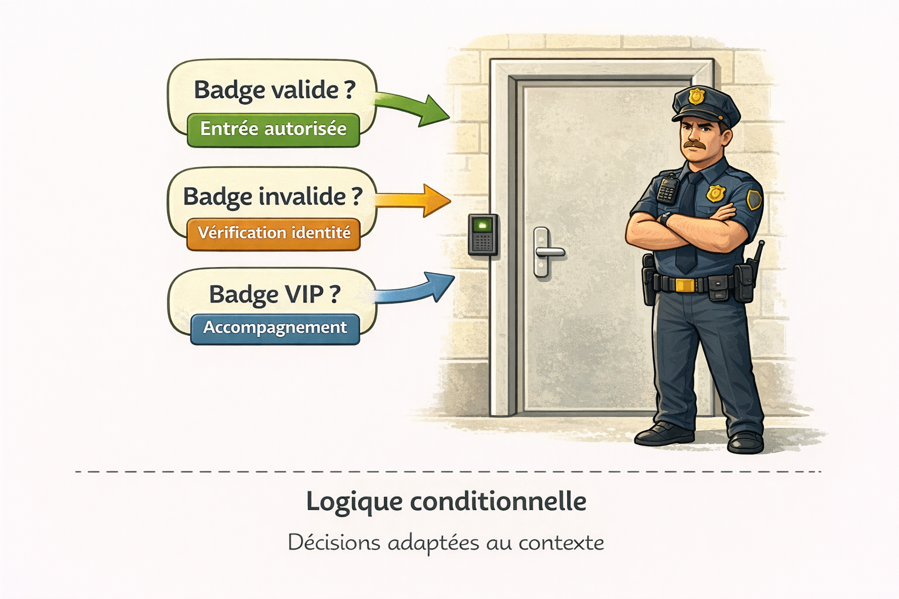
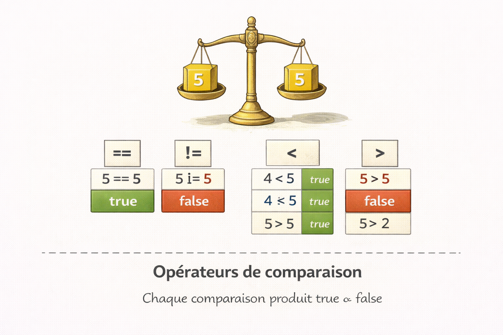
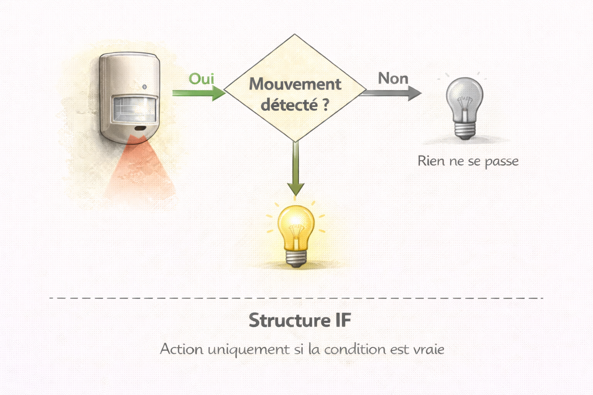
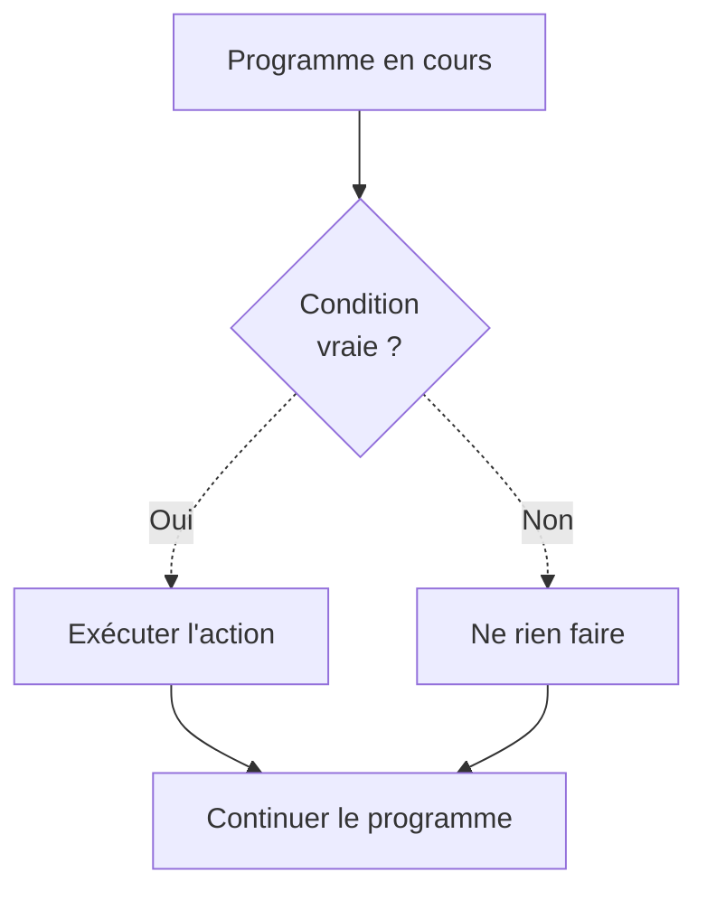
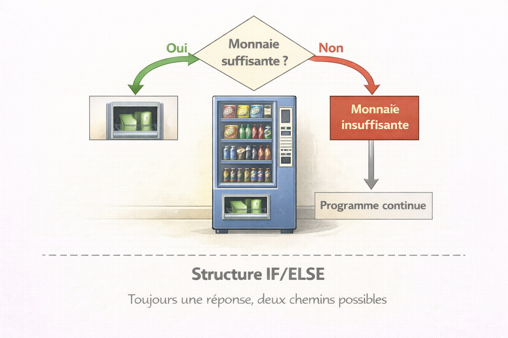
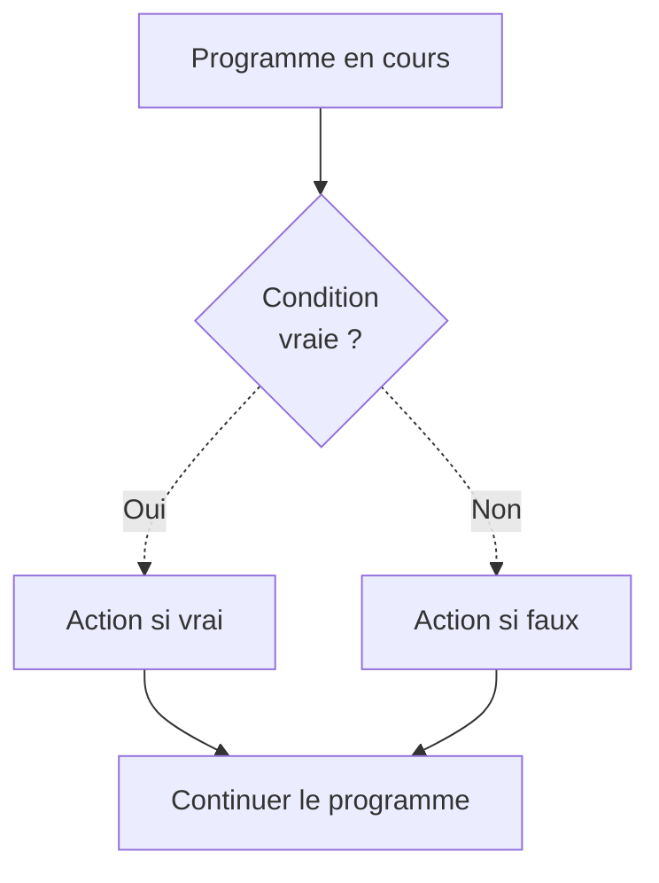
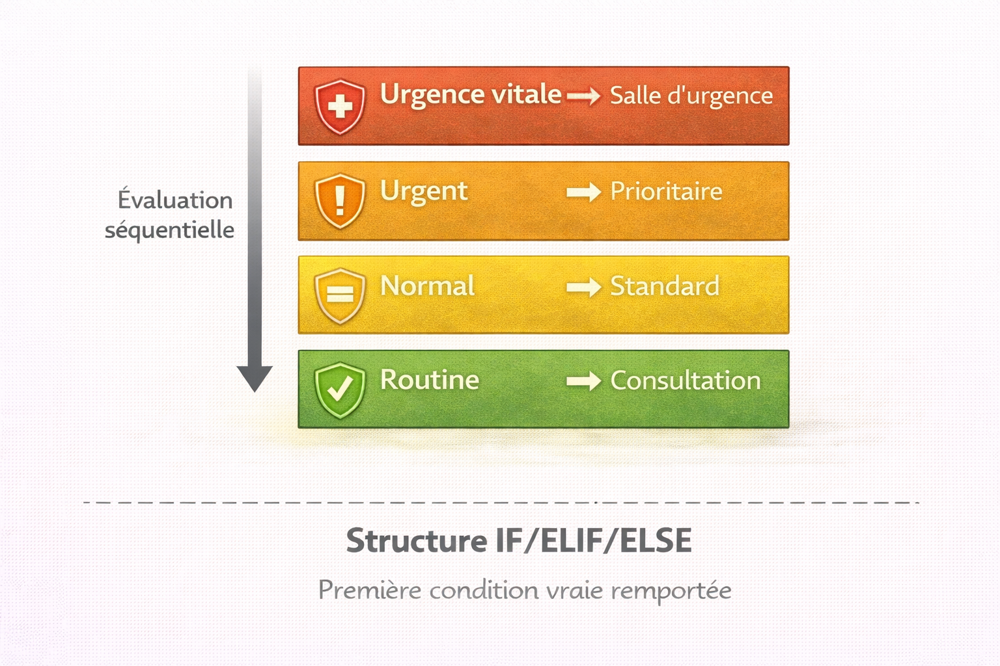
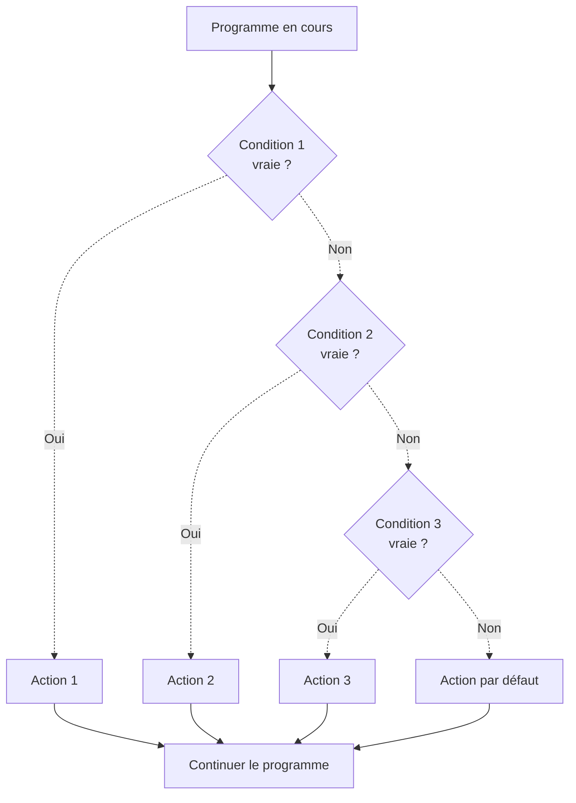

# Logique Conditionnelle

<div
  class="omny-meta"
  data-level="Débutant à Intermédiaire"
  data-version="1.2"
  data-time="35-40 minutes">
</div>

!!! quote "Analogie"
    _Un garde de sécurité ne se contente pas de regarder un badge — il prend des décisions : **si** le badge est valide, il laisse passer ; **sinon**, il demande une pièce d'identité. **Si** la personne est VIP, il l'accompagne ; **sinon**, il lui remet un badge temporaire. C'est exactement ce que fait la logique conditionnelle : permettre aux programmes de réagir intelligemment selon les situations._

Les types primitifs constituent les briques de base des données, la mémoire les organise entre Stack et Heap, la logique booléenne évalue si des conditions sont vraies ou fausses. La logique conditionnelle est l'étape suivante : maintenant que les programmes savent déterminer qu'une condition est vraie ou fausse, **ils peuvent décider quelle action exécuter en conséquence**. Cette capacité décisionnelle transforme des instructions statiques en comportements dynamiques.

!!! info "Pourquoi c'est important"
    La logique conditionnelle régit la **validation des données**, la **gestion des erreurs**, les **systèmes de sécurité** multi-niveaux et l'**expérience utilisateur** adaptative.

!!! note "Cette fiche fait suite à la [Logique Booléenne](./logique-booleenne.md). Les concepts vrai/faux et les opérateurs ET/OU/NON y sont introduits — ils sont au cœur de tout ce qui suit."

<br />

!!! note "L'image ci-dessous illustre concrètement ce que signifie 'prendre une décision' en programmation. Avant d'étudier les structures syntaxiques, visualiser le mécanisme décisionnel aide à comprendre pourquoi ces structures existent."



<p><em>Un garde de sécurité évalue une situation et prend des décisions adaptées selon ce qu'il observe. Badge valide ? Entrée autorisée. Badge invalide ? Vérification identité. Badge VIP ? Accompagnement. Un programme conditionnel fonctionne exactement de cette manière — il évalue, puis agit en conséquence.</em></p>

<br />

---

## Les trois structures fondamentales

En logique conditionnelle, trois structures couvrent tous les cas de décision rencontrables dans un programme.

| Structure | Expression naturelle | Utilité |
|---|---|---|
| **IF** | "Si... alors..." | Une condition, une action |
| **IF/ELSE** | "Si... alors... sinon..." | Une condition, deux actions possibles |
| **IF/ELIF/ELSE** | "Si... sinon si... sinon..." | Plusieurs conditions, plusieurs actions |

!!! warning "Syntaxe du 'sinon si' selon les langages"
    La syntaxe varie selon les langages — source d'erreurs fréquentes lors du passage de l'un à l'autre.

    - :fontawesome-brands-python: **Python** utilise `elif` (un seul mot)
    - :fontawesome-brands-php: **PHP** utilise `elseif` (un seul mot)
    - :fontawesome-brands-js: **JavaScript** et :fontawesome-brands-golang: **Go** utilisent `else if` (deux mots séparés)

!!! note "Cas particulier de Bash"
    Le shell Bash encadre ses structures conditionnelles : la condition commence par `if` et se termine par `fi` (if inversé). Cette syntaxe reflète la philosophie des shells Unix où les mots-clés de fermeture inversent leurs équivalents d'ouverture — comme `case`/`esac` ou `do`/`done`.

<br />

---

## Les opérateurs de comparaison

Avant d'explorer les structures conditionnelles, il faut comprendre comment formuler les conditions qui les alimentent. Les opérateurs de comparaison évaluent les relations entre valeurs et retournent systématiquement un booléen.

| Opérateur | Signification | Exemple | Résultat |
|:---:|:---:|:---:|:---:|
| `==` | Égal à | `5 == 5` | `true` |
| `!=` | Différent de | `5 != 3` | `true` |
| `<` | Inférieur à | `3 < 5` | `true` |
| `<=` | Inférieur ou égal | `5 <= 5` | `true` |
| `>` | Supérieur à | `7 > 3` | `true` |
| `>=` | Supérieur ou égal | `5 >= 5` | `true` |

!!! warning "Particularité JavaScript"
    JavaScript convertit automatiquement les types lors des comparaisons avec `==`. L'expression `5 == "5"` retourne `true` — JavaScript convertit implicitement la chaîne en nombre. Pour comparer simultanément la valeur et le type, utiliser `===` : `5 === "5"` retourne `false`. Cette distinction devient cruciale lors de la validation de données provenant de formulaires ou d'APIs externes.

<br />

!!! note "L'image ci-dessous matérialise ce que fait concrètement un opérateur de comparaison. Voir les six opérateurs organisés visuellement aide à mémoriser leur signification et leur résultat avant de les utiliser dans des conditions réelles."



<p><em>Chaque opérateur de comparaison évalue la relation entre deux valeurs et produit un résultat binaire : true ou false. Comme une balance qui penche d'un côté ou de l'autre, la comparaison aboutit toujours à l'un des deux états — jamais de valeur intermédiaire.</em></p>

<br />

---

## Structure IF — simple

La structure IF exécute une action uniquement si la condition est vraie. Si la condition est fausse, le programme continue sans rien faire.

!!! quote "Analogie"
    _Un détecteur de mouvement qui allume la lumière uniquement si quelqu'un passe. En l'absence de mouvement, rien ne se produit — la lumière reste éteinte._

<br />

!!! note "L'image ci-dessous illustre le mécanisme le plus fondamental de la logique conditionnelle. Comprendre que l'action n'existe que si la condition est vraie — et qu'en cas contraire le programme continue simplement — est le point de départ de toute structure décisionnelle."



<p><em>Le détecteur évalue une unique condition : "y a-t-il du mouvement ?". Si oui — ampoule allumée. Si non — rien ne se passe, le programme continue. C'est exactement le comportement de la structure IF : une condition, une action possible, aucune alternative.</em></p>

### Schéma du mécanisme IF


```mermaid
flowchart TB
  A["Programme en cours"] --> B{"Condition<br />vraie ?"}
  B -.->|"Oui"| C["Exécuter l'action"]
  B -.->|"Non"| D["Ne rien faire"]
  C --> E["Continuer le programme"]
  D --> E
```

_L'action ne s'exécute que si la condition est vraie. Dans le cas contraire, le programme ignore complètement le bloc et poursuit son exécution. Cette structure convient aux situations où une réaction spécifique est requise sans alternative._

### Exemples par langage

=== ":fontawesome-brands-python: Python"

    ```python title="Python — structure IF simple"
    # Contrôle d'accès avec une seule vérification
    badge_valide = True

    if badge_valide:
        print("Accès autorisé")
        # Action : ouvrir la porte
    ```

=== ":fontawesome-brands-js: JavaScript"

    ```javascript title="JavaScript — structure IF simple"
    // Validation de formulaire basique
    let emailRempli = true;

    if (emailRempli) {
        console.log('Formulaire prêt à être envoyé');
        // Action : activer le bouton d'envoi
    }
    ```

=== ":fontawesome-brands-php: PHP"

    ```php title="PHP — structure IF simple"
    <?php
    // Vérification de session utilisateur
    $session_active = true;

    if ($session_active) {
        echo "Session valide - Chargement des données";
        // Action : charger les préférences utilisateur
    }
    ?>
    ```

=== ":fontawesome-brands-golang: Go"

    ```go title="Go — structure IF simple"
    package main

    import "fmt"

    func main() {
        badgeValide := true

        if badgeValide {
            fmt.Println("Accès autorisé")
            // Action : ouvrir la porte
        }
    }
    ```

<br />

---

## Structure IF/ELSE — deux chemins

La structure IF/ELSE garantit qu'une action sera toujours exécutée en offrant deux chemins alternatifs. Contrairement au IF simple, cette structure produit systématiquement un résultat.

!!! quote "Analogie"
    _Un distributeur automatique qui remet le produit si la monnaie est suffisante, ou affiche "Monnaie insuffisante" dans le cas contraire. Une condition détermine laquelle des deux actions s'exécutera — mais une action surviendra toujours._

<br />

!!! note "L'image ci-dessous rend visible la garantie de réponse que fournit IF/ELSE. Contrairement au IF simple où rien ne se passe en cas de condition fausse, ici les deux branches sont toujours représentées — aucun scénario n'est laissé sans traitement."



<p><em>Deux chemins distincts, une seule décision. Si la monnaie est suffisante — le produit tombe. Sinon — le message "Monnaie insuffisante" s'affiche. Dans les deux cas, le distributeur répond. C'est exactement la garantie de la structure IF/ELSE : toujours une réponse, jamais de silence.</em></p>

### Schéma du mécanisme IF/ELSE


```mermaid
flowchart TB
  A["Programme en cours"] --> B{"Condition<br />vraie ?"}
  B -.->|"Oui"| C["Action si vrai"]
  B -.->|"Non"| D["Action si faux"]
  C --> E["Continuer le programme"]
  D --> E
```

_IF/ELSE force toujours une décision explicite — l'une des deux branches s'exécutera sans exception. Cette structure élimine les situations ambiguës où le programme ne réagirait pas du tout._

### Exemples par langage

=== ":fontawesome-brands-python: Python"

    ```python title="Python — structure IF/ELSE"
    # Authentification utilisateur avec retour explicite
    mot_de_passe = "secret123"
    saisie = "secret123"

    if mot_de_passe == saisie:
        print("Authentification réussie")
        # Action : rediriger vers l'application
    else:
        print("Authentification échouée")
        # Action : afficher le formulaire avec erreur
    ```

=== ":fontawesome-brands-js: JavaScript"

    ```javascript title="JavaScript — structure IF/ELSE"
    // Contrôle d'âge avec deux chemins distincts
    let age = 17;

    if (age >= 18) {
        console.log('Accès complet autorisé');
        // Action : afficher le contenu adulte
    } else {
        console.log('Accès limité au contenu jeunesse');
        // Action : afficher le contenu adapté
    }
    ```

=== ":fontawesome-brands-php: PHP"

    ```php title="PHP — structure IF/ELSE"
    <?php
    // Vérification de stock avec gestion des deux cas
    $stock_disponible  = 5;
    $quantite_demandee = 8;

    if ($stock_disponible >= $quantite_demandee) {
        echo "Commande acceptée - Stock suffisant";
        // Action : traiter la commande
    } else {
        echo "Commande refusée - Stock insuffisant";
        // Action : proposer des alternatives
    }
    ?>
    ```

=== ":fontawesome-brands-golang: Go"

    ```go title="Go — structure IF/ELSE"
    package main

    import "fmt"

    func main() {
        age := 17

        if age >= 18 {
            fmt.Println("Accès complet autorisé")
        } else {
            fmt.Println("Accès limité au contenu jeunesse")
        }
    }
    ```

<br />

---

## Structure IF/ELIF/ELSE — cascade

La structure IF/ELIF/ELSE teste plusieurs conditions séquentiellement jusqu'à ce qu'une condition vraie soit rencontrée. L'évaluation s'arrête dès qu'une condition est satisfaite — toutes les suivantes sont ignorées.

!!! quote "Analogie"
    _Un système de triage médical qui évalue la gravité dans un ordre précis : urgence vitale → salle d'urgence immédiate ; urgent → attente prioritaire ; normal → attente standard ; routine → consultation différée. Chaque patient passe par ce processus séquentiel jusqu'à correspondre à une catégorie._

<br />

!!! note "L'image ci-dessous rend visible le principe d'évaluation séquentielle. Comprendre que l'ordre des conditions est déterminant — et que la première condition vraie rencontrée 'remporte' — est ce qui distingue IF/ELIF/ELSE d'une série de IF indépendants."



<p><em>Quatre catégories évaluées dans l'ordre, du plus critique au moins urgent. Dès qu'un patient correspond à une catégorie, il est orienté et les catégories suivantes ne sont plus évaluées. C'est exactement l'évaluation en cascade de IF/ELIF/ELSE : première condition vraie rencontrée, action exécutée, reste ignoré.</em></p>

### Schéma du mécanisme IF/ELIF/ELSE


```mermaid
flowchart TD
  A["Programme en cours"] --> B{"Condition 1<br />vraie ?"}
  B -.->|"Oui"| C["Action 1"]
  B -.->|"Non"| D{"Condition 2<br />vraie ?"}
  D -.->|"Oui"| E["Action 2"]
  D -.->|"Non"| F{"Condition 3<br />vraie ?"}
  F -.->|"Oui"| G["Action 3"]
  F -.->|"Non"| H["Action par défaut"]
  C --> I["Continuer le programme"]
  E --> I
  G --> I
  H --> I
```

_Chaque condition n'est testée que si toutes les précédentes ont échoué. Dès qu'une condition est vraie, son action s'exécute et les suivantes sont ignorées. Placer toujours les conditions les plus spécifiques avant les plus générales._

!!! warning "Ordre des conditions"
    Les conditions sont testées dans l'ordre d'apparition. Une condition trop générale placée en premier empêchera les conditions plus spécifiques qui suivent de s'exécuter — bug silencieux difficile à détecter.

### Exemples par langage

=== ":fontawesome-brands-python: Python"

    ```python title="Python — structure IF/ELIF/ELSE"
    # Système de notation avec plusieurs niveaux
    note = 15

    if note >= 18:
        print(f"Note {note}/20 : Mention très bien")
    elif note >= 14:
        print(f"Note {note}/20 : Mention bien")
    elif note >= 10:
        print(f"Note {note}/20 : Mention passable")
    else:
        print(f"Note {note}/20 : Insuffisant — Rattrapage requis")
    ```

=== ":fontawesome-brands-js: JavaScript"

    ```javascript title="JavaScript — structure IF/ELSE IF/ELSE"
    // Classification d'utilisateurs selon l'activité
    let nombreConnexions = 150;

    if (nombreConnexions >= 1000) {
        console.log('Utilisateur VIP — Fonctionnalités premium');
    } else if (nombreConnexions >= 100) {
        console.log('Utilisateur régulier — Accès standard');
    } else if (nombreConnexions >= 10) {
        console.log('Nouvel utilisateur — Guide activé');
    } else {
        console.log('Utilisateur débutant — Aide contextuelle');
    }
    ```

=== ":fontawesome-brands-php: PHP"

    ```php title="PHP — structure IF/ELSEIF/ELSE"
    <?php
    // Gestion des niveaux de sécurité avec réponse graduée
    $niveau_menace = 7;

    if ($niveau_menace >= 9) {
        echo "Alerte critique — Isolement immédiat";
        // Action : couper les connexions réseau
    } elseif ($niveau_menace >= 7) {
        echo "Alerte élevée — Surveillance renforcée";
        // Action : activer la surveillance détaillée
    } elseif ($niveau_menace >= 4) {
        echo "Alerte modérée — Analyse requise";
        // Action : analyser les journaux système
    } else {
        echo "Situation normale — Surveillance standard";
    }
    ?>
    ```

=== ":fontawesome-brands-golang: Go"

    ```go title="Go — structure IF/ELSE IF/ELSE"
    package main

    import "fmt"

    func main() {
        // Système de badges selon l'ancienneté
        anciennete := 8 // années

        if anciennete >= 10 {
            fmt.Println("Badge doré — Accès maximal")
        } else if anciennete >= 5 {
            fmt.Println("Badge argent — Accès étendu")
        } else if anciennete >= 2 {
            fmt.Println("Badge bronze — Accès standard")
        } else {
            fmt.Println("Badge blanc — Accès limité")
        }
    }
    ```

<br />

---

## Conditions complexes

Les conditions complexes combinent plusieurs tests via les opérateurs ET, OU et NON étudiés dans la fiche précédente. Cette combinaison permet de créer des logiques décisionnelles qui reflètent fidèlement des règles métier réelles.

=== ":fontawesome-brands-python: Python"

    ```python title="Python — conditions complexes combinées"
    # Système d'accès sécurisé avec multiples vérifications
    badge_valide      = True
    code_correct      = True
    heures_bureau     = False   # 22h
    est_garde_securite = True

    # Accès normal pendant les heures de bureau
    if badge_valide and code_correct and heures_bureau:
        print("Accès normal autorisé")

    # Accès exceptionnel pour la sécurité
    elif badge_valide and est_garde_securite:
        print("Accès sécurité autorisé — Garde de nuit")

    # Tentative hors horaires sans autorisation
    elif badge_valide and code_correct and not heures_bureau:
        print("Accès refusé — Hors horaires sans autorisation")

    else:
        print("Accès totalement refusé")
    ```

=== ":fontawesome-brands-js: JavaScript"

    ```javascript title="JavaScript — conditions complexes combinées"
    let motDePasseCorrect  = true;
    let compteActif        = true;
    let heuresBureau       = false;
    let estAdministrateur  = true;

    if (motDePasseCorrect && compteActif && heuresBureau) {
        console.log("Accès standard autorisé");
    } else if (motDePasseCorrect && estAdministrateur) {
        console.log("Accès administrateur — hors horaires autorisé");
    } else if (motDePasseCorrect && !heuresBureau) {
        console.log("Accès refusé — hors horaires");
    } else {
        console.log("Accès totalement refusé");
    }
    ```

=== ":fontawesome-brands-php: PHP"

    ```php title="PHP — conditions complexes combinées"
    <?php
    $badge_valide       = true;
    $code_correct       = true;
    $heures_bureau      = false;
    $est_responsable    = true;

    if ($badge_valide && $code_correct && $heures_bureau) {
        echo "Accès normal autorisé";
    } elseif ($badge_valide && $est_responsable) {
        echo "Accès responsable — hors horaires autorisé";
    } elseif ($badge_valide && $code_correct && !$heures_bureau) {
        echo "Accès refusé — hors horaires";
    } else {
        echo "Accès totalement refusé";
    }
    ?>
    ```

=== ":fontawesome-brands-golang: Go"

    ```go title="Go — conditions complexes combinées"
    package main

    import "fmt"

    func main() {
        badgeValide      := true
        codeCorrect      := true
        heuresBureau     := false
        estAgentSecurite := true

        if badgeValide && codeCorrect && heuresBureau {
            fmt.Println("Accès normal autorisé")
        } else if badgeValide && estAgentSecurite {
            fmt.Println("Accès sécurité autorisé — Garde de nuit")
        } else if badgeValide && codeCorrect && !heuresBureau {
            fmt.Println("Accès refusé — Hors horaires sans autorisation")
        } else {
            fmt.Println("Accès totalement refusé")
        }
    }
    ```

!!! note "Lecture des exemples"
    Si `estAgentSecurite` (ou équivalent) était false et `heuresBureau` également false, l'accès serait refusé — les deux chemins échoueraient. L'opérateur OU n'autorise l'accès que si au moins un chemin aboutit.

<br />

---

## Structures avancées

### Structure SWITCH/CASE

La structure SWITCH/CASE offre une alternative aux longues chaînes IF/ELIF/ELSE lorsqu'une même variable est testée contre plusieurs valeurs distinctes.

=== ":fontawesome-brands-python: Python"

    ```python title="Python — match/case (3.10+)"
    # Gestion des codes HTTP avec match/case
    code_http = 404

    match code_http:
        case 200:
            print("Succès — Requête traitée correctement")
        case 404:
            print("Erreur — Ressource introuvable")
        case 403:
            print("Erreur — Accès interdit")
        case 500:
            print("Erreur — Problème serveur interne")
        case _:  # Cas par défaut
            print("Code non répertorié")
    ```

    !!! note "Codes HTTP"
        200 = requête réussie, 404 = ressource introuvable, 403 = accès interdit, 500 = erreur serveur. Ces codes constituent le langage universel des communications web — ils seront approfondis dans la documentation consacrée aux protocoles réseau.

=== ":fontawesome-brands-js: JavaScript"

    ```javascript title="JavaScript — switch/case avec break"
    // Classification des jours de la semaine
    let jour = 3;

    switch (jour) {
        case 1:
            console.log('Lundi — Début de semaine');
            break;
        case 2:
        case 3:
        case 4:
            console.log('Milieu de semaine — Jour ouvrable');
            break;
        case 5:
            console.log('Vendredi — Fin de semaine');
            break;
        case 6:
        case 7:
            console.log('Weekend — Repos');
            break;
        default:
            console.log('Jour invalide');
    }
    ```

    !!! danger "L'instruction `break` est obligatoire en JavaScript et PHP"
        Sans `break`, JavaScript continue d'exécuter tous les cas suivants jusqu'à la fin du bloc — comportement appelé **fall-through**. Ce bug silencieux est l'une des erreurs les plus fréquentes avec switch/case.

=== ":fontawesome-brands-php: PHP"

    ```php title="PHP — switch/case avec break"
    <?php
    $niveau_acces = "admin";

    switch ($niveau_acces) {
        case "admin":
            echo "Accès total — panneau d'administration";
            break;
        case "moderateur":
            echo "Accès modération — gestion du contenu";
            break;
        case "utilisateur":
            echo "Accès standard — consultation uniquement";
            break;
        default:
            echo "Accès refusé — rôle non reconnu";
    }
    ?>
    ```

=== ":fontawesome-brands-golang: Go"

    ```go title="Go — switch sans break (comportement natif)"
    package main

    import "fmt"

    func main() {
        anciennete := 8

        switch {
        case anciennete >= 10:
            fmt.Println("Badge doré — Accès maximal")
        case anciennete >= 5:
            fmt.Println("Badge argent — Accès étendu")
        case anciennete >= 2:
            fmt.Println("Badge bronze — Accès standard")
        default:
            fmt.Println("Badge blanc — Accès limité")
        }
    }
    ```

    !!! tip "Go — pas de `break` dans les switch"
        En Go, chaque case se termine automatiquement sans `break`. Le fall-through doit être demandé explicitement avec le mot-clé `fallthrough` — comportement inverse de JavaScript et PHP, conçu pour éviter les oublis de `break`.

<br />

### Opérateur ternaire

L'opérateur ternaire permet d'écrire une condition IF/ELSE simple sur une seule ligne — adapté aux assignations conditionnelles directes.

=== ":fontawesome-brands-python: Python"

    ```python title="Python — opérateur ternaire"
    age   = 20
    score = 75

    # valeur_si_vrai if condition else valeur_si_faux
    statut   = "Majeur" if age >= 18 else "Mineur"
    resultat = "Réussi" if score >= 60 else "Échoué"

    print(f"Statut : {statut}, Résultat : {resultat}")
    ```

=== ":fontawesome-brands-js: JavaScript"

    ```javascript title="JavaScript — opérateur ternaire"
    let temperature = 22;
    let pluie       = false;

    // condition ? valeur_si_vrai : valeur_si_faux
    let vetement = temperature > 20 ? 'T-shirt' : 'Pull';
    let activite = pluie ? 'Cinéma' : 'Parc';

    console.log(`Porter : ${vetement}, Activité : ${activite}`);
    ```

=== ":fontawesome-brands-php: PHP"

    ```php title="PHP — opérateur ternaire"
    <?php
    $age = 20;

    // condition ? valeur_si_vrai : valeur_si_faux
    $statut = $age >= 18 ? "Majeur" : "Mineur";
    echo $statut;
    ?>
    ```

=== ":fontawesome-brands-golang: Go"

    ```go title="Go — pas d'opérateur ternaire natif"
    package main

    import "fmt"

    func main() {
        age := 20

        // Go n'a pas d'opérateur ternaire — IF/ELSE obligatoire
        statut := "Mineur"
        if age >= 18 {
            statut = "Majeur"
        }

        fmt.Println(statut)
    }
    ```

    !!! note "Go — absence volontaire du ternaire"
        Go ne dispose pas d'opérateur ternaire par choix de conception — les créateurs du langage estiment que le IF/ELSE explicite est toujours plus lisible. Ce n'est pas un manque mais une décision délibérée en faveur de la clarté.

!!! danger "Conseil pour les débutants"
    Maîtriser solidement IF/ELSE avant d'adopter l'opérateur ternaire. Ce dernier est un raccourci syntaxique pour des cas simples — l'utiliser sur des logiques complexes nuit sévèrement à la lisibilité.

<br />

---

## Bonnes pratiques

### Variables intermédiaires nommées explicitement

=== ":fontawesome-brands-python: Python"

    ```python title="Python — structure claire et maintenable"
    age_utilisateur    = 25
    a_permis_conduire  = True
    experience_annees  = 3

    # Variables intermédiaires — intention lisible immédiatement
    est_majeur            = age_utilisateur >= 18
    experience_suffisante = experience_annees >= 2
    peut_conduire         = a_permis_conduire and experience_suffisante

    if est_majeur and peut_conduire:
        print("Location de voiture standard autorisée")
    elif est_majeur and a_permis_conduire:
        print("Location limitée aux véhicules pour débutants")
    else:
        print("Location refusée — Conditions non remplies")
    ```

=== ":fontawesome-brands-js: JavaScript"

    ```javascript title="JavaScript — variables intermédiaires explicites"
    const ageUtilisateur   = 25;
    const aPermisConduire  = true;
    const experienceAnnees = 3;

    const estMajeur            = ageUtilisateur >= 18;
    const experienceSuffisante = experienceAnnees >= 2;
    const peutConduire         = aPermisConduire && experienceSuffisante;

    if (estMajeur && peutConduire) {
        console.log("Location standard autorisée");
    } else if (estMajeur && aPermisConduire) {
        console.log("Location limitée");
    } else {
        console.log("Location refusée");
    }
    ```

### Erreurs courantes à éviter

- Confondre `=` (affectation) et `==` (comparaison) — bug silencieux difficile à détecter
- Omettre le cas `else` — certains scénarios restent non traités
- Imbriquer plus de trois niveaux de conditions — code illisible et difficile à maintenir
- Tester les conditions dans le mauvais ordre — conditions générales avant les spécifiques
- Oublier `break` en JavaScript et PHP dans les switch/case

<br />

---

## Conclusion

!!! quote "Conclusion"
    _La logique conditionnelle transforme les programmes en systèmes intelligents capables de s'adapter aux situations. Au début, chaque décision et chaque branche demandent une réflexion consciente. Avec la pratique, les structures optimales deviennent un réflexe — et les règles métier s'expriment naturellement dans le code._

    _Chaque condition écrite représente une décision réelle. Plus ces structures sont maîtrisées, plus les programmes deviennent précis, robustes et maintenables._

<br />