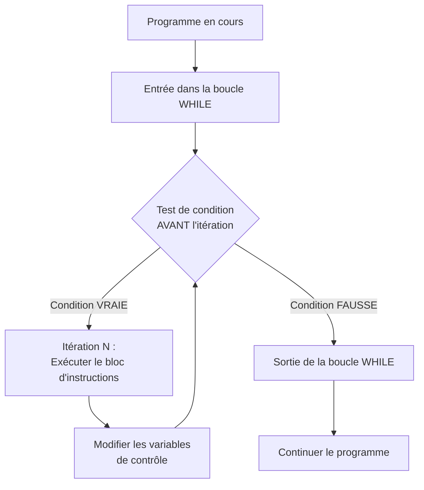
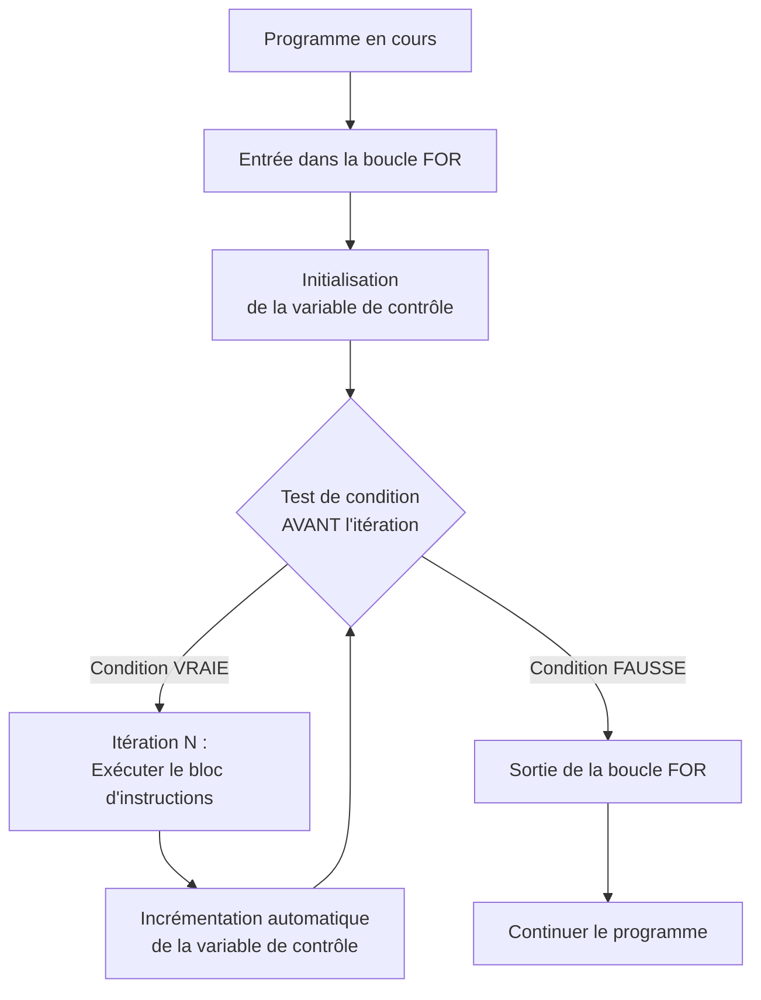
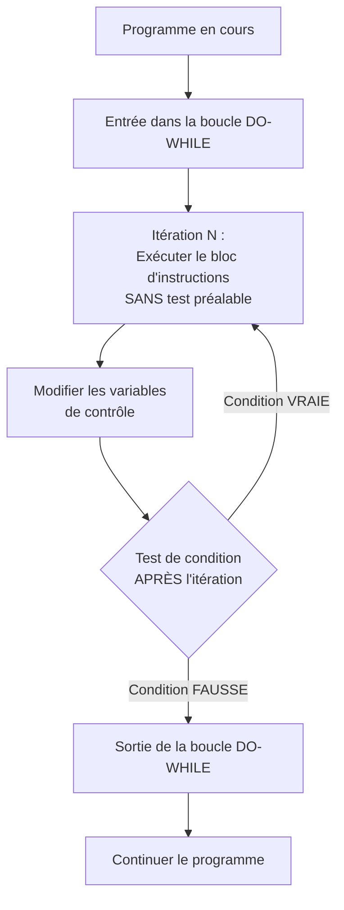
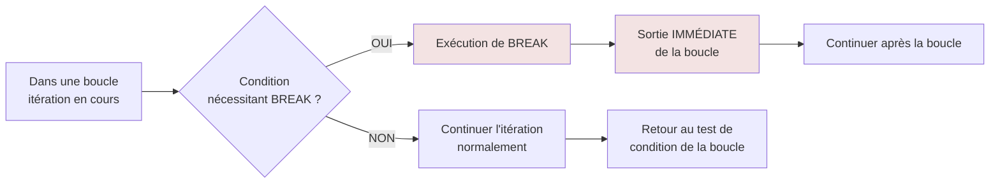
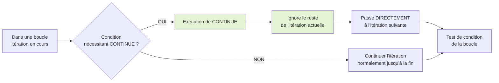

# Structures Itératives

## Introduction

**Niveau :** Débutant & Intermédiaire

!!! quote "Analogie pédagogique"
    _Imaginez un agent de sécurité qui vérifie chaque badge d'une file d'attente de cent personnes. Il répète exactement la même vérification pour chaque personne : **scanner le badge**, **vérifier le code**, **autoriser** ou **refuser l'accès**. Il ne s'arrête que lorsque la file est vide. **C'est exactement ce que font les structures itératives** : elles répètent des instructions jusqu'à ce qu'une condition d'arrêt soit satisfaite._

> Nous avons progressivement construit les fondations de la programmation en découvrant les **types primitifs** qui constituent nos données de base, en comprenant comment la mémoire organise ces données entre **Stack** et **Heap**, en maîtrisant la **logique booléenne** qui évalue des conditions, puis en apprenant comment nos programmes prennent des décisions avec **la logique conditionnelle**. 

**Les structures itératives** représentent l'étape naturelle suivante qui **ajoute la capacité de répétition** à notre arsenal de programmation. Une **structure itérative** exécute **un bloc d'instructions de manière répétée tant qu'une condition reste vraie** ou **jusqu'à ce qu'elle devienne fausse**. Cette capacité transforme vos programmes de simples séquences linéaires en systèmes capables de traiter efficacement des volumes massifs de données.

!!! info "Pourquoi c'est important ?"
    Les structures itératives permettent le **traitement de collections de données**, l'**automatisation de tâches répétitives**, l'**analyse de logs système** et la **mise en œuvre d'algorithmes** de recherche et de tri. Sans elles, vous devriez écrire manuellement chaque répétition, rendant impossible le traitement de données volumineuses.

## Pour repartir des bases (vrais débutants)

Si vous n'avez pas encore lu les documentations sur **la logique booléenne** et **la logique conditionnelle**, faites-le d'abord. **Les structures itératives** combinent directement ces deux concepts en répétant des instructions tant qu'une condition booléenne est vraie. **La maîtrise des conditions** constitue donc un prérequis absolu pour comprendre comment et quand vos boucles s'arrêteront.

!!! tip "C'est la suite logique !"
    **Vous savez maintenant comment évaluer des conditions et prendre des décisions**. Les structures itératives ajoutent simplement la question _"**combien de fois dois-je répéter cette décision ?**"_. Lorsque vous dites _"**Tant que des personnes attendent, vérifier leur badge**"_, vous exprimez déjà une structure itérative.

## Les trois structures fondamentales

Les structures itératives se déclinent en trois variantes principales qui couvrent tous les scénarios de répétition que vous rencontrerez dans vos programmes.

!!! quote "WHILE" 
    La boucle **WHILE** exécute des instructions **tant qu'une condition reste vraie**, vérifiant cette condition avant chaque itération. Cette structure convient parfaitement lorsque le nombre d'itérations dépend d'une condition qui peut changer dynamiquement pendant l'exécution. 

!!! quote "FOR"
    La boucle **FOR** offre **une syntaxe compacte pour itérer sur une séquence définie ou un nombre prédéterminé de fois**, regroupant l'**initialisation**, la **condition** et l'**incrémentation** dans une seule ligne.

!!! quote "DO-WHILE"
    La boucle **DO-WHILE** **garantit au moins une exécution du bloc d'instructions avant de vérifier la condition de continuation**, utile lorsque vous devez obligatoirement exécuter le code au moins une fois.

!!! danger "Attention Go dispose d'un seul type de boucle FOR qui, à contrario des autres langages, peut être utilisé tel quel pour créer une boucle infinie."

| Structure | Quand l'utiliser | Caractéristique distinctive |
| --- | --- | --- |
| **WHILE** | Nombre d'itérations inconnu | Teste la condition avant chaque itération |
| **FOR** | Nombre d'itérations connu ou séquence définie | Syntaxe compacte regroupant initialisation et incrémentation |
| **DO-WHILE** | Au moins une exécution garantie | Teste la condition après chaque itération |

## Structure WHILE

La boucle **WHILE** constitue la forme la plus fondamentale de répétition conditionnelle. Elle continue d'exécuter son bloc d'instructions tant que sa condition d'entrée évalue à vrai, s'arrêtant dès que cette condition devient fausse.

!!! quote "Analogie"
    Considérez une pompe qui vide un réservoir. Elle continue de pomper tant que le niveau d'eau dépasse zéro. Dès que le réservoir est vide, la pompe s'arrête automatiquement. La boucle WHILE fonctionne identiquement en répétant ses instructions tant que sa condition reste satisfaite.

### Fonctionnement de la boucle WHILE



_Ce diagramme illustre le cycle de vérification-exécution caractéristique de la boucle **WHILE**. **La condition est systématiquement évaluée avant chaque itération potentielle**. Si elle est vraie, **le bloc s'exécute** puis **le contrôle retourne à la vérification de condition**. Si elle est fausse, **le programme quitte immédiatement la boucle sans exécuter le bloc**._

### Exemples par langage

=== ":fontawesome-brands-python: Python"
    ```python
    # Vérification séquentielle de badges
    compteur = 0
    badges_a_verifier = 5

    while compteur < badges_a_verifier:
        print(f"Vérification du badge numéro {compteur + 1}")
        # Action : scanner et valider le badge
        compteur += 1

    print("Tous les badges ont été vérifiés")
    ```

=== ":fontawesome-brands-js: JavaScript"
    ```javascript
    // Traitement de requêtes en attente
    let requetesEnAttente = 10;

    while (requetesEnAttente > 0) {
        console.log(`Traitement de la requête, reste ${requetesEnAttente}`);
        // Action : traiter une requête
        requetesEnAttente--;
    }

    console.log('Toutes les requêtes ont été traitées');
    ```

=== ":fontawesome-brands-php: PHP"
    ```php
    <?php
    // Lecture de logs jusqu'à la fin du fichier
    $ligne = 0;
    $total_lignes = 100;

    while ($ligne < $total_lignes) {
        echo "Analyse de la ligne $ligne\n";
        // Action : analyser la ligne pour détecter des anomalies
        $ligne++;
    }

    echo "Analyse des logs terminée\n";
    ?>
    ```

=== ":fontawesome-brands-golang: Golang"
    ```go
    package main
    import "fmt"

    func main() {
        // Surveillance de connexions actives
        connexionsActives := 15
        
        for connexionsActives > 0 {
            fmt.Printf("Surveillance de %d connexions\n", connexionsActives)
            // Action : vérifier l'état de chaque connexion
            connexionsActives--
        }
        
        fmt.Println("Toutes les connexions ont été fermées")
    }
    ```

_Ces exemples démontrent **le pattern fondamental de la boucle WHILE** où **une variable de contrôle est modifiée à chaque itération** pour éventuellement rendre la condition fausse et terminer la boucle. **Sans cette modification, la boucle tournerait indéfiniment**._

!!! warning "Risque de boucle infinie"

    **Si la condition de votre boucle WHILE ne devient jamais fausse, votre programme tournera indéfiniment**. Assurez-vous toujours que **les instructions à l'intérieur de la boucle modifient les variables testées dans la condition** pour garantir une terminaison éventuelle.

## Structure FOR

La boucle **FOR** offre une syntaxe condensée particulièrement adaptée aux itérations sur des séquences définies ou lorsque le nombre d'itérations est connu à l'avance.

!!! quote "Analogie"
    Imaginez un distributeur automatique qui doit servir exactement dix gobelets de café. Il possède un compteur initialisé à zéro qui s'incrémente après chaque gobelet servi, s'arrêtant précisément lorsque le compteur atteint dix.

### Fonctionnement de la boucle FOR



_Ce diagramme montre **le cycle complet de la boucle FOR** où **l'initialisation survient une seule fois au début**, suivie par **le cycle répétitif de vérification de condition, exécution du bloc et incrémentation** jusqu'à ce que la condition devienne fausse._

### Exemples par langage

=== ":fontawesome-brands-python: Python"

    ```python
    # Parcours d'une collection de ports à scanner
    ports = [80, 443, 22, 21, 25]

    for port in ports:
        print(f"Scan du port {port}")
        # Action : tester si le port est ouvert
        
    print("Scan des ports terminé")
    ```

=== ":fontawesome-brands-js: JavaScript"

    ```javascript
    // Validation de formulaires multiples
    const nombreFormulaires = 5;

    for (let i = 0; i < nombreFormulaires; i++) {
        console.log(`Validation du formulaire ${i + 1}`);
        // Action : vérifier les champs requis
    }

    console.log('Tous les formulaires ont été validés');
    ```

=== ":fontawesome-brands-php: PHP"

    ```php
    <?php
    // Génération de rapports mensuels
    for ($mois = 1; $mois <= 12; $mois++) {
        echo "Génération du rapport pour le mois $mois\n";
        // Action : compiler les données et créer le rapport
    }

    echo "Rapports annuels générés\n";
    ?>
    ```

=== ":fontawesome-brands-golang: Golang"

    ```go
    package main
    import "fmt"

    func main() {
        // Vérification séquentielle d'utilisateurs
        utilisateurs := []string{"Alice", "Bob", "Charlie"}
        
        for index, nom := range utilisateurs {
            fmt.Printf("Vérification de l'utilisateur %d : %s\n", index+1, nom)
            // Action : valider les permissions
        }
        
        fmt.Println("Vérification complète")
    }
    ```

=== ":fontawesome-brands-rust: Rust"

    ```rust
    fn main() {
        // Traitement de transactions
        let transactions = vec![100, 250, 75, 500];
        
        for (index, montant) in transactions.iter().enumerate() {
            println!("Transaction {} : {} euros", index + 1, montant);
            // Action : valider et enregistrer la transaction
        }
        
        println!("Toutes les transactions traitées");
    }
    ```

_La boucle **FOR** excelle particulièrement lors du **parcours de collections de données** où vous devez **appliquer la même opération à chaque élément** sans vous soucier manuellement de l'incrémentation d'un compteur._

## Structure DO-WHILE

La boucle **DO-WHILE** garantit au moins une exécution de son bloc d'instructions avant de vérifier sa condition de continuation.

!!! abstract "Analogie"
    Considérez un distributeur de billets qui affiche toujours son menu principal au moins une fois, puis demande si vous souhaitez effectuer une autre opération. Même si vous n'avez rien à faire, le menu s'affiche obligatoirement.

### Fonctionnement de la boucle DO-WHILE



_Ce diagramme illustre **l'inversion du flux de contrôle** où **le bloc s'exécute d'abord inconditionnellement**, puis **la condition est vérifiée pour déterminer si une nouvelle itération doit survenir**._

### Exemples par langage


=== ":fontawesome-brands-python: Python"

    ```python
    # Python n'a pas de do-while natif, simulation avec while True
    choix = ""

    while True:
        print("Menu : 1-Connexion, 2-Inscription, 3-Quitter")
        choix = input("Votre choix : ")
        # Action : traiter le choix
        
        if choix == "3":
            break
            
    print("Au revoir")
    ```


=== ":fontawesome-brands-js: JavaScript"

    ```javascript
    // Menu interactif garantissant au moins un affichage
    let continuer = false;

    do {
        console.log('Configuration du système de sécurité');
        console.log('1. Modifier le mot de passe');
        console.log('2. Configurer l\'authentification 2FA');
        // Action : traiter le choix
        
        continuer = confirm('Continuer la configuration ?');
    } while (continuer);

    console.log('Configuration terminée');
    ```

=== ":fontawesome-brands-php: PHP"

    ```php
    <?php
    // Saisie de données avec validation obligatoire
    do {
        echo "Entrez votre mot de passe : ";
        $mot_de_passe = "user_input"; // Simulation
        
        // Action : valider le mot de passe
        $valide = strlen($mot_de_passe) >= 8;
        
        if (!$valide) {
            echo "Mot de passe trop court, recommencez\n";
        }
    } while (!$valide);

    echo "Mot de passe accepté\n";
    ?>
    ```

=== ":fontawesome-brands-golang: Golang"

    ```go
    package main
    import "fmt"

    func main() {
        // Go n'a pas de do-while natif, simulation avec for
        var reponse string
        
        for {
            fmt.Println("Voulez-vous continuer ? (oui/non)")
            fmt.Scanln(&reponse)
            // Action : traiter la réponse
            
            if reponse == "non" {
                break
            }
        }
        
        fmt.Println("Programme terminé")
    }
    ```

_La structure **DO-WHILE** s'impose dans les scénarios où vous devez **obligatoirement exécuter le code au moins une fois**. Notez que **Python** et **Go** ne possèdent pas cette structure nativement._

## Instructions de contrôle

Les instructions **BREAK** et **CONTINUE** modifient le flux d'exécution normal des boucles.

### Instruction BREAK



_L'instruction **BREAK** termine immédiatement la boucle englobante. **Dès que BREAK est exécuté**, le programme ignore toutes les itérations restantes et sort complètement de la boucle._


=== ":fontawesome-brands-python: Python"

    ```python
    # Recherche d'un élément suspect dans des logs
    logs = ["INFO", "DEBUG", "INFO", "ERROR", "WARNING"]

    for index, niveau in enumerate(logs):
        print(f"Analyse du log {index + 1} : {niveau}")
        
        if niveau == "ERROR":
            print(f"Erreur critique détectée au log {index + 1}")
            break
            
    print("Analyse terminée")
    ```

=== ":fontawesome-brands-js: JavaScript"

    ```javascript
    // Recherche d'utilisateur dans une base de données
    const utilisateurs = ['Alice', 'Bob', 'Charlie', 'David'];
    const recherche = 'Charlie';
    let trouve = false;

    for (let i = 0; i < utilisateurs.length; i++) {
        console.log(`Vérification : ${utilisateurs[i]}`);
        
        if (utilisateurs[i] === recherche) {
            console.log(`Utilisateur ${recherche} trouvé !`);
            trouve = true;
            break;
        }
    }

    if (!trouve) {
        console.log('Utilisateur non trouvé');
    }
    ```

=== ":fontawesome-brands-php: PHP"

    ```php
    <?php
    // Détection de tentative d'intrusion
    $connexions = [
        ["ip" => "192.168.1.10", "tentatives" => 2],
        ["ip" => "10.0.0.5", "tentatives" => 15],
        ["ip" => "192.168.1.20", "tentatives" => 1]
    ];

    foreach ($connexions as $connexion) {
        echo "Vérification de {$connexion['ip']}\n";
        
        if ($connexion['tentatives'] > 10) {
            echo "ALERTE : Tentatives suspectes depuis {$connexion['ip']}\n";
            break; // Arrêt immédiat pour traiter l'alerte
        }
    }

    echo "Vérification de sécurité terminée\n";
    ?>
    ```

=== ":fontawesome-brands-golang: Golang"

    ```go
    package main
    import "fmt"

    func main() {
        // Recherche de port ouvert
        ports := []int{21, 22, 23, 80, 443}
        
        for _, port := range ports {
            fmt.Printf("Test du port %d\n", port)
            
            if port == 80 {
                fmt.Println("Port HTTP trouvé !")
                break
            }
        }
        
        fmt.Println("Scan terminé")
    }
    ```

### Instruction CONTINUE



_L'instruction **CONTINUE** saute le reste de l'itération courante et **passe immédiatement à l'itération suivante**. **Contrairement à BREAK qui sort de la boucle**, **CONTINUE** maintient la boucle active._

=== ":fontawesome-brands-python: Python"

    ```python
    # Traitement sélectif de connexions
    connexions = [
        {"ip": "192.168.1.10", "autorisee": True},
        {"ip": "10.0.0.5", "autorisee": False},
        {"ip": "192.168.1.20", "autorisee": True}
    ]

    for connexion in connexions:
        if not connexion["autorisee"]:
            print(f"IP {connexion['ip']} bloquée, ignorée")
            continue
        
        print(f"Traitement de {connexion['ip']}")
        # Action : traiter la connexion autorisée
    ```

=== ":fontawesome-brands-js: JavaScript"

    ```javascript
    // Filtrage de fichiers pour analyse
    const fichiers = ['doc.txt', 'image.png', 'script.js', 'photo.jpg'];

    for (let fichier of fichiers) {
        if (!fichier.endsWith('.js')) {
            console.log(`${fichier} ignoré (pas un fichier JS)`);
            continue;
        }
        
        console.log(`Analyse de ${fichier}`);
        // Action : analyser le fichier JavaScript
    }
    ```

=== ":fontawesome-brands-php: PHP"

    ```php
    <?php
    // Validation de formulaires avec champs optionnels
    $champs = [
        ["nom" => "email", "valeur" => "user@example.com", "requis" => true],
        ["nom" => "telephone", "valeur" => "", "requis" => false],
        ["nom" => "nom", "valeur" => "", "requis" => true]
    ];

    foreach ($champs as $champ) {
        if (!$champ['requis'] && empty($champ['valeur'])) {
            echo "Champ {$champ['nom']} optionnel vide, ignoré\n";
            continue;
        }
        
        echo "Validation du champ {$champ['nom']}\n";
        // Action : valider le champ
    }
    ?>
    ```

=== ":fontawesome-brands-golang: Golang"

    ```go
    package main
    import (
        "fmt"
        "strings"
    )

    func main() {
        // Traitement de logs en ignorant les niveaux DEBUG
        logs := []string{"INFO: Démarrage", "DEBUG: Variable X", "ERROR: Échec", "DEBUG: Trace"}
        
        for _, log := range logs {
            if strings.HasPrefix(log, "DEBUG") {
                continue // Ignore les logs de debug
            }
            
            fmt.Printf("Traitement: %s\n", log)
            // Action : analyser le log important
        }
    }
    ```

## Boucles imbriquées

Les boucles imbriquées surviennent lorsqu'**une boucle contient elle-même une ou plusieurs boucles**. Cette structure permet de **traiter des données multidimensionnelles** ou d'effectuer **des opérations combinatoires**.


=== ":fontawesome-brands-python: Python"

    ```python
    # Vérification de permissions pour plusieurs utilisateurs sur plusieurs ressources
    utilisateurs = ["Alice", "Bob", "Charlie"]
    ressources = ["Document1", "Document2", "Document3"]

    for utilisateur in utilisateurs:
        print(f"\nVérification des accès pour {utilisateur}")
        
        for ressource in ressources:
            print(f"  - Contrôle d'accès à {ressource}")
            # Action : vérifier les permissions
            
    print("\nVérification complète")
    ```

=== ":fontawesome-brands-js: JavaScript"

    ```javascript
    // Comparaison de signatures de fichiers suspects
    const fichiersAnalyses = ['file1.exe', 'file2.dll', 'file3.sys'];
    const signaturesVirus = ['malware_A', 'malware_B', 'malware_C'];

    for (let fichier of fichiersAnalyses) {
        console.log(`\nAnalyse de ${fichier}`);
        
        for (let signature of signaturesVirus) {
            console.log(`  - Comparaison avec ${signature}`);
            // Action : comparer les signatures
        }
    }

    console.log('\nAnalyse antivirus terminée');
    ```

=== ":fontawesome-brands-php: PHP"

    ```php
    <?php
    // Génération de rapport de connectivité réseau
    $serveurs = ["Web", "Database", "Cache"];
    $services = ["HTTP", "SSH", "MySQL"];

    foreach ($serveurs as $serveur) {
        echo "\nTest du serveur $serveur\n";
        
        foreach ($services as $service) {
            echo "  - Vérification du service $service\n";
            // Action : tester la connectivité
        }
    }

    echo "\nRapport de connectivité terminé\n";
    ?>
    ```

=== ":fontawesome-brands-golang: Golang"

    ```go
    package main
    import "fmt"

    func main() {
        // Scan de plages d'adresses IP
        reseaux := []string{"192.168.1", "10.0.0"}
        derniersOctets := []int{1, 2, 3}
        
        for _, reseau := range reseaux {
            fmt.Printf("\nScan du réseau %s.x\n", reseau)
            
            for _, octet := range derniersOctets {
                fmt.Printf("  - Test de %s.%d\n", reseau, octet)
                // Action : ping de l'adresse IP
            }
        }
        
        fmt.Println("\nScan réseau terminé")
    }
    ```

!!! warning "Attention à la complexité"
    Les boucles imbriquées **multiplient le nombre d'opérations effectuées**. Une boucle externe de N itérations contenant une boucle interne de M itérations exécutera **N × M opérations totales**. **Limitez l'imbrication à deux ou trois niveaux maximum**.

## Bonnes pratiques

**Nommez explicitement vos variables de boucle** pour clarifier leur rôle. **Assurez-vous systématiquement que vos conditions de boucle peuvent éventuellement devenir fausses**. **Préférez les boucles FOR aux boucles WHILE** lorsque le nombre d'itérations est connu à l'avance. **Évitez de modifier les collections que vous parcourez pendant l'itération**.

=== ":fontawesome-brands-python: Python"

    ```python
    # Exemple de structure claire et maintenable
    utilisateurs_actifs = ["Alice", "Bob", "Charlie", "David"]
    seuil_connexions = 100

    for index, nom_utilisateur in enumerate(utilisateurs_actifs):
        print(f"Analyse {index + 1}/{len(utilisateurs_actifs)}")
        
        # Variables intermédiaires nommées clairement
        nombre_connexions = 85  # Simulation
        depasse_seuil = nombre_connexions > seuil_connexions
        
        if depasse_seuil:
            print(f"Alerte : {nom_utilisateur} ({nombre_connexions} connexions)")
    ```

=== ":fontawesome-brands-js: JavaScript"

    ```javascript
    // Structure JavaScript équivalente
    const utilisateursActifs = ['Alice', 'Bob', 'Charlie', 'David'];
    const seuilConnexions = 100;

    utilisateursActifs.forEach((nomUtilisateur, index) => {
        console.log(`Analyse ${index + 1}/${utilisateursActifs.length}`);
        
        // Variables intermédiaires explicites
        const nombreConnexions = 85;
        const depasseSeuil = nombreConnexions > seuilConnexions;
        
        if (depasseSeuil) {
            console.log(`Alerte : ${nomUtilisateur} (${nombreConnexions})`);
        }
    });
    ```

!!! danger "Attention aux modifications pendant l'itération"
    Ne modifiez jamais la taille d'une collection pendant que vous l'itérez directement. Cette pratique peut sauter des éléments ou provoquer des erreurs à l'exécution.

!!! warning "Surveillez les conditions de sortie"
    Vérifiez systématiquement que vos boucles possèdent une condition de sortie claire et atteignable.

## Le mot de la fin

!!! quote
    Les structures itératives transforment vos programmes en systèmes capables de traiter efficacement des volumes arbitraires de données. Au début, vous réfléchirez consciemment à chaque condition de continuation. Avec la pratique, vous développerez une intuition pour choisir la structure optimale.
    
    L'important réside dans la compréhension que chaque boucle représente une automatisation qui améliore l'efficacité de vos programmes. Plus vous maîtriserez ces structures, plus vous pourrez concevoir des algorithmes sophistiqués.

---

!!! abstract "Métadonnées"
    **Version** : 1.0  
    **Dernière mise à jour** : Novembre 2025  
    **Durée de lecture** : 30-35 minutes  
    **Niveau** : Débutant & Intermédiaire
