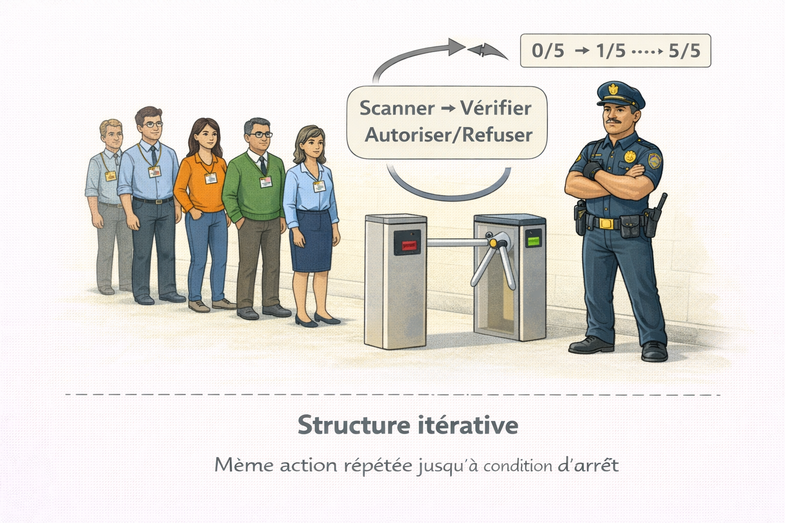
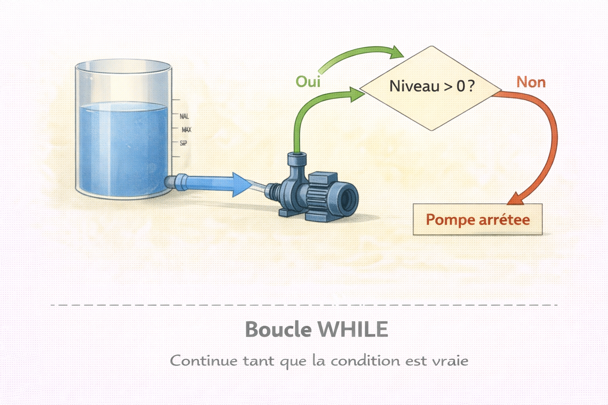
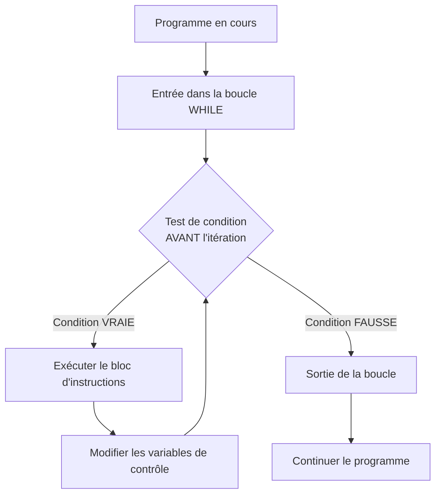
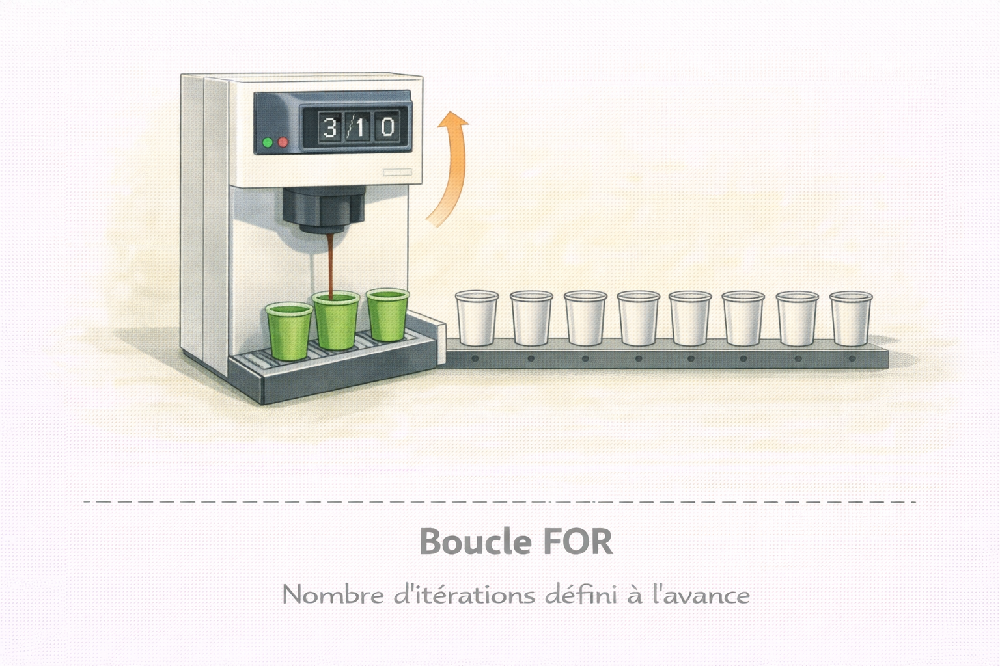
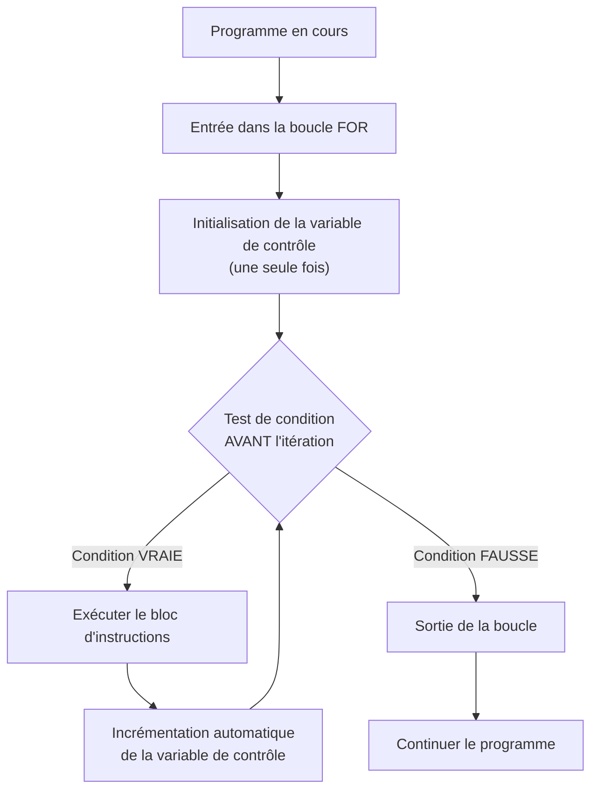
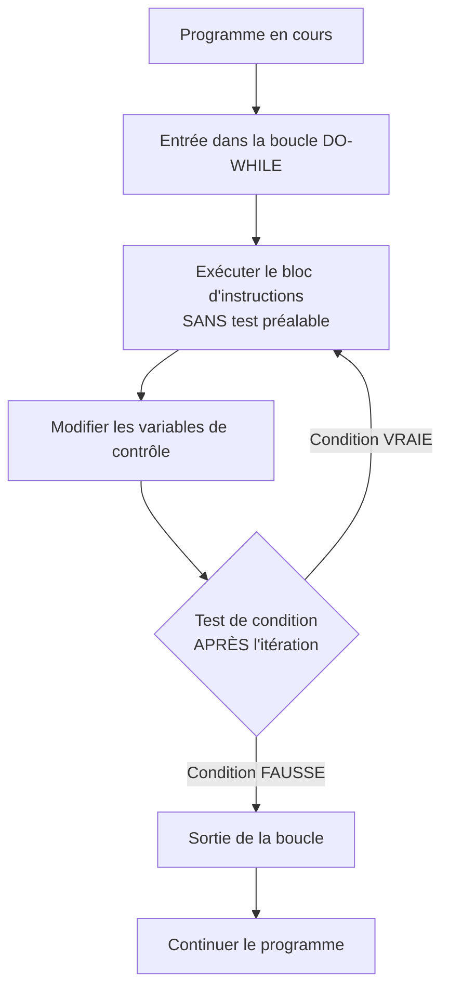
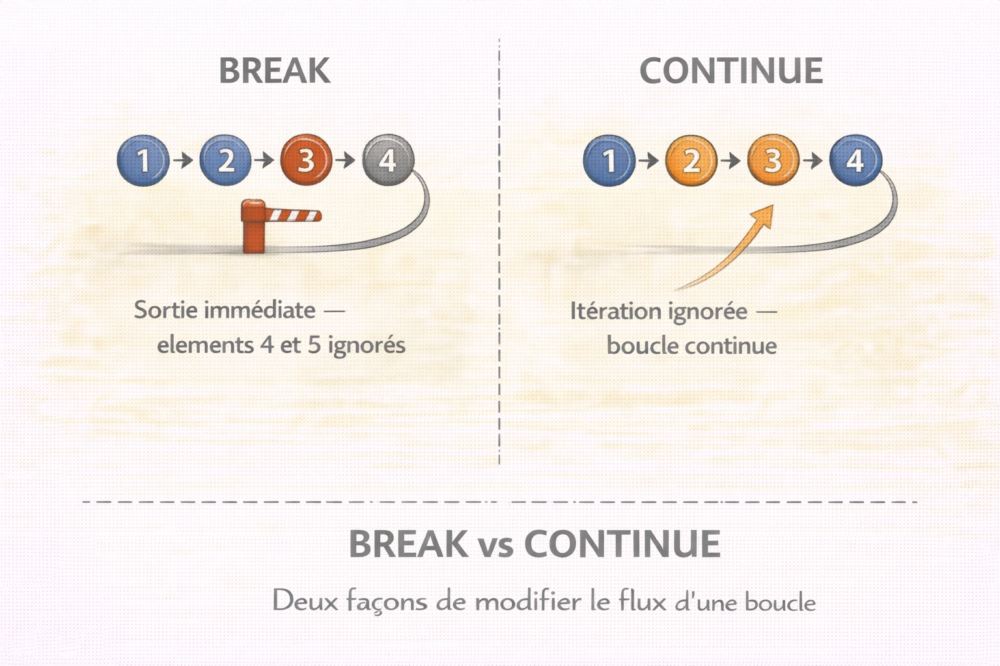
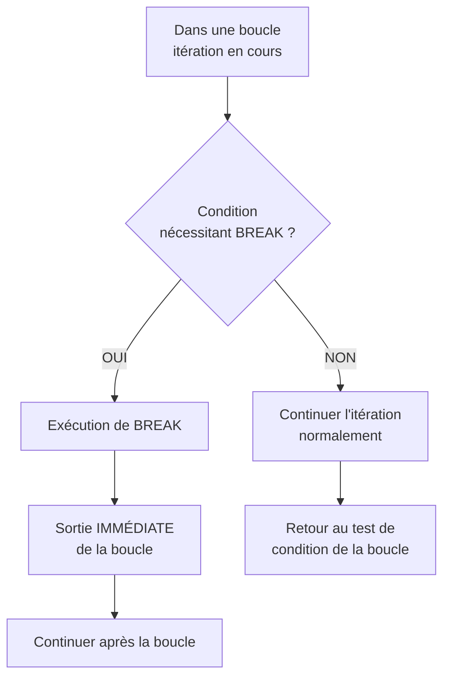
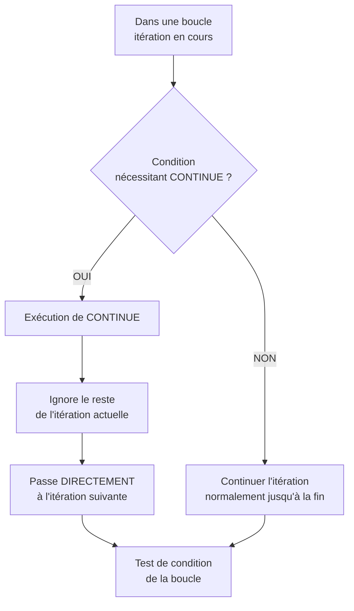

# Structures Itératives

<div
  class="omny-meta"
  data-level="Débutant à Intermédiaire"
  data-version="1.1"
  data-time="35-40 minutes">
</div>

!!! quote "Analogie"
    _Un agent de sécurité vérifie chaque badge d'une file de cent personnes. Il répète exactement la même vérification pour chacune : scanner le badge, vérifier le code, autoriser ou refuser l'accès. Il ne s'arrête que lorsque la file est vide. C'est exactement ce que font les structures itératives : répéter des instructions jusqu'à ce qu'une condition d'arrêt soit satisfaite._

Les types primitifs constituent les briques de base des données, la mémoire les organise entre Stack et Heap, la logique booléenne évalue des conditions, la logique conditionnelle décide quelle action exécuter. Les structures itératives représentent l'étape suivante : elles **ajoutent la capacité de répétition**. Une structure itérative exécute un bloc d'instructions de manière répétée tant qu'une condition reste vraie ou jusqu'à ce qu'elle devienne fausse. Cette capacité transforme des séquences linéaires en systèmes capables de traiter des volumes massifs de données.

!!! info "Pourquoi c'est important"
    Les structures itératives permettent le **traitement de collections de données**, l'**automatisation de tâches répétitives**, l'**analyse de logs système** et la **mise en œuvre d'algorithmes** de recherche et de tri. Sans elles, chaque répétition devrait être écrite manuellement — impossible à l'échelle.

!!! note "Cette fiche fait suite à la [Logique Conditionnelle](./logique-conditionnelle.md). Les structures itératives combinent directement les concepts booléens et conditionnels — leur maîtrise est un prérequis absolu pour comprendre comment et quand une boucle s'arrête."

<br />

!!! note "L'image ci-dessous illustre concrètement ce qu'est une structure itérative avant d'aborder la syntaxe. Visualiser la répétition comme un processus physique aide à comprendre pourquoi une condition d'arrêt est indispensable."



<p><em>L'agent répète exactement la même séquence d'actions pour chaque personne dans la file. Le compteur progresse à chaque itération — 0/5, 1/5, jusqu'à 5/5. Quand la file est vide, la condition d'arrêt est atteinte et le processus se termine. Un programme itératif fonctionne selon ce même principe.</em></p>

<br />

---

## Les trois structures fondamentales

Trois structures couvrent tous les scénarios de répétition rencontrables dans un programme.

| Structure | Quand l'utiliser | Caractéristique distinctive |
|---|---|---|
| **WHILE** | Nombre d'itérations inconnu | Teste la condition avant chaque itération |
| **FOR** | Nombre d'itérations connu ou séquence définie | Syntaxe compacte — initialisation et incrémentation intégrées |
| **DO-WHILE** | Au moins une exécution garantie | Teste la condition après chaque itération |

!!! warning "Go — une seule boucle pour tout"
    Go ne dispose que de la boucle `for`, utilisée pour tous les cas de figure : boucle comptée, boucle conditionnelle (équivalent WHILE) et boucle infinie. C'est un choix délibéré de simplicité — une seule syntaxe à maîtriser, aucune ambiguïté.

<br />

---

## Structure WHILE

La boucle WHILE exécute son bloc d'instructions tant que la condition d'entrée est vraie. Elle s'arrête dès que cette condition devient fausse. La condition est vérifiée **avant** chaque itération.

!!! quote "Analogie"
    _Une pompe qui vide un réservoir. Elle continue de pomper tant que le niveau d'eau dépasse zéro. Dès que le réservoir est vide, la pompe s'arrête automatiquement._

<br />

!!! note "L'image ci-dessous matérialise le cycle vérification → exécution → retour de la boucle WHILE. Comprendre que la condition est évaluée avant chaque passage est ce qui distingue WHILE de DO-WHILE."



<p><em>La pompe ne s'enclenche que si le niveau d'eau dépasse zéro — vérification avant l'action. Après chaque pompage, le niveau baisse et la condition est réévaluée. Si le réservoir est déjà vide à l'entrée, la pompe ne démarre jamais. C'est exactement le comportement de la boucle WHILE.</em></p>

### Schéma du mécanisme WHILE


```mermaid
flowchart TD
  A["Programme en cours"] --> B["Entrée dans la boucle WHILE"]
  B --> C{"Test de condition<br />AVANT l'itération"}
  C -->|"Condition VRAIE"| D["Exécuter le bloc d'instructions"]
  D --> E["Modifier les variables de contrôle"]
  E --> C
  C -->|"Condition FAUSSE"| F["Sortie de la boucle"]
  F --> G["Continuer le programme"]
```

_La condition est systématiquement évaluée avant chaque itération potentielle. Si elle est vraie, le bloc s'exécute puis le contrôle retourne à la vérification. Si elle est fausse dès le départ, le bloc ne s'exécute jamais._

### Exemples par langage

=== ":fontawesome-brands-python: Python"

    ```python title="Python — boucle while"
    # Vérification séquentielle de badges
    compteur = 0
    badges_a_verifier = 5

    while compteur < badges_a_verifier:
        print(f"Vérification du badge numéro {compteur + 1}")
        # Action : scanner et valider le badge
        compteur += 1  # Modification de la variable de contrôle — indispensable

    print("Tous les badges ont été vérifiés")
    ```

=== ":fontawesome-brands-js: JavaScript"

    ```javascript title="JavaScript — boucle while"
    // Traitement de requêtes en attente
    let requetesEnAttente = 10;

    while (requetesEnAttente > 0) {
        console.log(`Traitement de la requête, reste ${requetesEnAttente}`);
        // Action : traiter une requête
        requetesEnAttente--;  // Décrémentation — condition tendra vers false
    }

    console.log('Toutes les requêtes ont été traitées');
    ```

=== ":fontawesome-brands-php: PHP"

    ```php title="PHP — boucle while"
    <?php
    // Lecture de logs jusqu'à la fin du fichier
    $ligne       = 0;
    $total_lignes = 100;

    while ($ligne < $total_lignes) {
        echo "Analyse de la ligne $ligne\n";
        // Action : analyser la ligne pour détecter des anomalies
        $ligne++;
    }

    echo "Analyse des logs terminée\n";
    ?>
    ```

=== ":fontawesome-brands-golang: Go"

    ```go title="Go — for comme while"
    package main

    import "fmt"

    func main() {
        // Go utilise for sans initialisation ni incrémentation — équivalent WHILE
        connexionsActives := 15

        for connexionsActives > 0 {
            fmt.Printf("Surveillance de %d connexions\n", connexionsActives)
            // Action : vérifier l'état de chaque connexion
            connexionsActives--
        }

        fmt.Println("Toutes les connexions ont été fermées")
    }
    ```

!!! danger "Risque de boucle infinie"
    Si la condition de la boucle WHILE ne devient jamais fausse, le programme tourne indéfiniment. Les instructions à l'intérieur de la boucle **doivent toujours modifier les variables testées dans la condition** pour garantir une terminaison.

<br />

---

## Structure FOR

La boucle FOR est adaptée aux itérations sur des séquences définies ou lorsque le nombre d'itérations est connu à l'avance. Elle regroupe l'initialisation, la condition et l'incrémentation dans une syntaxe compacte.

!!! quote "Analogie"
    _Un distributeur automatique qui sert exactement dix gobelets de café. Compteur initialisé à zéro, incrémenté après chaque gobelet, arrêt précis à dix._

<br />

!!! note "L'image ci-dessous illustre pourquoi FOR est préférable à WHILE quand le nombre d'itérations est connu. Voir le compteur progresser et les emplacements se remplir un par un rend le mécanisme immédiatement concret."



<p><em>Le distributeur connaît exactement combien de gobelets il doit servir. Le compteur s'incrémente automatiquement après chaque gobelet. À 10/10, la boucle s'arrête sans condition externe à surveiller. C'est l'avantage de FOR sur WHILE : l'initialisation, la condition et l'incrémentation sont gérées en un seul endroit.</em></p>

### Schéma du mécanisme FOR


```mermaid
flowchart TD
  A["Programme en cours"] --> B["Entrée dans la boucle FOR"]
  B --> C["Initialisation de la variable de contrôle<br />(une seule fois)"]
  C --> D{"Test de condition<br />AVANT l'itération"}
  D -->|"Condition VRAIE"| E["Exécuter le bloc d'instructions"]
  E --> F["Incrémentation automatique<br />de la variable de contrôle"]
  F --> D
  D -->|"Condition FAUSSE"| G["Sortie de la boucle"]
  G --> H["Continuer le programme"]
```

_L'initialisation survient une seule fois au démarrage. Ensuite : vérification de condition → exécution → incrémentation, jusqu'à ce que la condition devienne fausse._

### Exemples par langage

=== ":fontawesome-brands-python: Python"

    ```python title="Python — boucle for sur une collection"
    # Parcours d'une liste de ports à scanner
    ports = [80, 443, 22, 21, 25]

    for port in ports:
        print(f"Scan du port {port}")
        # Action : tester si le port est ouvert

    print("Scan des ports terminé")
    ```

=== ":fontawesome-brands-js: JavaScript"

    ```javascript title="JavaScript — boucle for classique"
    // Validation de formulaires multiples
    const nombreFormulaires = 5;

    for (let i = 0; i < nombreFormulaires; i++) {
        console.log(`Validation du formulaire ${i + 1}`);
        // Action : vérifier les champs requis
    }

    console.log('Tous les formulaires ont été validés');
    ```

=== ":fontawesome-brands-php: PHP"

    ```php title="PHP — boucle for classique"
    <?php
    // Génération de rapports mensuels
    for ($mois = 1; $mois <= 12; $mois++) {
        echo "Génération du rapport pour le mois $mois\n";
        // Action : compiler les données et créer le rapport
    }

    echo "Rapports annuels générés\n";
    ?>
    ```

=== ":fontawesome-brands-golang: Go"

    ```go title="Go — for classique et range"
    package main

    import "fmt"

    func main() {
        // For classique — compteur explicite
        for i := 0; i < 5; i++ {
            fmt.Printf("Itération %d\n", i+1)
        }

        // For avec range — parcours de collection
        utilisateurs := []string{"Alice", "Bob", "Charlie"}

        for index, nom := range utilisateurs {
            fmt.Printf("Vérification de l'utilisateur %d : %s\n", index+1, nom)
            // Action : valider les permissions
        }

        fmt.Println("Vérification complète")
    }
    ```

<br />

---

## Structure DO-WHILE

La boucle DO-WHILE garantit au moins une exécution de son bloc avant de vérifier la condition de continuation. La condition est vérifiée **après** chaque itération.

!!! quote "Analogie"
    _Un distributeur de billets qui affiche toujours son menu principal au moins une fois, puis demande si une autre opération est souhaitée. Même sans rien à faire, le menu s'affiche obligatoirement._

<br />

!!! note "L'image ci-dessous met en évidence l'inversion du flux par rapport à WHILE. Voir que l'action précède le test — et non l'inverse — est la distinction fondamentale qu'il faut retenir entre ces deux structures."


<p><em>Le menu s'affiche d'abord, sans condition préalable. Ce n'est qu'après que la question "Autre opération ?" est posée. Si la réponse est non, la boucle s'arrête. Si la réponse est oui, le menu s'affiche à nouveau. L'exécution est garantie au moins une fois — même si la condition aurait été fausse dès le départ.</em></p>

### Schéma du mécanisme DO-WHILE


```mermaid
flowchart TD
  A["Programme en cours"] --> B["Entrée dans la boucle DO-WHILE"]
  B --> C["Exécuter le bloc d'instructions<br />SANS test préalable"]
  C --> D["Modifier les variables de contrôle"]
  D --> E{"Test de condition<br />APRÈS l'itération"}
  E -->|"Condition VRAIE"| C
  E -->|"Condition FAUSSE"| F["Sortie de la boucle"]
  F --> G["Continuer le programme"]
```

_Le bloc s'exécute inconditionnellement en premier. La condition n'est évaluée qu'après pour décider si une nouvelle itération est nécessaire._

### Exemples par langage

=== ":fontawesome-brands-python: Python"

    ```python title="Python — simulation do-while avec while True"
    # Python n'a pas de do-while natif — simulation avec while True + break
    choix = ""

    while True:
        print("Menu : 1-Connexion, 2-Inscription, 3-Quitter")
        choix = input("Votre choix : ")
        # Action : traiter le choix

        if choix == "3":
            break  # Condition de sortie évaluée après exécution

    print("Au revoir")
    ```

    !!! tip "Python — absence volontaire du do-while"
        Python ne dispose pas de do-while par choix de conception. La simulation avec `while True` + `break` est l'approche idiomatique — explicite et lisible.

=== ":fontawesome-brands-js: JavaScript"

    ```javascript title="JavaScript — boucle do-while native"
    // Menu interactif garantissant au moins un affichage
    let continuer = false;

    do {
        console.log('Configuration du système de sécurité');
        console.log('1. Modifier le mot de passe');
        console.log('2. Configurer l\'authentification 2FA');
        // Action : traiter le choix

        continuer = confirm('Continuer la configuration ?');
    } while (continuer);

    console.log('Configuration terminée');
    ```

=== ":fontawesome-brands-php: PHP"

    ```php title="PHP — boucle do-while native"
    <?php
    // Saisie avec validation obligatoire — au moins une tentative garantie
    do {
        echo "Entrez votre mot de passe : ";
        $mot_de_passe = "user_input"; // Simulation

        // Action : valider le mot de passe
        $valide = strlen($mot_de_passe) >= 8;

        if (!$valide) {
            echo "Mot de passe trop court, recommencez\n";
        }
    } while (!$valide);

    echo "Mot de passe accepté\n";
    ?>
    ```

=== ":fontawesome-brands-golang: Go"

    ```go title="Go — simulation do-while avec for infini"
    package main

    import "fmt"

    func main() {
        // Go n'a pas de do-while natif — simulation avec for infini + break
        var reponse string

        for {
            fmt.Println("Voulez-vous continuer ? (oui/non)")
            fmt.Scanln(&reponse)
            // Action : traiter la réponse

            if reponse == "non" {
                break  // Condition évaluée après exécution
            }
        }

        fmt.Println("Programme terminé")
    }
    ```

    !!! tip "Go — for infini comme do-while"
        `for { ... }` sans condition crée une boucle infinie. Combiné à `break`, il simule exactement le comportement do-while — exécution garantie au moins une fois, sortie conditionnelle.

<br />

---

## Instructions de contrôle

Les instructions BREAK et CONTINUE modifient le flux d'exécution normal à l'intérieur d'une boucle.

<br />

!!! note "L'image ci-dessous présente les deux comportements côte à côte. Les visualiser simultanément permet de comprendre immédiatement la différence : BREAK sort de la boucle, CONTINUE saute une itération mais maintient la boucle active."



<p><em>BREAK (gauche) : dès que la condition est rencontrée au troisième élément, la boucle s'arrête complètement — les éléments 4 et 5 ne sont jamais traités. CONTINUE (droite) : le troisième élément est ignoré mais la boucle reprend immédiatement au quatrième — les éléments 4 et 5 sont bien traités.</em></p>

### Instruction BREAK — sortie immédiate


```mermaid
flowchart TB
  A["Dans une boucle<br />itération en cours"] --> B{"Condition<br />nécessitant BREAK ?"}
  B -->|"OUI"| C["Exécution de BREAK"]
  C --> D["Sortie IMMÉDIATE<br />de la boucle"]
  D --> E["Continuer après la boucle"]
  B -->|"NON"| F["Continuer l'itération<br />normalement"]
  F --> G["Retour au test de<br />condition de la boucle"]
```

=== ":fontawesome-brands-python: Python"

    ```python title="Python — instruction break"
    # Recherche d'un élément suspect dans des logs
    logs = ["INFO", "DEBUG", "INFO", "ERROR", "WARNING"]

    for index, niveau in enumerate(logs):
        print(f"Analyse du log {index + 1} : {niveau}")

        if niveau == "ERROR":
            print(f"Erreur critique détectée au log {index + 1}")
            break  # Inutile de continuer — traitement prioritaire requis

    print("Analyse terminée")
    ```

=== ":fontawesome-brands-js: JavaScript"

    ```javascript title="JavaScript — instruction break"
    // Recherche d'utilisateur — s'arrête dès qu'il est trouvé
    const utilisateurs = ['Alice', 'Bob', 'Charlie', 'David'];
    const recherche    = 'Charlie';
    let trouve         = false;

    for (let i = 0; i < utilisateurs.length; i++) {
        console.log(`Vérification : ${utilisateurs[i]}`);

        if (utilisateurs[i] === recherche) {
            console.log(`Utilisateur ${recherche} trouvé !`);
            trouve = true;
            break;  // Inutile de parcourir le reste
        }
    }

    if (!trouve) {
        console.log('Utilisateur non trouvé');
    }
    ```

=== ":fontawesome-brands-php: PHP"

    ```php title="PHP — instruction break"
    <?php
    // Détection de tentative d'intrusion — alerte sur première IP suspecte
    $connexions = [
        ["ip" => "192.168.1.10", "tentatives" => 2],
        ["ip" => "10.0.0.5",     "tentatives" => 15],
        ["ip" => "192.168.1.20", "tentatives" => 1]
    ];

    foreach ($connexions as $connexion) {
        echo "Vérification de {$connexion['ip']}\n";

        if ($connexion['tentatives'] > 10) {
            echo "ALERTE : Tentatives suspectes depuis {$connexion['ip']}\n";
            break;  // Arrêt immédiat — traitement de l'alerte prioritaire
        }
    }

    echo "Vérification de sécurité terminée\n";
    ?>
    ```

=== ":fontawesome-brands-golang: Go"

    ```go title="Go — instruction break"
    package main

    import "fmt"

    func main() {
        // Recherche de port ouvert — s'arrête au premier trouvé
        ports := []int{21, 22, 23, 80, 443}

        for _, port := range ports {
            fmt.Printf("Test du port %d\n", port)

            if port == 80 {
                fmt.Println("Port HTTP trouvé !")
                break  // Recherche terminée
            }
        }

        fmt.Println("Scan terminé")
    }
    ```

<br />

### Instruction CONTINUE — saut d'itération


```mermaid
flowchart TB
  A["Dans une boucle<br />itération en cours"] --> B{"Condition<br />nécessitant CONTINUE ?"}
  B -->|"OUI"| C["Exécution de CONTINUE"]
  C --> D["Ignore le reste<br />de l'itération actuelle"]
  D --> E["Passe DIRECTEMENT<br />à l'itération suivante"]
  E --> F["Test de condition<br />de la boucle"]
  B -->|"NON"| G["Continuer l'itération<br />normalement jusqu'à la fin"]
  G --> F
```

=== ":fontawesome-brands-python: Python"

    ```python title="Python — instruction continue"
    # Traitement sélectif — connexions non autorisées ignorées
    connexions = [
        {"ip": "192.168.1.10", "autorisee": True},
        {"ip": "10.0.0.5",     "autorisee": False},
        {"ip": "192.168.1.20", "autorisee": True}
    ]

    for connexion in connexions:
        if not connexion["autorisee"]:
            print(f"IP {connexion['ip']} bloquée, ignorée")
            continue  # Passe à la connexion suivante sans traitement

        print(f"Traitement de {connexion['ip']}")
        # Action : traiter la connexion autorisée
    ```

=== ":fontawesome-brands-js: JavaScript"

    ```javascript title="JavaScript — instruction continue"
    // Filtrage de fichiers — seuls les .js sont analysés
    const fichiers = ['doc.txt', 'image.png', 'script.js', 'photo.jpg'];

    for (let fichier of fichiers) {
        if (!fichier.endsWith('.js')) {
            console.log(`${fichier} ignoré (pas un fichier JS)`);
            continue;  // Passe au fichier suivant
        }

        console.log(`Analyse de ${fichier}`);
        // Action : analyser le fichier JavaScript
    }
    ```

=== ":fontawesome-brands-php: PHP"

    ```php title="PHP — instruction continue"
    <?php
    // Validation — champs optionnels vides ignorés
    $champs = [
        ["nom" => "email",     "valeur" => "user@example.com", "requis" => true],
        ["nom" => "telephone", "valeur" => "",                 "requis" => false],
        ["nom" => "nom",       "valeur" => "",                 "requis" => true]
    ];

    foreach ($champs as $champ) {
        if (!$champ['requis'] && empty($champ['valeur'])) {
            echo "Champ {$champ['nom']} optionnel vide, ignoré\n";
            continue;  // Passe au champ suivant
        }

        echo "Validation du champ {$champ['nom']}\n";
        // Action : valider le champ
    }
    ?>
    ```

=== ":fontawesome-brands-golang: Go"

    ```go title="Go — instruction continue"
    package main

    import (
        "fmt"
        "strings"
    )

    func main() {
        // Analyse de logs — niveaux DEBUG ignorés
        logs := []string{"INFO: Démarrage", "DEBUG: Variable X", "ERROR: Échec", "DEBUG: Trace"}

        for _, log := range logs {
            if strings.HasPrefix(log, "DEBUG") {
                continue  // Ignore les logs de debug — pas d'intérêt en production
            }

            fmt.Printf("Traitement: %s\n", log)
            // Action : analyser le log important
        }
    }
    ```

<br />

---

## Boucles imbriquées

Une boucle imbriquée contient une autre boucle à l'intérieur de son bloc. Cette structure permet de traiter des données multidimensionnelles ou d'effectuer des opérations combinatoires.

=== ":fontawesome-brands-python: Python"

    ```python title="Python — boucles imbriquées"
    # Vérification de permissions : plusieurs utilisateurs × plusieurs ressources
    utilisateurs = ["Alice", "Bob", "Charlie"]
    ressources   = ["Document1", "Document2", "Document3"]

    for utilisateur in utilisateurs:
        print(f"\nVérification des accès pour {utilisateur}")

        for ressource in ressources:
            print(f"  - Contrôle d'accès à {ressource}")
            # Action : vérifier les permissions

    print("\nVérification complète")
    ```

=== ":fontawesome-brands-js: JavaScript"

    ```javascript title="JavaScript — boucles imbriquées"
    // Analyse antivirus : plusieurs fichiers × plusieurs signatures
    const fichiersAnalyses = ['file1.exe', 'file2.dll', 'file3.sys'];
    const signaturesVirus  = ['malware_A', 'malware_B', 'malware_C'];

    for (let fichier of fichiersAnalyses) {
        console.log(`\nAnalyse de ${fichier}`);

        for (let signature of signaturesVirus) {
            console.log(`  - Comparaison avec ${signature}`);
            // Action : comparer les signatures
        }
    }

    console.log('\nAnalyse antivirus terminée');
    ```

=== ":fontawesome-brands-php: PHP"

    ```php title="PHP — boucles imbriquées"
    <?php
    // Rapport de connectivité : plusieurs serveurs × plusieurs services
    $serveurs = ["Web", "Database", "Cache"];
    $services = ["HTTP", "SSH", "MySQL"];

    foreach ($serveurs as $serveur) {
        echo "\nTest du serveur $serveur\n";

        foreach ($services as $service) {
            echo "  - Vérification du service $service\n";
            // Action : tester la connectivité
        }
    }

    echo "\nRapport de connectivité terminé\n";
    ?>
    ```

=== ":fontawesome-brands-golang: Go"

    ```go title="Go — boucles imbriquées"
    package main

    import "fmt"

    func main() {
        // Scan de plages IP : plusieurs réseaux × plusieurs hôtes
        reseaux        := []string{"192.168.1", "10.0.0"}
        derniersOctets := []int{1, 2, 3}

        for _, reseau := range reseaux {
            fmt.Printf("\nScan du réseau %s.x\n", reseau)

            for _, octet := range derniersOctets {
                fmt.Printf("  - Test de %s.%d\n", reseau, octet)
                // Action : ping de l'adresse IP
            }
        }

        fmt.Println("\nScan réseau terminé")
    }
    ```

!!! warning "Complexité des boucles imbriquées"
    Une boucle externe de N itérations contenant une boucle interne de M itérations exécute **N × M opérations totales**. Avec N=1000 et M=1000, c'est 1 000 000 d'opérations. Limiter l'imbrication à deux ou trois niveaux maximum.

<br />

---

## Bonnes pratiques

```python title="Python — structure claire et maintenable"
# Variables et conditions nommées explicitement
utilisateurs_actifs = ["Alice", "Bob", "Charlie", "David"]
seuil_connexions    = 100

for index, nom_utilisateur in enumerate(utilisateurs_actifs):
    print(f"Analyse {index + 1}/{len(utilisateurs_actifs)}")

    # Variables intermédiaires — intention lisible immédiatement
    nombre_connexions = 85  # Simulation
    depasse_seuil     = nombre_connexions > seuil_connexions

    if depasse_seuil:
        print(f"Alerte : {nom_utilisateur} ({nombre_connexions} connexions)")
```

Quatre règles à appliquer systématiquement.

1. Nommer explicitement les variables de boucle pour clarifier leur rôle.
2. S'assurer que la condition de sortie peut effectivement être atteinte.
3. Préférer FOR à WHILE quand le nombre d'itérations est connu.
4. Ne jamais modifier la taille d'une collection pendant qu'on l'itère — comportements imprévisibles garantis.

!!! danger "Modification pendant l'itération"
    Ajouter ou supprimer des éléments dans une collection qu'on est en train de parcourir peut sauter des éléments ou provoquer des erreurs d'index difficiles à diagnostiquer.

<br />

---

## Conclusion

!!! quote "Ce qu'il faut retenir"
    Ces notions fondamentales sur structure iteratives sont essentielles pour la suite de votre parcours. Consolidez ces acquis théoriques par la pratique avant de passer aux modules spécialisés (Cybersécurité, Infrastructure ou Développement).

!!! quote "Conclusion"
    _Les structures itératives transforment les programmes en systèmes capables de traiter des volumes arbitraires de données. Au début, chaque condition de continuation demande une réflexion consciente. Avec la pratique, le choix de la structure optimale devient un réflexe._

    _Chaque boucle écrite représente une automatisation concrète. Plus ces structures sont maîtrisées, plus les algorithmes complexes deviennent accessibles._

<br />