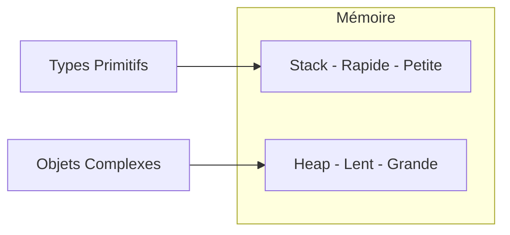
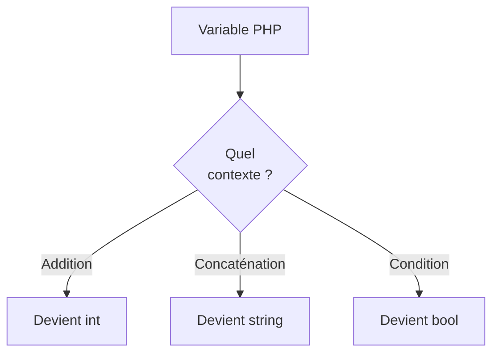

# Types Primitifs

## Introduction

**Niveau :** Débutant

!!! quote "Analogie pédagogique"
    _Imaginez que vous construisez une maison. Avant de poser les murs, vous avez besoin de **matériaux de base** : du ciment, des briques, du bois, des clous. En programmation, les **types primitifs** sont exactement ces matériaux fondamentaux !_

Les types primitifs sont les **éléments les plus simples** qu'un langage de programmation peut manipuler : _des nombres, du texte, vrai ou faux_. C'est un peu comme les ingrédients de base en cuisine : avec de _la farine, des œufs et du lait_, vous pouvez créer des plats complexes. Avec les types primitifs, vous créerez vos programmes !

Ces concepts vous aideront à choisir le bon type pour vos données, à éviter les erreurs courantes, à optimiser vos programmes et à comprendre les messages d'erreur de votre langage.

!!! info "Pourquoi c'est important ?"
    La maîtrise des types primitifs impacte la **performance** de vos programmes, leur **sécurité**, la **clarté** de votre code et votre **professionnalisme** technique.

## Pour les vrais débutants

Si vous ne savez pas encore ce qu'est une **variable**, imaginez-la comme une boîte avec une étiquette. Les types primitifs sont les différentes choses que vous pouvez ranger dans ces boîtes.

- **Type primitif** = ce que vous rangez
- **Variable** = la boîte pour le ranger

## Qu'est-ce qu'un type primitif exactement ?

Un type primitif est une donnée de base fournie directement par le langage. C'est l'élément le plus simple possible. Comme les couleurs primaires en peinture (**rouge**, **bleu**, **jaune**), vous ne pouvez pas les décomposer plus, mais avec elles **vous pouvez créer toutes les autres couleurs** !

### Caractéristiques communes

Tous les types primitifs partagent ces qualités :

- **Simple** : Une seule valeur (un nombre, une lettre...)
- **Rapide** : Optimisé par le processeur
- **Direct** : Pas de détours pour accéder à la valeur
- **Prédéfini** : Fourni par le langage

### Stack et Heap - Les deux zones mémoire

Il nous semble important d'introduire brièvement la **Stack** (pile) et le **Heap** (tas), deux zones de mémoire de votre ordinateur.



_La **Stack** est comme votre bureau : accès rapide mais espace limité.  
Le **Heap** est comme votre grenier : beaucoup de place mais plus lent à accéder.  
Les **types primitifs vivent dans la Stack** pour être **ultra-rapides** !_

!!! tip "Elle sera détaillé dans la documentation suivante incluant la référence par la même occasion."

## Tour d'horizon par langage

Nous allons découvrir les types primitifs dans cinq langages professionnels courants.  
Chaque langage a sa propre philosophie !

### **Python** - Tout est objet

**Particularité** : Python fait semblant que tout est simple, mais en réalité même les nombres sont des objets sophistiqués.

| Type | Exemple | Description | Taille en mémoire |
| :---: | --- | --- | :---: |
| `int` | `42`, `-123` | Nombres entiers (taille illimitée !) | Variable |
| `float` | `3.14`, `1.5e-10` | Nombres décimaux | 24 bytes |
| `bool` | `True`, `False` | Vrai/Faux (_en fait des int déguisés_) | 28 bytes |
| `str` | `"Hello"`, `'Bonjour'` | Texte | Variable |
| `None` | `None` | Rien du tout | 16 bytes |

```python
# Démonstration simple des types Python
def decouvrir_types_python():
    print("DÉCOUVERTE DES TYPES PYTHON")

    # Entiers - Python peut gérer des nombres gigantesques !
    petit = 42
    enorme = 123456789012345678901234567890
    print(f"Petit nombre: {petit}")
    print(f"Nombre énorme: {enorme}")
    print(f"Python peut calculer : {enorme * 2}")

    # Flottants - nombres à virgule
    pi = 3.14159
    scientifique = 1.23e-4  # = 0.000123
    print(f"Pi: {pi}")
    print(f"Notation scientifique: {scientifique}")

    # Booléens - vrai/faux mais aussi... des nombres !
    vrai = True
    faux = False
    print(f"True = {vrai}, False = {faux}")
    print(f"True + True = {vrai + vrai}")  # Surprise : 2 !

    # Strings - texte
    message = "Hello World!"
    print(f"Message: {message}")
    print(f"Première lettre: {message[0]}") # H

    # Le type mystérieux None
    rien = None
    print(f"Rien du tout: {rien}")

decouvrir_types_python()
```

!!! tip "Magie Python"
    Python recycle les nombres de -5 à 256 pour économiser la mémoire !

### **JavaScript** - Le langage du web

**Particularité** : Un seul type `number` pour tous les nombres, mais attention aux pièges !

| Type | Exemple | Description |
| :---: | --- | --- |
| `number` | `42`, `3.14`, `Infinity` | Tous les nombres |
| `bigint` | `123n` | Très gros nombres (finit par 'n') |
| `string` | `"text"`, `'text'`, `template` | Texte |
| `boolean` | `true`, `false` | Vrai/Faux |
| `undefined` | `undefined` | Variable non définie |
| `null` | `null` | Volontairement vide |

```javascript
// Découverte des types JavaScript
function decouvrirTypesJavaScript() {
    console.log('DÉCOUVERTE DES TYPES JAVASCRIPT');

    // Numbers - un type pour tous les gouverner
    let entier = 42;
    let decimal = 3.14159;
    let grandNombre = 1.23e20; // Très grand !
    let infini = Infinity;
    let pasDuTout = NaN; // "Not a Number"

    console.log(`Entier: ${entier}`);
    console.log(`Décimal: ${decimal}`);
    console.log(`Très grand: ${grandNombre}`);
    console.log(`Infini: ${infini}`);
    console.log(`Pas un nombre: ${pasDuTout}`);

    // Piège classique de précision !
    console.log(`0.1 + 0.2 = ${0.1 + 0.2}`); // Pas 0.3 !

    // BigInt pour les très gros nombres
    let tresTresGros = 123456789012345678901234567890n;
    console.log(`Très très gros: ${tresTresGros}`);

    // Strings avec super-pouvoirs
    let nom = 'Alice';
    let age = 25;
    let phrase = `Bonjour ${nom}, tu as ${age} ans !`;
    console.log(phrase);

    // Les deux "vides"
    let indefini; // undefined automatiquement
    let vide = null; // vide volontaire
    console.log(`Indéfini: ${indefini}`);
    console.log(`Vide: ${vide}`);

    // Test de passage par valeur
    function modifier(x) {
        x = 999;
        return x;
    }

    let nombre = 42;
    console.log(`Avant: ${nombre}`);
    modifier(nombre);
    console.log(`Après: ${nombre}`); // Toujours 42 !
}

decouvrirTypesJavaScript();
```

!!! warning "Pièges JavaScript"
    `typeof null` retourne `"object"` - c'est un bug historique !  
    `0.1 + 0.2` ne donne pas exactement `0.3`. Pour en savoir plus, il faut se tourner vers la conversion des décimales au binaire.

### **PHP** - Le caméléon du web

**Particularité** : PHP change automatiquement de type selon le contexte ( **type juggling**[^1] ).

| Type | Exemple | Description |
| :---: | --- | --- |
| `int` | `42`, `0x2A` | Entiers (décimal, hexa, binaire, octal) |
| `float` | `3.14` | Nombres décimaux |
| `string` | `"text"`, `'text'` | Texte |
| `bool` | `true`, `false` | Vrai/Faux |
| `null` | `null` | Vide |



_**PHP est un caméléon** : il change le type de vos variables selon ce que vous faites avec !  
Pratique mais parfois surprenant._

```php
<?php
// Découverte des types PHP
function decouvrirTypesPHP() {
    echo "DÉCOUVERTE DES TYPES PHP\n";

    // Entiers sous toutes leurs formes
    $decimal = 42;
    $hexadecimal = 0x2A;      // 42 en hexadécimal
    $binaire = 0b101010;      // 42 en binaire
    $octal = 052;             // 42 en octal

    echo "Même nombre, différentes écritures:\n";
    echo "Décimal: $decimal\n";
    echo "Hexadécimal: $hexadecimal\n";
    echo "Binaire: $binaire\n";
    echo "Octal: $octal\n";

    // La magie (parfois dangereuse) du type juggling
    echo "\nMAGIE DU TYPE JUGGLING:\n";

    $nombre = "123";          // String
    $resultat = $nombre + 45; // Devient int automatiquement !
    echo "\"123\" + 45 = $resultat\n";

    $mixte = "123abc";
    $converti = $mixte + 10;  // Prend juste "123" !
    echo "\"123abc\" + 10 = $converti\n";

    // Comparaisons surprenantes
    echo "\nCOMPARAISONS SURPRENANTES:\n";
    echo "0 == \"\" : " . (0 == "" ? "true" : "false") . "\n";         // true !
    echo "0 === \"\" : " . (0 === "" ? "true" : "false") . "\n";       // false
    echo "false == \"\" : " . (false == "" ? "true" : "false") . "\n"; // true !

    // Types explicites avec gettype()
    echo "\nVÉRIFICATION DES TYPES:\n";
    $variables = [42, 3.14, "hello", true, null];
    foreach ($variables as $var) {
        echo "Valeur: " . ($var ?? 'NULL') . " -> Type: " . gettype($var) . "\n";
    }
}

decouvrirTypesPHP();
?>
```

!!! tip "Survie en PHP"
    Utilisez toujours `===` (**triple égal**) pour éviter les surprises !  
    Le triple égal compare **la valeur** ET **le type**.

### Go - Simplicité et performance

**Particularité** : Go est simple et très strict. Les conversions doivent toujours être explicites.

| Type | Taille | Exemple |
| :---: | :---: | --- |
| `int8`, `int16`, `int32`, `int64` | Fixe | Entiers signés |
| `uint8`, `uint16`, `uint32`, `uint64` | Fixe | Entiers non-signés |
| `float32`, `float64` | 32/64 bits | Décimaux |
| `bool` | 1 byte | `true`, `false` |
| `string` | Variable | Texte UTF-8 |
| `byte` | 8 bits | Alias de uint8 |
| `rune` | 32 bits | Caractère Unicode |

_**Entiers signés** : Peut être négatif_  
_**Entiers non-signés** : **Ne peut pas être négatif**_


```go
package main
import "fmt" // Package standard : format

func main() {
    // Découverte simple des types Go
    var entier int = 42
    var flottant float64 = 3.14
    var texte string = "Hello"
    
    fmt.Printf("Entier: %d\n", entier)
    fmt.Printf("Flottant: %.2f\n", flottant) // 2 chiffres après la virgule
    fmt.Printf("Texte: %s\n", texte)
    
    // Go refuse les mélanges !
    // var resultat = entier + flottant  // ERREUR de compilation
    
    // Il faut convertir explicitement
    var resultat = float64(entier) + flottant
    fmt.Printf("Résultat: %.2f\n", resultat)
}
```

!!! tip "Go strict"
    Go vous force à être explicite.  
    **Pas de conversion automatique = moins de bugs** !

### Rust - Sécurité maximale

**Particularité** : Rust détecte les débordements et refuse tout ce qui pourrait être dangereux.

| Type | Exemple | Sécurité |
| :---: | --- | --- |
| `i8`, `i16`, `i32`, `i64`, `i128` | Entiers signés | Débordement détecté |
| `u8`, `u16`, `u32`, `u64`, `u128` | Non-signés | Débordement détecté |
| `f32`, `f64` | Flottants | Standard IEEE 754 |
| `bool` | `true`, `false` | Type strict |
| `char` | Unicode | Toujours valide |

```rust
fn main() {
    // Découverte simple des types Rust
    let entier: i32 = 42;
    let flottant: f64 = 3.14;
    let texte: &str = "Hello";
    
    println!("Entier: {}", entier);
    println!("Flottant: {:.2}", flottant);
    println!("Texte: {}", texte);
    
    // Rust gère intelligemment les débordements
    let max = i8::MAX;  // 127
    
    // Vérification automatique en mode debug
    match max.checked_add(1) {
        Some(val) => println!("Résultat: {}", val),
        None => println!("Débordement détecté !"),
    }
}
```

!!! tip "Sécurité Rust"
    Rust vous force à penser aux cas limites.  
    **Moins de liberté = moins de bugs** !

## Comparaison rapide

| Langage | Complexité | Sécurité | Performance | Pour débuter |
| --- | :---: | :---: | :---: | :---: |
| **Python** | 🟢 Simple | 🟢 Bonne | 🔴 Lente | ⭐⭐⭐ |
| **JavaScript** | 🟢 Simple | 🟡 Moyenne | 🟡 Moyenne | ⭐⭐⭐ |
| **PHP** | 🟢 Simple | 🟡 Moyenne | 🟡 Moyenne | ⭐⭐⭐ |
| **Go** | 🟢 Simple | 🟢 Bonne | 🟢 Rapide | ⭐⭐ |
| **Rust** | 🟡 Moyenne | 🟢 Excellente | 🟢 Maximale | ⭐ |

## Pièges classiques

### Le piège de la précision (JS, Python, PHP)

```javascript
// ❌ Problème
console.log(0.1 + 0.2);  // 0.30000000000000004

// ✅ Solution simple
console.log((0.1 + 0.2).toFixed(1));  // "0.3"
```

### Le piège des conversions (PHP)

```php
// ❌ Surprenant
var_dump(0 == "");   // true !

// ✅ Utilisez ===
var_dump(0 === "");  // false
```

## Conseils pour débuter

!!! tip "Règles d'or"
    1. **Commencez simple** : `int`, `float`, `string`, `bool`
    2. **Nommez clairement vos variables** : `age` plutôt que `a`
    3. **Testez avec des valeurs extrêmes** : 0, -1, très grand...
    4. **Restez curieux** : chaque langage a ses spécificités !

## Le mot de la fin

!!! quote 
    Les types primitifs sont comme apprendre à tenir un crayon. Ça paraît basique, mais c'est la fondation de tout ce que vous écrirez ensuite ! Prenez le temps de bien les comprendre. Votre futur vous (et vos collègues) vous remercieront !

---

!!! abstract "Métadonnées"
    **Version** : 1.0  
    **Dernière mise à jour** : Novembre 2025  
    **Durée de lecture** : 15-20 minutes  
    **Niveau** : Débutant


[^1]: Le **type juggling** (ou _conversion implicite de type_) désigne le processus par lequel un langage de programmation **convertit automatiquement une valeur d’un type à un autre** pour exécuter une opération, souvent sans que le développeur le demande explicitement.