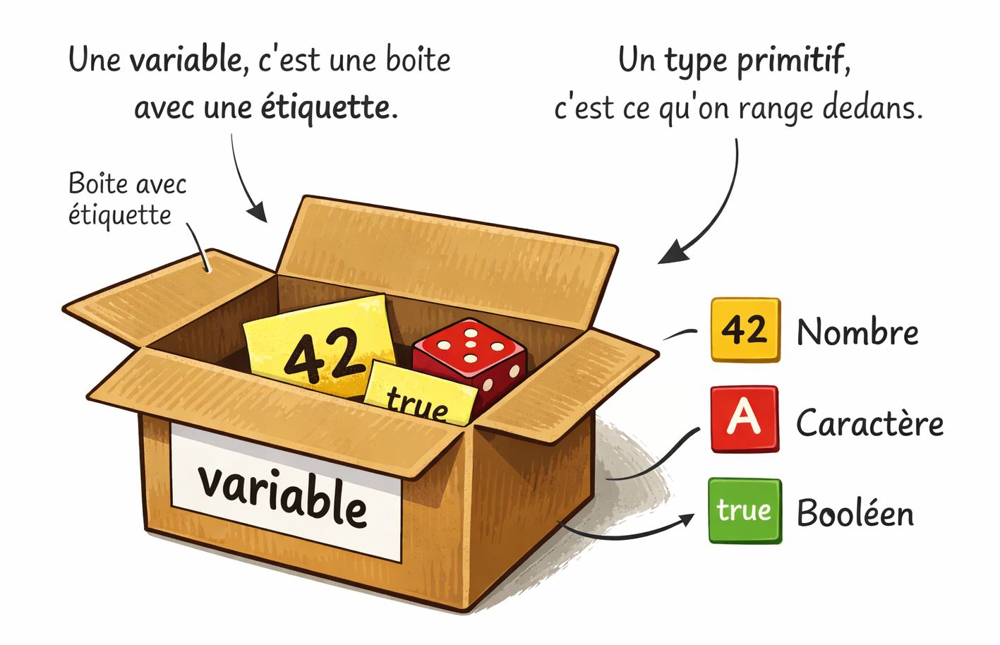
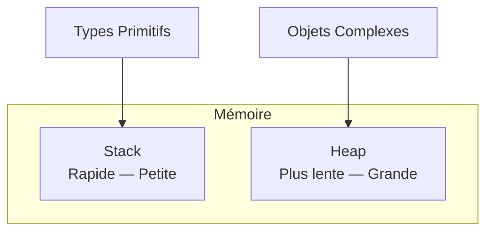
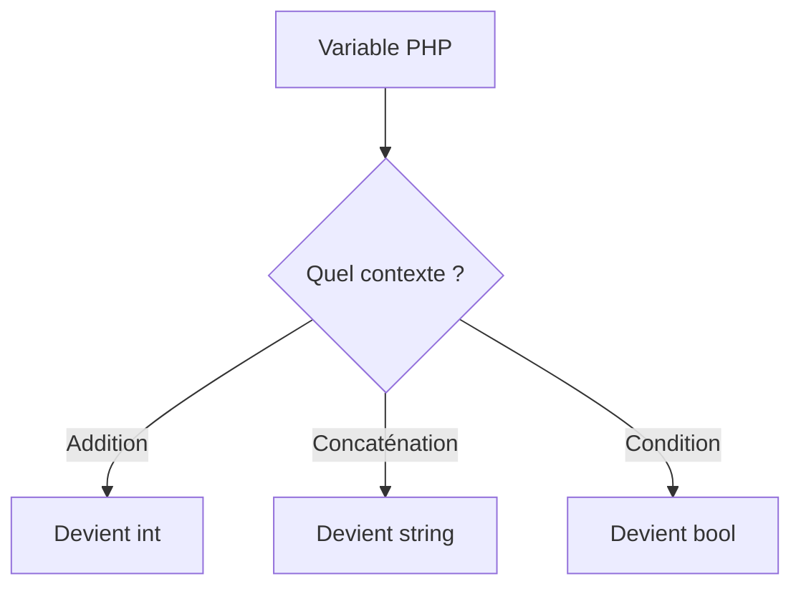

# Types Primitifs

<div
  class="omny-meta"
  data-level="🟢 Débutant & 🟡 Intermédiaire"
  data-version="1.1"
  data-time="15-20 minutes">
</div>

!!! quote "Analogie"
    _Construire une maison nécessite des matériaux de base : du ciment, des briques, du bois. En programmation, les **types primitifs** sont ces matériaux fondamentaux. On ne construit rien de solide sans eux._

Les types primitifs sont les **éléments les plus simples** qu'un langage de programmation peut manipuler : des nombres, du texte, vrai ou faux. Comme les ingrédients de base en cuisine — farine, œufs, lait — ils permettent de composer des structures bien plus complexes.

Comprendre les types primitifs, c'est savoir choisir le bon type pour chaque donnée, éviter les erreurs courantes, optimiser la mémoire et interpréter les messages d'erreur d'un compilateur ou d'un interpréteur.

!!! info "Pourquoi c'est important"
    La maîtrise des types primitifs impacte directement la **performance** des programmes, leur **sécurité**, la **clarté** du code et la **robustesse** face aux cas limites.

<br />

---

## Pour repartir des bases

Une **variable** est un espace nommé en mémoire permettant de stocker une valeur. On lui donne un nom — appelé identifiant — pour pouvoir y faire référence dans le code. Ce nom est l'**étiquette** ; ce qui est stocké dedans est le type **primitif**.

**Un programme manipule en permanence des variables** : il en crée, les modifie, les compare et les transmet.  
Comprendre ce mécanisme de base est le prérequis à tout le reste.

!!! note "L'image ci-dessous représente concrètement la relation entre une variable et son contenu. Ce mécanisme — étiquette pointant vers une valeur — est le même que celui qui sera approfondi dans la fiche [Heap, Stack & Références](./heap-stack-references.md) pour les types complexes."



<p><em>Une variable est une étiquette attachée à une zone mémoire. L'étiquette porte le nom choisi par le développeur ; la zone mémoire contient la valeur primitive. Renommer la variable ne change pas la valeur — modifier la valeur ne change pas le nom.</em></p>

<br />

---

## Qu'est-ce qu'un type primitif exactement ?

Un type primitif est une donnée de base fournie directement par le langage — l'élément le plus simple possible. Comme les couleurs primaires en peinture (rouge, bleu, jaune) : on ne peut pas les décomposer davantage, mais avec elles on peut créer toutes les autres.

### Caractéristiques communes

Tous les types primitifs partagent ces propriétés :

- **Simple** — une seule valeur (un nombre, un caractère...)
- **Rapide** — optimisé directement par le processeur
- **Direct** — pas d'indirection pour accéder à la valeur
- **Prédéfini** — fourni nativement par le langage

### Stack et Heap — les deux zones mémoire

!!! info "Il est utile d'introduire brièvement la **Stack** (pile) et le **Heap** (tas), deux zones mémoire fondamentales."


```mermaid
flowchart TB
  subgraph Mémoire
    Stack["Stack<br />Rapide — Petite"]
    Heap["Heap<br />Plus lente — Grande"]
  end

  Primitifs["Types Primitifs"] --> Stack
  Objets["Objets Complexes"] --> Heap
```

_La **Stack** est comparable à un bureau de travail : accès rapide, espace limité. Le **Heap** ressemble à un entrepôt : grande capacité, accès plus lent. Les types primitifs vivent en Stack pour des raisons de performance._

!!! note "Ces deux zones sont détaillées dans la fiche dédiée : [Heap, Stack & Références](./heap-stack-references.md)"

<br />

---

## Tour d'horizon par langage

Les types primitifs existent dans tous les langages modernes, avec des philosophies différentes. Les quatre langages ci-dessous couvrent l'essentiel des approches rencontrées en environnement professionnel.

### :fontawesome-brands-python: Python — tout est objet

**Particularité** : Python donne l'impression de la simplicité, mais même les nombres entiers sont des objets internes sophistiqués.

| Type | Exemple | Description | Taille en mémoire |
|:---:|---|---|:---:|
| `int` | `42`, `-123` | Nombres entiers (taille illimitée) | Variable |
| `float` | `3.14`, `1.5e-10` | Nombres décimaux | 24 bytes |
| `bool` | `True`, `False` | Vrai/Faux (des int déguisés) | 28 bytes |
| `str` | `"Hello"`, `'Bonjour'` | Texte | Variable |
| `None` | `None` | Absence de valeur | 16 bytes |

```python title="Python — démonstration des types"
# Démonstration des types Python
def decouvrir_types_python():
    print("DÉCOUVERTE DES TYPES PYTHON")

    # Entiers — Python gère des nombres de taille arbitraire
    petit  = 42
    enorme = 123456789012345678901234567890
    print(f"Petit nombre: {petit}")
    print(f"Nombre énorme: {enorme}")
    print(f"Python peut calculer : {enorme * 2}")

    # Flottants — nombres à virgule
    pi           = 3.14159
    scientifique = 1.23e-4  # = 0.000123
    print(f"Pi: {pi}")
    print(f"Notation scientifique: {scientifique}")

    # Booléens — vrai/faux mais aussi des entiers
    vrai = True
    faux = False
    print(f"True = {vrai}, False = {faux}")
    print(f"True + True = {vrai + vrai}")  # Résultat : 2

    # Strings — texte
    message = "Hello World!"
    print(f"Message: {message}")
    print(f"Première lettre: {message[0]}")  # H

    # None — absence explicite de valeur
    rien = None
    print(f"Rien du tout: {rien}")

decouvrir_types_python()
```

!!! tip "Optimisation Python"
    Python recycle les objets entiers de -5 à 256 pour économiser la mémoire — un détail interne utile à connaître pour comprendre certains comportements inattendus.

<br />

---

### :fontawesome-brands-js: JavaScript — le langage du web

**Particularité** : Un seul type `number` couvre tous les nombres, ce qui simplifie l'apprentissage mais introduit des pièges précis.

| Type | Exemple | Description |
|:---:|---|---|
| `number` | `42`, `3.14`, `Infinity` | Tous les nombres |
| `bigint` | `123n` | Très grands entiers (suffixe `n`) |
| `string` | `"text"`, `'text'` | Texte |
| `boolean` | `true`, `false` | Vrai/Faux |
| `undefined` | `undefined` | Variable déclarée mais non initialisée |
| `null` | `null` | Absence de valeur explicite |

```javascript title="JavaScript — démonstration des types"
// Découverte des types JavaScript
function decouvrirTypesJavaScript() {
    console.log('DÉCOUVERTE DES TYPES JAVASCRIPT');

    // Numbers — un type unique pour tous les nombres
    let entier      = 42;
    let decimal     = 3.14159;
    let grandNombre = 1.23e20;
    let infini      = Infinity;
    let pasDuTout   = NaN; // "Not a Number"

    console.log(`Entier: ${entier}`);
    console.log(`Décimal: ${decimal}`);
    console.log(`Très grand: ${grandNombre}`);
    console.log(`Infini: ${infini}`);
    console.log(`Pas un nombre: ${pasDuTout}`);

    // Piège de précision flottante
    console.log(`0.1 + 0.2 = ${0.1 + 0.2}`); // Pas 0.3 exactement

    // BigInt pour les très grands entiers
    let tresTresGros = 123456789012345678901234567890n;
    console.log(`Très très gros: ${tresTresGros}`);

    // Template literals
    let nom   = 'Alice';
    let age   = 25;
    let phrase = `Bonjour ${nom}, tu as ${age} ans !`;
    console.log(phrase);

    // Les deux formes de "vide"
    let indefini;       // undefined automatiquement
    let vide = null;    // absence de valeur explicite
    console.log(`Indéfini: ${indefini}`);
    console.log(`Vide: ${vide}`);

    // Passage par valeur — la variable originale n'est pas modifiée
    function modifier(x) {
        x = 999;
        return x;
    }

    let nombre = 42;
    console.log(`Avant: ${nombre}`);
    modifier(nombre);
    console.log(`Après: ${nombre}`); // Toujours 42
}

decouvrirTypesJavaScript();
```

!!! warning "Pièges JavaScript"
    `typeof null` retourne `"object"` — c'est un bug historique conservé pour des raisons de compatibilité.
    `0.1 + 0.2` ne donne pas exactement `0.3` — conséquence directe de la représentation binaire des décimaux (norme IEEE 754[^2]).

<br />

---

### :fontawesome-brands-php: PHP — le caméléon du web

**Particularité** : PHP convertit automatiquement les types selon le contexte — comportement connu sous le nom de **type juggling**[^1].

| Type | Exemple | Description |
|:---:|---|---|
| `int` | `42`, `0x2A` | Entiers (décimal, hexa, binaire, octal) |
| `float` | `3.14` | Nombres décimaux |
| `string` | `"text"`, `'text'` | Texte |
| `bool` | `true`, `false` | Vrai/Faux |
| `null` | `null` | Absence de valeur |


```mermaid
flowchart TB
  Variable["Variable PHP"] --> Contexte{"Quel contexte ?"}
  Contexte -->|"Addition"| Int["Devient int"]
  Contexte -->|"Concaténation"| String["Devient string"]
  Contexte -->|"Condition"| Bool["Devient bool"]
```

<p><em>PHP adapte le type d'une variable selon l'opération effectuée — comportement pratique mais source d'erreurs subtiles si on ne l'anticipe pas.</em></p>

```php title="PHP — démonstration des types"
<?php
function decouvrirTypesPHP() {
    echo "DÉCOUVERTE DES TYPES PHP\n";

    // Entiers sous toutes leurs formes
    $decimal     = 42;
    $hexadecimal = 0x2A;     // 42 en hexadécimal
    $binaire     = 0b101010; // 42 en binaire
    $octal       = 052;      // 42 en octal

    echo "Même nombre, différentes écritures:\n";
    echo "Décimal: $decimal\n";
    echo "Hexadécimal: $hexadecimal\n";
    echo "Binaire: $binaire\n";
    echo "Octal: $octal\n";

    // Type juggling en action
    echo "\nTYPE JUGGLING:\n";
    $nombre   = "123";         // string
    $resultat = $nombre + 45;  // converti en int automatiquement
    echo "\"123\" + 45 = $resultat\n";

    $mixte    = "123abc";
    $converti = $mixte + 10;   // prend uniquement "123"
    echo "\"123abc\" + 10 = $converti\n";

    // Comparaisons à double égal vs triple égal
    echo "\nCOMPARAISONS:\n";
    echo '0 == "" : '    . (0 == ""  ? "true" : "false") . "\n";  // true
    echo '0 === "" : '   . (0 === "" ? "true" : "false") . "\n";  // false
    echo 'false == "" : ' . (false == "" ? "true" : "false") . "\n"; // true

    // Vérification de type avec gettype()
    echo "\nTYPES DÉTECTÉS:\n";
    $variables = [42, 3.14, "hello", true, null];
    foreach ($variables as $var) {
        echo "Valeur: " . ($var ?? 'NULL') . " -> Type: " . gettype($var) . "\n";
    }
}

decouvrirTypesPHP();
?>
```

!!! tip "Règle de survie en PHP"
    Utiliser systématiquement `===` (triple égal) pour comparer **la valeur ET le type**. Le double égal `==` déclenche une conversion implicite qui produit des résultats contre-intuitifs.

<br />

---

### :fontawesome-brands-golang: Go — simplicité et performance

**Particularité** : Go est strict et minimaliste. Toute conversion entre types doit être explicite — ce qui élimine une classe entière de bugs silencieux.

| Type | Taille | Exemple |
|:---:|:---:|---|
| `int8`, `int16`, `int32`, `int64` | Fixe | Entiers signés |
| `uint8`, `uint16`, `uint32`, `uint64` | Fixe | Entiers non signés |
| `float32`, `float64` | 32/64 bits | Décimaux |
| `bool` | 1 byte | `true`, `false` |
| `string` | Variable | Texte UTF-8 |
| `byte` | 8 bits | Alias de `uint8` |
| `rune` | 32 bits | Caractère Unicode |

_**Entiers signés** : peuvent être négatifs.  
**Entiers non signés** : toujours positifs ou nuls._

```go title="Go — démonstration des types"
package main

import "fmt"

func main() {
    // Déclaration explicite des types
    var entier   int     = 42
    var flottant float64 = 3.14
    var texte    string  = "Hello"

    fmt.Printf("Entier: %d\n",     entier)
    fmt.Printf("Flottant: %.2f\n", flottant) // 2 décimales
    fmt.Printf("Texte: %s\n",      texte)

    // Go refuse le mélange de types sans conversion explicite
    // var resultat = entier + flottant  // Erreur de compilation

    // Conversion explicite obligatoire
    var resultat = float64(entier) + flottant
    fmt.Printf("Résultat: %.2f\n", resultat)
}
```

!!! tip "La rigueur de Go"
    Go force à être explicite sur les conversions. C'est une contrainte en apparence — c'est en réalité une garantie : **pas de conversion automatique = moins de comportements inattendus**.

<br />

---

## Comparaison rapide

| Langage | Complexité | Sécurité des types | Performance | Accessibilité |
|:---:|:---:|:---:|:---:|:---|
| :fontawesome-brands-python: | Faible | Bonne | Lente | Recommandé pour débuter |
| :fontawesome-brands-js: | Faible | Moyenne | Moyenne | Recommandé pour débuter |
| :fontawesome-brands-php: | Faible | Moyenne | Moyenne | Recommandé pour débuter |
| :fontawesome-brands-golang: | Faible | Très bonne | Rapide | Accessible après les bases |

<br />

---

## Pièges classiques

### Le piège de la précision (JS, Python, PHP)

```javascript title="JavaScript — piège de précision flottante"
// Problème
console.log(0.1 + 0.2);  // 0.30000000000000004

// Solution simple
console.log((0.1 + 0.2).toFixed(1));  // "0.3"
```

### Le piège des conversions implicites (PHP)

```php title="PHP — comparaison stricte vs laxiste"
<?php
// Comportement inattendu avec double égal
var_dump(0 == "");   // true

// Comparaison stricte — résultat attendu
var_dump(0 === "");  // false
```

<br />

---

## Conseils pratiques

!!! tip "Règles d'or pour débuter"
    - Commencer par `int`, `float`, `string`, `bool` — les quatre types fondamentaux présents dans tous les langages
    - Nommer les variables de manière explicite : `age` plutôt que `a`, `prixUnitaire` plutôt que `p`
    - Tester les cas limites : `0`, `-1`, valeurs très grandes, chaîne vide
    - Lire les messages d'erreur liés aux types — ils sont souvent précis et indiquent exactement où chercher

<br />

---

## Conclusion

!!! quote "Conclusion"
    _Les types primitifs, c'est apprendre à tenir un crayon. Ça paraît basique — c'est pourtant la fondation de tout ce qui sera écrit ensuite. Prendre le temps de bien les comprendre réduit drastiquement les bugs et les comportements inexpliqués dans les projets plus avancés._

<br />

[^1]: **Type juggling** — conversion implicite de type : comportement par lequel un langage convertit automatiquement une valeur d'un type vers un autre pour permettre l'exécution d'une opération, sans que le développeur l'ait demandé explicitement.
[^2]: **IEEE 754** — norme internationale définissant la représentation des nombres à virgule flottante en binaire. Elle est à l'origine du résultat surprenant de `0.1 + 0.2` : certains décimaux ne peuvent pas être représentés exactement en base 2, ce qui introduit une erreur d'arrondi infime mais mesurable.