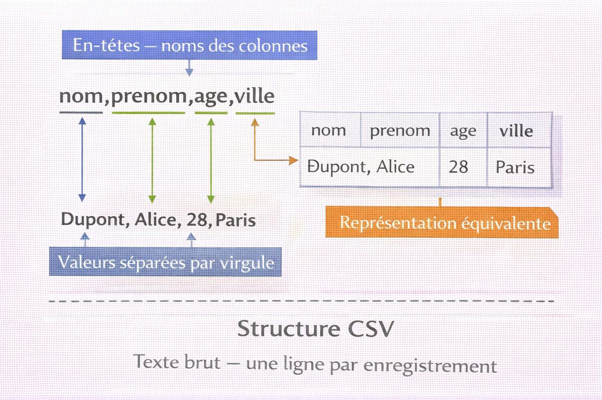
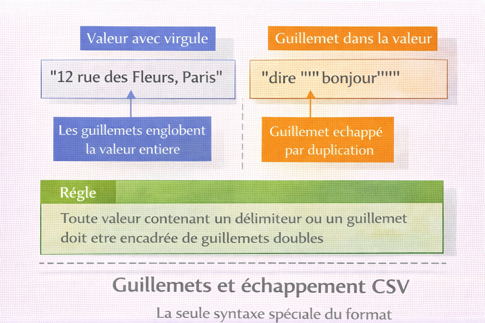

# CSV — Comma-Separated Values

<div
  class="omny-meta"
  data-level="🟢 Débutant & 🟡 Intermédiaire"
  data-version="1.1"
  data-time="40-45 minutes">
</div>

!!! quote "Analogie"
    _Un tableau Excel simplifié où chaque ligne représente une entrée et chaque colonne une information, enregistré en texte brut avec des virgules comme séparateurs. CSV fonctionne exactement ainsi : c'est le format le plus simple pour stocker des données tabulaires, lisible par les humains et manipulable par toutes les machines._

**CSV (Comma-Separated Values)** est un format de fichier texte brut utilisé pour représenter des **données tabulaires** — lignes et colonnes. Chaque ligne du fichier correspond à une ligne de données, et les valeurs de chaque colonne sont séparées par un **délimiteur** (généralement une virgule, d'où son nom).

CSV est le format **universel d'échange de données** : exporté par Excel, Google Sheets, bases de données, logs serveurs, et manipulable par tous les langages de programmation. Sa simplicité en fait le choix privilégié pour les imports/exports massifs, les migrations de données, les logs structurés et les analyses.

!!! info "Pourquoi c'est important"
    CSV permet l'échange de données entre systèmes hétérogènes, l'import/export massif, le traitement batch, l'analyse de logs et la génération de rapports. C'est le format standard des outils de data science (pandas, R) et le dénominateur commun de l'interopérabilité.

<br />

---

## Structure CSV

### Format de base

!!! note "L'image ci-dessous décompose la structure d'un fichier CSV en zones annotées et montre la correspondance avec un tableau. Voir les deux représentations côte à côte évite de perdre de vue qu'un CSV n'est qu'un tableau encodé en texte brut."



<p><em>La première ligne contient les noms des colonnes — les en-têtes. Chaque ligne suivante est un enregistrement. Chaque valeur est séparée du suivant par un délimiteur. La structure est strictement plate : pas d'imbrication, pas de hiérarchie, pas de types natifs.</em></p>

```csv title="CSV — fichier simple"
nom,prenom,age,ville
Dupont,Alice,28,Paris
Martin,Bob,35,Lyon
Dubois,Charlie,42,Marseille
```

La première ligne contient les en-têtes — noms des colonnes. Les lignes suivantes contiennent les données. Le délimiteur par défaut est la virgule, mais il varie selon les outils et les contextes.

### Guillemets et cas particuliers

!!! note "L'image ci-dessous illustre les deux règles d'échappement CSV — valeur contenant un délimiteur et guillemet dans une valeur. Ce sont les seules règles syntaxiques spéciales du format, mais leur non-respect génère des fichiers impossibles à parser correctement."



<p><em>Toute valeur contenant un délimiteur doit être encadrée de guillemets doubles. Un guillemet double à l'intérieur d'une valeur encadrée est représenté par deux guillemets consécutifs. Il n'existe pas d'autre mécanisme d'échappement dans le standard CSV (RFC 4180).</em></p>

```csv title="CSV — valeurs avec virgule intégrée"
nom,prenom,adresse
Dupont,Alice,"12 rue des Fleurs, Paris"
Martin,Bob,"Appartement 5, 3ème étage, Lyon"
```

```csv title="CSV — guillemets doubles échappés"
nom,citation
Shakespeare,"To be, or not to be: that is the ""question"""
Einstein,"E=mc²"
```

```csv title="CSV — caractères spéciaux et encodage"
nom,prenom,commentaire
Müller,François,"Caractères accentués: é à ç"
O'Brien,Seán,"Apostrophes et accents irlandais"
```

### Variations de délimiteurs

!!! note "L'image ci-dessous présente les quatre délimiteurs les plus courants. Le choix du délimiteur n'est pas encodé dans le fichier — il doit être connu ou détecté par le programme qui lit le CSV."


<p><em>La virgule est le délimiteur standard, mais Excel dans les paramètres régionaux européens exporte avec des point-virgules (la virgule servant de séparateur décimal). Le TSV (tabulation) est courant dans les exports de bases de données. Le pipe est utilisé dans les logs et les systèmes Linux. Toujours vérifier le délimiteur avant de parser un fichier inconnu.</em></p>

```csv title="CSV — point-virgule (Excel régions européennes)"
nom;prenom;age
Dupont;Alice;28
Martin;Bob;35
```

```csv title="CSV — tabulation (format TSV)"
nom	prenom	age
Dupont	Alice	28
Martin	Bob	35
```

```csv title="CSV — pipe (logs et systèmes Linux)"
nom|prenom|age
Dupont|Alice|28
Martin|Bob|35
```

<br />

---

## Manipulation CSV par langage

### Opérations fondamentales

=== ":fontawesome-brands-python: Python"

    ```python title="Python — lecture et écriture CSV"
    import csv

    # Lecture basique par index
    with open('users.csv', 'r', encoding='utf-8') as f:
        lecteur = csv.reader(f)
        entetes = next(lecteur)  # Première ligne = en-têtes
        print(f"Colonnes : {entetes}")

        for ligne in lecteur:
            nom, prenom, age, ville = ligne
            print(f"{prenom} {nom} ({age} ans) - {ville}")

    # Lecture par nom de colonne — recommandée
    with open('logs.csv', 'r', encoding='utf-8') as f:
        lecteur = csv.DictReader(f)

        for ligne in lecteur:
            # Accès par nom : résistant aux changements d'ordre de colonnes
            if ligne['resultat'] == 'failed':
                print(f"Echec : {ligne['username']} depuis {ligne['ip_source']}")

    # Écriture vers fichier
    utilisateurs = [
        {'nom': 'Dupont',  'prenom': 'Alice',   'age': 28, 'role': 'admin'},
        {'nom': 'Martin',  'prenom': 'Bob',     'age': 35, 'role': 'user'},
        {'nom': 'Dubois',  'prenom': 'Charlie', 'age': 42, 'role': 'user'}
    ]

    with open('output.csv', 'w', encoding='utf-8', newline='') as f:
        colonnes = ['nom', 'prenom', 'age', 'role']
        writer   = csv.DictWriter(f, fieldnames=colonnes)
        writer.writeheader()
        writer.writerows(utilisateurs)
    ```

    !!! tip "DictReader vs reader"
        `DictReader` accède aux colonnes par nom plutôt que par index. Si l'ordre des colonnes change dans le fichier source, le code continue de fonctionner sans modification. Utiliser `DictReader` par défaut, `reader` uniquement pour les fichiers sans en-têtes.

=== ":fontawesome-brands-js: JavaScript"

    ```javascript title="JavaScript — lecture et écriture CSV"
    // Installation : npm install csv-parser csv-writer
    const fs              = require('fs');
    const csv             = require('csv-parser');
    const createCsvWriter = require('csv-writer').createObjectCsvWriter;

    // Lecture depuis fichier (streaming)
    const resultats = [];

    fs.createReadStream('users.csv')
        .pipe(csv())
        .on('data', (ligne) => {
            // Chaque ligne est un objet avec les en-têtes comme clés
            console.log(`${ligne.prenom} ${ligne.nom} (${ligne.age} ans)`);
            resultats.push(ligne);
        })
        .on('end', () => {
            console.log(`${resultats.length} lignes lues`);
        });

    // Écriture vers fichier
    const csvWriter = createCsvWriter({
        path: 'output.csv',
        header: [
            { id: 'nom',    title: 'Nom' },
            { id: 'prenom', title: 'Prenom' },
            { id: 'age',    title: 'Age' },
            { id: 'role',   title: 'Role' }
        ]
    });

    const donnees = [
        { nom: 'Dupont',  prenom: 'Alice',   age: 28, role: 'admin' },
        { nom: 'Martin',  prenom: 'Bob',     age: 35, role: 'user' },
        { nom: 'Dubois',  prenom: 'Charlie', age: 42, role: 'user' }
    ];

    csvWriter.writeRecords(donnees)
        .then(() => console.log('Fichier CSV cree'));
    ```

=== ":fontawesome-brands-php: PHP"

    ```php title="PHP — lecture et écriture CSV"
    <?php
    // Lecture basique par index
    $fichier = fopen('users.csv', 'r');
    $entetes = fgetcsv($fichier);
    echo "Colonnes : " . implode(', ', $entetes) . "\n";

    while (($ligne = fgetcsv($fichier)) !== false) {
        [$nom, $prenom, $age, $ville] = $ligne;
        echo "$prenom $nom ($age ans) - $ville\n";
    }
    fclose($fichier);

    // Lecture avec en-têtes associatifs
    function lire_csv(string $fichierCsv): array {
        $fichier = fopen($fichierCsv, 'r');
        $entetes = fgetcsv($fichier);
        $donnees = [];

        while (($ligne = fgetcsv($fichier)) !== false) {
            $donnees[] = array_combine($entetes, $ligne);
        }

        fclose($fichier);
        return $donnees;
    }

    // Écriture vers fichier
    $utilisateurs = [
        ['nom' => 'Dupont',  'prenom' => 'Alice',   'age' => 28, 'role' => 'admin'],
        ['nom' => 'Martin',  'prenom' => 'Bob',     'age' => 35, 'role' => 'user'],
        ['nom' => 'Dubois',  'prenom' => 'Charlie', 'age' => 42, 'role' => 'user']
    ];

    $fichier = fopen('output.csv', 'w');
    fputcsv($fichier, array_keys($utilisateurs[0]));  // En-têtes

    foreach ($utilisateurs as $user) {
        fputcsv($fichier, $user);
    }
    fclose($fichier);
    ?>
    ```

=== ":fontawesome-brands-golang: Go"

    ```go title="Go — lecture et écriture CSV"
    package main

    import (
        "encoding/csv"
        "fmt"
        "os"
        "strconv"
    )

    type Utilisateur struct {
        Nom    string
        Prenom string
        Age    int
        Ville  string
    }

    func main() {
        // Lecture depuis fichier
        fichier, _ := os.Open("users.csv")
        defer fichier.Close()

        lecteur := csv.NewReader(fichier)
        lignes, _ := lecteur.ReadAll()

        entetes := lignes[0]
        fmt.Printf("Colonnes : %v\n", entetes)

        // Mapper les lignes vers des structures typées
        var utilisateurs []Utilisateur
        for _, ligne := range lignes[1:] {
            age, _ := strconv.Atoi(ligne[2])
            utilisateurs = append(utilisateurs, Utilisateur{
                Nom: ligne[0], Prenom: ligne[1], Age: age, Ville: ligne[3],
            })
        }

        for _, u := range utilisateurs {
            fmt.Printf("%s %s (%d ans) - %s\n", u.Prenom, u.Nom, u.Age, u.Ville)
        }

        // Écriture vers fichier
        sortie, _ := os.Create("output.csv")
        defer sortie.Close()

        writer := csv.NewWriter(sortie)
        defer writer.Flush()

        writer.Write([]string{"nom", "prenom", "age", "role"})
        for _, u := range utilisateurs {
            writer.Write([]string{u.Nom, u.Prenom, strconv.Itoa(u.Age), u.Ville})
        }
    }
    ```

### Analyse de logs

=== ":fontawesome-brands-python: Python"

    ```python title="Python — analyse logs de connexion"
    import csv
    from collections import Counter

    def analyser_logs(fichier_csv):
        echecs_par_ip   = Counter()
        echecs_par_user = Counter()

        with open(fichier_csv, 'r', encoding='utf-8') as f:
            for ligne in csv.DictReader(f):
                if ligne['resultat'] == 'failed':
                    echecs_par_ip[ligne['ip_source']]  += 1
                    echecs_par_user[ligne['username']] += 1

        # IPs avec plus de 3 echecs — indicateur de brute force
        print("=== IPs suspectes (>3 echecs) ===")
        for ip, count in echecs_par_ip.items():
            if count > 3:
                print(f"  {ip} : {count} tentatives echouees")

        print("\n=== Comptes les plus cibles ===")
        for user, count in echecs_par_user.most_common(5):
            print(f"  {user} : {count} echecs")

    analyser_logs('logs.csv')
    ```

=== ":fontawesome-brands-python: Python (pandas)"

    ```python title="Python — analyse logs avec pandas"
    import pandas as pd

    df = pd.read_csv('logs.csv')

    # Filtrer les echecs
    echecs = df[df['resultat'] == 'failed']

    # Compter par IP et isoler les suspectes
    attaques_par_ip = echecs.groupby('ip_source').size()
    ips_suspectes   = attaques_par_ip[attaques_par_ip > 3]

    print("IPs avec >3 tentatives :")
    print(ips_suspectes.sort_values(ascending=False))

    # Exporter la liste noire
    ips_suspectes.to_csv('ips_blacklist.csv', header=['count'])
    ```

=== ":fontawesome-brands-js: JavaScript"

    ```javascript title="JavaScript — analyse logs de connexion"
    const fs  = require('fs');
    const csv = require('csv-parser');

    async function analyserLogs(fichierCsv) {
        return new Promise((resolve, reject) => {
            const ipCounter = {};

            fs.createReadStream(fichierCsv)
                .pipe(csv())
                .on('data', (ligne) => {
                    if (ligne.resultat === 'failed') {
                        const ip          = ligne.ip_source;
                        ipCounter[ip]     = (ipCounter[ip] || 0) + 1;
                    }
                })
                .on('end', () => {
                    // IPs avec plus de 3 echecs
                    const suspectes = Object.entries(ipCounter)
                        .filter(([, count]) => count > 3)
                        .sort(([, a], [, b]) => b - a);

                    resolve(suspectes);
                })
                .on('error', reject);
        });
    }

    (async () => {
        const suspectes = await analyserLogs('logs.csv');
        console.log('IPs suspectes (>3 echecs) :');
        suspectes.forEach(([ip, count]) => {
            console.log(`  ${ip} : ${count} tentatives`);
        });
    })();
    ```

    !!! note "IIFE asynchrone"
        `(async () => { ... })()` est une IIFE[^1] — une fonction immédiatement invoquée. Elle permet d'utiliser `await` au niveau racine du script, là où JavaScript ne l'autorise pas directement en dehors d'un module ES.

=== ":fontawesome-brands-php: PHP"

    ```php title="PHP — analyse logs de connexion"
    <?php
    function analyser_logs(string $fichierCsv): void {
        $fichier  = fopen($fichierCsv, 'r');
        $entetes  = fgetcsv($fichier);

        $echecs_par_ip   = [];
        $echecs_par_user = [];

        while (($ligne = fgetcsv($fichier)) !== false) {
            $log = array_combine($entetes, $ligne);

            if ($log['resultat'] === 'failed') {
                $ip   = $log['ip_source'];
                $user = $log['username'];

                $echecs_par_ip[$ip]     = ($echecs_par_ip[$ip]   ?? 0) + 1;
                $echecs_par_user[$user] = ($echecs_par_user[$user] ?? 0) + 1;
            }
        }
        fclose($fichier);

        echo "=== IPs suspectes (>3 echecs) ===\n";
        foreach ($echecs_par_ip as $ip => $count) {
            if ($count > 3) {
                echo "  $ip : $count tentatives echouees\n";
            }
        }

        echo "\n=== Comptes les plus cibles ===\n";
        arsort($echecs_par_user);
        foreach (array_slice($echecs_par_user, 0, 5, true) as $user => $count) {
            echo "  $user : $count echecs\n";
        }
    }

    analyser_logs('logs.csv');
    ?>
    ```

=== ":fontawesome-brands-golang: Go"

    ```go title="Go — analyse logs de connexion"
    package main

    import (
        "encoding/csv"
        "fmt"
        "os"
    )

    type LogConnexion struct {
        Timestamp string
        IPSource  string
        Username  string
        Action    string
        Resultat  string
        Pays      string
    }

    func analyserLogs(fichierCsv string) {
        fichier, _ := os.Open(fichierCsv)
        defer fichier.Close()

        lignes, _ := csv.NewReader(fichier).ReadAll()

        echecsParIP   := make(map[string]int)
        echecsParUser := make(map[string]int)

        for _, ligne := range lignes[1:] {
            log := LogConnexion{
                Timestamp: ligne[0], IPSource: ligne[1],
                Username:  ligne[2], Action:   ligne[3],
                Resultat:  ligne[4], Pays:     ligne[5],
            }

            if log.Resultat == "failed" {
                echecsParIP[log.IPSource]++
                echecsParUser[log.Username]++
            }
        }

        fmt.Println("=== IPs suspectes (>3 echecs) ===")
        for ip, count := range echecsParIP {
            if count > 3 {
                fmt.Printf("  %s : %d tentatives echouees\n", ip, count)
            }
        }

        fmt.Println("\n=== Comptes les plus cibles ===")
        for user, count := range echecsParUser {
            fmt.Printf("  %s : %d echecs\n", user, count)
        }
    }

    func main() {
        analyserLogs("logs.csv")
    }
    ```

### Filtrage et transformation

=== ":fontawesome-brands-python: Python"

    ```python title="Python — filtrage de vulnérabilités par criticité"
    import csv

    def filtrer_vulns(input_file, output_file, niveaux=('CRITICAL', 'HIGH')):
        with open(input_file, 'r', encoding='utf-8') as f:
            lecteur = csv.DictReader(f)
            critiques = [l for l in lecteur if l['criticite'] in niveaux]

        if not critiques:
            print("Aucune vulnerabilite correspondante")
            return

        with open(output_file, 'w', encoding='utf-8', newline='') as f:
            writer = csv.DictWriter(f, fieldnames=critiques[0].keys())
            writer.writeheader()
            writer.writerows(critiques)

        print(f"{len(critiques)} vulnerabilites extraites vers {output_file}")

    filtrer_vulns('scan.csv', 'critiques.csv')
    ```

=== ":fontawesome-brands-golang: Go"

    ```go title="Go — filtrage de vulnérabilités avec goroutines"
    package main

    import (
        "encoding/csv"
        "fmt"
        "os"
        "sync"
    )

    func filtrerVulns(inputFile, outputFile string) {
        input, _ := os.Open(inputFile)
        defer input.Close()

        lecteur := csv.NewReader(input)
        lignes, _ := lecteur.ReadAll()
        entetes  := lignes[0]

        // Filtrage concurrent — chaque ligne traitée dans une goroutine
        var (
            wg       sync.WaitGroup
            mu       sync.Mutex
            critiques [][]string
        )

        for _, ligne := range lignes[1:] {
            wg.Add(1)
            go func(l []string) {
                defer wg.Done()
                criticite := l[5]  // Index de la colonne "criticite"
                if criticite == "CRITICAL" || criticite == "HIGH" {
                    mu.Lock()
                    critiques = append(critiques, l)
                    mu.Unlock()
                }
            }(ligne)
        }
        wg.Wait()

        if len(critiques) == 0 {
            fmt.Println("Aucune vulnerabilite correspondante")
            return
        }

        output, _ := os.Create(outputFile)
        defer output.Close()

        writer := csv.NewWriter(output)
        defer writer.Flush()

        writer.Write(entetes)
        writer.WriteAll(critiques)

        fmt.Printf("%d vulnerabilites extraites vers %s\n", len(critiques), outputFile)
    }

    func main() {
        filtrerVulns("scan.csv", "critiques.csv")
    }
    ```

<br />

---

## Bonnes pratiques

### Encodage

Toujours spécifier l'encodage explicitement à la lecture et à l'écriture. UTF-8 est le standard recommandé. Les fichiers produits par Excel en Europe sont souvent en `latin-1` ou `windows-1252` — un fichier mal décodé produit des données corrompues silencieusement.

```python title="Python — détection d'encodage avant lecture"
import chardet

with open('fichier_inconnu.csv', 'rb') as f:
    encodage_detecte = chardet.detect(f.read())['encoding']

print(f"Encodage detecte : {encodage_detecte}")

# Lecture avec l'encodage correct
with open('fichier_inconnu.csv', 'r', encoding=encodage_detecte) as f:
    lecteur = csv.DictReader(f)
    # ...
```

### Validation des données

CSV ne porte aucune information de type. Une colonne `age` peut contenir `"vingt-huit"`, `""` ou `"-1"`. Valider avant de traiter.

```python title="Python — validation des données CSV"
import csv

COLONNES_REQUISES = {'nom', 'prenom', 'age', 'ville'}

def valider_csv(fichier_csv):
    erreurs = []

    with open(fichier_csv, 'r', encoding='utf-8') as f:
        lecteur = csv.DictReader(f)

        # Vérifier les colonnes attendues
        colonnes_presentes = set(lecteur.fieldnames or [])
        colonnes_manquantes = COLONNES_REQUISES - colonnes_presentes
        if colonnes_manquantes:
            erreurs.append(f"Colonnes manquantes : {colonnes_manquantes}")
            return erreurs

        for i, ligne in enumerate(lecteur, start=2):
            # Vérifier les champs vides obligatoires
            if not ligne.get('nom') or not ligne.get('prenom'):
                erreurs.append(f"Ligne {i} : nom ou prenom vide")

            # Vérifier le type de l'age
            try:
                age = int(ligne.get('age', ''))
                if age < 0 or age > 120:
                    erreurs.append(f"Ligne {i} : age invalide ({age})")
            except ValueError:
                erreurs.append(f"Ligne {i} : age non numerique ({ligne.get('age')})")

    return erreurs

erreurs = valider_csv('users.csv')
if erreurs:
    for e in erreurs:
        print(f"Erreur : {e}")
else:
    print("Fichier valide")
```

### Gestion des gros fichiers

Pour les fichiers de plusieurs centaines de Mo, charger tout le contenu en mémoire via `ReadAll()` ou `pd.read_csv()` est une erreur. Traiter en flux ligne par ligne.

```python title="Python — lecture en flux pour gros fichiers"
import csv

def traiter_grand_fichier(fichier_csv, taille_batch=1000):
    batch = []

    with open(fichier_csv, 'r', encoding='utf-8') as f:
        for ligne in csv.DictReader(f):
            batch.append(ligne)

            if len(batch) >= taille_batch:
                traiter_batch(batch)
                batch.clear()

    # Traiter le dernier batch partiel
    if batch:
        traiter_batch(batch)

def traiter_batch(lignes):
    # Logique métier ici — appelée par lots de 1000 lignes maximum
    print(f"Traitement de {len(lignes)} lignes")

traiter_grand_fichier('huge_logs.csv')
```

```go title="Go — lecture ligne par ligne sans ReadAll"
package main

import (
    "encoding/csv"
    "fmt"
    "io"
    "os"
)

func traiterGrandFichier(fichierCsv string) {
    fichier, _ := os.Open(fichierCsv)
    defer fichier.Close()

    lecteur := csv.NewReader(fichier)

    // Lire et ignorer les en-têtes
    entetes, _ := lecteur.Read()
    fmt.Printf("Colonnes : %v\n", entetes)

    compteur := 0
    for {
        // Read() lit une seule ligne — pas de chargement global en mémoire
        ligne, err := lecteur.Read()
        if err == io.EOF {
            break
        }
        if err != nil {
            fmt.Printf("Erreur ligne %d : %v\n", compteur+2, err)
            continue
        }

        compteur++
        // Traitement ici
        _ = ligne
    }

    fmt.Printf("Total lignes traitees : %d\n", compteur)
}

func main() {
    traiterGrandFichier("huge_logs.csv")
}
```

### Délimiteur personnalisé

Toujours inspecter les premières lignes d'un fichier inconnu avant de choisir le délimiteur. Un CSV européen avec des point-virgules parsé avec une virgule produit une seule colonne par ligne.

```python title="Python — détection automatique du délimiteur"
import csv

def detecter_delimiteur(fichier_csv):
    with open(fichier_csv, 'r', encoding='utf-8') as f:
        echantillon = f.read(2048)
        dialecte    = csv.Sniffer().sniff(echantillon)
        return dialecte.delimiter

delimiteur = detecter_delimiteur('fichier_inconnu.csv')
print(f"Delimiteur detecte : '{delimiteur}'")

with open('fichier_inconnu.csv', 'r', encoding='utf-8') as f:
    lecteur = csv.DictReader(f, delimiter=delimiteur)
    for ligne in lecteur:
        print(ligne)
```

### Limites du format

CSV ne supporte pas les données hiérarchiques — un enregistrement avec plusieurs sous-éléments (commande avec plusieurs lignes d'articles) nécessite soit une dénormalisation (une ligne par article avec répétition des données de la commande), soit un autre format. CSV ne porte aucun type natif — tout est chaîne de caractères. Il n'existe pas de standard strict pour les commentaires, les valeurs nulles ou les booléens.

<br />

---

## Conclusion

!!! quote "Ce qu'il faut retenir"
    Le format CSV est un standard incontournable de l'échange de données. Savoir le lire, le structurer et l'analyser est une compétence transversale absolument vitale, que ce soit en développement, en administration système ou en analyse de logs cybersécurité.

!!! quote "Conclusion"
    _CSV est le format universel de l'échange de données — simple, lisible et supporté par tous les langages et tous les outils. Sa simplicité apparente cache des pièges concrets : encodage non spécifié, délimiteur supposé plutôt que vérifié, données non validées, fichiers trop volumineux pour être chargés en mémoire. Maîtriser CSV, c'est comprendre ses limites structurelles (pas de types, pas de hiérarchie, pas de standard strict) autant que ses forces (universalité, performance brute, interopérabilité totale). Pour des données simples et tabulaires, CSV reste imbattable._

<br />

[^1]: En JavaScript, une **IIFE (Immediately Invoked Function Expression)** est une fonction qui s'exécute immédiatement après sa définition. Elle isole ses variables de l'espace global et permet d'utiliser `await` au niveau racine d'un script non-module.