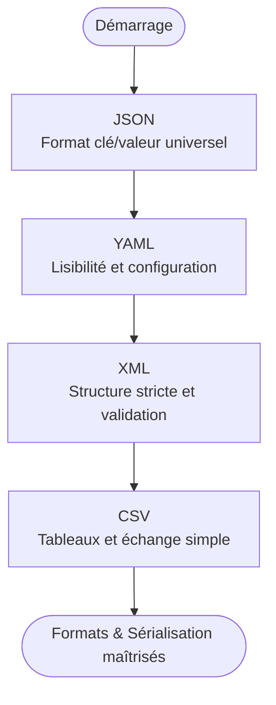

# Formats & Sérialisation

!!! quote "Analogie"
    _Deux personnes qui ne parlent pas la même langue ont besoin d'un traducteur commun pour se comprendre. En informatique, les formats de données jouent ce rôle : ils définissent une langue commune que tous les programmes, services et systèmes peuvent lire et écrire — indépendamment du langage dans lequel ils sont écrits._

Les formats de données sont des **structures normalisées**[^1] permettant de représenter, stocker et échanger de l'information entre programmes, services et systèmes. Ils jouent un rôle fondamental dans le développement moderne en définissant comment les données sont organisées, hiérarchisées et manipulées.

Cette section présente les quatre formats essentiels utilisés quotidiennement par les développeurs, administrateurs systèmes et ingénieurs : **JSON**, **YAML**, **XML** et **CSV**.

!!! note "Comment lire cette section"
    Les formats présentés partagent des concepts communs, mais servent des usages différents. Trois grandes familles :

    - **Formats hiérarchiques** — JSON, YAML, XML — idéaux pour représenter des structures complexes et imbriquées
    - **Formats tabulaires** — CSV — conçu pour manipuler des données organisées en lignes et colonnes
    - **Formats de configuration** — YAML et JSON — omniprésents dans les outils DevOps, CI/CD et l'orchestration de services

 

---

## Les quatre formats

- ### :lucide-file-json: JSON
    ---
    Format léger, lisible et structuré, dominant dans les **API REST**, les **applications web** et la **sérialisation de données**. Repose sur une structure clé/valeur simple, manipulable nativement dans la plupart des langages.

    [Voir la fiche JSON](./json.md)

- ### :lucide-file-cog: YAML
    ---
    Connu pour sa lisibilité et sa syntaxe épurée, largement utilisé dans les **outils DevOps**, **CI/CD**, **Kubernetes**, **Ansible** et toute application nécessitant des fichiers de configuration lisibles par des humains.

    [Voir la fiche YAML](./yaml.md)

- ### :lucide-file-code: XML
    ---
    Format structuré, robuste et extensible. Très présent dans les **systèmes d'entreprise**, les **normes industrielles** et les services exigeant des schémas de validation stricts. Reste courant dans les environnements hérités.

    [Voir la fiche XML](./xml.md)

- ### :lucide-table: CSV
    ---
    Format tabulaire simple et universel, idéal pour l'échange de données entre outils, feuilles de calcul, scripts et bases relationnelles. La valeur par défaut pour tout ce qui est tabulaire.

    [Voir la fiche CSV](./csv.md)

 

---

## Progression recommandée

La séquence proposée va des formats les plus structurés vers le plus simple, en suivant la logique de complexité décroissante et d'usages complémentaires.

<em>La progression suit l'ordre naturel : <strong>hiérarchique → déclaratif → structuré → tabulaire</strong>.</em>

 

---

## Rôle dans l'écosystème global

Ces formats jouent un rôle transversal dans tous les domaines de l'informatique. Les maîtriser est indispensable pour travailler avec les **requêtes API** (REST, GraphQL), les **configurations DevOps** (Docker, Kubernetes, Ansible, CI/CD), les **systèmes distribués**[^2] et **microservices**[^3], les **bases de données**, les **formats d'échange entre langages** et les **outils d'analyse de données**.

!!! note "Sans la compréhension de ces formats, travailler avec des services, des outils et des environnements hétérogènes devient une source permanente d'erreurs difficiles à diagnostiquer."

**Point d'entrée recommandé : [JSON](./json.md)**

 

---

## Conclusion

!!! quote "Conclusion"
    _Ces formats sont omniprésents — dans les APIs que l'on interroge, les pipelines que l'on configure, les données que l'on analyse. Les comprendre n'est pas optionnel : c'est ce qui permet de travailler avec n'importe quel outil, service ou environnement sans devoir repartir de zéro à chaque fois._

 

[^1]: **Format normalisé** — manière de représenter des données selon un ensemble de règles officielles et uniformes, garantissant qu'elles seront comprises et traitées correctement par n'importe quel système conforme à la même norme.
[^2]: **Système distribué** — ensemble de machines ou de services autonomes qui collaborent comme un tout cohérent pour exécuter une tâche, tout en étant physiquement séparés et connectés par un réseau.
[^3]: **Microservice** — service logiciel autonome, spécialisé dans une fonction précise, déployé indépendamment et communiquant avec les autres via des APIs légères afin de construire un système modulaire, scalable et résilient.