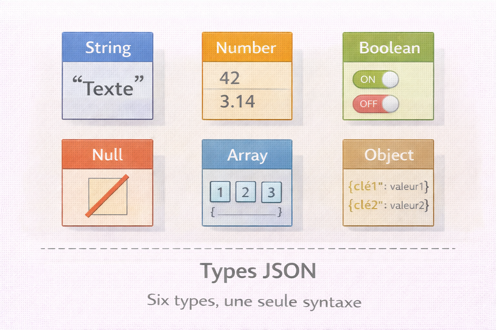
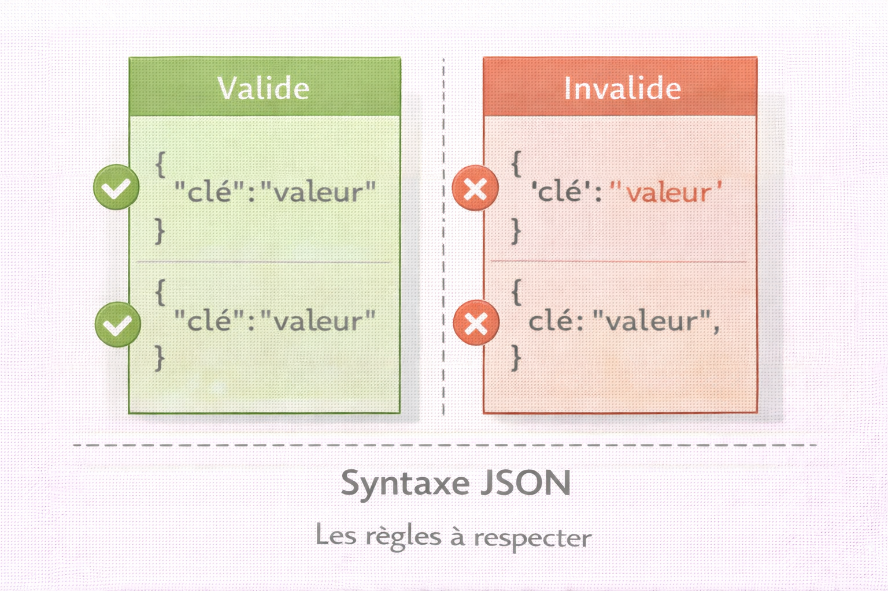
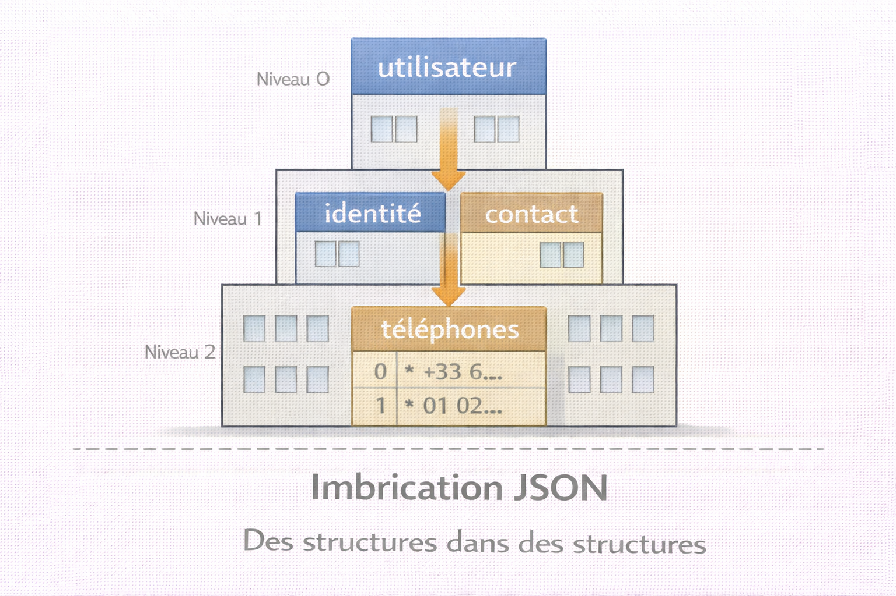

# JSON — JavaScript Object Notation

<div
  class="omny-meta"
  data-level="🟢 Débutant & 🟡 Intermédiaire"
  data-version="1.1"
  data-time="50-55 minutes">
</div>

!!! quote "Analogie"
    _Un carnet d'adresses organisé où chaque personne possède non seulement un nom et un numéro, mais aussi une adresse complète, plusieurs téléphones et des contacts d'urgence qui ont eux-mêmes la même structure. JSON fonctionne exactement ainsi : un format qui représente des données hiérarchiques et complexes de manière lisible par les humains tout en restant facile à parser pour les machines._

**JSON (JavaScript Object Notation)** est un format de données textuelles léger et structuré, utilisé pour représenter des objets, tableaux et valeurs primitives. Bien qu'initialement dérivé de JavaScript, JSON est devenu un **standard universel** pour l'échange de données entre applications, indépendamment du langage de programmation utilisé.

JSON a supplanté XML comme format privilégié pour les **APIs REST**, les **fichiers de configuration**, les **bases de données NoSQL** et la **communication client-serveur**. Sa syntaxe simple et sa capacité à représenter des structures complexes en font le choix standard pour tout échange de données moderne.

!!! info "Pourquoi c'est important"
    JSON est omniprésent : APIs REST, configuration d'applications (`package.json`, `composer.json`), stockage NoSQL (MongoDB, CouchDB), logs structurés, webhooks, réponses serveur. C'est le format de communication web moderne par défaut.

<br />

---

## Structure JSON

### Les six types de données

!!! note "L'image ci-dessous présente les six types JSON avant d'entrer dans les détails syntaxiques. Avoir une vue d'ensemble des types disponibles aide à comprendre ce que JSON peut — et ne peut pas — représenter nativement."



<p><em>JSON ne dispose que de six types. Tout ce qu'un programme échange via JSON doit pouvoir s'exprimer avec ces six briques — pas de date native, pas de type binaire, pas d'entier distinct du décimal.</em></p>

**String** — chaîne de caractères entre guillemets doubles.

```json title="JSON — type String"
{
  "nom": "Alice Dupont",
  "description": "Administrateur système"
}
```

**Number** — entiers, décimaux et notation scientifique. Un seul type couvre tout.

```json title="JSON — type Number"
{
  "age": 28,
  "score": 95.5,
  "temperature": -15.3,
  "scientifique": 1.5e+10
}
```

!!! info "JSON ne distingue pas entiers et décimaux"
    Contrairement à la plupart des langages, JSON a un seul type Number qui englobe entiers, décimaux et notation scientifique.

**Boolean** — uniquement `true` ou `false`, en minuscules.

```json title="JSON — type Boolean"
{
  "actif": true,
  "admin": false
}
```

**Null** — absence explicite de valeur.

```json title="JSON — type Null"
{
  "middle_name": null,
  "deleted_at": null
}
```

**Array** — liste ordonnée de valeurs, potentiellement de types mixtes.

```json title="JSON — type Array"
{
  "roles": ["admin", "user", "moderator"],
  "scores": [98, 87, 92, 100],
  "mixte": [1, "texte", true, null]
}
```

**Object** — collection de paires clé/valeur. Les clés sont toujours des strings.

```json title="JSON — type Object"
{
  "utilisateur": {
    "nom": "Dupont",
    "prenom": "Alice",
    "contact": {
      "email": "alice@example.com",
      "telephone": "+33612345678"
    }
  }
}
```

**Exemple combinant tous les types :**

```json title="JSON — exemple complet multi-types"
{
  "nom": "Alice",
  "age": 28,
  "actif": true,
  "middle_name": null,
  "roles": ["admin", "user"],
  "contact": {
    "email": "alice@example.com"
  }
}
```

<br />

---

### Règles syntaxiques

!!! note "L'image ci-dessous présente les règles valides et invalides côte à côte. Les erreurs de syntaxe JSON sont silencieuses dans certains parsers — connaître les règles avant d'écrire évite des heures de débogage."



<p><em>JSON est strict. Une virgule finale, des guillemets simples ou une clé sans guillemets rendent l'intégralité du document invalide. Aucun parser conforme n'accepte ces erreurs.</em></p>

| Règle | Valide | Invalide |
|---|---|---|
| Clés et strings | `"nom": "Alice"` | `'nom': 'Alice'` |
| Virgule finale | `{"a": 1, "b": 2}` | `{"a": 1, "b": 2,}` |
| Commentaires | — | `// commentaire` |
| Encodage | UTF-8 | Latin-1 |
| Boolean/Null | `true`, `false`, `null` | `True`, `False`, `None` |

<br />

---

### Imbrication complexe

!!! note "L'image ci-dessous matérialise la hiérarchie d'un objet JSON imbriqué. Avant de lire l'exemple, visualiser les niveaux d'imbrication comme des étages aide à comprendre comment naviguer dans la structure."



<p><em>Chaque niveau d'imbrication est un objet ou un tableau contenu dans le niveau supérieur. Accéder à un téléphone mobile nécessite de traverser trois niveaux : utilisateur → contact → téléphones[0]. Plus l'imbrication est profonde, plus le chemin d'accès est long.</em></p>

```json title="JSON — imbrication complexe"
{
  "utilisateur": {
    "id": 1234,
    "identite": {
      "nom": "Dupont",
      "prenom": "Alice",
      "date_naissance": "1997-03-15"
    },
    "contact": {
      "email": "alice@example.com",
      "telephones": [
        {
          "type": "mobile",
          "numero": "+33612345678"
        },
        {
          "type": "fixe",
          "numero": "+33145678901"
        }
      ]
    },
    "permissions": {
      "lecture": true,
      "ecriture": true,
      "admin": false
    }
  }
}
```

<br />

---

## Manipulation JSON par langage

### Opérations fondamentales

=== ":fontawesome-brands-python: Python"

    ```python title="Python — lecture et écriture JSON"
    import json

    # Lecture depuis fichier
    with open('config.json', 'r', encoding='utf-8') as f:
        donnees = json.load(f)

    # Lecture depuis string
    json_string = '{"nom": "Alice", "age": 28, "actif": true}'
    donnees = json.loads(json_string)

    # Navigation imbriquée
    print(donnees['nom'])                    # Alice
    print(donnees.get('adresse', {}).get('ville', 'N/A'))

    # Écriture vers fichier
    utilisateur = {
        "id": 1234,
        "nom": "Dupont",
        "roles": ["admin", "user"],
        "actif": True
    }

    with open('utilisateur.json', 'w', encoding='utf-8') as f:
        json.dump(utilisateur, f, indent=2, ensure_ascii=False)

    # Conversion en string
    json_string = json.dumps(utilisateur, indent=2, ensure_ascii=False)
    ```

=== ":fontawesome-brands-js: JavaScript"

    ```javascript title="JavaScript — lecture et écriture JSON"
    const fs = require('fs').promises;

    // Lecture depuis fichier (async)
    async function lireConfig() {
        const data = await fs.readFile('config.json', 'utf8');
        return JSON.parse(data);
    }

    // Lecture depuis string
    const jsonString = '{"nom": "Alice", "age": 28, "actif": true}';
    const donnees = JSON.parse(jsonString);
    console.log(donnees.nom);  // Alice

    // Écriture vers fichier
    const utilisateur = {
        id: 1234,
        nom: 'Dupont',
        roles: ['admin', 'user'],
        actif: true
    };

    async function sauvegarder() {
        const jsonString = JSON.stringify(utilisateur, null, 2);
        await fs.writeFile('utilisateur.json', jsonString, 'utf8');
    }

    sauvegarder();
    ```

=== ":fontawesome-brands-php: PHP"

    ```php title="PHP — lecture et écriture JSON"
    <?php
    // Lecture depuis fichier
    $json    = file_get_contents('config.json');
    $donnees = json_decode($json, true);  // true = tableau associatif

    if (json_last_error() !== JSON_ERROR_NONE) {
        die("Erreur JSON : " . json_last_error_msg() . "\n");
    }

    echo $donnees['nom'];  // Alice

    // Écriture vers fichier
    $utilisateur = [
        'id'    => 1234,
        'nom'   => 'Dupont',
        'roles' => ['admin', 'user'],
        'actif' => true
    ];

    $json = json_encode($utilisateur, JSON_PRETTY_PRINT | JSON_UNESCAPED_UNICODE);
    file_put_contents('utilisateur.json', $json);
    ?>
    ```

=== ":fontawesome-brands-golang: Go"

    ```go title="Go — lecture et écriture JSON"
    package main

    import (
        "encoding/json"
        "fmt"
        "os"
    )

    type Config struct {
        Nom   string   `json:"nom"`
        Age   int      `json:"age"`
        Actif bool     `json:"actif"`
        Roles []string `json:"roles"`
    }

    func main() {
        // Lecture depuis fichier
        data, err := os.ReadFile("config.json")
        if err != nil {
            panic(err)
        }

        var config Config
        if err := json.Unmarshal(data, &config); err != nil {
            panic(err)
        }

        fmt.Printf("Nom: %s\n", config.Nom)

        // Écriture vers fichier
        utilisateur := Config{
            Nom:   "Dupont",
            Age:   28,
            Actif: true,
            Roles: []string{"admin", "user"},
        }

        jsonData, _ := json.MarshalIndent(utilisateur, "", "  ")
        os.WriteFile("utilisateur.json", jsonData, 0644)
    }
    ```

### Analyse de logs firewall

=== ":fontawesome-brands-python: Python"

    ```python title="Python — analyse logs firewall"
    import json
    from collections import defaultdict

    def analyser_logs_firewall(fichier_json):
        with open(fichier_json, 'r', encoding='utf-8') as f:
            data = json.load(f)

        actions      = defaultdict(int)
        ips_bloquees = defaultdict(int)
        pays_sources = defaultdict(int)

        for event in data['events']:
            actions[event['action']] += 1

            if event['action'] == 'BLOCK':
                ips_bloquees[event['source']['ip']] += 1
                pays_sources[event['source']['country']] += 1

        print(f"Total événements : {len(data['events'])}")

        for action, count in actions.items():
            print(f"  {action} : {count}")

        print("Top 5 IPs bloquées :")
        for ip, count in sorted(ips_bloquees.items(), key=lambda x: x[1], reverse=True)[:5]:
            print(f"  {ip} : {count} blocages")

    analyser_logs_firewall('firewall_logs.json')
    ```

=== ":fontawesome-brands-golang: Go"

    ```go title="Go — analyse logs firewall"
    package main

    import (
        "encoding/json"
        "fmt"
        "os"
        "sort"
    )

    type FirewallLogs struct {
        Events []Event `json:"events"`
    }

    type Event struct {
        Action string      `json:"action"`
        Source NetworkInfo `json:"source"`
    }

    type NetworkInfo struct {
        IP      string `json:"ip"`
        Country string `json:"country"`
    }

    func main() {
        data, _ := os.ReadFile("firewall_logs.json")

        var logs FirewallLogs
        json.Unmarshal(data, &logs)

        actions     := make(map[string]int)
        ipsBloquees := make(map[string]int)

        for _, event := range logs.Events {
            actions[event.Action]++
            if event.Action == "BLOCK" {
                ipsBloquees[event.Source.IP]++
            }
        }

        fmt.Printf("Total événements : %d\n", len(logs.Events))
        for action, count := range actions {
            fmt.Printf("  %s : %d\n", action, count)
        }

        // Tri par nombre de blocages décroissant
        type kv struct{ K string; V int }
        var sorted []kv
        for k, v := range ipsBloquees {
            sorted = append(sorted, kv{k, v})
        }
        sort.Slice(sorted, func(i, j int) bool { return sorted[i].V > sorted[j].V })

        fmt.Println("Top 5 IPs bloquées :")
        for i, kv := range sorted {
            if i >= 5 { break }
            fmt.Printf("  %s : %d blocages\n", kv.K, kv.V)
        }
    }
    ```

### Filtrage de vulnérabilités critiques

=== ":fontawesome-brands-python: Python"

    ```python title="Python — filtrage vulnérabilités CRITICAL/HIGH"
    import json

    def extraire_vulns_critiques(input_file, output_file):
        with open(input_file, 'r', encoding='utf-8') as f:
            scan = json.load(f)

        # Filtrer par sévérité
        critiques = [
            vuln for vuln in scan['vulnerabilities']
            if vuln['vulnerability']['severity'] in ['CRITICAL', 'HIGH']
        ]

        rapport = {
            "scan_id":                   scan['scan_id'],
            "timestamp":                 scan['timestamp'],
            "vulnerabilities_critiques": critiques,
            "count":                     len(critiques)
        }

        with open(output_file, 'w', encoding='utf-8') as f:
            json.dump(rapport, f, indent=2, ensure_ascii=False)

        print(f"{len(critiques)} vulnérabilités critiques extraites")

    extraire_vulns_critiques('scan.json', 'critiques.json')
    ```

=== ":fontawesome-brands-golang: Go"

    ```go title="Go — filtrage vulnérabilités CRITICAL/HIGH"
    package main

    import (
        "encoding/json"
        "fmt"
        "os"
    )

    type ScanResult struct {
        ScanID          string          `json:"scan_id"`
        Timestamp       string          `json:"timestamp"`
        Vulnerabilities []Vulnerability `json:"vulnerabilities"`
    }

    type Vulnerability struct {
        Host        string      `json:"host"`
        Port        int         `json:"port"`
        Service     string      `json:"service"`
        VulnDetails VulnDetails `json:"vulnerability"`
    }

    type VulnDetails struct {
        Name     string   `json:"name"`
        Severity string   `json:"severity"`
        CVSS     float64  `json:"cvss_score"`
        CVE      []string `json:"cve"`
    }

    type Rapport struct {
        ScanID    string          `json:"scan_id"`
        Timestamp string          `json:"timestamp"`
        Critiques []Vulnerability `json:"vulnerabilities_critiques"`
        Count     int             `json:"count"`
    }

    func main() {
        data, _ := os.ReadFile("scan.json")

        var scan ScanResult
        json.Unmarshal(data, &scan)

        var critiques []Vulnerability
        for _, vuln := range scan.Vulnerabilities {
            sev := vuln.VulnDetails.Severity
            if sev == "CRITICAL" || sev == "HIGH" {
                critiques = append(critiques, vuln)
            }
        }

        rapport := Rapport{
            ScanID:    scan.ScanID,
            Timestamp: scan.Timestamp,
            Critiques: critiques,
            Count:     len(critiques),
        }

        jsonData, _ := json.MarshalIndent(rapport, "", "  ")
        os.WriteFile("critiques.json", jsonData, 0644)

        fmt.Printf("%d vulnérabilités critiques extraites\n", len(critiques))
    }
    ```

### Requête API threat intelligence

=== ":fontawesome-brands-python: Python"

    ```python title="Python — requête API threat intelligence"
    import requests

    def interroger_threat_intel(ip_address):
        api_url = f"https://api.threatintel.example/v1/ip/{ip_address}"
        headers = {
            "Authorization": "Bearer YOUR_API_KEY",
            "Content-Type":  "application/json"
        }

        response = requests.get(api_url, headers=headers)

        if response.status_code == 200:
            data   = response.json()
            result = data['result']

            print(f"Analyse de {ip_address}")
            print(f"Score de menace : {result['threat_score']}/100")
            print(f"Classification  : {result['classification']}")
            print(f"Catégories      : {', '.join(result['categories'])}")

            for bl in result['reputation']['blacklists']:
                if bl['listed']:
                    print(f"Listée sur {bl['name']}")
        else:
            print(f"Erreur API : {response.status_code}")

    interroger_threat_intel("203.0.113.50")
    ```

=== ":fontawesome-brands-golang: Go"

    ```go title="Go — requête API threat intelligence"
    package main

    import (
        "encoding/json"
        "fmt"
        "io"
        "net/http"
    )

    type ThreatResponse struct {
        Result struct {
            ThreatScore    int      `json:"threat_score"`
            Classification string   `json:"classification"`
            Categories     []string `json:"categories"`
            Reputation     struct {
                Blacklists []struct {
                    Name   string `json:"name"`
                    Listed bool   `json:"listed"`
                } `json:"blacklists"`
            } `json:"reputation"`
        } `json:"result"`
    }

    func interrogerThreatIntel(ipAddress string) {
        apiURL := fmt.Sprintf("https://api.threatintel.example/v1/ip/%s", ipAddress)

        req, _ := http.NewRequest("GET", apiURL, nil)
        req.Header.Set("Authorization", "Bearer YOUR_API_KEY")
        req.Header.Set("Content-Type", "application/json")

        resp, err := http.DefaultClient.Do(req)
        if err != nil {
            fmt.Printf("Erreur : %v\n", err)
            return
        }
        defer resp.Body.Close()

        body, _ := io.ReadAll(resp.Body)

        var data ThreatResponse
        json.Unmarshal(body, &data)

        r := data.Result
        fmt.Printf("Analyse de %s\n", ipAddress)
        fmt.Printf("Score de menace : %d/100\n", r.ThreatScore)
        fmt.Printf("Classification  : %s\n", r.Classification)

        for _, bl := range r.Reputation.Blacklists {
            if bl.Listed {
                fmt.Printf("Listée sur %s\n", bl.Name)
            }
        }
    }

    func main() {
        interrogerThreatIntel("203.0.113.50")
    }
    ```

<br />

---

## Bonnes pratiques

### Validation de schéma

```json title="JSON Schema — validation d'un objet utilisateur"
{
  "$schema": "http://json-schema.org/draft-07/schema#",
  "type": "object",
  "required": ["nom", "prenom", "email"],
  "properties": {
    "nom": {
      "type": "string",
      "minLength": 1,
      "maxLength": 100
    },
    "email": {
      "type": "string",
      "format": "email"
    },
    "age": {
      "type": "integer",
      "minimum": 18,
      "maximum": 120
    },
    "roles": {
      "type": "array",
      "items": {
        "type": "string",
        "enum": ["admin", "user", "moderator"]
      },
      "minItems": 1,
      "uniqueItems": true
    }
  }
}
```

### Sécurité

!!! danger "Risques de sécurité JSON"
    Quatre vecteurs d'attaque à anticiper systématiquement.

    1. **Injection JSON** — valider toutes les entrées utilisateur avant de les intégrer dans un payload.
    2. **Désérialisation dangereuse** — ne jamais utiliser `eval()` en JavaScript pour parser du JSON.
    3. **Exposition de données sensibles** — ne jamais inclure de secrets, tokens ou mots de passe dans un JSON transmis.
    4. **DoS via JSON profond** — limiter la taille et la profondeur des payloads acceptés côté serveur.

```javascript title="JavaScript — parse sécurisé vs eval dangereux"
// Ne JAMAIS faire cela — eval exécute tout contenu
const donnees = eval('(' + userInput + ')');

// Toujours utiliser JSON.parse — parse uniquement des données
const donnees = JSON.parse(userInput);
```

### Gestion des erreurs

!!! warning "Toujours valider après parse"
    Vérifier les erreurs de parsing avant d'utiliser les données. Valider les types attendus — ne pas supposer qu'une clé existe. Gérer les valeurs `null` explicitement. Utiliser des valeurs par défaut pour les champs optionnels.

### Performance — streaming pour gros volumes

=== ":fontawesome-brands-python: Python"

    ```python title="Python — streaming JSON avec ijson"
    import ijson

    # Parser un fichier volumineux sans tout charger en mémoire
    with open('huge_file.json', 'rb') as f:
        parser = ijson.items(f, 'vulnerabilities.item')

        for vuln in parser:
            if vuln['vulnerability']['severity'] == 'CRITICAL':
                print(f"CRITICAL : {vuln['host']}")
    ```

=== ":fontawesome-brands-golang: Go"

    ```go title="Go — streaming JSON avec json.Decoder"
    package main

    import (
        "encoding/json"
        "fmt"
        "os"
    )

    type VulnEntry struct {
        Host        string `json:"host"`
        VulnDetails struct {
            Severity string `json:"severity"`
        } `json:"vulnerability"`
    }

    func main() {
        f, _ := os.Open("huge_file.json")
        defer f.Close()

        // json.Decoder lit le flux sans charger tout le fichier
        decoder := json.NewDecoder(f)

        // Avancer jusqu'au tableau "vulnerabilities"
        for {
            token, err := decoder.Token()
            if err != nil { break }
            if token == "vulnerabilities" { break }
        }

        // Lire élément par élément
        for decoder.More() {
            var vuln VulnEntry
            decoder.Decode(&vuln)

            if vuln.VulnDetails.Severity == "CRITICAL" {
                fmt.Printf("CRITICAL : %s\n", vuln.Host)
            }
        }
    }
    ```

<br />

---

## Conclusion

!!! quote "Conclusion"
    _JSON est devenu le langage universel de l'échange de données sur le web moderne. Sa syntaxe simple cache une puissance réelle pour représenter des structures complexes de manière lisible et interopérable. Comprendre ses six types, ses règles strictes et ses limites — pas de commentaires, pas de dates natives, pas de types binaires — c'est comprendre pourquoi il est partout et comment l'utiliser sans se faire piéger._

<br />