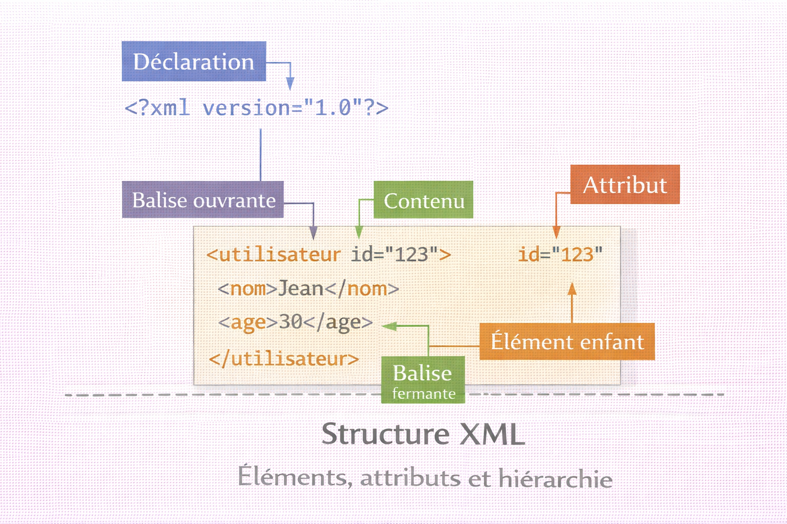
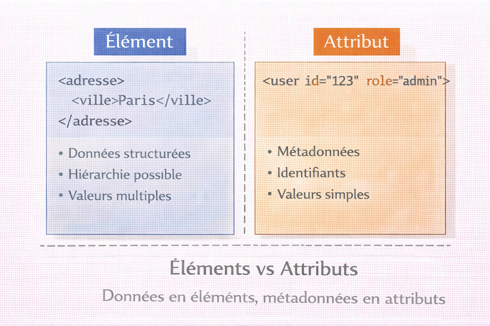
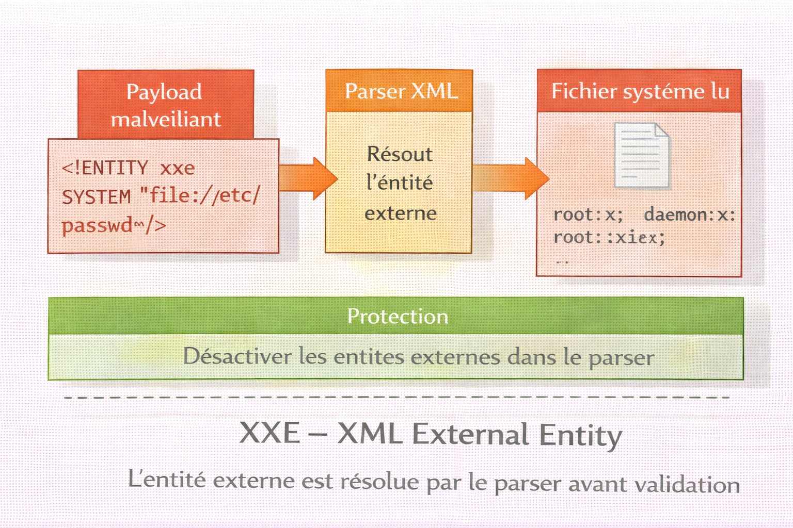

# XML — eXtensible Markup Language

<div
  class="omny-meta"
  data-level="🟢 Débutant & 🟡 Intermédiaire"
  data-version="1.1"
  data-time="50-55 minutes">
</div>

!!! quote "Analogie"
    _Un système de classement de bibliothèque où chaque livre est dans une catégorie, chaque catégorie dans une section, chaque section dans un étage, avec des étiquettes explicites à chaque niveau. XML fonctionne exactement ainsi : chaque élément a une balise d'ouverture (`<livre>`) et une balise de fermeture (`</livre>`), créant une structure hiérarchique claire et auto-descriptive où chaque donnée porte son propre nom._

**XML (eXtensible Markup Language)** est un format de données textuelles créé pour représenter des informations structurées de manière hiérarchique et extensible. Contrairement à HTML qui est conçu pour afficher du contenu, XML est conçu pour **stocker et transporter des données** avec une structure stricte et validable.

XML a dominé l'échange de données dans les années 2000-2010, notamment avec **SOAP**, **RSS**, **SVG** et les **fichiers de configuration** (Maven, Spring, Ant). Bien que JSON l'ait supplanté pour les APIs REST, XML reste essentiel pour les **systèmes legacy**, les **protocoles bancaires et financiers**, les **standards industriels** (HL7 médical, XBRL finance) et certains **formats de documents** (Office Open XML, SVG).

!!! info "Pourquoi c'est important"
    XML est omniprésent dans les systèmes legacy, les services SOAP, les fichiers de configuration Java/Spring, les formats Office (docx, xlsx), les flux RSS/Atom, SVG, et constitue un standard dans la finance, la santé et l'administration publique.

<br />

---

## Structure XML

### Syntaxe de base

!!! note "L'image ci-dessous décompose la structure d'un document XML en zones annotées. Identifier visuellement la déclaration, les éléments, les attributs et la hiérarchie avant de lire les exemples de code évite de confondre ces trois niveaux lors de la manipulation programmatique."



<p><em>Un document XML est composé d'une déclaration optionnelle en tête, d'un unique élément racine qui contient tous les autres, et d'éléments enfants portant les données. Les attributs sont des métadonnées placées dans la balise ouvrante — ils ne remplacent pas les éléments pour les données structurées.</em></p>

```xml title="XML — document simple"
<?xml version="1.0" encoding="UTF-8"?>
<utilisateur>
    <nom>Dupont</nom>
    <prenom>Alice</prenom>
    <age>28</age>
    <actif>true</actif>
</utilisateur>
```

**Règles syntaxiques strictes :**

Un seul élément racine — tout document XML doit avoir un unique élément englobant. Toutes les balises doivent être fermées — chaque `<ouverture>` requiert son `</fermeture>`. XML est sensible à la casse — `<Nom>` et `<nom>` sont deux éléments distincts. L'imbrication doit être correcte — `<a><b></b></a>` est valide, `<a><b></a></b>` ne l'est pas. Les caractères spéciaux (`<`, `>`, `&`, `"`, `'`) doivent être échappés via leurs entités.

### Déclaration XML

```xml title="XML — déclaration de document"
<?xml version="1.0" encoding="UTF-8" standalone="yes"?>
```

`version` désigne la version XML utilisée — toujours `1.0` ou `1.1`. `encoding` précise l'encodage des caractères — `UTF-8` est recommandé. `standalone` indique si le document est autonome (`yes`) ou dépend d'une DTD externe (`no`).

### Éléments et attributs

```xml title="XML — éléments et attributs"
<!-- Élément avec contenu textuel -->
<nom>Alice</nom>

<!-- Élément vide auto-fermant -->
<br/>
<image src="photo.jpg"/>

<!-- Élément avec sous-éléments -->
<adresse>
    <rue>12 rue des Fleurs</rue>
    <ville>Paris</ville>
    <code_postal>75001</code_postal>
</adresse>

<!-- Attributs dans la balise ouvrante -->
<utilisateur id="1234" actif="true" role="admin">
    <nom>Alice</nom>
</utilisateur>
```

!!! note "L'image ci-dessous oppose visuellement les deux approches de structuration des données en XML. La frontière entre données et métadonnées est l'une des décisions de conception les plus fréquentes lors de la création d'un schéma XML."



<p><em>Les données qui ont une structure propre, des valeurs multiples ou qui pourraient évoluer appartiennent aux éléments. Les métadonnées identifiant un nœud ou qualifiant sa nature — comme un identifiant technique ou un type — appartiennent aux attributs. Un attribut ne peut pas contenir de sous-éléments et ne peut apparaître qu'une seule fois par balise.</em></p>

| Critère | Élément | Attribut |
|---|---|---|
| Données structurées | Recommandé — hiérarchie possible | Non adapté |
| Métadonnées | Possible | Recommandé |
| Valeurs multiples | Plusieurs éléments du même nom | Un seul attribut par nom |
| Lisibilité | Plus clair pour données complexes | Compact pour métadonnées simples |

<br />

---

### Espaces de noms (Namespaces)

Les namespaces évitent les conflits entre éléments de même nom provenant de sources différentes — indispensable dès que plusieurs schémas XML coexistent dans un même document.

```xml title="XML — namespaces et préfixes"
<?xml version="1.0" encoding="UTF-8"?>
<root xmlns:sec="http://example.com/security"
      xmlns:usr="http://example.com/user">

    <sec:policy id="pol-001">
        <sec:rule>Block SSH from external</sec:rule>
    </sec:policy>

    <usr:user id="123">
        <usr:name>Alice</usr:name>
    </usr:user>
</root>
```

```xml title="XML — namespace par défaut"
<root xmlns="http://example.com/default">
    <!-- Tous les éléments sans préfixe utilisent ce namespace -->
    <element>Contenu</element>
</root>
```

<br />

---

### Commentaires et CDATA

```xml title="XML — commentaires"
<!-- Commentaire sur une ligne -->

<!--
    Commentaire multiligne
    pour expliquer la structure
-->

<nom>Alice</nom> <!-- Commentaire en fin de ligne -->
```

**CDATA** permet d'inclure du texte contenant des caractères spéciaux sans échappement — utile pour intégrer du code source ou des requêtes SQL directement dans un document XML.

```xml title="XML — section CDATA"
<script>
    <![CDATA[
        if (x < 10 && y > 5) {
            alert("Condition met!");
        }
    ]]>
</script>

<requete>
    <![CDATA[
        SELECT * FROM users WHERE age > 18 AND role = 'admin';
    ]]>
</requete>
```

<br />

---

### Caractères spéciaux et entités

| Caractère | Entité XML | Usage |
|:---:|:---:|---|
| `<` | `&lt;` | Balise ouvrante dans le texte |
| `>` | `&gt;` | Balise fermante dans le texte |
| `&` | `&amp;` | Esperluette |
| `"` | `&quot;` | Guillemet double dans un attribut |
| `'` | `&apos;` | Apostrophe dans un attribut |

```xml title="XML — échappement des entités"
<message>
    Condition: x &lt; 10 &amp;&amp; y &gt; 5
</message>

<citation>
    Il a dit &quot;Bonjour&quot; et c&apos;est tout.
</citation>
```

<br />

---

## Manipulation XML par langage

### Opérations fondamentales

=== ":fontawesome-brands-python: Python"

    ```python title="Python — lecture et écriture XML"
    import xml.etree.ElementTree as ET
    from xml.dom import minidom

    # Lecture depuis fichier
    tree = ET.parse('config.xml')
    root = tree.getroot()

    print(f"Racine: {root.tag}")

    # Accès direct par chemin
    nom = root.find('nom').text
    age = root.find('age').text
    print(f"{nom}, {age} ans")

    # Accès aux attributs
    utilisateur = root.find('utilisateur')
    if utilisateur is not None:
        user_id = utilisateur.get('id')
        print(f"ID: {user_id}")

    # Parcourir les enfants
    for child in root:
        print(f"  {child.tag}: {child.text}")

    # Écriture vers fichier
    root_out = ET.Element('configuration')

    database = ET.SubElement(root_out, 'database')
    ET.SubElement(database, 'host').text = 'localhost'
    ET.SubElement(database, 'port').text = '5432'
    ET.SubElement(database, 'name').text = 'mydb'

    server = ET.SubElement(root_out, 'server', attrib={'ssl': 'true', 'timeout': '30'})
    ET.SubElement(server, 'address').text = '192.168.1.100'

    # Formater avec indentation
    xml_str = minidom.parseString(ET.tostring(root_out)).toprettyxml(indent="    ")

    with open('output.xml', 'w', encoding='utf-8') as f:
        f.write(xml_str)
    ```

=== ":fontawesome-brands-js: JavaScript"

    ```javascript title="JavaScript — lecture et écriture XML"
    // Installation : npm install xml2js
    const fs     = require('fs');
    const xml2js = require('xml2js');

    // Lecture depuis fichier
    async function lireXml(fichier) {
        const xmlString = fs.readFileSync(fichier, 'utf8');
        const parser    = new xml2js.Parser();
        const result    = await parser.parseStringPromise(xmlString);

        const utilisateur = result.utilisateur;
        console.log(`Nom: ${utilisateur.nom[0]}`);
        console.log(`Age: ${utilisateur.age[0]}`);

        // Attributs accessibles via $
        if (utilisateur.$) {
            console.log(`ID: ${utilisateur.$.id}`);
        }
    }

    // Écriture vers fichier
    const builder = new xml2js.Builder({
        xmldec:     { version: '1.0', encoding: 'UTF-8' },
        renderOpts: { pretty: true, indent: '    ' }
    });

    const config = {
        configuration: {
            database: { host: 'localhost', port: 5432, name: 'mydb' },
            server:   { $: { ssl: 'true', timeout: '30' }, address: '192.168.1.100' }
        }
    };

    const xml = builder.buildObject(config);
    fs.writeFileSync('output.xml', xml, 'utf8');

    lireXml('config.xml');
    ```

=== ":fontawesome-brands-php: PHP"

    ```php title="PHP — lecture et écriture XML"
    <?php
    // Lecture avec SimpleXML
    $xml = simplexml_load_file('config.xml');

    echo "Nom: " . $xml->nom . "\n";
    echo "Age: " . $xml->age . "\n";

    // Attributs
    $id = (string)$xml['id'];
    echo "ID: $id\n";

    // Parcourir les enfants
    foreach ($xml->children() as $child) {
        echo "{$child->getName()}: {$child}\n";
    }

    // Écriture avec DOMDocument
    $dom = new DOMDocument('1.0', 'UTF-8');
    $dom->formatOutput = true;

    $root     = $dom->createElement('configuration');
    $dom->appendChild($root);

    $database = $dom->createElement('database');
    $root->appendChild($database);
    $database->appendChild($dom->createElement('host', 'localhost'));
    $database->appendChild($dom->createElement('port', '5432'));

    $server = $dom->createElement('server');
    $server->setAttribute('ssl', 'true');
    $server->setAttribute('timeout', '30');
    $root->appendChild($server);
    $server->appendChild($dom->createElement('address', '192.168.1.100'));

    $dom->save('output.xml');
    ?>
    ```

=== ":fontawesome-brands-golang: Go"

    ```go title="Go — lecture et écriture XML"
    package main

    import (
        "encoding/xml"
        "fmt"
        "os"
    )

    type Configuration struct {
        XMLName xml.Name `xml:"configuration"`
        Nom     string   `xml:"nom"`
        Prenom  string   `xml:"prenom"`
        Age     int      `xml:"age"`
        Actif   bool     `xml:"actif"`
    }

    type Config struct {
        XMLName  xml.Name `xml:"configuration"`
        Database Database `xml:"database"`
        Server   Server   `xml:"server"`
    }

    type Database struct {
        Host string `xml:"host"`
        Port int    `xml:"port"`
        Name string `xml:"name"`
    }

    type Server struct {
        SSL     string `xml:"ssl,attr"`
        Timeout string `xml:"timeout,attr"`
        Address string `xml:"address"`
    }

    func main() {
        // Lecture depuis fichier
        data, err := os.ReadFile("config.xml")
        if err != nil {
            panic(err)
        }

        var config Configuration
        if err := xml.Unmarshal(data, &config); err != nil {
            panic(err)
        }

        fmt.Printf("Nom: %s\n", config.Nom)
        fmt.Printf("Age: %d\n", config.Age)

        // Écriture vers fichier
        output := Config{
            Database: Database{Host: "localhost", Port: 5432, Name: "mydb"},
            Server:   Server{SSL: "true", Timeout: "30", Address: "192.168.1.100"},
        }

        xmlData, _ := xml.MarshalIndent(output, "", "    ")
        xmlStr := xml.Header + string(xmlData)
        os.WriteFile("output.xml", []byte(xmlStr), 0644)
    }
    ```

### Recherche avec XPath

=== ":fontawesome-brands-python: Python"

    ```python title="Python — recherche XPath"
    import xml.etree.ElementTree as ET

    tree = ET.parse('rapport.xml')
    root = tree.getroot()

    # Vulnérabilités critiques (severity=4)
    vulns = root.findall('.//ReportItem[@severity="4"]')
    print(f"Vulnerabilites critiques : {len(vulns)}")

    for vuln in vulns:
        port  = vuln.get('port')
        nom   = vuln.get('pluginName')
        cvss_el = vuln.find('cvss_base_score')
        cvss  = cvss_el.text if cvss_el is not None else 'N/A'
        print(f"  Port {port} : {nom} (CVSS: {cvss})")
    ```

=== ":fontawesome-brands-js: JavaScript"

    ```javascript title="JavaScript — recherche XPath"
    // Installation : npm install xpath xmldom
    const xpath = require('xpath');
    const dom   = require('xmldom').DOMParser;
    const fs    = require('fs');

    const xmlString = fs.readFileSync('rapport.xml', 'utf8');
    const doc       = new dom().parseFromString(xmlString);

    // Vulnérabilités critiques (severity=4)
    const vulns = xpath.select('//ReportItem[@severity="4"]', doc);
    console.log(`Vulnerabilites critiques : ${vulns.length}`);

    vulns.forEach(vuln => {
        const port     = vuln.getAttribute('port');
        const nom      = vuln.getAttribute('pluginName');
        const cvssNode = xpath.select('cvss_base_score/text()', vuln)[0];
        const cvss     = cvssNode ? cvssNode.nodeValue : 'N/A';
        console.log(`  Port ${port} : ${nom} (CVSS: ${cvss})`);
    });
    ```

=== ":fontawesome-brands-php: PHP"

    ```php title="PHP — recherche XPath"
    <?php
    $xml  = simplexml_load_file('rapport.xml');
    $vulns = $xml->xpath('//ReportItem[@severity="4"]');

    echo "Vulnerabilites critiques : " . count($vulns) . "\n";

    foreach ($vulns as $vuln) {
        $port = (string)$vuln['port'];
        $nom  = (string)$vuln['pluginName'];
        $cvss = (string)$vuln->cvss_base_score;
        echo "  Port $port : $nom (CVSS: $cvss)\n";
    }
    ?>
    ```

=== ":fontawesome-brands-golang: Go"

    ```go title="Go — parsing rapport Nessus"
    package main

    import (
        "encoding/xml"
        "fmt"
        "os"
    )

    type NessusReport struct {
        XMLName xml.Name     `xml:"NessusClientData_v2"`
        Report  ReportDetail `xml:"Report"`
    }

    type ReportDetail struct {
        Name  string       `xml:"name,attr"`
        Hosts []ReportHost `xml:"ReportHost"`
    }

    type ReportHost struct {
        Name  string       `xml:"name,attr"`
        Items []ReportItem `xml:"ReportItem"`
    }

    type ReportItem struct {
        Port       string `xml:"port,attr"`
        Severity   string `xml:"severity,attr"`
        PluginName string `xml:"pluginName,attr"`
        CVSSScore  string `xml:"cvss_base_score"`
        CVE        string `xml:"cve"`
    }

    func main() {
        data, _ := os.ReadFile("nessus_scan.xml")

        var report NessusReport
        xml.Unmarshal(data, &report)

        fmt.Printf("Rapport : %s — Hotes : %d\n\n",
            report.Report.Name, len(report.Report.Hosts))

        critiques := 0
        for _, host := range report.Report.Hosts {
            for _, item := range host.Items {
                if item.Severity == "4" {
                    critiques++
                    fmt.Printf("CRITICAL %s:%s — %s (CVSS: %s)\n",
                        host.Name, item.Port, item.PluginName, item.CVSSScore)
                }
            }
        }
        fmt.Printf("\nTotal critiques : %d\n", critiques)
    }
    ```

### Parser une configuration firewall

=== ":fontawesome-brands-python: Python"

    ```python title="Python — analyse configuration firewall XML"
    import xml.etree.ElementTree as ET

    def analyser_firewall(fichier_xml):
        tree = ET.parse(fichier_xml)
        root = tree.getroot()

        ns = {'fw': 'http://cisco.com/asa/config'}

        print(f"Hostname : {root.find('fw:hostname', ns).text}")
        print(f"Version  : {root.find('fw:version', ns).text}")

        print("\nInterfaces :")
        for iface in root.findall('.//fw:interface', ns):
            name    = iface.get('name')
            nameif  = iface.find('fw:nameif', ns).text
            ip      = iface.find('fw:ip-address', ns).text
            sec_lvl = iface.find('fw:security-level', ns).text
            print(f"  {name} ({nameif}) — {ip} — Security Level: {sec_lvl}")

        print("\nAccess Lists :")
        for acl in root.findall('.//fw:access-list', ns):
            print(f"  ACL: {acl.get('name')}")
            for ace in acl.findall('fw:ace', ns):
                action = ace.get('action')
                proto  = ace.find('fw:protocol', ns).text
                src    = ace.find('fw:source', ns).text
                dst    = ace.find('fw:destination', ns).text
                desc   = ace.find('fw:description', ns)
                print(f"    {action} {proto} {src} -> {dst}" +
                      (f" ({desc.text})" if desc is not None else ""))

    analyser_firewall('firewall_config.xml')
    ```

=== ":fontawesome-brands-golang: Go"

    ```go title="Go — analyse configuration firewall XML"
    package main

    import (
        "encoding/xml"
        "fmt"
        "os"
    )

    type FirewallConfig struct {
        XMLName     xml.Name     `xml:"firewall-config"`
        Version     string       `xml:"version"`
        Hostname    string       `xml:"hostname"`
        Interfaces  []Interface  `xml:"interfaces>interface"`
        AccessLists []AccessList `xml:"access-lists>access-list"`
    }

    type Interface struct {
        Name          string `xml:"name,attr"`
        Nameif        string `xml:"nameif"`
        SecurityLevel string `xml:"security-level"`
        IP            string `xml:"ip-address"`
    }

    type AccessList struct {
        Name string `xml:"name,attr"`
        ACEs []ACE  `xml:"ace"`
    }

    type ACE struct {
        Action      string `xml:"action,attr"`
        Protocol    string `xml:"protocol"`
        Source      string `xml:"source"`
        Destination string `xml:"destination"`
        Description string `xml:"description"`
    }

    func main() {
        data, _ := os.ReadFile("firewall_config.xml")

        var fw FirewallConfig
        xml.Unmarshal(data, &fw)

        fmt.Printf("Hostname : %s — Version : %s\n\n", fw.Hostname, fw.Version)

        fmt.Println("Interfaces :")
        for _, iface := range fw.Interfaces {
            fmt.Printf("  %s (%s) — %s — Security Level: %s\n",
                iface.Name, iface.Nameif, iface.IP, iface.SecurityLevel)
        }

        fmt.Println("\nAccess Lists :")
        for _, acl := range fw.AccessLists {
            fmt.Printf("  ACL: %s\n", acl.Name)
            for _, ace := range acl.ACEs {
                fmt.Printf("    %s %s %s -> %s (%s)\n",
                    ace.Action, ace.Protocol, ace.Source,
                    ace.Destination, ace.Description)
            }
        }
    }
    ```

### Parser une réponse SAML

=== ":fontawesome-brands-python: Python"

    ```python title="Python — analyse réponse SAML"
    import xml.etree.ElementTree as ET

    def analyser_saml(fichier_xml):
        tree = ET.parse(fichier_xml)
        root = tree.getroot()

        ns = {
            'samlp': 'urn:oasis:names:tc:SAML:2.0:protocol',
            'saml':  'urn:oasis:names:tc:SAML:2.0:assertion'
        }

        # Statut
        status = root.find('.//samlp:StatusCode', ns)
        print(f"Statut : {status.get('Value').split(':')[-1]}")

        # Sujet
        name_id = root.find('.//saml:NameID', ns)
        print(f"Utilisateur : {name_id.text.strip()}")

        # Conditions de validite
        conditions = root.find('.//saml:Conditions', ns)
        print(f"Valide de {conditions.get('NotBefore')} a {conditions.get('NotOnOrAfter')}")

        # Attributs
        print("\nAttributs :")
        for attr in root.findall('.//saml:Attribute', ns):
            name   = attr.get('Name')
            values = [v.text for v in attr.findall('saml:AttributeValue', ns)]
            print(f"  {name} : {', '.join(values)}")

    analyser_saml('saml_response.xml')
    ```

=== ":fontawesome-brands-js: JavaScript"

    ```javascript title="JavaScript — analyse réponse SAML"
    // Installation : npm install xml2js
    const xml2js = require('xml2js');
    const fs     = require('fs');

    async function analyserSAML(fichierXml) {
        const xmlString = fs.readFileSync(fichierXml, 'utf8');
        const parser    = new xml2js.Parser({
            tagNameProcessors:  [xml2js.processors.stripPrefix],
            attrNameProcessors: [xml2js.processors.stripPrefix]
        });

        const result    = await parser.parseStringPromise(xmlString);
        const assertion = result.Response.Assertion[0];
        const subject   = assertion.Subject[0];
        const attrs     = assertion.AttributeStatement[0].Attribute;

        console.log(`Utilisateur : ${subject.NameID[0]._}`);

        console.log('\nAttributs :');
        attrs.forEach(attr => {
            const name   = attr.$.Name;
            const values = attr.AttributeValue.map(v => v._);
            console.log(`  ${name} : ${values.join(', ')}`);
        });
    }

    analyserSAML('saml_response.xml');
    ```

<br />

---

## Bonnes pratiques

### Validation XML

**DTD — Document Type Definition :**

```xml title="XML — validation par DTD"
<?xml version="1.0" encoding="UTF-8"?>
<!DOCTYPE utilisateur [
    <!ELEMENT utilisateur (nom, prenom, age, email?)>
    <!ELEMENT nom (#PCDATA)>
    <!ELEMENT prenom (#PCDATA)>
    <!ELEMENT age (#PCDATA)>
    <!ELEMENT email (#PCDATA)>
    <!ATTLIST utilisateur
        id ID #REQUIRED
        actif (true|false) "true">
]>
<utilisateur id="u123" actif="true">
    <nom>Dupont</nom>
    <prenom>Alice</prenom>
    <age>28</age>
    <email>alice@example.com</email>
</utilisateur>
```

**XSD — XML Schema Definition — recommandé pour sa puissance de validation :**

```xml title="XML — validation par XSD"
<?xml version="1.0" encoding="UTF-8"?>
<xs:schema xmlns:xs="http://www.w3.org/2001/XMLSchema">

    <xs:element name="utilisateur">
        <xs:complexType>
            <xs:sequence>
                <xs:element name="nom"    type="xs:string"/>
                <xs:element name="prenom" type="xs:string"/>
                <xs:element name="age"    type="xs:positiveInteger"/>
                <xs:element name="email"  type="xs:string" minOccurs="0"/>
            </xs:sequence>
            <xs:attribute name="id"    type="xs:ID"      use="required"/>
            <xs:attribute name="actif" type="xs:boolean" default="true"/>
        </xs:complexType>
    </xs:element>

</xs:schema>
```

```python title="Python — validation XSD avec lxml"
from lxml import etree

schema = etree.XMLSchema(file='schema.xsd')
parser = etree.XMLParser(schema=schema)

try:
    tree = etree.parse('config.xml', parser)
    print("XML valide selon le schema XSD")
except etree.XMLSyntaxError as e:
    print(f"Erreur de validation : {e}")
```

<br />

---

### Sécurité XML

!!! note "L'image ci-dessous illustre le flux d'une attaque XXE. Comprendre comment le parser résout une entité externe avant toute validation est essentiel pour saisir pourquoi la protection doit être appliquée au niveau du parser lui-même, pas au niveau du contenu applicatif."



<p><em>L'attaque XXE exploite la résolution des entités externes par le parser XML avant toute validation applicative. Le payload déclare une entité pointant vers un fichier système — le parser lit le fichier et injecte son contenu dans la réponse. La protection consiste à désactiver cette résolution au niveau du parser, pas à filtrer le contenu en aval.</em></p>

!!! danger "Trois vecteurs d'attaque XML à neutraliser systématiquement"

**1. XXE — XML External Entity Injection :**

```xml title="XML — structure payload XXE (illustration uniquement)"
<?xml version="1.0"?>
<!DOCTYPE foo [
    <!ENTITY xxe SYSTEM "file:///etc/passwd">
]>
<data>&xxe;</data>
```

Protection — désactiver les entités externes au niveau du parser :

```python title="Python — désactivation entités externes (lxml)"
from lxml import etree

# resolve_entities=False — le parser refuse de résoudre les entités externes
# no_network=True — interdit tout accès réseau depuis le parser
parser = etree.XMLParser(resolve_entities=False, no_network=True)
tree   = etree.parse('input.xml', parser)
```

```php title="PHP — désactivation entités externes"
<?php
// PHP 8+ : libxml_disable_entity_loader est dépréciée
// SimpleXML et DOM désactivent par défaut depuis PHP 8.0
// Pour les versions antérieures :
libxml_disable_entity_loader(true);
$xml = simplexml_load_file('input.xml');
?>
```

**2. Billion Laughs — XML Bomb :**

```xml title="XML — structure XML Bomb (illustration uniquement)"
<!DOCTYPE lolz [
    <!ENTITY lol  "lol">
    <!ENTITY lol2 "&lol;&lol;&lol;&lol;&lol;&lol;&lol;&lol;&lol;&lol;">
    <!ENTITY lol3 "&lol2;&lol2;&lol2;&lol2;&lol2;&lol2;&lol2;&lol2;">
    <!-- Chaque niveau multiplie par 10 — explosion exponentielle en mémoire -->
]>
<lolz>&lol9;</lolz>
```

Protection : limiter la taille maximale des documents acceptés et le nombre d'expansions d'entités autorisées côté parser.

**3. XPath Injection :**

```python title="Python — XPath injection vs approche sécurisée"
# Vulnérable — l'entrée utilisateur est concaténée directement dans la requête
username = request.POST['username']
xpath    = f"//user[name='{username}']"  # Injection si username = "' or '1'='1"

# Approche correcte — valider et assainir l'entrée avant construction de la requête
# ou utiliser une bibliothèque supportant les paramètres liés nativement
```

### Quand utiliser XML plutôt que JSON

| Critère | XML | JSON |
|---|---|---|
| Lisibilité | Verbeux | Concis |
| Métadonnées | Attributs et namespaces natifs | Limité |
| Validation | XSD mature et puissant | JSON Schema moins complet |
| Standards existants | SOAP, RSS, SVG, Office Open XML | APIs REST modernes |
| Commentaires natifs | Oui | Non |
| Performance de parsing | Plus lent | Plus rapide |
| Taille des fichiers | Important | Compact |

Utiliser XML pour les services SOAP, les systèmes legacy, les standards industriels (HL7, XBRL), la configuration complexe (Maven, Spring) et les formats de documents (Office). Utiliser JSON pour les APIs REST modernes, la configuration simple, la communication web et le stockage NoSQL.

### Performance — streaming pour gros fichiers

Pour les fichiers XML volumineux, le parsing DOM charge tout en mémoire. Le parsing SAX (événementiel) traite le document en flux sans saturation RAM.

```python title="Python — parsing SAX événementiel"
import xml.sax

class NessusHandler(xml.sax.ContentHandler):
    def __init__(self):
        self.critiques = 0

    def startElement(self, name, attrs):
        # Appelé à chaque balise ouvrante — aucune structure complète en mémoire
        if name == 'ReportItem' and attrs.get('severity') == '4':
            self.critiques += 1
            print(f"CRITICAL port {attrs.get('port')} — {attrs.get('pluginName')}")

handler = NessusHandler()
xml.sax.parse('huge_nessus.xml', handler)
print(f"Total critiques : {handler.critiques}")
```

<br />

---

## Conclusion

!!! quote "Ce qu'il faut retenir"
    Le format XML est un standard incontournable de l'échange de données. Savoir le lire, le structurer et l'analyser est une compétence transversale absolument vitale, que ce soit en développement, en administration système ou en analyse de logs cybersécurité.

!!! quote "Conclusion"
    _XML a façonné l'échange de données structurées pendant deux décennies et reste essentiel dans de nombreux domaines malgré la montée de JSON. Sa rigueur syntaxique, sa capacité de validation par XSD et son support natif des métadonnées en font un choix solide pour les systèmes nécessitant fiabilité et traçabilité. Maîtriser XML, c'est aussi comprendre ses vulnérabilités — XXE en tête — et savoir les neutraliser au bon niveau. Dans les environnements legacy, financiers, médicaux et gouvernementaux, XML est incontournable._

<br />