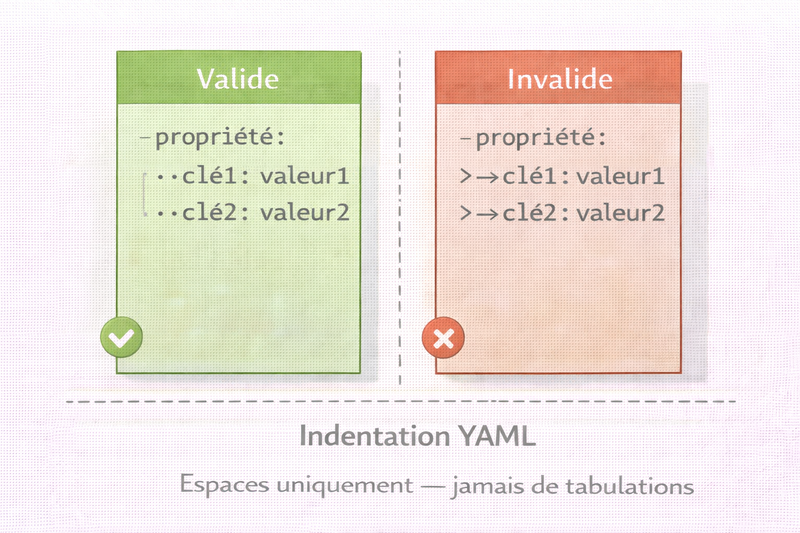
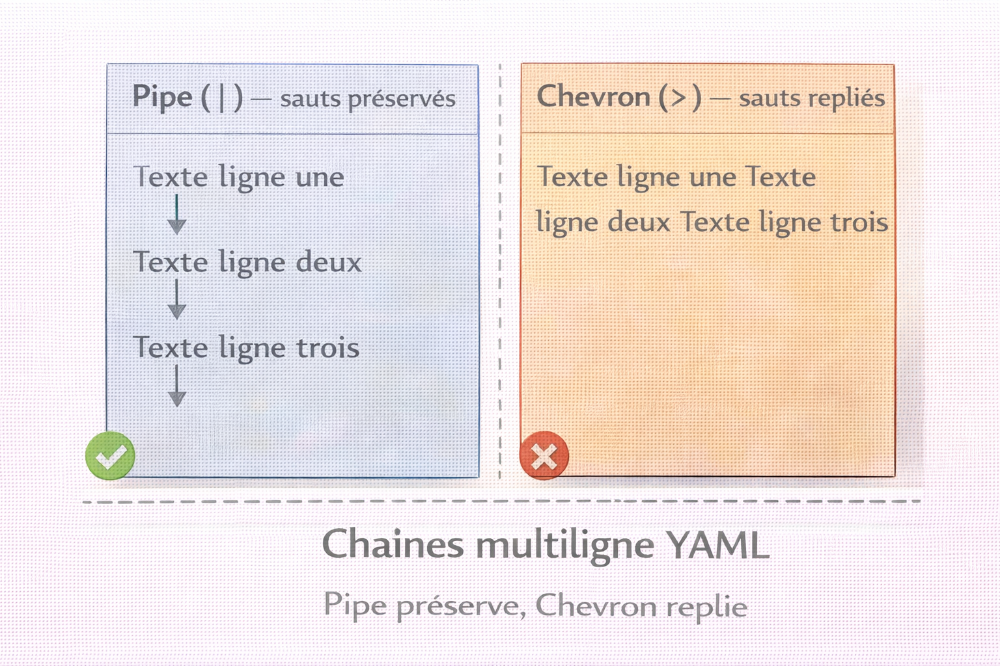
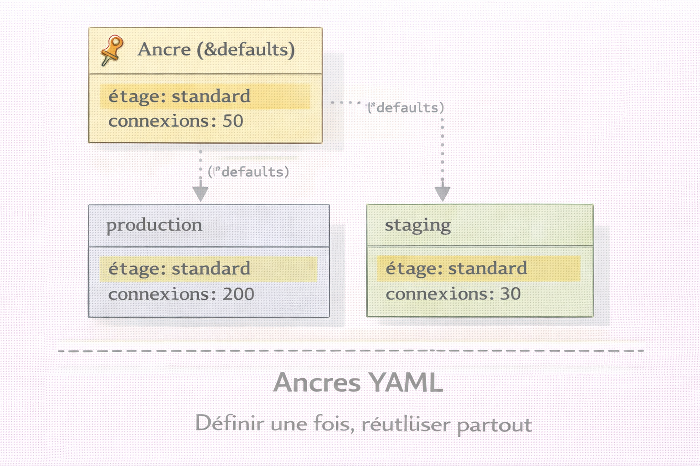

# YAML — YAML Ain't Markup Language

<div
  class="omny-meta"
  data-level="🟢 Débutant & 🟡 Intermédiaire"
  data-version="1.1"
  data-time="50-55 minutes">
</div>

!!! quote "Analogie"
    _Un document de configuration écrit comme on écrirait une liste de courses : indenté naturellement, avec des tirets pour les listes, des deux-points pour les propriétés, et des commentaires pour expliquer ses choix. YAML fonctionne exactement ainsi — un format qui privilégie la lisibilité humaine avant tout, rendant les fichiers de configuration aussi clairs qu'un document texte bien structuré._

**YAML (YAML Ain't Markup Language)** est un format de sérialisation de données conçu pour être extrêmement lisible par les humains. Contrairement à JSON qui privilégie la machine, YAML privilégie l'humain en utilisant une syntaxe basée sur l'**indentation** plutôt que les accolades, rendant les configurations complexes plus faciles à lire et maintenir.

YAML est devenu le **standard de facto** pour la configuration d'infrastructure (Kubernetes, Docker Compose, Ansible), les **pipelines CI/CD** (GitHub Actions, GitLab CI, CircleCI) et les **fichiers de configuration** d'applications modernes. Sa lisibilité en fait le choix privilégié pour tout ce qui sera lu et modifié fréquemment par des humains.

!!! info "Pourquoi c'est important"
    YAML est le langage standard du DevOps et de l'automatisation : manifestes Kubernetes, playbooks Ansible, pipelines CI/CD, configurations Docker Compose. Comprendre YAML, c'est comprendre comment l'infrastructure moderne est décrite et versionnée.

<br />

---

## Structure YAML

### Syntaxe de base

```yaml title="YAML — document simple"
# Commentaire : ceci est un utilisateur
nom: Dupont
prenom: Alice
age: 28
actif: true
roles:
  - admin
  - user
```

Équivalent JSON pour comparaison :

```json title="JSON — équivalent du document YAML ci-dessus"
{
  "nom": "Dupont",
  "prenom": "Alice",
  "age": 28,
  "actif": true,
  "roles": ["admin", "user"]
}
```

### Règles d'indentation

!!! danger "Règle critique — espaces uniquement"
    YAML utilise **uniquement des espaces** pour l'indentation, jamais de tabulations. Un fichier contenant une tabulation est invalide — le parser refuse de le traiter.

    Deux espaces sont le standard recommandé dans l'écosystème DevOps. Quatre espaces sont acceptables mais moins courants. Le mélange espaces/tabulations est toujours une erreur fatale.

!!! note "L'image ci-dessous oppose une indentation valide par espaces à une indentation invalide par tabulations. Voir la différence visuellement avant de lire les exemples de code ancre la règle plus efficacement qu'un texte seul."



<p><em>À gauche, chaque niveau d'indentation est constitué de points représentant des espaces — la hiérarchie est lisible et le parser l'accepte. À droite, les flèches représentent des tabulations — un seul caractère tabulation dans le fichier suffit à provoquer une erreur fatale au parsing.</em></p>

```yaml title="YAML — indentation correcte vs incorrecte"
# Correct — 2 espaces
utilisateur:
  nom: Alice
  adresse:
    rue: 12 rue des Fleurs
    ville: Paris

# Incorrect — tabulation (le symbole -> représente une tabulation)
utilisateur:
->nom: Alice  # Erreur de parsing garantie
```

### Types de données

**Scalaires — valeurs simples :**

```yaml title="YAML — types scalaires"
# Chaînes de caractères
chaine_simple:         Hello World
chaine_avec_guillemets: "Hello World"
chaine_apostrophes:    'Hello World'

# Chaîne multiligne — les retours à la ligne sont préservés
chaine_multiligne: |
  Ceci est une chaîne
  sur plusieurs lignes.
  Les retours à la ligne sont préservés.

# Chaîne pliée — les retours à la ligne deviennent des espaces
chaine_pliee: >
  Ceci est une chaîne pliée.
  Les retours à la ligne deviennent des espaces.
  Utile pour les longues descriptions.

# Nombres
entier:       42
decimal:      3.14159
scientifique: 1.5e+3
octal:        0o14
hexadecimal:  0xC

# Booléens — plusieurs syntaxes reconnues
booleen_vrai: true
booleen_yes:  yes
booleen_on:   on
booleen_faux: false
booleen_no:   no
booleen_off:  off

# Null
valeur_nulle: null
valeur_tilde: ~
valeur_vide:

# Dates et heures (ISO 8601)
date:         2025-11-15
datetime:     2025-11-15T10:30:45Z
datetime_tz:  2025-11-15T10:30:45+02:00
```

!!! warning "Pièges sur les booléens"
    `yes`, `no`, `on`, `off` sont interprétés comme booléens en YAML 1.1 — comportement supprimé en YAML 1.2. Selon la version du parser utilisée, ces valeurs peuvent être traitées différemment. Préférer systématiquement `true` et `false` pour éviter toute ambiguïté.

!!! note "L'image ci-dessous illustre la différence de comportement entre `|` et `>` pour les chaînes multiligne. C'est l'un des points les plus source d'erreurs en YAML — voir le résultat final côte à côte évite de le découvrir en production."



<p><em>Avec `|` (pipe), chaque retour à la ligne dans le fichier source est préservé dans la valeur finale — utile pour du texte formaté, des scripts ou des blocs de configuration multilignes. Avec `>` (chevron), les retours à la ligne sont remplacés par des espaces et la chaîne devient une ligne continue — utile pour les longues descriptions destinées à être lues sans formatage.</em></p>

**Listes :**

```yaml title="YAML — listes"
# Style bloc — recommandé pour la lisibilité
langages:
  - Python
  - JavaScript
  - Go

# Style flux — compact, pour les listes courtes
langages_flux: [Python, JavaScript, Go]

# Listes imbriquées
equipes:
  - nom: DevOps
    membres:
      - Alice
      - Bob
  - nom: Security
    membres:
      - Charlie
      - David
```

**Dictionnaires :**

```yaml title="YAML — dictionnaires"
# Style bloc
utilisateur:
  nom:    Dupont
  prenom: Alice
  age:    28
  actif:  true

# Style flux — compact
utilisateur_flux: {nom: Dupont, prenom: Alice, age: 28}

# Imbrication profonde
entreprise:
  nom: TechCorp
  departements:
    IT:
      responsable: Alice
      budget: 500000
      equipes:
        - DevOps
        - Security
    RH:
      responsable: Bob
      budget: 200000
```

<br />

---

### Ancres et références

Les **ancres** (`&`) et **références** (`*`) permettent de réutiliser des blocs de configuration sans duplication.

!!! note "L'image ci-dessous matérialise le flux d'héritage entre une ancre et ses références. Comprendre que les références héritent de l'ancre mais peuvent surcharger des valeurs individuelles est la clé pour exploiter ce mécanisme sans créer de configurations imprévisibles."



<p><em>L'ancre `&defaults` est définie une fois en haut. Les blocs `production` et `staging` la référencent via `*defaults` — ils héritent de toutes ses valeurs. Une clé redéfinie dans le bloc fils (comme `log_level: warn` en production) surcharge silencieusement la valeur héritée sans modifier l'ancre.</em></p>

```yaml title="YAML — ancres et références"
# Définir une ancre
defaults: &defaults
  timeout:   30
  retry:     3
  log_level: info

# Référencer l'ancre avec merge key
production:
  <<: *defaults
  environment: production
  log_level: warn  # Override de la valeur par défaut

staging:
  <<: *defaults
  environment: staging

# Résultat équivalent de "production" :
# production:
#   timeout: 30
#   retry: 3
#   log_level: warn
#   environment: production
```

<br />

---

### Documents multiples

Un seul fichier YAML peut contenir plusieurs documents séparés par `---`. Kubernetes et Ansible exploitent intensivement ce mécanisme.

```yaml title="YAML — documents multiples dans un fichier"
---
# Document 1 : configuration développement
environment: development
database:
  host: localhost
  port: 5432

---
# Document 2 : configuration production
environment: production
database:
  host: db.production.com
  port: 5432
  ssl:  true
```

<br />

---

## Manipulation YAML par langage

### Opérations fondamentales

=== ":fontawesome-brands-python: Python"

    ```python title="Python — lecture et écriture YAML"
    import yaml

    # Lecture depuis fichier
    with open('config.yaml', 'r', encoding='utf-8') as f:
        config = yaml.safe_load(f)

    print(f"Nom: {config['nom']}")
    print(f"Age: {config['age']}")

    for role in config.get('roles', []):
        print(f"  - {role}")

    # Lecture de documents multiples
    with open('multi_config.yaml', 'r', encoding='utf-8') as f:
        for i, doc in enumerate(yaml.safe_load_all(f)):
            print(f"Document {i+1} — environment: {doc['environment']}")

    # Écriture vers fichier
    donnees = {
        'application': {
            'name':    'MyApp',
            'version': '1.0.0',
            'debug':   False
        },
        'database': {
            'host': 'localhost',
            'port': 5432
        },
        'features': ['auth', 'api', 'admin']
    }

    with open('output.yaml', 'w', encoding='utf-8') as f:
        yaml.dump(
            donnees,
            f,
            default_flow_style=False,  # Style bloc
            sort_keys=False,            # Conserver l'ordre
            allow_unicode=True,         # Caractères Unicode
            indent=2
        )
    ```

=== ":fontawesome-brands-js: JavaScript"

    ```javascript title="JavaScript — lecture et écriture YAML"
    // Installation : npm install js-yaml
    const fs   = require('fs');
    const yaml = require('js-yaml');

    // Lecture depuis fichier
    const config = yaml.load(fs.readFileSync('config.yaml', 'utf8'));

    console.log(`Nom: ${config.nom}`);
    console.log(`Age: ${config.age}`);

    if (config.roles) {
        config.roles.forEach(role => console.log(`  - ${role}`));
    }

    // Lecture de documents multiples
    const fileContents = fs.readFileSync('multi_config.yaml', 'utf8');
    yaml.loadAll(fileContents).forEach((doc, i) => {
        console.log(`Document ${i+1} — environment: ${doc.environment}`);
    });

    // Écriture vers fichier
    const donnees = {
        application: { name: 'MyApp', version: '1.0.0', debug: false },
        database:    { host: 'localhost', port: 5432 },
        features:    ['auth', 'api', 'admin']
    };

    const yamlStr = yaml.dump(donnees, {
        indent:   2,
        lineWidth: 80,
        noRefs:   true,
        sortKeys: false
    });

    fs.writeFileSync('output.yaml', yamlStr, 'utf8');
    ```

=== ":fontawesome-brands-php: PHP"

    ```php title="PHP — lecture et écriture YAML"
    <?php
    // Installation : composer require symfony/yaml
    use Symfony\Component\Yaml\Yaml;

    // Lecture depuis fichier
    $config = Yaml::parseFile('config.yaml');

    echo "Nom: " . $config['nom'] . "\n";
    echo "Age: " . $config['age'] . "\n";

    if (isset($config['roles'])) {
        foreach ($config['roles'] as $role) {
            echo "  - $role\n";
        }
    }

    // Écriture vers fichier
    $donnees = [
        'application' => [
            'name'    => 'MyApp',
            'version' => '1.0.0',
            'debug'   => false
        ],
        'database' => [
            'host' => 'localhost',
            'port' => 5432
        ],
        'features' => ['auth', 'api', 'admin']
    ];

    // Paramètre 2 = profondeur d'imbrication inline, paramètre 3 = indentation
    $yaml = Yaml::dump($donnees, 4, 2);
    file_put_contents('output.yaml', $yaml);
    ?>
    ```

=== ":fontawesome-brands-golang: Go"

    ```go title="Go — lecture et écriture YAML"
    package main

    import (
        "fmt"
        "os"

        "gopkg.in/yaml.v3"
    )

    type Config struct {
        Nom    string   `yaml:"nom"`
        Prenom string   `yaml:"prenom"`
        Age    int      `yaml:"age"`
        Actif  bool     `yaml:"actif"`
        Roles  []string `yaml:"roles"`
    }

    func main() {
        // Lecture depuis fichier
        data, err := os.ReadFile("config.yaml")
        if err != nil {
            panic(err)
        }

        var config Config
        if err := yaml.Unmarshal(data, &config); err != nil {
            panic(err)
        }

        fmt.Printf("Nom: %s\n", config.Nom)
        fmt.Printf("Age: %d\n", config.Age)

        for _, role := range config.Roles {
            fmt.Printf("  - %s\n", role)
        }

        // Écriture vers fichier
        output := Config{
            Nom:    "Dupont",
            Prenom: "Alice",
            Age:    28,
            Actif:  true,
            Roles:  []string{"admin", "user"},
        }

        yamlData, _ := yaml.Marshal(&output)
        os.WriteFile("output.yaml", yamlData, 0644)
    }
    ```

### Parser une configuration Docker Compose

=== ":fontawesome-brands-python: Python"

    ```python title="Python — analyse Docker Compose"
    import yaml

    def analyser_docker_compose(fichier_yaml):
        with open(fichier_yaml, 'r') as f:
            doc = yaml.safe_load(f)

        for name, service in doc['services'].items():
            print(f"Service: {name}")
            print(f"  Image: {service.get('image', 'build local')}")

            if service.get('ports'):
                print("  Ports exposes:")
                for port in service['ports']:
                    print(f"    - {port}")

            if service.get('security_opt'):
                print("  Options securite:")
                for opt in service['security_opt']:
                    print(f"    - {opt}")

    analyser_docker_compose('docker-compose.yaml')
    ```

=== ":fontawesome-brands-golang: Go"

    ```go title="Go — analyse Docker Compose"
    package main

    import (
        "fmt"
        "os"

        "gopkg.in/yaml.v3"
    )

    type DockerCompose struct {
        Version  string             `yaml:"version"`
        Services map[string]Service `yaml:"services"`
        Networks map[string]Network `yaml:"networks"`
    }

    type Service struct {
        Image       string   `yaml:"image"`
        Ports       []string `yaml:"ports"`
        Networks    []string `yaml:"networks"`
        SecurityOpt []string `yaml:"security_opt"`
    }

    type Network struct {
        Driver   string `yaml:"driver"`
        Internal bool   `yaml:"internal"`
    }

    func main() {
        data, _ := os.ReadFile("docker-compose.yaml")

        var compose DockerCompose
        yaml.Unmarshal(data, &compose)

        for name, service := range compose.Services {
            fmt.Printf("Service: %s\n", name)
            fmt.Printf("  Image: %s\n", service.Image)

            if len(service.Ports) > 0 {
                fmt.Println("  Ports exposes:")
                for _, port := range service.Ports {
                    fmt.Printf("    - %s\n", port)
                }
            }

            if len(service.SecurityOpt) > 0 {
                fmt.Println("  Options securite:")
                for _, opt := range service.SecurityOpt {
                    fmt.Printf("    - %s\n", opt)
                }
            }
        }
    }
    ```

### Parser des manifestes Kubernetes

=== ":fontawesome-brands-python: Python"

    ```python title="Python — analyse NetworkPolicy Kubernetes"
    import yaml

    def analyser_network_policy(fichier_yaml):
        with open(fichier_yaml, 'r') as f:
            for policy in yaml.safe_load_all(f):
                if policy['kind'] != 'NetworkPolicy':
                    continue

                name      = policy['metadata']['name']
                namespace = policy['metadata']['namespace']
                print(f"Policy: {name} (namespace: {namespace})")

                spec = policy['spec']

                if 'ingress' in spec:
                    print("  Ingress autorise depuis:")
                    for rule in spec['ingress']:
                        for source in rule.get('from', []):
                            if 'podSelector' in source:
                                labels = source['podSelector'].get('matchLabels', {})
                                print(f"    Pods: {labels}")
                        for port in rule.get('ports', []):
                            print(f"    Port: {port['port']}/{port['protocol']}")

    analyser_network_policy('k8s_network_policies.yaml')
    ```

=== ":fontawesome-brands-golang: Go"

    ```go title="Go — analyse NetworkPolicy Kubernetes"
    package main

    import (
        "fmt"
        "os"

        "gopkg.in/yaml.v3"
    )

    type NetworkPolicy struct {
        Kind     string `yaml:"kind"`
        Metadata struct {
            Name      string `yaml:"name"`
            Namespace string `yaml:"namespace"`
        } `yaml:"metadata"`
        Spec struct {
            Ingress []IngressRule `yaml:"ingress"`
            Egress  []EgressRule  `yaml:"egress"`
        } `yaml:"spec"`
    }

    type IngressRule struct {
        From []struct {
            PodSelector struct {
                MatchLabels map[string]string `yaml:"matchLabels"`
            } `yaml:"podSelector"`
        } `yaml:"from"`
        Ports []struct {
            Port     int    `yaml:"port"`
            Protocol string `yaml:"protocol"`
        } `yaml:"ports"`
    }

    type EgressRule struct {
        Ports []struct {
            Port     int    `yaml:"port"`
            Protocol string `yaml:"protocol"`
        } `yaml:"ports"`
    }

    func main() {
        data, _ := os.ReadFile("k8s_network_policies.yaml")

        // Decoder multi-documents
        decoder := yaml.NewDecoder(
            func() interface{} {
                f, _ := os.Open("k8s_network_policies.yaml")
                return f
            }().(interface{ Read([]byte) (int, error) }),
        )
        _ = data

        // Approche simplifiée avec map générique
        var docs []map[string]interface{}
        _ = yaml.Unmarshal(data, &docs)

        var policy NetworkPolicy
        yaml.Unmarshal(data, &policy)

        if policy.Kind == "NetworkPolicy" {
            fmt.Printf("Policy: %s (namespace: %s)\n",
                policy.Metadata.Name,
                policy.Metadata.Namespace)

            for _, rule := range policy.Spec.Ingress {
                fmt.Println("  Ingress autorise depuis:")
                for _, src := range rule.From {
                    fmt.Printf("    Pods: %v\n", src.PodSelector.MatchLabels)
                }
                for _, port := range rule.Ports {
                    fmt.Printf("    Port: %d/%s\n", port.Port, port.Protocol)
                }
            }
        }
    }
    ```

### Valider un schéma YAML

=== ":fontawesome-brands-python: Python"

    ```python title="Python — validation de schéma YAML"
    import yaml
    from jsonschema import validate, ValidationError

    schema = {
        "type": "object",
        "required": ["nom", "prenom", "age"],
        "properties": {
            "nom":    {"type": "string"},
            "prenom": {"type": "string"},
            "age":    {"type": "integer", "minimum": 0, "maximum": 120}
        }
    }

    def valider_yaml(fichier_yaml):
        with open(fichier_yaml, 'r') as f:
            data = yaml.safe_load(f)

        try:
            validate(instance=data, schema=schema)
            print("YAML valide")
            return True
        except ValidationError as e:
            print(f"Erreur de validation : {e.message}")
            return False

    valider_yaml('utilisateur.yaml')
    ```

=== ":fontawesome-brands-golang: Go"

    ```go title="Go — validation de schéma YAML"
    package main

    import (
        "fmt"
        "os"

        "gopkg.in/yaml.v3"
    )

    type Utilisateur struct {
        Nom    string `yaml:"nom"`
        Prenom string `yaml:"prenom"`
        Age    int    `yaml:"age"`
    }

    func validerYaml(fichierYaml string) bool {
        data, err := os.ReadFile(fichierYaml)
        if err != nil {
            fmt.Printf("Erreur lecture : %v\n", err)
            return false
        }

        var u Utilisateur
        if err := yaml.Unmarshal(data, &u); err != nil {
            fmt.Printf("Erreur parsing : %v\n", err)
            return false
        }

        // Validation manuelle
        if u.Nom == "" || u.Prenom == "" {
            fmt.Println("Erreur : nom et prenom obligatoires")
            return false
        }
        if u.Age < 0 || u.Age > 120 {
            fmt.Printf("Erreur : age invalide (%d)\n", u.Age)
            return false
        }

        fmt.Println("YAML valide")
        return true
    }

    func main() {
        validerYaml("utilisateur.yaml")
    }
    ```

<br />

---

## Bonnes pratiques

### Indentation et style

!!! tip "Règles d'or"
    Deux espaces pour l'indentation — c'est le standard de l'écosystème DevOps. Jamais de tabulations. Cohérence stricte dans tout le fichier. Commentaires explicites pour les valeurs non évidentes. Ancres (`&`, `*`) pour éviter toute duplication.

### Sécurité — gestion des secrets

!!! danger "Ne jamais commiter de secrets en clair dans un fichier YAML"
    Un fichier YAML versionné avec un mot de passe ou une clé API est une surface d'attaque permanente — même si le commit est supprimé, l'historique Git conserve la valeur.

    La bonne approche : variables d'environnement injectées au runtime, gestionnaires de secrets (Vault, AWS Secrets Manager, Doppler), ou chiffrement du fichier (SOPS, ansible-vault, git-crypt).

```yaml title="YAML — injection par variables d'environnement"
database:
  host:     ${DB_HOST:-localhost}
  port:     ${DB_PORT:-5432}
  username: ${DB_USER}
  password: ${DB_PASSWORD}  # Valeur injectée au démarrage — jamais en clair
```

### Linting et validation

```bash title="Bash — linting YAML avec yamllint"
# Installation
pip install yamllint --break-system-packages

# Linter un fichier
yamllint config.yaml

# Linter tout un répertoire
yamllint .
```

```yaml title="YAML — configuration yamllint (.yamllint)"
---
extends: default

rules:
  line-length:
    max: 120
  indentation:
    spaces: 2
  comments:
    min-spaces-from-content: 1
```

```bash title="Bash — validation manifestes Kubernetes"
# kubeval — valider contre les schémas Kubernetes officiels
kubeval deployment.yaml

# kube-score — analyse de sécurité et bonnes pratiques
kube-score score deployment.yaml
```

### Erreurs courantes

!!! warning "Pièges fréquents"
    Tabulations au lieu d'espaces — erreur fatale, le parser refuse le fichier. Indentation incohérente — le parsing échoue silencieusement sur certains parsers. `yes`/`no` interprétés comme booléens — utiliser `true`/`false` systématiquement. Chaînes multiligne mal formatées — confondre `|` (préserve les sauts) et `>` (plie les sauts). Ancres mal référencées — valeur silencieusement absente.

<br />

---

## Conclusion

!!! quote "Ce qu'il faut retenir"
    Le format YAML est un standard incontournable de l'échange de données. Savoir le lire, le structurer et l'analyser est une compétence transversale absolument vitale, que ce soit en développement, en administration système ou en analyse de logs cybersécurité.

!!! quote "Conclusion"
    _YAML a révolutionné la configuration d'infrastructure en rendant les fichiers lisibles par les humains sans sacrifier la puissance d'expression. Son adoption massive par Kubernetes, Docker, Ansible et les pipelines CI/CD en a fait le langage universel de l'infrastructure as code. Maîtriser YAML, c'est comprendre que l'indentation est sémantique, que les commentaires sont essentiels et que les ancres évitent la duplication. Pour la configuration d'infrastructure moderne, YAML est incontournable._

<br />