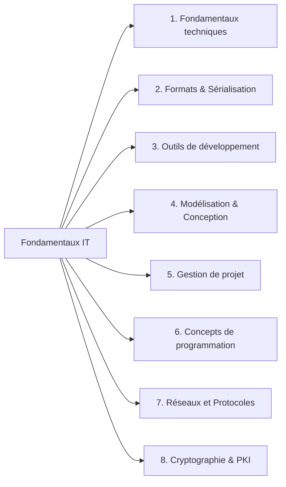
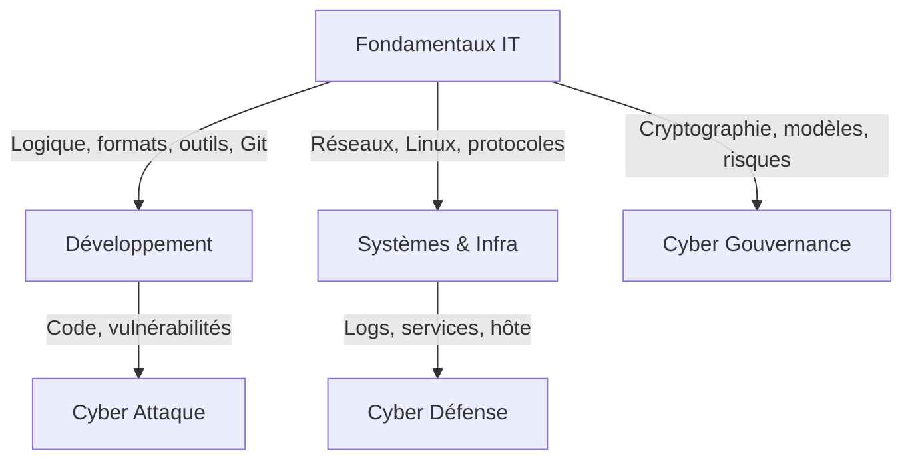
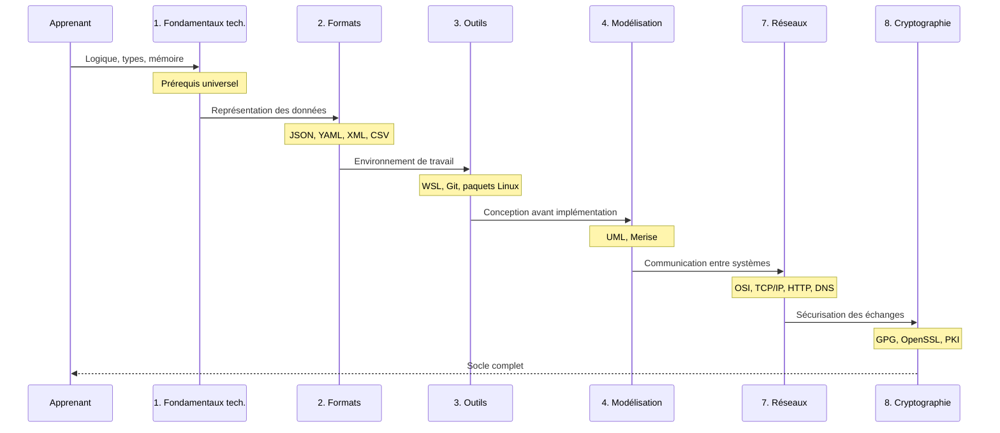

# Fondamentaux IT

!!! quote "Analogie"
    _Construire une expertise technique sans maîtriser les fondamentaux, c'est élever une structure sur des fondations instables. On peut progresser vite au début — mais les lacunes se révèlent au pire moment._

## Objectif

Cette section constitue le **socle transversal** d'OmnyDocs. Elle rassemble les connaissances durables, indépendantes d'un langage, d'un framework ou d'un environnement particulier. Elles sont nécessaires avant d'aborder le développement, l'administration système ou la cybersécurité.

Le contenu est organisé en **huit domaines complémentaires**, progressifs mais consultables indépendamment selon les besoins.

 

---

## Vue d'ensemble

<em>Chaque domaine est autonome mais s'appuie sur les précédents. La progression recommandée suit l'ordre de numérotation.</em>

 

---

## Rôle dans la progression générale

<em>Les Fondamentaux IT alimentent directement les trois branches de spécialisation. <strong>Une lacune à ce niveau se répercute sur l'ensemble de la progression</strong>.</em>

 

---

## Domaines de la section

- ### :lucide-cpu: 1 — Fondamentaux techniques
    ---
    Primitives universelles de la programmation : types, mémoire, logique booléenne, structures de contrôle, fonctions. Commun à la quasi-totalité des langages modernes.

    [Consulter](./fondamentaux/index.md)

- ### :lucide-file-code: 2 — Formats & Sérialisation
    ---
    Formats d'échange et de configuration : JSON, YAML, XML, CSV. Savoir lire, produire et valider des données structurées dans tout contexte technique.

    [Consulter](./formats-serialisation/index.md)

- ### :lucide-terminal: 3 — Outils de développement
    ---
    Environnements virtuels (WSL, NVM, VENV), gestionnaires de paquets Linux, documentation et versionning (Markdown, Git). Outillage transverse pour produire et maintenir du logiciel.

    [Consulter](./outils/index.md)

- ### :lucide-shapes: 4 — Modélisation & Conception
    ---
    Méthodes et notations pour raisonner avant d'implémenter : UML (use case, classes, séquences, états, déploiement) et Merise (MCD, MLD, MPD, SQL).

    [Consulter](./modelisation/index.md)

- ### :lucide-calendar-check: 5 — Gestion de projet
    ---
    Structuration du travail et pilotage : planification, jalons, dépendances. Outillage Gantt pour visualiser et communiquer une trajectoire de projet.

    [Consulter](./projet/index.md)

- ### :lucide-code: 6 — Concepts de programmation
    ---
    Principes structurants et durables : architecture Unix, codes d'erreur standardisés. Socle intellectuel transverse applicable dans tous les environnements.

    [Consulter](./concepts/architecture-unix.md)

- ### :lucide-network: 7 — Réseaux et Protocoles
    ---
    Modèles conceptuels (OSI, TCP/IP), grandes familles de protocoles, HTTP, DNS, sockets. Les mécanismes client-serveur avant leur mise en oeuvre opérationnelle.

    [Consulter](./reseaux/modele-osi.md)

- ### :lucide-lock: 8 — Cryptographie & PKI
    ---
    Bases cryptographiques nécessaires avant d'aborder la sécurité applicative et réseau : GPG, OpenSSL, PKI, chaînes de certificats, TLS.

    [Consulter](./crypto/index.md)

 

---

## Progression recommandée

<em>Cette progression n'impose aucune contrainte rigide. <strong>Chaque domaine reste accessible indépendamment selon les besoins ou le projet en cours</strong>. L'ordre proposé réduit simplement la friction lors de la première découverte.</em>

 

---

## Périmètre et délimitations

Il est important de comprendre ce que cette section **ne couvre pas**, pour éviter toute confusion avec les sections suivantes.

| Thème | Fondamentaux IT | Section dédiée |
|---|---|---|
| Administration Linux avancée | Outils CLI de base | Systèmes & Infra |
| Services réseau opérationnels | Concepts OSI/TCP | Systèmes & Infra |
| Sécurité applicative | Bases crypto | Cyber : Défense / Attaque |
| Frameworks web | Aucun | Développement |
| Docker, CI/CD | Git uniquement | Développement |
| Pentest, audit | Aucun | Cyber : Attaque |

 

---

## Conclusion

!!! note "Notre recommandation"
    Toute lacune dans les Fondamentaux IT se répercute directement sur les sections suivantes — souvent de manière non évidente. Un profil qui ne comprend pas le modèle OSI diagnostique mal un incident réseau. Un profil qui ne maîtrise pas Git introduit des risques dans tout environnement collaboratif.

    Investir ces bases est le seul raccourci réel vers l'expertise.

**Point d'entrée recommandé : [Fondamentaux techniques](./fondamentaux/index.md)**

 