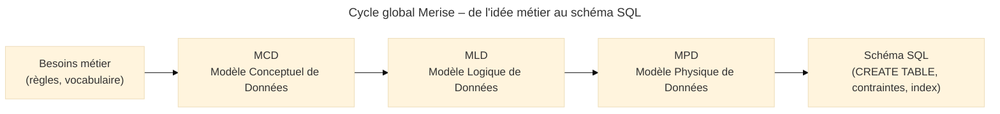
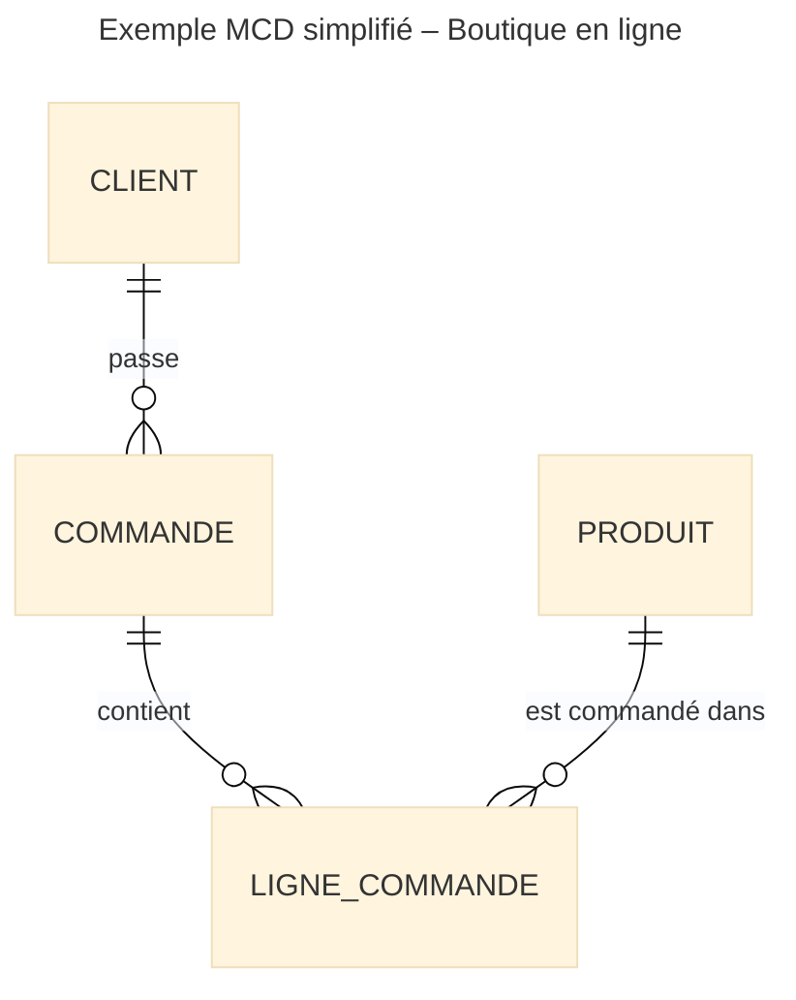
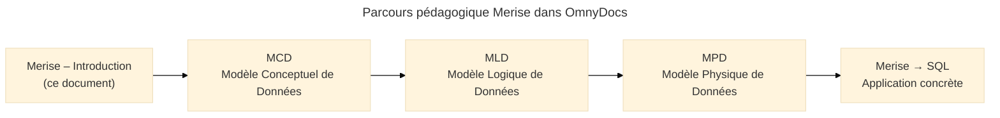

# Introduction

<div
  class="omny-meta"
  data-level="🟢 Débutant & 🟡 Intermédiaire"
  data-version="1.0"
  data-time="20-30 minutes">
</div>

## Introduction

**Merise** est une méthode de **modélisation des systèmes d’information** née dans les années 80 en France. Elle reste aujourd’hui une **référence robuste** pour concevoir proprement les bases de données relationnelles et clarifier les échanges entre **métier**, **MOA** et **MOE**.

> L’idée centrale : **on ne part pas directement dans le SQL**. On commence par clarifier les règles métier (MCD), on les traduit en structures techniques (MLD), puis on arrive à un schéma implémentable (MPD).  

Là où UML propose un arsenal très riche de diagrammes pour représenter tout un système, **Merise se concentre sur les données et leurs règles** : entités, associations, cardinalités, identifiants, dépendances fonctionnelles… C’est **exactement ce dont on a besoin** avant de créer des tables, des clés primaires[^pk] et des clés étrangères[^fk].

!!! info "Pourquoi encore parler de Merise en 2025 ?"
    - Parce que beaucoup de **BTS, BUT, licences** et formations pro s’appuient encore dessus.
    - Parce que **PostgreSQL, MySQL, SQL Server** n’ont pas changé le problème de base : mal modéliser = souffrir pendant 10 ans.
    - Parce que la méthode est **parfaite pour l’enseignement** et pour structurer un discours avec un client non technique.

---

## Pour qui, et quand utiliser Merise ?

<div class="grid cards" markdown>

-   :lucide-user-cog:{ .lg .middle } **Pour qui ?**

    ---

    - Étudiants (BTS, BUT, écoles d’ingé, reconversion)
    - Développeurs fullstack qui veulent **arrêter de subir** le schéma SQL existant
    - Chefs de projet / PO qui doivent **valider un modèle de données**

-   :lucide-clock:{ .lg .middle } **Pourquoi maintenant ?**

    ---

    - Tu commences un **nouveau projet** avec une base relationnelle
    - Tu dois **refondre** un SI vieillissant (ERP maison, appli legacy)
    - Tu dois **auditer** ou **documenter** une base de données pour un client

</div>

<div class="grid cards" markdown>

-   :lucide-pen-line:{ .lg .middle } **Comment l’utiliser concrètement ?**

    ---

    1. Discuter avec le métier, extraire **les règles et les mots importants**
    2. Les représenter en **MCD** (entités, associations, cardinalités)
    3. Transformer le MCD en **MLD** (tables, clés)
    4. Dériver le **MPD** ciblé (PostgreSQL, MySQL, etc.)

-   :lucide-activity:{ .lg .middle } **Impact pour l’après**

    ---

    - Base plus **stable**, plus **évolutive**
    - Moins de “bidouilles SQL” et de joins impossibles
    - Documentation exploitable pour la **cyber**, les **audits**, la **gouvernance**

</div>

---

## Vue d’ensemble : le cycle Merise

!!! quote "Avant de zoomer sur chaque niveau, il faut voir **le film en entier** : _Merise propose une progression logique **du métier vers la technique**, sans brûler d’étapes._"

Le cycle de base :

1. **MCD** – Modèle Conceptuel de Données : vocabulaire métier, règles, cardinalités.
2. **MLD** – Modèle Logique de Données : tables, clés, normalisation, dépendances.
3. **MPD** – Modèle Physique de Données : types SQL, index, contraintes, options propres au SGBD.
4. **Merise → SQL** : génération des `CREATE TABLE`, index, contraintes, vues, etc.



<small><i>Ce schéma montre la progression typique de Merise : on part des besoins métier (ce que l’organisation manipule), on structure ces besoins sous forme d’entités et d’associations (MCD), on les transforme en tables (MLD), puis en schéma SQL prêt à être implémenté (MPD).</i></small>

---

## 1. MCD – Modèle Conceptuel de Données (vue d’intro)

Le **MCD** est le **langage commun métier / technique**. On y trouve :

* des **entités** (CLIENT, COMMANDE, PRODUIT…),
* des **associations** (un client *passe* des commandes),
* des **attributs** (nom, email, date, montant),
* des **cardinalités** (1, 0..1, 0..N, 1..N)[^card].

### Pour qui ?

* Pour les **métiers** : ils retrouvent leur vocabulaire, sans SQL.
* Pour les **devs** : c’est la source de vérité avant toute conception SQL.
* Pour les **architectes** : base de discussion avec l’urbanisation, les flux, l’API.

### Pourquoi maintenant ?

On construit le MCD **au moment où les besoins fonctionnels sont clarifiés**, mais **avant** de parler tables ou index.
C’est là qu’on fixe les règles de type :

* “Un client peut avoir **plusieurs** adresses de livraison.”
* “Une facture est **liée à une seule** commande.”
* “Un produit peut appartenir à **plusieurs** catégories.”

### Comment le concevoir (en résumé)

1. Lister les **objets métier** importants (clients, articles, factures, utilisateurs…).
2. Identifier les **relations** entre eux (“un client passe des commandes”, etc.).
3. Définir les **cardinalités** pour chaque relation.
4. Placer les **attributs** là où ils font sens (sur l’entité ou l’association).
5. Identifier les **identifiants** stables (code produit, numéro de contrat…).

### Impact pour l’après

Un MCD propre :

* simplifie énormément le **MLD** (moins de tables bizarres, moins de “copier-coller d’ID”),
* évite des incohérences métier (données impossibles à représenter en SQL),
* sert de **documentation de référence** dans le temps.

### Exemple 1 – Boutique en ligne (vue MCD)

On modélise : CLIENT, COMMANDE, PRODUIT.

* Un **client** passe **0..N commandes**.
* Une **commande** contient **1..N lignes**.
* Chaque **ligne** concerne **1 produit**.



<small><i>Ce MCD montre une structure classique : un client passe des commandes, chaque commande contient des lignes, chaque ligne référence un produit. Pas de table SQL ici, uniquement des concepts métier et leurs relations.</i></small>

### Exemple 2 – Bibliothèque

* **ADHERENT** emprunte des **EXEMPLAIRE** de **LIVRE**.
* Un **exemplaire** est lié à **un seul livre**, mais un livre possède **plusieurs exemplaires**.

---

## 2. MLD – Modèle Logique de Données (vue d’intro)

Le **MLD** est la traduction du MCD dans le monde relationnel :

* les entités deviennent des **tables**,
* les associations deviennent soit des **tables associatives**, soit des colonnes avec clé étrangère,
* les cardinalités se transforment en **contraintes** (obligatoire / optionnel, multi-lignes, etc.).

### Pour qui ?

* Pour les **développeurs backend / DBA** qui vont travailler avec SQL.
* Pour les **intégrateurs** qui doivent comprendre les structures et les dépendances.
* Pour les **auditeurs** qui veulent savoir “où sont les données”.

### Pourquoi maintenant ?

On passe au MLD **une fois le MCD stabilisé**.
C’est le moment où on répond à des questions comme :

* “Cette association 0..N / 0..N devient-elle une **table de jointure** ?”
* “Cette cardinalité 1..N est-elle portée par une **clé étrangère** d’un côté ?”
* “Comment normaliser pour éviter les **données dupliquées** ?”

### Comment le concevoir (en résumé)

1. Transformer chaque **entité** en **table** avec une clé primaire.
2. Transformer chaque **association** selon sa cardinalité :

   * 1..N → clé étrangère côté N,
   * N..N → table associative.
3. Appliquer la **normalisation** (1FN, 2FN, 3FN)[^nf].
4. Vérifier les **dépendances fonctionnelles** (un attribut ne dépend que de la clé).

### Impact pour l’après

Un MLD propre :

* donne un SQL **plus simple**, plus maintenable,
* réduit les **anomalies de mise à jour** (données incohérentes),
* rend les requêtes analytics / BI beaucoup plus fiables.

### Exemple rapide – extrait de MLD pour la boutique

À partir du MCD de la boutique :

* CLIENT → table `CLIENT`
* COMMANDE → table `COMMANDE`
* LIGNE_COMMANDE → table `LIGNE_COMMANDE`
* PRODUIT → table `PRODUIT`

Avec les relations :

* `COMMANDE` contient la clé étrangère `id_client`.
* `LIGNE_COMMANDE` contient `id_commande` et `id_produit`.

---

## 3. MPD – Modèle Physique de Données (vue d’intro)

Le **MPD** est l’adaptation du MLD à un **SGBD concret** (PostgreSQL, MySQL, SQL Server, Oracle, etc.).
On y choisit :

* les **types** (`VARCHAR(255)`, `NUMERIC(10,2)`, `TIMESTAMP WITH TIME ZONE`…),
* les **index**, contraintes (`UNIQUE`, `CHECK`, `NOT NULL`),
* les paramètres propres au SGBD (tablespaces, partitionnement…).

### Pour qui ?

* Pour le **DBA** ou le **dev** qui va réellement créer les tables.
* Pour les équipes **performance** / **production**.
* Pour la **cybersécurité** (politique de chiffrement, séparation des schémas…).

### Pourquoi maintenant ?

On passe au MPD **juste avant la création réelle de la base**.
C’est le moment où les décisions commencent à coûter cher à modifier (changement de types, refonte d’index…).

### Comment le concevoir (en résumé)

1. Partir du MLD et choisir les **types de données** appropriés.
2. Définir les **contraintes d’intégrité**.
3. Ajouter les **index** (clé primaire, index de recherche, index uniques).
4. Préparer les **aspects opérationnels** : notation des tables, schéma (`public`, `app`, `audit`), éventuel partitionnement.

### Impact pour l’après

Un MPD bien pensé :

* améliore les **performances**,
* réduit les risques d’**erreurs sur les types** (dates gérées comme des `TEXT`…),
* facilite la **maintenance** (scripts cohérents, migrations maîtrisées).

---

## 4. Merise → SQL (vue d’intro)

Dernière étape : transformer le MPD en **instructions SQL concrètes** :

* `CREATE TABLE`,
* `ALTER TABLE`,
* `CREATE INDEX`,
* contraintes `FOREIGN KEY`, `UNIQUE`, `CHECK`, etc.

L’idée n’est pas de tout générer “machinalement”, mais de **garder la cohérence** :

* ce qui a été décidé en MCD ne disparaît pas,
* chaque cardinalité a son reflet dans les clés étrangères,
* chaque règle métier importante a, si possible, une **contrainte explicite**.

---

## Exemples globaux – du métier au SQL

### Exemple A – Gestion d’élèves (vue pédagogique)

**1. Besoin métier**

* Des **ÉLÈVES** sont inscrits dans des **CLASSES**.
* Un élève appartient à **une seule classe**.
* Une classe contient **plusieurs élèves**.

**2. MCD (simplifié)**

* Entités : ELEVE, CLASSE.
* Association : “est inscrit dans”.
* Cardinalité : CLASSE 1..N ELEVE.

**3. MLD**

* Table `ELEVE(id_eleve, nom, prenom, date_naissance, id_classe)`
* Table `CLASSE(id_classe, libelle, niveau)`

**4. MPD + SQL (extrait)**

```sql
CREATE TABLE classe (
  id_classe   SERIAL PRIMARY KEY,
  libelle     VARCHAR(50) NOT NULL,
  niveau      VARCHAR(20) NOT NULL
);

CREATE TABLE eleve (
  id_eleve      SERIAL PRIMARY KEY,
  nom           VARCHAR(50) NOT NULL,
  prenom        VARCHAR(50) NOT NULL,
  date_naissance DATE       NOT NULL,
  id_classe     INTEGER     NOT NULL REFERENCES classe(id_classe)
);
```

### Exemple B – Tickets de support

**1. Besoin métier**

* Des **UTILISATEURS** ouvrent des **TICKETS**.
* Un ticket peut être **assigné à un TECHNICIEN**.
* Un technicien gère **plusieurs tickets**.

On suivra la même logique : vocabulaire métier → MCD → MLD → MPD → SQL.

---

## La suite logique dans la doc

Cette introduction te donne la **carte mentale** de Merise et le rôle de chaque niveau. La progression de la section sera la suivante :



<small><i>Ce schéma représente le parcours pédagogique proposé : après cette introduction, chaque document détaillera un niveau précis – MCD, MLD, MPD, puis la traduction en SQL avec des exemples complets.</i></small>

Les prochains modules détailleront donc :

* **MCD** : notation, cardinalités, exemples complets (boutique, bibliothèque, gestion de cours…),
* **MLD** : transformation systématique du MCD, normalisation, dépendances fonctionnelles,
* **MPD** : adaptation à un SGBD cible (PostgreSQL/MySQL), types, index, contraintes,
* **Merise → SQL** : cas concrets de génération et de migration, bonnes pratiques pour dev & cyber.

[^card]: Une **cardinalité** indique combien d’occurrences d’une entité peuvent être liées à une occurrence d’une autre entité (ex. 1 client peut avoir 0..N commandes).

[^pk]: Une **clé primaire** identifie de manière unique chaque ligne d’une table.

[^fk]: Une **clé étrangère** établit un lien entre deux tables en référençant la clé primaire d’une autre table.

[^nf]: Les **formes normales** (1FN, 2FN, 3FN…) sont des règles de normalisation visant à éviter les redondances et les incohérences dans les bases relationnelles.

