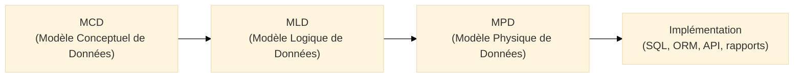
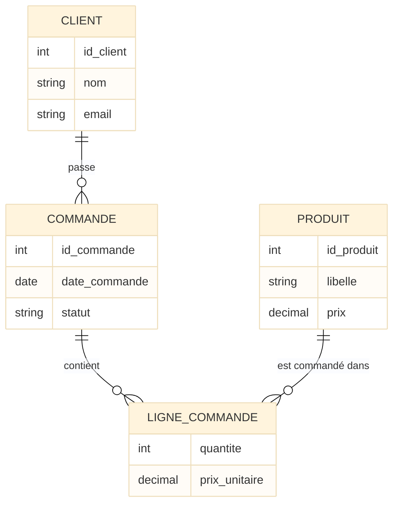
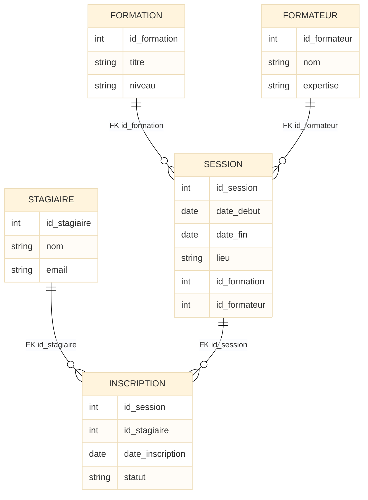
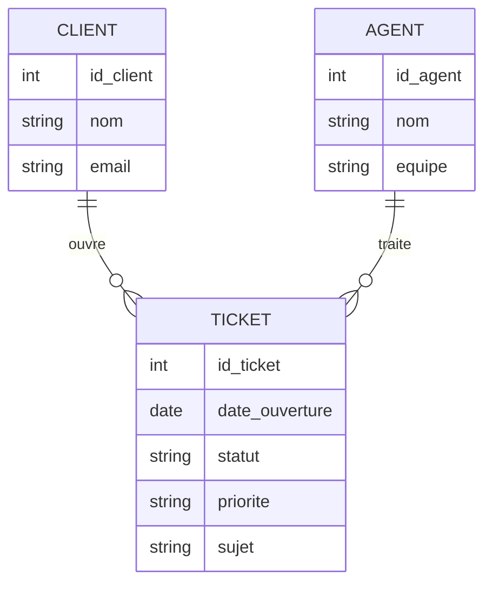

# MCD

## Introduction au Modèle Conceptuel de Données (MCD)

!!! quote "Analogie pédagogique"
    _Imaginez un **architecte urbain** qui doit concevoir une nouvelle ville. Avant de parler du type de béton ou du diamètre des câbles électriques, il commence par un **plan conceptuel** : quels sont les **bâtiments** (école, hôpital, immeuble), quelles **rues les relient**, et quelles sont les **règles de voisinage** (une école par quartier, plusieurs logements par immeuble, etc.). **Le MCD joue exactement ce rôle** : c’est le plan conceptuel des données, avant toute discussion sur SQL, index ou performance._

Le **Modèle Conceptuel de Données (MCD)** est le point de départ de la méthode **Merise** pour modéliser l’information.  
Il décrit **ce dont le métier a besoin** en termes de données, sans se préoccuper du SGBD[^1], des types de colonnes ou des optimisations physiques.

Dans un contexte où les systèmes d’information sont de plus en plus complexes (APIs, microservices, data lakes, outils de reporting), partir directement sur un schéma SQL ou un ORM sans modèle conceptuel mène presque toujours à :

- des **incohérences métiers** (champs manquants, relations bancales)  
- des **données dupliquées**  
- des modèles impossibles à faire évoluer proprement  

Le MCD offre au contraire un **langage commun** entre métiers, développeurs et administrateurs de bases de données.

!!! info "Pourquoi le MCD est essentiel ?"
    - Il fournit une **vision stable** des données, indépendante des technologies.  
    - Il permet de **valider le modèle** avec les métiers avant d’investir dans le développement.  
    - Il sert de **base de transformation** vers le MLD, le MPD puis le SQL et les APIs.  
    - Il facilite la **communication** entre toutes les parties prenantes (MOA[^2], MOE[^3], DBA[^4], devs).

---

## Pour repartir des bases

### 1. Ce qu’est (et n’est pas) un MCD

Un MCD **décrit le métier**, pas la technique. Il contient :

- des **entités** : objets métier significatifs (CLIENT, COMMANDE, FORMATION…)  
- des **associations** : relations entre entités (UN CLIENT passe DES COMMANDES)  
- des **attributs** : informations portées par les entités ou associations (nom, date, montant…)  
- des **cardinalités**[^5] : contraintes de nombre entre entités (0,1,n)  

Il **ne contient pas** :

- de types SQL (`VARCHAR(255)`, `INT`, `DATE`)  
- de notions de table, index, clé étrangère  
- de considérations de performance ou de stockage  

!!! note "Objectif du MCD"
    Le MCD répond à la question : **“Quelles données le système doit-il connaître du métier, et comment ces données sont-elles liées entre elles ?”**

### 2. Vocabulaire minimal

| Terme         | Rôle                                                                 |
|--------------|----------------------------------------------------------------------|
| **Entité**   | Objet métier stable (CLIENT, PRODUIT, FORMATEUR…)                    |
| **Association** | Lien entre entités (COMMANDE passée par CLIENT, CONTENU d’une FORMATION…) |
| **Attribut** | Propriété d’une entité ou association (nom, date, statut…)          |
| **Identifiant** | Attribut(s) qui permettent d’identifier de manière unique une occurrence |
| **Cardinalité** | Règle qui indique combien d’occurrences d’une entité peuvent être liées à une autre |

---

## Où se situe le MCD dans Merise ?

!!! quote "Avant de plonger dans la construction, il est important de **situer le MCD dans la chaîne Merise** : conceptuel → logique → physique."

Voici d’abord un rappel synthétique du rôle de chaque niveau, puis le diagramme.

Le **MCD** (conceptuel) modélise le métier.  
Le **MLD** (logique) traduit ce métier vers une structure adaptée au type de SGBD (relationnel, par exemple).  
Le **MPD** (physique) intègre les contraintes concrètes du SGBD choisi (PostgreSQL, MySQL…).

<small><i>Ce schéma rappelle la **progression Merise** : on part du métier (MCD), on le traduit dans un formalisme logique (MLD), puis on l’adapte aux contraintes techniques du SGBD (MPD) avant d’implémenter réellement les tables et le code.</i></small>

---

## Pour qui ? Pourquoi maintenant ?

### Pour qui ?

Le MCD est utile à plusieurs profils :

* **Analystes métier / MOA** : pour clarifier et stabiliser le vocabulaire métier.
* **Architectes / concepteurs** : pour structurer l’information avant le design applicatif.
* **Développeurs** : pour comprendre la **vraie structure métier** derrière les tables.
* **DBA / data engineers** : pour disposer d’une base propre avant d’optimiser le physique.
* **Équipes cyber / conformité** : pour savoir où se trouvent les **données sensibles** (RGPD, données de santé, finance).

### Pourquoi maintenant ?

Concevoir un MCD **en amont du projet** évite :

* les refontes coûteuses “parce qu’on avait oublié ce cas métier”
* les modèles bricolés autour d’un ORM ou d’un framework
* la prolifération de champs “fourre-tout” (`commentaire2`, `info_sup`)

!!! tip "Le bon moment pour travailler le MCD"
    _C'est entre la **cadrage fonctionnel** et les **spécifications détaillées**, ou lors d’une **refonte d’application** où l’on veut remettre à plat les données._

---

## Comment concevoir un MCD ?

### 1. Délimiter le périmètre métier

Avant de dessiner des boîtes, il faut savoir **de quoi on parle** :

* Quel **processus métier** est concerné ? (vente, formation, support…)
* Quelles **questions métier** le système doit-il être capable de traiter ?
* Quelles **données** sont réellement nécessaires pour répondre à ces questions ?

### 2. Identifier les entités

On part du vocabulaire métier : **noms** qui reviennent souvent, **fiches**, **documents**.

Critères simples pour reconnaître une entité :

* elle a une **existence propre** dans le métier (CLIENT, PRODUIT, FORMATION)
* on peut créer une **fiche** ou un **dossier** à son nom
* elle a une **durée de vie** (création, modification, suppression)

### 3. Identifier les associations

Une fois les entités repérées, on s’intéresse aux **phrases qui relient les objets** :

> “Un client **passe** des commandes.”
> “Une formation **est animée par** un formateur.”
> “Un stagiaire **s’inscrit à** une session.”

Les verbes (“passe”, “est animée par”, “s’inscrit à”) sont souvent de bonnes candidates pour des **associations**.

### 4. Définir les cardinalités

Les cardinalités décrivent les **règles du métier** :

* Un client peut-il avoir **0, 1 ou plusieurs** commandes ?
* Une commande est-elle toujours rattachée à **un seul** client ?
* Une formation peut-elle être animée par **plusieurs formateurs** ?

On utilise généralement :

* 0,1 (zéro ou un)
* 1,1 (un et un seul)
* 0,n (zéro, un ou plusieurs)
* 1,n (un ou plusieurs)[^1]

### 5. Ajouter les attributs et identifiants

Une fois l’ossature entités-associations-cardinalités posée, on ajoute :

* les **attributs descriptifs** (nom, prénom, date, statut…)
* les **identifiants** (numéro client, code produit…)

Un identifiant doit **identifier une occurrence de manière unique** dans l’entité.

---

## Vue d’ensemble d’un MCD simple

On va illustrer un MCD classique de **gestion de commandes**.

Avant le schéma, on fixe le vocabulaire :

* Entités : CLIENT, COMMANDE, PRODUIT
* Association : LIGNE_COMMANDE
* Règles métier :

  * un client peut passer **0, 1 ou plusieurs** commandes
  * une commande concerne **exactement un** client
  * une commande comporte **1 ou plusieurs** lignes
  * un produit peut apparaître dans **0, 1 ou plusieurs** lignes de commande

<small><i>Ce MCD montre un cas typique **client – commande – produit** : le métier est clair (qui commande quoi, quand, et en quelle quantité), sans aucune décision SQL. Les identifiants et attributs sont visibles, mais on ne parle pas encore de types concrets ni d’index.</i></small>

---

## Quel impact pour l’après (MLD, MPD, SQL) ?

Un MCD bien conçu :

* [x] rend la transformation vers le **MLD** presque mécanique (voir doc MLD) ;
* [x] évite les **tables “techniques” illisibles** qui ne reflètent pas le métier ;
* [x] sert de référence lors des évolutions : on **revient au MCD** pour vérifier l’impact métier ;
* [x] facilite la mise en place de **contrôles d’intégrité** (contraintes, FK) alignés sur les cardinalités.

---

## Deux exemples de MCD concrets

### Exemple 1 – Gestion de formation

On reprend un cas classique de plateforme de formation interne.

**Scénario métier**

* Un **stagiaire** peut s’inscrire à plusieurs **sessions** de formation.
* Une **session** correspond à une date donnée pour une **formation** donnée.
* Un **formateur** peut animer plusieurs sessions.

<small><i>Ce MCD permet de répondre à des questions métier simples : “**combien de stagiaires sur une session ?**”, “**quelles sessions a animé ce formateur ?**”, “**quel est le taux de remplissage par formation ?**”. Les entités sont claires, les associations reflètent exactement le vocabulaire métier.</i></small>

### Exemple 2 – Support client (tickets)

**Scénario métier**

* Un **client** peut ouvrir plusieurs **tickets**.
* Un **agent** peut prendre en charge plusieurs tickets.
* Chaque ticket est rattaché à **un et un seul** client, mais peut changer d’agent dans le temps (historisation à affiner plus tard si besoin).

<small><i>Ce MCD support client reste volontairement simple : il capture les notions essentielles (client, agent, ticket, priorités) tout en laissant la porte ouverte à des raffinements ultérieurs (historique des changements d’agent, journal des actions, SLA…).</i></small>

---

## La suite logique après le MCD

Une fois le MCD **stabilisé et validé**, la suite Merise est naturelle :

1. **MLD (Modèle Logique de Données)**

   * Traduction du MCD vers un modèle relationnel (tables, clés primaires/étrangères, normalisation[^6]).
   * Gestion explicite des associations n–n, héritages, contraintes supplémentaires.

2. **MPD (Modèle Physique de Données)**

   * Adaptation au SGBD choisi (PostgreSQL, MySQL, SQL Server…).
   * Types concrets, index, partitionnement, options de stockage.

3. **Implémentation**

   * Scripts SQL, migrations, configuration ORM, couches d’accès aux données, APIs.

> Le MCD reste la **référence métier** : lors d’une évolution, on revient d’abord au conceptuel pour vérifier que la nouvelle règle s’intègre proprement au modèle global.

---

## Le mot de la fin

!!! quote

    Le **MCD Merise** n’est pas un luxe académique, c’est un **outil de survie** pour tout projet qui manipule des données un peu sérieuses.

    Un bon MCD :

    * clarifie le vocabulaire métier,
    * expose immédiatement les incohérences,
    * sert de contrat entre métiers et technique,
    * prépare proprement le terrain pour le MLD, le MPD, les APIs et les rapports.

    À l’inverse, se passer de MCD, c’est accepter :

    * des modèles relationnels tordus,
    * des migrations douloureuses,
    * une dette fonctionnelle qui explose dès que le métier change.

    > **Prendre le temps de construire un MCD propre, c’est acheter de la lisibilité et de la flexibilité pour toute la durée de vie du système.**

    Les documents suivants détailleront la **transformation du MCD vers le MLD**, puis la déclinaison en **MPD** et en **scripts SQL concrets**, en s’appuyant sur les mêmes exemples (commandes, formation, support).

[^1]: Un **SGBD** (Système de Gestion de Base de Données) est un logiciel qui permet de stocker, organiser, interroger et sécuriser des données de manière structurée, tout en garantissant leur cohérence et l’accès concurrent sans corruption.

[^2]: La **MOA** (Maîtrise d’Ouvrage) désigne la partie responsable de définir le besoin, les objectifs, les exigences et les résultats attendus d’un projet, sans réaliser elle-même la solution technique, ce rôle étant délégué à la MOE.

[^3]: La **MOE** (Maîtrise d’Œuvre) est la partie chargée de concevoir, réaliser et livrer la solution technique définie par la MOA, en pilotant les équipes, le planning, les choix techniques et la qualité de la mise en œuvre.

[^4]: Un **DBA** (Database Administrator) est le spécialiste chargé d’installer, configurer, optimiser et sécuriser les bases de données, tout en garantissant leur disponibilité, leurs performances et l’intégrité des données qu’elles contiennent.

[^5]: Une **cardinalité** indique le nombre minimum et maximum d’occurrences d’une entité pouvant être associées à une occurrence d’une autre entité. L’écriture `0,n` signifie “zéro, un ou plusieurs”, `1,n` signifie “au moins un”.

[^6]: La **normalisation** regroupe un ensemble de règles (formes normales) visant à structurer les tables de manière à éviter les redondances inutiles et les anomalies de mise à jour.
