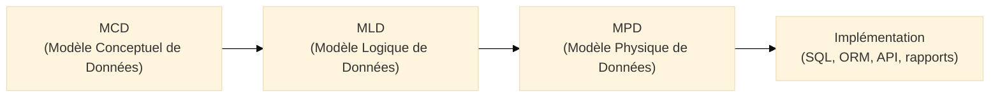
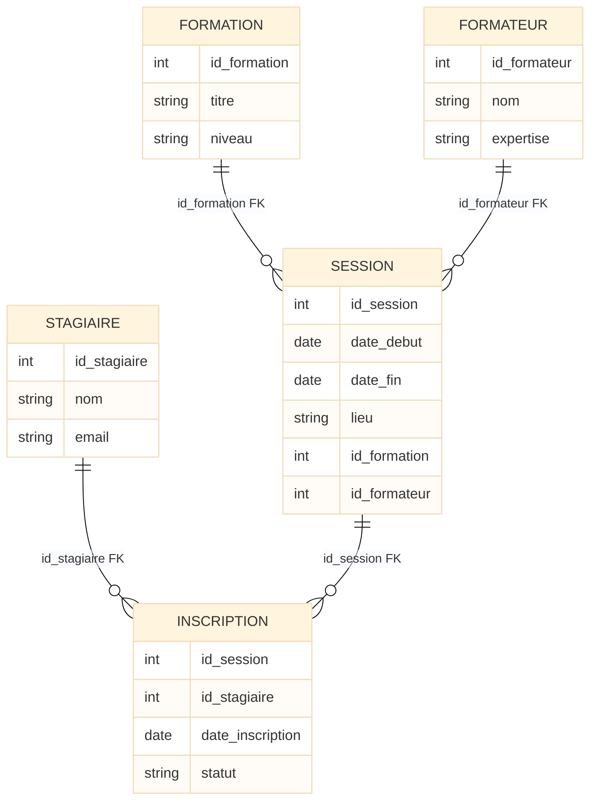
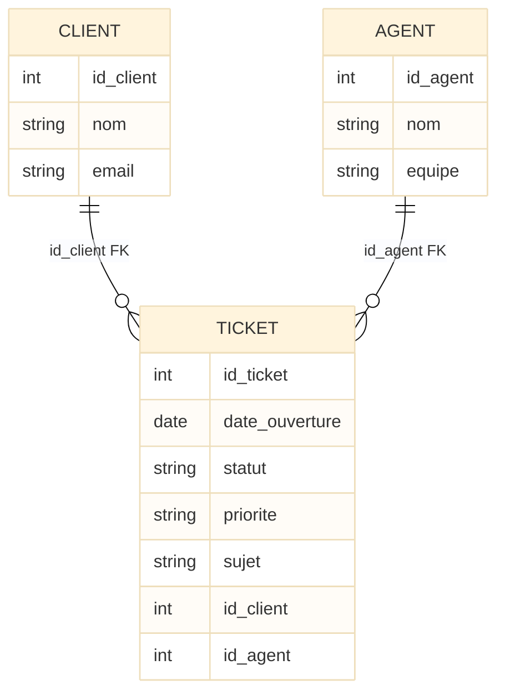

# MPD

## Introduction au Modèle Physique de Données (MPD)

!!! quote "Analogie pédagogique"
    _On garde notre **ville**. Le MCD est le **plan conceptuel** (idées, zones, fonctions). Le MLD est le **plan structurel** (parcelles, lots, rues numérotées). Le **MPD**, lui, c’est le **dossier d’exécution chantier** : types de matériaux, diamètres précis, sections de câbles, profondeur des fondations, normes électriques. **Même ville**, même logique, mais cette fois avec **tous les détails concrets** nécessaires aux équipes terrain._  

Le **Modèle Physique de Données (MPD)** est la **spécialisation concrète** du MLD pour un **SGBD donné**.  
On conserve les mêmes relations logiques, clés primaires, clés étrangères et contraintes, mais en les traduisant dans :

- des **types physiques** (`INTEGER`, `VARCHAR(255)`, `NUMERIC(10,2)`, `DATE`, `TIMESTAMP`…)  
- des **contraintes SQL explicites** (`PRIMARY KEY`, `FOREIGN KEY`, `UNIQUE`, `CHECK`, `NOT NULL`)  
- des **détails d’implémentation** (auto-incrément, index, options de stockage…)  

C’est à ce niveau que l’on commence à parler **PostgreSQL**, **MySQL/MariaDB**, **SQLite**, etc.

!!! info "Pourquoi le MPD est essentiel ?"
    - Il fixe la **réalité technique** : types, contraintes, index, options.  
    - Il sert de **base directe** aux scripts SQL (DDL), migrations, schémas ORM.  
    - Il permet d’anticiper les **impacts de performance** et les contraintes de stockage.  
    - Il est **spécifique à un SGBD**, tout en restant aligné sur le MLD.

---

## Pour repartir des bases

### 1. Ce qu’est (et n’est pas) un MPD

Un MPD **décrit le schéma tel qu’il sera réellement créé** dans un SGBD précis.  
Il contient :

- des **tables physiques** (nom réel dans le SGBD)  
- des **colonnes typées physiquement**  
- des **contraintes** (PK, FK, UNIQUE, CHECK, NOT NULL, DEFAULT)  
- des **index** et parfois des options (engine, collation, etc.)  

Un MPD **ne traite pas** :

- des requêtes applicatives (SELECT complexes, procédures, vues métier)  
- de la logique métier (règles applicatives dans le code)  
- des détails d’infrastructure (cluster, réplication, sauvegarde…) – même si le choix du SGBD y est lié

!!! note "Objectif du MPD"
    Le MPD répond à la question :  
    **“Comment implémenter concrètement le MLD dans un SGBD donné, avec des types, des contraintes et des index précis ?”**

### 2. Vocabulaire minimal

| Terme                     | Rôle                                                                 |
|--------------------------|----------------------------------------------------------------------|
| **Table physique**       | Implémentation concrète d’une relation logique du MLD               |
| **Colonne**              | Attribut typé physiquement (INTEGER, VARCHAR…)                      |
| **Type physique**        | Type de données du SGBD (INTEGER, TEXT, NUMERIC, DATE…)             |
| **PK (PRIMARY KEY)**     | Contrainte définissant l’identifiant unique d’une ligne             |
| **FK (FOREIGN KEY)**     | Contrainte garantissant la référence vers une autre table           |
| **Index**                | Structure d’optimisation des recherches                             |
| **Nullabilité**          | Fait qu’une colonne accepte ou non `NULL`                           |
| **Contrainte CHECK**     | Restriction logique sur les valeurs d’une colonne ou d’un groupe    |

---

## Où se situe le MPD dans Merise ?

On complète la chaîne déjà introduite dans nos MCD et MLD.

<small><i>Le MPD est la **traduction concrète** du MLD dans la grammaire d’un SGBD précis. À ce stade, on parle vraiment de **SQL exécutable**.</i></small>

---

## ⚠️ Parenthèse importante : NoSQL et Merise

!!! warning "Attention : **NoSQL** ≠ modèle relationnel"

Les modèles **MCD → MLD → MPD** sont conçus pour le **modèle relationnel** :

* tables, lignes, colonnes
* clés primaires, clés étrangères
* contraintes référentielles

!!! info "Dans le monde **NoSQL** (MongoDB, Cassandra, Redis, Elasticsearch, etc.)"

    * il n’y a **pas de clés étrangères** gérées par le moteur,
    * les données sont souvent **dé-normalisées** (documents imbriqués, duplication contrôlée),
    * les **relations** sont gérées **par l’application**, pas par le SGBD.

Vous pouvez **réutiliser le MCD** comme vision métier même pour un système NoSQL, mais la dérivation MLD/MPD **ne s’applique pas telle quelle**.
**Le design NoSQL** répond à d’autres contraintes (_scalabilité horizontale_, _latence_, _modèle d’accès aux données_).

---

## Principes de passage MLD → MPD

### 1. Choix des types physiques

À partir des types logiques (`int`, `string`, `date`, `decimal`), on choisit :

* un **type général** pour un MPD générique (ANSI SQL)
* un **type concret** pour chaque SGBD (PostgreSQL, MySQL, SQLite…)

Exemples classiques :

| Type logique | Générique SQL   | PostgreSQL      | MySQL/MariaDB   | SQLite3          |
| ------------ | --------------- | --------------- | --------------- | ---------------- |
| entier       | `INTEGER`       | `INTEGER`       | `INT`           | `INTEGER`        |
| texte court  | `VARCHAR(100)`  | `VARCHAR(100)`  | `VARCHAR(100)`  | `TEXT`           |
| texte long   | `TEXT`          | `TEXT`          | `TEXT`          | `TEXT`           |
| date         | `DATE`          | `DATE`          | `DATE`          | `TEXT`/`DATE`*   |
| montant      | `NUMERIC(10,2)` | `NUMERIC(10,2)` | `DECIMAL(10,2)` | `REAL`/`NUMERIC` |

<small><i>*SQLite ne possède pas un système de types strict comme les SGBDR classiques, mais on peut conserver une discipline de typage logique.</i></small>

### 2. Nullabilité et contraintes

Pour chaque colonne, on décide :

* `NOT NULL` si la donnée est **obligatoire** métier (ex : `date_commande`)
* `NULL` autorisé si la donnée est optionnelle (ex : `date_livraison` non encore connue)

Les contraintes typiques :

* `PRIMARY KEY`
* `FOREIGN KEY … REFERENCES …`
* `UNIQUE` (ex : email unique)
* `CHECK` (ex : `quantite > 0`, `prix >= 0`)

### 3. Identifiants : naturels vs techniques

Deux options :

* **Identifiant naturel** : ex. `numero_client` existant dans le métier
* **Identifiant technique** : ex. `id_client` auto-incrémenté

En pratique, pour la pédagogie et la simplicité :

* on garde des `id_xxx` en **clé technique** (PK)
* on met les identifiants métier en **colonnes uniques** si besoin

### 4. Index et performances

Le MPD est aussi le moment où l’on prévoit :

* des **index** sur les FK (presque systématique)
* des index sur les colonnes très filtrées (`email`, `date_commande`, `statut`)

On ne va pas détailler l’optimisation ici, mais le MPD est l’endroit où l’on **note** ces décisions.

### 5. Conventions MPD utilisées dans ce cours

Dans toute la suite de la documentation, nous appliquons les conventions suivantes :

- Les noms de tables sont écrits en **MAJUSCULE** dans les schémas génériques (`CLIENT`, `COMMANDE`),  
  et en *minuscules* dans les exemples SQL concrets (module `mpd-to-sql`).
- Les identifiants sont systématiquement de la forme `id_xxx` et servent de **clé primaire technique**.
- Sauf mention contraire, une clé étrangère (`id_client`, `id_formateur`, etc.) est **NOT NULL** :
  la relation est donc obligatoire du point de vue métier.
- Quand une unicité métier est importante (par exemple l’`email`), elle est signalée dans les tableaux
  et implémentée par une contrainte `UNIQUE` au niveau SQL.

---

## Fil rouge : du MLD “commandes” au MPD

On repart de ton MLD “CLIENT – COMMANDE – PRODUIT – LIGNE_COMMANDE”.

### Rappel du MLD (structure logique)

* `CLIENT(id_client, nom, email)`
* `COMMANDE(id_commande, date_commande, statut, id_client)`
* `PRODUIT(id_produit, libelle, prix)`
* `LIGNE_COMMANDE(id_commande, id_produit, quantite, prix_unitaire)`

  * PK : `(id_commande, id_produit)`
  * FK : `id_commande → COMMANDE`, `id_produit → PRODUIT`

### Spécification MPD (vue générique)

On choisit des types physiques génériques :

**CLIENT**

| Colonne     | Type           | Contraintes                          |
| ----------- | -------------- | ------------------------------------ |
| `id_client` | `INTEGER`      | `PRIMARY KEY`                        |
| `nom`       | `VARCHAR(100)` | `NOT NULL`                           |
| `email`     | `VARCHAR(255)` | `NOT NULL`  (+ option `UNIQUE`) |

**COMMANDE**

| Colonne         | Type          | Contraintes                                     |
| --------------- | ------------- | ----------------------------------------------- |
| `id_commande`   | `INTEGER`     | `PRIMARY KEY`                                   |
| `date_commande` | `DATE`        | `NOT NULL`                                      |
| `statut`        | `VARCHAR(30)` | `NOT NULL`                                      |
| `id_client`     | `INTEGER`     | `NOT NULL`, `FOREIGN KEY` → `CLIENT(id_client)` |

**PRODUIT**

| Colonne      | Type            | Contraintes                   |
| ------------ | --------------- | ----------------------------- |
| `id_produit` | `INTEGER`       | `PRIMARY KEY`                 |
| `libelle`    | `VARCHAR(150)`  | `NOT NULL`                    |
| `prix`       | `NUMERIC(10,2)` | `NOT NULL`, `CHECK prix >= 0` |

**LIGNE_COMMANDE**

| Colonne         | Type            | Contraintes                                            |
| --------------- | --------------- | ------------------------------------------------------ |
| `id_commande`   | `INTEGER`       | `NOT NULL`, `FOREIGN KEY` → `COMMANDE(id_commande)`    |
| `id_produit`    | `INTEGER`       | `NOT NULL`, `FOREIGN KEY` → `PRODUIT(id_produit)`      |
| `quantite`      | `INTEGER`       | `NOT NULL`, `CHECK quantite > 0`                       |
| `prix_unitaire` | `NUMERIC(10,2)` | `NOT NULL`, `CHECK prix_unitaire >= 0`                 |
| **PK**          |                 | `PRIMARY KEY (id_commande, id_produit)` (clé composée) |

---

## Deux exemples de MPD concrets

### Exemple 1 – MPD pour la gestion de formation

On part du MLD :

* `FORMATION(id_formation, titre, niveau)`
* `SESSION(id_session, date_debut, date_fin, lieu, id_formation, id_formateur)`
* `FORMATEUR(id_formateur, nom, expertise)`
* `STAGIAIRE(id_stagiaire, nom, email)`
* `INSCRIPTION(id_stagiaire, id_session, date_inscription, statut)`

  * PK : `(id_stagiaire, id_session)`

On propose une déclinaison MPD générique :

**FORMATION**

| Colonne        | Type           | Contraintes   |
| -------------- | -------------- | ------------- |
| `id_formation` | `INTEGER`      | `PRIMARY KEY` |
| `titre`        | `VARCHAR(150)` | `NOT NULL`    |
| `niveau`       | `VARCHAR(50)`  | `NOT NULL`    |

**FORMATEUR**

| Colonne        | Type           | Contraintes   |
| -------------- | -------------- | ------------- |
| `id_formateur` | `INTEGER`      | `PRIMARY KEY` |
| `nom`          | `VARCHAR(100)` | `NOT NULL`    |
| `expertise`    | `VARCHAR(150)` | `NOT NULL`    |

**STAGIAIRE**

| Colonne        | Type           | Contraintes   |
| -------------- | -------------- | ------------- |
| `id_stagiaire` | `INTEGER`      | `PRIMARY KEY` |
| `nom`          | `VARCHAR(100)` | `NOT NULL`    |
| `email`        | `VARCHAR(255)` | `NOT NULL`    |

**SESSION**

| Colonne        | Type           | Contraintes                                |
| -------------- | -------------- | ------------------------------------------ |
| `id_session`   | `INTEGER`      | `PRIMARY KEY`                              |
| `date_debut`   | `DATE`         | `NOT NULL`                                 |
| `date_fin`     | `DATE`         | `NOT NULL`                                 |
| `lieu`         | `VARCHAR(150)` | `NOT NULL`                                 |
| `id_formation` | `INTEGER`      | `NOT NULL`, FK → `FORMATION(id_formation)` |
| `id_formateur` | `INTEGER`      | `NOT NULL`, FK → `FORMATEUR(id_formateur)` |

**INSCRIPTION**

| Colonne            | Type          | Contraintes                                |
| ------------------ | ------------- | ------------------------------------------ |
| `id_stagiaire`     | `INTEGER`     | `NOT NULL`, FK → `STAGIAIRE(id_stagiaire)` |
| `id_session`       | `INTEGER`     | `NOT NULL`, FK → `SESSION(id_session)`     |
| `date_inscription` | `DATE`        | `NOT NULL`                                 |
| `statut`           | `VARCHAR(30)` | `NOT NULL`                                 |
| **PK**             |               | `PRIMARY KEY (id_stagiaire, id_session)`   |

Vue ER “physique” (logique + types) :

---

### Exemple 2 – MPD pour le support client (tickets)

MLD de départ :

* `CLIENT(id_client, nom, email)`
* `AGENT(id_agent, nom, equipe)`
* `TICKET(id_ticket, date_ouverture, statut, priorite, sujet, id_client, id_agent)`

Avant de détailler la table **TICKET**, une précision métier importante :

!!! note
    Dans ce modèle, **tout ticket est obligatoirement assigné à un agent**.  
    La clé étrangère `id_agent` est donc **NOT NULL** dans le MPD.  
    Si l’on voulait permettre des tickets “non assignés” (cas fréquent en helpdesk),  
    il suffirait de rendre `id_agent` *nullable* (`NULL`) et d’ajuster la contrainte.

MPD générique :

**CLIENT**

| Colonne     | Type           | Contraintes   |
| ----------- | -------------- | ------------- |
| `id_client` | `INTEGER`      | `PRIMARY KEY` |
| `nom`       | `VARCHAR(100)` | `NOT NULL`    |
| `email`     | `VARCHAR(255)` | `NOT NULL`    |

**AGENT**

| Colonne    | Type           | Contraintes   |
| ---------- | -------------- | ------------- |
| `id_agent` | `INTEGER`      | `PRIMARY KEY` |
| `nom`      | `VARCHAR(100)` | `NOT NULL`    |
| `equipe`   | `VARCHAR(100)` | `NOT NULL`    |

**TICKET**

| Colonne          | Type           | Contraintes                          |
| ---------------- | -------------- | ------------------------------------ |
| `id_ticket`      | `INTEGER`      | `PRIMARY KEY`                        |
| `date_ouverture` | `DATE`         | `NOT NULL`                           |
| `statut`         | `VARCHAR(30)`  | `NOT NULL`                           |
| `priorite`       | `VARCHAR(20)`  | `NOT NULL`                           |
| `sujet`          | `VARCHAR(255)` | `NOT NULL`                           |
| `id_client`      | `INTEGER`      | `NOT NULL`, FK → `CLIENT(id_client)` |
| `id_agent`       | `INTEGER`      | `NOT NULL`, FK → `AGENT(id_agent)`   |

---

## Le mot de la fin

!!! quote

    Le **MPD** est la dernière étape de modélisation avant le SQL exécutable.  
    C’est lui qui fixe **noir sur blanc** les types, les contraintes et les index qui feront la différence entre une base “qui tient” et un marécage de données.

    Un bon MPD :

    * reste fidèle au **MLD** (aucun risque “perdu en chemin”) ;
    * choisit des **types adaptés** au SGBD de référence ;
    * explicite clairement PK, FK, `NOT NULL`, `UNIQUE`, `CHECK` et les **index essentiels** ;
    * prépare les scripts DDL, les migrations et la configuration ORM.

    À l’inverse, un MPD bâclé, c’est :

    * des contraintes oubliées (ou réimplémentées dans le code) ;
    * des incohérences silencieuses dans les données ;
    * des performances dégradées, difficiles à corriger après coup.

    > **MCD = vocabulaire métier.  
    > MLD = grammaire relationnelle.  
    > MPD = phrase SQL complète prête à être exécutée.**  

    Une fois ce triptyque maîtrisé, vous pouvez aborder sereinement la suite :  
    **optimisation, partitionnement, réplication, sécurité des données, et… NoSQL, mais avec une compréhension solide du modèle relationnel.**

 