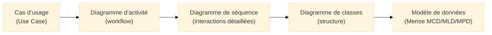
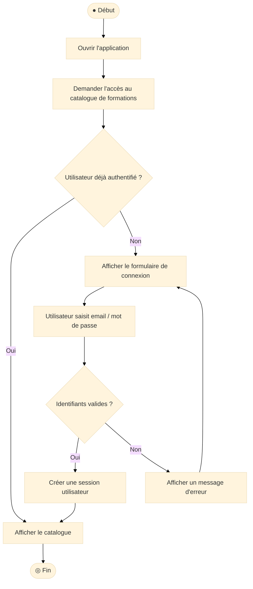
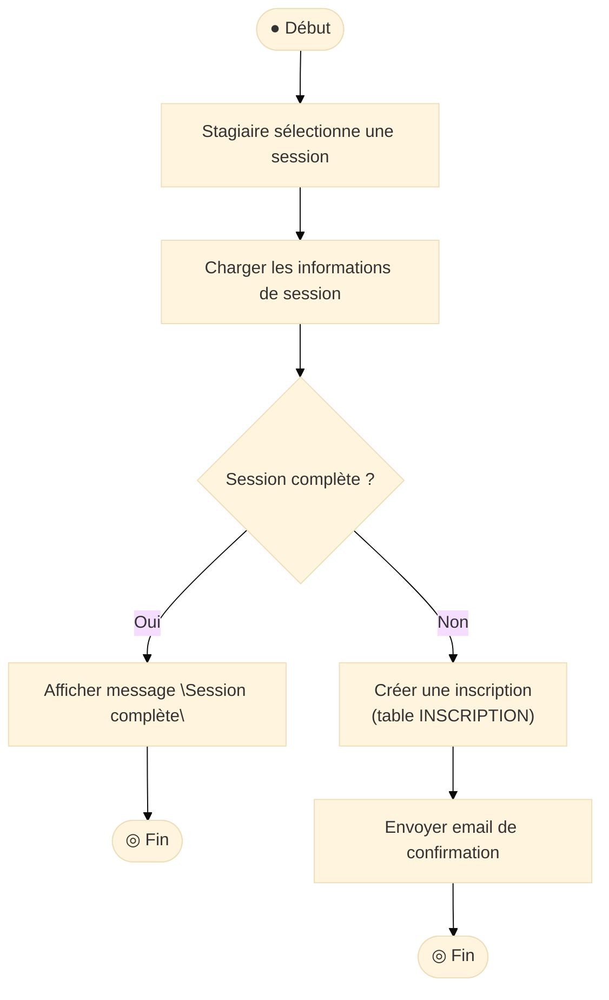
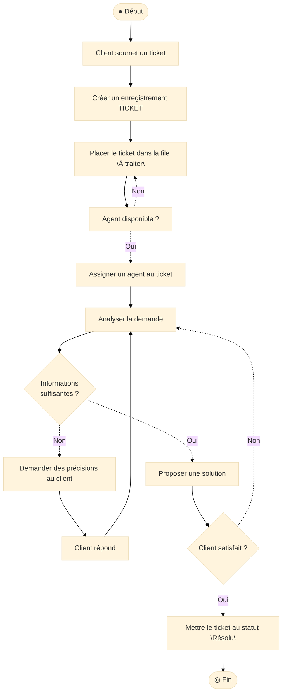

# Diagramme d’activité (Activity Diagram)

## Introduction au diagramme d’activité

!!! quote "Analogie pédagogique"
    _Imaginez un **processus administratif** : un dossier arrive, il est **vérifié**, puis **validé** ou **refusé**, parfois il part en **complément d’information**, d’autres fois il suit plusieurs étapes **en parallèle** (contrôle financier, contrôle juridique).  
    Le **diagramme d’activité UML** est la carte de ce **workflow** : il montre les **étapes**, les **décisions**, les **boucles** et les parties **parallèles** du processus._

Le **diagramme d’activité** est un diagramme **comportemental**[^comportemental] d’UML.  
Il permet de représenter :

- des **processus métier** (inscription, commande, traitement de ticket, onboarding…),  
- des **flux techniques** (pipeline CI/CD, traitement de fichier, ETL),  
- des **parcours utilisateurs** (authentification, paiement, etc.).

Il répond à la question :

> **Quelles sont les étapes d’un processus, dans quel ordre, avec quelles décisions et quelles branches ?**

---

## Pour repartir des bases

### 1. Ce qu’est (et n’est pas) un diagramme d’activité

Un diagramme d’activité montre :

- un **point de départ** (nœud initial),  
- des **actions** / activités,  
- des **transitions** (flèches),  
- des **décisions** (`if / else`),  
- des **jonctions** (plusieurs branches se rejoignent),  
- des **fork / join** (parallélisme),  
- un ou plusieurs **points de fin**.

Il ne montre pas :

- la structure des objets (c’est le rôle du **diagramme de classes**),  
- la chronologie détaillée entre objets (c’est le rôle du **diagramme de séquence**),  
- la vie interne d’un objet (c’est plutôt la **machine à états**).

!!! note "Objectif du diagramme d’activité"
    Le diagramme d’activité répond à :  
    **“Quelles étapes successives, quelles décisions et quels chemins possibles composent ce processus ?”**

### 2. Vocabulaire minimal

| Terme             | Rôle                                                                                 |
|-------------------|--------------------------------------------------------------------------------------|
| **Action / activité** | Étape du processus (ex. “Vérifier les identifiants”, “Créer un ticket”)         |
| **Transition**    | Flèche indiquant le passage d’une étape à l’autre                                   |
| **Décision**      | Nœud de branchement (`condition vraie / fausse`)                                    |
| **Fork / Join**   | Séparation et synchronisation de branches parallèles                                |
| **Nœud initial**  | Point de départ du flux                                                             |
| **Nœud final**    | Point de terminaison du flux                                                        |
| **Swimlane**      | “Couloir” représentant un **rôle** ou un **service** responsable d’un ensemble d’actions |

---

## Pour qui, et quand utiliser un diagramme d’activité ?

-   :lucide-users:{ .lg .middle } **Pour qui ?**

    ---

    - Chefs de projet / Product Owners  
    - Analysts métier / Business Analysts  
    - Développeurs / architectes qui doivent **clarifier un processus complexe**  
    - Équipes qualité / QA pour dériver des **scénarios de test**  
    - Équipes cyber pour analyser les **chemins d’exécution sensibles**  

-   :lucide-clock:{ .lg .middle } **Quand l’utiliser ?**

    ---

    - Lors de la modélisation d’un **processus métier** transverse  
    - Pour expliciter le fonctionnement d’un **cas d’usage critique**  
    - Pour documenter un **workflow applicatif** (support, formation, facturation)  
    - Pour préparer la mise en place d’un **moteur de workflow** ou d’une **orchestration**  

-   :lucide-pencil-ruler:{ .lg .middle } **Comment l’utiliser concrètement ?**

    ---

    1. Partir d’un **cas d’usage** ou d’un **processus métier** clairement identifié  
    2. Lister les **étapes** dans l’ordre logique  
    3. Identifier les **décisions** et les **chemins alternatifs**  
    4. Repérer les parties pouvant s’exécuter **en parallèle**  
    5. Placer un **début clair** et une ou plusieurs **fins explicites**  

-   :lucide-activity:{ .lg .middle } **Impact direct**

    ---

    - Vision partagée du **processus réel**, au-delà des impressions  
    - Excellent support pour les **tests** et la **documentation**  
    - Base solide pour les optimisations (suppression de redites, automatisation)  
    - Point d’entrée pour l’analyse de risques sur les **chemins d’exécution**  

---

## Lien avec les autres diagrammes UML et Merise

Le diagramme d’activité se positionne clairement dans la chaîne suivante :

* **Cas d’usage** : “quoi” du point de vue des acteurs.
* **Diagramme d’activité** : “comment globalement”, sous forme de **flux**.
* **Diagramme de séquence** : “comment précisément”, message par message.
* **Diagramme de classes + Merise** : “quelles structures” supportent ce comportement.

---

## Ex. 1 – Authentification et accès à une formation

On reste sur un scénario simple mais très courant : accès à une plateforme de formation.

### Scénario métier

1. L’utilisateur ouvre l’application.
2. Il tente d’accéder au catalogue.
3. Le système vérifie s’il est authentifié.
4. Si non, il doit se connecter.
5. En cas de succès, il accède au contenu.
6. En cas d’échec, il voit un message d’erreur.

### Diagramme d’activité

<small><i>Ce diagramme met en avant les **décisions** (authentifié ou non, identifiants valides ou non) et les **boucles naturelles** (retour au formulaire après erreur).</i></small>

---

## Ex. 2 – Inscription à une session (aligné Merise `INSCRIPTION`)

Ici, on se rapproche de votre modèle Merise `FORMATION / SESSION / STAGIAIRE / INSCRIPTION`.

### Scénario métier

1. Le stagiaire choisit une session.
2. Le système vérifie la disponibilité.
3. Si la session est complète, le stagiaire est informé.
4. Sinon, une inscription est créée, et une confirmation est envoyée.

### Diagramme d’activité

<small><i>Le lien avec Merise est explicite : l’action “Créer une inscription” correspond à une écriture dans la table `INSCRIPTION`. Le diagramme d’activité clarifie les **conditions fonctionnelles** qui mènent à cette écriture.</i></small>

---

## Ex. 3 – Traitement d’un ticket support (aligné Merise `TICKET`)

On passe au domaine **support client**, en cohérence avec votre modèle `CLIENT / AGENT / TICKET`.

### Scénario métier

1. Le client ouvre un ticket.
2. Le ticket est placé dans une file.
3. Un agent le prend en charge.
4. L’agent traite le ticket, peut demander des informations complémentaires.
5. Le ticket finit par être résolu ou clôturé.

### Diagramme d’activité

<small><i>Le diagramme d’activité met en évidence les **boucles** (demande d’informations complémentaires) et les **états logiques** qui se reflètent dans la colonne `statut` de la table `TICKET`.</i></small>

---

## Bonnes pratiques pour les diagrammes d’activité

* Rester **lisible** : un diagramme qui ne tient pas sur un écran sans zoom doit être **découpé** par sous-processus.

* Nommer les actions avec des **verbes à l’infinitif** ou des **phrases courtes** :
  `Vérifier identifiants`, `Créer inscription`, `Envoyer notification`.

* Ne pas hésiter à **factoriser** les parties récurrentes (par exemple, un sous-processus “Authentification réussie”).

* Utiliser les diagrammes d’activité pour :

  * préparer les **tests fonctionnels**,
  * expliciter les **chemins d’erreur**,
  * identifier les **zones de contrôle** importantes (journalisation, validation, sécurité).

* Aligner systématiquement avec :

  * les **cas d’usage** concernés,
  * les **diagrammes de séquence** (pour les échanges détaillés),
  * les **modèles de données Merise** (quelles tables sont lues/écrites à quelles étapes).

---

## Mot de la fin

!!! quote
    Le **diagramme d’activité UML** est l’outil idéal pour rendre un processus **visible, discutable et testable**.
    Il donne une vue opérationnelle claire : quelles étapes, quelles décisions, quelles issues possibles.

    Utilisé avec les cas d’usage, les diagrammes de séquence et vos modèles Merise,  
    il permet de construire un système **cohérent**, **documenté** et **auditables** sur toute sa durée de vie.

---

[^comportemental]: En UML, les diagrammes comportementaux regroupent notamment les **cas d’usage**, les **diagrammes d’activité** et les **machines à états**, qui décrivent ce que fait le système plutôt que sa structure statique.
