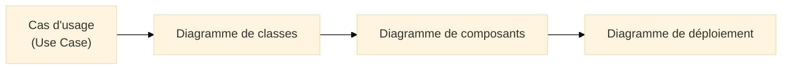
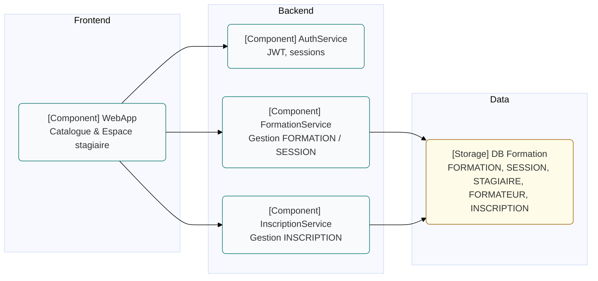
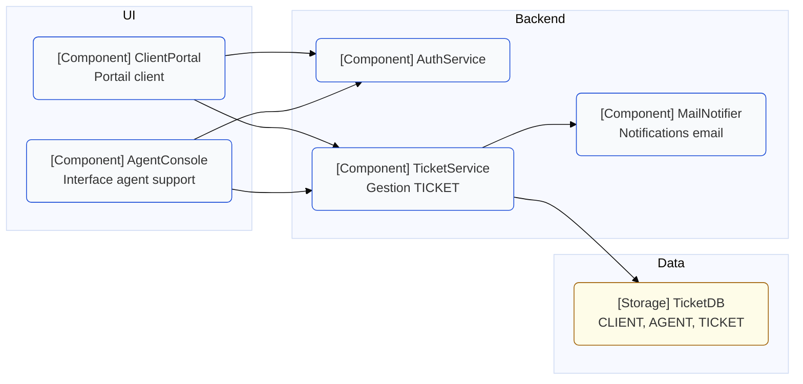
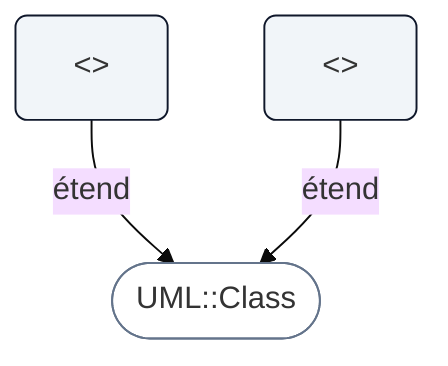
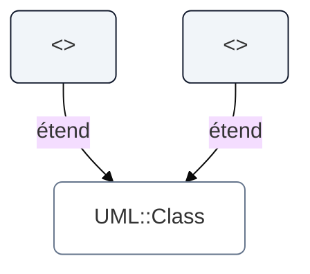
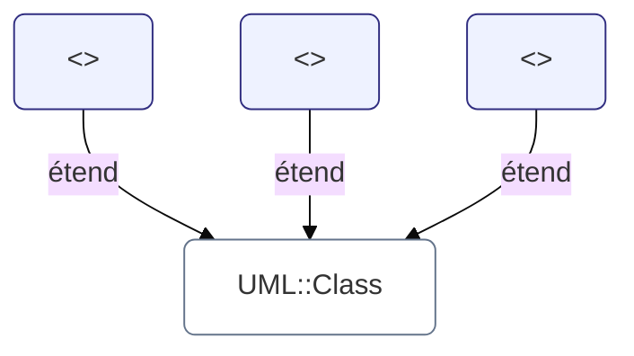
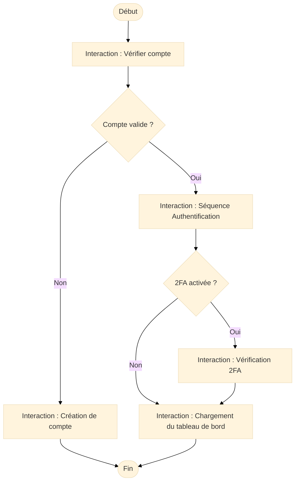
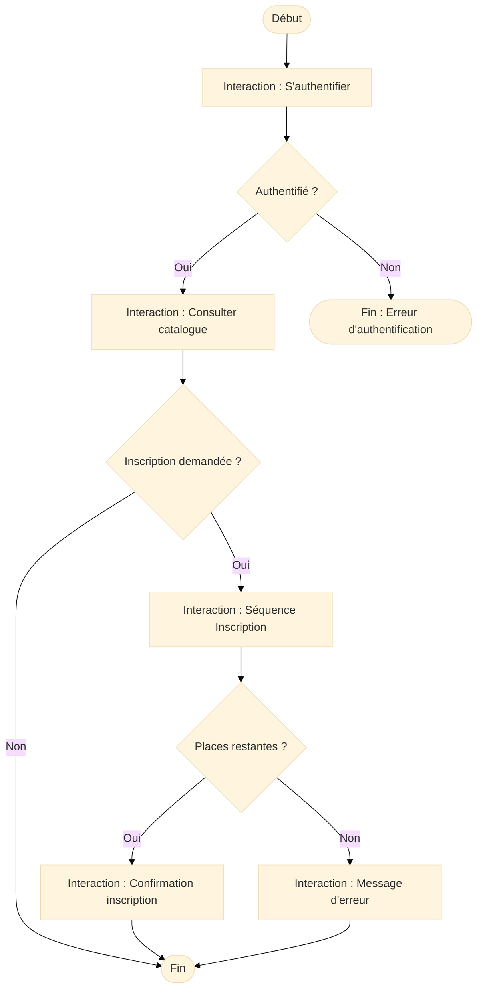
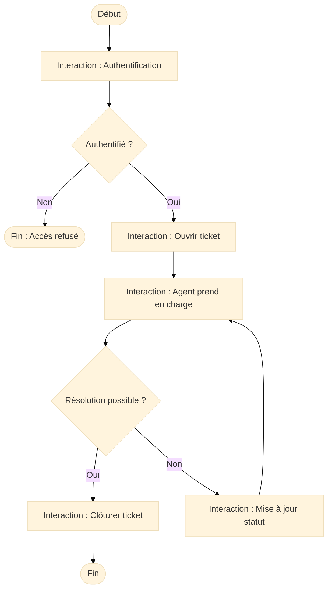

# Diagrammes UML avancés : Composants, Profils et Overview

!!! quote "Fil conducteur"
    _Les diagrammes UML de base (cas d’usage, classes, séquence) ne suffisent pas toujours à décrire un système réel.  
    Les diagrammes de **composants**, de **profils** et d’**overview d’interaction** permettent d’aller plus loin :  
    structure d’architecture, extension du langage UML, orchestration de scénarios complexes._

---

## 1. Diagramme de composants (Component Diagram)

### 1.1 Introduction

!!! quote "Analogie pédagogique"
    _Imaginez un **système Hi-Fi modulaire** : un ampli, un lecteur, des enceintes, des câbles qui relient les éléments.  
    Chaque bloc a un rôle précis, expose des **connectiques standardisées** et peut parfois être remplacé par un autre modèle compatible.  
    Le **diagramme de composants UML** représente exactement cela pour un système logiciel : des **blocs fonctionnels**, leurs **interfaces** et leurs **dépendances**._

Le **diagramme de composants (Component Diagram)** est un diagramme structurel UML[^uml] qui décrit l’**architecture logique** d’un système :

- composants applicatifs, modules, services,
- interfaces fournies et requises,
- dépendances entre blocs,
- parfois le mapping vers les artefacts déployables (binaires, packages, conteneurs).

Il répond à des questions comme :

- Quels sont les **blocs principaux** de l’application (front, API, services internes, adaptateurs) ?  
- Quels composants **dépendent** les uns des autres ?  
- Par où transitent les **flux fonctionnels critiques** (authentification, paiement, support) ?  
- Quelles interfaces sont **publiques** et lesquelles sont internes ?

Là où le **diagramme de classes** décrit la structure interne (types, attributs, relations), le diagramme de composants s’intéresse aux **gros blocs** et à leurs **interfaces**.

---

### 1.2 Vocabulaire minimal (composants)

| Terme                   | Rôle                                                                                   |
|-------------------------|----------------------------------------------------------------------------------------|
| **Composant**           | Bloc logiciel cohérent (service, module, microservice, bibliothèque…)                 |
| **Interface fournie**   | Contrat exposé par un composant (`IFormationAPI`, `ITicketService`)[^interfaces]      |
| **Interface requise**   | Contrat dont le composant a besoin (`IAuthService`, `IMailService`)                   |
| **Dépendance**          | Relation “utilise / consomme” entre deux composants                                   |
| **Port**                | Point de connexion d’un composant vers une interface                                  |
| **Artefact**            | Unité de déploiement (JAR, image Docker, package npm, binaire Go, etc.)               |

---

### 1.3 Pour qui, et quand utiliser ce diagramme ?

-   :lucide-users:{ .lg .middle } **Pour qui ?**

    ---

    - Architectes logiciels et responsables techniques  
    - Équipes DevSecOps et SRE  
    - Développeurs backend / microservices  
    - Équipes d’intégration (API, ESB, bus d’événements)  
    - Consultants cyber qui doivent comprendre les **surfaces d’exposition**

-   :lucide-clock:{ .lg .middle } **Quand l’utiliser ?**

    ---

    - Lors de la définition ou refonte d’une **architecture applicative**  
    - Avant d’introduire des **microservices** ou un **API Gateway**  
    - Pour préparer des **audits de sécurité** ou des **analyses de risques**  
    - Pour documenter les **dépendances internes** d’un système critique  

---

### 1.4 Lien avec les autres diagrammes

* Les **cas d’usage** définissent les fonctionnalités attendues.
* Le **diagramme de classes** décrit les types et relations internes.
* Le **diagramme de composants** regroupe ces classes en **blocs applicatifs**.
* Le **diagramme de déploiement** indique **où** ces blocs tournent (serveurs, conteneurs…).

---

### 1.5 Ex. 1 – Plateforme de formation (FORMATION / SESSION)

Contexte Merise : `FORMATION`, `SESSION`, `STAGIAIRE`, `FORMATEUR`, `INSCRIPTION`.
Cas d’usage UML : “S’authentifier”, “Consulter le catalogue”, “S’inscrire”.

**À retenir :**

* `WebApp` consomme trois services : `AuthService`, `FormationService`, `InscriptionService`.
* `FormationService` et `InscriptionService` partagent la même base alignée avec vos tables Merise.
* Le diagramme sert autant à discuter **architecture** qu’**exposition de services** (et donc sécurité).

---

### 1.6 Ex. 2 – Support client / tickets (CLIENT / AGENT / TICKET)

**Point clé :** même services (`AuthService`, `TicketService`) pour deux UIs différentes, avec un composant `MailNotifier` spécialisé.

---

### 1.7 Bonnes pratiques – Composants

* Garder un **niveau de grain cohérent** : ni monolithe, ni poussière de micro-services.
* Nommer les composants par **responsabilité métier** (`TicketService`, `InscriptionService`).
* Surveiller les **cycles de dépendances** (A dépend de B qui dépend de A).
* Aligner les composants sur :

  * cas d’usage majeurs,
  * **bounded contexts** DDD[^ddd],
  * pipelines CI/CD (build / test / déploiement).

---

## 2. Diagramme de profils (Profile Diagram)

### 2.1 Introduction

!!! quote "Analogie pédagogique"
    *Imaginez une **boîte à outils personnalisée** : vous partez d’un outil standard, puis vous ajoutez des embouts spécifiques pour vos usages. 
Le **diagramme de profils UML** fait la même chose avec UML : il permet de créer un **dialecte UML** adapté à vos contextes (cyber, DevSecOps, RGPD, DDD…).*

Le **diagramme de profils (Profile Diagram)** permet d’**étendre UML** grâce à :

* des **stéréotypes**,
* des **tagged values** (propriétés supplémentaires),
* des **contraintes**,
* une spécialisation du **métamodèle UML**.

Il est très utilisé pour :

* la cybersécurité (profils dédiés à l’analyse de risques),
* les architectures SI (SOA, microservices, DDD),
* les processus métier (BPM, conformité réglementaire),
* les organisations qui veulent **normer leur modélisation**.

---

### 2.2 Ce qu’est un profil UML

Un **profil UML** est un paquetage spécialisé contenant :

* des **stéréotypes**,
* des **valeurs taguées**,
* des **contraintes métier**,
* des **extensions** d’éléments UML standard.

Il permet de définir des concepts comme :

* `<<API>>`, `<<Service>>`, `<<Entity>>`,
* `<<SensitiveData>>`, `<<CriticalComponent>>`,
* `<<BoundedContext>>`, `<<RiskSource>>`, `<<RGPD-PersonalData>>`.

Ces stéréotypes ajoutent du sens **métier** ou **organisationnel**.

Un profil **n’ajoute pas** de nouvelle syntaxe graphique : vous étendez surtout la **sémantique** UML[^metamodel].

---

### 2.3 Exemple minimal de profil UML (vue générique)

Vous pourrez ensuite annoter dans vos diagrammes :

* `TicketService <<CriticalComponent>>`
* `Utilisateur.email <<SensitiveData>>`

---

### 2.4 Ex. 1 – Profil pour la plateforme de formation

Objectif : identifier les **données personnelles** (RGPD[^rgpd]) et les **composants critiques**.

Exemples d’annotations possibles :

* `Stagiaire <<PersonalData>>`
* `AuthService <<CriticalComponent>>`
* `Inscription.dateInscription <<PersonalData>>`

---

### 2.5 Ex. 2 – Profil pour le support client / tickets

Objectif :

* identifier les **données sensibles**,
* marquer les **services soumis à un SLA**,
* distinguer les éléments **auditables**.

Exemples d’usage :

* `Ticket.priorite <<SensitiveField>>`
* `TicketService <<SLA-Critical>>`
* `Agent <<Auditable>>`

---

### 2.6 Bonnes pratiques – Profils

* Ne créer un stéréotype que s’il apporte **une vraie valeur métier**.
* Limiter un profil à **un domaine fonctionnel** (cyber, RGPD, architecture, data).
* Documenter clairement les **valeurs taguées** (type, contraintes).
* Préférer des stéréotypes **courts et parlants** : `<<Entity>>`, `<<Service>>`, `<<PersonalData>>`, etc.
* Réutiliser les profils existants (SysML, MARTE, BPMN…) lorsque c’est pertinent.

---

## 3. Diagramme d’ensemble d’interaction (Interaction Overview)

### 3.1 Introduction

!!! quote "Analogie pédagogique"
    *Imaginez le **plan d’un film** : une grande carte narrative qui montre l’enchaînement des scènes, les ramifications possibles et les transitions.
    Le **diagramme d’ensemble d’interaction** joue ce rôle pour vos interactions UML : il orchestre plusieurs **diagrammes de séquence**, **diagrammes d’activité** et **interactions alternatives** pour visualiser un processus complet.*

Le **diagramme d’ensemble d’interaction (Interaction Overview Diagram)** est un diagramme UML avancé qui permet de **coordonner plusieurs interactions** en un flux global.
Il combine :

* des **nœuds d’activité**,
* des références à des **diagrammes de séquence**,
* des **décisions**, **forks**, **joins**, **boucles**,
* des **interactions conditionnelles**.

Son rôle : offrir une **vue macro** des interactions, lorsque qu’un seul diagramme de séquence deviendrait illisible.

---

### 3.2 Visualisation Mermaid (simulation)

Mermaid ne supportant pas ce diagramme nativement, on le **simule avec un flowchart**.

Ce schéma représente un **enchaînement d’interactions**, pas le détail des messages.

---

### 3.3 Ex. 1 – Overview pour la plateforme de formation

Scénario global :

1. Authentification
2. Consultation du catalogue
3. Inscription à une session
4. Confirmation / erreurs / boucles

Chaque bloc (`Interaction : ...`) peut renvoyer vers un **diagramme de séquence détaillé** dans une autre page.

---

### 3.4 Ex. 2 – Overview pour le support client / tickets

Scénario :

1. Le client s’authentifie
2. Il ouvre un ticket
3. Un agent le prend en charge
4. Le statut évolue
5. Le ticket se clôture

Diagramme utile pour :

* discuter des **chemins alternatifs** (résolution immédiate vs multiples mises à jour),
* identifier les **points critiques** (auth, prise en charge, clôture),
* préparer des **tests bout-en-bout**.

---

### 3.5 Bonnes pratiques – Overview

* L’utiliser uniquement pour des **processus complexes**.
* Toujours faire référence à des **diagrammes de séquence ou d’activité** détaillés.
* Ne pas le surcharger : c’est un diagramme de **synthèse**, pas de détail.
* S’assurer que chaque interaction renvoie à une **fonction métier claire**.
* Modéliser explicitement les **boucles** et **conditions** importantes (erreurs, escalades).

---

## Mot de la fin

!!! quote

    Les **diagrammes de composants**, de **profils** et d’**overview d’interaction** complètent les briques UML classiques.  
    Ensemble, ils permettent de décrire :  
    - l’**architecture logique** (composants),  
    - le **dialecte UML** propre à votre organisation (profils),  
    - les **scénarios complexes** orchestrant plusieurs interactions (overview).

    Dans OmnyDocs, vous pouvez :

    - partir de vos **cas d’usage** et **diagrammes de classes**,  
    - élever la vue avec les **composants**,  
    - enrichir la sémantique avec des **profils UML**,  
    - synthétiser les flux critiques avec un **overview d’interaction**.

    L’objectif n’est pas de multiplier les diagrammes,
    mais de disposer d’un **jeu d’outils cohérent** pour raconter clairement
    comment votre système fonctionne, évolue, et se sécurise.

[^uml]: UML (Unified Modeling Language) est un langage de modélisation standardisé par l’OMG, couvrant les aspects structurels, comportementaux et d’interaction d’un système logiciel.

[^interfaces]: Les interfaces fournies / requises permettent de modéliser explicitement les contrats entre composants : ce qu’un composant expose et ce dont il dépend.

[^ddd]: Le **Domain-Driven Design (DDD)** recommande de découper le système selon des “bounded contexts” métier. Le diagramme de composants est un excellent support pour les représenter.

[^metamodel]: UML repose sur un métamodèle défini par l’OMG. Les profils UML permettent d’en spécialiser des portions sans créer un nouveau langage complet.

[^rgpd]: Le RGPD impose d’identifier les données personnelles, leurs finalités, les durées de conservation et les mesures de protection associées.

