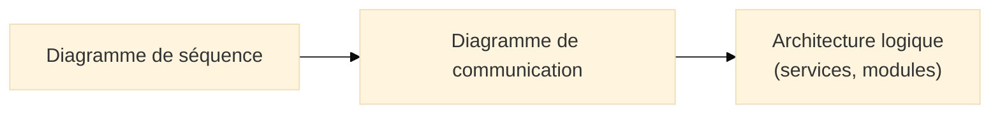
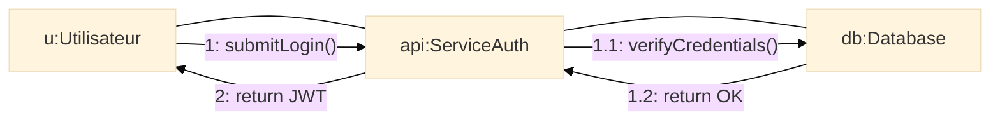
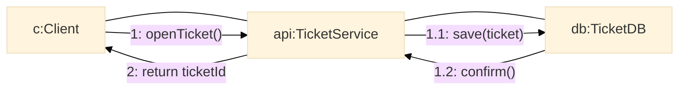

# Diagramme de communication (Communication Diagram)

## Introduction au diagramme de communication

!!! quote "Analogie pédagogique"
*Imaginez un **plan de circulation** dans lequel chaque rond-point symbolise un acteur du système et chaque flèche représente un véhicule qui transporte un message. Le **diagramme de communication** montre précisément **qui parle à qui**, dans quel ordre, et par quel canal. Là où le diagramme de séquence met l’accent sur la chronologie, le diagramme de communication met l’accent sur les **relations structurelles et les échanges**.*

Le diagramme de communication (Communication Diagram) est un diagramme d’interaction UML[^uml] qui représente :

* les **objets** ou **instances** impliqués dans un scénario,
* les **liens** entre ces objets,
* les **messages numérotés** échangés entre eux,
* l’ordre des interactions,
* la topologie de la communication.

Il répond à une question simple :

> **Quels objets collaborent pour réaliser un scénario, et comment s’envoient-ils les messages ?**

---

## Pour repartir des bases

### 1. Ce qu’il représente

Le diagramme de communication montre :

* des **instances** (`u1:Utilisateur`, `svc:ServiceAuth`)
* des **liens** (associations ou références)
* des **messages numérotés** `1`, `1.1`, `2`, etc.
* l’équivalent conceptuel d’un **diagramme de séquence**,
  mais **centré liens et topologie**.

### 2. Ce qu'il ne représente pas

* pas d’axe vertical ou horizontal de temps,
* pas de détails sur les états internes,
* pas de structure de classes (c’est le rôle du diagramme de classes).

Il montre la **collaboration**, pas la chronologie graphique.

---

## Lien avec les séquences

Le diagramme de communication est **une autre vue** du diagramme de séquence :
même contenu fonctionnel, mais orienté sur les **objets et leurs connexions** plutôt que sur le temps.

---

# Ex. 1 – Authentification utilisateur (aligné Séquence)

Voici la version “communication” du scénario de connexion déjà vu dans votre diagramme de séquence.

### Lecture

* `u` envoie `submitLogin()` au service d’authentification.
* Le service contacte la base de données (`verifyCredentials()`),
  puis renvoie le JWT au client.
* La numérotation correspond exactement au **diagramme de séquence** initial.

Ce diagramme est extrêmement utile pour :

* documenter des **microservices**,
* visualiser des **modules internes**,
* montrer **qui dépend de qui**.

---

# Ex. 2 – Ticket support (aligné Merise `TICKET`)

Version communication du scénario : "Ouvrir un ticket".

### Lecture

* Le client envoie une demande `openTicket()`.
* Le service écrit la ligne dans `TicketDB`.
* La base confirme.
* Le service retourne l’identifiant du ticket créé.

Alignement parfait avec vos tables Merise :

| Classe UML / Instance | Table MPD Merise          |
| --------------------- | ------------------------- |
| `TicketService`       | `TICKET` (via opérations) |
| `TicketDB`            | stockage MPD/SQL          |
| `Client`              | `CLIENT`                  |

---

## Quand utiliser un diagramme de communication ?

Divisez-le mentalement ainsi :

* **Séquence** : scénario détaillé, temporalité forte
* **Communication** : structure des collaborations, vue 360° des échanges
* **Composants** : architecture fixe des modules
* **Déploiement** : où ils tournent physiquement

Le diagramme de communication sert de **pont central** entre le fonctionnel et l’architecture.

---

## Bonnes pratiques

* Les messages doivent être **numérotés**, même de manière simple.
* Ne modélisez que les **liens utiles** au scénario.
* Utilisez des noms d’instances clairs (`clientApp`, `apiUser`, `dbTicket`).
* Assurez-vous que le contenu reste cohérent avec :

  * votre **diagramme de séquence**,
  * votre **diagramme de classes**,
  * vos **modèles Merise**,
  * vos **APIs réelles**.

---

## Mot de la fin

!!! quote

    Le **diagramme de communication** est la vue la plus “structurelle” des interactions.  
    Il répond à une question que ni les séquences ni les cas d’usage ne montrent explicitement :  
    **“Quels objets collaborent réellement pour que le système fonctionne ?”**

    C’est un outil précieux pour :  

    - comprendre une architecture,  
    - montrer les dépendances réelles,  
    - préparer des audits cyber ou des refontes,  
    - documenter des services, microservices ou modules métier.

 